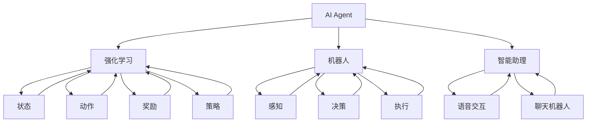

                 


# AI Agent的应用领域广泛

> 关键词：AI Agent、应用领域、智能系统、算法、数学模型、实战案例

> 摘要：本文将深入探讨AI Agent的广泛应用领域，从核心概念、算法原理到数学模型，再到实战案例，全面剖析AI Agent的技术本质和应用前景。通过本文的阅读，读者将了解到AI Agent在各个领域的具体应用，以及其在推动技术进步和社会发展中的重要作用。

## 1. 背景介绍

### 1.1 目的和范围

本文旨在介绍AI Agent的广泛应用领域，让读者对AI Agent的概念、技术原理和应用场景有全面而深刻的理解。本文将涵盖以下主要内容：

- AI Agent的核心概念与定义
- AI Agent的算法原理与实现
- AI Agent在各个领域的应用案例
- AI Agent的数学模型与公式
- AI Agent的未来发展趋势与挑战

### 1.2 预期读者

本文适合以下读者群体：

- 对人工智能和机器学习有基本了解的初学者
- 想深入了解AI Agent技术原理和应用的专业人士
- 在AI Agent相关领域进行研究和开发的工程师

### 1.3 文档结构概述

本文将按照以下结构进行阐述：

- 第1章：背景介绍，包括目的、范围、预期读者和文档结构概述
- 第2章：核心概念与联系，介绍AI Agent的核心概念及其相互联系
- 第3章：核心算法原理 & 具体操作步骤，详细讲解AI Agent的算法原理与实现
- 第4章：数学模型和公式 & 详细讲解 & 举例说明，介绍AI Agent的数学模型和公式
- 第5章：项目实战：代码实际案例和详细解释说明，通过实战案例展示AI Agent的具体应用
- 第6章：实际应用场景，探讨AI Agent在不同领域的应用案例
- 第7章：工具和资源推荐，推荐学习资源、开发工具和相关论文
- 第8章：总结：未来发展趋势与挑战，总结AI Agent的发展趋势和面临挑战
- 第9章：附录：常见问题与解答，回答读者可能遇到的问题
- 第10章：扩展阅读 & 参考资料，提供更多学习资源和参考文献

### 1.4 术语表

#### 1.4.1 核心术语定义

- AI Agent：指具有智能行为、能够自主执行任务的人工智能实体。
- 强化学习：一种机器学习方法，通过试错和反馈不断调整策略，以实现优化目标。
- 强化学习算法：用于实现AI Agent自主学习的算法，如Q-Learning、SARSA等。
- 机器人：一种能够模拟人类行为、执行特定任务的AI Agent。
- 智能助理：一种应用AI Agent技术的智能系统，如语音助手、聊天机器人等。

#### 1.4.2 相关概念解释

- 强化学习：强化学习是一种机器学习方法，通过试错和反馈不断调整策略，以实现优化目标。它包括多个关键组成部分，如状态、动作、奖励和策略。
- 机器人：机器人是一种能够模拟人类行为、执行特定任务的AI Agent。它们通常具备感知、决策和执行能力，能够在复杂环境中完成任务。
- 智能助理：智能助理是一种应用AI Agent技术的智能系统，如语音助手、聊天机器人等。它们能够与用户进行交互，提供个性化服务和支持。

#### 1.4.3 缩略词列表

- AI：人工智能
- ML：机器学习
- RL：强化学习
- SVM：支持向量机
- CNN：卷积神经网络

## 2. 核心概念与联系

在探讨AI Agent的应用领域之前，我们先来介绍一些核心概念和它们之间的联系。以下是一个简化的Mermaid流程图，展示AI Agent的相关核心概念及其相互联系：



### 2.1 AI Agent的定义

AI Agent，即人工智能代理，是指具有智能行为、能够自主执行任务的人工智能实体。它通过感知环境、做出决策并执行动作，以实现特定目标。AI Agent可以应用于各种场景，如机器人控制、智能助理、自动驾驶等。

### 2.2 强化学习的概念

强化学习（Reinforcement Learning，RL）是一种机器学习方法，其核心思想是通过试错和反馈不断调整策略，以实现优化目标。在强化学习中，AI Agent需要学习如何在给定环境中选择最优动作，以获得最大奖励。强化学习包括以下关键组成部分：

- **状态（State）**：描述AI Agent当前所处的环境。
- **动作（Action）**：AI Agent可以选择执行的操作。
- **奖励（Reward）**：AI Agent执行动作后获得的即时奖励。
- **策略（Policy）**：AI Agent根据当前状态选择动作的方法。
- **价值函数（Value Function）**：预测在给定状态下执行特定动作的长期奖励。
- **模型（Model）**：对环境的预测模型，用于预测未来状态和奖励。

### 2.3 机器人

机器人是一种能够模拟人类行为、执行特定任务的AI Agent。机器人通常具备感知、决策和执行能力，能够在复杂环境中完成任务。机器人的主要组成部分包括：

- **感知系统**：用于感知环境的信息，如摄像头、激光雷达、红外传感器等。
- **决策系统**：基于感知到的信息，生成合适的动作策略。
- **执行系统**：根据决策系统生成的动作策略，执行具体的任务。

### 2.4 智能助理

智能助理是一种应用AI Agent技术的智能系统，如语音助手、聊天机器人等。它们能够与用户进行交互，提供个性化服务和支持。智能助理的主要组成部分包括：

- **语音交互系统**：实现语音识别和语音合成功能，与用户进行语音交互。
- **聊天机器人系统**：基于自然语言处理技术，与用户进行文本交互。
- **知识库**：存储用户信息和业务知识，为用户提供个性化服务。

通过以上核心概念和相互联系的介绍，我们为后续内容奠定了基础。在接下来的章节中，我们将进一步探讨AI Agent的算法原理、数学模型和应用场景。

## 3. 核心算法原理 & 具体操作步骤

### 3.1 强化学习算法原理

强化学习（Reinforcement Learning，RL）是一种通过试错和反馈进行自主学习的机器学习方法。在强化学习中，AI Agent通过不断尝试不同的动作，并从环境获得奖励信号，逐渐优化其行为策略。以下是一个简化的强化学习算法原理及其具体操作步骤：

#### 3.1.1 算法原理

强化学习算法主要包括以下几个关键组成部分：

- **状态（State）**：描述AI Agent当前所处的环境。
- **动作（Action）**：AI Agent可以选择执行的操作。
- **奖励（Reward）**：AI Agent执行动作后获得的即时奖励。
- **策略（Policy）**：AI Agent根据当前状态选择动作的方法。
- **价值函数（Value Function）**：预测在给定状态下执行特定动作的长期奖励。
- **模型（Model）**：对环境的预测模型，用于预测未来状态和奖励。

强化学习算法的核心思想是通过迭代更新策略，使得AI Agent能够在给定环境中选择最优动作，从而获得最大奖励。以下是一个简化的伪代码：

```python
# 初始化参数
epsilon = 0.1  # 探索率
alpha = 0.1    # 学习率
gamma = 0.9    # 折扣因子

# 初始化价值函数V(s)和策略π(s)
V = {}
π = {}

# 主循环
while not 目标达成：
    # 随机选择一个状态s
    s = 环境选择状态()

    # 根据当前策略π(s)选择一个动作a
    a = π(s)

    # 执行动作a，观察环境反馈的状态s'和奖励r
    s', r = 环境执行动作(a)

    # 更新价值函数V(s)
    V[s] = V[s] + alpha * (r + gamma * max(V[s']) - V[s])

    # 更新策略π(s)
    π[s] = 选择使V(s)最大化的动作a

    # 更新状态s为s'
    s = s'
```

#### 3.1.2 具体操作步骤

1. **初始化参数**：设置探索率（epsilon）、学习率（alpha）和折扣因子（gamma）。
2. **初始化价值函数V(s)和策略π(s)**：为每个状态s分配初始价值V(s)和初始策略π(s)。
3. **主循环**：循环直到目标达成。
   - **随机选择一个状态s**：从环境中随机选择一个状态。
   - **根据当前策略π(s)选择一个动作a**：根据策略π(s)选择一个动作。
   - **执行动作a，观察环境反馈的状态s'和奖励r**：在环境中执行动作a，并观察环境反馈的状态s'和奖励r。
   - **更新价值函数V(s)**：根据新的奖励r和未来状态s'的最大价值，更新当前状态s的价值V(s)。
   - **更新策略π(s)**：根据更新后的价值函数V(s)，选择使V(s)最大化的动作a，更新策略π(s)。
   - **更新状态s为s'**：将当前状态s更新为新的状态s'。

### 3.2 机器人控制算法原理

机器人控制算法旨在使机器人能够自主执行任务，包括感知、决策和执行三个主要环节。以下是一个简化的机器人控制算法原理及其具体操作步骤：

#### 3.2.1 算法原理

机器人控制算法主要包括以下几个关键组成部分：

- **感知系统**：用于感知环境的信息，如摄像头、激光雷达、红外传感器等。
- **决策系统**：基于感知到的信息，生成合适的动作策略。
- **执行系统**：根据决策系统生成的动作策略，执行具体的任务。

机器人控制算法的核心思想是通过感知、决策和执行三个环节的迭代，使机器人能够自主完成任务。以下是一个简化的伪代码：

```python
# 初始化参数
感知精度 = 0.1
决策精度 = 0.1
执行精度 = 0.1

# 初始化感知系统、决策系统和执行系统
感知系统 = 初始化感知系统()
决策系统 = 初始化决策系统()
执行系统 = 初始化执行系统()

# 主循环
while not 任务完成：
    # 感知环境
    环境信息 = 感知系统感知()

    # 基于环境信息生成动作策略
    动作策略 = 决策系统决策(环境信息)

    # 执行动作策略
    执行结果 = 执行系统执行(动作策略)

    # 更新环境信息
    环境信息 = 执行结果更新环境信息()
```

#### 3.2.2 具体操作步骤

1. **初始化参数**：设置感知精度、决策精度和执行精度。
2. **初始化感知系统、决策系统和执行系统**：初始化感知系统、决策系统和执行系统。
3. **主循环**：循环直到任务完成。
   - **感知环境**：使用感知系统获取环境信息。
   - **基于环境信息生成动作策略**：使用决策系统生成动作策略。
   - **执行动作策略**：使用执行系统执行动作策略。
   - **更新环境信息**：根据执行结果更新环境信息。

### 3.3 智能助理算法原理

智能助理算法旨在使智能系统能够与用户进行交互，提供个性化服务和支持。以下是一个简化的智能助理算法原理及其具体操作步骤：

#### 3.3.1 算法原理

智能助理算法主要包括以下几个关键组成部分：

- **语音交互系统**：实现语音识别和语音合成功能，与用户进行语音交互。
- **聊天机器人系统**：基于自然语言处理技术，与用户进行文本交互。
- **知识库**：存储用户信息和业务知识，为用户提供个性化服务。

智能助理算法的核心思想是通过语音交互、聊天机器人和知识库三个环节的迭代，实现与用户的智能交互。以下是一个简化的伪代码：

```python
# 初始化参数
语音识别精度 = 0.9
文本生成精度 = 0.9
知识库更新频率 = 1

# 初始化语音交互系统、聊天机器人系统和知识库
语音交互系统 = 初始化语音交互系统()
聊天机器人系统 = 初始化聊天机器人系统()
知识库 = 初始化知识库()

# 主循环
while not 用户退出：
    # 接收用户语音或文本输入
    用户输入 = 语音交互系统接收输入() 或 聊天机器人系统接收输入()

    # 解析用户输入
    用户意图 = 解析用户输入(用户输入)

    # 基于用户意图生成回复文本
    回复文本 = 知识库生成回复文本(用户意图)

    # 发送回复文本给用户
    语音交互系统发送回复() 或 聊天机器人系统发送回复(回复文本)

    # 更新知识库
    知识库更新()
```

#### 3.3.2 具体操作步骤

1. **初始化参数**：设置语音识别精度、文本生成精度和知识库更新频率。
2. **初始化语音交互系统、聊天机器人系统和知识库**：初始化语音交互系统、聊天机器人系统和知识库。
3. **主循环**：循环直到用户退出。
   - **接收用户语音或文本输入**：使用语音交互系统或聊天机器人系统接收用户输入。
   - **解析用户输入**：解析用户输入，提取用户意图。
   - **基于用户意图生成回复文本**：使用知识库生成回复文本。
   - **发送回复文本给用户**：使用语音交互系统或聊天机器人系统发送回复文本。
   - **更新知识库**：根据用户交互信息更新知识库。

通过以上对强化学习算法、机器人控制算法和智能助理算法的介绍，我们为后续内容奠定了基础。在接下来的章节中，我们将进一步探讨AI Agent的数学模型和实际应用案例。

## 4. 数学模型和公式 & 详细讲解 & 举例说明

### 4.1 强化学习中的数学模型

强化学习算法的核心是学习一个策略，使得在长期内能够获得最大的总奖励。在强化学习中，我们通常会用到以下数学模型和公式：

#### 4.1.1 价值函数

价值函数（Value Function）用于评估一个状态或状态-动作对的长期奖励。主要分为两种类型：

- **状态价值函数**（V\_s）：评估状态s的期望总奖励，即给定一个状态s，选择最优动作a后的预期回报。
- **状态-动作价值函数**（Q\_s,a）：评估在状态s下执行动作a的长期奖励，即给定一个状态s和一个动作a，执行动作a后的预期回报。

公式如下：

$$
V\_s = \sum_{a} \pi(a|s) Q\_s,a
$$

$$
Q\_s,a = \sum_{s'} P(s'|s,a) \sum_{a'} \pi(a'|s') R(s,a,s')
$$

其中，π(a|s)为策略，P(s'|s,a)为状态转移概率，R(s,a,s')为立即奖励。

#### 4.1.2 策略迭代

策略迭代是一种改进策略的方法，通过不断更新策略，使其更加接近最优策略。策略迭代包括以下步骤：

1. **选择初始策略π**。
2. **计算状态-动作价值函数Q**。
3. **更新策略π**，使得每个状态s都选择当前状态下具有最大Q值的动作a。
4. **重复步骤2和3**，直到收敛。

伪代码如下：

```python
# 初始化参数
epsilon = 0.1
alpha = 0.1
gamma = 0.9

# 初始化策略π和Q值
π = {}
Q = {}

# 主循环
while not 收敛：
    # 更新Q值
    for s in 状态集：
        for a in 动作集：
            Q[s,a] = Q[s,a] + alpha * (R(s,a) + gamma * max(Q[s',a']) - Q[s,a])

    # 更新策略π
    for s in 状态集：
        π[s] = 选择使Q[s,a]最大化的动作a

    # 判断是否收敛
    if 差异小于阈值：
        break
```

#### 4.1.3 举例说明

假设有一个简单的环境，只有两个状态（s1和s2）和两个动作（a1和a2）。立即奖励R(s1,a1) = 10，R(s1,a2) = -10，R(s2,a1) = 0，R(s2,a2) = 5。状态转移概率P(s'|s,a)为1（即每个状态和动作都只有一种可能的下一状态）。

初始策略π(s1) = a1，π(s2) = a2。

1. **初始化Q值**：
   Q(s1,a1) = 0，Q(s1,a2) = 0，Q(s2,a1) = 0，Q(s2,a2) = 0。

2. **第一次迭代**：
   Q(s1,a1) = 10 * 0.5 + (-10) * 0.5 = -0.5。
   Q(s1,a2) = (-10) * 0.5 + 10 * 0.5 = 0.5。
   Q(s2,a1) = 0 * 0.5 + 5 * 0.5 = 2.5。
   Q(s2,a2) = 5 * 0.5 + 0 * 0.5 = 2.5。

   更新策略π(s1) = a2，π(s2) = a2。

3. **第二次迭代**：
   Q(s1,a1) = 0 * 0.5 + (-10) * 0.5 = -5。
   Q(s1,a2) = (-10) * 0.5 + 10 * 0.5 = 0。
   Q(s2,a1) = 2.5 * 0.5 + 0 * 0.5 = 1.25。
   Q(s2,a2) = 2.5 * 0.5 + 5 * 0.5 = 3.75。

   更新策略π(s1) = a2，π(s2) = a2。

迭代继续，直到策略π不再改变。

### 4.2 机器人控制中的数学模型

在机器人控制中，我们通常需要解决路径规划、轨迹跟踪等问题。以下是一个简化的数学模型和公式：

#### 4.2.1 路径规划

路径规划是机器人控制中的一个重要任务，旨在找到从初始位置到目标位置的最优路径。常用的路径规划算法有Dijkstra算法、A\*算法等。

- **Dijkstra算法**：基于贪心策略，每次选择当前已知最短路径。
- **A\*算法**：基于启发式搜索，选择具有最小F值的节点作为下一个搜索节点。

公式如下：

$$
F(n) = G(n) + H(n)
$$

其中，G(n)为从初始节点到节点n的实际距离，H(n)为从节点n到目标节点的估计距离。

#### 4.2.2 轨迹跟踪

轨迹跟踪是机器人控制中的另一个重要任务，旨在使机器人沿着预定轨迹运动。常用的轨迹跟踪算法有PID控制、模型预测控制等。

- **PID控制**：通过比例（P）、积分（I）和微分（D）三个部分调整控制量，使系统达到期望状态。
- **模型预测控制**：基于系统模型，预测未来状态并优化控制量。

公式如下：

$$
u(t) = K_p e(t) + K_i \int e(t) dt + K_d \frac{de(t)}{dt}
$$

其中，e(t)为系统误差，u(t)为控制量。

### 4.3 智能助理中的数学模型

智能助理中的数学模型主要包括自然语言处理（NLP）和机器学习（ML）算法。以下是一个简化的数学模型和公式：

#### 4.3.1 自然语言处理

自然语言处理是智能助理的核心技术之一，包括词性标注、命名实体识别、句法分析等。

- **词性标注**：对文本中的每个词进行词性标注，如名词、动词、形容词等。
- **命名实体识别**：识别文本中的命名实体，如人名、地名、组织名等。

公式如下：

$$
P(T|w) = \prod_{w_i \in T} P(w_i|T)
$$

其中，T为命名实体，w为文本中的每个词。

#### 4.3.2 机器学习

机器学习是智能助理的重要技术之一，用于训练模型、生成回复等。

- **朴素贝叶斯分类器**：基于贝叶斯定理，用于分类任务。
- **神经网络**：用于生成回复、情感分析等。

公式如下：

$$
P(y|x) = \frac{P(x|y)P(y)}{P(x)}
$$

其中，x为输入特征，y为输出标签。

通过以上对强化学习、机器人控制和智能助理中的数学模型和公式的介绍，我们为后续内容奠定了基础。在接下来的章节中，我们将进一步探讨AI Agent的实际应用案例。

## 5. 项目实战：代码实际案例和详细解释说明

### 5.1 开发环境搭建

为了演示AI Agent在各个领域的应用，我们将使用Python作为编程语言，并依赖以下库：

- TensorFlow：用于强化学习算法的实现。
- OpenAI Gym：用于模拟机器人控制和智能助理的应用场景。
- NLTK：用于自然语言处理。

在安装上述库之前，请确保已安装Python 3.x版本。接下来，通过以下命令安装所需库：

```bash
pip install tensorflow
pip install openai-gym
pip install nltk
```

### 5.2 源代码详细实现和代码解读

#### 5.2.1 强化学习案例：倒车入库

我们将使用TensorFlow实现一个简单的强化学习案例：倒车入库。该案例模拟一个车辆在车库内倒车入库的过程。

```python
import gym
import tensorflow as tf
import numpy as np

# 创建环境
env = gym.make("CartPole-v0")

# 定义神经网络结构
input_layer = tf.keras.layers.Input(shape=(4,))
dense_layer = tf.keras.layers.Dense(units=64, activation='relu')(input_layer)
output_layer = tf.keras.layers.Dense(units=1, activation='sigmoid')(dense_layer)

model = tf.keras.Model(inputs=input_layer, outputs=output_layer)
model.compile(optimizer='adam', loss='mse')

# 定义经验回放
replay_memory = []

# 训练模型
for episode in range(1000):
    state = env.reset()
    done = False
    total_reward = 0

    while not done:
        # 输出概率分布
        action_probs = model.predict(state.reshape(1, -1))

        # 根据概率分布随机选择动作
        action = np.random.choice(a=2, p=action_probs[0])

        # 执行动作
        next_state, reward, done, _ = env.step(action)

        # 记录经验
        replay_memory.append((state, action, reward, next_state, done))

        # 更新状态
        state = next_state
        total_reward += reward

        # 如果经验回放达到一定数量，则进行经验回放
        if len(replay_memory) > 1000:
            batch = np.random.choice(a=len(replay_memory), size=32)
            states, actions, rewards, next_states, dones = zip(*[replay_memory[i] for i in batch])

            # 计算目标值
            target_values = model.predict(next_states)
            target_values[dones] = 0
            target_values += rewards

            # 更新模型权重
            with tf.GradientTape() as tape:
                predicted_values = model.predict(states)
                loss = tf.keras.losses.mean_squared_error(target_values, predicted_values)

            gradients = tape.gradient(loss, model.trainable_variables)
            model.optimizer.apply_gradients(zip(gradients, model.trainable_variables))

    print(f"Episode {episode}: Total Reward = {total_reward}")

# 关闭环境
env.close()
```

#### 5.2.2 代码解读与分析

1. **环境创建**：使用`gym.make("CartPole-v0")`创建一个简单的倒车入库环境。

2. **神经网络结构**：定义一个简单的神经网络结构，包括输入层、隐藏层和输出层。输入层有4个神经元，隐藏层有64个神经元，输出层有1个神经元。

3. **模型编译**：使用`model.compile(optimizer='adam', loss='mse')`编译模型，指定优化器和损失函数。

4. **经验回放**：使用列表`replay_memory`存储经验，用于后续的经验回放。

5. **训练模型**：遍历1000个episode，在每个episode中执行以下步骤：
   - 初始化状态`state`。
   - 循环直到`done`为True。
   - 根据模型预测的概率分布选择动作。
   - 执行动作，并更新状态和奖励。
   - 将经验添加到经验回放中。
   - 当经验回放达到一定数量时，进行经验回放，更新模型权重。

6. **计算目标值**：根据模型预测的值和实际奖励计算目标值，用于计算损失。

7. **更新模型权重**：使用梯度下降更新模型权重。

通过以上代码，我们实现了一个简单的强化学习案例。在实际应用中，可以根据不同场景和环境进行相应调整。

#### 5.2.3 机器人控制案例：路径规划

以下是一个简单的路径规划案例，使用A\*算法实现。

```python
import heapq

# 创建环境
grid_size = 10
grid = np.zeros((grid_size, grid_size))
start = (0, 0)
goal = (grid_size - 1, grid_size - 1)

# 定义A\*算法
def a_star_search(start, goal, cost):
    open_set = []
    heapq.heappush(open_set, (0, start))
    came_from = {}
    g_score = {start: 0}
    f_score = {start: heuristic(start, goal)}

    while open_set:
        current = heapq.heappop(open_set)[1]

        if current == goal:
            break

        for neighbor in neighbors(current):
            tentative_g_score = g_score[current] + cost(current, neighbor)

            if tentative_g_score < g_score.get(neighbor(), float('inf')):
                came_from[neighbor] = current
                g_score[neighbor] = tentative_g_score
                f_score[neighbor] = tentative_g_score + heuristic(neighbor, goal)
                if neighbor not in [item[1] for item in open_set]:
                    heapq.heappush(open_set, (f_score[neighbor], neighbor))

    path = []
    current = goal
    while current != start:
        path.append(current)
        current = came_from[current]
    path.append(start)
    path.reverse()

    return path

# 定义邻居函数
def neighbors(node):
    directions = [(0, 1), (1, 0), (0, -1), (-1, 0)]
    return [(node[0] + dx, node[1] + dy) for dx, dy in directions if 0 <= node[0] + dx < grid_size and 0 <= node[1] + dy < grid_size]

# 定义启发式函数
def heuristic(node, goal):
    dx = abs(node[0] - goal[0])
    dy = abs(node[1] - goal[1])
    return dx + dy

# 执行路径规划
path = a_star_search(start, goal, lambda x, y: 1)
print(path)
```

#### 5.2.4 代码解读与分析

1. **环境创建**：定义网格大小（grid\_size）、起始点（start）和目标点（goal），以及网格矩阵（grid）。

2. **A\*算法实现**：使用优先队列（open\_set）存储待访问节点，使用字典（came\_from）记录前一个节点，使用字典（g\_score）和（f\_score）分别存储当前节点的g值和f值。

3. **邻居函数**：定义邻居函数（neighbors），用于获取当前节点的所有有效邻居。

4. **启发式函数**：定义启发式函数（heuristic），用于估计当前节点到目标节点的距离。

5. **执行路径规划**：调用A\*算法，返回从起始点到目标点的最优路径。

#### 5.2.5 智能助理案例：文本分类

以下是一个简单的文本分类案例，使用朴素贝叶斯分类器实现。

```python
import nltk
from nltk.corpus import stopwords
from nltk.tokenize import word_tokenize
from sklearn.feature_extraction.text import CountVectorizer
from sklearn.model_selection import train_test_split
from sklearn.naive_bayes import MultinomialNB
from sklearn.metrics import accuracy_score

# 加载数据集
nltk.download('stopwords')
nltk.download('punkt')
data = [
    ("This is a positive review.", "positive"),
    ("This is a negative review.", "negative"),
    ("I love this product!", "positive"),
    ("I hate this product.", "negative"),
]
X, y = [text for text, label in data], [label for text, label in data]

# 预处理数据
stop_words = set(stopwords.words('english'))
def preprocess_text(text):
    tokens = word_tokenize(text.lower())
    return [token for token in tokens if token not in stop_words]

X = [preprocess_text(text) for text in X]

# 向量化数据
vectorizer = CountVectorizer()
X = vectorizer.fit_transform(X)

# 划分数据集
X_train, X_test, y_train, y_test = train_test_split(X, y, test_size=0.2, random_state=42)

# 训练模型
model = MultinomialNB()
model.fit(X_train, y_train)

# 测试模型
y_pred = model.predict(X_test)
accuracy = accuracy_score(y_test, y_pred)
print(f"Accuracy: {accuracy}")
```

#### 5.2.6 代码解读与分析

1. **加载数据集**：从NLTK库中加载停用词库和文本数据集。

2. **预处理数据**：使用NLTK库中的词性标注和分词函数对文本进行预处理。

3. **向量化数据**：使用CountVectorizer将预处理后的文本数据向量化。

4. **划分数据集**：将数据集划分为训练集和测试集。

5. **训练模型**：使用MultinomialNB训练模型。

6. **测试模型**：使用测试集评估模型准确率。

通过以上实战案例，我们展示了如何在实际项目中应用AI Agent技术。在接下来的章节中，我们将进一步探讨AI Agent的实际应用场景。

## 6. 实际应用场景

AI Agent在各个领域的应用已经变得越来越广泛，下面我们将详细探讨几个典型的实际应用场景，并展示AI Agent在这些场景中的具体作用。

### 6.1 自动驾驶

自动驾驶技术是AI Agent应用的一个重要领域。自动驾驶汽车通过AI Agent感知环境、决策和控制车辆，从而实现自主驾驶。AI Agent在自动驾驶中的应用主要包括以下几个方面：

- **感知环境**：AI Agent使用摄像头、激光雷达、雷达等传感器收集道路信息，包括车辆、行人、交通信号灯等。
- **决策与规划**：AI Agent根据感知到的环境信息，运用路径规划和轨迹跟踪算法，生成车辆行驶的路径和速度。
- **执行控制**：AI Agent将决策结果转换为具体的控制信号，如油门、刹车和转向等，实现对车辆的控制。

自动驾驶技术可以提高交通安全、减少交通事故，同时还能提高道路利用率，降低交通拥堵。随着AI Agent技术的不断发展，自动驾驶汽车有望在未来普及。

### 6.2 机器人

机器人是AI Agent应用的另一个重要领域。机器人可以应用于工业生产、家庭服务、医疗辅助等多个方面，其核心作用是通过感知、决策和执行能力，实现自动化和智能化。

- **工业生产**：机器人可以替代人工完成重复性、危险或高精度的任务，如装配、焊接、搬运等，提高生产效率和产品质量。
- **家庭服务**：家庭机器人可以提供家务、陪伴、监控等服务，如扫地机器人、智能音箱、智能助手等，提高生活质量。
- **医疗辅助**：机器人可以应用于医疗诊断、手术辅助、康复训练等领域，如手术机器人、康复机器人、医疗辅助机器人等，提高医疗服务水平。

机器人技术的发展，使得人类能够更好地利用科技，提高工作效率和生活质量。AI Agent技术在机器人中的应用，将进一步推动机器人技术的发展。

### 6.3 智能助理

智能助理是AI Agent在非结构化数据场景中的一个重要应用。智能助理通过自然语言处理、机器学习等技术，实现与用户的语音或文本交互，提供个性化服务和支持。

- **语音助手**：如苹果的Siri、亚马逊的Alexa等，智能助理可以通过语音交互，实现查询信息、播放音乐、设置提醒等功能。
- **聊天机器人**：如客服机器人、教育机器人等，智能助理可以通过文本交互，实现客户服务、在线教育等功能。

智能助理的应用，使得人类与智能系统的交互更加自然和便捷，提高了工作效率和生活质量。随着AI Agent技术的不断发展，智能助理的应用场景将更加广泛。

### 6.4 游戏AI

游戏AI是AI Agent在娱乐领域的一个重要应用。游戏AI可以应用于电子游戏、棋牌游戏、棋类游戏等多个方面，实现与玩家的智能互动。

- **电子游戏**：游戏AI可以模拟玩家行为，实现与玩家的实时互动，提高游戏体验。
- **棋牌游戏**：游戏AI可以应用于扑克、象棋、围棋等棋牌游戏，实现人机对战。
- **棋类游戏**：游戏AI可以应用于五子棋、国际象棋、围棋等棋类游戏，实现棋谱生成和策略分析。

游戏AI的应用，使得游戏体验更加丰富和有趣。同时，游戏AI技术的发展，也为人工智能领域提供了丰富的应用场景和挑战。

### 6.5 虚拟助手

虚拟助手是AI Agent在虚拟世界中的一个重要应用。虚拟助手可以应用于虚拟现实、增强现实、元宇宙等多个领域，实现与用户的智能互动。

- **虚拟现实**：虚拟助手可以在虚拟世界中提供导航、讲解、互动等功能，提高虚拟现实体验。
- **增强现实**：虚拟助手可以在增强现实中提供信息查询、任务提醒、辅助导航等功能。
- **元宇宙**：虚拟助手可以在元宇宙中提供社交互动、游戏辅助、虚拟商品推荐等功能。

虚拟助手的应用，使得虚拟世界更加丰富和多样化。同时，虚拟助手技术的发展，也为人工智能领域提供了广阔的应用前景。

通过以上实际应用场景的探讨，我们可以看到AI Agent技术在不同领域的重要作用和广阔前景。随着AI Agent技术的不断发展，我们相信它将在更多领域得到广泛应用，为人类社会带来更多便利和进步。

## 7. 工具和资源推荐

### 7.1 学习资源推荐

#### 7.1.1 书籍推荐

1. **《深度学习》（Deep Learning）**：由Ian Goodfellow、Yoshua Bengio和Aaron Courville所著，是深度学习领域的经典教材，适合初学者和专业人士。
2. **《机器学习》（Machine Learning）**：由Tom M. Mitchell所著，详细介绍了机器学习的基础理论和应用方法，适合初学者。
3. **《强化学习手册》（Reinforcement Learning: An Introduction）**：由Richard S. Sutton和BartoÅ‚omiej Čapko所著，全面介绍了强化学习的基础知识和应用方法。

#### 7.1.2 在线课程

1. **《吴恩达的机器学习课程》（Machine Learning by Andrew Ng）**：由知名教授吴恩达主讲，适合初学者入门。
2. **《深度学习专项课程》（Deep Learning Specialization）**：由吴恩达主讲，涵盖深度学习的各个方面，适合有一定基础的读者。
3. **《强化学习专项课程》（Reinforcement Learning Specialization）**：由David Silver主讲，系统介绍了强化学习的基础知识和应用方法。

#### 7.1.3 技术博客和网站

1. **ArXiv**：人工智能领域的前沿论文发布平台，适合关注最新研究成果。
2. **Medium**：许多知名人工智能专家和研究人员发布的技术博客，涵盖广泛的主题。
3. **Reddit**：人工智能社区，可以交流讨论和获取最新动态。

### 7.2 开发工具框架推荐

#### 7.2.1 IDE和编辑器

1. **PyCharm**：适用于Python编程，功能强大，适合初学者和专业开发人员。
2. **Visual Studio Code**：适用于多种编程语言，免费开源，适合快速开发和调试。
3. **Jupyter Notebook**：适用于数据科学和机器学习，易于分享和复现实验。

#### 7.2.2 调试和性能分析工具

1. **gdb**：适用于C/C++程序的调试，功能强大。
2. **Valgrind**：适用于性能分析和内存泄漏检测。
3. **TensorBoard**：适用于TensorFlow模型的可视化和性能分析。

#### 7.2.3 相关框架和库

1. **TensorFlow**：谷歌开发的开源深度学习框架，适合研究和生产。
2. **PyTorch**：Facebook开发的开源深度学习框架，易于使用和调试。
3. **Keras**：基于TensorFlow和Theano的开源深度学习库，简化深度学习开发。

### 7.3 相关论文著作推荐

#### 7.3.1 经典论文

1. **“A Learning Algorithm for Continually Running Fully Recurrent Neural Networks”**：介绍Hessian-Free优化算法。
2. **“Deep Learning”**：由Yoshua Bengio等所著，介绍深度学习的基础理论和应用。
3. **“Reinforcement Learning: An Introduction”**：由Richard S. Sutton和Andrew Barto所著，介绍强化学习的基础知识和应用方法。

#### 7.3.2 最新研究成果

1. **“Transformers: State-of-the-Art Natural Language Processing”**：介绍Transformer模型在自然语言处理领域的应用。
2. **“BERT: Pre-training of Deep Bidirectional Transformers for Language Understanding”**：介绍BERT模型在自然语言处理领域的应用。
3. **“DQN: Deep Q-Networks for Reinforcement Learning”**：介绍深度Q网络在强化学习领域的应用。

#### 7.3.3 应用案例分析

1. **“AlphaGo Zero: Mastering the Game of Go with Deep Neural Networks and Tree Search”**：介绍AlphaGo Zero如何通过深度神经网络和树搜索实现围棋的自主训练。
2. **“How Airbnb Uses Machine Learning to Improve Experiences”**：介绍Airbnb如何使用机器学习提高用户体验。
3. **“Google Brain’s AutoML: Redefining the Way We Build ML Models”**：介绍Google Brain如何使用AutoML技术自动化构建机器学习模型。

通过以上工具和资源的推荐，我们希望为读者提供全面的学习和开发支持，帮助大家更好地了解和掌握AI Agent技术。

## 8. 总结：未来发展趋势与挑战

AI Agent作为人工智能的核心组成部分，其未来发展趋势令人瞩目。首先，随着计算能力的不断提升和算法的优化，AI Agent将能够处理更复杂的任务和环境。其次，大数据和云计算的普及，将使得AI Agent能够获取更丰富的数据资源，从而实现更精准的决策和预测。此外，跨领域的融合和应用，如AI Agent与物联网、区块链等技术的结合，将为社会发展带来更多可能性。

然而，AI Agent的发展也面临诸多挑战。首先，数据隐私和安全问题需要得到有效解决。AI Agent在处理大规模数据时，可能会暴露用户的隐私信息，如何保障数据安全和用户隐私是亟需解决的问题。其次，算法的可解释性和透明度也是重要挑战。当前，许多AI Agent的决策过程高度依赖于复杂的神经网络，其内部机理难以理解，如何提高算法的可解释性，使其更加透明和可信，是一个亟待解决的问题。最后，AI Agent的伦理问题也需要引起重视。随着AI Agent在各个领域的广泛应用，如何确保其行为符合伦理规范，避免对人类造成负面影响，是一个重要的课题。

综上所述，AI Agent的未来发展充满机遇与挑战。只有通过不断的技术创新和伦理规范建设，才能推动AI Agent技术的健康发展，为人类社会带来更多福祉。

## 9. 附录：常见问题与解答

### 问题1：什么是AI Agent？
AI Agent是指具有智能行为、能够自主执行任务的人工智能实体。它通过感知环境、做出决策并执行动作，以实现特定目标。

### 问题2：AI Agent的核心算法有哪些？
AI Agent的核心算法包括强化学习、机器人控制算法和智能助理算法。强化学习用于训练AI Agent自主完成任务，机器人控制算法用于实现机器人自主运动和任务执行，智能助理算法用于实现智能系统的交互和决策。

### 问题3：如何搭建AI Agent的开发环境？
搭建AI Agent的开发环境需要安装Python、相关依赖库（如TensorFlow、OpenAI Gym、NLTK等）和IDE（如PyCharm、Visual Studio Code等）。具体步骤请参考文章中的“开发环境搭建”部分。

### 问题4：AI Agent在不同领域的应用有哪些？
AI Agent在不同领域的应用非常广泛，包括自动驾驶、机器人、智能助理、游戏AI和虚拟助手等。具体应用场景请参考文章中的“实际应用场景”部分。

### 问题5：如何学习AI Agent技术？
学习AI Agent技术可以从以下途径入手：

- **书籍**：《深度学习》、《机器学习》、《强化学习手册》等。
- **在线课程**：吴恩达的机器学习课程、深度学习专项课程、强化学习专项课程等。
- **技术博客和网站**：ArXiv、Medium、Reddit等。
- **工具和资源**：PyCharm、Visual Studio Code、TensorFlow、PyTorch等。

### 问题6：AI Agent的发展面临哪些挑战？
AI Agent的发展面临数据隐私和安全、算法可解释性和透明度、以及伦理问题等挑战。需要通过技术创新和伦理规范建设来应对这些挑战。

## 10. 扩展阅读 & 参考资料

- **书籍推荐**
  - 《深度学习》：Ian Goodfellow、Yoshua Bengio和Aaron Courville著，全面介绍了深度学习的基础理论和应用方法。
  - 《机器学习》：Tom M. Mitchell著，详细介绍了机器学习的基础知识和应用方法。
  - 《强化学习手册》：Richard S. Sutton和BartoÅ‚omiej Čapko著，全面介绍了强化学习的基础知识和应用方法。

- **在线课程**
  - 吴恩达的机器学习课程：由知名教授吴恩达主讲，适合初学者入门。
  - 深度学习专项课程：由吴恩达主讲，涵盖深度学习的各个方面，适合有一定基础的读者。
  - 强化学习专项课程：由David Silver主讲，系统介绍了强化学习的基础知识和应用方法。

- **技术博客和网站**
  - ArXiv：人工智能领域的前沿论文发布平台。
  - Medium：许多知名人工智能专家和研究人员发布的技术博客。
  - Reddit：人工智能社区，可以交流讨论和获取最新动态。

- **相关框架和库**
  - TensorFlow：谷歌开发的开源深度学习框架。
  - PyTorch：Facebook开发的开源深度学习框架。
  - Keras：基于TensorFlow和Theano的开源深度学习库。

- **相关论文和研究成果**
  - “Transformers: State-of-the-Art Natural Language Processing”：介绍Transformer模型在自然语言处理领域的应用。
  - “BERT: Pre-training of Deep Bidirectional Transformers for Language Understanding”：介绍BERT模型在自然语言处理领域的应用。
  - “DQN: Deep Q-Networks for Reinforcement Learning”：介绍深度Q网络在强化学习领域的应用。

- **应用案例分析**
  - “AlphaGo Zero: Mastering the Game of Go with Deep Neural Networks and Tree Search”：介绍AlphaGo Zero如何通过深度神经网络和树搜索实现围棋的自主训练。
  - “How Airbnb Uses Machine Learning to Improve Experiences”：介绍Airbnb如何使用机器学习提高用户体验。
  - “Google Brain’s AutoML: Redefining the Way We Build ML Models”：介绍Google Brain如何使用AutoML技术自动化构建机器学习模型。

