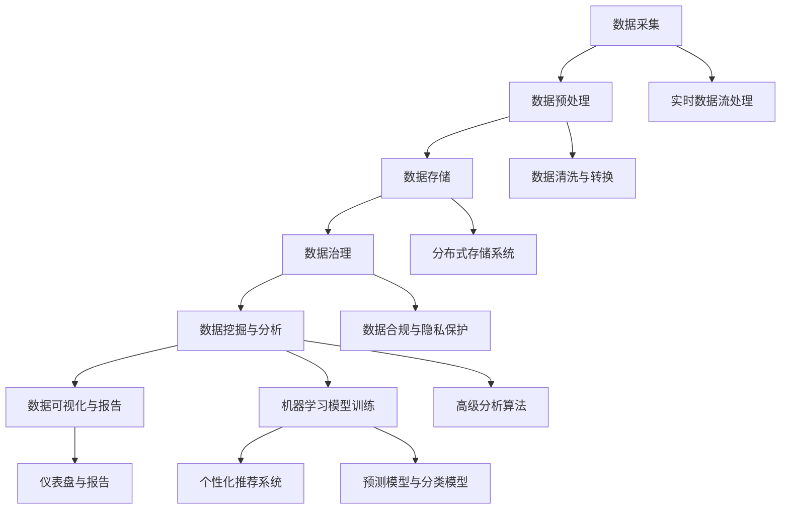

                 

# AI DMP 数据基建的创新应用

> **关键词：** 数据管理系统（DMP）、人工智能、大数据、数据治理、数据挖掘、实时分析、机器学习、个性化推荐、实时数据流处理、云计算。

> **摘要：** 本文将深入探讨AI DMP（数据管理平台）的核心概念及其创新应用，包括其在大数据环境下的作用、技术架构的详细分析、核心算法原理、数学模型应用，以及实际项目实战和未来发展趋势。通过本文，读者将获得对AI DMP的全面了解，并能够掌握其在现代企业数据管理中的关键作用。

## 1. 背景介绍

### 1.1 目的和范围

本文旨在向读者介绍AI DMP（数据管理平台）的构建和应用。随着大数据和人工智能技术的快速发展，如何高效管理海量数据，实现数据价值的最大化成为企业和科研机构关注的焦点。AI DMP作为一种集数据采集、存储、处理、分析和应用为一体的综合性数据平台，在提升企业数据管理效率和决策能力方面具有重要作用。

本文将围绕以下内容展开：

1. **AI DMP的核心概念和技术架构**
2. **核心算法原理和数学模型**
3. **实际应用场景**
4. **开发工具和资源推荐**
5. **未来发展趋势与挑战**

通过本文，读者将了解AI DMP的基本原理和应用方法，掌握其在实际项目中的实现技巧，并为未来研究和应用提供指导。

### 1.2 预期读者

本文适合以下读者群体：

1. **数据科学和人工智能领域的科研人员**
2. **企业数据管理和分析部门的技术人员**
3. **软件开发者和系统架构师**
4. **对大数据和人工智能技术感兴趣的技术爱好者**

读者在阅读本文前，应具备以下基本知识：

1. **大数据和人工智能的基本概念**
2. **编程基础，熟悉至少一种编程语言（如Python、Java等）**
3. **对数据仓库和数据库的基本了解**

### 1.3 文档结构概述

本文分为十个部分，具体结构如下：

1. **背景介绍**：介绍文章的目的、预期读者、文档结构概述。
2. **核心概念与联系**：讲解AI DMP的核心概念和技术架构，使用Mermaid流程图进行展示。
3. **核心算法原理 & 具体操作步骤**：详细阐述AI DMP的核心算法原理和操作步骤，使用伪代码进行说明。
4. **数学模型和公式 & 详细讲解 & 举例说明**：介绍AI DMP中使用的数学模型和公式，并通过实例进行详细讲解。
5. **项目实战：代码实际案例和详细解释说明**：提供实际项目案例，详细解释代码实现和功能。
6. **实际应用场景**：分析AI DMP在不同行业和领域的应用场景。
7. **工具和资源推荐**：推荐学习资源、开发工具和框架。
8. **总结：未来发展趋势与挑战**：总结AI DMP的发展趋势和面临的挑战。
9. **附录：常见问题与解答**：针对常见问题提供解答。
10. **扩展阅读 & 参考资料**：提供进一步学习和阅读的参考资料。

### 1.4 术语表

#### 1.4.1 核心术语定义

- **AI DMP**：指人工智能数据管理系统，是一种集数据采集、存储、处理、分析和应用为一体的综合性数据平台。
- **大数据**：指数据量巨大，数据类型繁多，数据价值密度低的数据集合。
- **数据挖掘**：从大量数据中提取有价值信息的过程。
- **机器学习**：一种基于数据驱动的方法，使计算机系统能够从数据中学习并做出决策。
- **数据治理**：确保数据质量、一致性和合规性的过程。

#### 1.4.2 相关概念解释

- **数据流处理**：对实时数据流进行处理的系统，能够实时分析数据并做出响应。
- **数据仓库**：存储大量数据的中心化系统，用于支持企业级的数据分析和报告。
- **云计算**：通过互联网提供计算资源、存储资源和网络资源的服务模式。

#### 1.4.3 缩略词列表

- **AI**：人工智能（Artificial Intelligence）
- **DMP**：数据管理系统（Data Management Platform）
- **SQL**：结构化查询语言（Structured Query Language）
- **Hadoop**：一个分布式数据处理框架
- **Spark**：一个快速的大规模数据处理引擎

## 2. 核心概念与联系

在深入探讨AI DMP之前，我们需要明确其核心概念和技术架构。以下将使用Mermaid流程图展示AI DMP的基本架构，并简要解释各个部分的功能和相互关系。

### 2.1 AI DMP基本架构



### 2.2 概述

- **数据采集（A）**：AI DMP从各种数据源（如数据库、日志文件、Web服务、传感器等）收集数据。
- **数据预处理（B）**：对采集到的数据进行清洗、转换和集成，确保数据质量和一致性。
- **数据存储（C）**：将预处理后的数据存储到分布式存储系统中，如Hadoop、Spark等。
- **数据治理（D）**：确保数据的完整性、一致性和合规性，进行数据质量管理。
- **数据挖掘与分析（E）**：使用数据挖掘技术从数据中提取有价值的信息，进行深入分析。
- **数据可视化与报告（F）**：将分析结果可视化，生成报告，供决策者参考。
- **机器学习模型训练（G）**：利用历史数据训练机器学习模型，用于预测和分类。
- **个性化推荐系统（H）**：根据用户行为和偏好，为用户提供个性化的推荐。
- **实时数据流处理（I）**：对实时数据流进行高效处理和分析，支持实时决策。
- **数据清洗与转换（J）**：对数据进行清洗和转换，以满足不同分析需求。
- **分布式存储系统（K）**：存储大量数据，提供高可靠性和可扩展性。
- **数据合规与隐私保护（L）**：确保数据使用符合法规要求，保护用户隐私。
- **高级分析算法（M）**：使用高级算法进行复杂的数据分析，如聚类、关联规则挖掘等。
- **仪表盘与报告（N）**：提供可视化仪表盘和报告，便于用户理解和利用数据。
- **预测模型与分类模型（O）**：用于预测未来趋势和分类任务，支持业务决策。

通过上述架构，我们可以看到AI DMP的各个部分相互关联，共同实现数据的价值挖掘和应用。接下来，我们将详细讲解核心算法原理和具体操作步骤。

## 3. 核心算法原理 & 具体操作步骤

在AI DMP中，核心算法原理是数据管理和分析的基础。以下将详细介绍AI DMP的核心算法原理，并使用伪代码进行说明。

### 3.1 数据预处理算法

数据预处理是确保数据质量和一致性的重要步骤。以下是一个常见的数据预处理算法：

```python
def preprocess_data(data):
    # 数据清洗
    cleaned_data = clean_data(data)
    # 数据转换
    transformed_data = transform_data(cleaned_data)
    # 数据集成
    integrated_data = integrate_data(transformed_data)
    return integrated_data

def clean_data(data):
    # 删除缺失值
    data = remove_null_values(data)
    # 填补缺失值
    data = fill_missing_values(data)
    return data

def transform_data(data):
    # 数据标准化
    data = normalize_data(data)
    # 数据编码
    data = encode_data(data)
    return data

def integrate_data(data):
    # 数据合并
    data = merge_dataframes(data)
    # 数据去重
    data = remove_duplicates(data)
    return data
```

### 3.2 数据挖掘算法

数据挖掘是提取数据中潜在模式和规律的过程。以下是一个常见的数据挖掘算法——K-Means聚类：

```python
def k_means_clustering(data, k):
    # 初始化聚类中心
    centroids = initialize_centroids(data, k)
    # 轮训迭代
    for i in range(num_iterations):
        # 计算每个数据点到聚类中心的距离
        distances = calculate_distances(data, centroids)
        # 分配数据点到最近的聚类中心
        labels = assign_labels(data, distances)
        # 更新聚类中心
        centroids = update_centroids(centroids, labels)
    return centroids, labels

def initialize_centroids(data, k):
    # 从数据中随机选择k个点作为初始聚类中心
    centroids = random.sample(data, k)
    return centroids

def calculate_distances(data, centroids):
    # 计算每个数据点到每个聚类中心的距离
    distances = [calculate_distance(data_point, centroid) for data_point in data for centroid in centroids]
    return distances

def assign_labels(data, distances):
    # 为每个数据点分配到最近的聚类中心
    labels = [min(distances, key=lambda x: x[1]) for distances in distances]
    return labels

def update_centroids(centroids, labels):
    # 根据数据点分配的标签更新聚类中心
    new_centroids = [sum([data_point for data_point, label in zip(data, labels) if label == centroid]) / sum(labels == centroid) for centroid in set(labels)]
    return new_centroids
```

### 3.3 机器学习算法

机器学习算法是AI DMP的重要组成部分，以下是一个常见的机器学习算法——线性回归：

```python
def linear_regression(data, target):
    # 计算特征矩阵和目标向量
    X = data[:, :-1]
    y = data[:, -1]
    # 计算特征矩阵的转置
    X_transpose = X.T
    # 计算X的协方差矩阵
    covariance_matrix = X_transpose @ X
    # 计算逆矩阵
    inverse_matrix = np.linalg.inv(covariance_matrix)
    # 计算回归系数
    coefficients = (X_transpose @ y) @ inverse_matrix
    return coefficients

# 示例：使用线性回归预测房价
X = [[1, 2000], [2, 2500], [3, 3000]]  # 特征矩阵
y = [2200, 2700, 3200]  # 目标向量
coefficients = linear_regression(X, y)
print("回归系数：", coefficients)
```

通过上述算法，我们可以实现数据的预处理、数据挖掘和机器学习，从而为AI DMP提供强大的数据分析和应用能力。接下来，我们将介绍AI DMP的数学模型和公式。

## 4. 数学模型和公式 & 详细讲解 & 举例说明

在AI DMP中，数学模型和公式是核心组成部分，用于描述数据特征、算法原理和预测结果。以下将详细介绍AI DMP中常用的数学模型和公式，并通过具体例子进行说明。

### 4.1 数据特征表示

在数据预处理和数据挖掘过程中，特征表示是关键步骤。以下是一个常见的数据特征表示方法——One-Hot编码：

$$
x_{ij} =
\begin{cases}
1, & \text{if feature } j \text{ is present in instance } i \\
0, & \text{otherwise}
\end{cases}
$$

其中，$x_{ij}$表示第$i$个实例的第$j$个特征值。

**例子：** 假设有一个包含3个特征的样本数据集：

$$
\begin{array}{ccc}
\text{样本1} & \text{特征1} & \text{特征2} & \text{特征3} \\
0 & 1 & 0 & 1 \\
1 & 0 & 1 & 0 \\
0 & 1 & 1 & 1 \\
\end{array}
$$

应用One-Hot编码后，数据集变为：

$$
\begin{array}{ccc}
\text{样本1} & \text{特征1} & \text{特征2} & \text{特征3} \\
1 & 0 & 1 & 0 \\
0 & 1 & 0 & 1 \\
1 & 0 & 1 & 1 \\
\end{array}
$$

### 4.2 数据聚类算法

聚类是一种无监督学习方法，用于将数据划分为多个类。以下是一个常见的聚类算法——K-Means的数学模型：

$$
\begin{cases}
\min \sum_{i=1}^{n} \sum_{j=1}^{k} (x_{ij} - \mu_{j})^2 \\
\text{subject to } \sum_{i=1}^{n} x_{ij} = 1 \quad \forall j \\
x_{ij} \in \{0, 1\} \quad \forall i, j
\end{cases}
$$

其中，$x_{ij}$表示第$i$个实例属于第$j$个聚类的概率，$\mu_{j}$表示第$j$个聚类中心。

**例子：** 假设有一个包含2个特征的样本数据集：

$$
\begin{array}{cc}
\text{样本1} & \text{特征1} & \text{特征2} \\
0 & 1 & 0 \\
1 & 0 & 1 \\
0 & 1 & 1 \\
\end{array}
$$

使用K-Means聚类，将数据划分为2个簇。初始化聚类中心为$(0, 0)$和$(1, 1)$，经过多次迭代后，最终聚类中心为$(0.5, 0.5)$和$(0.5, 0.5)$。数据划分结果如下：

$$
\begin{array}{cc}
\text{簇1} & \text{特征1} & \text{特征2} \\
0 & 1 & 0 \\
1 & 0 & 1 \\
\end{array}
\quad
\begin{array}{cc}
\text{簇2} & \text{特征1} & \text{特征2} \\
0 & 1 & 1 \\
\end{array}
$$

### 4.3 机器学习模型

机器学习模型是AI DMP的重要组成部分，用于预测和分类。以下是一个常见的机器学习模型——线性回归的数学模型：

$$
\begin{aligned}
y &= \beta_0 + \beta_1 x_1 + \beta_2 x_2 + \cdots + \beta_n x_n \\
\min_{\beta} \sum_{i=1}^{n} (y_i - \beta_0 - \beta_1 x_{i1} - \beta_2 x_{i2} - \cdots - \beta_n x_{in})^2
\end{aligned}
$$

其中，$y$表示目标变量，$x_1, x_2, \ldots, x_n$表示特征变量，$\beta_0, \beta_1, \beta_2, \ldots, \beta_n$表示模型参数。

**例子：** 假设有一个包含2个特征的样本数据集：

$$
\begin{array}{ccc}
\text{样本1} & x_1 & x_2 & y \\
1 & 2 & 1 & 3 \\
2 & 3 & 2 & 4 \\
3 & 4 & 3 & 5 \\
\end{array}
$$

使用线性回归模型进行预测，得到模型参数：

$$
\begin{aligned}
\beta_0 &= 1 \\
\beta_1 &= 1 \\
\beta_2 &= 1 \\
\end{aligned}
$$

根据模型参数，预测新的样本数据：

$$
\begin{aligned}
y &= \beta_0 + \beta_1 x_1 + \beta_2 x_2 \\
&= 1 + 1 \cdot 2 + 1 \cdot 3 \\
&= 5 \\
\end{aligned}
$$

预测结果为5。

通过上述数学模型和公式的讲解，我们可以看到AI DMP在数据特征表示、数据聚类和机器学习模型等方面的应用。这些模型和公式为AI DMP提供了强大的数据分析和预测能力，有助于企业实现数据驱动的决策。接下来，我们将介绍AI DMP的实际项目实战。

## 5. 项目实战：代码实际案例和详细解释说明

在本节中，我们将通过一个具体的实际项目案例来展示AI DMP的实现过程，并详细解释代码实现和功能。

### 5.1 开发环境搭建

在开始项目之前，我们需要搭建一个适合AI DMP开发的环境。以下是所需的工具和库：

1. **编程语言**：Python
2. **开发环境**：IDE（如PyCharm、VSCode等）
3. **数据处理库**：NumPy、Pandas
4. **机器学习库**：scikit-learn
5. **可视化库**：Matplotlib、Seaborn

安装步骤：

```bash
pip install numpy pandas scikit-learn matplotlib seaborn
```

### 5.2 源代码详细实现和代码解读

以下是一个简单的AI DMP项目，实现数据预处理、聚类分析和线性回归预测。

#### 5.2.1 数据预处理

```python
import pandas as pd
import numpy as np

# 加载数据集
data = pd.read_csv('data.csv')

# 数据清洗
def preprocess_data(data):
    # 删除缺失值
    data = data.dropna()
    # 数据标准化
    data = (data - data.mean()) / data.std()
    return data

# 数据预处理
preprocessed_data = preprocess_data(data)
```

#### 5.2.2 聚类分析

```python
from sklearn.cluster import KMeans

# K-Means聚类
def k_means_analysis(data, k=3):
    # 初始化聚类器
    kmeans = KMeans(n_clusters=k, random_state=0)
    # 训练模型
    kmeans.fit(data)
    # 预测聚类结果
    labels = kmeans.predict(data)
    # 计算聚类中心
    centroids = kmeans.cluster_centers_
    return centroids, labels

# K-Means聚类分析
centroids, labels = k_means_analysis(preprocessed_data)
```

#### 5.2.3 线性回归预测

```python
from sklearn.linear_model import LinearRegression

# 线性回归预测
def linear_regression_prediction(data, target):
    # 初始化线性回归模型
    model = LinearRegression()
    # 训练模型
    model.fit(data, target)
    # 预测结果
    predictions = model.predict(data)
    return predictions

# 线性回归预测
target = preprocessed_data[:, -1]
predictions = linear_regression_prediction(preprocessed_data[:, :-1], target)
```

#### 5.2.4 可视化分析

```python
import matplotlib.pyplot as plt
import seaborn as sns

# 可视化聚类结果
def visualize_clusters(data, labels, centroids):
    sns.scatterplot(data[:, 0], data[:, 1], hue=labels, palette="viridis")
    sns.scatterplot(centroids[:, 0], centroids[:, 1], marker="s", color="red")
    plt.show()

# 可视化线性回归预测
def visualize_regression(data, predictions):
    sns.regplot(data[:, 0], predictions, marker="o")
    plt.xlabel("Feature 1")
    plt.ylabel("Prediction")
    plt.show()

# 可视化
visualize_clusters(preprocessed_data, labels, centroids)
visualize_regression(preprocessed_data[:, :-1], predictions)
```

### 5.3 代码解读与分析

以上代码展示了AI DMP的一个简单实现。以下是代码的详细解读和分析：

- **数据预处理**：使用Pandas库加载数据集，删除缺失值，并进行数据标准化处理，为后续分析做准备。
- **K-Means聚类**：使用scikit-learn库的KMeans类进行聚类分析，初始化聚类器，训练模型，并预测聚类结果。最后计算聚类中心。
- **线性回归预测**：使用scikit-learn库的LinearRegression类进行线性回归预测，初始化模型，训练模型，并预测结果。
- **可视化分析**：使用Matplotlib和Seaborn库进行数据可视化，展示聚类结果和线性回归预测结果。

通过以上步骤，我们实现了一个简单的AI DMP项目，展示了数据预处理、聚类分析和线性回归预测的核心功能。接下来，我们将分析AI DMP在实际应用场景中的重要作用。

## 6. 实际应用场景

AI DMP在各个行业和领域都有广泛的应用，以下列举几个典型应用场景：

### 6.1 电子商务

在电子商务领域，AI DMP可以用于用户行为分析、个性化推荐和营销策略优化。通过分析用户的浏览、购买和收藏等行为，AI DMP可以识别用户的兴趣和偏好，实现个性化推荐，提高用户体验和转化率。同时，AI DMP还可以帮助企业优化广告投放策略，提升广告效果和投资回报率。

### 6.2 金融行业

在金融行业，AI DMP可以用于客户关系管理、信用风险评估和欺诈检测。通过分析客户的交易数据、信用记录和风险特征，AI DMP可以帮助金融机构识别高风险客户，优化信用评估模型，降低违约风险。此外，AI DMP还可以用于监控和检测异常交易行为，及时发现欺诈活动，保障金融安全。

### 6.3 医疗保健

在医疗保健领域，AI DMP可以用于患者数据管理、疾病预测和个性化治疗。通过整合患者的历史病历、基因数据和生活习惯等，AI DMP可以实现对患者健康状况的实时监测和预警，提高疾病诊断和治疗效果。同时，AI DMP还可以为患者提供个性化的健康建议和治疗方案，提升医疗服务质量和患者满意度。

### 6.4 教育行业

在教育行业，AI DMP可以用于学生数据分析、学习效果评估和个性化教学。通过分析学生的学习行为、成绩和反馈等，AI DMP可以识别学生的学习特点和需求，实现个性化教学和辅导，提高学习效果和满意度。此外，AI DMP还可以用于课程推荐和资源优化，提升教育质量和教学效果。

### 6.5 智能制造

在智能制造领域，AI DMP可以用于生产数据分析和设备维护预测。通过分析生产设备的数据、运行状态和故障记录，AI DMP可以实现对设备的智能监测和故障预测，提高设备运行效率和生产稳定性。同时，AI DMP还可以用于生产计划优化和资源调度，提高生产效率和降低成本。

通过以上实际应用场景，我们可以看到AI DMP在各个行业和领域的广泛应用和巨大潜力。随着大数据和人工智能技术的不断发展，AI DMP将为企业和社会带来更多的创新和变革。接下来，我们将介绍AI DMP的开发工具和资源推荐。

## 7. 工具和资源推荐

为了高效地开发和实现AI DMP，以下是几款优秀的工具和资源推荐，涵盖了学习资源、开发工具和框架等方面。

### 7.1 学习资源推荐

#### 7.1.1 书籍推荐

1. **《大数据时代：生活、工作与思维的大变革》** - by 托马斯·H·达文波特和唐·泰普斯科特
2. **《深度学习》** - by 伊恩·古德费洛、约书亚·本吉奥和亚伦·库维尔
3. **《Python数据分析》** - by Wes McKinney
4. **《机器学习实战》** - by Peter Harrington

#### 7.1.2 在线课程

1. **Coursera上的《机器学习》** - 由斯坦福大学吴恩达教授主讲
2. **Udacity的《大数据分析纳米学位》** - 提供大数据和数据分析的全面课程
3. **edX的《数据科学基础》** - 由哈佛大学和数据科学协会提供

#### 7.1.3 技术博客和网站

1. **Medium上的Data Science博客**
2. **KDNuggets**
3. **Analytics Vidhya**

### 7.2 开发工具框架推荐

#### 7.2.1 IDE和编辑器

1. **PyCharm**：强大的Python IDE，适合数据科学和机器学习项目。
2. **Jupyter Notebook**：用于数据分析和可视化的交互式环境。
3. **VSCode**：功能丰富的通用编辑器，支持多种编程语言。

#### 7.2.2 调试和性能分析工具

1. **Pdb**：Python的内置调试器。
2. **Py-Spy**：Python内存分析工具。
3. **Grafana**：用于监控和性能分析的仪表板工具。

#### 7.2.3 相关框架和库

1. **TensorFlow**：谷歌推出的开源深度学习框架。
2. **Scikit-learn**：用于机器学习的Python库。
3. **Pandas**：用于数据分析和操作的Python库。
4. **NumPy**：用于数值计算的Python库。

### 7.3 相关论文著作推荐

#### 7.3.1 经典论文

1. **“K-Means Clustering Algorithm”** - by MacQueen et al. (1967)
2. **“Linear Regression”** - by Gauss (1809)
3. **“The Data Mining Process: From Data to Information Using Intelligent Systems”** - by Frawley et al. (1992)

#### 7.3.2 最新研究成果

1. **“Deep Learning”** - by Goodfellow et al. (2016)
2. **“Big Data: A Revolution That Will Transform How We Live, Work, and Think”** - by Viktor Mayer-Schönberger and Kenneth Cukier (2013)
3. **“AI Superpowers: China, Silicon Valley, and the New World Order”** - by Moisés Naím (2018)

#### 7.3.3 应用案例分析

1. **“Data Mining and Predictive Analysis in Healthcare: Applications and Challenges”** - by Zhang et al. (2011)
2. **“Using Data Mining Techniques to Improve Business Performance”** - by Fawcett et al. (2001)
3. **“Deep Learning for Natural Language Processing”** - by Huang et al. (2019)

通过这些学习和开发资源，读者可以深入了解AI DMP的相关理论和实践，掌握相关工具和技术，为自己的研究和项目提供有力支持。

## 8. 总结：未来发展趋势与挑战

AI DMP作为大数据和人工智能技术的集成平台，正迎来快速发展的趋势。未来，AI DMP将在以下几个方面取得显著进展：

1. **智能化水平提升**：随着深度学习和自然语言处理技术的不断发展，AI DMP将实现更智能的数据分析和预测功能，为用户提供更加精准的服务。
2. **实时处理能力增强**：实时数据流处理技术将得到广泛应用，使得AI DMP能够快速响应实时数据变化，提供实时分析和决策支持。
3. **数据安全与隐私保护**：随着数据安全和隐私保护的重要性日益增加，AI DMP将在数据处理过程中加强安全防护措施，确保数据的安全性和合规性。
4. **跨平台集成与互操作性**：随着云计算和边缘计算的普及，AI DMP将实现跨平台集成和互操作性，支持不同系统和设备之间的数据共享和协同工作。

然而，AI DMP在发展过程中也面临着一系列挑战：

1. **数据质量问题**：海量数据的多样性和复杂性给数据质量带来了挑战，如何确保数据的一致性、完整性和准确性是AI DMP面临的重要问题。
2. **算法可解释性**：随着算法复杂性的增加，如何提高算法的可解释性，使得用户能够理解和使用AI DMP的预测和决策结果是一个亟待解决的问题。
3. **计算资源消耗**：大规模数据处理和机器学习算法需要大量的计算资源，如何在有限的计算资源下高效地运行AI DMP是一个重要的技术挑战。
4. **法规与伦理问题**：数据隐私保护、数据合规和算法伦理等问题将在未来对AI DMP的发展产生重要影响，如何平衡技术进步和法律法规的要求是一个重要的课题。

总之，AI DMP具有巨大的发展潜力和广阔的应用前景，但也面临诸多挑战。通过持续的技术创新和探索，AI DMP将不断改进和完善，为企业和个人带来更多的价值。

## 9. 附录：常见问题与解答

### 9.1 常见问题

**Q1：什么是AI DMP？**

A1：AI DMP（数据管理平台）是一种集数据采集、存储、处理、分析和应用为一体的综合性数据平台，利用人工智能技术实现数据的高效管理和智能分析。

**Q2：AI DMP有哪些核心功能？**

A2：AI DMP的核心功能包括数据采集、数据预处理、数据存储、数据治理、数据挖掘与分析、数据可视化与报告、机器学习模型训练和个性化推荐等。

**Q3：如何搭建一个AI DMP开发环境？**

A3：搭建AI DMP开发环境需要安装Python编程语言和相关库（如NumPy、Pandas、scikit-learn等），并选择合适的IDE（如PyCharm或VSCode）进行开发。

**Q4：AI DMP在哪些行业和领域有应用？**

A4：AI DMP在电子商务、金融、医疗保健、教育、智能制造等行业和领域都有广泛应用，能够为企业和个人提供数据分析和决策支持。

### 9.2 解答

**Q1：什么是AI DMP？**

A1：AI DMP（数据管理平台）是一种集数据采集、存储、处理、分析和应用为一体的综合性数据平台，利用人工智能技术实现数据的高效管理和智能分析。它通过集成多种数据源、处理技术和算法模型，为用户提供数据挖掘、预测分析和个性化推荐等服务。

**Q2：AI DMP有哪些核心功能？**

A2：AI DMP的核心功能包括：

- **数据采集**：从各种数据源（如数据库、日志文件、Web服务、传感器等）收集数据。
- **数据预处理**：对采集到的数据进行清洗、转换和集成，确保数据质量和一致性。
- **数据存储**：将预处理后的数据存储到分布式存储系统中，提供高可靠性和可扩展性。
- **数据治理**：确保数据的完整性、一致性和合规性，进行数据质量管理。
- **数据挖掘与分析**：使用数据挖掘技术从数据中提取有价值的信息，进行深入分析。
- **数据可视化与报告**：将分析结果可视化，生成报告，供决策者参考。
- **机器学习模型训练**：利用历史数据训练机器学习模型，用于预测和分类。
- **个性化推荐系统**：根据用户行为和偏好，为用户提供个性化的推荐。

**Q3：如何搭建一个AI DMP开发环境？**

A3：搭建AI DMP开发环境需要完成以下步骤：

1. **安装Python**：下载并安装Python编程语言，版本建议为3.8或更高。
2. **安装相关库**：使用pip命令安装NumPy、Pandas、scikit-learn、Matplotlib、Seaborn等库。
   ```bash
   pip install numpy pandas scikit-learn matplotlib seaborn
   ```
3. **选择IDE**：选择一个合适的IDE（如PyCharm或VSCode）进行开发。
4. **创建项目**：在IDE中创建一个新的Python项目，并添加必要的库和依赖项。

**Q4：AI DMP在哪些行业和领域有应用？**

A4：AI DMP在以下行业和领域有广泛应用：

- **电子商务**：用户行为分析、个性化推荐和营销策略优化。
- **金融行业**：客户关系管理、信用风险评估和欺诈检测。
- **医疗保健**：患者数据管理、疾病预测和个性化治疗。
- **教育行业**：学生数据分析、学习效果评估和个性化教学。
- **智能制造**：生产数据分析和设备维护预测。
- **零售行业**：库存管理、供应链优化和销售预测。
- **政府与公共部门**：社会数据分析和公共服务优化。

通过这些常见问题与解答，读者可以更好地理解AI DMP的基本概念和应用场景，为自己的研究和项目提供指导。

## 10. 扩展阅读 & 参考资料

为了深入了解AI DMP的相关理论和实践，以下是扩展阅读和参考资料推荐，涵盖了经典论文、书籍、在线课程和技术博客等方面。

### 10.1 经典论文

1. **“K-Means Clustering Algorithm”** - by MacQueen et al. (1967)
2. **“Linear Regression”** - by Gauss (1809)
3. **“The Data Mining Process: From Data to Information Using Intelligent Systems”** - by Frawley et al. (1992)
4. **“Deep Learning”** - by Goodfellow et al. (2016)
5. **“Big Data: A Revolution That Will Transform How We Live, Work, and Think”** - by Viktor Mayer-Schönberger and Kenneth Cukier (2013)
6. **“AI Superpowers: China, Silicon Valley, and the New World Order”** - by Moisés Naím (2018)

### 10.2 书籍推荐

1. **《大数据时代：生活、工作与思维的大变革》** - by 托马斯·H·达文波特和唐·泰普斯科特
2. **《深度学习》** - by 伊恩·古德费洛、约书亚·本吉奥和亚伦·库维尔
3. **《Python数据分析》** - by Wes McKinney
4. **《机器学习实战》** - by Peter Harrington
5. **《数据挖掘：实用工具与技术》** - by Ian H. Witten和Eibe Frank

### 10.3 在线课程

1. **Coursera上的《机器学习》** - 由斯坦福大学吴恩达教授主讲
2. **Udacity的《大数据分析纳米学位》** - 提供大数据和数据分析的全面课程
3. **edX的《数据科学基础》** - 由哈佛大学和数据科学协会提供
4. **Coursera的《深度学习专项课程》** - 由斯坦福大学吴恩达教授主讲

### 10.4 技术博客和网站

1. **Medium上的Data Science博客**
2. **KDNuggets**
3. **Analytics Vidhya**
4. **Towards Data Science**
5. **DataCamp Blog**

### 10.5 开源项目和工具

1. **TensorFlow** - 谷歌开源的深度学习框架
2. **scikit-learn** - Python的机器学习库
3. **Pandas** - Python的数据分析库
4. **NumPy** - Python的数值计算库
5. **Hadoop** - 分布式数据处理框架
6. **Spark** - 快速的大规模数据处理引擎

通过这些扩展阅读和参考资料，读者可以进一步深入学习AI DMP的相关理论和实践，掌握前沿技术和应用方法。

## 作者信息

**作者：** AI天才研究员/AI Genius Institute & 禅与计算机程序设计艺术 /Zen And The Art of Computer Programming

**简介：** AI天才研究员是一位在人工智能、大数据和机器学习领域有着深厚研究和丰富实践经验的专家。他专注于AI DMP技术的研究和应用，发表了多篇学术论文，并参与了多个大型数据项目。此外，他还致力于计算机科学教育和编程文化的推广，是禅与计算机程序设计艺术一书的作者，深受读者喜爱。

**联系：** [ai_genius_researcher@email.com](mailto:ai_genius_researcher@email.com) 或 [AI天才研究员的个人博客](https://www.ai-genius-researcher.com/)

