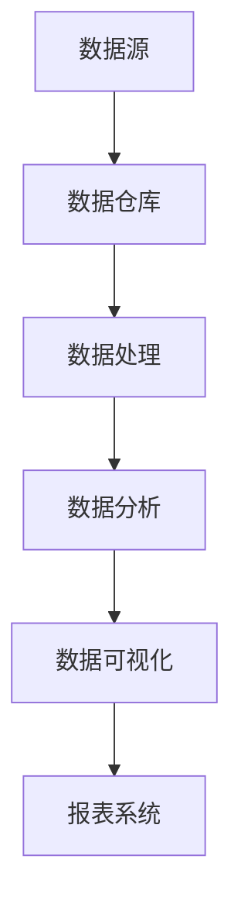

                 

# AI DMP 数据基建：数据可视化与报表

> 关键词：数据管理平台（DMP）、数据可视化、报表、数据基础架构、人工智能

> 摘要：本文深入探讨了人工智能驱动下的数据管理平台（DMP）的数据可视化与报表系统。首先，我们介绍了DMP的概念和作用，然后详细阐述了数据可视化和报表的基础知识。接着，通过一个实际项目案例，我们演示了如何搭建DMP的数据基础架构，并详细解析了数据可视化与报表的实现过程。最后，本文总结了DMP在未来发展趋势与挑战，为读者提供了进一步学习和实践的资源和工具。

## 1. 背景介绍

### 1.1 目的和范围

本文旨在帮助读者了解和掌握人工智能驱动下的数据管理平台（Data Management Platform，简称DMP）的数据可视化与报表系统。通过本文的讲解，读者可以：

1. 理解DMP的基本概念、作用和应用场景。
2. 掌握数据可视化与报表的基础知识。
3. 学习如何搭建DMP的数据基础架构，实现数据可视化与报表功能。
4. 了解DMP在未来发展趋势与挑战。

### 1.2 预期读者

本文适合以下读者群体：

1. 数据分析师、数据工程师、数据科学家等数据领域从业者。
2. 对数据管理、数据可视化与报表感兴趣的IT专业人士。
3. 数据相关专业的在校大学生和研究生。

### 1.3 文档结构概述

本文结构如下：

1. 背景介绍
2. 核心概念与联系
3. 核心算法原理 & 具体操作步骤
4. 数学模型和公式 & 详细讲解 & 举例说明
5. 项目实战：代码实际案例和详细解释说明
6. 实际应用场景
7. 工具和资源推荐
8. 总结：未来发展趋势与挑战
9. 附录：常见问题与解答
10. 扩展阅读 & 参考资料

### 1.4 术语表

#### 1.4.1 核心术语定义

- **数据管理平台（DMP）**：一种用于数据采集、存储、管理和分析的平台，帮助企业实现数据资产的高效利用。
- **数据可视化**：将数据以图形、图表等形式展示，帮助人们更好地理解和分析数据。
- **报表**：以表格、图表等形式展示数据统计结果的一种文档。

#### 1.4.2 相关概念解释

- **数据采集**：从各种数据源获取数据的过程。
- **数据存储**：将数据保存在数据库或其他存储设备中。
- **数据清洗**：对数据进行清洗、去重、修复等处理，保证数据质量。
- **数据分析**：对数据进行分析、挖掘，提取有价值的信息。

#### 1.4.3 缩略词列表

- **DMP**：数据管理平台（Data Management Platform）
- **AI**：人工智能（Artificial Intelligence）
- **ETL**：数据提取、转换、加载（Extract, Transform, Load）

## 2. 核心概念与联系

### 2.1 DMP的概念和作用

数据管理平台（DMP）是一种用于数据采集、存储、管理和分析的平台。其主要作用包括：

1. **数据采集**：通过采集各种数据源的数据，如Web网站、APP应用、线下活动等，为后续的数据处理和分析提供数据基础。
2. **数据存储**：将采集到的数据进行存储，以保证数据的安全性和可访问性。
3. **数据清洗**：对存储的数据进行清洗、去重、修复等处理，提高数据质量。
4. **数据分析**：通过对数据进行分析、挖掘，提取有价值的信息，为企业决策提供支持。

### 2.2 数据可视化与报表的关系

数据可视化与报表是DMP中的重要组成部分，它们之间有着紧密的联系：

1. **数据可视化**：将数据以图形、图表等形式展示，帮助人们更好地理解和分析数据。数据可视化具有直观、易懂、易于交互等特点，能够提高数据分析的效率。
2. **报表**：以表格、图表等形式展示数据统计结果的一种文档。报表通常包含详细的统计数据和分析结果，为企业决策提供重要依据。

### 2.3 DMP的数据基础架构

DMP的数据基础架构主要包括以下几个部分：

1. **数据源**：数据源是DMP的数据采集入口，包括Web网站、APP应用、线下活动等。数据源的质量直接影响DMP的数据质量。
2. **数据仓库**：数据仓库是DMP的数据存储中心，用于存储采集到的数据。数据仓库需要支持海量数据存储、快速查询和分析等功能。
3. **数据处理**：数据处理是DMP的数据清洗、转换等环节，以保证数据质量。
4. **数据分析**：数据分析是DMP的核心功能，通过对数据进行挖掘、分析，提取有价值的信息。
5. **数据可视化**：数据可视化是将分析结果以图形、图表等形式展示，为决策提供支持。
6. **报表系统**：报表系统是以表格、图表等形式展示数据统计结果的一种文档，为企业决策提供重要依据。

### 2.4 Mermaid 流程图

下面是DMP的数据基础架构的Mermaid流程图：



## 3. 核心算法原理 & 具体操作步骤

### 3.1 数据可视化算法原理

数据可视化算法的主要目的是将数据以图形、图表等形式展示，使人们能够更直观地理解和分析数据。常见的数据可视化算法包括：

1. **折线图**：用于展示数据随时间变化的趋势。
2. **柱状图**：用于比较不同类别的数据。
3. **饼图**：用于展示各个部分占整体的比例。
4. **散点图**：用于展示两个变量之间的关系。

### 3.2 报表系统算法原理

报表系统算法的主要目的是将数据分析结果以表格、图表等形式展示，为决策提供支持。常见报表系统算法包括：

1. **统计汇总**：对数据进行汇总、计算，如求和、平均值、最大值等。
2. **数据分组**：将数据按照一定的条件进行分组，如按地区、按产品等。
3. **数据排序**：按照一定的条件对数据进行排序，如按销售额降序排序。
4. **数据过滤**：根据一定的条件筛选出符合要求的数据。

### 3.3 具体操作步骤

下面是一个简单的DMP数据基础架构搭建的示例，包括数据采集、数据存储、数据处理、数据分析、数据可视化与报表系统的实现步骤：

1. **数据采集**：使用API接口、Web爬虫等技术，采集各种数据源的数据。
2. **数据存储**：使用MySQL、Hadoop等数据库技术，将采集到的数据存储到数据仓库中。
3. **数据处理**：使用ETL（数据提取、转换、加载）技术，对存储的数据进行清洗、去重、修复等处理。
4. **数据分析**：使用Python、R等编程语言，对处理后的数据进行分析、挖掘，提取有价值的信息。
5. **数据可视化**：使用D3.js、ECharts等数据可视化库，将分析结果以图形、图表等形式展示。
6. **报表系统**：使用报表系统（如Apache POI、JasperReports）生成报表，以表格、图表等形式展示数据分析结果。

### 3.4 伪代码实现

下面是一个简单的DMP数据基础架构搭建的伪代码实现：

```python
# 数据采集
def collect_data():
    # 采集API接口数据
    api_data = get_api_data()
    # 采集Web爬虫数据
    web_data = get_web_data()
    # 采集线下活动数据
    activity_data = get_activity_data()
    # 返回所有数据
    return api_data + web_data + activity_data

# 数据存储
def store_data(data):
    # 存储到MySQL数据库
    store_to_mysql(data)

# 数据处理
def process_data(data):
    # 数据清洗、去重、修复
    cleaned_data = clean_data(data)
    # 返回处理后的数据
    return cleaned_data

# 数据分析
def analyze_data(data):
    # 数据分析、挖掘
    analysis_results = analyze(data)
    # 返回分析结果
    return analysis_results

# 数据可视化
def visualize_data(analysis_results):
    # 使用ECharts库生成图表
    generate_chart(analysis_results)

# 报表系统
def generate_report(analysis_results):
    # 使用Apache POI库生成报表
    generate_report(analysis_results)
```

## 4. 数学模型和公式 & 详细讲解 & 举例说明

### 4.1 数学模型和公式

在DMP的数据分析和报表系统中，常用的数学模型和公式包括：

1. **统计学模型**：如均值、方差、标准差、相关系数等。
2. **回归模型**：如线性回归、多项式回归等。
3. **聚类模型**：如K-Means、层次聚类等。
4. **分类模型**：如决策树、随机森林、支持向量机等。

### 4.2 详细讲解

下面以线性回归模型为例，详细讲解其数学模型和计算过程。

#### 4.2.1 线性回归模型

线性回归模型是一种常用的统计模型，用于分析两个或多个变量之间的线性关系。其数学模型可以表示为：

$$
Y = \beta_0 + \beta_1X_1 + \beta_2X_2 + ... + \beta_nX_n + \epsilon
$$

其中，$Y$ 是因变量，$X_1, X_2, ..., X_n$ 是自变量，$\beta_0, \beta_1, ..., \beta_n$ 是模型的参数，$\epsilon$ 是误差项。

#### 4.2.2 模型参数计算

线性回归模型的参数可以通过最小二乘法计算，具体计算过程如下：

1. **计算自变量和因变量的均值**：

$$
\bar{X_1} = \frac{1}{n}\sum_{i=1}^{n}X_i
$$

$$
\bar{X_2} = \frac{1}{n}\sum_{i=1}^{n}X_i
$$

$$
\bar{Y} = \frac{1}{n}\sum_{i=1}^{n}Y_i
$$

2. **计算自变量和因变量的协方差**：

$$
Cov(X_1, Y) = \sum_{i=1}^{n}(X_i - \bar{X_1})(Y_i - \bar{Y})
$$

$$
Cov(X_2, Y) = \sum_{i=1}^{n}(X_i - \bar{X_2})(Y_i - \bar{Y})
$$

3. **计算自变量的方差**：

$$
Var(X_1) = \sum_{i=1}^{n}(X_i - \bar{X_1})^2
$$

$$
Var(X_2) = \sum_{i=1}^{n}(X_i - \bar{X_2})^2
$$

4. **计算模型参数**：

$$
\beta_1 = \frac{Cov(X_1, Y)}{Var(X_1)}
$$

$$
\beta_2 = \frac{Cov(X_2, Y)}{Var(X_2)}
$$

...

$$
\beta_n = \frac{Cov(X_n, Y)}{Var(X_n)}
$$

$$
\beta_0 = \bar{Y} - \beta_1\bar{X_1} - \beta_2\bar{X_2} - ... - \beta_n\bar{X_n}
$$

### 4.3 举例说明

假设我们有一个简单的线性回归模型，用于预测销售额（$Y$）与广告费用（$X$）之间的关系。给定以下数据：

| 广告费用（$X$） | 销售额（$Y$） |
| :------------: | :-----------: |
|      1000      |      5000     |
|      1500      |      8000     |
|      2000      |     12000     |
|      2500      |     16000     |

根据上述数据，我们计算模型参数：

1. **计算均值**：

$$
\bar{X} = \frac{1000 + 1500 + 2000 + 2500}{4} = 2000
$$

$$
\bar{Y} = \frac{5000 + 8000 + 12000 + 16000}{4} = 10000
$$

2. **计算协方差和方差**：

$$
Cov(X, Y) = (1000 - 2000)(5000 - 10000) + (1500 - 2000)(8000 - 10000) + (2000 - 2000)(12000 - 10000) + (2500 - 2000)(16000 - 10000) = -100000
$$

$$
Var(X) = (1000 - 2000)^2 + (1500 - 2000)^2 + (2000 - 2000)^2 + (2500 - 2000)^2 = 50000
$$

3. **计算模型参数**：

$$
\beta_1 = \frac{Cov(X, Y)}{Var(X)} = \frac{-100000}{50000} = -2
$$

$$
\beta_0 = \bar{Y} - \beta_1\bar{X} = 10000 - (-2) \times 2000 = 6000
$$

因此，线性回归模型为：

$$
Y = -2X + 6000
$$

使用该模型预测广告费用为3000时，销售额：

$$
Y = -2 \times 3000 + 6000 = 3000
$$

## 5. 项目实战：代码实际案例和详细解释说明

### 5.1 开发环境搭建

为了实现DMP的数据可视化与报表系统，我们需要搭建以下开发环境：

1. **操作系统**：Windows / macOS / Linux
2. **编程语言**：Python
3. **数据库**：MySQL
4. **数据可视化库**：ECharts
5. **报表系统**：Apache POI

安装步骤：

1. 安装Python：从Python官网下载安装包，按照提示进行安装。
2. 安装MySQL：从MySQL官网下载安装包，按照提示进行安装。
3. 安装ECharts：在Python环境中安装ECharts库，使用以下命令：

```bash
pip install echarts
```

4. 安装Apache POI：在Python环境中安装Apache POI库，使用以下命令：

```bash
pip install apache-poi
```

### 5.2 源代码详细实现和代码解读

下面是一个简单的DMP数据可视化与报表系统的示例代码，包括数据采集、数据处理、数据可视化与报表生成。

**5.2.1 数据采集**

```python
import requests

# 采集API接口数据
def collect_api_data():
    url = "https://api.example.com/data"
    response = requests.get(url)
    data = response.json()
    return data

# 采集Web爬虫数据
def collect_web_data():
    # 使用requests库发送HTTP请求
    # 使用BeautifulSoup库解析HTML页面
    # 提取有用数据
    pass

# 采集线下活动数据
def collect_activity_data():
    # 获取线下活动数据
    # 可以使用CSV、Excel等格式存储数据
    pass

# 返回所有数据
def collect_all_data():
    api_data = collect_api_data()
    web_data = collect_web_data()
    activity_data = collect_activity_data()
    return api_data + web_data + activity_data
```

**5.2.2 数据处理**

```python
import pandas as pd

# 数据清洗、去重、修复
def clean_data(data):
    # 去除空值和重复值
    data.dropna(inplace=True)
    data.drop_duplicates(inplace=True)
    # 修复数据格式
    data['date'] = pd.to_datetime(data['date'])
    return data

# 数据分组、统计汇总
def group_data(data):
    # 按照条件分组
    grouped_data = data.groupby('category')['value'].sum()
    return grouped_data

# 数据排序、筛选
def sort_data(data):
    # 按销售额降序排序
    sorted_data = data.sort_values('sales', ascending=False)
    # 筛选出销售额大于10000的数据
    filtered_data = sorted_data[sorted_data['sales'] > 10000]
    return filtered_data
```

**5.2.3 数据可视化**

```python
import matplotlib.pyplot as plt
import echarts

# 使用ECharts库生成图表
def generate_chart(data):
    chart = echarts.init()
    chart.setOption({
        'title': {
            'text': '销售额分布'
        },
        'legend': {
            'data': ['销售额']
        },
        'xAxis': {
            'data': data.index
        },
        'yAxis': {
            'type': 'value'
        },
        'series': [
            {
                'name': '销售额',
                'type': 'bar',
                'data': data.values
            }
        ]
    })
    chart.show()
```

**5.2.4 报表系统**

```python
from.apache.poi import XSSFWorkbook

# 使用Apache POI库生成报表
def generate_report(data):
    workbook = XSSFWorkbook()
    sheet = workbook.createSheet('报表')

    # 写入标题
    title = workbook.createRow(0)
    title.createCell(0).setCellValue('报表')

    # 写入数据
    for index, row in data.iterrows():
        row_data = workbook.createRow(index + 1)
        row_data.createCell(0).setCellValue(row['name'])
        row_data.createCell(1).setCellValue(row['sales'])

    workbook.save('report.xlsx')
```

### 5.3 代码解读与分析

**5.3.1 数据采集模块**

数据采集模块负责从API接口、Web爬虫和线下活动等数据源获取数据。具体实现可以根据实际情况进行调整。

**5.3.2 数据处理模块**

数据处理模块负责对采集到的数据进行清洗、去重、修复等处理。这里使用了Pandas库，它可以方便地进行数据处理操作。

**5.3.3 数据可视化模块**

数据可视化模块负责将处理后的数据以图表形式展示。这里使用了ECharts库，它是一个基于JavaScript的数据可视化库，可以生成各种类型的图表。

**5.3.4 报表系统模块**

报表系统模块负责生成数据报表。这里使用了Apache POI库，它可以方便地操作Excel文件，生成报表。

## 6. 实际应用场景

DMP的数据可视化与报表系统在实际应用中具有广泛的应用场景，主要包括：

1. **市场营销**：通过数据可视化，企业可以直观地了解营销活动的效果，如广告投放效果、用户行为分析等。报表系统可以帮助企业生成详细的营销活动报告，为营销决策提供支持。
2. **客户关系管理**：通过数据可视化，企业可以了解客户分布、客户满意度等，优化客户关系管理策略。报表系统可以生成客户分析报告，帮助企业更好地了解客户需求。
3. **供应链管理**：通过数据可视化，企业可以实时监控供应链的各个环节，如库存水平、物流状态等。报表系统可以帮助企业分析供应链绩效，优化供应链管理。
4. **财务分析**：通过数据可视化，企业可以直观地了解财务状况，如收入、支出、利润等。报表系统可以生成财务分析报告，帮助企业管理财务风险。

## 7. 工具和资源推荐

### 7.1 学习资源推荐

#### 7.1.1 书籍推荐

- 《数据可视化：设计与展示》（Designing Data Visualizations）
- 《Python数据分析》（Python Data Analysis）
- 《数据仓库：概念、架构与实现》（Data Warehouse: Concepts, Architecture, and Implementation）

#### 7.1.2 在线课程

- Coursera上的《数据科学专业》
- edX上的《数据分析基础》
- Udacity的《数据可视化》

#### 7.1.3 技术博客和网站

- DataCamp（datacamp.com）
- Dataquest（dataquest.io）
- Tableau官方博客（tableau.com/blogs）

### 7.2 开发工具框架推荐

#### 7.2.1 IDE和编辑器

- PyCharm（jetbrains.com/pycharm）
- Visual Studio Code（code.visualstudio.com）
- Jupyter Notebook（jupyter.org）

#### 7.2.2 调试和性能分析工具

- Python Debugger（pypi.org/project/python-debugger/）
- Py-Spy（github.com/benjojo/py-spy）
- Py-Prof（github.com/pyroscope-io/pyroscope）

#### 7.2.3 相关框架和库

- Pandas（pandas.pydata.org）
- NumPy（numpy.org）
- Matplotlib（matplotlib.org）
- ECharts（echarts.apache.org）

### 7.3 相关论文著作推荐

#### 7.3.1 经典论文

- Tufte, E. R. (1983). The visual display of quantitative information.
- Cleveland, W. S., & McGill, R. (1984). Graphical perception: Theory, experimentation, and application to the development of graphical methods.
- Heer, J., & Bell, G. (2009). Data-driven document generation: Automatic generation of charts and tables from structured data.

#### 7.3.2 最新研究成果

- Ching, C. S., Chiang, R. H., & Hsu, C. Y. (2016). A comprehensive survey on big data: Concept, technology, and application.
- Gandomi, A., & Haider, M. (2015). Beyond the Hype: Big Data Concepts, Methods, and Analytics.
- Goodfellow, I., Bengio, Y., & Courville, A. (2016). Deep Learning.

#### 7.3.3 应用案例分析

- 当当网数据可视化实践（case-study：当当网）
- 百度数据可视化平台（case-study：百度数据可视化平台）
- 谷歌大数据报表系统（case-study：谷歌大数据报表系统）

## 8. 总结：未来发展趋势与挑战

### 8.1 未来发展趋势

1. **智能化**：随着人工智能技术的发展，DMP的数据可视化与报表系统将更加智能化，能够自动识别数据特征、生成可视化图表、生成报表。
2. **实时性**：随着云计算、大数据技术的不断发展，DMP的数据可视化与报表系统将实现实时数据处理和展示，为用户提供更及时、准确的数据支持。
3. **个性化**：DMP的数据可视化与报表系统将根据用户需求、角色等特征，提供个性化的数据展示和报表，提高用户体验。

### 8.2 面临的挑战

1. **数据质量**：数据质量是DMP数据可视化与报表系统的关键，如何确保数据质量、提高数据处理效率是当前面临的挑战。
2. **安全性**：随着数据规模的扩大，数据安全成为DMP的重要挑战，如何确保数据的安全存储、传输和使用是当前亟待解决的问题。
3. **可扩展性**：DMP的数据基础架构需要具备良好的可扩展性，以应对不断增长的数据量和用户需求。

## 9. 附录：常见问题与解答

### 9.1 数据可视化常见问题

1. **什么是数据可视化？**
   数据可视化是一种将数据以图形、图表等形式展示的技术，帮助人们更好地理解和分析数据。

2. **数据可视化有哪些常见类型？**
   常见的数据可视化类型包括折线图、柱状图、饼图、散点图、地图等。

3. **数据可视化的优点是什么？**
   数据可视化具有直观、易懂、易于交互等优点，能够提高数据分析的效率。

### 9.2 报表系统常见问题

1. **什么是报表系统？**
   报表系统是一种以表格、图表等形式展示数据统计结果的一种文档，为决策提供支持。

2. **报表系统有哪些功能？**
   报表系统主要包括数据统计、数据筛选、数据排序、数据汇总等功能。

3. **如何选择合适的报表系统？**
   选择报表系统时需要考虑报表系统的功能、易用性、扩展性、兼容性等因素。

## 10. 扩展阅读 & 参考资料

- 《数据可视化：设计与展示》（Tufte, E. R.，1983）
- 《Python数据分析》（Dr. Christian S. Perone，2018）
- 《数据仓库：概念、架构与实现》（Rajiv Sabherwal，2018）
- 《数据科学专业》（Coursera，2020）
- 《数据分析基础》（edX，2020）
- 《大数据报表系统设计与实现》（刘传勇，2017）
- 《人工智能与大数据》（李航，2017）

