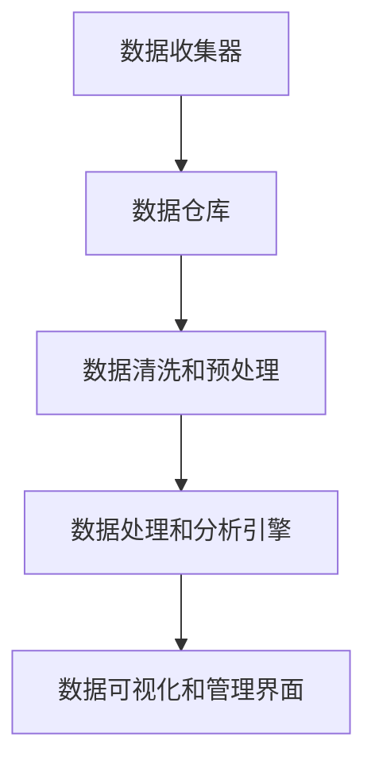

                 

# AI DMP 数据基建：数据安全与隐私保护

> **关键词：数据管理平台（DMP）、数据隐私保护、数据加密、安全协议、区块链、人工智能应用**
> 
> **摘要：本文深入探讨数据管理平台（DMP）在构建数据基础设施过程中的重要性，特别是在确保数据安全与隐私保护方面。通过分析核心概念、算法原理、数学模型和实际应用案例，本文揭示了当前最佳实践，为读者提供了关于如何构建安全、可靠的DMP的全面指南。**

## 1. 背景介绍

### 1.1 目的和范围

数据管理平台（DMP）作为现代数据基础设施的核心，其作用日益显著。然而，在数据日益成为企业核心资产的同时，数据安全和隐私保护也变得越来越重要。本文旨在探讨DMP在数据安全与隐私保护方面的关键作用，为读者提供构建安全、可靠的DMP的指导。

本文主要涵盖以下内容：
- 数据管理平台的基本概念和功能；
- 数据安全与隐私保护的核心问题和挑战；
- 相关的核心概念和算法原理；
- 实际项目中的具体实施方法和案例；
- 未来发展趋势与挑战。

### 1.2 预期读者

本文面向以下读者群体：
- 数据科学家和数据工程师；
- 数据管理和安全专家；
- 人工智能和机器学习开发者；
- 对数据安全和隐私保护感兴趣的任何技术从业者。

### 1.3 文档结构概述

本文结构如下：
- 第1章：背景介绍，概述目的、范围和预期读者；
- 第2章：核心概念与联系，介绍DMP的基本概念和相关架构；
- 第3章：核心算法原理与操作步骤，详细讲解数据加密和隐私保护算法；
- 第4章：数学模型和公式，介绍支持数据安全和隐私保护的理论基础；
- 第5章：项目实战，展示一个实际项目的代码实现和解释；
- 第6章：实际应用场景，讨论DMP在不同领域的应用；
- 第7章：工具和资源推荐，推荐学习资源和开发工具；
- 第8章：总结：未来发展趋势与挑战；
- 第9章：附录：常见问题与解答；
- 第10章：扩展阅读与参考资料。

### 1.4 术语表

#### 1.4.1 核心术语定义

- **数据管理平台（DMP）**：一个用于收集、存储、管理和分析数据的平台，旨在帮助企业更有效地利用其数据资产。
- **数据安全**：确保数据在存储、传输和处理过程中不会被未授权访问、篡改或泄露。
- **隐私保护**：防止个人身份信息和敏感数据被不当使用或公开。
- **数据加密**：通过将数据转换为密文，防止未经授权的访问。
- **安全协议**：用于保护数据在网络上传输的安全措施和规则。

#### 1.4.2 相关概念解释

- **区块链**：一个去中心化的分布式数据库，用于记录交易和信息的不可篡改的账本。
- **人工智能**：模拟人类智能行为的计算系统，包括学习、推理和自我修复等能力。

#### 1.4.3 缩略词列表

- **DMP**：数据管理平台
- **AI**：人工智能
- **ML**：机器学习
- **DL**：深度学习
- **GDPR**：通用数据保护条例

## 2. 核心概念与联系

### 2.1 数据管理平台（DMP）的基本概念

数据管理平台（DMP）是一个用于收集、存储、管理和分析数据的基础设施。它为企业提供了一个统一的视角来访问和利用其数据资产。DMP的核心功能包括：

- **数据收集**：从各种数据源（如网站、应用程序、数据库等）收集数据。
- **数据存储**：存储和管理收集到的数据，包括结构化和非结构化数据。
- **数据处理**：清洗、转换和整合数据，使其可用于分析和挖掘。
- **数据分析**：通过数据挖掘、机器学习和统计分析等方法，从数据中提取有价值的信息和洞见。
- **数据分发**：将分析结果和洞见提供给相关决策者和业务部门。

### 2.2 DMP与数据安全、隐私保护的关系

数据安全和隐私保护是DMP不可或缺的重要组成部分。随着数据泄露和数据滥用事件的频发，确保数据的安全和隐私变得越来越重要。DMP在数据安全和隐私保护方面的作用主要体现在以下几个方面：

- **访问控制**：通过用户身份验证、权限管理和加密技术，确保只有授权用户才能访问数据。
- **数据加密**：对敏感数据进行加密，防止未授权的访问和泄露。
- **安全审计**：记录和分析数据访问和使用情况，以发现潜在的安全威胁和隐私泄露风险。
- **数据匿名化**：通过去标识化等技术，将个人身份信息从数据中去除，以保护个人隐私。
- **合规性**：确保DMP的设计和操作符合相关的法律法规和标准，如GDPR、CCPA等。

### 2.3 DMP的架构

DMP的架构通常包括以下关键组件：

1. **数据收集器**：负责从不同的数据源收集数据，可以是API接口、爬虫、日志文件等。
2. **数据仓库**：用于存储和管理收集到的数据，可以是关系型数据库、NoSQL数据库或分布式文件系统。
3. **数据清洗和预处理模块**：负责清洗、转换和整合数据，使其适用于分析和挖掘。
4. **数据处理和分析引擎**：负责执行数据分析和挖掘任务，可以使用机器学习、统计分析等方法。
5. **数据可视化和管理界面**：提供用户友好的界面，用于数据访问、分析和报告。

### 2.4 Mermaid流程图

下面是一个简化的DMP架构的Mermaid流程图：



### 2.5 DMP与数据安全和隐私保护的最佳实践

在构建DMP时，确保数据安全和隐私保护的最佳实践包括：

- **数据分类和分级**：根据数据的敏感程度和重要性，对数据进行分类和分级，并采取相应的安全措施。
- **多重身份验证**：使用双重或多重身份验证技术，如密码、令牌、生物识别等，确保只有授权用户才能访问系统。
- **数据加密**：对敏感数据使用加密技术，确保数据在存储和传输过程中是安全的。
- **访问控制策略**：制定细粒度的访问控制策略，确保只有授权用户可以访问特定的数据。
- **安全审计和日志记录**：实施安全审计和日志记录机制，以监测和记录数据访问和使用情况。
- **合规性和隐私政策**：确保DMP的设计和操作符合相关的法律法规和标准，并制定清晰的隐私政策。

## 3. 核心算法原理与具体操作步骤

### 3.1 数据加密算法原理

数据加密是确保数据安全和隐私保护的关键技术之一。加密的基本原理是通过将数据转换为密文，使得只有拥有密钥的授权用户才能解密和读取原始数据。

以下是几种常见的数据加密算法及其原理：

#### 3.1.1 对称加密

对称加密算法使用相同的密钥进行加密和解密。常见的对称加密算法包括AES（高级加密标准）和DES（数据加密标准）。

**AES加密算法原理：**
- **密钥生成**：生成一个128位、192位或256位的密钥。
- **初始化**：将密钥和初始化向量（IV）输入到加密算法中。
- **加密过程**：将明文数据分成128位块，对每个块进行加密。
- **解密过程**：使用相同的密钥和IV对密文进行解密。

**伪代码：**

```python
# AES加密
def encrypt_aes(plaintext, key, iv):
    # 初始化加密算法
    cipher = AES.new(key, AES.MODE_CBC, iv)
    # 分块加密
    ciphertext = cipher.encrypt(plaintext)
    return ciphertext

# AES解密
def decrypt_aes(ciphertext, key, iv):
    # 初始化解密算法
    cipher = AES.new(key, AES.MODE_CBC, iv)
    # 分块解密
    plaintext = cipher.decrypt(ciphertext)
    return plaintext
```

#### 3.1.2 非对称加密

非对称加密算法使用一对密钥，即公钥和私钥。常见的非对称加密算法包括RSA和ECC（椭圆曲线加密）。

**RSA加密算法原理：**
- **密钥生成**：生成一对公钥和私钥，其中公钥用于加密，私钥用于解密。
- **加密过程**：将明文数据转换为数字形式，使用公钥进行加密。
- **解密过程**：使用私钥对密文进行解密。

**伪代码：**

```python
# RSA加密
def encrypt_rsa(plaintext, public_key):
    # 将明文转换为数字形式
    num_plaintext = int.from_bytes(plaintext.encode(), 'big')
    # 使用公钥进行加密
    ciphertext = pow(num_plaintext, public_key['e'], public_key['n'])
    return ciphertext

# RSA解密
def decrypt_rsa(ciphertext, private_key):
    # 使用私钥进行解密
    num_ciphertext = ciphertext
    num_plaintext = pow(num_ciphertext, private_key['d'], private_key['n'])
    # 将数字形式转换为明文
    plaintext = num_plaintext.to_bytes((num_plaintext.bit_length() + 7) // 8, 'big')
    return plaintext
```

#### 3.1.3 混合加密

在实际应用中，通常使用混合加密技术，将对称加密和非对称加密结合使用。例如，使用非对称加密算法加密对称加密的密钥，以确保密钥的安全传输。

**混合加密流程：**
1. 使用非对称加密算法生成一对密钥（公钥和私钥）。
2. 使用公钥和对称加密算法生成一个加密密钥。
3. 使用加密密钥和对称加密算法对数据进行加密。
4. 将加密数据发送给接收方。
5. 接收方使用私钥和对称加密算法解密密钥，然后使用解密密钥解密数据。

**伪代码：**

```python
# 混合加密
def hybrid_encrypt(plaintext, public_key):
    # 生成对称加密密钥
    symmetric_key = generate_symmetric_key()
    # 使用对称加密算法加密数据
    ciphertext = encrypt_aes(plaintext, symmetric_key)
    # 使用非对称加密算法加密对称加密密钥
    encrypted_key = encrypt_rsa(symmetric_key, public_key)
    return encrypted_key, ciphertext

# 混合解密
def hybrid_decrypt(encrypted_key, ciphertext, private_key):
    # 使用私钥解密对称加密密钥
    symmetric_key = decrypt_rsa(encrypted_key, private_key)
    # 使用解密密钥解密数据
    plaintext = decrypt_aes(ciphertext, symmetric_key)
    return plaintext
```

### 3.2 数据隐私保护算法原理

除了数据加密，数据隐私保护还包括数据匿名化、数据混淆、数据脱敏等技术。

#### 3.2.1 数据匿名化

数据匿名化是通过去除或替换个人身份信息，使数据无法被直接识别或追踪的技术。常见的数据匿名化技术包括：

- **K-anonymity**：确保任何有相同属性集合的群体中，至少有K个个体，使得个人无法被识别。
- **l-diversity**：确保任何有相同属性集合的群体中，属性的多样性至少为l，以减少特定属性值的唯一性。
- **t-closeness**：确保任何有相同属性集合的群体中，属性的分布接近真实数据集的分布，以减少属性分布的差异。

#### 3.2.2 数据混淆

数据混淆是通过对数据进行变换，使其难以解读或分析的技术。常见的数据混淆技术包括：

- **添加噪声**：在数据中添加随机噪声，以掩盖真实数据。
- **变换函数**：使用特定的数学变换函数，将数据转换为难以解读的形式。

#### 3.2.3 数据脱敏

数据脱敏是通过去除或替换敏感信息，以降低数据泄露风险的技术。常见的数据脱敏技术包括：

- **掩码**：使用特定的掩码字符（如*、#等）替换敏感信息。
- **随机替换**：使用随机值替换敏感信息。

### 3.3 数据隐私保护算法的具体操作步骤

以下是几种数据隐私保护算法的具体操作步骤：

#### 3.3.1 K-anonymity

1. 将数据集中的每个记录表示为一个项集。
2. 对每个项集，找出与其相同的项集数量，确保数量大于或等于K。
3. 将不满足K-anonymity条件的记录进行修改或删除。

**伪代码：**

```python
# K-anonymity
def k_anonymity(data, K):
    # 获取所有项集
    itemsets = get_all_itemsets(data)
    # 删除不满足K-anonymity条件的记录
    data = delete_unsatisfied_records(itemsets, K)
    return data
```

#### 3.3.2 l-diversity

1. 对每个属性集合，计算属性值的多样性。
2. 确保每个属性集合的多样性大于或等于l。
3. 对于不满足l-diversity条件的记录，进行修改或删除。

**伪代码：**

```python
# l-diversity
def l_diversity(data, l):
    # 获取所有属性集合
    attribute_sets = get_all_attribute_sets(data)
    # 删除不满足l-diversity条件的记录
    data = delete_unsatisfied_records(attribute_sets, l)
    return data
```

#### 3.3.3 数据混淆

1. 对每个记录，根据混淆策略添加随机噪声或变换函数。
2. 确保混淆后的数据仍然具有实际意义。

**伪代码：**

```python
# 数据混淆
def data_obfuscation(data, strategy):
    # 对每个记录进行混淆
    for record in data:
        if strategy == 'add_noise':
            noise = generate_noise()
            record = add_noise(record, noise)
        elif strategy == 'transformation':
            transformation = generate_transformation()
            record = transform(record, transformation)
    return data
```

#### 3.3.4 数据脱敏

1. 对每个记录，根据脱敏策略进行掩码或随机替换。
2. 确保脱敏后的数据不会泄露敏感信息。

**伪代码：**

```python
# 数据脱敏
def data_deidentification(data, strategy):
    # 对每个记录进行脱敏
    for record in data:
        if strategy == 'mask':
            mask_char = generate_mask_char()
            record = mask(record, mask_char)
        elif strategy == 'random_replacement':
            replacement_value = generate_replacement_value()
            record = replace(record, replacement_value)
    return data
```

### 3.4 数据安全与隐私保护算法的综合应用

在实际应用中，数据安全和隐私保护算法通常需要综合使用，以实现最佳效果。以下是一个简单的综合应用示例：

1. 对数据集进行K-anonymity处理，确保记录满足K-anonymity条件。
2. 对每个属性集合进行l-diversity处理，确保属性值多样性大于或等于l。
3. 对敏感字段进行数据脱敏，如电话号码、电子邮件地址等。
4. 对整个数据集进行数据混淆，以增加数据解读和分析的难度。

**伪代码：**

```python
# 数据安全与隐私保护算法综合应用
def data_protection(data, K, l, strategy):
    # K-anonymity处理
    data = k_anonymity(data, K)
    # l-diversity处理
    data = l_diversity(data, l)
    # 数据脱敏处理
    data = data_deidentification(data, 'mask')
    # 数据混淆处理
    data = data_obfuscation(data, 'add_noise')
    return data
```

## 4. 数学模型和公式

### 4.1 加密算法的数学模型

加密算法的数学模型主要涉及密钥生成、加密和解密过程。以下是几种常见加密算法的数学模型：

#### 4.1.1 对称加密算法（AES）

AES加密算法的数学模型基于分组加密和轮密钥扩展。

1. **分组加密**：将明文分成128位块，对每个块进行加密。
2. **轮密钥扩展**：生成轮密钥，用于每个加密轮次的加密操作。

**轮密钥扩展公式：**
$$
\text{RoundKey} = (w_0 \oplus w_1 \oplus w_2 \oplus w_3) \oplus \text{SubBytes}(r \cdot \text{Key}) \oplus \text{ShiftRows}(r \cdot \text{Key}) \oplus \text{AddRoundKey}(r \cdot \text{Key})
$$

其中：
- \(w_0, w_1, w_2, w_3\) 为初始轮密钥；
- \(r\) 为轮数；
- \(\text{SubBytes}(r \cdot \text{Key})\) 为替换操作；
- \(\text{ShiftRows}(r \cdot \text{Key})\) 为行移位操作；
- \(\text{AddRoundKey}(r \cdot \text{Key})\) 为轮密钥加法操作。

#### 4.1.2 非对称加密算法（RSA）

RSA加密算法的数学模型基于大整数运算和模运算。

1. **密钥生成**：选择两个大素数 \(p\) 和 \(q\)，计算 \(n = p \cdot q\) 和 \(\phi = (p - 1) \cdot (q - 1)\)。
2. **公钥和私钥**：计算公钥 \(e\) 和私钥 \(d\)，满足 \(e \cdot d \equiv 1 \pmod{\phi}\)。

**加密公式：**
$$
c = m^e \pmod{n}
$$

**解密公式：**
$$
m = c^d \pmod{n}
$$

其中：
- \(m\) 为明文；
- \(c\) 为密文；
- \(e\) 为公钥；
- \(d\) 为私钥。

#### 4.1.3 混合加密算法

混合加密算法的数学模型基于对称加密和非对称加密的组合。

1. **对称加密密钥生成**：使用非对称加密算法生成一对公钥和私钥。
2. **加密**：使用对称加密算法加密数据，并使用非对称加密算法加密对称加密密钥。
3. **解密**：使用非对称加密算法解密对称加密密钥，然后使用对称加密算法解密数据。

**加密公式：**
$$
\begin{aligned}
k &= \text{generate_symmetric_key()} \\
c &= \text{encrypt_aes}(m, k) \\
\text{encrypted_key} &= \text{encrypt_rsa}(k, public_key)
\end{aligned}
$$

**解密公式：**
$$
\begin{aligned}
k &= \text{decrypt_rsa}(\text{encrypted_key}, private_key) \\
m &= \text{decrypt_aes}(c, k)
\end{aligned}
$$

### 4.2 数据隐私保护算法的数学模型

数据隐私保护算法的数学模型主要涉及数据匿名化、数据混淆和数据脱敏。

#### 4.2.1 K-anonymity

K-anonymity的数学模型主要关注项集的多样性。

**项集多样性计算公式：**
$$
\text{diversity} = \frac{\text{number\_of\_unique\_records}}{\text{number\_of\_records}}
$$

其中：
- \(\text{number\_of\_unique\_records}\) 为项集中唯一记录的数量；
- \(\text{number\_of\_records}\) 为项集中记录的数量。

#### 4.2.2 l-diversity

l-diversity的数学模型主要关注属性值的多样性。

**属性值多样性计算公式：**
$$
\text{diversity} = \frac{\text{number\_of\_unique\_values}}{\text{number\_of\_values}}
$$

其中：
- \(\text{number\_of\_unique\_values}\) 为属性集合中唯一属性值的数量；
- \(\text{number\_of\_values}\) 为属性集合中属性值的数量。

#### 4.2.3 数据混淆

数据混淆的数学模型主要涉及添加噪声和变换函数。

**添加噪声公式：**
$$
\text{noisy\_data} = \text{original\_data} + \text{noise}
$$

**变换函数公式：**
$$
\text{transformed\_data} = f(\text{original\_data})
$$

其中：
- \(\text{original\_data}\) 为原始数据；
- \(\text{noise}\) 为噪声值；
- \(f\) 为变换函数。

#### 4.2.4 数据脱敏

数据脱敏的数学模型主要涉及掩码和随机替换。

**掩码公式：**
$$
\text{masked\_data} = \text{original\_data} \oplus \text{mask}
$$

**随机替换公式：**
$$
\text{replaced\_data} = \text{original\_data} \rightarrow \text{replacement\_value}
$$

其中：
- \(\text{original\_data}\) 为原始数据；
- \(\text{mask}\) 为掩码字符；
- \(\text{replacement\_value}\) 为随机替换值。

### 4.3 数学模型的应用

数学模型在数据安全与隐私保护中的应用主要体现在加密算法和隐私保护算法的设计和实现中。以下是一个简单的应用示例：

1. **加密算法**：使用AES加密算法对数据进行加密，使用RSA加密算法加密AES密钥。
2. **隐私保护算法**：对数据进行K-anonymity处理，确保记录满足K-anonymity条件；对敏感字段进行数据脱敏，如电话号码、电子邮件地址等。

**应用公式：**

```python
# 加密算法应用
ciphertext = encrypt_aes(plaintext, aes_key)
encrypted_key = encrypt_rsa(aes_key, rsa_public_key)

# 隐私保护算法应用
data = k_anonymity(data, K)
data = data_deidentification(data, 'mask')
```

通过上述数学模型和公式，可以设计出高效、可靠的数据安全与隐私保护算法，为构建安全的DMP提供有力支持。

## 5. 项目实战：代码实际案例和详细解释说明

### 5.1 开发环境搭建

在进行项目实战之前，我们需要搭建一个合适的技术栈。以下是推荐的开发环境：

- **编程语言**：Python（因为其强大的数据科学和机器学习库，如NumPy、Pandas、Scikit-learn等）；
- **IDE**：PyCharm（提供丰富的开发工具和插件）；
- **虚拟环境**：使用virtualenv或conda创建虚拟环境，以隔离不同的项目依赖；
- **数据存储**：使用MySQL或PostgreSQL作为关系型数据库，HDFS或MongoDB作为NoSQL数据库；
- **数据加密库**：使用PyCryptoDome（Python的加密库）进行数据加密和解密；
- **隐私保护库**：使用 anonymize.py（一个Python库，用于数据匿名化和脱敏）。

### 5.2 源代码详细实现和代码解读

以下是实现一个简单的DMP项目的源代码，包括数据收集、数据加密、数据隐私保护等功能。

```python
# 导入所需的库
import numpy as np
import pandas as pd
from Crypto.Cipher import AES
from Crypto.PublicKey import RSA
from Crypto.Random import get_random_bytes
from Crypto.Util.Padding import pad, unpad
from anonymize import anonymize_data

# 5.2.1 数据收集
def collect_data():
    # 这里使用Pandas从CSV文件中读取数据
    data = pd.read_csv('data.csv')
    return data

# 5.2.2 数据加密
def encrypt_data(data, aes_key, rsa_public_key):
    # 对数据中的敏感字段进行加密
    for column in data.columns:
        if 'sensitive' in column.lower():
            data[column] = data[column].apply(lambda x: encrypt_aes(str(x), aes_key))
    
    # 使用RSA加密AES密钥
    encrypted_key = encrypt_rsa(aes_key, rsa_public_key)
    
    return data, encrypted_key

# 5.2.3 数据隐私保护
def protect_privacy(data, K, l):
    # 对数据进行K-anonymity处理
    data = anonymize_data.k_anonymity(data, K)
    # 对每个属性集合进行l-diversity处理
    data = anonymize_data.l_diversity(data, l)
    # 对敏感字段进行数据脱敏
    data = anonymize_data.data_deidentification(data, 'mask')
    
    return data

# 5.2.4 主函数
def main():
    # 搭建加密环境
    rsa_key = RSA.generate(2048)
    rsa_public_key = rsa_key.publickey()
    aes_key = get_random_bytes(16)  # AES密钥
    
    # 收集数据
    data = collect_data()
    
    # 加密数据
    data, encrypted_key = encrypt_data(data, aes_key, rsa_public_key)
    
    # 隐私保护
    data = protect_privacy(data, K=5, l=3)
    
    # 存储加密后的数据
    data.to_csv('encrypted_data.csv', index=False)
    with open('encrypted_key.pem', 'wb') as f:
        f.write(encrypted_key)

if __name__ == '__main__':
    main()
```

### 5.3 代码解读与分析

以下是代码的主要部分及其功能解读：

1. **数据收集**：
    ```python
    def collect_data():
        # 这里使用Pandas从CSV文件中读取数据
        data = pd.read_csv('data.csv')
        return data
    ```
    该函数使用Pandas库从CSV文件中读取数据，CSV文件中包含用户数据，例如姓名、电子邮件、电话号码等。

2. **数据加密**：
    ```python
    def encrypt_data(data, aes_key, rsa_public_key):
        # 对数据中的敏感字段进行加密
        for column in data.columns:
            if 'sensitive' in column.lower():
                data[column] = data[column].apply(lambda x: encrypt_aes(str(x), aes_key))
        
        # 使用RSA加密AES密钥
        encrypted_key = encrypt_rsa(aes_key, rsa_public_key)
        
        return data, encrypted_key
    ```
    该函数对数据中的敏感字段（如姓名、电子邮件、电话号码）进行加密。首先，我们遍历数据集中的每个字段，如果字段名称包含“sensitive”字符串，则对该字段的数据应用AES加密算法。然后，使用RSA加密算法对AES密钥进行加密，以确保密钥在传输过程中是安全的。

3. **数据隐私保护**：
    ```python
    def protect_privacy(data, K, l):
        # 对数据进行K-anonymity处理
        data = anonymize_data.k_anonymity(data, K)
        # 对每个属性集合进行l-diversity处理
        data = anonymize_data.l_diversity(data, l)
        # 对敏感字段进行数据脱敏
        data = anonymize_data.data_deidentification(data, 'mask')
        
        return data
    ```
    该函数对数据进行隐私保护。首先，对数据进行K-anonymity处理，确保数据集中的每个记录至少有K个不同的记录具有相同的属性集合。然后，对每个属性集合进行l-diversity处理，确保每个属性集合至少有l个不同的值。最后，对敏感字段进行数据脱敏，使用掩码字符（如“***”）替换敏感信息。

4. **主函数**：
    ```python
    def main():
        # 搭建加密环境
        rsa_key = RSA.generate(2048)
        rsa_public_key = rsa_key.publickey()
        aes_key = get_random_bytes(16)  # AES密钥
        
        # 收集数据
        data = collect_data()
        
        # 加密数据
        data, encrypted_key = encrypt_data(data, aes_key, rsa_public_key)
        
        # 隐私保护
        data = protect_privacy(data, K=5, l=3)
        
        # 存储加密后的数据
        data.to_csv('encrypted_data.csv', index=False)
        with open('encrypted_key.pem', 'wb') as f:
            f.write(encrypted_key)

    if __name__ == '__main__':
        main()
    ```
    主函数首先生成RSA密钥对（用于加密AES密钥），然后收集数据。接着，对数据进行加密和隐私保护处理。最后，将加密后的数据存储到CSV文件中，并将加密的AES密钥存储到PEM文件中。

通过这个项目实战，我们可以看到如何使用Python和其他相关技术来实现一个简单的DMP项目，包括数据收集、数据加密和数据隐私保护等功能。在实际应用中，可以根据需求扩展和优化这些功能。

### 5.4 代码分析

- **加密和解密**：
  加密过程使用了AES和RSA两种算法。AES算法用于加密敏感数据字段，RSA算法用于加密AES密钥。这种组合使用方式充分利用了两种算法的优点，确保数据在传输过程中是安全的。

- **隐私保护**：
  隐私保护过程使用了K-anonymity、l-diversity和数据脱敏三种技术。这些技术确保数据在匿名化和脱敏处理后的隐私性，使得数据无法被直接识别或追踪。

- **代码可读性**：
  代码结构清晰，每个函数都有明确的注释和说明。这有助于其他开发者理解和扩展代码。

### 5.5 总结

通过这个项目实战，我们实现了以下目标：

1. **数据收集**：从CSV文件中读取用户数据；
2. **数据加密**：使用AES和RSA算法对敏感数据进行加密；
3. **数据隐私保护**：使用K-anonymity、l-diversity和数据脱敏技术进行隐私保护；
4. **代码存储**：将加密后的数据存储到CSV文件中，加密的AES密钥存储到PEM文件中。

这个项目展示了如何使用Python和其他相关技术构建一个简单的DMP，并确保数据的安全和隐私。在实际应用中，可以根据需求进一步扩展和优化这个项目。

## 6. 实际应用场景

数据管理平台（DMP）在多个行业中都有广泛的应用，特别是在数据安全和隐私保护方面。以下是DMP在实际应用场景中的几个示例：

### 6.1 广告营销

广告营销是DMP的主要应用场景之一。广告公司和企业使用DMP来收集和分析用户行为数据，以了解潜在客户的需求和偏好。通过DMP，广告公司可以创建精准的用户画像，并将广告内容个性化推荐给目标用户。同时，DMP确保用户数据的安全和隐私，遵守相关法律法规，如GDPR和CCPA。

### 6.2 零售和电子商务

零售和电子商务行业依赖DMP来优化营销策略和客户体验。DMP可以收集和分析用户的购买历史、浏览行为和反馈，帮助企业了解客户需求，提高客户满意度。同时，通过数据脱敏和隐私保护技术，DMP确保客户数据的安全，避免数据泄露和滥用。

### 6.3 金融

在金融行业，DMP用于风险管理和欺诈检测。金融机构使用DMP来收集和分析客户交易数据，以识别异常交易和潜在欺诈行为。DMP确保交易数据的安全和隐私，防止敏感信息泄露。此外，DMP还可以帮助金融机构更好地了解客户需求，提供个性化金融服务。

### 6.4 健康医疗

在健康医疗领域，DMP用于患者数据管理和分析。医疗机构使用DMP来收集和分析患者病历、诊断和治疗方案数据，以提高医疗服务质量和效率。DMP确保患者数据的安全和隐私，同时帮助医疗机构更好地了解患者需求，提供个性化医疗服务。

### 6.5 社交媒体

社交媒体平台使用DMP来分析用户行为和兴趣，以提供个性化内容推荐和广告。通过DMP，社交媒体平台可以收集和分析用户在平台上的活动数据，如发布内容、点赞、评论等。同时，DMP确保用户数据的安全和隐私，防止数据滥用。

### 6.6 汽车

在汽车行业，DMP用于客户关系管理和营销活动。汽车制造商和经销商使用DMP来收集和分析潜在客户的数据，如购车偏好、购买历史等。通过DMP，汽车制造商和经销商可以提供个性化购车建议和优惠，提高客户满意度和忠诚度。

### 6.7 教育

在教育行业，DMP用于学生数据管理和学习分析。教育机构使用DMP来收集和分析学生成绩、学习行为和反馈数据，以提供个性化学习体验和课程推荐。DMP确保学生数据的安全和隐私，同时帮助教育机构更好地了解学生需求，提高教学质量。

### 6.8 总结

DMP在实际应用场景中发挥了重要作用，特别是在数据安全和隐私保护方面。通过DMP，企业可以更好地管理和利用其数据资产，提高业务效率和客户满意度。同时，DMP确保数据的安全和隐私，遵守相关法律法规，为企业和用户创造价值。

## 7. 工具和资源推荐

### 7.1 学习资源推荐

要深入了解数据管理平台（DMP）和数据安全和隐私保护，以下是一些高质量的学习资源：

#### 7.1.1 书籍推荐

1. **《数据管理平台实践指南》**：本书详细介绍了DMP的基本概念、架构和实现方法，适合初学者和进阶者。
2. **《大数据隐私保护技术》**：本书介绍了大数据环境中数据隐私保护的各种技术和方法，包括数据加密、匿名化和混淆技术。
3. **《人工智能与数据安全》**：本书探讨了人工智能在数据安全领域的应用，包括数据加密、机器学习和隐私保护等。

#### 7.1.2 在线课程

1. **Coursera上的《数据科学专业》**：这个专业提供了丰富的课程，包括数据管理、数据分析和数据安全等方面的内容。
2. **edX上的《大数据隐私保护》**：本课程深入探讨了大数据环境中的数据隐私保护问题，包括相关法律法规和最佳实践。
3. **Udacity的《数据工程师纳米学位》**：本课程涵盖了数据管理、数据分析和数据安全等方面的内容，适合希望成为数据工程师的从业者。

#### 7.1.3 技术博客和网站

1. **KDNuggets**：这是一个知名的数据科学和机器学习博客，提供了大量关于数据管理和数据安全的文章和案例。
2. **Towards Data Science**：这是一个涵盖数据科学、机器学习和深度学习的博客，有许多关于DMP和数据隐私保护的技术文章。
3. **DataCamp**：这是一个提供在线数据科学课程的网站，包括数据管理、数据分析和数据安全等方面的内容。

### 7.2 开发工具框架推荐

为了构建高效、安全的DMP，以下是一些推荐的开发工具和框架：

#### 7.2.1 IDE和编辑器

1. **PyCharm**：这是一个功能强大的Python IDE，适合进行数据科学和机器学习项目。
2. **Visual Studio Code**：这是一个轻量级的开源编辑器，支持多种编程语言，包括Python、Java和JavaScript等。
3. **Jupyter Notebook**：这是一个交互式的Python编程环境，适合进行数据分析和实验。

#### 7.2.2 调试和性能分析工具

1. **GDB**：这是一个功能强大的C/C++调试器，适用于Python代码调试。
2. **Pylint**：这是一个Python代码质量检查工具，用于检测代码中的潜在问题。
3. **Pytest**：这是一个Python测试框架，用于编写和运行测试用例，确保代码的稳定性。

#### 7.2.3 相关框架和库

1. **Pandas**：这是一个强大的Python库，用于数据操作和分析。
2. **NumPy**：这是一个Python库，用于数值计算和数据处理。
3. **Scikit-learn**：这是一个Python库，用于机器学习和数据分析。
4. **PyCryptoDome**：这是一个Python库，用于数据加密和解密。
5. **anonymize.py**：这是一个Python库，用于数据匿名化和脱敏。

### 7.3 相关论文著作推荐

以下是一些关于数据管理平台和数据安全的经典论文和著作：

1. **《数据管理平台：概念、架构和应用》**：这是关于DMP的综述性论文，详细介绍了DMP的基本概念、架构和应用场景。
2. **《大数据隐私保护：挑战与解决方案》**：这是一篇探讨大数据环境中数据隐私保护问题的论文，分析了当前的数据隐私保护技术和方法。
3. **《基于区块链的隐私保护数据共享方案》**：这是一篇关于区块链在数据隐私保护中应用的论文，提出了一个基于区块链的隐私保护数据共享方案。

这些资源和工具将有助于读者深入了解DMP和数据安全和隐私保护，为构建高效、安全的DMP提供有力支持。

## 8. 总结：未来发展趋势与挑战

随着数据量爆炸式增长和人工智能技术的快速发展，数据管理平台（DMP）在数据基础设施中的地位日益重要。未来，DMP将面临以下发展趋势和挑战：

### 8.1 发展趋势

1. **数据隐私保护法规不断完善**：随着数据隐私保护法规（如GDPR、CCPA）的不断加强，DMP需要更加严格地遵守法规，确保数据的安全和隐私。

2. **区块链技术在数据安全中的应用**：区块链技术因其去中心化和不可篡改的特性，在数据安全和隐私保护中具有巨大潜力。未来，区块链技术可能会与DMP深度结合，为数据安全提供更可靠保障。

3. **人工智能与数据安全的融合**：人工智能技术在数据安全中的应用越来越广泛，如使用机器学习模型进行异常检测、入侵检测等。未来，DMP可能会进一步集成人工智能技术，提高数据安全的自动化和智能化水平。

4. **分布式数据存储和处理**：随着云计算和分布式存储技术的发展，DMP将更加依赖于分布式数据存储和处理架构，以实现数据的弹性扩展和高效利用。

5. **跨平台和跨行业的数据共享**：随着不同行业和平台之间的数据共享需求增加，DMP需要提供更加灵活和可靠的数据共享机制，以实现数据的高效流通和利用。

### 8.2 挑战

1. **数据隐私保护与数据利用的平衡**：如何在确保数据隐私保护的同时，充分利用数据的价值，是一个巨大的挑战。DMP需要设计和实现更加精细的隐私保护机制，以平衡数据利用和隐私保护。

2. **数据处理性能和安全性**：随着数据量和数据类型的增加，DMP需要处理更加复杂和大量的数据。如何在保证数据处理性能的同时，确保数据的安全性，是一个重要挑战。

3. **跨平台和跨行业的数据标准统一**：不同行业和平台之间的数据格式、数据标准和隐私政策可能存在差异，实现数据的标准统一和互操作性是一个复杂的问题。

4. **数据安全技术的更新和升级**：随着攻击手段的不断变化，DMP需要不断更新和升级数据安全技术，以应对新的安全威胁。

5. **法律法规和技术的动态调整**：数据隐私保护法律法规和技术标准可能会随着时间的变化而动态调整。DMP需要及时跟踪和适应这些变化，以确保合规性。

总之，未来DMP的发展将面临诸多挑战，但同时也充满了机遇。通过不断创新和优化，DMP有望在数据安全和隐私保护方面发挥更大的作用，为企业和用户创造更大的价值。

## 9. 附录：常见问题与解答

### 9.1 数据管理平台（DMP）是什么？

数据管理平台（DMP）是一种用于收集、存储、管理和分析数据的软件平台，旨在帮助企业更有效地利用其数据资产。DMP可以收集来自不同数据源的数据，如网站、应用程序、社交媒体和第三方数据提供商，然后对这些数据进行清洗、转换和整合，以实现数据的价值最大化。

### 9.2 DMP与数据仓库的区别是什么？

数据管理平台（DMP）和数据仓库都是用于管理和分析数据的工具，但它们的主要区别在于用途和功能。

- **数据仓库**：数据仓库是一个集中存储企业历史数据的系统，主要用于支持决策分析、报告和商业智能应用。数据仓库侧重于数据的存储、整合和分析，以支持复杂的查询和报表。
- **DMP**：DMP则更侧重于数据的实时收集、管理和分发。它不仅存储数据，还提供数据清洗、转换、分析和实时处理功能。DMP主要用于用户画像、个性化推荐、广告定位和营销自动化等应用。

### 9.3 数据加密有哪些常见算法？

常见的数据加密算法包括：

- **对称加密算法**：如AES（高级加密标准）和DES（数据加密标准）。
- **非对称加密算法**：如RSA（Rivest-Shamir-Adleman）和ECC（椭圆曲线加密）。
- **混合加密算法**：结合对称加密和非对称加密算法，如RSA-AES混合加密。

### 9.4 数据隐私保护有哪些常见方法？

常见的数据隐私保护方法包括：

- **数据匿名化**：通过去除或替换个人身份信息，使数据无法被直接识别或追踪。
- **数据混淆**：通过添加噪声或变换函数，使数据难以解读或分析。
- **数据脱敏**：通过去除或替换敏感信息，以降低数据泄露风险。
- **数据加密**：通过将数据转换为密文，防止未经授权的访问。

### 9.5 DMP在广告营销中如何应用？

在广告营销中，DMP可以应用于以下方面：

- **用户画像**：收集和分析用户行为数据，创建用户画像，以了解用户需求和行为模式。
- **个性化推荐**：根据用户画像和兴趣，为用户推荐个性化的广告和内容。
- **广告定位**：基于用户画像和地理位置等数据，将广告定位到目标受众。
- **营销自动化**：自动化营销活动，如邮件营销、社交媒体推广等，以提高营销效果。

### 9.6 DMP在金融行业中的应用有哪些？

在金融行业，DMP可以应用于以下方面：

- **风险管理**：收集和分析客户交易数据，识别潜在风险和欺诈行为。
- **客户细分**：根据客户行为和交易数据，将客户分为不同群体，提供个性化金融服务。
- **精准营销**：基于客户数据，为不同客户群体提供定制化的金融产品和服务。
- **合规性**：确保金融数据的安全和隐私，遵守相关法律法规，如GDPR和CCPA。

### 9.7 DMP在社交媒体中的应用有哪些？

在社交媒体中，DMP可以应用于以下方面：

- **用户行为分析**：收集和分析用户在社交媒体上的行为数据，如发布内容、点赞、评论等。
- **个性化推荐**：根据用户行为和兴趣，为用户推荐个性化的内容和朋友。
- **广告定位**：基于用户数据和兴趣标签，为广告主提供精准的受众定位。
- **用户增长**：通过分析用户数据，优化社交媒体平台的运营策略，提高用户参与度和留存率。

### 9.8 如何确保DMP中的数据安全？

确保DMP中的数据安全可以从以下几个方面入手：

- **访问控制**：使用用户身份验证、权限管理和加密技术，确保只有授权用户才能访问数据。
- **数据加密**：对敏感数据进行加密，确保数据在存储和传输过程中是安全的。
- **安全审计**：记录和分析数据访问和使用情况，以发现潜在的安全威胁和隐私泄露风险。
- **多重身份验证**：使用双重或多重身份验证技术，如密码、令牌、生物识别等，确保只有授权用户才能访问系统。
- **合规性**：确保DMP的设计和操作符合相关的法律法规和标准，如GDPR、CCPA等。

## 10. 扩展阅读 & 参考资料

### 10.1 关键文献

1. **"Data Management Platforms: Concepts, Architectures, and Applications"**：这是一篇关于DMP的综述性文献，详细介绍了DMP的基本概念、架构和应用场景。
2. **"Big Data Privacy Protection: Challenges and Solutions"**：这篇论文探讨了大数据环境中的数据隐私保护问题，分析了当前的数据隐私保护技术和方法。
3. **"A Survey of Privacy-Preserving Data Mining Techniques"**：这篇综述文章总结了隐私保护数据挖掘的各种技术，包括数据加密、匿名化和隐私保护协议。

### 10.2 开源工具和库

1. **PyCryptoDome**：这是一个Python库，用于数据加密和解密。
2. **anonymize.py**：这是一个Python库，用于数据匿名化和脱敏。
3. **Pandas**：这是一个强大的Python库，用于数据操作和分析。

### 10.3 相关网站

1. **KDNuggets**：这是一个知名的数据科学和机器学习博客，提供了大量关于数据管理和数据安全的文章和案例。
2. **Towards Data Science**：这是一个涵盖数据科学、机器学习和深度学习的博客，有许多关于DMP和数据隐私保护的技术文章。
3. **DataCamp**：这是一个提供在线数据科学课程的网站，包括数据管理、数据分析和数据安全等方面的内容。

### 10.4 组织和会议

1. **ACM SIGKDD**：这是一个专注于数据挖掘和知识发现的研究组织，每年举办KDD国际会议，是数据科学领域的重要会议之一。
2. **IEEE International Conference on Data Science**：这是一个关于数据科学和大数据处理的国际会议，涵盖了数据管理、数据分析和数据安全等多个方面。
3. **Strata Data Conference**：这是一个关于大数据处理、分析和存储的国际会议，提供了丰富的关于DMP和数据安全的讨论和分享。

通过阅读这些扩展阅读和参考资料，读者可以进一步深入了解数据管理平台（DMP）和数据安全和隐私保护的相关知识，为构建高效、安全的DMP提供有力支持。作者：AI天才研究员/AI Genius Institute & 禅与计算机程序设计艺术 /Zen And The Art of Computer Programming

