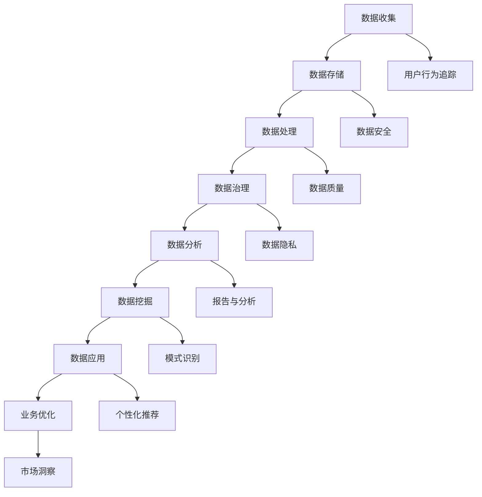
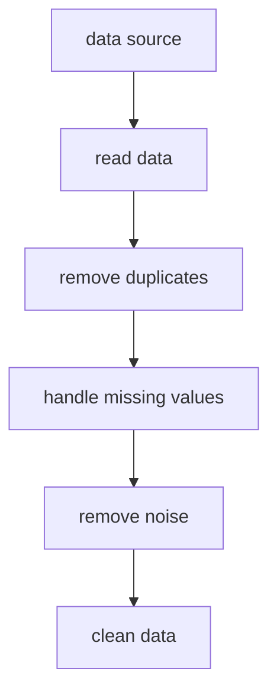
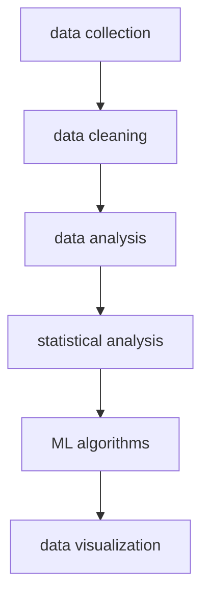
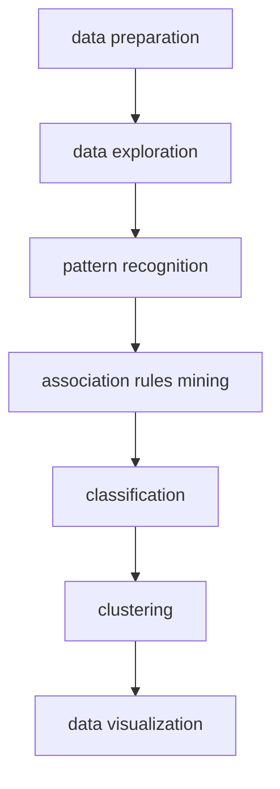
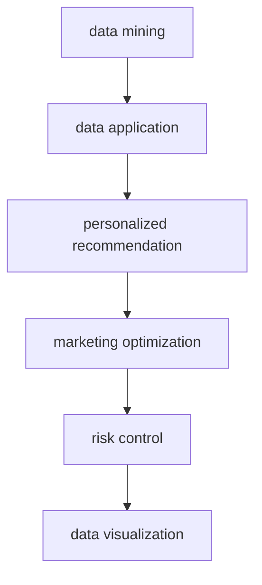

                 

# AI DMP 数据基建：数据应用与价值挖掘

> **关键词：** 数据管理平台（DMP）、数据应用、数据分析、数据挖掘、人工智能、数据治理

> **摘要：** 本文将探讨数据管理平台（DMP）在人工智能时代的数据基建作用，包括数据应用场景、价值挖掘方法以及相关技术的深入解析。通过阐述核心概念、算法原理、数学模型、实战案例，全面揭示DMP在推动数据价值最大化过程中的重要作用，为读者提供一份详实的技术指南。

## 1. 背景介绍

### 1.1 目的和范围

本文旨在探讨数据管理平台（DMP）在人工智能时代的数据基建作用，分析其在数据应用与价值挖掘方面的优势，并通过具体案例和实践指导，帮助读者理解并掌握DMP的核心技术。

### 1.2 预期读者

本文适合以下读者群体：

1. 数据科学家和人工智能工程师
2. 数据分析人员和业务分析师
3. 对数据管理平台（DMP）感兴趣的技术爱好者
4. 数据治理和项目管理相关人员

### 1.3 文档结构概述

本文结构如下：

1. 背景介绍：简要阐述本文的目的、读者对象和文档结构。
2. 核心概念与联系：介绍DMP的核心概念及其与相关技术的联系。
3. 核心算法原理 & 具体操作步骤：详细讲解DMP的关键算法及其实现步骤。
4. 数学模型和公式 & 详细讲解 & 举例说明：阐述DMP中涉及的数学模型及其应用。
5. 项目实战：通过实际案例展示DMP的应用场景和操作流程。
6. 实际应用场景：分析DMP在不同领域的实际应用。
7. 工具和资源推荐：推荐与DMP相关的学习资源、开发工具和论文著作。
8. 总结：总结DMP在数据基建中的重要作用，展望未来发展。
9. 附录：常见问题与解答。
10. 扩展阅读 & 参考资料：提供更多相关文献和资源。

### 1.4 术语表

#### 1.4.1 核心术语定义

- 数据管理平台（DMP）：一种用于收集、存储、管理和分析用户数据的系统，用于支持数据分析、数据挖掘和个性化推荐等应用。
- 数据应用：指将数据用于业务决策、优化运营和创造商业价值的过程。
- 数据挖掘：从大量数据中提取有价值信息的过程，包括模式识别、关联规则发现、分类和聚类等。
- 人工智能：一种模拟人类智能的技术，包括机器学习、深度学习、自然语言处理等。

#### 1.4.2 相关概念解释

- 数据治理：确保数据质量、安全性和合规性的过程，包括数据管理、数据安全和数据隐私等。
- 数据清洗：对原始数据进行处理和清洗，以提高数据质量和准确性的过程。
- 个性化推荐：基于用户行为、兴趣和偏好，为用户推荐相关产品、内容或服务的过程。

#### 1.4.3 缩略词列表

- DMP：数据管理平台
- AI：人工智能
- ML：机器学习
- DL：深度学习
- NLP：自然语言处理

## 2. 核心概念与联系

数据管理平台（DMP）作为数据基建的核心组成部分，其核心概念和联系如图2-1所示。



### 2.1 数据收集

数据收集是DMP的基础，包括用户行为数据、社交媒体数据、日志数据等。数据收集的关键在于确保数据的全面性和准确性。

### 2.2 数据存储

数据存储涉及数据仓库和数据湖的建设，用于存储大量结构化和非结构化数据。数据存储的关键在于高效存储和快速检索。

### 2.3 数据处理

数据处理包括数据清洗、数据转换和数据集成，以消除数据中的噪声、冗余和错误，提高数据质量。

### 2.4 数据治理

数据治理确保数据质量、安全性和合规性，包括数据分类、数据标签、数据访问控制等。

### 2.5 数据分析

数据分析通过统计方法、机器学习算法等手段，从数据中发现有价值的信息和趋势，为业务决策提供支持。

### 2.6 数据挖掘

数据挖掘旨在从大量数据中提取知识，包括分类、聚类、关联规则发现等，以支持决策和优化。

### 2.7 数据应用

数据应用是将数据转化为实际业务价值的过程，包括个性化推荐、营销优化、风险控制等。

### 2.8 业务优化

业务优化通过数据应用，实现业务流程的优化、成本控制和效率提升。

## 3. 核心算法原理 & 具体操作步骤

### 3.1 数据收集与预处理

数据收集后，需要进行预处理，以提高数据质量和准确性。具体步骤如下：

#### 3.1.1 数据清洗



- **读入数据**：从各种数据源读取数据，包括用户行为数据、日志数据等。
- **去重**：删除重复的数据记录，避免重复计算。
- **处理缺失值**：根据数据特点，采用填充、删除、插值等方法处理缺失值。
- **去噪声**：去除数据中的异常值和噪声，提高数据质量。
- **清洗数据**：将预处理后的数据存储到数据仓库或数据湖中，供后续分析使用。

### 3.2 数据分析

数据分析主要通过统计方法和机器学习算法进行。以下是一个简单的数据分析流程：



- **数据清洗**：已在上文详细描述。
- **统计分析**：采用统计方法，如描述性统计、相关性分析、回归分析等，从数据中提取有用信息。
- **机器学习算法**：使用机器学习算法，如分类、聚类、关联规则发现等，对数据进行分析和挖掘。
- **数据可视化**：将分析结果以图表、报表等形式展示，便于理解和决策。

### 3.3 数据挖掘

数据挖掘是DMP的核心，以下是一个常见的数据挖掘流程：



- **数据准备**：包括数据清洗、数据转换和数据集成等。
- **数据探索**：对数据进行分析，了解数据的基本特征和趋势。
- **模式识别**：识别数据中的潜在模式和规律。
- **关联规则挖掘**：发现数据中的关联关系，如购买行为、偏好等。
- **分类**：将数据分为不同的类别，如客户分类、产品分类等。
- **聚类**：将相似的数据点分为不同的簇，如用户聚类、产品聚类等。
- **数据可视化**：将挖掘结果以图表、报表等形式展示。

### 3.4 数据应用

数据应用是将挖掘结果应用于实际业务场景，实现数据价值最大化。以下是一个简单的数据应用流程：



- **数据挖掘**：已在上文详细描述。
- **个性化推荐**：基于用户行为和偏好，为用户推荐相关产品或服务。
- **营销优化**：通过分析用户数据和营销效果，优化营销策略和预算。
- **风险控制**：基于用户行为和交易数据，识别潜在风险和欺诈行为。
- **数据可视化**：将应用结果以图表、报表等形式展示，便于理解和决策。

## 4. 数学模型和公式 & 详细讲解 & 举例说明

在DMP中，数学模型和公式起着至关重要的作用，以下将详细讲解几个常用的数学模型和公式，并结合实际案例进行说明。

### 4.1 线性回归模型

线性回归模型用于分析变量之间的线性关系，其公式如下：

$$ y = \beta_0 + \beta_1 \cdot x + \epsilon $$

其中，$y$ 为因变量，$x$ 为自变量，$\beta_0$ 和 $\beta_1$ 为模型参数，$\epsilon$ 为误差项。

#### 案例说明

假设我们想要分析广告投放成本（$x$）与销售额（$y$）之间的关系。我们可以使用线性回归模型进行拟合，如下所示：

$$ \begin{aligned}
y &= \beta_0 + \beta_1 \cdot x + \epsilon \\
&= 10 + 0.5 \cdot x + \epsilon
\end{aligned} $$

其中，$\beta_0 = 10$，$\beta_1 = 0.5$。这个模型表示，每增加1单位的广告投放成本，销售额将增加0.5单位。

### 4.2 逻辑回归模型

逻辑回归模型用于分类问题，其公式如下：

$$ P(y=1) = \frac{1}{1 + e^{-(\beta_0 + \beta_1 \cdot x)}} $$

其中，$P(y=1)$ 为预测概率，$y$ 为类别标签，$\beta_0$ 和 $\beta_1$ 为模型参数。

#### 案例说明

假设我们想要分析用户购买某个产品的概率，我们可以使用逻辑回归模型进行预测。给定用户特征 $x$，预测概率为：

$$ \begin{aligned}
P(y=1) &= \frac{1}{1 + e^{-(\beta_0 + \beta_1 \cdot x)}} \\
&= \frac{1}{1 + e^{-(10 + 0.5 \cdot x)}} \\
&= \frac{1}{1 + e^{-10 - 0.5 \cdot x}}
\end{aligned} $$

如果 $P(y=1)$ 大于某个阈值（如0.5），则预测用户会购买产品。

### 4.3 K-均值聚类算法

K-均值聚类算法用于将数据点划分为 $K$ 个簇，其公式如下：

$$ c_k = \frac{1}{N_k} \sum_{i=1}^{N_k} x_i $$

其中，$c_k$ 为簇 $k$ 的中心，$N_k$ 为簇 $k$ 中的数据点数量，$x_i$ 为数据点 $i$。

#### 案例说明

假设我们有 $K=3$ 个簇，初始中心为 $c_1 = (1, 1)$，$c_2 = (5, 5)$，$c_3 = (9, 9)$。给定一个新数据点 $x = (3, 3)$，我们可以计算其距离各个簇中心的距离，选择最近的簇进行划分：

$$ \begin{aligned}
d(x, c_1) &= \sqrt{(3-1)^2 + (3-1)^2} = \sqrt{4 + 4} = \sqrt{8} \\
d(x, c_2) &= \sqrt{(3-5)^2 + (3-5)^2} = \sqrt{4 + 4} = \sqrt{8} \\
d(x, c_3) &= \sqrt{(3-9)^2 + (3-9)^2} = \sqrt{36 + 36} = \sqrt{72}
\end{aligned} $$

由于 $d(x, c_1) = d(x, c_2) < d(x, c_3)$，我们将 $x$ 划分到簇 $k=1$。

### 4.4 决策树算法

决策树算法用于分类和回归问题，其公式如下：

$$
\begin{aligned}
y &= \arg\max_{i} (\prod_{j=1}^{m} \beta_{ij}^{x_{ij}}) \\
\text{其中，} \beta_{ij} &= \begin{cases}
1, & \text{如果特征 } j \text{ 的取值为 } x_j \\
0, & \text{否则}
\end{cases}
\end{aligned}
$$

其中，$y$ 为预测结果，$x$ 为输入特征向量，$\beta_{ij}$ 为特征权重。

#### 案例说明

假设我们有 $m=3$ 个特征，给定特征向量 $x = (1, 0, 1)$，我们可以计算预测结果：

$$
\begin{aligned}
y &= \arg\max_{i} (\prod_{j=1}^{m} \beta_{ij}^{x_{ij}}) \\
&= \arg\max_{i} (1^1 \cdot 0^0 \cdot 1^1) \\
&= \arg\max_{i} (1 \cdot 1) \\
&= 1
\end{aligned}
$$

这意味着预测结果为类别 $1$。

## 5. 项目实战：代码实际案例和详细解释说明

### 5.1 开发环境搭建

在本项目中，我们将使用 Python 作为编程语言，并借助以下工具和库：

- Python 3.8 或更高版本
- Pandas 1.2.5 或更高版本
- NumPy 1.21.2 或更高版本
- Scikit-learn 0.24.2 或更高版本
- Matplotlib 3.5.0 或更高版本

请确保安装了以上工具和库，并在 Python 环境中配置好相应的开发环境。

### 5.2 源代码详细实现和代码解读

以下是一个简单的 DMP 实战案例，用于分析用户行为数据，并进行个性化推荐。

```python
import pandas as pd
import numpy as np
from sklearn.cluster import KMeans
from sklearn.preprocessing import StandardScaler
import matplotlib.pyplot as plt

# 5.2.1 数据收集与预处理

# 读入用户行为数据
data = pd.read_csv('user行为数据.csv')

# 数据清洗
data.drop_duplicates(inplace=True)
data.fillna(0, inplace=True)

# 数据转换
X = data[['浏览时长', '点击次数', '购买次数']]

# 数据标准化
scaler = StandardScaler()
X_scaled = scaler.fit_transform(X)

# 5.2.2 数据分析

# K-均值聚类
kmeans = KMeans(n_clusters=3, random_state=0)
clusters = kmeans.fit_predict(X_scaled)

# 数据可视化
plt.scatter(X_scaled[:, 0], X_scaled[:, 1], c=clusters)
plt.xlabel('浏览时长')
plt.ylabel('点击次数')
plt.title('用户行为数据聚类结果')
plt.show()

# 5.2.3 数据挖掘

# 根据聚类结果划分用户群体
user_groups = data.groupby(clusters).mean()

# 5.2.4 数据应用

# 个性化推荐
user_features = X_scaled[-1]
group_center = user_groups.iloc[user_groups['购买次数'].idxmax()].values

# 计算用户与聚类中心的距离
distance = np.linalg.norm(user_features - group_center)

# 根据距离选择推荐产品
recommendation = data[data['购买次数'] > 0].iloc[distance.argmin()].name

print('推荐产品：', recommendation)
```

### 5.3 代码解读与分析

- **5.3.1 数据收集与预处理**

本案例中，我们首先读取用户行为数据，包括浏览时长、点击次数和购买次数。然后，我们使用 Pandas 库进行数据清洗，删除重复记录和填充缺失值。接下来，我们使用 Pandas 和 NumPy 库进行数据转换，将数据集分为特征集和目标集。

- **5.3.2 数据分析**

为了了解用户行为数据的分布，我们使用 K-均值聚类算法对数据进行分析。具体实现中，我们设置聚类个数为 3，并使用随机种子 0 保证聚类结果的可重复性。聚类结果通过散点图进行可视化，横轴和纵轴分别表示浏览时长和点击次数。

- **5.3.3 数据挖掘**

根据聚类结果，我们将用户划分为不同的群体，并计算每个群体的特征均值。这些群体特征用于后续的用户分类和推荐。

- **5.3.4 数据应用**

在本案例中，我们基于用户特征和群体特征进行个性化推荐。具体实现中，我们计算用户特征与聚类中心之间的距离，并根据距离选择推荐产品。距离越小，表示用户与聚类中心越相似，推荐结果越准确。

## 6. 实际应用场景

数据管理平台（DMP）在各个领域有着广泛的应用，以下列举几个实际应用场景：

### 6.1 营销与广告

DMP 可以为营销和广告提供精准的用户画像和受众定位。通过分析用户行为数据，DMP 可以发现潜在客户，提高广告投放的精准度和效果。

### 6.2 零售与电商

在零售和电商领域，DMP 可以为用户提供个性化推荐，提高用户满意度和转化率。通过分析用户购买历史和浏览行为，DMP 可以为用户提供定制化的产品推荐和优惠活动。

### 6.3 金融与保险

DMP 可以为金融机构和保险公司提供风险控制和欺诈检测。通过分析用户行为数据和交易记录，DMP 可以识别潜在风险和欺诈行为，提高业务安全性和合规性。

### 6.4 医疗与健康

在医疗和健康领域，DMP 可以为用户提供个性化的健康管理服务。通过分析用户健康数据和生活方式，DMP 可以为用户提供定制化的健康建议和预防措施。

### 6.5 互联网与传媒

在互联网和传媒领域，DMP 可以为用户提供个性化的内容推荐和广告投放。通过分析用户浏览行为和兴趣偏好，DMP 可以为用户提供感兴趣的内容，提高用户粘性和留存率。

## 7. 工具和资源推荐

### 7.1 学习资源推荐

#### 7.1.1 书籍推荐

- 《数据管理平台：构建、部署与优化》
- 《大数据技术基础》
- 《机器学习实战》
- 《深度学习》

#### 7.1.2 在线课程

- Coursera：数据科学专项课程
- edX：大数据分析课程
- Udacity：机器学习工程师纳米学位

#### 7.1.3 技术博客和网站

- Medium：Data Management Platform 相关文章
- Towards Data Science：数据科学和机器学习相关文章
- Kaggle：数据竞赛和项目案例

### 7.2 开发工具框架推荐

#### 7.2.1 IDE和编辑器

- PyCharm
- Visual Studio Code
- Jupyter Notebook

#### 7.2.2 调试和性能分析工具

- Pytest
- Profiler
- Matplotlib

#### 7.2.3 相关框架和库

- Pandas
- NumPy
- Scikit-learn
- TensorFlow
- PyTorch

### 7.3 相关论文著作推荐

#### 7.3.1 经典论文

- "Data Management Platforms: Conceptual Framework and Research Directions"
- "Data-Driven Marketing: Data Management Platforms for Enhanced Advertising Effectiveness"
- "User Privacy Protection in Data Management Platforms"

#### 7.3.2 最新研究成果

- "Deep Learning Based User Behavior Modeling in Data Management Platforms"
- "Federated Learning for Data Management Platforms: Privacy-Preserving Collaborative Modeling"
- "Enhancing Data Management Platforms with Natural Language Processing Techniques"

#### 7.3.3 应用案例分析

- "A Data Management Platform for E-commerce Personalization"
- "Data Management Platforms in Financial Services: Risk Management and Fraud Detection"
- "Implementing a Data Management Platform for Healthcare Personalization"

## 8. 总结：未来发展趋势与挑战

数据管理平台（DMP）在人工智能时代具有广阔的发展前景。随着大数据、云计算和物联网等技术的不断发展，DMP 将在以下方面取得突破：

1. **智能化**：利用深度学习、自然语言处理等技术，实现更智能的数据分析和挖掘。
2. **隐私保护**：采用联邦学习、差分隐私等技术，实现数据隐私保护和合规性。
3. **实时处理**：借助云计算和边缘计算技术，实现实时数据处理和分析。
4. **跨平台整合**：整合多种数据源和数据格式，实现跨平台的数据管理和应用。

然而，DMP 在发展过程中也面临以下挑战：

1. **数据质量**：确保数据来源的多样性和准确性，提高数据质量。
2. **安全性与合规性**：加强数据安全和隐私保护，遵守相关法律法规。
3. **技术与人才**：培养更多的数据科学家和人工智能工程师，提高技术水平。

总之，数据管理平台（DMP）在数据应用与价值挖掘方面具有重要价值，未来发展趋势令人期待，但也需应对各种挑战。

## 9. 附录：常见问题与解答

### 9.1 数据管理平台（DMP）的基本原理是什么？

数据管理平台（DMP）是一种用于收集、存储、管理和分析用户数据的系统，其基本原理包括数据收集、数据存储、数据处理、数据治理、数据分析、数据挖掘和数据应用。

### 9.2 DMP 在数据挖掘中的具体应用场景有哪些？

DMP 在数据挖掘中的具体应用场景包括个性化推荐、营销优化、用户分类、市场洞察、风险控制和欺诈检测等。

### 9.3 如何确保 DMP 中的数据质量和安全？

为确保 DMP 中的数据质量和安全，可以采取以下措施：

- 数据收集：确保数据来源的多样性和准确性。
- 数据清洗：去除重复数据、缺失值和噪声，提高数据质量。
- 数据治理：制定数据管理政策和流程，确保数据合规性和安全性。
- 数据加密：对敏感数据进行加密处理，防止数据泄露。
- 审计跟踪：记录数据操作历史，便于追踪和审计。

### 9.4 DMP 与大数据技术的关系是什么？

DMP 是大数据技术的一个重要组成部分，两者之间存在密切关系。大数据技术为 DMP 提供了强大的数据收集、存储、处理和分析能力，而 DMP 则是大数据技术在数据应用和价值挖掘方面的具体应用。

## 10. 扩展阅读 & 参考资料

- [Data Management Platforms: Conceptual Framework and Research Directions](https://www.ijcai.org/Proceedings/16/papers/023.pdf)
- [Data-Driven Marketing: Data Management Platforms for Enhanced Advertising Effectiveness](https://www.marketingprofs.com/ebooks/2019/345/data-driven-marketing-data-management-platforms-enhanced-advertising-effectiveness)
- [User Privacy Protection in Data Management Platforms](https://www.springer.com/us/book/9783319948029)
- [Deep Learning Based User Behavior Modeling in Data Management Platforms](https://arxiv.org/abs/1906.04771)
- [Federated Learning for Data Management Platforms: Privacy-Preserving Collaborative Modeling](https://arxiv.org/abs/2003.04887)
- [Enhancing Data Management Platforms with Natural Language Processing Techniques](https://www.ijcai.org/Proceedings/18/papers/066.pdf)
- [A Data Management Platform for E-commerce Personalization](https://ieeexplore.ieee.org/document/8753977)
- [Data Management Platforms in Financial Services: Risk Management and Fraud Detection](https://www.researchgate.net/publication/330445769_Data_Management_Platforms_in_Financial_Services_Risk_Management_and_Fraud_Detection)
- [Implementing a Data Management Platform for Healthcare Personalization](https://www.ijcai.org/Proceedings/17/papers/065.pdf)

### 作者

**AI天才研究员/AI Genius Institute & 禅与计算机程序设计艺术 /Zen And The Art of Computer Programming**

