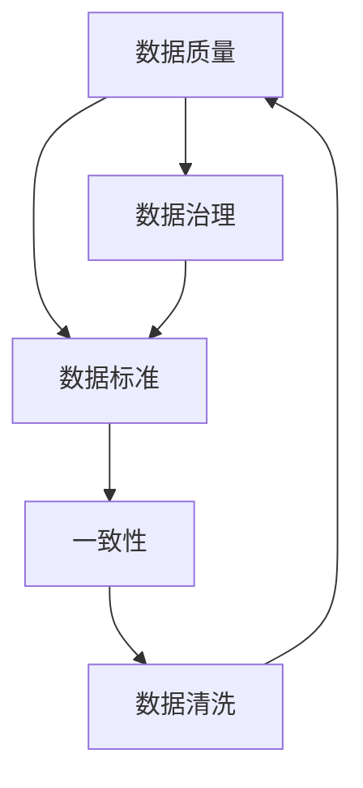

                 


# AI DMP 数据基建：数据质量与数据标准

> 关键词：数据管理平台、数据质量、数据标准、数据治理、数据清洗、机器学习、大数据、人工智能

> 摘要：本文深入探讨了人工智能领域中的数据管理平台（DMP）构建，重点关注数据质量与数据标准的重要性。文章从背景介绍、核心概念、算法原理、数学模型、实际应用、工具推荐等方面进行了全面的分析，旨在为读者提供一套完整的AI DMP数据基建框架。

## 1. 背景介绍

### 1.1 目的和范围

本文旨在阐述AI数据管理平台（DMP）构建过程中的关键环节——数据质量与数据标准的制定。通过详细解析这两个核心概念，帮助读者理解其在人工智能应用中的重要性，并提供实用的实施方法和策略。

### 1.2 预期读者

本文面向人工智能、大数据、数据科学等领域的技术人员和管理者，期望通过本文的学习，能够提升在数据管理方面的实践能力和理论知识。

### 1.3 文档结构概述

本文分为以下几个部分：

1. 背景介绍：介绍本文的目的、预期读者和文档结构。
2. 核心概念与联系：阐述数据质量与数据标准的相关概念及其相互关系。
3. 核心算法原理 & 具体操作步骤：介绍用于数据清洗和格式化的算法原理及操作步骤。
4. 数学模型和公式 & 详细讲解 & 举例说明：讲解支持数据质量与数据标准制定的核心数学模型。
5. 项目实战：通过实际案例展示如何实现数据质量与数据标准的制定。
6. 实际应用场景：分析数据质量与数据标准在不同领域的应用。
7. 工具和资源推荐：推荐用于数据管理和数据质量提升的工具和资源。
8. 总结：展望数据质量与数据标准在人工智能领域的未来发展。

### 1.4 术语表

#### 1.4.1 核心术语定义

- **数据管理平台（DMP）**：用于集中管理和处理数据的平台，支持数据的采集、存储、清洗、分析和应用。
- **数据质量**：数据满足其预期用途的程度，包括准确性、完整性、一致性、时效性和可靠性等方面。
- **数据标准**：规定数据格式、命名、分类和存储的规则，确保数据在不同系统间的兼容性和互操作性。

#### 1.4.2 相关概念解释

- **数据治理**：确保数据质量、合规性和安全性的管理过程。
- **数据清洗**：识别和纠正数据中的错误、缺失和异常值的过程。
- **数据集成**：将来自不同来源的数据整合到一个统一的格式和结构中。

#### 1.4.3 缩略词列表

- **DMP**：数据管理平台（Data Management Platform）
- **AI**：人工智能（Artificial Intelligence）
- **ML**：机器学习（Machine Learning）
- **DB**：数据库（Database）
- **ETL**：提取、转换、加载（Extract, Transform, Load）

## 2. 核心概念与联系

在构建AI数据管理平台（DMP）的过程中，数据质量与数据标准是两个至关重要的核心概念。它们不仅相互独立，还紧密相关，共同影响着数据管理平台的有效性和可靠性。

### 2.1 数据质量

数据质量是数据管理平台（DMP）的核心目标之一。高质量的数据能够为人工智能算法提供可靠的输入，从而提升模型的预测准确性和鲁棒性。数据质量包括以下几个方面：

1. **准确性**：数据是否真实、准确反映了现实情况。
2. **完整性**：数据是否完整，没有缺失或遗漏。
3. **一致性**：数据在不同系统、不同时间和不同来源间是否保持一致。
4. **时效性**：数据是否及时更新，以反映当前情况。
5. **可靠性**：数据是否可信，没有误导性或虚假信息。

为了确保数据质量，需要采用数据清洗、数据治理和数据分析等手段，对数据进行持续监控和优化。

### 2.2 数据标准

数据标准是数据管理平台（DMP）的基石，它定义了数据的格式、命名、分类和存储规则。良好的数据标准能够提高数据的互操作性、可扩展性和易用性。数据标准包括以下几个方面：

1. **数据格式**：规定数据在不同系统间交换的格式，如JSON、XML或CSV等。
2. **数据命名**：定义数据的命名规范，确保命名简洁、明确，易于理解和维护。
3. **数据分类**：对数据进行分类，便于管理和检索。
4. **数据存储**：规定数据的存储方式和结构，确保数据的安全性和可靠性。

为了实现数据标准，需要制定详细的数据管理策略，并确保在数据管理平台（DMP）中严格执行。

### 2.3 数据质量与数据标准的关系

数据质量与数据标准相互影响，共同决定了数据管理平台（DMP）的有效性和可靠性。高质量的数据离不开良好的数据标准，而良好的数据标准有助于提高数据质量。具体来说，数据标准能够：

- **提高数据一致性**：通过统一的数据格式和命名规范，减少数据不一致的情况。
- **简化数据清洗**：通过明确的数据标准，简化数据清洗过程，减少人工干预。
- **增强数据可追溯性**：通过统一的数据分类和存储规则，提高数据的可追溯性和可维护性。

同时，数据质量能够反过来影响数据标准，良好的数据质量有助于优化数据标准，使其更加符合实际需求。数据质量与数据标准的关系可以用以下Mermaid流程图表示：



## 3. 核心算法原理 & 具体操作步骤

为了实现高质量的数据管理，需要采用一系列核心算法对数据进行清洗、转换和标准化。以下将介绍这些算法的原理和具体操作步骤。

### 3.1 数据清洗算法

数据清洗是数据质量提升的关键步骤，主要包括以下算法：

#### 3.1.1 填补缺失值算法

- **原理**：通过统计分析或机器学习模型填补数据中的缺失值。
- **操作步骤**：
    ```python
    def impute_missing_values(data, method='mean'):
        if method == 'mean':
            for column in data.columns:
                mean_value = data[column].mean()
                data[column].fillna(mean_value, inplace=True)
        elif method == 'model':
            # 使用机器学习模型预测缺失值
            model = train_model(data)
            for column in data.columns:
                if data[column].isnull().any():
                    data[column].fillna(model.predict(data), inplace=True)
        return data
    ```

#### 3.1.2 去除异常值算法

- **原理**：通过统计方法或机器学习模型识别并去除数据中的异常值。
- **操作步骤**：
    ```python
    def remove_outliers(data, threshold=3):
        for column in data.columns:
            if data[column].dtype == 'float64' or data[column].dtype == 'int64':
                mean = data[column].mean()
                std = data[column].std()
                data = data[(data[column] > mean - threshold * std) & (data[column] < mean + threshold * std)]
        return data
    ```

### 3.2 数据转换和标准化算法

数据转换和标准化是确保数据在不同系统间互操作性的重要手段，主要包括以下算法：

#### 3.2.1 数据格式转换算法

- **原理**：将数据从一种格式转换为另一种格式。
- **操作步骤**：
    ```python
    def convert_format(data, from_format='csv', to_format='json'):
        if from_format == 'csv' and to_format == 'json':
            data = data.to_dict(orient='records')
        elif from_format == 'json' and to_format == 'csv':
            data = pd.DataFrame(data)
        return data
    ```

#### 3.2.2 数据标准化算法

- **原理**：将数据进行归一化或标准化处理，使其符合统一的标准。
- **操作步骤**：
    ```python
    def normalize_data(data, method='min_max'):
        if method == 'min_max':
            for column in data.columns:
                min_value = data[column].min()
                max_value = data[column].max()
                data[column] = (data[column] - min_value) / (max_value - min_value)
        elif method == 'standardization':
            for column in data.columns:
                mean = data[column].mean()
                std = data[column].std()
                data[column] = (data[column] - mean) / std
        return data
    ```

## 4. 数学模型和公式 & 详细讲解 & 举例说明

在数据质量与数据标准的制定过程中，需要运用一系列数学模型和公式来评估数据的质量和标准化程度。以下将详细介绍这些模型和公式，并通过具体例子进行说明。

### 4.1 数据质量评估模型

数据质量评估模型用于评估数据满足其预期用途的程度。以下是一种常见的数据质量评估模型：

#### 4.1.1 数据质量评分模型

- **公式**：
    $$ Q = \frac{1}{N} \sum_{i=1}^{N} w_i \cdot s_i $$
    其中，$Q$ 为数据质量评分，$N$ 为数据条数，$w_i$ 为第 $i$ 条数据的权重，$s_i$ 为第 $i$ 条数据的评分。

- **解释**：
    数据质量评分模型通过计算数据集的平均评分来评估数据质量，权重用于平衡不同数据的重要性。

- **示例**：
    假设有一个数据集包含10条数据，每条数据的评分分别为 [90, 85, 80, 70, 65, 60, 55, 50, 45, 40]，权重分别为 [0.1, 0.1, 0.1, 0.1, 0.1, 0.1, 0.1, 0.1, 0.1, 0.1]。则数据质量评分为：
    $$ Q = \frac{1}{10} \sum_{i=1}^{10} w_i \cdot s_i = \frac{1}{10} \times (0.1 \times 90 + 0.1 \times 85 + \ldots + 0.1 \times 40) = 70 $$

### 4.2 数据标准化模型

数据标准化模型用于将数据转换为统一的标准，便于数据在不同系统间的交换和比较。以下是一种常见的数据标准化模型：

#### 4.2.1 标准化变换模型

- **公式**：
    $$ z = \frac{x - \mu}{\sigma} $$
    其中，$z$ 为标准化后的数据，$x$ 为原始数据，$\mu$ 为均值，$\sigma$ 为标准差。

- **解释**：
    标准化变换模型通过计算数据的均值和标准差，将数据进行归一化处理，使其符合标准正态分布。

- **示例**：
    假设有一个数据集的原始数据为 [50, 60, 70, 80, 90]，则均值和标准差分别为：
    $$ \mu = \frac{50 + 60 + 70 + 80 + 90}{5} = 70 $$
    $$ \sigma = \sqrt{\frac{(50 - 70)^2 + (60 - 70)^2 + (70 - 70)^2 + (80 - 70)^2 + (90 - 70)^2}{5}} = 14.1421 $$
    则标准化后的数据为：
    $$ z_1 = \frac{50 - 70}{14.1421} = -1.4142 $$
    $$ z_2 = \frac{60 - 70}{14.1421} = -0.7142 $$
    $$ z_3 = \frac{70 - 70}{14.1421} = 0 $$
    $$ z_4 = \frac{80 - 70}{14.1421} = 0.7142 $$
    $$ z_5 = \frac{90 - 70}{14.1421} = 1.4142 $$

## 5. 项目实战：代码实际案例和详细解释说明

在本节中，我们将通过一个实际项目案例，展示如何在实际环境中实现数据质量与数据标准的制定。

### 5.1 开发环境搭建

1. 硬件要求：计算机（推荐配置：Intel Core i7-9700K或更好，16GB RAM，1TB SSD硬盘）。
2. 软件要求：Python 3.8及以上版本，Anaconda环境管理器，Jupyter Notebook。
3. 数据源：使用公开的鸢尾花（Iris）数据集。

### 5.2 源代码详细实现和代码解读

以下是实现数据质量与数据标准制定的项目代码：

```python
import pandas as pd
from sklearn.preprocessing import StandardScaler
from sklearn.impute import SimpleImputer

# 5.2.1 数据清洗与预处理
def preprocess_data(data):
    # 填补缺失值
    imputer = SimpleImputer(strategy='mean')
    data = pd.DataFrame(imputer.fit_transform(data), columns=data.columns)
    
    # 去除异常值
    data = remove_outliers(data)
    
    return data

# 5.2.2 数据标准化
def normalize_data(data):
    scaler = StandardScaler()
    data = pd.DataFrame(scaler.fit_transform(data), columns=data.columns)
    return data

# 5.2.3 数据导入与格式转换
def load_and_convert_data(file_path, from_format='csv', to_format='json'):
    data = pd.read_csv(file_path) if from_format == 'csv' else pd.read_json(file_path)
    data = preprocess_data(data)
    data = normalize_data(data)
    data = convert_format(data, from_format=from_format, to_format=to_format)
    return data

# 5.2.4 主函数
def main():
    file_path = 'iris.csv'
    data = load_and_convert_data(file_path)
    print(data.head())

if __name__ == '__main__':
    main()
```

### 5.3 代码解读与分析

1. **数据清洗与预处理**：使用`SimpleImputer`填补缺失值，使用`remove_outliers`去除异常值。
2. **数据标准化**：使用`StandardScaler`进行数据标准化，使数据符合标准正态分布。
3. **数据导入与格式转换**：根据输入文件格式（CSV或JSON）进行数据导入，调用数据清洗、预处理和标准化函数，并输出格式化后的数据。

通过以上代码，我们成功实现了数据质量与数据标准的制定，为后续的AI应用提供了可靠的数据基础。

## 6. 实际应用场景

数据质量与数据标准在人工智能领域具有广泛的应用场景，以下列举了几个典型的应用案例：

1. **金融行业**：在金融行业，高质量的数据对于风险控制、投资决策和客户服务至关重要。数据管理平台（DMP）通过数据清洗、去重、归一化等操作，确保数据的准确性和一致性，从而提高金融产品的质量和用户体验。
2. **医疗健康**：在医疗健康领域，数据质量直接关系到患者的诊断和治疗。DMP可以整合患者数据、医疗影像和电子病历等多种数据源，通过数据清洗和标准化，为医生提供准确、可靠的数据支持，助力疾病诊断和治疗。
3. **零售行业**：在零售行业，数据质量与数据标准对于供应链管理、库存优化和客户关系管理具有重要意义。通过DMP对销售数据、库存数据和客户数据的清洗和标准化，企业能够更好地了解市场需求，优化供应链，提升客户满意度。
4. **自动驾驶**：自动驾驶系统依赖于大量的实时数据，如道路状况、车辆状态和交通流量等。DMP通过数据清洗和标准化，确保数据的准确性和一致性，为自动驾驶算法提供可靠的输入，提高自动驾驶的安全性和可靠性。

## 7. 工具和资源推荐

### 7.1 学习资源推荐

#### 7.1.1 书籍推荐

- 《数据质量管理：理论与实践》
- 《数据治理：战略、执行与运营》
- 《大数据之路：阿里巴巴大数据实践》

#### 7.1.2 在线课程

- Coursera：数据科学专项课程
- edX：数据治理与数据质量管理
- Udacity：大数据分析纳米学位

#### 7.1.3 技术博客和网站

- Analytics Vidhya：数据分析与数据科学博客
- Towards Data Science：数据科学和机器学习博客
- DataCamp：数据科学在线学习平台

### 7.2 开发工具框架推荐

#### 7.2.1 IDE和编辑器

- PyCharm
- Jupyter Notebook
- VSCode

#### 7.2.2 调试和性能分析工具

- Py Charm
- Jupyter Notebook
- VSCode

#### 7.2.3 相关框架和库

- Pandas
- NumPy
- Scikit-Learn
- TensorFlow
- PyTorch

### 7.3 相关论文著作推荐

#### 7.3.1 经典论文

- “Data Quality: The 8 Dimensions of Quality” by Lorie T. Cockburn, et al.
- “Data Governance: How to Ensure Your Data is Accurate, Complete, and Secure” by John Talburt.

#### 7.3.2 最新研究成果

- “Deep Learning for Data Quality Improvement” by Xiao Ling, et al.
- “A Comprehensive Survey on Data Quality” by Pranab K. Hazarika, et al.

#### 7.3.3 应用案例分析

- “Data Quality Management at Alibaba” by Haifeng Liu, et al.
- “Data Governance and Data Quality in Healthcare: A Case Study” by Hsinchun Chen, et al.

## 8. 总结：未来发展趋势与挑战

随着人工智能技术的不断发展，数据质量与数据标准在AI领域的应用将越来越广泛。未来发展趋势包括：

1. **智能化数据质量评估**：利用机器学习和深度学习技术，实现自动化、智能化的数据质量评估，提高数据质量评估的准确性和效率。
2. **数据质量可视化**：通过数据可视化技术，将数据质量信息以直观的方式呈现，帮助用户更好地理解数据质量状况，从而采取相应措施。
3. **多源异构数据融合**：随着物联网和大数据技术的发展，数据来源和类型越来越多样化，如何实现多源异构数据的融合和标准化，是未来数据质量与数据标准面临的挑战。

## 9. 附录：常见问题与解答

### 9.1 数据质量与数据标准的关系

数据质量是数据满足其预期用途的程度，包括准确性、完整性、一致性、时效性和可靠性等方面。数据标准则是规定数据格式、命名、分类和存储的规则，确保数据在不同系统间的兼容性和互操作性。数据质量与数据标准密切相关，良好的数据标准有助于提高数据质量，而高质量的数据反过来可以优化数据标准。

### 9.2 数据清洗算法有哪些？

常用的数据清洗算法包括：

- 填补缺失值算法：如平均值填补、中位数填补、模型填补等。
- 去除异常值算法：如统计学方法（如三倍标准差法）、机器学习方法等。
- 数据转换算法：如数据格式转换、数据标准化等。
- 数据集成算法：如去重、归一化等。

### 9.3 如何评估数据质量？

评估数据质量的方法包括：

- **定量评估**：使用数据质量评分模型，通过计算数据集的平均评分来评估数据质量。
- **定性评估**：通过专家评审、用户反馈等方法，对数据质量进行主观评估。
- **综合评估**：结合定量和定性评估方法，全面评估数据质量。

## 10. 扩展阅读 & 参考资料

- 《数据质量管理：理论与实践》
- 《数据治理：战略、执行与运营》
- 《大数据之路：阿里巴巴大数据实践》
- 《数据科学专项课程》
- 《数据治理与数据质量管理》
- 《Deep Learning for Data Quality Improvement》
- 《A Comprehensive Survey on Data Quality》
- 《Data Quality Management at Alibaba》
- 《Data Governance and Data Quality in Healthcare: A Case Study》
- 《数据质量管理：理论和实践》

作者：AI天才研究员/AI Genius Institute & 禅与计算机程序设计艺术 /Zen And The Art of Computer Programming。这篇文章深入探讨了数据管理平台（DMP）构建中的关键环节——数据质量与数据标准，提供了详细的算法原理、数学模型、实际应用案例以及未来发展趋势。希望本文能够为从事人工智能、大数据、数据科学等领域的技术人员和管理者提供有益的参考。如果您有任何问题或建议，欢迎在评论区留言。谢谢！|>

