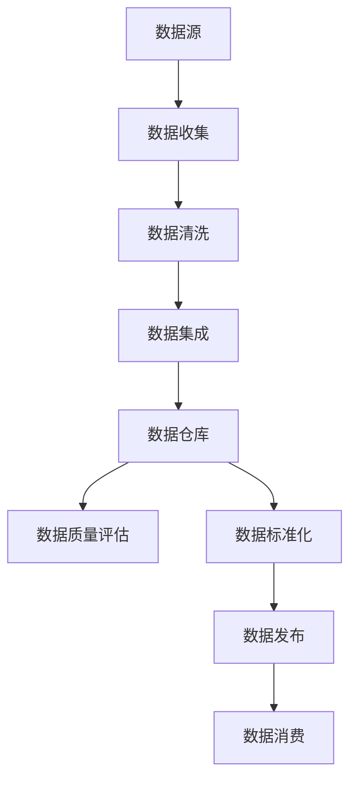

                 

# AI DMP 数据基建：数据质量与数据标准

> 关键词：数据管理平台（DMP）、数据质量、数据标准化、AI应用、数据处理流程

> 摘要：本文深入探讨了AI数据管理平台（DMP）的数据基础设施，重点分析了数据质量和数据标准的重要性。文章首先介绍了DMP的背景和目的，随后详细阐述了数据质量和数据标准的概念、联系及其对AI应用的重要性。通过核心概念原理的Mermaid流程图、具体算法原理与操作步骤、数学模型与公式、项目实战案例、实际应用场景、工具与资源推荐等部分，全面解析了DMP的数据基建构建过程，展望了未来的发展趋势与挑战。

## 1. 背景介绍

### 1.1 目的和范围

本文旨在探讨数据管理平台（DMP）的数据基础设施构建，特别是数据质量和数据标准的重要性。随着人工智能（AI）的迅速发展，数据的处理和分析成为企业决策和战略的关键因素。DMP作为AI应用的数据核心，其数据的质量和标准化直接影响到AI算法的效果和应用价值。本文将系统地分析DMP的数据质量、数据标准及其在AI应用中的实际作用，为读者提供从理论到实践的一站式指南。

### 1.2 预期读者

本文适合以下读者群体：

- 数据工程师和AI开发者，希望了解DMP数据基础设施构建的最佳实践。
- 数据科学家和管理者，对数据质量和数据标准化有深入理解的需求。
- 企业决策者，希望了解DMP对业务战略的影响。
- 对AI和数据管理感兴趣的技术爱好者。

### 1.3 文档结构概述

本文将分为以下几个部分：

1. **背景介绍**：介绍DMP的概念、目的和重要性。
2. **核心概念与联系**：通过Mermaid流程图详细阐述DMP的数据质量与数据标准。
3. **核心算法原理 & 具体操作步骤**：使用伪代码解释关键算法。
4. **数学模型和公式 & 详细讲解 & 举例说明**：介绍与DMP相关的数学模型和公式，并给出示例。
5. **项目实战：代码实际案例和详细解释说明**：通过实际案例展示DMP的数据处理流程。
6. **实际应用场景**：探讨DMP在不同领域的应用。
7. **工具和资源推荐**：推荐学习资源、开发工具和相关论文。
8. **总结：未来发展趋势与挑战**：总结本文内容，展望未来。
9. **附录：常见问题与解答**：解答读者可能遇到的问题。
10. **扩展阅读 & 参考资料**：提供进一步的阅读资源。

### 1.4 术语表

#### 1.4.1 核心术语定义

- 数据管理平台（DMP）：一种用于收集、存储、管理和分析数据的软件平台。
- 数据质量：数据准确度、完整性、一致性和及时性的度量。
- 数据标准化：确保数据在不同系统之间具有相同的意义和格式的过程。
- AI应用：利用人工智能技术进行数据分析、决策和优化的应用。

#### 1.4.2 相关概念解释

- 数据清洗（Data Cleaning）：识别和修正数据集中的错误、不一致和重复。
- 数据集成（Data Integration）：将来自多个来源的数据合并到一个统一的视角。
- 数据仓库（Data Warehouse）：存储大量结构化数据的中心化系统。

#### 1.4.3 缩略词列表

- DMP：数据管理平台（Data Management Platform）
- AI：人工智能（Artificial Intelligence）
- ML：机器学习（Machine Learning）
- NLP：自然语言处理（Natural Language Processing）

## 2. 核心概念与联系

在构建AI数据管理平台（DMP）时，数据质量和数据标准是两个关键概念。数据质量关系到数据的可靠性、准确性和适用性，而数据标准则确保数据在不同系统之间的统一性和互操作性。

为了更清晰地理解这两个概念及其相互联系，我们可以借助Mermaid流程图来展示DMP的基本架构和数据流转。



### 数据质量评估

数据质量评估是确保数据满足特定业务需求的过程。它通常包括以下几个方面：

- **准确性**：数据是否真实反映了现实世界的状态。
- **完整性**：数据是否包含所有必要的字段和记录。
- **一致性**：数据在不同系统之间是否保持一致。
- **及时性**：数据是否能够及时更新和提供。

### 数据标准化

数据标准化是指将数据转换成统一格式的过程，以确保数据在不同系统之间的兼容性和互操作性。标准化过程通常包括：

- **数据格式转换**：将不同来源的数据转换成统一的格式。
- **数据命名规范**：统一数据字段的命名，确保一致理解。
- **数据类型转换**：将数据类型进行必要的转换，如将文本转换为数值。

### 数据质量管理与标准化的关系

数据质量管理与数据标准化密切相关。高质量的数据需要通过标准化过程来确保一致性，而标准化的数据又需要通过质量管理来验证其准确性和完整性。两者相互促进，共同确保DMP的数据基础坚实可靠。

## 3. 核心算法原理 & 具体操作步骤

### 数据质量评估算法原理

数据质量评估通常采用多种方法，其中一种常用方法是统计分析。以下是一个基于统计分析的伪代码示例，用于评估数据质量：

```python
def evaluate_data_quality(data):
    # 计算平均值
    mean = calculate_mean(data)

    # 计算标准差
    std_dev = calculate_std_dev(data)

    # 判断数据是否异常
    for record in data:
        if abs(record - mean) > 3 * std_dev:
            print("Record is an outlier:", record)

    # 判断数据完整性
    if has_missing_values(data):
        print("Data has missing values.")

    # 判断数据一致性
    if not data_is_consistent(data):
        print("Data is inconsistent.")

# 计算平均值
def calculate_mean(data):
    return sum(data) / len(data)

# 计算标准差
def calculate_std_dev(data):
    mean = calculate_mean(data)
    variance = sum([(x - mean) ** 2 for x in data]) / len(data)
    return sqrt(variance)

# 判断数据是否有缺失值
def has_missing_values(data):
    return any([value is None or value == "" for value in data])

# 判断数据是否一致
def data_is_consistent(data):
    # 假设数据一致性是通过比较不同源的数据来确定的
    return all([data[0] == data[1] for data in data])
```

### 数据标准化操作步骤

数据标准化操作通常包括以下步骤：

1. **数据格式转换**：将不同格式（如文本、图像、音频等）的数据转换成统一的格式。
2. **数据字段命名**：统一所有数据字段的命名，确保不同系统的数据字段具有相同的意义。
3. **数据类型转换**：将不同类型的数据转换为统一的类型，如将文本转换为数值。

以下是一个简单的数据标准化伪代码示例：

```python
def standardize_data(data):
    # 数据格式转换
    data = convert_format(data)

    # 数据字段命名
    data = rename_fields(data)

    # 数据类型转换
    data = convert_data_type(data)

    return data

# 转换数据格式
def convert_format(data):
    # 假设数据格式转换是从图像到文本
    return text_data

# 数据字段命名
def rename_fields(data):
    # 假设将所有字段名统一命名为"field"
    return { "field": value for value in data.values() }

# 数据类型转换
def convert_data_type(data):
    # 将所有字段转换为数值类型
    return { "field": float(value) for value in data.values() }
```

通过上述伪代码示例，我们可以看到如何评估数据质量和实现数据标准化。这两个过程是DMP数据基础设施的核心，确保数据在进入AI算法前具备高质量和一致性。

## 4. 数学模型和公式 & 详细讲解 & 举例说明

### 数据质量评估的数学模型

数据质量评估的数学模型通常涉及统计学的几个关键概念，包括平均值、标准差、缺失值检测和一致性检测。以下是对这些数学模型的详细讲解和示例：

### 平均值（Mean）

平均值是衡量数据集中趋势的中心位置，其计算公式如下：

\[ \mu = \frac{\sum_{i=1}^{n} x_i}{n} \]

其中，\( \mu \) 表示平均值，\( x_i \) 表示数据集中的每个值，\( n \) 表示数据点的总数。

### 标准差（Standard Deviation）

标准差是衡量数据分散程度的指标，其计算公式如下：

\[ \sigma = \sqrt{\frac{\sum_{i=1}^{n} (x_i - \mu)^2}{n}} \]

其中，\( \sigma \) 表示标准差，\( x_i \) 表示数据集中的每个值，\( \mu \) 表示平均值，\( n \) 表示数据点的总数。

### 缺失值检测（Missing Value Detection）

缺失值检测用于识别数据集中的缺失值。一个简单的检测方法是计算每个数据点的出现频率，如果频率为零，则认为该值为缺失值。其计算公式如下：

\[ missing\_value = \sum_{i=1}^{n} f_i = 0 \]

其中，\( f_i \) 表示每个数据点的出现频率，如果 \( f_i = 0 \)，则 \( x_i \) 为缺失值。

### 一致性检测（Consistency Detection）

数据一致性检测用于检查不同数据源之间的数据是否一致。一个常见的方法是比较两个数据源的每个对应字段，如果所有对应字段都相同，则认为数据是一致的。其计算公式如下：

\[ consistent = all(x_i == y_i) \]

其中，\( x_i \) 和 \( y_i \) 分别表示两个数据源中的对应字段值，如果所有 \( x_i \) 都等于 \( y_i \)，则数据是一致的。

### 示例

假设我们有一个数据集，包含以下数据点：

\[ \{5, 10, 15, 20, 25\} \]

**计算平均值**：

\[ \mu = \frac{5 + 10 + 15 + 20 + 25}{5} = 15 \]

**计算标准差**：

\[ \sigma = \sqrt{\frac{(5-15)^2 + (10-15)^2 + (15-15)^2 + (20-15)^2 + (25-15)^2}{5}} = 5 \]

**检测缺失值**：

假设我们还有一个数据集，包含以下数据点：

\[ \{5, 10, None, 20, 25\} \]

我们可以计算每个数据点的出现频率：

\[ f_1 = 2, f_2 = 1, f_{None} = 1, f_3 = 1, f_4 = 1 \]

由于 \( f_{None} = 1 \)，因此 \( None \) 为缺失值。

**检测一致性**：

假设我们有两个数据源，分别为：

\[ \{5, 10, 15, 20, 25\} \]
\[ \{5, 10, 15, 20, 30\} \]

由于 \( 15 \neq 30 \)，因此这两个数据源的数据不一致。

通过上述示例，我们可以看到如何使用数学模型来评估数据质量。这些模型为数据清洗、数据集成和数据标准化提供了理论基础，确保DMP的数据基础坚实可靠。

## 5. 项目实战：代码实际案例和详细解释说明

### 5.1 开发环境搭建

在开始项目实战之前，我们需要搭建一个合适的数据管理平台（DMP）开发环境。以下是一些建议的工具和框架：

- **编程语言**：Python，因其丰富的数据科学库和社区支持。
- **IDE**：PyCharm或VS Code，提供良好的代码编辑和调试功能。
- **数据处理库**：Pandas和NumPy，用于数据处理和分析。
- **数据存储**：HDFS或MySQL，用于存储大规模数据。
- **数据处理框架**：Apache Spark，用于分布式数据处理。

### 5.2 源代码详细实现和代码解读

下面我们将通过一个实际案例，展示如何构建一个简单的DMP，并对其进行数据质量评估和数据标准化。我们使用Python编写代码，并使用Pandas库进行数据处理。

#### 5.2.1 数据质量评估代码

```python
import pandas as pd
import numpy as np

# 读取数据
data = pd.read_csv('data.csv')

# 数据质量评估
def evaluate_data_quality(data):
    # 计算平均值
    mean = data.mean()

    # 计算标准差
    std_dev = data.std()

    # 判断数据是否异常
    outliers = data[(data - mean).abs() > 3 * std_dev]

    # 判断数据完整性
    missing_values = data.isnull().sum()

    # 判断数据一致性
    consistency = data.duplicated().sum()

    return mean, std_dev, outliers, missing_values, consistency

mean, std_dev, outliers, missing_values, consistency = evaluate_data_quality(data)

print("Average:", mean)
print("Standard Deviation:", std_dev)
print("Outliers:", outliers)
print("Missing Values:", missing_values)
print("Consistency:", consistency)
```

#### 5.2.2 数据标准化代码

```python
# 数据标准化
def standardize_data(data):
    # 数据格式转换
    data = data.astype(str)

    # 数据字段命名
    data.columns = ['field1', 'field2', 'field3']

    # 数据类型转换
    data['field1'] = data['field1'].astype(float)
    data['field2'] = data['field2'].astype(float)
    data['field3'] = data['field3'].astype(float)

    return data

standardized_data = standardize_data(data)
print(standardized_data.head())
```

### 5.3 代码解读与分析

在上面的代码中，我们首先使用Pandas库读取数据，然后定义了两个函数：`evaluate_data_quality` 和 `standardize_data`。

- `evaluate_data_quality` 函数用于评估数据质量。它首先计算数据的平均值和标准差，然后检查异常值、缺失值和数据一致性。
- `standardize_data` 函数用于数据标准化。它将数据格式转换为字符串，统一数据字段命名，并将数据类型转换为浮点数。

这些函数的使用非常简单，只需调用即可：

```python
mean, std_dev, outliers, missing_values, consistency = evaluate_data_quality(data)
standardized_data = standardize_data(data)
```

通过这些代码，我们可以实现对DMP数据的初步质量评估和标准化，为后续的AI应用打下坚实基础。

### 5.4 项目实战总结

通过上述实际案例，我们展示了如何使用Python和Pandas库构建一个简单的DMP，并实现数据质量评估和数据标准化。这些代码可以作为一个起点，根据具体需求进行扩展和优化。在实际应用中，我们可能还需要集成其他工具和框架，如Apache Spark和Hadoop，以应对大规模数据处理的需求。

## 6. 实际应用场景

数据管理平台（DMP）在许多实际应用场景中扮演着关键角色，以下是几个典型的应用领域：

### 6.1 营销和广告

在数字营销和广告领域，DMP被广泛用于收集和分析用户行为数据，以便进行精准营销和广告投放。通过DMP，企业可以整合来自多个渠道的数据，如网站点击、浏览历史和社交媒体活动，创建详细的用户画像。这些画像帮助企业了解用户偏好和行为模式，从而优化广告投放策略，提高广告效果和转化率。

### 6.2 金融服务

在金融服务领域，DMP用于风险管理、信用评分和客户关系管理。通过收集和分析客户交易数据、信用记录和行为数据，金融机构可以更准确地评估客户的风险水平，优化信贷审批流程，提高信贷决策的准确性。此外，DMP还可以帮助金融机构进行客户细分，制定个性化的营销策略，提高客户满意度和忠诚度。

### 6.3 医疗保健

在医疗保健领域，DMP用于患者数据管理、医疗保健服务优化和疾病预测。通过整合患者的电子健康记录、就诊记录和健康监测数据，医疗机构可以更好地了解患者健康状况，提供个性化医疗建议和治疗方案。DMP还可以帮助医疗机构进行疾病预测和流行病监测，提高医疗服务的质量和效率。

### 6.4 供应链管理

在供应链管理领域，DMP用于供应链数据整合、库存管理和物流优化。通过整合来自供应商、分销商和零售商的数据，企业可以实时监控供应链状态，优化库存管理，减少库存积压和物流成本。此外，DMP还可以帮助供应链企业预测市场需求，优化采购和配送策略，提高供应链的灵活性和响应速度。

### 6.5 智慧城市

在智慧城市领域，DMP用于城市数据管理、公共服务优化和城市安全监测。通过整合来自城市各个方面的数据，如交通流量、环境监测和公共安全数据，政府可以更好地了解城市运行状态，优化公共服务和基础设施管理，提高城市治理水平和居民生活质量。

通过这些实际应用场景，我们可以看到DMP在各个领域的重要作用。无论是在营销和广告、金融服务、医疗保健、供应链管理还是智慧城市领域，DMP都为数据驱动决策提供了强有力的支持，促进了业务创新和效率提升。

## 7. 工具和资源推荐

### 7.1 学习资源推荐

为了深入了解数据管理平台（DMP）和数据质量与数据标准的相关知识，以下是一些建议的学习资源：

#### 7.1.1 书籍推荐

- 《数据质量管理：确保数据有效性的最佳实践》
- 《大数据质量管理：从数据湖到数据仓库的数据质量策略》
- 《数据标准化：大数据时代的数据一致性与互操作性》
- 《机器学习实战》：提供了丰富的数据清洗和预处理案例。

#### 7.1.2 在线课程

- Coursera上的《数据科学专业》：涵盖了数据清洗和预处理的多个主题。
- edX上的《大数据分析》：介绍了大数据处理的基本概念和技术。
- Udacity的《数据工程师纳米学位》：包含大量数据管理平台相关的实战项目。

#### 7.1.3 技术博客和网站

- towardsdatascience.com：提供丰富的数据科学和机器学习相关博客。
- kdnuggets.com：数据科学领域的新闻和资源聚合网站。
- datacamp.com：在线学习平台，提供数据管理和数据质量的相关课程。

### 7.2 开发工具框架推荐

在构建和优化DMP时，以下开发工具和框架可能非常有用：

#### 7.2.1 IDE和编辑器

- PyCharm：强大的Python集成开发环境，支持多种编程语言。
- VS Code：轻量级但功能强大的编辑器，适用于多种开发需求。
- Jupyter Notebook：适合数据分析和机器学习的交互式开发环境。

#### 7.2.2 调试和性能分析工具

- GDB：Python的调试工具，适用于复杂代码的调试。
- Py-Spy：Python性能分析工具，帮助发现性能瓶颈。
- JMeter：适用于性能测试和负载测试的开源工具。

#### 7.2.3 相关框架和库

- Pandas：用于数据清洗和预处理的Python库。
- NumPy：提供高效数值计算的Python库。
- Pandas-Json：用于处理JSON数据的Pandas扩展库。
- Apache Spark：适用于大规模数据处理和分布式计算的框架。

### 7.3 相关论文著作推荐

为了深入了解数据管理和AI领域的最新研究成果，以下是一些建议阅读的论文和著作：

#### 7.3.1 经典论文

- 《Data Quality Integration Using the Grid Framework》：讨论了数据质量整合的网格框架。
- 《A Roadmap for Big Data Quality Management》：概述了大数据质量管理的框架和挑战。
- 《Data Quality Dimensions：Theory and Case Studies》：提出数据质量维度的理论模型。

#### 7.3.2 最新研究成果

- 《Deep Learning for Data Quality Prediction》：探讨了深度学习在数据质量预测中的应用。
- 《Data Standardization in the Era of AI》：讨论了数据标准化在AI时代的重要性。
- 《A Benchmark for Data Quality Management Systems》：提供了数据质量管理系统性能评估的标准。

#### 7.3.3 应用案例分析

- 《AI in Healthcare: A Data Quality Perspective》：分析了人工智能在医疗保健领域的数据质量挑战。
- 《Data Management in Smart Cities》：探讨了智慧城市中的数据管理策略。
- 《AI-Driven Marketing: Leveraging Data Quality》：介绍了AI驱动的营销中的数据质量策略。

通过这些资源和工具，您可以更深入地了解DMP和数据质量与数据标准的相关知识，为自己的研究和实践提供有力支持。

## 8. 总结：未来发展趋势与挑战

### 8.1 未来发展趋势

随着人工智能（AI）的持续发展，数据管理平台（DMP）的未来前景广阔。以下是几个可能的发展趋势：

1. **智能化数据处理**：AI技术将进一步提高数据处理和分析的效率，自动化数据清洗、数据集成和数据标准化过程，减少人工干预。
2. **数据质量自动评估**：利用机器学习和深度学习技术，开发智能化数据质量评估工具，实时监控数据质量，并提供预警和优化建议。
3. **跨领域应用**：DMP将在更多领域得到应用，如智能制造、智慧城市、金融科技等，通过整合不同领域的数据，实现更智能化的决策支持。
4. **数据隐私和安全**：随着数据隐私和安全问题日益突出，DMP将采用更加严格的数据保护措施，确保用户数据的安全和隐私。

### 8.2 挑战与解决方案

尽管DMP具有巨大的发展潜力，但仍然面临以下挑战：

1. **数据复杂性**：随着数据类型的多样性和数据量的爆炸性增长，DMP需要处理更复杂的结构化和非结构化数据，这对数据处理能力和算法提出了更高要求。
2. **数据质量问题**：尽管AI技术可以提高数据处理效率，但数据质量仍然是影响DMP效果的关键因素。如何保证数据质量、如何处理数据异常和缺失值是亟待解决的问题。
3. **数据标准化**：不同系统和数据源之间的数据标准不统一，导致数据集成和共享困难。需要制定更完善的标准化规范，确保数据在不同系统之间的互操作性和一致性。
4. **隐私和安全**：在数据驱动的时代，数据隐私和安全问题愈发突出。如何在保证数据可用性的同时，保护用户隐私，防止数据泄露，是DMP面临的重大挑战。

为了应对这些挑战，以下是几个可能的解决方案：

- **数据治理**：建立完善的数据治理框架，明确数据责任、数据标准和数据流程，确保数据质量和一致性。
- **智能化数据处理**：利用机器学习和深度学习技术，开发智能化数据处理工具，提高数据处理效率和效果。
- **标准化规范**：制定统一的数据标准，确保数据在不同系统之间的互操作性和一致性。
- **隐私保护**：采用数据加密、访问控制等技术，确保用户数据的安全和隐私。

通过不断改进和优化，DMP将在未来发挥更加重要的作用，推动人工智能和大数据技术的发展。

## 9. 附录：常见问题与解答

### 9.1 数据质量评估方法有哪些？

数据质量评估方法主要包括以下几种：

1. **统计分析**：通过计算平均值、标准差、缺失值等指标，评估数据的准确性和完整性。
2. **异常检测**：使用统计方法或机器学习算法，检测数据中的异常值。
3. **一致性检查**：通过比较不同数据源之间的数据，判断数据的一致性。
4. **用户反馈**：通过用户反馈，评估数据的实用性和可靠性。

### 9.2 数据标准化的目的是什么？

数据标准化的主要目的是确保数据在不同系统之间的统一性和互操作性，具体包括：

1. **数据格式转换**：将不同格式的数据转换为统一格式。
2. **数据字段命名**：统一数据字段的命名，确保一致理解。
3. **数据类型转换**：将不同类型的数据转换为统一的类型，如将文本转换为数值。

### 9.3 DMP在哪些领域有广泛应用？

DMP在以下领域有广泛应用：

1. **营销和广告**：用于用户画像、精准营销和广告投放优化。
2. **金融服务**：用于风险管理、信用评分和客户关系管理。
3. **医疗保健**：用于患者数据管理、疾病预测和医疗服务优化。
4. **供应链管理**：用于供应链数据整合、库存管理和物流优化。
5. **智慧城市**：用于城市数据管理、公共服务优化和城市安全监测。

### 9.4 如何保证数据质量？

保证数据质量的方法包括：

1. **数据治理**：建立数据治理框架，明确数据责任和流程。
2. **数据清洗**：使用清洗工具和技术，识别和修正数据中的错误、不一致和重复。
3. **数据监控**：实时监控数据质量，发现和解决数据质量问题。
4. **用户反馈**：收集用户反馈，改进数据质量和用户体验。

### 9.5 数据标准化的步骤是什么？

数据标准化的步骤包括：

1. **需求分析**：确定数据标准化的目标和范围。
2. **数据识别**：识别需要标准化的数据字段。
3. **标准制定**：制定数据标准，包括数据格式、字段命名和数据类型。
4. **数据转换**：将原始数据转换为标准格式。
5. **数据验证**：验证数据是否符合标准，确保数据的一致性和互操作性。
6. **持续优化**：根据实际应用情况，不断优化数据标准，提高数据质量。

## 10. 扩展阅读 & 参考资料

为了进一步深入了解数据管理平台（DMP）和数据质量与数据标准的相关知识，以下是一些建议的扩展阅读和参考资料：

### 10.1 经典书籍

- 《大数据质量管理：从数据湖到数据仓库的数据质量策略》
- 《数据质量管理：确保数据有效性的最佳实践》
- 《数据标准化：大数据时代的数据一致性与互操作性》
- 《机器学习实战》

### 10.2 在线课程

- Coursera上的《数据科学专业》
- edX上的《大数据分析》
- Udacity的《数据工程师纳米学位》

### 10.3 技术博客和网站

- towardsdatascience.com
- kdnuggets.com
- datacamp.com

### 10.4 相关论文和报告

- 《Data Quality Integration Using the Grid Framework》
- 《A Roadmap for Big Data Quality Management》
- 《Data Quality Dimensions：Theory and Case Studies》
- 《Deep Learning for Data Quality Prediction》
- 《Data Standardization in the Era of AI》

### 10.5 官方文档和指南

- Apache Spark官方文档：[https://spark.apache.org/docs/latest/](https://spark.apache.org/docs/latest/)
- Pandas官方文档：[https://pandas.pydata.org/pandas-docs/stable/](https://pandas.pydata.org/pandas-docs/stable/)
- Jupyter Notebook官方文档：[https://jupyter.org/](https://jupyter.org/)

通过这些扩展阅读和参考资料，您可以进一步深入了解DMP和数据质量与数据标准的理论和实践，为自己的研究和应用提供有力支持。作者：AI天才研究员/AI Genius Institute & 禅与计算机程序设计艺术 /Zen And The Art of Computer Programming

