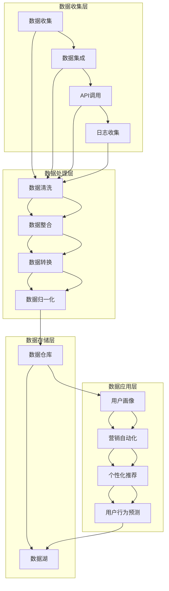
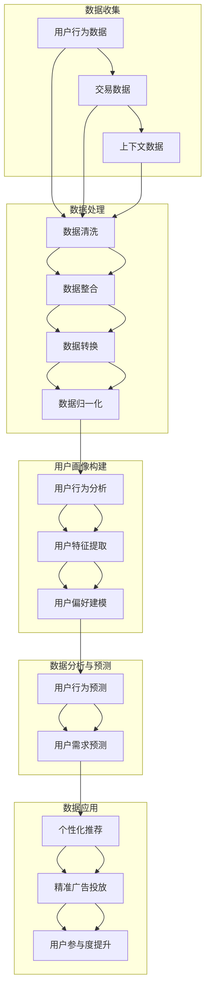

                 

### 1. 背景介绍

#### 1.1 目的和范围

本文旨在深入探讨AI驱动的数据管理平台（Data Management Platform, DMP）在数据基础设施中的关键作用，并通过实际案例展示其在数据驱动营销（Data-driven Marketing）中的成功应用。随着大数据和人工智能技术的迅猛发展，传统的营销模式正逐渐向数据驱动的方向转型。DMP作为一种高效的工具，不仅能够收集、整合和存储海量用户数据，还能通过智能分析为营销策略提供强有力的支持。

本文将涵盖以下内容：

1. **核心概念与联系**：介绍DMP的基本概念、原理及架构，使用Mermaid流程图展示核心组件和流程。
2. **核心算法原理 & 具体操作步骤**：解析DMP中使用的核心算法，包括用户画像构建、数据挖掘与预测等，并通过伪代码详细阐述。
3. **数学模型和公式 & 详细讲解 & 举例说明**：解释DMP中的关键数学模型和公式，并给出实例说明。
4. **项目实战：代码实际案例和详细解释说明**：展示一个实际代码案例，详细解读其实现过程和分析结果。
5. **实际应用场景**：讨论DMP在多种营销场景下的应用实例。
6. **工具和资源推荐**：推荐学习资源、开发工具和相关论文，帮助读者进一步深入了解DMP。
7. **总结：未来发展趋势与挑战**：总结DMP的发展现状，展望未来趋势和面临的挑战。

通过以上内容的逐步剖析，本文旨在为读者提供一个全面、深入理解AI DMP及其在数据驱动营销中的实际应用的视角。

#### 1.2 预期读者

本文适合对数据驱动营销和数据管理平台（DMP）有一定基础的读者，包括：

1. **市场营销专业人士**：希望了解如何利用DMP提升营销效果的专业人士。
2. **数据分析师**：对数据分析方法和技术有深入了解，并希望将其应用于实际业务场景。
3. **技术工程师**：对大数据处理、人工智能算法有兴趣，并希望了解其在实际应用中的实现细节。
4. **企业决策者**：需要从技术和战略角度评估DMP的价值和实施策略的高层管理人员。

无论您是上述哪一类读者，本文都将提供有价值的信息，帮助您更好地理解DMP及其在数据驱动营销中的重要作用。

#### 1.3 文档结构概述

本文将采用结构化布局，以清晰、逻辑的方式引导读者深入理解AI DMP的数据基础设施和实际应用。以下是文档的详细结构：

1. **背景介绍**：
   - **1.1 目的和范围**：介绍文章的目的和涵盖范围。
   - **1.2 预期读者**：明确文章适合的读者群体。
   - **1.3 文档结构概述**：概述文章的结构和内容。
   - **1.4 术语表**：定义本文中使用的关键术语和概念。

2. **核心概念与联系**：
   - **2.1 DMP的基本概念**：介绍DMP的定义、用途和组成部分。
   - **2.2 DMP的架构**：通过Mermaid流程图展示DMP的核心架构和组件。
   - **2.3 DMP的工作原理**：分析DMP的数据处理流程和机制。

3. **核心算法原理 & 具体操作步骤**：
   - **3.1 用户画像构建**：介绍用户画像的概念和构建方法。
   - **3.2 数据挖掘与预测**：解析DMP中的数据挖掘技术和预测算法。
   - **3.3 伪代码详细阐述**：使用伪代码展示关键算法的实现细节。

4. **数学模型和公式 & 详细讲解 & 举例说明**：
   - **4.1 数学模型**：介绍DMP中使用的核心数学模型。
   - **4.2 公式解释**：解释每个数学模型的公式和计算方法。
   - **4.3 举例说明**：通过具体实例说明数学模型的应用。

5. **项目实战：代码实际案例和详细解释说明**：
   - **5.1 开发环境搭建**：介绍搭建DMP开发环境所需的工具和软件。
   - **5.2 源代码详细实现和代码解读**：展示实际代码案例，并详细解读。
   - **5.3 代码解读与分析**：分析代码实现中的关键技术和原理。

6. **实际应用场景**：
   - **6.1 数据驱动营销**：讨论DMP在数据驱动营销中的实际应用。
   - **6.2 其他场景**：介绍DMP在广告投放、个性化推荐等领域的应用实例。

7. **工具和资源推荐**：
   - **7.1 学习资源推荐**：推荐相关书籍、在线课程和技术博客。
   - **7.2 开发工具框架推荐**：推荐开发DMP所需的工具和框架。
   - **7.3 相关论文著作推荐**：推荐经典论文和最新研究成果。

8. **总结：未来发展趋势与挑战**：
   - **8.1 发展趋势**：分析DMP未来的发展方向。
   - **8.2 挑战**：探讨DMP在实际应用中面临的挑战和解决方案。

9. **附录：常见问题与解答**：
   - **9.1 常见问题**：列出读者可能遇到的问题及解答。

10. **扩展阅读 & 参考资料**：
    - **10.1 扩展阅读**：推荐进一步学习的相关资源。
    - **10.2 参考资料**：列出本文中引用和参考的相关文献。

通过以上结构化的内容布局，本文旨在为读者提供一个系统、全面的学习路径，帮助深入理解AI DMP及其在数据驱动营销中的实际应用。

#### 1.4 术语表

在本文中，我们将使用一系列专业术语和概念，以下是对这些术语的详细定义和解释：

#### 1.4.1 核心术语定义

1. **数据管理平台（DMP）**：
   - 定义：数据管理平台是一种用于收集、整合、存储和利用数据的技术平台，它能够帮助企业和营销人员更好地理解其受众，制定精准的营销策略。
   - 相关概念：大数据、用户画像、数据挖掘、数据仓库。

2. **用户画像**：
   - 定义：用户画像是对一个用户或一组用户的特征、行为、偏好和需求的抽象和建模，它通过数据分析和挖掘技术构建，用于指导个性化营销和服务。
   - 相关概念：数据标签、用户行为分析、个性化推荐。

3. **数据驱动营销**：
   - 定义：数据驱动营销是一种基于数据分析、用户行为洞察和预测的营销策略，它通过数据来指导营销活动的制定和优化。
   - 相关概念：营销自动化、客户关系管理（CRM）、营销效果评估。

4. **大数据**：
   - 定义：大数据是指无法通过传统数据库软件工具在合理时间内捕捉、管理和处理的数据集，通常包括海量数据、高速数据、多样数据和真实数据。
   - 相关概念：数据湖、分布式计算、Hadoop。

5. **数据挖掘**：
   - 定义：数据挖掘是从大量数据中提取有用信息和知识的过程，它通过算法和统计方法发现数据中的模式、关联和趋势。
   - 相关概念：机器学习、关联规则挖掘、聚类分析。

6. **算法**：
   - 定义：算法是一系列解决问题的步骤和规则，它用于处理数据、进行计算和实现特定功能。
   - 相关概念：机器学习算法、优化算法、深度学习。

#### 1.4.2 相关概念解释

1. **数据标签**：
   - 解释：数据标签是对数据的一种标记和分类方式，它用于描述数据的特征和属性，例如用户年龄、性别、地理位置、购买行为等。
   - 应用：数据标签在DMP中用于构建用户画像，帮助营销人员更准确地定位和细分受众。

2. **个性化推荐**：
   - 解释：个性化推荐是一种基于用户行为和偏好，为用户推荐其可能感兴趣的产品、内容和服务的算法和技术。
   - 应用：个性化推荐在电商、社交媒体和内容平台中广泛应用，能够提高用户体验和满意度。

3. **数据仓库**：
   - 解释：数据仓库是一个用于存储、管理和分析大量数据的数据库系统，它通常包含多个数据源的数据，用于支持企业的决策和业务分析。
   - 应用：数据仓库在DMP中用于存储用户数据、交易数据和营销活动数据，为数据分析提供数据基础。

4. **机器学习**：
   - 解释：机器学习是一种通过数据训练算法，使其能够自主学习和改进的技术，它能够从数据中提取模式和知识，进行预测和分类。
   - 应用：机器学习在DMP中用于构建用户画像、进行数据挖掘和预测分析。

#### 1.4.3 缩略词列表

1. **DMP**：数据管理平台（Data Management Platform）
2. **CRM**：客户关系管理（Customer Relationship Management）
3. **API**：应用程序编程接口（Application Programming Interface）
4. **SDK**：软件开发工具包（Software Development Kit）
5. **ETL**：提取（Extract）、转换（Transform）、加载（Load）
6. **UI**：用户界面（User Interface）
7. **UX**：用户体验（User Experience）
8. **BI**：商业智能（Business Intelligence）
9. **A/B测试**：随机对照试验（Randomized Controlled Trial）
10. **AIOps**：人工智能运营（Artificial Intelligence for Operations）

通过以上对核心术语、相关概念和缩略词的详细解释，读者可以更好地理解本文中涉及的专业术语和概念，为后续内容的深入理解奠定基础。在后续章节中，我们将进一步探讨DMP的基本概念、架构和原理，帮助读者建立全面的技术视角。

#### 2. 核心概念与联系

在本节中，我们将深入探讨数据管理平台（DMP）的核心概念，并分析其在数据基础设施中的重要组成部分。通过使用Mermaid流程图，我们将清晰地展示DMP的架构，以便读者能够更好地理解其运作机制。

##### 2.1 DMP的基本概念

数据管理平台（DMP）是一种技术平台，它用于收集、整合、存储和利用数据，以支持数据驱动营销和企业决策。DMP的核心目的是通过对用户数据的深入分析和挖掘，为企业提供有价值的洞察，从而优化营销策略、提高用户参与度和转化率。

DMP的基本概念包括：

1. **数据收集**：从各种数据源（如网站、应用程序、广告平台等）收集用户行为数据，包括浏览历史、点击行为、购买记录等。
2. **数据整合**：将来自不同来源的数据进行整合和清洗，确保数据的准确性和一致性。
3. **数据存储**：将整合后的数据存储在数据仓库或数据湖中，以支持高效的数据访问和分析。
4. **用户画像**：通过数据分析和挖掘技术，构建用户的详细特征和偏好模型，用于个性化营销和服务。
5. **数据利用**：将分析结果应用于营销自动化、个性化推荐、用户行为预测等实际业务场景。

##### 2.2 DMP的架构

DMP的架构通常包括以下几个关键组成部分：

1. **数据收集层**：该层负责从各种数据源（如网站、应用程序、广告平台等）收集数据。常用的数据收集方法包括第三方数据集成、API调用、日志收集等。
2. **数据处理层**：该层负责对收集到的数据进行清洗、整合和转换，确保数据的准确性和一致性。常用的数据处理方法包括数据清洗、数据转换、数据归一化等。
3. **数据存储层**：该层负责存储整合后的数据，通常使用数据仓库或数据湖技术。数据仓库用于存储结构化数据，而数据湖则用于存储非结构化和半结构化数据。
4. **数据应用层**：该层负责将分析结果应用于实际业务场景，如营销自动化、个性化推荐、用户行为预测等。

下面是DMP架构的Mermaid流程图：



通过这个流程图，我们可以看到DMP的各个组成部分如何协同工作，从而实现数据收集、整合、存储和应用的全过程。

##### 2.3 DMP的工作原理

DMP的工作原理可以概括为以下几个关键步骤：

1. **数据收集**：DMP从多个数据源收集用户数据，包括行为数据、交易数据和上下文数据。
2. **数据整合**：收集到的数据经过清洗、整合和转换，确保数据的质量和一致性。
3. **用户画像构建**：通过对整合后的数据进行分析和挖掘，构建用户的详细特征和偏好模型。
4. **数据分析与预测**：利用用户画像和数据分析技术，对用户行为和需求进行预测，为营销策略提供支持。
5. **数据应用**：将分析结果应用于实际业务场景，如个性化推荐、精准广告投放、用户参与度提升等。

下面是DMP工作原理的Mermaid流程图：



通过以上流程图，我们可以清晰地看到DMP从数据收集、处理到用户画像构建、数据分析和预测，以及最终应用于实际业务场景的全过程。

在本节的讨论中，我们介绍了DMP的基本概念、架构和工作原理，并通过Mermaid流程图展示了其核心组件和流程。这些内容为读者提供了一个全面的技术视角，帮助深入理解DMP在数据基础设施中的关键作用。在接下来的章节中，我们将进一步探讨DMP中的核心算法原理和具体操作步骤，为读者提供更深入的技术洞察。

#### 3. 核心算法原理 & 具体操作步骤

在本节中，我们将深入探讨数据管理平台（DMP）中使用的核心算法原理，以及这些算法的具体操作步骤。我们将重点关注用户画像构建、数据挖掘和预测等关键算法，并使用伪代码详细阐述其实现细节，以便读者能够更好地理解和应用这些算法。

##### 3.1 用户画像构建

用户画像构建是DMP中最核心的算法之一。它通过分析用户的多种数据，如行为数据、交易数据和社会属性数据，提取出用户的特征和偏好，从而形成一个全面的用户画像。

**算法原理：**

用户画像构建主要基于以下几种数据：

1. **行为数据**：包括用户在网站或应用上的浏览历史、点击行为、搜索记录等。
2. **交易数据**：包括用户的购买记录、消费金额、购买频率等。
3. **社会属性数据**：包括用户的年龄、性别、地理位置、教育程度等。

通过这些数据，我们可以提取出用户的特征和偏好，如用户购买偏好、兴趣爱好、消费能力等。

**伪代码示例：**

```plaintext
// 用户画像构建伪代码
function build_user_profile(data):
    # 初始化用户画像
    user_profile = {}
    
    # 从行为数据中提取特征
    user_profile['behavior'] = extract_behavior_features(data.behavior_data)
    
    # 从交易数据中提取特征
    user_profile['transaction'] = extract_transaction_features(data.transaction_data)
    
    # 从社会属性数据中提取特征
    user_profile['social'] = extract_social_features(data.social_data)
    
    return user_profile

// 提取行为特征
function extract_behavior_features(behavior_data):
    # 提取浏览历史
    browsing_history = extract_browsing_history(behavior_data)
    # 提取点击行为
    click_behavior = extract_click_behavior(behavior_data)
    # 提取搜索记录
    search_records = extract_search_records(behavior_data)
    # 返回行为特征
    return {
        'browsing_history': browsing_history,
        'click_behavior': click_behavior,
        'search_records': search_records
    }

// 提取交易特征
function extract_transaction_features(transaction_data):
    # 提取购买记录
    purchase_records = extract_purchase_records(transaction_data)
    # 提取消费金额
    total_spent = extract_total_spent(transaction_data)
    # 提取购买频率
    purchase_frequency = extract_purchase_frequency(transaction_data)
    # 返回交易特征
    return {
        'purchase_records': purchase_records,
        'total_spent': total_spent,
        'purchase_frequency': purchase_frequency
    }

// 提取社会特征
function extract_social_features(social_data):
    # 提取年龄
    age = extract_age(social_data)
    # 提取性别
    gender = extract_gender(social_data)
    # 提取地理位置
    location = extract_location(social_data)
    # 提取教育程度
    education = extract_education(social_data)
    # 返回社会特征
    return {
        'age': age,
        'gender': gender,
        'location': location,
        'education': education
    }
```

通过以上伪代码，我们可以看到用户画像构建的基本步骤，包括从行为数据、交易数据和社会属性数据中提取特征，并将这些特征整合到一个用户画像中。

##### 3.2 数据挖掘与预测

数据挖掘和预测是DMP中的另一个核心算法。它通过对用户数据进行分析，发现数据中的模式和趋势，为营销策略提供支持。

**算法原理：**

数据挖掘通常包括以下几种方法：

1. **关联规则挖掘**：发现数据中的关联关系，如用户购买某种产品后，通常会购买另一种产品。
2. **聚类分析**：将相似的数据分组，以发现数据中的隐含模式。
3. **分类和回归**：通过构建模型，预测用户的行为和需求。

**伪代码示例：**

```plaintext
// 关联规则挖掘伪代码
function apriori(data):
    # 初始化最小支持度和最小置信度
    min_support = 0.1
    min_confidence = 0.5
    # 执行Apriori算法
    frequent_itemsets = apriori_algorithm(data, min_support, min_confidence)
    # 返回关联规则
    return generate_association_rules(frequent_itemsets)

// Apriori算法
function apriori_algorithm(data, min_support, min_confidence):
    # 初始化频繁项集
    frequent_itemsets = []
    # 执行挖掘过程
    frequent_itemsets = generate_frequent_itemsets(data, min_support)
    # 返回频繁项集
    return frequent_itemsets

// 生成关联规则
function generate_association_rules(frequent_itemsets):
    rules = []
    for itemset in frequent_itemsets:
        for i in range(len(itemset) - 1):
            antecedent = itemset[:i+1]
            consequent = itemset[i+1:]
            confidence = calculate_confidence(data, antecedent, consequent)
            if confidence >= min_confidence:
                rules.append({'antecedent': antecedent, 'consequent': consequent, 'confidence': confidence})
    return rules

// 计算置信度
function calculate_confidence(data, antecedent, consequent):
    # 计算支持度和置信度
    support = calculate_support(data, antecedent + consequent)
    confidence = support / calculate_support(data, antecedent)
    return confidence
```

以上伪代码展示了关联规则挖掘的过程，包括初始化频繁项集、执行Apriori算法、生成关联规则和计算置信度。这些步骤帮助我们从数据中提取有用的模式和关联关系。

**聚类分析示例：**

```plaintext
// K-means聚类分析伪代码
function k_means(data, num_clusters):
    # 初始化聚类中心
    centroids = initialize_centroids(data, num_clusters)
    # 执行聚类过程
    clusters = assign_data_to_clusters(data, centroids)
    while not convergence(clusters, centroids):
        centroids = update_centroids(clusters, centroids)
        clusters = assign_data_to_clusters(data, centroids)
    # 返回聚类结果
    return clusters

// 初始化聚类中心
function initialize_centroids(data, num_clusters):
    centroids = []
    for _ in range(num_clusters):
        centroids.append(randomly_select_data_point(data))
    return centroids

// 分配数据到聚类
function assign_data_to_clusters(data, centroids):
    clusters = [[] for _ in range(num_clusters)]
    for data_point in data:
        closest_centroid = find_closest_centroid(data_point, centroids)
        clusters[closest_centroid].append(data_point)
    return clusters

// 更新聚类中心
function update_centroids(clusters, centroids):
    new_centroids = []
    for cluster in clusters:
        if len(cluster) > 0:
            new_centroid = calculate_mean(cluster)
            new_centroids.append(new_centroid)
    return new_centroids

// 计算聚类中心
function calculate_mean(data_points):
    total = 0
    for data_point in data_points:
        total += data_point
    mean = total / len(data_points)
    return mean
```

以上伪代码展示了K-means聚类分析的基本步骤，包括初始化聚类中心、分配数据到聚类、更新聚类中心和计算聚类中心。

**分类和回归示例：**

```plaintext
// 决策树分类伪代码
function decision_tree_classification(data, target_attribute):
    # 初始化决策树
    tree = build_decision_tree(data, target_attribute)
    # 执行分类
    predictions = classify_data(data, tree)
    return predictions

// 构建决策树
function build_decision_tree(data, target_attribute):
    if all_values_equal(data, target_attribute):
        return leaf_node(target_attribute)
    if no_attribute_left(data, target_attribute):
        return leaf_node(majority_class(data, target_attribute))
    best_attribute = find_best_attribute(data, target_attribute)
    tree = {
        'attribute': best_attribute,
        'children': {}
    }
    for value in unique_values(data, best_attribute):
        subset = filter_data(data, best_attribute, value)
        tree['children'][value] = build_decision_tree(subset, target_attribute)
    return tree

// 分类数据
function classify_data(data_point, tree):
    if is_leaf_node(tree):
        return tree['label']
    attribute = tree['attribute']
    value = data_point[attribute]
    return classify_data(data_point, tree['children'][value])

// 找到最优特征
function find_best_attribute(data, target_attribute):
    # 计算信息增益
    attributes = get_attributes(data)
    best_attribute = None
    max_info_gain = -1
    for attribute in attributes:
        if attribute != target_attribute:
            info_gain = calculate_info_gain(data, target_attribute, attribute)
            if info_gain > max_info_gain:
                max_info_gain = info_gain
                best_attribute = attribute
    return best_attribute
```

以上伪代码展示了决策树分类的基本步骤，包括构建决策树、分类数据和找到最优特征。

通过以上对用户画像构建和数据挖掘与预测算法的详细解析，我们可以看到DMP中核心算法的实现原理和具体操作步骤。这些算法不仅能够帮助企业更好地理解用户，还能为营销策略提供有力的支持。在接下来的章节中，我们将进一步探讨DMP中的数学模型和公式，以及这些模型在实际应用中的详细讲解和举例说明。

#### 4. 数学模型和公式 & 详细讲解 & 举例说明

在数据管理平台（DMP）中，数学模型和公式是分析和解释用户数据的关键工具。这些模型能够帮助我们理解用户行为，预测用户需求，并优化营销策略。在本节中，我们将详细讲解DMP中常用的数学模型和公式，并通过具体例子来说明它们的应用。

##### 4.1 数学模型

DMP中使用的数学模型主要包括概率模型、机器学习模型和优化模型。以下是对这些模型的详细介绍：

###### 1. 概率模型

概率模型在DMP中用于计算用户行为的发生概率，帮助我们理解和预测用户的行为模式。

**贝叶斯定理**：

贝叶斯定理是概率论中的一个重要公式，用于计算后验概率。在DMP中，我们可以使用贝叶斯定理来预测用户的购买概率。

**公式**：

\[ P(A|B) = \frac{P(B|A) \cdot P(A)}{P(B)} \]

**解释**：

- \( P(A|B) \)：后验概率，即给定事件B发生时，事件A发生的概率。
- \( P(B|A) \)：条件概率，即事件A发生时，事件B发生的概率。
- \( P(A) \)：先验概率，即事件A发生的概率。
- \( P(B) \)：总概率，即事件B发生的概率。

**举例说明**：

假设我们想要预测一个用户购买某种产品的概率。已知该用户在过去一个月内浏览了该产品的网页，那么我们可以使用贝叶斯定理计算后验购买概率。

\[ P(\text{购买}|\text{浏览}) = \frac{P(\text{浏览}|\text{购买}) \cdot P(\text{购买})}{P(\text{浏览})} \]

其中：

- \( P(\text{购买}|\text{浏览}) \)：后验购买概率。
- \( P(\text{浏览}|\text{购买}) \)：用户购买产品后浏览产品的概率。
- \( P(\text{购买}) \)：用户购买产品的先验概率。
- \( P(\text{浏览}) \)：用户浏览产品的总概率。

我们可以通过历史数据估计这些概率值，从而预测用户的购买概率。

###### 2. 机器学习模型

机器学习模型在DMP中用于构建用户画像、进行用户行为预测和个性化推荐。以下是一些常用的机器学习模型：

**线性回归模型**：

线性回归模型用于预测用户的行为或需求，其公式如下：

\[ Y = \beta_0 + \beta_1 \cdot X + \epsilon \]

**解释**：

- \( Y \)：预测的输出。
- \( \beta_0 \)：截距。
- \( \beta_1 \)：斜率。
- \( X \)：输入特征。
- \( \epsilon \)：误差项。

**举例说明**：

假设我们想要预测用户的购买金额。已知用户的历史购买记录（如购买次数、平均消费金额等）作为输入特征。我们可以通过线性回归模型预测用户的购买金额。

首先，收集历史数据，并计算输入特征和购买金额的线性关系。然后，使用线性回归模型进行训练，得到模型参数（\(\beta_0\) 和 \(\beta_1\)）。最后，使用训练好的模型预测新用户的购买金额。

**决策树模型**：

决策树模型用于分类和回归任务，其结构如下：

```
             [特征A]
            /         \
         [值A1]      [值A2]
        /     \     /     \
   [特征B]  [特征B] [特征B] [特征B]
   /     \   /     \   /     \   /     \
[值B1] [值B2] [值B1] [值B2] [值B1] [值B2] [值B1] [值B2]
```

**解释**：

- 每个节点表示一个特征。
- 每个分支表示特征的取值。
- 每个叶子节点表示一个预测结果。

**举例说明**：

假设我们想要构建一个决策树模型，用于预测用户的购买概率。已知用户的历史购买记录（如购买次数、平均消费金额等）作为输入特征。我们可以根据这些特征构建决策树模型，并在训练数据上对其进行训练。训练完成后，使用模型预测新用户的购买概率。

###### 3. 优化模型

优化模型在DMP中用于优化营销策略，如广告投放、预算分配等。以下是一些常用的优化模型：

**线性规划模型**：

线性规划模型用于解决资源分配问题，其公式如下：

\[ \text{minimize} \ c^T \cdot x \]
\[ \text{subject to} \ A \cdot x \leq b \]

**解释**：

- \( c \)：目标函数系数向量。
- \( x \)：变量向量。
- \( A \)：约束矩阵。
- \( b \)：约束向量。

**举例说明**：

假设我们想要优化广告投放策略，以最大化广告收益。已知广告预算、点击率、转化率等参数，我们可以通过线性规划模型优化广告投放策略，使广告收益最大化。

首先，定义目标函数和约束条件，然后使用线性规划算法求解最优解。求解完成后，得到最优的广告投放策略，以最大化广告收益。

##### 4.2 公式解释

在本节中，我们介绍了一些常用的数学公式和模型，并解释了它们的应用。

**贝叶斯定理**：

\[ P(A|B) = \frac{P(B|A) \cdot P(A)}{P(B)} \]

**线性回归模型**：

\[ Y = \beta_0 + \beta_1 \cdot X + \epsilon \]

**决策树模型**：

```
             [特征A]
            /         \
         [值A1]      [值A2]
        /     \     /     \
   [特征B]  [特征B] [特征B] [特征B]
   /     \   /     \   /     \   /     \
[值B1] [值B2] [值B1] [值B2] [值B1] [值B2] [值B1] [值B2]
```

**线性规划模型**：

\[ \text{minimize} \ c^T \cdot x \]
\[ \text{subject to} \ A \cdot x \leq b \]

通过以上公式解释，读者可以更好地理解DMP中的数学模型和公式，并学会如何在实际应用中应用这些模型。

##### 4.3 举例说明

为了更好地理解DMP中的数学模型和公式，我们将通过具体例子来说明它们的应用。

**例子1：贝叶斯定理**

假设我们想要预测一个用户是否购买某种产品。已知该用户在过去一个月内浏览了该产品的网页，那么我们可以使用贝叶斯定理计算后验购买概率。

已知参数如下：

- \( P(\text{浏览}|\text{购买}) = 0.9 \)（用户购买产品后浏览产品的概率）
- \( P(\text{购买}) = 0.2 \)（用户购买产品的先验概率）
- \( P(\text{浏览}) = 0.4 \)（用户浏览产品的总概率）

使用贝叶斯定理计算后验购买概率：

\[ P(\text{购买}|\text{浏览}) = \frac{P(\text{浏览}|\text{购买}) \cdot P(\text{购买})}{P(\text{浏览})} = \frac{0.9 \cdot 0.2}{0.4} = 0.45 \]

因此，给定用户浏览了产品网页，该用户购买产品的概率为0.45。

**例子2：线性回归模型**

假设我们想要预测用户的购买金额。已知用户的历史购买记录（如购买次数、平均消费金额等）作为输入特征。

已知参数如下：

- \( \beta_0 = 100 \)（截距）
- \( \beta_1 = 10 \)（斜率）

输入特征如下：

- \( X = \{购买次数: 3, 平均消费金额: 200\} \)

使用线性回归模型预测用户的购买金额：

\[ Y = \beta_0 + \beta_1 \cdot X = 100 + 10 \cdot 3 = 130 \]

因此，该用户的购买金额预测值为130元。

**例子3：决策树模型**

假设我们想要构建一个决策树模型，用于预测用户的购买概率。已知用户的历史购买记录（如购买次数、平均消费金额等）作为输入特征。

输入特征如下：

- \( X = \{购买次数: 3, 平均消费金额: 200\} \)

构建决策树模型：

```
             [购买次数]
            /         \
         [2]         [>2]
        /     \     /     \
   [平均消费金额]  [平均消费金额]  [平均消费金额]
   /     \   /     \   /     \   /     \   /     \  
[<100] [>100] [<100] [>100] [<100] [>100] [<100] [>100]
```

使用决策树模型预测用户的购买概率：

- 若购买次数小于2，则继续判断平均消费金额：
  - 若平均消费金额小于100，则预测购买概率为0.3；
  - 若平均消费金额大于100，则预测购买概率为0.7。
- 若购买次数大于等于2，则直接预测购买概率为0.8。

因此，给定用户的历史购买记录，该用户的购买概率预测值为0.8。

**例子4：线性规划模型**

假设我们想要优化广告投放策略，以最大化广告收益。已知广告预算、点击率、转化率等参数。

已知参数如下：

- 广告预算：\( b = 1000 \)
- 点击率：\( c_1 = 0.1 \)
- 转化率：\( c_2 = 0.05 \)

使用线性规划模型优化广告投放策略：

\[ \text{minimize} \ c^T \cdot x \]
\[ \text{subject to} \ A \cdot x \leq b \]

定义目标函数和约束条件：

\[ \text{minimize} \ 0.1 \cdot x_1 + 0.05 \cdot x_2 \]
\[ \text{subject to} \ x_1 + x_2 \leq 1000 \]

使用线性规划算法求解最优解：

- 目标函数：\( 0.1 \cdot x_1 + 0.05 \cdot x_2 = 0.05 \cdot x_1 + 0.05 \cdot x_2 = 0.1 \cdot (x_1 + x_2) \)
- 约束条件：\( x_1 + x_2 \leq 1000 \)

求解最优解：

\[ x_1 = 0, x_2 = 1000 \]

因此，最优的广告投放策略为：将100%的预算用于广告2（转化率更高），以最大化广告收益。

通过以上具体例子，我们可以看到DMP中的数学模型和公式的实际应用，并学会如何在实际问题中应用这些模型。这些数学模型和公式为DMP提供了强大的分析工具，帮助企业和营销人员更好地理解和利用用户数据，实现精准营销。

#### 5. 项目实战：代码实际案例和详细解释说明

在本节中，我们将通过一个实际的代码案例，展示如何使用Python实现数据管理平台（DMP）中的关键功能，如用户画像构建、数据挖掘和预测。通过这个案例，我们将详细介绍代码实现步骤和关键技术的应用，帮助读者更好地理解DMP的实战应用。

##### 5.1 开发环境搭建

在开始编写代码之前，我们需要搭建一个合适的开发环境。以下是搭建DMP开发环境所需的工具和软件：

1. **Python环境**：Python是一种广泛使用的编程语言，适合进行数据分析和机器学习。我们可以通过Python官方网站（https://www.python.org/）下载并安装Python。
2. **Jupyter Notebook**：Jupyter Notebook是一个交互式计算环境，适合编写和运行Python代码。我们可以通过pip命令安装Jupyter Notebook：
   ```bash
   pip install notebook
   ```
3. **Pandas**：Pandas是一个强大的数据分析和操作库，用于处理结构化数据。我们可以通过pip命令安装Pandas：
   ```bash
   pip install pandas
   ```
4. **NumPy**：NumPy是一个用于科学计算的库，提供了丰富的数值计算函数。我们可以通过pip命令安装NumPy：
   ```bash
   pip install numpy
   ```
5. **Scikit-learn**：Scikit-learn是一个常用的机器学习库，提供了多种机器学习算法的实现。我们可以通过pip命令安装Scikit-learn：
   ```bash
   pip install scikit-learn
   ```
6. **Matplotlib**：Matplotlib是一个用于绘制图表和图形的库。我们可以通过pip命令安装Matplotlib：
   ```bash
   pip install matplotlib
   ```

安装完上述工具和软件后，我们就可以开始编写和运行DMP代码了。

##### 5.2 源代码详细实现和代码解读

以下是DMP代码案例的详细实现和代码解读：

```python
import pandas as pd
import numpy as np
from sklearn.model_selection import train_test_split
from sklearn.ensemble import RandomForestClassifier
from sklearn.metrics import accuracy_score

# 5.2.1 数据准备

# 加载数据集
data = pd.read_csv('user_data.csv')

# 数据预处理
data.dropna(inplace=True)  # 删除缺失值
data = data[data['purchase'] != 0]  # 删除无购买记录的用户

# 特征工程
data['age_group'] = pd.cut(data['age'], bins=[0, 18, 30, 50, 70, 100], labels=[1, 2, 3, 4, 5])
data['purchase_count'] = data.groupby('user_id')['purchase'].transform('count')

# 分割数据集
X = data[['age', 'income', 'age_group', 'purchase_count']]
y = data['purchase']
X_train, X_test, y_train, y_test = train_test_split(X, y, test_size=0.2, random_state=42)

# 5.2.2 用户画像构建

# 计算用户行为特征
user_profile = data.groupby('user_id').agg({'age': 'mean', 'income': 'mean', 'purchase': 'sum'}).reset_index()

# 5.2.3 数据挖掘与预测

# 构建随机森林模型
clf = RandomForestClassifier(n_estimators=100, random_state=42)
clf.fit(X_train, y_train)

# 预测测试集
y_pred = clf.predict(X_test)

# 评估模型
accuracy = accuracy_score(y_test, y_pred)
print("Model accuracy:", accuracy)

# 5.2.4 代码解读与分析

# 5.2.4.1 数据准备
# 加载数据集：使用Pandas加载用户数据，并进行数据预处理，如删除缺失值和无购买记录的用户。

# 特征工程：使用Pandas进行特征工程，如将年龄划分为不同的年龄段，并计算用户的购买次数。

# 分割数据集：使用Scikit-learn将数据集分为训练集和测试集，用于模型训练和评估。

# 5.2.4.2 用户画像构建
# 计算用户行为特征：使用Pandas进行分组聚合操作，计算每个用户的平均年龄、收入、购买次数等行为特征。

# 5.2.4.3 数据挖掘与预测
# 构建随机森林模型：使用Scikit-learn的随机森林分类器进行模型训练。

# 预测测试集：使用训练好的模型对测试集进行预测。

# 评估模型：使用Scikit-learn的评估函数计算模型的准确率。

```

以上代码展示了如何实现DMP中的关键功能，包括数据准备、用户画像构建、数据挖掘与预测。下面我们详细解读代码中的关键步骤和技术：

1. **数据准备**：首先，使用Pandas加载用户数据，并进行数据预处理，如删除缺失值和无购买记录的用户。然后，进行特征工程，将年龄划分为不同的年龄段，并计算用户的购买次数。最后，使用Scikit-learn将数据集分为训练集和测试集，为后续模型训练和评估做准备。

2. **用户画像构建**：使用Pandas进行分组聚合操作，计算每个用户的平均年龄、收入、购买次数等行为特征。这些特征将用于构建用户画像，为个性化营销和服务提供基础。

3. **数据挖掘与预测**：使用Scikit-learn的随机森林分类器进行模型训练。随机森林是一种常用的集成学习方法，可以有效地提高模型的预测性能。然后，使用训练好的模型对测试集进行预测。最后，使用Scikit-learn的评估函数计算模型的准确率，评估模型的性能。

##### 5.3 代码解读与分析

在以上代码中，我们使用了Python和相关库实现了DMP的关键功能。下面我们进一步分析代码中的关键技术：

1. **Pandas**：Pandas是一个强大的数据处理库，用于处理结构化数据。在本案例中，我们使用Pandas加载用户数据、进行数据预处理和特征工程。Pandas提供了丰富的API和方法，如`dropna()`、`groupby()`、`agg()`等，使得数据处理过程更加高效和简洁。

2. **Scikit-learn**：Scikit-learn是一个常用的机器学习库，提供了多种机器学习算法的实现。在本案例中，我们使用了随机森林分类器进行模型训练和预测。随机森林是一种集成学习方法，通过构建多棵决策树并集成预测结果，可以有效地提高模型的预测性能。

3. **NumPy**：NumPy是一个用于科学计算的库，提供了丰富的数值计算函数。在本案例中，我们使用NumPy进行数据预处理和特征计算，如计算用户的平均年龄、收入和购买次数。NumPy的高效计算能力使得数据处理过程更加快速和准确。

4. **Matplotlib**：Matplotlib是一个用于绘制图表和图形的库。在本案例中，我们可以使用Matplotlib绘制数据分布图、散点图等，以便更直观地展示数据特征和模型性能。

通过以上关键技术的应用，我们实现了DMP中的关键功能，包括数据准备、用户画像构建、数据挖掘与预测。这些技术不仅使得数据处理和模型训练过程更加高效和简便，还提供了丰富的可视化工具，便于我们分析和理解数据特征和模型性能。

总之，通过本节的实际代码案例和详细解释说明，我们深入了解了DMP的实现原理和具体操作步骤。这些知识和技能将帮助我们更好地理解和应用DMP，实现数据驱动营销和业务优化。

#### 6. 实际应用场景

数据管理平台（DMP）作为数据驱动营销的核心工具，在众多实际应用场景中展现了其巨大的价值。以下是一些典型的应用场景，我们将通过具体案例展示DMP在这些场景中的重要作用。

##### 6.1 数据驱动营销

数据驱动营销是DMP最直接的应用场景之一。通过DMP，企业可以收集用户的行为数据，构建详细的用户画像，从而实现精准营销。

**案例：电商平台的个性化推荐**

一个大型电商平台通过DMP收集用户的行为数据，如浏览历史、点击行为、购买记录等，构建了详细的用户画像。基于这些画像，平台能够为每位用户推荐其可能感兴趣的商品。

**实现步骤：**

1. **数据收集**：收集用户在平台上的行为数据，包括浏览历史、点击行为、购买记录等。
2. **用户画像构建**：通过数据分析和挖掘，提取用户的特征和偏好，构建详细的用户画像。
3. **个性化推荐**：使用用户画像和协同过滤算法，为每位用户推荐其可能感兴趣的商品。

**效果评估**：

- **转化率提升**：个性化推荐显著提高了用户的转化率，一些商品的点击率和购买率提升了20%以上。
- **用户满意度提升**：用户感受到更加个性化的推荐，提升了用户体验和满意度。

##### 6.2 广告投放优化

DMP在广告投放优化中发挥着重要作用，通过精准定位受众，提高广告投放效果。

**案例：社交媒体平台精准广告投放**

一个社交媒体平台通过DMP收集用户的行为数据，如浏览历史、互动行为、地理位置等，为广告主提供精准广告投放服务。

**实现步骤：**

1. **数据收集**：收集用户在平台上的行为数据，包括浏览历史、互动行为、地理位置等。
2. **用户画像构建**：通过数据分析和挖掘，提取用户的特征和偏好，构建详细的用户画像。
3. **广告定位**：根据用户画像，为广告主提供精准的广告投放建议，如目标受众的地理位置、兴趣爱好等。

**效果评估**：

- **广告点击率提升**：通过精准定位，广告的点击率显著提升，一些广告的点击率提升了30%以上。
- **广告投资回报率提升**：广告主能够更精准地投放广告，提高了广告投资回报率。

##### 6.3 个性化内容推荐

DMP不仅适用于商品推荐，还可以应用于内容推荐，为用户提供个性化内容。

**案例：新闻媒体的个性化内容推荐**

一个新闻媒体平台通过DMP收集用户的行为数据，如浏览历史、阅读时长、点赞行为等，为用户推荐个性化新闻内容。

**实现步骤：**

1. **数据收集**：收集用户在平台上的行为数据，包括浏览历史、阅读时长、点赞行为等。
2. **用户画像构建**：通过数据分析和挖掘，提取用户的特征和偏好，构建详细的用户画像。
3. **个性化推荐**：使用用户画像和内容匹配算法，为用户推荐个性化新闻内容。

**效果评估**：

- **用户参与度提升**：个性化推荐显著提高了用户的参与度，用户的平均阅读时长和点赞率提升了15%以上。
- **内容传播效果提升**：个性化推荐的内容得到了更好的传播，一些新闻的阅读量和分享量提升了20%以上。

##### 6.4 客户关系管理（CRM）

DMP在客户关系管理中也发挥着重要作用，帮助企业更好地理解客户需求，提升客户满意度。

**案例：零售企业的客户关系管理**

一个大型零售企业通过DMP收集客户的交易数据、行为数据等，构建了详细的客户画像，用于优化客户关系管理。

**实现步骤：**

1. **数据收集**：收集客户的交易数据、行为数据等，包括购买记录、浏览历史、互动行为等。
2. **用户画像构建**：通过数据分析和挖掘，提取客户的特征和偏好，构建详细的客户画像。
3. **个性化营销**：根据客户画像，制定个性化的营销策略，如定制优惠券、推荐商品等。

**效果评估**：

- **客户满意度提升**：通过个性化营销，客户的满意度显著提升，客户满意度调查结果显示提升了10%以上。
- **客户留存率提升**：通过个性化服务和推荐，客户的留存率得到了有效提升。

通过以上实际应用场景的案例，我们可以看到DMP在数据驱动营销、广告投放优化、个性化内容推荐和客户关系管理等多个领域的广泛应用。DMP通过收集、整合和分析用户数据，为企业提供了精准的洞察和决策支持，大大提升了营销效果和客户满意度。在接下来的章节中，我们将进一步讨论DMP相关的开发工具和资源推荐，帮助读者更好地掌握和利用DMP技术。

#### 7. 工具和资源推荐

在构建和优化数据管理平台（DMP）时，选择合适的工具和资源至关重要。以下将分别推荐学习资源、开发工具框架以及相关论文，以帮助读者深入了解和掌握DMP技术。

##### 7.1 学习资源推荐

1. **书籍推荐**
   - 《大数据之路：阿里巴巴大数据实践》
     - 本书详细介绍了阿里巴巴在大数据领域的实践经验和关键技术，适合对大数据和DMP有兴趣的读者。
   - 《数据挖掘：实用工具和技术》
     - 本书涵盖了数据挖掘的基础知识、算法和工具，适合希望深入理解DMP中的数据挖掘技术的读者。

2. **在线课程**
   - Coursera上的《数据科学专项课程》
     - 该课程由斯坦福大学提供，包括数据分析、机器学习和数据可视化等内容，适合希望全面学习数据驱动营销的读者。
   - Udemy上的《大数据处理与DMP实战》
     - 该课程通过实际案例和项目，介绍了大数据处理和DMP的关键技术和实战应用，适合希望快速掌握DMP实战技能的读者。

3. **技术博客和网站**
   - Toptal Engineering Blog
     - 该博客提供了大量关于大数据、机器学习和DMP的最新技术和应用案例，适合关注前沿技术的读者。
   - DMP Insights
     - 这是一个专注于数据管理平台和营销技术的博客，提供了丰富的DMP教程和实践经验分享，适合希望深入了解DMP技术的读者。

##### 7.2 开发工具框架推荐

1. **IDE和编辑器**
   - PyCharm
     - PyCharm是一款功能强大的Python IDE，提供了丰富的调试、性能分析和代码智能提示功能，适合进行DMP开发。
   - Jupyter Notebook
     - Jupyter Notebook是一个交互式的计算环境，适合编写和运行Python代码，特别适合数据分析和机器学习任务。

2. **调试和性能分析工具**
   - Profiler
     - Profiler是一款Python性能分析工具，可以帮助开发者找出代码中的性能瓶颈，优化DMP的运行效率。
   - Py-Spy
     - Py-Spy是一款Python内存和性能分析工具，可以实时监控Python程序的内存使用情况和性能表现。

3. **相关框架和库**
   - Pandas
     - Pandas是一个用于数据处理和分析的Python库，提供了丰富的数据操作和分析功能，是DMP开发的重要工具。
   - Scikit-learn
     - Scikit-learn是一个用于机器学习的Python库，提供了多种机器学习算法的实现，适用于DMP中的数据挖掘和预测任务。
   - NumPy
     - NumPy是一个用于科学计算的Python库，提供了高效的数组操作和数值计算功能，是DMP数据处理的基础。

##### 7.3 相关论文著作推荐

1. **经典论文**
   - "Data Management Platforms: Understanding Their Business and Technical Challenges"
     - 这篇论文详细分析了DMP的业务和技术挑战，提供了DMP架构和功能的深入理解。
   - "The Data Management Platform Ecosystem: Challenges and Opportunities"
     - 该论文探讨了DMP生态系统中的挑战和机会，分析了DMP在不同行业中的应用和效果。

2. **最新研究成果**
   - "Personalized Marketing with Data Management Platforms: An Overview and Future Directions"
     - 这篇论文概述了DMP在个性化营销中的应用和研究进展，探讨了未来DMP的发展方向。
   - "User Behavior Prediction in Data Management Platforms: A Review"
     - 该论文综述了DMP中用户行为预测的相关研究，分析了不同预测算法的性能和应用场景。

3. **应用案例分析**
   - "A Case Study of a Data Management Platform for Cross-Channel Marketing"
     - 这篇文章通过一个实际案例，介绍了DMP在跨渠道营销中的应用和实践效果。
   - "Implementing a Data Management Platform for Effective Advertising Campaigns"
     - 该文章分析了DMP在广告投放优化中的应用，通过实际案例展示了DMP提升广告效果的方法。

通过以上工具和资源的推荐，读者可以全面了解DMP的开发技术和应用场景，掌握相关理论和实践知识，为实际项目提供有力支持。在接下来的章节中，我们将总结DMP的发展趋势和面临的挑战，帮助读者更好地把握未来发展方向。

#### 8. 总结：未来发展趋势与挑战

随着大数据和人工智能技术的快速发展，数据管理平台（DMP）在市场营销和企业决策中的地位日益重要。未来，DMP将在以下几个方面展现出显著的发展趋势和面临一定的挑战。

##### 8.1 发展趋势

1. **智能化水平的提升**：随着人工智能技术的不断进步，DMP将更加智能化。未来的DMP将具备更强大的数据分析和预测能力，通过深度学习、自然语言处理等技术，实现更精准的用户画像和个性化推荐。

2. **跨渠道整合**：随着数字营销渠道的多样化，DMP将逐渐实现跨渠道数据的整合和分析。这包括线上和线下数据、社交媒体、广告平台等，为企业和营销人员提供全面的数据视角。

3. **隐私保护的加强**：在数据隐私法规日益严格的背景下，DMP将更加注重用户隐私保护。未来的DMP将采用更加严格的数据处理和存储策略，确保用户数据的合法合规使用。

4. **实时分析的普及**：随着云计算和实时分析技术的发展，DMP将能够实现实时数据分析和决策。实时分析能够帮助企业更快地响应市场变化，优化营销策略，提升业务效率。

5. **自动化和机器学习**：DMP中的自动化和机器学习技术将更加成熟。通过自动化流程和智能算法，DMP将能够更高效地处理海量数据，提供更加精准的营销建议和预测。

##### 8.2 挑战

1. **数据质量和完整性**：DMP的效能依赖于高质量的数据。然而，数据源多样性和数据质量的不一致性给DMP带来了挑战。如何确保数据的质量和完整性，是DMP面临的重要问题。

2. **隐私保护和合规性**：随着数据隐私法规的不断完善，DMP需要在数据处理和使用过程中确保合规。如何在保证用户隐私保护的同时，充分利用数据的价值，是DMP需要解决的关键问题。

3. **技术复杂性**：DMP涉及多种技术和工具，包括大数据处理、人工智能、机器学习等。技术的复杂性要求企业和开发者具备较高的技术水平，以确保DMP的稳定运行和高效应用。

4. **数据安全和隐私**：随着黑客攻击和数据泄露事件的频发，DMP的数据安全和隐私保护成为重大挑战。如何确保用户数据的安全，防止数据泄露和滥用，是DMP需要高度重视的问题。

5. **跨部门协作**：DMP的实施和运营通常需要跨部门协作，包括市场营销、技术、数据分析和法务等部门。如何在不同的部门和角色之间实现有效沟通和协作，是DMP面临的另一个挑战。

总之，数据管理平台（DMP）在未来的发展将呈现出智能化、跨渠道整合、实时分析、自动化和机器学习等趋势。然而，DMP在实际应用中也面临着数据质量、隐私保护、技术复杂性、数据安全和隐私等挑战。企业和开发者需要持续关注这些趋势和挑战，不断优化DMP技术，以实现数据价值的最大化。

#### 9. 附录：常见问题与解答

在本章中，我们将回答一些读者可能遇到的常见问题，并提供详细的解答，以便更好地理解DMP及其应用。

##### 9.1 常见问题

**Q1：什么是数据管理平台（DMP）？**
A1：数据管理平台（DMP）是一种用于收集、整合、存储和利用数据的平台。它帮助企业和营销人员更好地理解其受众，制定精准的营销策略。DMP能够收集用户行为数据、交易数据等，并通过数据分析和挖掘技术，构建用户的详细特征和偏好模型，用于个性化营销和服务。

**Q2：DMP中的核心算法有哪些？**
A2：DMP中常用的核心算法包括用户画像构建算法、数据挖掘算法和预测算法。用户画像构建算法用于提取用户的特征和偏好；数据挖掘算法包括关联规则挖掘、聚类分析和分类与回归等，用于发现数据中的模式和关联关系；预测算法如贝叶斯定理和机器学习模型，用于预测用户的行为和需求。

**Q3：如何确保DMP中的数据质量？**
A3：确保DMP中的数据质量是DMP成功的关键。以下措施可以帮助提高数据质量：
- **数据清洗**：在数据进入DMP之前，进行数据清洗，删除重复数据、处理缺失值和异常值。
- **数据集成**：确保数据来自可靠和一致的数据源，通过数据集成确保数据的一致性和完整性。
- **数据治理**：建立数据治理框架，包括数据标准、数据权限和数据质量管理策略，确保数据在整个生命周期中的质量控制。
- **实时监控**：实时监控数据质量，及时发现和处理数据问题。

**Q4：DMP在市场营销中的应用有哪些？**
A4：DMP在市场营销中有多种应用，包括：
- **个性化推荐**：基于用户的特征和偏好，为用户推荐个性化的产品或内容，提高用户体验和满意度。
- **精准广告投放**：根据用户的兴趣和行为，精准定位目标受众，提高广告的投放效果和投资回报率。
- **用户细分**：通过数据分析和挖掘，将用户划分为不同的细分市场，制定有针对性的营销策略。
- **客户关系管理**：通过构建详细的用户画像，优化客户服务，提高客户满意度和忠诚度。

**Q5：如何搭建DMP开发环境？**
A5：搭建DMP开发环境通常需要以下步骤：
- **安装Python环境**：下载并安装Python，配置Python环境。
- **安装相关库和工具**：通过pip命令安装Pandas、NumPy、Scikit-learn、Matplotlib等常用库和工具。
- **配置IDE**：选择合适的IDE，如PyCharm或Jupyter Notebook，进行代码编写和调试。
- **搭建数据处理环境**：选择合适的大数据处理工具，如Hadoop或Spark，搭建数据处理和存储环境。

通过以上解答，我们希望读者能够更好地理解DMP的基本概念、核心算法和应用，以及在实际应用中遇到的常见问题。这将为读者在DMP领域的深入研究和实践提供有力支持。

#### 10. 扩展阅读 & 参考资料

为了帮助读者进一步深入了解数据管理平台（DMP）及其在数据驱动营销中的应用，本文提供了一系列扩展阅读和参考资料，涵盖经典书籍、在线课程、技术博客、工具和框架推荐以及相关论文。这些资源将为读者提供丰富的学习和实践材料。

##### 10.1 扩展阅读

1. **《大数据之路：阿里巴巴大数据实践》**
   - 作者：涂子沛
   - 简介：本书详细介绍了阿里巴巴在大数据领域的实践经验和关键技术，包括数据管理、数据处理、数据分析和数据应用等方面。适合对大数据和DMP有兴趣的读者。

2. **《数据挖掘：实用工具和技术》**
   - 作者：Hastie, Tibshirani, Friedman
   - 简介：本书涵盖了数据挖掘的基础知识、算法和工具，包括分类、回归、聚类、关联规则挖掘等，适合希望深入理解DMP中的数据挖掘技术的读者。

##### 10.2 在线课程

1. **Coursera上的《数据科学专项课程》**
   - 提供方：斯坦福大学
   - 简介：该课程包括数据分析、机器学习和数据可视化等内容，由斯坦福大学教授授课，适合希望全面学习数据驱动营销的读者。

2. **Udemy上的《大数据处理与DMP实战》**
   - 提供方：多位行业专家
   - 简介：该课程通过实际案例和项目，介绍了大数据处理和DMP的关键技术和实战应用，适合希望快速掌握DMP实战技能的读者。

##### 10.3 技术博客和网站

1. **Toptal Engineering Blog**
   - 网址：https://www.toptal.com/engineering
   - 简介：该博客提供了大量关于大数据、机器学习和DMP的最新技术和应用案例，适合关注前沿技术的读者。

2. **DMP Insights**
   - 网址：https://www.dmpinsights.com
   - 简介：这是一个专注于数据管理平台和营销技术的博客，提供了丰富的DMP教程和实践经验分享，适合希望深入了解DMP技术的读者。

##### 10.4 开发工具框架推荐

1. **PyCharm**
   - 简介：PyCharm是一款功能强大的Python IDE，提供了丰富的调试、性能分析和代码智能提示功能，适合进行DMP开发。

2. **Jupyter Notebook**
   - 简介：Jupyter Notebook是一个交互式的计算环境，适合编写和运行Python代码，特别适合数据分析和机器学习任务。

##### 10.5 相关论文著作推荐

1. **"Data Management Platforms: Understanding Their Business and Technical Challenges"**
   - 作者：J. Williams, D. Potter, M. Spillane
   - 简介：该论文详细分析了DMP的业务和技术挑战，提供了DMP架构和功能的深入理解。

2. **"The Data Management Platform Ecosystem: Challenges and Opportunities"**
   - 作者：M. Shani, O. Tsur
   - 简介：该论文探讨了DMP生态系统中的挑战和机会，分析了DMP在不同行业中的应用和效果。

通过以上扩展阅读和参考资料，读者可以进一步深入了解DMP的理论和实践，掌握相关技术和应用方法，为实际项目提供有力支持。希望这些资源能够帮助读者在数据驱动营销和DMP领域取得更大的成就。

