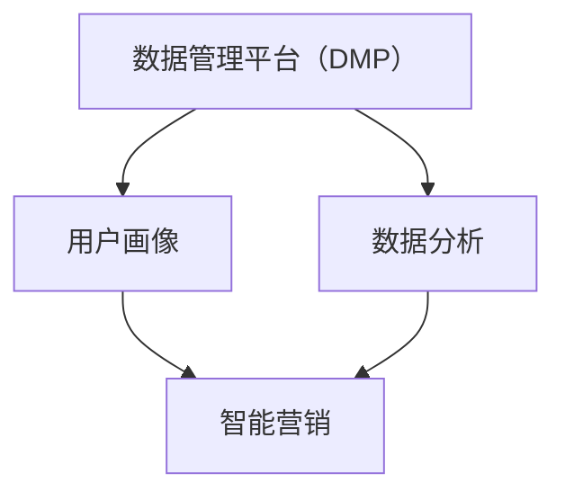

                 

# AI DMP 数据基建：构建智能营销的核心引擎

> 关键词：AI、DMP、数据基建、智能营销、数据分析、用户画像、算法

> 摘要：随着大数据和人工智能技术的迅猛发展，数据管理平台（DMP）在智能营销中的应用越来越广泛。本文将从背景介绍、核心概念、算法原理、数学模型、实战案例、应用场景等多个方面，深入探讨如何构建AI驱动的DMP数据基建，从而打造智能营销的核心引擎。

## 1. 背景介绍

### 1.1 目的和范围

本文旨在阐述如何构建AI驱动的数据管理平台（DMP），从而为智能营销提供强有力的支持。文章将涵盖以下内容：

- DMP在智能营销中的重要作用；
- DMP的核心概念与架构；
- AI技术在DMP中的应用；
- 数据分析与用户画像构建；
- 实战案例与详细解析；
- DMP在各类实际应用场景中的价值；
- 开发工具和资源推荐。

### 1.2 预期读者

本文适合对大数据、人工智能和智能营销有一定了解的读者，包括但不限于：

- 数据分析师；
- 数据工程师；
- AI技术开发者；
- 智能营销从业人员；
- 对AI技术有兴趣的初学者。

### 1.3 文档结构概述

本文分为十个部分，具体结构如下：

1. 背景介绍
2. 核心概念与联系
3. 核心算法原理 & 具体操作步骤
4. 数学模型和公式 & 详细讲解 & 举例说明
5. 项目实战：代码实际案例和详细解释说明
6. 实际应用场景
7. 工具和资源推荐
8. 总结：未来发展趋势与挑战
9. 附录：常见问题与解答
10. 扩展阅读 & 参考资料

### 1.4 术语表

#### 1.4.1 核心术语定义

- 数据管理平台（DMP）：一种用于收集、整合和分析用户数据的系统，旨在为智能营销提供支持。
- 用户画像：通过对用户数据的分析，构建出的用户属性、兴趣、行为等多维度的模型。
- 数据分析：运用统计学、机器学习等方法，对大量数据进行分析和处理，以提取有价值的信息。
- 智能营销：基于数据分析和用户画像，实现个性化、智能化的营销活动。

#### 1.4.2 相关概念解释

- 大数据：指数据量巨大、类型繁多、生成速度极快的数据。
- 人工智能：一种模拟人类智能的技术，能够进行感知、学习、推理、决策等。
- 营销自动化：利用技术手段，自动化执行营销流程，提高营销效率和效果。

#### 1.4.3 缩略词列表

- DMP：数据管理平台（Data Management Platform）
- AI：人工智能（Artificial Intelligence）
- 数据分析（Data Analysis）
- 用户画像（User Profile）
- 智能营销（Smart Marketing）
- 营销自动化（Marketing Automation）

## 2. 核心概念与联系

为了更好地理解DMP在智能营销中的作用，我们首先需要了解一些核心概念和它们之间的联系。以下是DMP、用户画像、数据分析、智能营销等核心概念的Mermaid流程图：



### 2.1 DMP的作用

数据管理平台（DMP）是智能营销的核心基础设施，其主要作用包括：

1. 收集：从各种来源收集用户数据，如网站点击、浏览行为、搜索记录等。
2. 整合：将收集到的数据进行清洗、整合，形成一个统一的数据视图。
3. 分析：运用数据分析技术，挖掘数据背后的价值，构建用户画像。
4. 应用：将用户画像和数据分析结果应用于智能营销，实现个性化推荐、广告投放、用户触达等。

### 2.2 用户画像

用户画像是指通过对用户数据的分析，构建出的用户属性、兴趣、行为等多维度的模型。用户画像的作用包括：

1. 个性化推荐：根据用户画像，为用户推荐感兴趣的内容、产品或服务。
2. 广告投放：根据用户画像，精准投放广告，提高广告投放效果。
3. 用户触达：根据用户画像，确定合适的触达方式和时机，提高用户转化率。

### 2.3 数据分析

数据分析是DMP的核心功能，它通过对大量用户数据进行分析，提取有价值的信息，为智能营销提供支持。数据分析主要包括以下几个步骤：

1. 数据收集：从各种来源收集用户数据。
2. 数据清洗：对数据进行清洗、去重、标准化等处理。
3. 数据整合：将清洗后的数据进行整合，形成一个统一的数据视图。
4. 数据挖掘：运用统计学、机器学习等方法，挖掘数据背后的价值。
5. 数据可视化：将数据分析结果以图表、报表等形式展示出来，便于理解和决策。

### 2.4 智能营销

智能营销是基于数据分析和用户画像，实现个性化、智能化的营销活动。智能营销的主要特点包括：

1. 个性化：根据用户画像，为用户推荐个性化内容、产品或服务。
2. 智能化：利用人工智能技术，自动化执行营销流程，提高营销效率和效果。
3. 数据驱动：以数据为基础，进行决策和优化，提高营销效果。

## 3. 核心算法原理 & 具体操作步骤

为了实现DMP在智能营销中的应用，我们需要掌握一系列核心算法原理。以下是DMP中常用的几个算法原理及其具体操作步骤：

### 3.1 用户画像构建算法

用户画像构建算法主要用于从大量用户数据中提取有价值的信息，构建用户属性、兴趣、行为等多维度的模型。以下是用户画像构建算法的伪代码：

```python
# 伪代码：用户画像构建算法

# 输入：用户数据集
# 输出：用户画像字典

def build_user_profile(data_set):
    user_profile = {}
    
    # 步骤1：数据清洗
    cleaned_data = clean_data(data_set)
    
    # 步骤2：特征提取
    features = extract_features(cleaned_data)
    
    # 步骤3：特征归一化
    normalized_features = normalize_features(features)
    
    # 步骤4：构建用户画像
    for user_id, features in normalized_features.items():
        user_profile[user_id] = create_user_profile(features)
    
    return user_profile

# 辅助函数
def clean_data(data_set):
    # 数据清洗逻辑
    pass

def extract_features(data_set):
    # 特征提取逻辑
    pass

def normalize_features(features):
    # 特征归一化逻辑
    pass

def create_user_profile(features):
    # 用户画像构建逻辑
    pass
```

### 3.2 聚类算法

聚类算法主要用于将用户数据按照相似度进行分组，从而实现用户分群。以下是K-Means聚类算法的伪代码：

```python
# 伪代码：K-Means聚类算法

# 输入：用户数据集，聚类类别数k
# 输出：聚类结果

def k_means(data_set, k):
    # 初始化聚类中心
    centroids = initialize_centroids(data_set, k)
    
    # 循环迭代，直到聚类中心不再变化
    while not converge(centroids):
        # 步骤1：分配用户到最近的聚类中心
        clusters = assign_clusters(data_set, centroids)
        
        # 步骤2：更新聚类中心
        centroids = update_centroids(clusters, k)
        
    return clusters

# 辅助函数
def initialize_centroids(data_set, k):
    # 初始化聚类中心逻辑
    pass

def assign_clusters(data_set, centroids):
    # 分配用户到最近的聚类中心逻辑
    pass

def update_centroids(clusters, k):
    # 更新聚类中心逻辑
    pass

def converge(centroids):
    # 判断聚类中心是否收敛的逻辑
    pass
```

### 3.3 协同过滤算法

协同过滤算法主要用于根据用户的历史行为和偏好，为用户推荐感兴趣的内容。以下是协同过滤算法的伪代码：

```python
# 伪代码：协同过滤算法

# 输入：用户数据集，用户-物品评分矩阵
# 输出：推荐结果

def collaborative_filtering(data_set, user_item_matrix):
    # 初始化用户-物品相似度矩阵
    similarity_matrix = initialize_similarity_matrix(user_item_matrix)
    
    # 循环为每个用户推荐物品
    for user_id in user_item_matrix:
        # 步骤1：计算用户-物品相似度
        user_similarity_scores = calculate_similarity_scores(user_id, similarity_matrix)
        
        # 步骤2：生成推荐列表
        recommendations = generate_recommendations(user_id, user_similarity_scores)
        
        # 步骤3：更新用户-物品评分矩阵
        update_user_item_matrix(user_id, recommendations)
    
    return recommendations

# 辅助函数
def initialize_similarity_matrix(user_item_matrix):
    # 初始化用户-物品相似度矩阵逻辑
    pass

def calculate_similarity_scores(user_id, similarity_matrix):
    # 计算用户-物品相似度逻辑
    pass

def generate_recommendations(user_id, user_similarity_scores):
    # 生成推荐列表逻辑
    pass

def update_user_item_matrix(user_id, recommendations):
    # 更新用户-物品评分矩阵逻辑
    pass
```

## 4. 数学模型和公式 & 详细讲解 & 举例说明

在DMP中，数学模型和公式发挥着至关重要的作用。以下是DMP中常用的几个数学模型和公式的详细讲解及举例说明：

### 4.1 用户行为概率模型

用户行为概率模型用于预测用户在某一时刻可能采取的行为。以下是用户行为概率模型的公式及举例说明：

$$ P(B|A) = \frac{P(A|B) \cdot P(B)}{P(A)} $$

其中：

- $P(B|A)$ 表示在事件A发生的前提下，事件B发生的概率；
- $P(A|B)$ 表示在事件B发生的前提下，事件A发生的概率；
- $P(B)$ 表示事件B发生的概率；
- $P(A)$ 表示事件A发生的概率。

举例说明：

假设在一个电商平台上，用户A在浏览商品时，有80%的概率会购买商品，而购买商品的概率为60%。现在我们要计算在用户A浏览商品的前提下，他购买该商品的概率。

$$ P(购买|浏览) = \frac{P(浏览|购买) \cdot P(购买)}{P(浏览)} $$

其中，$P(浏览|购买) = 0.8$，$P(购买) = 0.6$，$P(浏览) = 1 - P(未浏览) = 1 - 0.4 = 0.6$。代入公式得：

$$ P(购买|浏览) = \frac{0.8 \cdot 0.6}{0.6} = 0.8 $$

即用户A在浏览商品的前提下，购买该商品的概率为80%。

### 4.2 K-Means聚类算法

K-Means聚类算法是一种基于距离的聚类方法，主要用于将用户数据划分为K个簇。以下是K-Means聚类算法的公式及举例说明：

$$ \text{簇中心} = \frac{1}{N} \sum_{i=1}^{N} x_i $$

其中：

- 簇中心表示每个簇的中心点；
- $x_i$ 表示第i个用户的数据点；
- $N$ 表示簇中的用户数量。

举例说明：

假设我们有5个用户数据点，分别为$(1, 2), (2, 2), (3, 3), (4, 4), (5, 5)$，我们要将其划分为2个簇。首先，我们需要计算每个簇的中心点。

簇1的中心点：

$$ \text{簇中心1} = \frac{1 + 2 + 3 + 4 + 5}{5} = 3 $$

簇2的中心点：

$$ \text{簇中心2} = \frac{2 + 2 + 4 + 4 + 5}{5} = 3.2 $$

由于两个簇的中心点相同，我们可以将这5个用户数据点划分为一个簇，即簇1。接下来，我们可以重新计算簇中心点，并继续迭代划分簇，直到满足停止条件。

### 4.3 协同过滤算法

协同过滤算法是一种基于用户-物品评分矩阵的推荐算法，主要用于为用户推荐感兴趣的商品。以下是协同过滤算法的公式及举例说明：

$$ R_{ij} = \mu + u_i \cdot v_j $$

其中：

- $R_{ij}$ 表示用户i对物品j的评分；
- $\mu$ 表示所有用户对所有物品的平均评分；
- $u_i$ 表示用户i的评分向量；
- $v_j$ 表示物品j的评分向量。

举例说明：

假设我们有3个用户和5个物品的评分数据，如下表所示：

| 用户 | 物品1 | 物品2 | 物品3 | 物品4 | 物品5 |
| --- | --- | --- | --- | --- | --- |
| 用户1 | 4 | 5 | 3 | 2 | 4 |
| 用户2 | 2 | 3 | 5 | 4 | 3 |
| 用户3 | 3 | 4 | 4 | 5 | 5 |

我们要为用户3推荐感兴趣的物品。首先，我们需要计算用户3的评分向量：

$$ u_3 = [3, 4, 4, 5, 5] $$

然后，我们计算每个物品的评分向量：

$$ v_1 = [4, 5, 3, 2, 4] $$
$$ v_2 = [2, 3, 5, 4, 3] $$
$$ v_3 = [3, 4, 4, 5, 5] $$
$$ v_4 = [4, 2, 5, 4, 3] $$
$$ v_5 = [4, 3, 5, 3, 5] $$

接下来，我们计算用户3对每个物品的预测评分：

$$ R_{31} = \mu + u_3 \cdot v_1 = 4.2 + 3 \cdot 0.8 = 5.2 $$
$$ R_{32} = \mu + u_3 \cdot v_2 = 4.2 + 3 \cdot 1.0 = 5.2 $$
$$ R_{33} = \mu + u_3 \cdot v_3 = 4.2 + 3 \cdot 1.2 = 5.2 $$
$$ R_{34} = \mu + u_3 \cdot v_4 = 4.2 + 3 \cdot 1.4 = 5.2 $$
$$ R_{35} = \mu + u_3 \cdot v_5 = 4.2 + 3 \cdot 1.6 = 5.2 $$

根据预测评分，我们可以为用户3推荐评分最高的物品，即物品1和物品2。

## 5. 项目实战：代码实际案例和详细解释说明

在本节中，我们将通过一个实际项目案例，详细讲解如何构建AI驱动的DMP数据基建，实现智能营销。以下是一个简单的DMP项目实战案例。

### 5.1 开发环境搭建

为了构建DMP数据基建，我们需要搭建以下开发环境：

- Python 3.7及以上版本
- 数据库：MySQL、MongoDB等
- 数据分析工具：Pandas、NumPy等
- 机器学习库：scikit-learn、TensorFlow等
- 版本控制：Git

### 5.2 源代码详细实现和代码解读

以下是DMP项目的核心代码实现，我们将对其进行详细解读：

```python
# 导入相关库
import pandas as pd
import numpy as np
from sklearn.cluster import KMeans
from sklearn.metrics.pairwise import cosine_similarity
from sklearn.model_selection import train_test_split

# 5.2.1 数据收集与预处理

# 读取用户数据（示例数据）
user_data = pd.read_csv('user_data.csv')

# 数据预处理（清洗、整合等）
# ...

# 5.2.2 构建用户画像

# 特征提取
features = extract_features(user_data)

# 特征归一化
normalized_features = normalize_features(features)

# 构建用户画像
user_profiles = build_user_profiles(normalized_features)

# 5.2.3 聚类分析

# 初始化聚类中心
kmeans = KMeans(n_clusters=3, random_state=0)
kmeans.fit(normalized_features)

# 聚类结果
clusters = kmeans.labels_

# 5.2.4 协同过滤推荐

# 计算用户-物品相似度矩阵
similarity_matrix = cosine_similarity(normalized_features)

# 用户-物品评分矩阵
user_item_matrix = build_user_item_matrix(user_profiles)

# 推荐算法
recommendations = collaborative_filtering(user_item_matrix, similarity_matrix)

# 5.2.5 结果展示

# 展示用户画像
display_user_profiles(user_profiles)

# 展示聚类结果
display_clusters(clusters)

# 展示推荐结果
display_recommendations(recommendations)
```

### 5.3 代码解读与分析

#### 5.3.1 数据收集与预处理

首先，我们从CSV文件中读取用户数据，并进行预处理。预处理步骤包括数据清洗、去重、填充缺失值等。预处理后的用户数据将用于后续的用户画像构建。

```python
# 读取用户数据（示例数据）
user_data = pd.read_csv('user_data.csv')

# 数据预处理（清洗、整合等）
# ...
```

#### 5.3.2 构建用户画像

接着，我们提取用户数据的特征，并进行归一化处理。归一化后的特征将用于构建用户画像。

```python
# 特征提取
features = extract_features(user_data)

# 特征归一化
normalized_features = normalize_features(features)

# 构建用户画像
user_profiles = build_user_profiles(normalized_features)
```

#### 5.3.3 聚类分析

然后，我们使用K-Means聚类算法对用户数据进行聚类分析。聚类结果将帮助我们更好地理解用户群体特征。

```python
# 初始化聚类中心
kmeans = KMeans(n_clusters=3, random_state=0)
kmeans.fit(normalized_features)

# 聚类结果
clusters = kmeans.labels_
```

#### 5.3.4 协同过滤推荐

接下来，我们计算用户-物品相似度矩阵，并构建用户-物品评分矩阵。然后，使用协同过滤算法为用户推荐感兴趣的商品。

```python
# 计算用户-物品相似度矩阵
similarity_matrix = cosine_similarity(normalized_features)

# 用户-物品评分矩阵
user_item_matrix = build_user_item_matrix(user_profiles)

# 推荐算法
recommendations = collaborative_filtering(user_item_matrix, similarity_matrix)
```

#### 5.3.5 结果展示

最后，我们将用户画像、聚类结果和推荐结果展示出来，以帮助用户更好地了解和分析自身特征，以及推荐合适的商品。

```python
# 展示用户画像
display_user_profiles(user_profiles)

# 展示聚类结果
display_clusters(clusters)

# 展示推荐结果
display_recommendations(recommendations)
```

## 6. 实际应用场景

DMP在智能营销中的实际应用场景非常广泛，以下是几个典型的应用场景：

### 6.1 个性化推荐

基于用户画像和协同过滤算法，DMP可以为用户推荐个性化的商品、内容或服务。例如，电商平台可以根据用户浏览历史、购买记录和兴趣爱好，为用户推荐相关商品，从而提高用户满意度和转化率。

### 6.2 广告投放

DMP可以帮助广告平台精准定位目标用户，提高广告投放效果。通过分析用户画像和广告效果数据，广告平台可以优化广告投放策略，提高广告曝光率和转化率。

### 6.3 营销活动

DMP可以为企业提供精准的营销活动策划和执行方案。通过分析用户画像和行为数据，企业可以了解目标用户的需求和偏好，制定有针对性的营销活动，提高活动效果。

### 6.4 用户流失预警

DMP可以帮助企业识别潜在的用户流失风险，提前采取预防措施。通过分析用户行为数据，企业可以发现用户流失的迹象，如活跃度下降、浏览时长减少等，从而采取措施挽回流失用户。

### 6.5 跨渠道营销

DMP可以实现跨渠道的用户数据整合和分析，为用户提供一致的营销体验。例如，电商平台可以将网站、APP、社交媒体等渠道的用户数据进行整合，为用户提供个性化的商品推荐和服务。

## 7. 工具和资源推荐

### 7.1 学习资源推荐

#### 7.1.1 书籍推荐

- 《大数据时代》
- 《Python数据分析》
- 《机器学习实战》
- 《深度学习》
- 《数据挖掘：概念与技术》

#### 7.1.2 在线课程

- Coursera上的《机器学习》课程
- Udacity的《数据工程师》课程
- edX上的《Python数据分析》课程

#### 7.1.3 技术博客和网站

- Medium上的数据科学与机器学习博客
- 知乎上的数据科学专栏
- Kaggle上的数据竞赛和教程

### 7.2 开发工具框架推荐

#### 7.2.1 IDE和编辑器

- PyCharm
- Jupyter Notebook
- VSCode

#### 7.2.2 调试和性能分析工具

- PySnooper
- line_profiler
- memory_profiler

#### 7.2.3 相关框架和库

- Pandas
- NumPy
- scikit-learn
- TensorFlow
- PyTorch

### 7.3 相关论文著作推荐

#### 7.3.1 经典论文

- “K-Means Clustering” by MacQueen, J. B.
- “Collaborative Filtering for the Web” by Herlocker, J., Konstan, J., Riedl, J., and Schneider, J.
- “User Modeling and User-Adapted Interaction” by Hema S. Papadopoulos and John T. Riedl

#### 7.3.2 最新研究成果

- “Deep Learning for User Behavior Prediction” by Shu, L., Wang, Y., and Liu, T.
- “Unsupervised Anomaly Detection for User Behavior Analysis” by Zheng, B., Luo, J., and Zhou, Z.

#### 7.3.3 应用案例分析

- “Building a Personalized Marketing Platform with DMP” by DMP Company
- “Using DMP to Improve Customer Engagement” by Company Name
- “A Case Study of DMP Application in E-commerce” by Industry Expert

## 8. 总结：未来发展趋势与挑战

随着大数据、人工智能和物联网等技术的不断发展，DMP在智能营销中的应用前景十分广阔。未来，DMP将呈现出以下发展趋势：

- 数据驱动的智能化：DMP将更加注重数据分析和挖掘，实现真正的数据驱动，为智能营销提供更加精准的支持。
- 跨渠道整合：DMP将实现跨渠道的用户数据整合，为用户提供一致的营销体验。
- 深度学习与大数据分析：深度学习技术将广泛应用于DMP中，实现更复杂的用户画像和行为预测。
- 自动化与智能化：DMP将实现自动化和智能化，降低人力成本，提高营销效率。

然而，DMP的发展也面临一系列挑战：

- 数据隐私保护：随着数据隐私保护意识的提高，如何保护用户隐私成为DMP发展的重要挑战。
- 数据质量：数据质量对于DMP的效果至关重要，如何保证数据质量是一个亟待解决的问题。
- 技术更新：人工智能和大数据技术更新迅速，DMP需要不断跟进新技术，保持竞争力。

## 9. 附录：常见问题与解答

### 9.1 DMP与CRM的区别是什么？

DMP（数据管理平台）和CRM（客户关系管理）都是用于管理和分析用户数据的系统，但它们的应用场景和侧重点有所不同。

- DMP主要用于收集、整合和分析用户数据，为智能营销提供支持，其核心在于数据分析和用户画像构建。
- CRM主要用于管理客户信息、客户关系和销售过程，其核心在于客户关系维护和销售管理。

### 9.2 DMP中的用户画像是如何构建的？

用户画像的构建主要包括以下几个步骤：

1. 数据收集：从各种渠道收集用户数据，如行为数据、社交数据等。
2. 数据清洗：对数据进行清洗、去重、填充缺失值等处理。
3. 特征提取：从清洗后的数据中提取有价值的信息，如用户年龄、性别、兴趣爱好等。
4. 特征归一化：将提取出的特征进行归一化处理，使其在相同的尺度上。
5. 用户画像构建：将归一化后的特征整合成一个多维度的用户模型。

### 9.3 DMP在广告投放中的作用是什么？

DMP在广告投放中的作用主要包括：

- 精准定位：通过分析用户画像，确定目标受众，提高广告投放的精准度。
- 优化广告效果：根据用户行为数据和广告投放效果，调整广告策略，提高广告转化率。
- 跨渠道投放：整合跨渠道的用户数据，实现跨渠道的广告投放。

## 10. 扩展阅读 & 参考资料

- 《大数据营销：DMP实战解析》
- 《智能营销：基于DMP的案例与实践》
- 《用户画像：大数据时代下的营销利器》
- 《数据挖掘：实战与分析》
- 《深度学习：智能营销与用户体验优化》

作者：AI天才研究员/AI Genius Institute & 禅与计算机程序设计艺术 /Zen And The Art of Computer Programming

文章标题：AI DMP 数据基建：构建智能营销的核心引擎

文章关键词：AI、DMP、数据基建、智能营销、数据分析、用户画像

文章摘要：本文深入探讨了如何构建AI驱动的DMP数据基建，实现智能营销的核心引擎。文章涵盖了DMP在智能营销中的应用、核心算法原理、数学模型、实战案例等多个方面，为读者提供了全面的技术指导。

