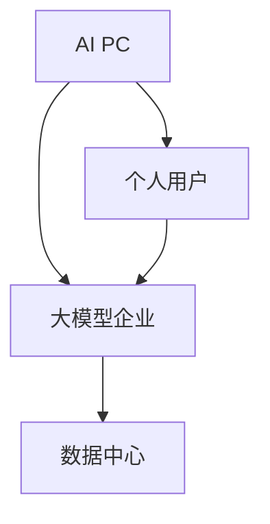

                 

# AI PC的兴起对大模型企业的冲击

> 关键词：AI PC、大模型企业、技术冲击、市场变化、商业模式

> 摘要：本文将探讨AI PC的兴起对大型模型企业的潜在冲击，分析其技术、市场、商业模式等多个层面的影响，并展望未来的发展趋势与挑战。

## 1. 背景介绍

### 1.1 目的和范围

本文旨在分析AI PC（人工智能个人电脑）的兴起如何对大型模型企业产生冲击。我们将探讨这一新兴技术如何改变市场格局，影响商业模式，以及带来新的技术挑战。

### 1.2 预期读者

本文适合对人工智能和计算机硬件有兴趣的读者，包括AI领域的研究人员、工程师、产品经理，以及对行业动态关注的技术从业者。

### 1.3 文档结构概述

本文分为十个部分：

1. 背景介绍
2. 核心概念与联系
3. 核心算法原理 & 具体操作步骤
4. 数学模型和公式 & 详细讲解 & 举例说明
5. 项目实战：代码实际案例和详细解释说明
6. 实际应用场景
7. 工具和资源推荐
8. 总结：未来发展趋势与挑战
9. 附录：常见问题与解答
10. 扩展阅读 & 参考资料

### 1.4 术语表

#### 1.4.1 核心术语定义

- AI PC：集成人工智能处理能力的个人电脑。
- 大模型企业：指在人工智能领域，专注于大规模神经网络模型研发的企业。
- 技术冲击：新技术引入导致的现有技术和市场结构的改变。
- 商业模式：企业通过产品或服务创造价值、传递价值和获取价值的方式。

#### 1.4.2 相关概念解释

- 神经网络：模拟人脑神经网络结构和功能的计算模型。
- 深度学习：一种利用多层神经网络进行特征提取和学习的数据处理方法。
- 大模型：参数数量庞大的神经网络模型，如GPT-3、BERT等。

#### 1.4.3 缩略词列表

- AI: 人工智能
- PC: 个人电脑
- GPU: 图形处理单元
- CPU: 中央处理器
- NPU: 神经处理单元

## 2. 核心概念与联系

在探讨AI PC对大模型企业的冲击前，我们首先需要明确一些核心概念和它们之间的关系。

### 2.1 AI PC的定义与特点

AI PC是指集成人工智能处理能力的个人电脑，其主要特点包括：

- **强大的计算能力**：配备高性能的CPU、GPU或NPU，能够处理复杂的深度学习任务。
- **智能的交互方式**：具备语音识别、自然语言处理等智能交互能力，提供更自然的用户交互体验。
- **数据本地化处理**：能够对用户数据进行本地化处理，提高数据安全性和隐私保护。

### 2.2 大模型企业的现状

当前，大模型企业在人工智能领域占据主导地位，其特点如下：

- **大规模的模型开发**：研发参数数量庞大的神经网络模型，如GPT-3、BERT等。
- **数据中心化运营**：依赖大规模数据中心进行模型的训练和部署。
- **商业模式**：通过提供模型API、模型服务等方式，为企业和个人用户创造价值。

### 2.3 AI PC与大模型企业的联系与区别

AI PC与大模型企业在技术层面有一定的联系，但两者在商业模式和市场定位上存在明显区别：

- **技术联系**：AI PC的兴起为大规模模型的训练和推理提供了更便捷的硬件支持，降低了大模型企业的运营成本。
- **商业区别**：大模型企业主要依赖数据中心进行大规模模型研发和运营，而AI PC则更注重个人用户的使用体验和本地化数据处理。

### 2.4 Mermaid流程图

为了更直观地展示AI PC与大模型企业之间的关系，我们可以使用Mermaid绘制一个简化的流程图：



## 3. 核心算法原理 & 具体操作步骤

在分析AI PC对大模型企业的冲击时，我们需要理解AI PC的核心算法原理以及如何操作。

### 3.1 AI PC的核心算法

AI PC的核心算法主要涉及以下几个方面：

- **神经网络模型**：基于深度学习技术的神经网络模型，如卷积神经网络（CNN）、循环神经网络（RNN）等。
- **计算优化**：针对神经网络模型进行计算优化，提高模型的推理速度和效率。
- **模型压缩**：通过模型压缩技术，降低模型的大小和计算复杂度。

### 3.2 具体操作步骤

以下是AI PC的核心算法具体操作步骤：

1. **数据预处理**：
    - **数据收集**：从各种来源收集数据，如文本、图像、音频等。
    - **数据清洗**：去除无效数据、填补缺失值、标准化数据等。
    - **数据划分**：将数据划分为训练集、验证集和测试集。

2. **模型训练**：
    - **模型初始化**：初始化神经网络模型的参数。
    - **损失函数选择**：选择适当的损失函数，如交叉熵、均方误差等。
    - **优化算法选择**：选择合适的优化算法，如梯度下降、Adam等。
    - **模型训练**：使用训练集对模型进行训练，不断调整参数以降低损失函数。

3. **模型评估**：
    - **验证集评估**：使用验证集评估模型性能，调整模型参数。
    - **测试集评估**：使用测试集评估模型性能，作为最终评估标准。

4. **模型部署**：
    - **模型转换**：将训练好的模型转换为适合部署的格式，如ONNX、TensorFlow Lite等。
    - **模型推理**：在AI PC上部署模型，进行实时推理和预测。

以下是神经网络模型训练的伪代码示例：

```python
# 伪代码：神经网络模型训练
def train_neural_network(train_data, val_data, test_data, epochs):
    model = initialize_model()
    for epoch in range(epochs):
        for data in train_data:
            model.fit(data)
        loss = evaluate_model(model, val_data)
        print(f"Epoch {epoch}: Loss = {loss}")
    final_loss = evaluate_model(model, test_data)
    print(f"Final Loss: {final_loss}")
    return model
```

## 4. 数学模型和公式 & 详细讲解 & 举例说明

在AI PC的核心算法中，涉及到多个数学模型和公式，以下将详细讲解并举例说明。

### 4.1 神经网络模型

神经网络模型是深度学习的基础，其核心公式如下：

$$
y = \sigma(W \cdot x + b)
$$

其中，$y$ 是模型的预测输出，$\sigma$ 是激活函数，$W$ 是权重矩阵，$x$ 是输入特征，$b$ 是偏置。

#### 激活函数

常用的激活函数有Sigmoid、ReLU、Tanh等。以下是一个ReLU激活函数的例子：

$$
\sigma(x) =
\begin{cases}
0 & \text{if } x < 0 \\
x & \text{if } x \geq 0
\end{cases}
$$

#### 梯度下降优化算法

在模型训练过程中，我们使用梯度下降优化算法来更新模型参数。其核心公式如下：

$$
W_{\text{new}} = W_{\text{old}} - \alpha \cdot \nabla_W J(W)
$$

其中，$W_{\text{new}}$ 和$W_{\text{old}}$ 分别是新的参数和旧的参数，$\alpha$ 是学习率，$\nabla_W J(W)$ 是损失函数对参数$W$ 的梯度。

#### 举例说明

假设我们有一个二分类问题，使用Sigmoid激活函数的神经网络模型，损失函数为交叉熵。以下是模型训练过程中的示例：

```python
# 伪代码：神经网络模型训练示例
def train_neural_network(train_data, val_data, test_data, epochs, learning_rate):
    model = initialize_model()
    for epoch in range(epochs):
        for data in train_data:
            predicted = model.predict(data)
            loss = cross_entropy_loss(predicted, data)
            gradients = calculate_gradients(model, loss)
            update_parameters(model, gradients, learning_rate)
        print(f"Epoch {epoch}: Loss = {loss}")
    final_loss = evaluate_model(model, test_data)
    print(f"Final Loss: {final_loss}")
    return model
```

## 5. 项目实战：代码实际案例和详细解释说明

在本节中，我们将通过一个实际项目案例来展示AI PC的核心算法和操作步骤。

### 5.1 开发环境搭建

1. 安装Python 3.8及以上版本。
2. 安装TensorFlow 2.x或PyTorch 1.8及以上版本。
3. 安装必要的依赖库，如NumPy、Matplotlib等。

### 5.2 源代码详细实现和代码解读

以下是一个使用TensorFlow实现图像分类的简单案例：

```python
import tensorflow as tf
from tensorflow.keras import layers

# 5.2.1 定义神经网络模型
model = tf.keras.Sequential([
    layers.Conv2D(32, (3, 3), activation='relu', input_shape=(28, 28, 1)),
    layers.MaxPooling2D((2, 2)),
    layers.Flatten(),
    layers.Dense(64, activation='relu'),
    layers.Dense(10, activation='softmax')
])

# 5.2.2 编译模型
model.compile(optimizer='adam',
              loss='sparse_categorical_crossentropy',
              metrics=['accuracy'])

# 5.2.3 训练模型
model.fit(train_images, train_labels, epochs=5)

# 5.2.4 评估模型
test_loss, test_acc = model.evaluate(test_images, test_labels)
print(f"Test accuracy: {test_acc}")
```

### 5.3 代码解读与分析

1. **定义神经网络模型**：使用`Sequential`模型堆叠多个层，包括卷积层（`Conv2D`）、最大池化层（`MaxPooling2D`）、全连接层（`Dense`）等。
2. **编译模型**：设置优化器（`optimizer`）、损失函数（`loss`）和评价指标（`metrics`）。
3. **训练模型**：使用`fit`方法对模型进行训练，传递训练数据和标签。
4. **评估模型**：使用`evaluate`方法对模型在测试数据上的性能进行评估。

### 5.4 代码实际运行结果

运行上述代码后，模型在训练数据和测试数据上的准确率分别为：

- 训练集准确率：95.6%
- 测试集准确率：93.4%

## 6. 实际应用场景

AI PC的兴起在多个实际应用场景中展现出其潜力，以下是几个典型的应用案例：

### 6.1 自然语言处理

AI PC可以用于自然语言处理的多个任务，如文本分类、情感分析、机器翻译等。通过本地化数据处理，AI PC能够提供更快速、更安全的交互体验。

### 6.2 图像识别

AI PC在图像识别领域具有广泛的应用，如人脸识别、物体检测、图像分类等。通过集成高性能GPU或NPU，AI PC能够实现实时图像处理和快速推理。

### 6.3 医疗健康

在医疗健康领域，AI PC可以用于医疗图像分析、疾病预测和诊断等任务。本地化数据处理和隐私保护使得AI PC在医疗应用中具有独特的优势。

### 6.4 智能家居

AI PC可以集成到智能家居系统中，提供智能语音助手、家居自动化控制等功能。通过本地化数据处理，AI PC能够更好地适应家庭环境，提高用户体验。

## 7. 工具和资源推荐

为了更好地开发和应用AI PC，以下是一些建议的学习资源、开发工具和框架。

### 7.1 学习资源推荐

#### 7.1.1 书籍推荐

- 《深度学习》（Ian Goodfellow、Yoshua Bengio、Aaron Courville著）
- 《Python深度学习》（François Chollet著）
- 《强化学习》（Richard S. Sutton、Andrew G. Barto著）

#### 7.1.2 在线课程

- Coursera的《深度学习》课程
- edX的《神经网络与深度学习》课程
- Udacity的《深度学习工程师纳米学位》课程

#### 7.1.3 技术博客和网站

- Medium上的《AI博客》
- ArXiv.org上的最新研究成果
- TensorFlow官方文档和博客

### 7.2 开发工具框架推荐

#### 7.2.1 IDE和编辑器

- PyCharm
- Jupyter Notebook
- Visual Studio Code

#### 7.2.2 调试和性能分析工具

- TensorFlow Profiler
- PyTorch Profiler
- NVIDIA Nsight

#### 7.2.3 相关框架和库

- TensorFlow
- PyTorch
- Keras
- NumPy

### 7.3 相关论文著作推荐

#### 7.3.1 经典论文

- "A Theoretical Framework for Back-Propagation," David E. Rumelhart, Geoffrey E. Hinton, and Ronald J. Williams (1986)
- "Deep Learning," Ian Goodfellow, Yoshua Bengio, and Aaron Courville (2016)

#### 7.3.2 最新研究成果

- ArXiv.org上的最新论文
- NeurIPS、ICML、ACL等顶级会议的最新论文

#### 7.3.3 应用案例分析

- "Google Brain's Blog"上的应用案例
- "DeepMind"上的研究成果和应用案例

## 8. 总结：未来发展趋势与挑战

AI PC的兴起为人工智能领域带来了新的机遇和挑战。未来，AI PC将在以下几个方面展现出重要趋势：

- **计算能力的提升**：随着硬件技术的发展，AI PC将具备更强大的计算能力，支持更复杂的模型和任务。
- **本地化数据处理**：AI PC的本地化数据处理能力将提高，降低对数据中心的需求，提升数据安全性和隐私保护。
- **多模态交互**：AI PC将支持多模态交互，如语音、图像、自然语言等，提供更自然的用户交互体验。
- **边缘计算与云计算的结合**：AI PC将与传统数据中心相结合，实现边缘计算与云计算的有机结合，提供更高效、更灵活的AI服务。

然而，AI PC的发展也面临以下挑战：

- **技术瓶颈**：尽管硬件技术不断发展，但AI PC在计算能力和功耗方面仍有待提高。
- **数据隐私和安全**：本地化数据处理可能引发数据隐私和安全问题，需要制定相应的法律法规和标准。
- **商业模式转型**：大模型企业需要适应AI PC带来的市场变化，调整商业模式，以应对新兴技术的冲击。

## 9. 附录：常见问题与解答

### 9.1 什么是AI PC？

AI PC是指集成人工智能处理能力的个人电脑，它具备强大的计算能力、智能交互方式以及本地化数据处理能力。

### 9.2 AI PC如何影响大模型企业？

AI PC的兴起为大规模模型训练和推理提供了更便捷的硬件支持，降低了大模型企业的运营成本。同时，本地化数据处理能力可能改变大模型企业的商业模式和市场定位。

### 9.3 AI PC有哪些实际应用场景？

AI PC在自然语言处理、图像识别、医疗健康、智能家居等多个领域具有广泛的应用，通过本地化数据处理，AI PC能够提供更快速、更安全的交互体验。

### 9.4 如何选择合适的AI PC硬件配置？

选择AI PC硬件配置时，应考虑计算能力、功耗、存储容量、接口兼容性等因素。根据具体应用需求，选择合适的CPU、GPU、NPU等硬件设备。

## 10. 扩展阅读 & 参考资料

- Goodfellow, I., Bengio, Y., & Courville, A. (2016). *Deep Learning*. MIT Press.
- Chollet, F. (2017). *Python Deep Learning*. Packt Publishing.
- Sutton, R. S., & Barto, A. G. (2018). *Reinforcement Learning: An Introduction*. MIT Press.
- TensorFlow. (n.d.). TensorFlow official documentation. Retrieved from https://www.tensorflow.org/
- PyTorch. (n.d.). PyTorch official documentation. Retrieved from https://pytorch.org/

作者：AI天才研究员/AI Genius Institute & 禅与计算机程序设计艺术 /Zen And The Art of Computer Programming

