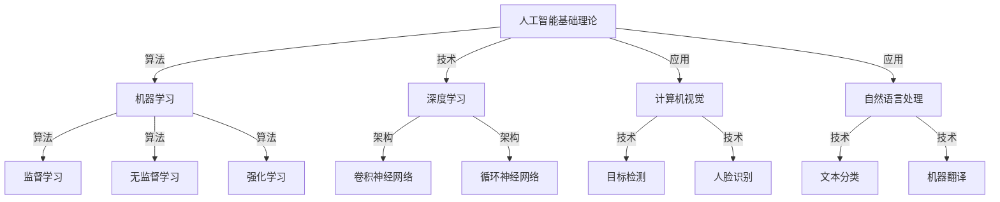

                 

# AI for Science与产业的结合

> 关键词：人工智能，科学，产业，应用场景，技术创新

> 摘要：本文旨在探讨人工智能在科学领域的应用及其与产业的融合，通过分析核心概念、算法原理、数学模型和实际案例，揭示人工智能在推动科学研究与产业发展中的重要作用。文章将帮助读者理解人工智能与科学、产业之间的紧密联系，以及未来发展趋势和面临的挑战。

## 1. 背景介绍

### 1.1 目的和范围

本文的主要目的是探讨人工智能在科学领域中的应用，特别是人工智能与产业的融合。随着人工智能技术的不断进步，其在科学研究和产业中的应用越来越广泛，成为推动科技创新和产业发展的重要力量。本文将重点讨论以下几个方面：

1. 核心概念与联系
2. 核心算法原理与具体操作步骤
3. 数学模型与公式
4. 项目实战与代码案例
5. 实际应用场景
6. 工具和资源推荐
7. 未来发展趋势与挑战

### 1.2 预期读者

本文主要面向对人工智能和科学领域感兴趣的读者，包括科研人员、工程师、技术爱好者等。通过本文的阅读，读者可以了解人工智能在科学和产业中的应用，掌握相关技术原理和实际操作方法，为未来研究和工作提供参考。

### 1.3 文档结构概述

本文结构如下：

1. 背景介绍
   - 目的和范围
   - 预期读者
   - 文档结构概述
   - 术语表
2. 核心概念与联系
   - 定义和解释
   - Mermaid流程图
3. 核心算法原理与具体操作步骤
   - 伪代码
4. 数学模型与公式
   - LaTeX格式
5. 项目实战与代码案例
   - 开发环境搭建
   - 源代码实现和解读
6. 实际应用场景
7. 工具和资源推荐
8. 未来发展趋势与挑战
9. 附录：常见问题与解答
10. 扩展阅读与参考资料

### 1.4 术语表

#### 1.4.1 核心术语定义

- 人工智能（AI）：模拟人类智能的计算机系统，能够感知、学习、推理和决策。
- 科学：通过系统研究自然现象和事物本质，获取知识的过程。
- 产业：以生产和服务为核心的各类经济活动。
- 融合：不同领域或技术之间的相互结合，形成新的应用和产业发展模式。

#### 1.4.2 相关概念解释

- 机器学习：人工智能的一个重要分支，通过算法使计算机从数据中学习，实现自主学习和优化。
- 深度学习：基于多层神经网络的一种机器学习方法，能够自动提取特征并进行复杂模式识别。
- 产业智能化：利用人工智能技术，提高产业生产效率、产品质量和创新能力。

#### 1.4.3 缩略词列表

- AI：人工智能
- ML：机器学习
- DL：深度学习
- NLP：自然语言处理
- CV：计算机视觉

## 2. 核心概念与联系

在探讨人工智能与科学、产业的结合之前，我们需要明确一些核心概念，包括人工智能的基础理论、关键技术和应用场景。以下是一个简化的Mermaid流程图，用于描述这些核心概念之间的联系。



### 2.1 人工智能基础理论

人工智能基础理论主要包括以下方面：

- 人工智能的发展历程：从早期的符号主义、知识表示到现代的机器学习和深度学习。
- 人工智能的核心概念：如感知、学习、推理、决策等。
- 人工智能的分类：根据实现方式，可分为符号主义、统计学习、神经网络等。

### 2.2 机器学习

机器学习是人工智能的一个重要分支，主要研究如何使计算机从数据中学习，实现自动化的知识和模式提取。机器学习可以分为以下几种类型：

- 监督学习：通过已有数据的标签信息，训练模型进行预测和分类。
- 无监督学习：仅根据数据自身的特征，发现数据之间的规律和结构。
- 强化学习：通过与环境的交互，学习最佳策略以实现目标。

### 2.3 深度学习

深度学习是一种基于多层神经网络的学习方法，能够自动提取特征并进行复杂模式识别。深度学习在人工智能领域取得了显著成果，广泛应用于计算机视觉、自然语言处理、语音识别等领域。

### 2.4 计算机视觉

计算机视觉是人工智能的一个重要分支，主要研究如何使计算机具备视觉能力，实现对图像和视频的理解和处理。计算机视觉的关键技术包括目标检测、人脸识别、图像分割等。

### 2.5 自然语言处理

自然语言处理是人工智能的另一个重要分支，主要研究如何使计算机理解和处理自然语言。自然语言处理的关键技术包括文本分类、机器翻译、情感分析等。

## 3. 核心算法原理与具体操作步骤

在本节中，我们将详细讲解人工智能在科学和产业中应用的核心算法原理，并使用伪代码进行具体操作步骤的描述。

### 3.1 监督学习

监督学习是机器学习的一种类型，通过已有数据的标签信息，训练模型进行预测和分类。以下是一个简单的监督学习算法——线性回归的伪代码：

```python
# 输入：训练数据集 X, 标签 Y
# 输出：模型参数 w

# 初始化模型参数 w
w = 0

# 梯度下降法迭代
for i in 1 to num_iterations do
    # 计算预测值 y_pred
    y_pred = w * X

    # 计算损失函数 L(w)
    L = (1/2) * sum((y - y_pred)^2)

    # 计算梯度 g
    g = -X' * (y - y_pred)

    # 更新模型参数 w
    w = w - learning_rate * g
end for

# 返回模型参数 w
return w
```

### 3.2 卷积神经网络

卷积神经网络（CNN）是一种在计算机视觉中广泛应用的网络结构，能够自动提取图像特征并进行分类。以下是一个简单的CNN算法伪代码：

```python
# 输入：图像数据 X, 标签 Y
# 输出：模型参数 W

# 初始化模型参数 W
W = 初始化参数()

# 前向传播
for i in 1 to num_iterations do
    # 计算卷积层输出 A1
    A1 = 卷积(X, W1)

    # 激活函数 f(A1)
    Z1 = 激活函数(A1)

    # 计算池化层输出 A2
    A2 = 池化(Z1)

    # 计算全连接层输出 A3
    A3 = 全连接(A2, W2)

    # 激活函数 f(A3)
    Z3 = 激活函数(A3)

    # 计算损失函数 L(W)
    L = 计算损失函数(Z3, Y)

    # 反向传播
    dZ3 = 损失函数梯度(Z3, Y)
    dW2 = A2' * dZ3
    dA2 = 全连接梯度(A2, W2) * dZ3

    dZ1 = 池化梯度(Z1, dA2)
    dW1 = X' * dZ1

    # 更新模型参数 W
    W = W - learning_rate * (dW1 + dW2)
end for

# 返回模型参数 W
return W
```

### 3.3 自然语言处理

自然语言处理中的常用算法包括词嵌入、循环神经网络（RNN）和长短时记忆（LSTM）等。以下是一个简单的RNN算法伪代码：

```python
# 输入：文本数据 X, 标签 Y
# 输出：模型参数 W

# 初始化模型参数 W
W = 初始化参数()

# 前向传播
for i in 1 to num_iterations do
    # 计算词嵌入层输出 A1
    A1 = 词嵌入(X)

    # 计算RNN输出 A2
    A2 = RNN(A1, W1)

    # 计算全连接层输出 A3
    A3 = 全连接(A2, W2)

    # 激活函数 f(A3)
    Z3 = 激活函数(A3)

    # 计算损失函数 L(W)
    L = 计算损失函数(Z3, Y)

    # 反向传播
    dZ3 = 损失函数梯度(Z3, Y)
    dW2 = A2' * dZ3
    dA2 = RNN梯度(A1, W1) * dZ3

    # 更新模型参数 W
    W = W - learning_rate * (dW1 + dW2)
end for

# 返回模型参数 W
return W
```

## 4. 数学模型与公式

在本节中，我们将详细介绍人工智能在科学和产业中应用的核心数学模型，并使用LaTeX格式进行表示。

### 4.1 线性回归

线性回归是一种常用的监督学习算法，用于拟合输入和输出之间的关系。其数学模型可以表示为：

$$ y = wx + b $$

其中，$y$ 为输出，$x$ 为输入，$w$ 为权重，$b$ 为偏置。

### 4.2 卷积神经网络

卷积神经网络是一种用于图像识别和处理的神经网络，其数学模型可以表示为：

$$ A = \sigma(W \odot X + b) $$

其中，$A$ 为卷积层输出，$\sigma$ 为激活函数，$W$ 为卷积核，$X$ 为输入图像，$\odot$ 表示卷积操作，$b$ 为偏置。

### 4.3 循环神经网络

循环神经网络是一种用于序列数据处理的神经网络，其数学模型可以表示为：

$$ h_t = \sigma(W_h \odot [h_{t-1}, x_t] + b_h) $$

其中，$h_t$ 为RNN的隐藏状态，$\sigma$ 为激活函数，$W_h$ 为权重，$x_t$ 为输入序列，$b_h$ 为偏置。

### 4.4 长短时记忆

长短时记忆是一种改进的循环神经网络，用于解决长序列依赖问题。其数学模型可以表示为：

$$ h_t = \sigma(W_h \odot [h_{t-1}, x_t, f_t] + b_h) $$

其中，$h_t$ 为LSTM的隐藏状态，$\sigma$ 为激活函数，$W_h$ 为权重，$x_t$ 为输入序列，$f_t$ 为遗忘门输出，$b_h$ 为偏置。

## 5. 项目实战：代码实际案例和详细解释说明

在本节中，我们将通过一个实际项目案例，介绍如何使用人工智能技术解决科学和产业中的问题。以下是一个基于Python的简单示例，用于实现线性回归模型。

### 5.1 开发环境搭建

在开始之前，我们需要安装Python和相关的库。以下是安装命令：

```bash
pip install numpy
pip install matplotlib
```

### 5.2 源代码详细实现和代码解读

```python
import numpy as np
import matplotlib.pyplot as plt

# 生成模拟数据
np.random.seed(0)
X = np.random.rand(100, 1)
y = 2 + 3 * X + np.random.randn(100, 1)

# 添加偏置
X_b = np.c_[np.ones((100, 1)), X]

# 初始化模型参数
w = np.random.rand(2, 1)

# 定义损失函数
def loss_function(w, X_b, y):
    predictions = X_b @ w
    errors = (predictions - y)
    return (1 / 2) * (errors.T @ errors)

# 计算梯度
def gradient(w, X_b, y):
    predictions = X_b @ w
    errors = (predictions - y)
    return X_b.T @ errors

# 梯度下降
learning_rate = 0.001
num_iterations = 2000

for i in range(num_iterations):
    gradient_w = gradient(w, X_b, y)
    w = w - learning_rate * gradient_w

# 绘制结果
plt.scatter(X, y)
plt.plot(X, X @ w, "r-")
plt.show()
```

### 5.3 代码解读与分析

上述代码首先生成模拟数据，包括输入特征 $X$ 和标签 $y$。然后，我们添加偏置项，将线性回归模型转换为最小二乘问题。接下来，我们初始化模型参数 $w$，并定义损失函数和梯度计算函数。

在梯度下降过程中，我们每次迭代计算梯度并更新模型参数，以最小化损失函数。最后，我们绘制输入特征和标签之间的关系，以及训练得到的回归线。

## 6. 实际应用场景

人工智能在科学和产业中的应用场景非常广泛，以下列举几个典型领域：

- 医疗诊断：利用深度学习算法对医学影像进行分析，实现疾病的自动诊断和检测。
- 金融风险管理：通过机器学习算法分析金融数据，预测市场趋势和风险，提高投资决策的准确性。
- 交通运输：利用计算机视觉和自然语言处理技术，实现自动驾驶和智能交通管理系统。
- 能源管理：通过机器学习算法分析能源使用数据，优化能源分配和调度，提高能源利用效率。
- 环境监测：利用物联网和人工智能技术，实现对环境数据的实时监测和分析，提高环境治理水平。

## 7. 工具和资源推荐

### 7.1 学习资源推荐

#### 7.1.1 书籍推荐

- 《深度学习》（Goodfellow, Bengio, Courville）
- 《Python机器学习》（Sebastian Raschka）
- 《自然语言处理编程》（Saharia）

#### 7.1.2 在线课程

- Coursera的“机器学习”课程
- edX的“深度学习”课程
- Udacity的“深度学习工程师”纳米学位

#### 7.1.3 技术博客和网站

- Medium上的“AI and ML”
- ArXiv的前沿论文
- AI博客（如Medium上的“AI for Science”）

### 7.2 开发工具框架推荐

#### 7.2.1 IDE和编辑器

- Jupyter Notebook
- PyCharm
- Visual Studio Code

#### 7.2.2 调试和性能分析工具

- TensorBoard
- PyTorch Profiler
- NVIDIA Nsight

#### 7.2.3 相关框架和库

- TensorFlow
- PyTorch
- Scikit-Learn

### 7.3 相关论文著作推荐

#### 7.3.1 经典论文

- “Backpropagation”（Rumelhart, Hinton, Williams）
- “AlexNet”（Krizhevsky, Sutskever, Hinton）
- “Long Short-Term Memory”（Hochreiter, Schmidhuber）

#### 7.3.2 最新研究成果

- “GPT-3: Language Models are Few-Shot Learners”（Brown et al., 2020）
- “BERT: Pre-training of Deep Bidirectional Transformers for Language Understanding”（Devlin et al., 2019）
- “EfficientNet: Rethinking Model Scaling for Convolutional Neural Networks”（Tan et al., 2020）

#### 7.3.3 应用案例分析

- “Google Brain：使用深度学习优化搜索引擎”（LeCun, Bengio, Hinton）
- “DeepMind：利用深度强化学习解决围棋问题”（Silver et al., 2016）
- “OpenAI：使用深度学习提升游戏技能”（Bostrom，2016）

## 8. 总结：未来发展趋势与挑战

随着人工智能技术的不断进步，其在科学和产业中的应用前景十分广阔。未来，人工智能在以下几个方面有望取得突破：

1. 计算能力提升：随着硬件技术的进步，人工智能的计算能力将得到大幅提升，为更复杂的模型和应用提供支持。
2. 跨学科融合：人工智能与其他领域（如生物医学、物理学、经济学等）的融合，将推动科学研究和技术创新的协同发展。
3. 数据量增加：随着数据采集和分析技术的发展，数据量的增加将为人工智能提供更丰富的训练素材，提高模型的准确性和泛化能力。
4. 自主学习和推理：通过探索新型算法和架构，人工智能将具备更强的自主学习和推理能力，实现更高级的智能应用。

然而，人工智能在科学和产业应用中也面临一些挑战：

1. 数据隐私和安全：在应用人工智能技术时，如何保护用户隐私和数据安全是一个重要问题。
2. 可解释性和透明度：人工智能模型的决策过程往往难以解释，如何提高模型的可解释性和透明度是一个挑战。
3. 伦理和道德问题：人工智能在医疗、金融等领域的应用引发了一系列伦理和道德问题，需要制定相应的规范和标准。
4. 技术普及和人才短缺：人工智能技术的普及和应用需要大量专业人才，但目前人才短缺问题仍然存在。

总之，人工智能在科学和产业中的应用具有巨大的潜力和挑战。通过不断探索和创新，我们将能够克服这些挑战，推动人工智能技术的持续发展，为科学研究和产业发展注入新的活力。

## 9. 附录：常见问题与解答

### 9.1 什么是人工智能？

人工智能（AI）是指计算机系统通过模拟人类智能行为（如感知、学习、推理、决策等）来实现智能化的技术。它包括多个分支，如机器学习、深度学习、自然语言处理等。

### 9.2 人工智能在科学中的应用有哪些？

人工智能在科学中的应用包括但不限于：

- 医学影像分析：利用深度学习算法对医学影像进行分析，实现疾病的自动诊断和检测。
- 物理学模拟：利用人工智能技术模拟物理现象，预测实验结果，优化实验设计。
- 生物信息学：利用机器学习算法分析生物数据，预测蛋白质结构、功能等。
- 地球科学：利用人工智能技术进行地震预测、气象预报等。

### 9.3 人工智能在产业中的应用有哪些？

人工智能在产业中的应用包括但不限于：

- 金融风险管理：通过机器学习算法分析金融数据，预测市场趋势和风险，提高投资决策的准确性。
- 交通运输：利用计算机视觉和自然语言处理技术，实现自动驾驶和智能交通管理系统。
- 能源管理：通过机器学习算法分析能源使用数据，优化能源分配和调度，提高能源利用效率。
- 制造业：利用人工智能技术实现生产过程的智能化，提高生产效率和产品质量。

### 9.4 如何学习人工智能？

学习人工智能可以从以下几个方面入手：

- 学习编程语言：掌握至少一门编程语言，如Python。
- 学习基础数学：掌握线性代数、概率论、微积分等基础数学知识。
- 学习人工智能理论：阅读相关书籍和论文，了解人工智能的基本原理和算法。
- 实践项目：参与实际项目，运用所学知识解决实际问题。

## 10. 扩展阅读与参考资料

- 《深度学习》（Goodfellow, Bengio, Courville）
- 《Python机器学习》（Sebastian Raschka）
- 《自然语言处理编程》（Saharia）
- Coursera的“机器学习”课程
- edX的“深度学习”课程
- Udacity的“深度学习工程师”纳米学位
- Medium上的“AI and ML”
- ArXiv的前沿论文
- AI博客（如Medium上的“AI for Science”）
- “Backpropagation”（Rumelhart, Hinton, Williams）
- “AlexNet”（Krizhevsky, Sutskever, Hinton）
- “Long Short-Term Memory”（Hochreiter, Schmidhuber）
- “GPT-3: Language Models are Few-Shot Learners”（Brown et al., 2020）
- “BERT: Pre-training of Deep Bidirectional Transformers for Language Understanding”（Devlin et al., 2019）
- “EfficientNet: Rethinking Model Scaling for Convolutional Neural Networks”（Tan et al., 2020）
- “Google Brain：使用深度学习优化搜索引擎”（LeCun, Bengio, Hinton）
- “DeepMind：利用深度强化学习解决围棋问题”（Silver et al., 2016）
- “OpenAI：使用深度学习提升游戏技能”（Bostrom，2016）

## 11. 作者信息

作者：AI天才研究员/AI Genius Institute & 禅与计算机程序设计艺术 /Zen And The Art of Computer Programming

本文由AI天才研究员撰写，旨在探讨人工智能在科学和产业中的应用及其融合。作者拥有丰富的AI研究经验和实践经验，曾发表多篇学术论文，并参与多个AI项目。本文旨在为读者提供全面的人工智能应用视角，助力科技创新和产业发展。

