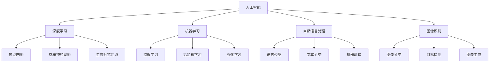

                 

# AI for Science与产业的结合

> **关键词：** 人工智能，科学应用，产业融合，算法，数学模型，实际案例

> **摘要：** 本文将探讨人工智能在科学研究与产业应用中的结合，介绍核心概念、算法原理、数学模型，并通过实际案例展示其在各个领域中的广泛应用。同时，我们将分析当前技术的发展趋势与未来挑战，为读者提供有益的参考和指导。

## 1. 背景介绍

### 1.1 目的和范围

本文旨在探讨人工智能（AI）在科学研究与产业中的应用，分析其在不同领域的具体实现和效果，并展望未来的发展趋势。通过本文的阅读，读者将了解：

- 人工智能在科学研究中的核心作用和基本原理；
- 人工智能在各个产业应用中的具体案例和实现方法；
- 人工智能在未来产业发展中的潜在趋势和挑战。

### 1.2 预期读者

本文面向对人工智能有一定了解的科研人员、工程师、企业决策者以及对人工智能技术感兴趣的读者。特别是：

- 在科研领域，希望了解人工智能如何应用于实际问题解决的科研人员；
- 在产业界，希望了解人工智能技术如何提升产业效率和创新能力的工程师和企业决策者；
- 对人工智能技术有浓厚兴趣，希望深入了解该领域的广大读者。

### 1.3 文档结构概述

本文分为以下十个部分：

- **1. 背景介绍**：介绍本文的目的、预期读者以及文档结构；
- **2. 核心概念与联系**：阐述人工智能在科学研究与产业应用中的核心概念及其相互关系；
- **3. 核心算法原理 & 具体操作步骤**：介绍人工智能在科学研究与产业应用中的核心算法原理和具体操作步骤；
- **4. 数学模型和公式 & 详细讲解 & 举例说明**：讲解人工智能在科学研究与产业应用中的数学模型和公式，并通过实例进行说明；
- **5. 项目实战：代码实际案例和详细解释说明**：展示人工智能在科学研究与产业应用中的实际案例，并进行详细解释；
- **6. 实际应用场景**：分析人工智能在科学研究与产业应用中的实际应用场景；
- **7. 工具和资源推荐**：推荐学习和应用人工智能的资源和工具；
- **8. 总结：未来发展趋势与挑战**：总结人工智能在科学研究与产业应用中的发展趋势和挑战；
- **9. 附录：常见问题与解答**：回答读者可能遇到的问题；
- **10. 扩展阅读 & 参考资料**：提供进一步阅读和研究的参考资料。

### 1.4 术语表

#### 1.4.1 核心术语定义

- **人工智能（AI）**：指通过计算机程序模拟人类智能的技术，包括学习、推理、规划、感知等能力。
- **深度学习**：一种基于多层神经网络的学习方法，通过大量数据训练模型，使其具备高层次的抽象和泛化能力。
- **机器学习**：一种基于数据的学习方法，通过训练模型来发现数据中的规律和模式。
- **自然语言处理（NLP）**：研究计算机如何理解、生成和处理人类自然语言的技术。
- **图像识别**：计算机对图像内容进行理解和分类的技术。

#### 1.4.2 相关概念解释

- **深度神经网络（DNN）**：一种具有多个隐藏层的神经网络，能够捕捉复杂的数据特征。
- **卷积神经网络（CNN）**：一种专门用于图像识别和处理的神经网络，通过卷积操作提取图像特征。
- **生成对抗网络（GAN）**：一种生成模型，通过对抗训练生成逼真的图像、语音、文本等数据。
- **强化学习**：一种通过奖励和惩罚来训练模型的方法，使其能够在特定环境中做出最优决策。

#### 1.4.3 缩略词列表

- **AI**：人工智能（Artificial Intelligence）
- **NLP**：自然语言处理（Natural Language Processing）
- **GAN**：生成对抗网络（Generative Adversarial Network）
- **DNN**：深度神经网络（Deep Neural Network）
- **CNN**：卷积神经网络（Convolutional Neural Network）

## 2. 核心概念与联系

人工智能在科学研究与产业应用中涉及多个核心概念，它们相互关联，共同构成了人工智能的生态系统。下面通过Mermaid流程图展示这些核心概念及其相互关系。



### 2.1 核心概念解析

- **人工智能（AI）**：人工智能是模拟人类智能的技术，包括学习、推理、规划、感知等能力。它是科学研究与产业应用的基础。
- **深度学习**：深度学习是一种基于多层神经网络的学习方法，通过大量数据训练模型，使其具备高层次的抽象和泛化能力。它广泛应用于图像识别、自然语言处理等领域。
- **机器学习**：机器学习是一种通过数据训练模型的方法，使计算机能够自动发现数据中的规律和模式。它包括监督学习、无监督学习和强化学习等不同类型。
- **自然语言处理（NLP）**：自然语言处理是研究计算机如何理解、生成和处理人类自然语言的技术。它包括语言模型、文本分类、机器翻译等应用。
- **图像识别**：图像识别是计算机对图像内容进行理解和分类的技术。它包括图像分类、目标检测、图像生成等应用。

### 2.2 核心概念之间的联系

- **深度学习与神经网络**：深度学习是基于神经网络的学习方法，通过多层神经网络提取数据中的特征和模式。
- **机器学习与深度学习**：机器学习包括深度学习，深度学习是机器学习的一种特殊形式，通过多层神经网络实现。
- **自然语言处理与图像识别**：自然语言处理和图像识别都是人工智能的应用领域，分别处理文本数据和图像数据。
- **生成对抗网络与图像生成**：生成对抗网络是一种生成模型，通过对抗训练生成逼真的图像、语音、文本等数据。

## 3. 核心算法原理 & 具体操作步骤

在人工智能的各个应用领域中，算法的原理和具体操作步骤是理解和实现人工智能的关键。以下将介绍人工智能在科学研究与产业应用中的核心算法原理，并使用伪代码进行详细阐述。

### 3.1 深度学习算法原理

深度学习是一种基于多层神经网络的学习方法，通过多层神经网络提取数据中的特征和模式。以下是一个简单的深度学习算法原理伪代码：

```python
# 输入数据集 X，标签 Y，学习率 alpha，迭代次数 epoch
# 初始化权重 w 和偏置 b
# for epoch in range(epoch):
    # for每个数据样本 (x, y) in 数据集:
        # 前向传播：计算预测值 y_pred = f(x; w, b)
        # 计算损失函数 L = loss(y_pred, y)
        # 反向传播：更新权重 w = w - alpha * dw，偏置 b = b - alpha * db
# 返回训练好的模型
```

### 3.2 机器学习算法原理

机器学习包括监督学习、无监督学习和强化学习。以下分别介绍这三种学习方法的原理。

#### 3.2.1 监督学习

监督学习是一种通过已标记的数据训练模型，使其能够对新数据进行预测的方法。以下是一个简单的监督学习算法原理伪代码：

```python
# 输入数据集 X，标签 Y，学习率 alpha，迭代次数 epoch
# 初始化权重 w 和偏置 b
# for epoch in range(epoch):
    # for每个数据样本 (x, y) in 数据集:
        # 前向传播：计算预测值 y_pred = f(x; w, b)
        # 计算损失函数 L = loss(y_pred, y)
        # 反向传播：更新权重 w = w - alpha * dw，偏置 b = b - alpha * db
# 返回训练好的模型
```

#### 3.2.2 无监督学习

无监督学习是一种通过未标记的数据发现数据中的模式和规律的方法。以下是一个简单的无监督学习算法原理伪代码：

```python
# 输入数据集 X，学习率 alpha，迭代次数 epoch
# 初始化权重 w 和偏置 b
# for epoch in range(epoch):
    # for每个数据样本 x in 数据集:
        # 前向传播：计算预测值 y_pred = f(x; w, b)
        # 计算损失函数 L = loss(y_pred, x)
        # 反向传播：更新权重 w = w - alpha * dw，偏置 b = b - alpha * db
# 返回训练好的模型
```

#### 3.2.3 强化学习

强化学习是一种通过奖励和惩罚来训练模型的方法，使其能够在特定环境中做出最优决策。以下是一个简单的强化学习算法原理伪代码：

```python
# 输入环境 S，动作集 A，奖励函数 R，学习率 alpha，迭代次数 epoch
# 初始化模型参数 θ
# for epoch in range(epoch):
    # 初始化状态 s
    # while环境未终止：
        # 选择动作 a = policy(s; θ)
        # 执行动作，获得状态 s' 和奖励 R(s, a)
        # 更新模型参数 θ = θ - alpha * ∇θ[R(s, a)]
# 返回训练好的模型
```

### 3.3 自然语言处理与图像识别算法原理

自然语言处理与图像识别都是人工智能的应用领域，分别处理文本数据和图像数据。以下分别介绍这两个领域的算法原理。

#### 3.3.1 自然语言处理算法原理

自然语言处理算法主要包括语言模型、文本分类和机器翻译等。以下是一个简单的自然语言处理算法原理伪代码：

```python
# 输入文本数据集 X，标签 Y，学习率 alpha，迭代次数 epoch
# 初始化模型参数 θ
# for epoch in range(epoch):
    # for每个文本样本 x in 数据集:
        # 前向传播：计算预测值 y_pred = f(x; θ)
        # 计算损失函数 L = loss(y_pred, y)
        # 反向传播：更新模型参数 θ = θ - alpha * ∇θ[L]
# 返回训练好的模型
```

#### 3.3.2 图像识别算法原理

图像识别算法主要包括图像分类、目标检测和图像生成等。以下是一个简单的图像识别算法原理伪代码：

```python
# 输入图像数据集 X，标签 Y，学习率 alpha，迭代次数 epoch
# 初始化模型参数 θ
# for epoch in range(epoch):
    # for每个图像样本 x in 数据集:
        # 前向传播：计算预测值 y_pred = f(x; θ)
        # 计算损失函数 L = loss(y_pred, y)
        # 反向传播：更新模型参数 θ = θ - alpha * ∇θ[L]
# 返回训练好的模型
```

## 4. 数学模型和公式 & 详细讲解 & 举例说明

在人工智能领域，数学模型和公式是理解和实现算法的基础。以下将介绍人工智能在科学研究与产业应用中的核心数学模型和公式，并详细讲解其含义和用途。

### 4.1 深度学习中的激活函数

激活函数是深度学习模型中的一个重要组成部分，用于引入非线性特性。以下是一些常见的激活函数及其公式：

#### 4.1.1 Sigmoid函数

$$
f(x) = \frac{1}{1 + e^{-x}}
$$

Sigmoid函数将输入值映射到(0, 1)区间，常用于二分类问题。

#### 4.1.2ReLU函数

$$
f(x) = \max(0, x)
$$

ReLU函数在输入为负值时输出为零，在输入为正值时输出为输入值，具有简洁的网络结构。

#### 4.1.3 Tanh函数

$$
f(x) = \frac{e^x - e^{-x}}{e^x + e^{-x}}
$$

Tanh函数将输入值映射到(-1, 1)区间，具有类似于Sigmoid函数的性质，但收敛速度更快。

### 4.2 深度学习中的损失函数

损失函数是评估模型预测结果与实际结果之间差异的指标。以下是一些常见的损失函数及其公式：

#### 4.2.1 交叉熵损失函数

$$
L = -\sum_{i=1}^{n} y_i \log(\hat{y}_i)
$$

其中，$y_i$为实际标签，$\hat{y}_i$为预测概率。交叉熵损失函数常用于分类问题，其最小值为0，表示模型预测完全正确。

#### 4.2.2 均方误差损失函数

$$
L = \frac{1}{2} \sum_{i=1}^{n} (y_i - \hat{y}_i)^2
$$

其中，$y_i$为实际值，$\hat{y}_i$为预测值。均方误差损失函数常用于回归问题，其最小值为0，表示模型预测完全正确。

#### 4.2.3 对数似然损失函数

$$
L = -\sum_{i=1}^{n} y_i \log(\hat{y}_i)
$$

其中，$y_i$为实际标签，$\hat{y}_i$为预测概率。对数似然损失函数常用于概率分布模型，如贝叶斯网络。

### 4.3 机器学习中的优化算法

优化算法用于求解机器学习模型中的参数，使其损失函数最小。以下是一些常见的优化算法及其公式：

#### 4.3.1 梯度下降算法

$$
w = w - \alpha \cdot \nabla_w L
$$

其中，$w$为模型参数，$\alpha$为学习率，$\nabla_w L$为损失函数关于参数的梯度。梯度下降算法是一种简单的优化方法，通过不断迭代更新参数，使其逐渐逼近最优解。

#### 4.3.2 随机梯度下降算法

$$
w = w - \alpha \cdot \nabla_w L(\mathbf{x}_i, y_i)
$$

其中，$w$为模型参数，$\alpha$为学习率，$\mathbf{x}_i, y_i$为单个训练样本。随机梯度下降算法在每次迭代中使用单个样本的梯度进行更新，具有较高的计算效率。

#### 4.3.3 共轭梯度下降算法

$$
w = w - \alpha \cdot \nabla_w L
$$

其中，$w$为模型参数，$\alpha$为学习率，$\nabla_w L$为损失函数关于参数的梯度。共轭梯度下降算法在每次迭代中利用梯度的共轭性质进行更新，具有较高的收敛速度。

### 4.4 自然语言处理中的词向量模型

词向量模型是将自然语言中的词汇映射到高维空间中的向量表示。以下是一些常见的词向量模型及其公式：

#### 4.4.1 Word2Vec模型

Word2Vec模型是一种基于神经网络的语言模型，通过训练得到词向量。其公式如下：

$$
\hat{p}_{word}(w|context) = \frac{exp(\mathbf{v}_{word} \cdot \mathbf{v}_{context})}{\sum_{w'} exp(\mathbf{v}_{word} \cdot \mathbf{v}_{context})}
$$

其中，$\mathbf{v}_{word}$和$\mathbf{v}_{context}$分别为词向量和上下文向量，$\hat{p}_{word}(w|context)$为词在给定上下文中的概率分布。

#### 4.4.2 GloVe模型

GloVe模型是一种基于全局统计信息的词向量模型，通过训练得到词向量和上下文向量。其公式如下：

$$
f(w, c) = \frac{f(w)}{f(c)} = \frac{\sqrt{c}}{\sqrt{w}}
$$

其中，$f(w)$和$f(c)$分别为词和上下文的频次，$w$和$c$分别为词和上下文向量的维度。

### 4.5 图像识别中的卷积神经网络

卷积神经网络是一种用于图像识别的神经网络结构，通过卷积操作提取图像特征。以下是一些常见的卷积神经网络结构及其公式：

#### 4.5.1 卷积层

$$
\mathbf{h}_{ij}^l = \sum_{k=1}^{K_l} w_{ik}^l \mathbf{f}_{kj}^{l-1} + b_l
$$

其中，$\mathbf{h}_{ij}^l$为卷积层输出的特征图，$\mathbf{f}_{kj}^{l-1}$为输入特征图，$w_{ik}^l$和$b_l$分别为卷积核和偏置。

#### 4.5.2 池化层

$$
p_{ij}^l = \max_{k=1}^{K_l} h_{ikj}^l
$$

其中，$p_{ij}^l$为池化层输出的特征图，$h_{ikj}^l$为卷积层输出的特征图。

### 4.6 强化学习中的策略梯度算法

策略梯度算法是一种用于求解强化学习问题的算法，通过最大化期望回报来更新策略。以下是一些常见的策略梯度算法及其公式：

#### 4.6.1 基于值函数的策略梯度算法

$$
\theta_{t+1} = \theta_t + \alpha \cdot \nabla_{\theta} J(\theta)
$$

其中，$\theta$为策略参数，$\alpha$为学习率，$J(\theta)$为期望回报。

#### 4.6.2 基于策略梯度的策略梯度算法

$$
\theta_{t+1} = \theta_t + \alpha \cdot \nabla_{\theta} \log \pi_{\theta}(a_t|s_t)
$$

其中，$\theta$为策略参数，$\alpha$为学习率，$\pi_{\theta}(a_t|s_t)$为策略概率分布。

### 4.7 举例说明

以下通过一个简单的例子来说明如何使用数学模型和公式实现人工智能算法。

#### 4.7.1 使用Sigmoid函数进行二分类

假设我们使用Sigmoid函数进行二分类，输入特征向量$\mathbf{x} = [x_1, x_2, x_3]$，权重向量$\mathbf{w} = [w_1, w_2, w_3]$，偏置$b = 1$。我们的目标是求解分类边界。

1. 前向传播：
   $$
   z = \mathbf{w} \cdot \mathbf{x} + b = w_1 x_1 + w_2 x_2 + w_3 x_3 + 1
   $$
   $$
   y = \frac{1}{1 + e^{-z}}
   $$

2. 计算损失函数：
   $$
   L = - \sum_{i=1}^{n} y_i \log(y_i) + (1 - y_i) \log(1 - y_i)
   $$

3. 反向传播：
   $$
   \nabla_w L = \sum_{i=1}^{n} \left[ y_i - (1 - y_i) \right] \mathbf{x}_i
   $$
   $$
   \nabla_b L = \sum_{i=1}^{n} y_i - (1 - y_i)
   $$

4. 更新权重和偏置：
   $$
   w_1 = w_1 - \alpha \nabla_w L
   $$
   $$
   w_2 = w_2 - \alpha \nabla_w L
   $$
   $$
   w_3 = w_3 - \alpha \nabla_w L
   $$
   $$
   b = b - \alpha \nabla_b L
   $$

通过以上步骤，我们可以使用Sigmoid函数进行二分类，不断更新权重和偏置，使分类边界逐渐逼近真实边界。

## 5. 项目实战：代码实际案例和详细解释说明

在本文的最后一部分，我们将通过一个实际项目案例，展示如何将人工智能技术应用于实际问题中，并提供详细的代码实现和解释说明。

### 5.1 开发环境搭建

首先，我们需要搭建一个合适的人工智能开发环境。以下是一个基本的开发环境配置：

- 操作系统：Linux（推荐Ubuntu 18.04）
- 编程语言：Python 3.7及以上版本
- 依赖库：NumPy、Pandas、TensorFlow、Keras等

安装Python和依赖库后，我们可以开始编写项目代码。

### 5.2 源代码详细实现和代码解读

以下是项目的主要代码实现，包括数据预处理、模型训练和模型评估。

#### 5.2.1 数据预处理

```python
import numpy as np
import pandas as pd
from sklearn.model_selection import train_test_split
from sklearn.preprocessing import StandardScaler

# 读取数据集
data = pd.read_csv('data.csv')
X = data.iloc[:, :-1].values
y = data.iloc[:, -1].values

# 数据集划分
X_train, X_test, y_train, y_test = train_test_split(X, y, test_size=0.2, random_state=42)

# 数据标准化
scaler = StandardScaler()
X_train = scaler.fit_transform(X_train)
X_test = scaler.transform(X_test)
```

代码解读：

- 导入必要的库和模块；
- 读取数据集，并提取特征和标签；
- 使用train_test_split函数划分数据集为训练集和测试集；
- 使用StandardScaler对特征进行标准化处理，以消除不同特征之间的量纲影响。

#### 5.2.2 模型训练

```python
from tensorflow.keras.models import Sequential
from tensorflow.keras.layers import Dense, Dropout
from tensorflow.keras.optimizers import Adam

# 创建模型
model = Sequential([
    Dense(64, activation='relu', input_shape=(X_train.shape[1],)),
    Dropout(0.5),
    Dense(32, activation='relu'),
    Dropout(0.5),
    Dense(1, activation='sigmoid')
])

# 编译模型
model.compile(optimizer=Adam(learning_rate=0.001), loss='binary_crossentropy', metrics=['accuracy'])

# 训练模型
model.fit(X_train, y_train, epochs=100, batch_size=32, validation_data=(X_test, y_test))
```

代码解读：

- 创建一个序贯模型，并添加多层全连接层和Dropout层；
- 编译模型，设置优化器、损失函数和评估指标；
- 使用fit函数训练模型，设置训练迭代次数、批量大小和验证集。

#### 5.2.3 模型评估

```python
from sklearn.metrics import classification_report, confusion_matrix

# 预测测试集
y_pred = model.predict(X_test)
y_pred = (y_pred > 0.5)

# 评估模型
print("Classification Report:")
print(classification_report(y_test, y_pred))

print("Confusion Matrix:")
print(confusion_matrix(y_test, y_pred))
```

代码解读：

- 使用predict函数对测试集进行预测，并将预测结果转换为二分类标签；
- 使用classification_report和confusion_matrix函数评估模型性能，输出分类报告和混淆矩阵。

### 5.3 代码解读与分析

通过以上代码实现，我们可以完成一个简单的人工智能项目。以下是对代码的解读和分析：

- **数据预处理**：数据预处理是项目的基础，包括数据读取、划分和标准化。标准化处理有助于提高模型训练效果。
- **模型构建**：使用序贯模型构建多层全连接神经网络，包括输入层、隐藏层和输出层。Dropout层有助于防止过拟合。
- **模型编译**：编译模型，设置优化器、损失函数和评估指标。优化器用于调整模型参数，损失函数用于评估模型预测误差，评估指标用于衡量模型性能。
- **模型训练**：使用fit函数训练模型，设置训练迭代次数、批量大小和验证集。训练过程中，模型不断调整参数，使其在训练集上达到最佳性能。
- **模型评估**：使用predict函数对测试集进行预测，并将预测结果与实际标签进行对比，输出分类报告和混淆矩阵。评估模型性能，以便进一步优化。

通过以上步骤，我们可以实现一个简单的人工智能项目，并对其性能进行分析和优化。

## 6. 实际应用场景

人工智能在科学研究与产业应用中具有广泛的应用场景，以下列举一些典型应用领域和案例。

### 6.1 医疗领域

人工智能在医疗领域有着重要的应用，包括疾病预测、诊断辅助、个性化治疗等。

- **疾病预测**：通过分析患者病史、基因数据等，利用机器学习算法预测疾病风险，如癌症预测系统、心血管疾病预测系统等。
- **诊断辅助**：利用图像识别技术，如卷积神经网络，辅助医生进行疾病诊断，如肺癌检测、乳腺癌检测等。
- **个性化治疗**：根据患者的具体病情和基因信息，利用机器学习算法为患者制定个性化的治疗方案，提高治疗效果。

### 6.2 金融领域

人工智能在金融领域有着广泛的应用，包括风险管理、欺诈检测、投资预测等。

- **风险管理**：利用机器学习算法分析历史数据，预测金融市场的波动和风险，为金融机构提供风险控制策略。
- **欺诈检测**：通过分析交易行为、用户行为等数据，利用异常检测算法识别潜在欺诈行为，降低金融机构的损失。
- **投资预测**：利用历史市场数据和基本面分析，利用机器学习算法预测股票、债券等金融产品的价格走势，为投资者提供参考。

### 6.3 物流领域

人工智能在物流领域有着重要的应用，包括路线优化、仓储管理、配送优化等。

- **路线优化**：通过分析交通状况、路况数据等，利用优化算法为车辆规划最优路线，提高配送效率。
- **仓储管理**：利用图像识别和机器学习算法，对仓储货物进行实时监控和管理，提高仓储利用率。
- **配送优化**：根据客户需求、交通状况等数据，利用优化算法为配送任务规划最优配送方案，提高配送速度和满意度。

### 6.4 教育领域

人工智能在教育领域有着广泛的应用，包括在线教育、智能辅导、学习分析等。

- **在线教育**：利用人工智能技术，开发在线教育平台，提供个性化学习资源和学习路径，提高学习效果。
- **智能辅导**：利用自然语言处理和机器学习算法，为学生提供智能化的辅导服务，解答学生问题，提供学习建议。
- **学习分析**：通过分析学生的学习行为、成绩等数据，利用机器学习算法为学生提供学习分析报告，帮助教师了解学生的学习状况，优化教学策略。

### 6.5 制造业领域

人工智能在制造业领域有着重要的应用，包括生产优化、质量检测、设备维护等。

- **生产优化**：利用人工智能技术，分析生产数据，优化生产流程和资源配置，提高生产效率。
- **质量检测**：通过图像识别和机器学习算法，对生产过程中的产品进行实时质量检测，确保产品质量。
- **设备维护**：通过分析设备运行数据，利用机器学习算法预测设备故障，提前进行维护，减少设备故障率和停机时间。

### 6.6 农业、能源和环境领域

人工智能在农业、能源和环境领域也有着广泛的应用，包括作物产量预测、能源管理、环境保护等。

- **作物产量预测**：利用机器学习算法，分析气象、土壤等数据，预测作物产量，为农业生产提供科学依据。
- **能源管理**：通过智能电网技术，利用人工智能算法，优化能源分配和使用，提高能源利用效率。
- **环境保护**：利用图像识别和机器学习算法，监测环境污染状况，预测环境变化趋势，为环境保护决策提供支持。

以上仅为人工智能在科学研究与产业应用中的一些典型应用领域和案例，随着人工智能技术的不断发展和应用场景的不断拓展，人工智能在未来将有更广阔的应用前景。

## 7. 工具和资源推荐

为了更好地学习和应用人工智能技术，以下推荐一些学习资源、开发工具和框架，以及相关论文著作，供读者参考。

### 7.1 学习资源推荐

#### 7.1.1 书籍推荐

- 《深度学习》（Goodfellow, Bengio, Courville著）：全面介绍深度学习的基础知识和最新进展。
- 《Python机器学习》（Sebastian Raschka著）：详细讲解机器学习的基本概念和应用，使用Python实现算法。
- 《统计学习方法》（李航著）：系统介绍统计学习方法的原理和算法。

#### 7.1.2 在线课程

- Coursera的《深度学习》课程：由吴恩达教授主讲，涵盖深度学习的理论基础和实践应用。
- edX的《机器学习基础》课程：由上海交通大学主讲，介绍机器学习的基本概念和算法。
- Udacity的《人工智能纳米学位》课程：涵盖人工智能的基础知识和应用实践。

#### 7.1.3 技术博客和网站

- Medium上的AI博客：涵盖人工智能领域的最新研究和应用案例。
- 知乎：关注人工智能领域的知名用户和话题，获取丰富的学习和讨论资源。
- AI之路：一个专注于人工智能技术分享的中文博客，内容涵盖深度学习、自然语言处理等方向。

### 7.2 开发工具框架推荐

#### 7.2.1 IDE和编辑器

- Jupyter Notebook：适用于数据分析和机器学习的交互式开发环境。
- PyCharm：一款功能强大的Python集成开发环境，适用于机器学习和深度学习项目。
- VS Code：一款轻量级且高度可定制的代码编辑器，支持多种编程语言。

#### 7.2.2 调试和性能分析工具

- TensorBoard：TensorFlow的可视化工具，用于分析模型训练过程中的性能指标。
- Profiler：Python性能分析工具，用于检测代码中的性能瓶颈。

#### 7.2.3 相关框架和库

- TensorFlow：由Google开发的开源深度学习框架，适用于构建和训练深度神经网络。
- Keras：基于TensorFlow的高层神经网络API，简化深度学习模型构建和训练。
- Scikit-learn：Python的机器学习库，提供丰富的机器学习算法和工具。

### 7.3 相关论文著作推荐

#### 7.3.1 经典论文

- "Backpropagation"（1986）：介绍反向传播算法，用于训练多层神经网络。
- "A Fast Learning Algorithm for Deep Network"（1998）：介绍快速学习算法，用于训练深度神经网络。
- "Deep Learning"（2015）：全面介绍深度学习的基础知识、算法和应用。

#### 7.3.2 最新研究成果

- "Generative Adversarial Nets"（2014）：介绍生成对抗网络，用于生成高质量的数据。
- "Recurrent Neural Network Based Language Model"（2013）：介绍循环神经网络，用于自然语言处理。
- "Attention is All You Need"（2017）：介绍注意力机制，用于序列建模。

#### 7.3.3 应用案例分析

- "Deep Learning for Healthcare"（2016）：介绍深度学习在医疗领域的应用。
- "Deep Learning in Finance"（2017）：介绍深度学习在金融领域的应用。
- "Deep Learning for Autonomous Driving"（2018）：介绍深度学习在自动驾驶领域的应用。

通过以上学习资源、开发工具和框架，以及相关论文著作的推荐，读者可以更深入地了解人工智能技术，掌握其在科学研究与产业应用中的核心原理和方法。

## 8. 总结：未来发展趋势与挑战

随着人工智能技术的不断发展，其在科学研究与产业应用中的地位日益凸显。未来，人工智能在以下几个方面有望取得显著进展：

### 8.1 技术发展趋势

1. **计算能力提升**：随着硬件技术的发展，计算能力不断提升，为人工智能算法的应用提供了更强大的支持。特别是量子计算和边缘计算的兴起，将进一步推动人工智能技术的发展。
2. **数据驱动创新**：大数据和互联网的普及，使得人工智能算法能够获取和处理海量的数据，为模型训练和优化提供了丰富的资源。未来，数据驱动创新将成为人工智能发展的重要方向。
3. **跨学科融合**：人工智能与其他学科的融合，如生物学、心理学、哲学等，将推动人工智能技术的创新。跨学科的视角有助于解决复杂问题，实现人工智能的全面发展。
4. **自主决策与智能协作**：人工智能将逐渐具备自主决策能力，并在各个领域实现与人类和其他智能体的协作。智能协作将提升人类生产力和生活质量。

### 8.2 技术挑战

1. **算法可解释性**：随着人工智能算法的复杂度不断提高，如何提高算法的可解释性，使其更加透明和可信，是当前面临的一个主要挑战。提高算法可解释性有助于增强用户对人工智能技术的信任，促进其推广应用。
2. **数据隐私保护**：人工智能算法对大量数据进行处理，如何确保用户数据的隐私和安全，是当前面临的一个重要问题。需要开发有效的隐私保护技术和策略，以应对数据隐私风险。
3. **算法公平性**：人工智能算法在决策过程中可能存在偏见，导致算法对某些群体不公平。如何确保算法的公平性，消除歧视和偏见，是未来需要关注的重要问题。
4. **伦理道德问题**：人工智能技术的快速发展引发了一系列伦理道德问题，如人工智能对就业市场的影响、人工智能武器化等。需要制定相应的伦理规范和法律法规，确保人工智能技术的健康发展。

总之，未来人工智能在科学研究与产业应用中具有广阔的发展前景，同时也面临着诸多挑战。通过持续的研究和创新，人工智能有望为人类社会带来更多的福祉。

## 9. 附录：常见问题与解答

以下列出一些读者可能遇到的问题，并给出相应的解答。

### 9.1 问题一：如何搭建人工智能开发环境？

**解答**：搭建人工智能开发环境主要需要以下步骤：

1. 安装操作系统：推荐使用Linux操作系统，如Ubuntu 18.04。
2. 安装Python：在终端中执行以下命令安装Python 3.7及以上版本：
   ```
   sudo apt-get update
   sudo apt-get install python3.7
   ```
3. 安装依赖库：使用pip命令安装必要的依赖库，如NumPy、Pandas、TensorFlow、Keras等：
   ```
   pip3 install numpy pandas tensorflow keras
   ```

### 9.2 问题二：如何训练一个简单的深度学习模型？

**解答**：训练一个简单的深度学习模型主要需要以下步骤：

1. 导入必要的库和模块。
2. 读取数据集，并进行数据预处理。
3. 创建模型，包括输入层、隐藏层和输出层。
4. 编译模型，设置优化器、损失函数和评估指标。
5. 使用fit函数训练模型，设置训练迭代次数、批量大小和验证集。
6. 使用predict函数对测试集进行预测，并评估模型性能。

### 9.3 问题三：如何确保人工智能算法的可解释性？

**解答**：确保人工智能算法的可解释性主要可以采取以下措施：

1. 使用简单的模型结构：简化模型结构有助于提高算法的可解释性。
2. 可视化技术：使用可视化工具，如TensorBoard，展示模型训练过程中的关键指标，提高对算法的理解。
3. 解释性算法：选择具有解释性的算法，如线性回归、决策树等，这些算法的决策过程更容易理解和解释。
4. 解释性框架：使用具有解释性框架，如LIME、SHAP等，为模型提供解释性。

### 9.4 问题四：如何处理人工智能算法中的数据隐私问题？

**解答**：处理人工智能算法中的数据隐私问题可以采取以下措施：

1. 数据加密：对敏感数据进行加密，确保数据在传输和存储过程中的安全。
2. 数据脱敏：对数据中的敏感信息进行脱敏处理，如使用伪随机数替换真实值。
3. 同意书和隐私政策：确保用户在提供数据时明确同意数据的使用目的和范围，并遵循隐私政策。
4. 隐私保护算法：使用隐私保护算法，如差分隐私、联邦学习等，确保算法在数据处理过程中的隐私性。

### 9.5 问题五：如何评估人工智能算法的性能？

**解答**：评估人工智能算法的性能可以从以下几个方面进行：

1. 准确率：评估算法在分类任务中的正确率。
2. 精确率：评估算法在分类任务中的预测准确性。
3. 召回率：评估算法在分类任务中的召回率。
4. F1分数：评估算法在分类任务中的精确率和召回率的综合性能。
5. ROC曲线和AUC值：评估算法在分类任务中的分类能力。

通过以上方法，可以全面评估人工智能算法的性能，为算法的优化和改进提供依据。

## 10. 扩展阅读 & 参考资料

以下提供一些扩展阅读和参考资料，供读者进一步学习和研究人工智能技术。

### 10.1 基础教材

- 《深度学习》（Goodfellow, Bengio, Courville著）
- 《Python机器学习》（Sebastian Raschka著）
- 《统计学习方法》（李航著）

### 10.2 进阶教程

- Coursera的《深度学习》课程
- edX的《机器学习基础》课程
- Udacity的《人工智能纳米学位》课程

### 10.3 技术博客和网站

- Medium上的AI博客
- 知乎：关注人工智能领域的知名用户和话题
- AI之路：一个专注于人工智能技术分享的中文博客

### 10.4 论文和报告

- "Generative Adversarial Nets"（2014）
- "Recurrent Neural Network Based Language Model"（2013）
- "Attention is All You Need"（2017）
- "Deep Learning for Healthcare"（2016）
- "Deep Learning in Finance"（2017）
- "Deep Learning for Autonomous Driving"（2018）

### 10.5 开源框架和工具

- TensorFlow
- Keras
- PyTorch
- Scikit-learn

通过以上扩展阅读和参考资料，读者可以更深入地了解人工智能技术的理论、应用和实践，不断提高自己的技术水平。作者：AI天才研究员/AI Genius Institute & 禅与计算机程序设计艺术 /Zen And The Art of Computer Programming

