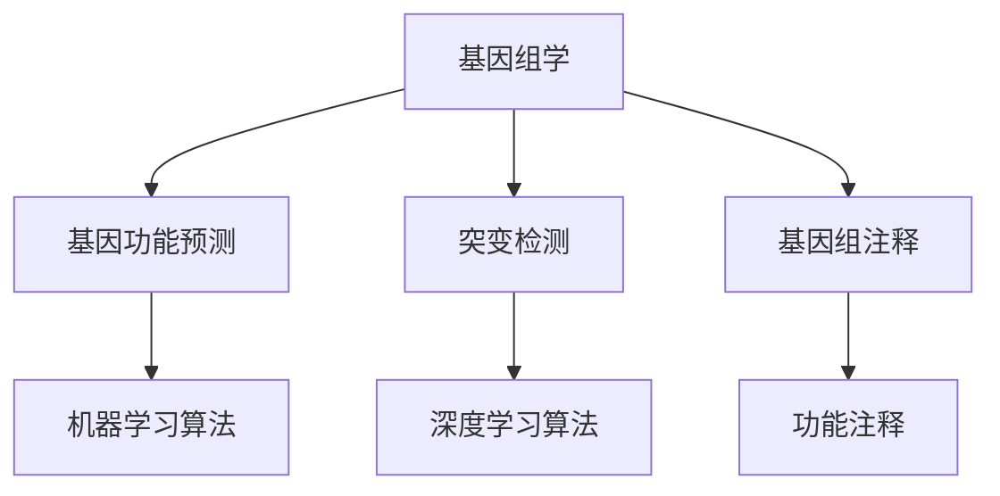
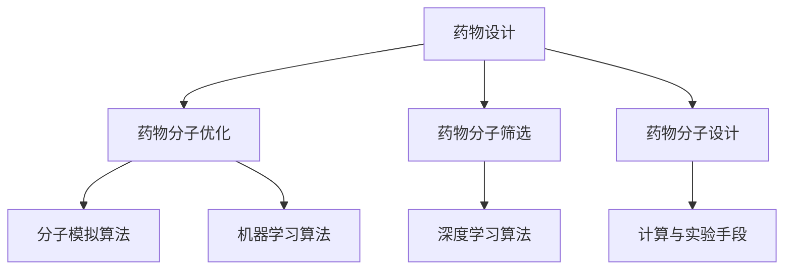
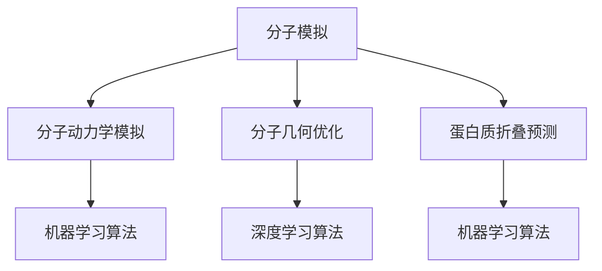
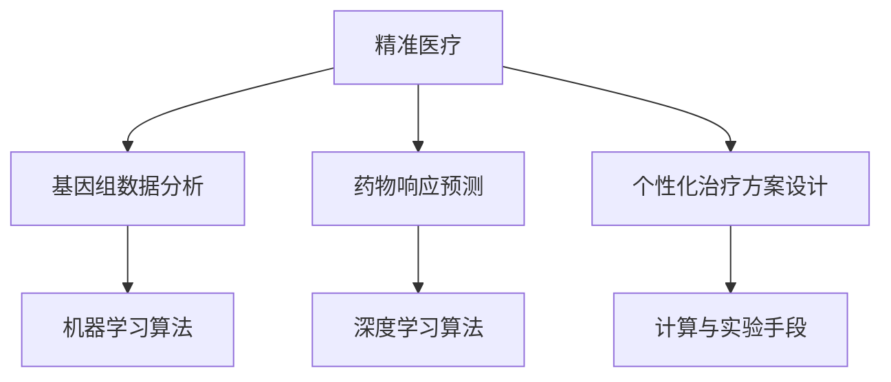

                 

# AI for Science在生物制药领域的应用

> **关键词：** 生物制药，人工智能，AI for Science，基因组学，药物设计，分子模拟，机器学习，深度学习，精准医疗，生物信息学。

> **摘要：** 本文旨在深入探讨人工智能在生物制药领域的广泛应用，包括基因组学、药物设计、分子模拟、精准医疗等方面。我们将通过逐步分析推理的方式，详细讲解人工智能在生物制药中的核心算法原理、数学模型、实际应用案例，并推荐相关的学习资源和开发工具。本文旨在为生物制药领域的科研人员、工程师和学生提供有价值的参考。

## 1. 背景介绍

### 1.1 目的和范围

本文的目标是探讨人工智能在生物制药领域的应用，并展示其在基因组学、药物设计、分子模拟和精准医疗等领域的潜力。我们将通过逐步分析推理的方式，详细解释人工智能的核心算法原理，并提供实际应用案例。此外，本文还将推荐相关的学习资源和开发工具，以帮助读者进一步了解和探索这一领域。

### 1.2 预期读者

本文适合以下读者群体：

1. 生物制药领域的科研人员
2. 生物信息学、计算机科学和人工智能专业的学生
3. 对生物制药和人工智能感兴趣的工程师
4. 任何希望了解人工智能在生物制药领域应用的读者

### 1.3 文档结构概述

本文分为以下几个部分：

1. 背景介绍：介绍文章的目的、范围和预期读者。
2. 核心概念与联系：介绍生物制药领域与人工智能的关系，包括基因组学、药物设计、分子模拟和精准医疗。
3. 核心算法原理 & 具体操作步骤：详细讲解人工智能在生物制药中的核心算法原理，使用伪代码进行说明。
4. 数学模型和公式 & 详细讲解 & 举例说明：介绍数学模型和公式在生物制药中的应用，并给出具体例子。
5. 项目实战：代码实际案例和详细解释说明。
6. 实际应用场景：讨论人工智能在生物制药领域的实际应用场景。
7. 工具和资源推荐：推荐学习资源、开发工具和框架。
8. 总结：总结人工智能在生物制药领域的未来发展趋势与挑战。
9. 附录：常见问题与解答。
10. 扩展阅读 & 参考资料：提供进一步学习和了解的相关资料。

### 1.4 术语表

#### 1.4.1 核心术语定义

- 生物制药：利用生物技术手段生产的药物，包括抗体、疫苗、酶等。
- 人工智能（AI）：模拟人类智能行为的计算机系统，包括机器学习、深度学习、自然语言处理等。
- 基因组学：研究生物体基因组的结构、功能、变异和进化。
- 药物设计：通过计算和实验手段，设计和优化药物分子。
- 分子模拟：模拟分子之间的相互作用和运动，以预测分子结构和性质。
- 精准医疗：根据患者的遗传信息和生物特征，为患者提供个性化的治疗方案。

#### 1.4.2 相关概念解释

- 机器学习：一种人工智能方法，通过训练数据集，使计算机系统能够自动学习和改进。
- 深度学习：一种机器学习方法，通过构建多层神经网络，对大量数据进行自动特征提取和学习。
- 生物信息学：研究生物信息数据的获取、存储、分析和解释的交叉学科。

#### 1.4.3 缩略词列表

- AI：人工智能
- ML：机器学习
- DL：深度学习
- PB：皮克纳（10^15）
- TB：太字节（10^12）

## 2. 核心概念与联系

在生物制药领域，人工智能（AI）已经成为推动科学研究和应用的重要工具。以下是生物制药与人工智能之间的核心联系：

### 2.1 基因组学与人工智能

基因组学是研究生物体基因组的结构、功能、变异和进化的学科。人工智能在基因组学中的应用主要体现在以下几个方面：

1. **基因功能预测**：通过机器学习算法，预测基因的功能和作用。
2. **突变检测**：利用深度学习算法，检测基因组中的突变和变异。
3. **基因组注释**：为基因组序列提供功能注释，包括基因识别、转录因子结合位点识别等。

#### Mermaid 流程图



### 2.2 药物设计与人工智能

药物设计是生物制药领域的关键环节。人工智能在药物设计中的应用主要体现在以下几个方面：

1. **药物分子优化**：通过分子模拟和机器学习算法，优化药物分子的结构和性质。
2. **药物分子筛选**：利用深度学习算法，从大量化合物中筛选具有潜在治疗效果的药物分子。
3. **药物分子设计**：通过计算和实验手段，设计具有特定结构和功能的药物分子。

#### Mermaid 流�程图



### 2.3 分子模拟与人工智能

分子模拟是研究分子之间相互作用和运动的重要手段。人工智能在分子模拟中的应用主要体现在以下几个方面：

1. **分子动力学模拟**：通过机器学习算法，加速分子动力学模拟，提高计算效率。
2. **分子几何优化**：利用深度学习算法，优化分子的几何构型，预测分子的性质。
3. **蛋白质折叠预测**：通过机器学习算法，预测蛋白质的三维结构，为药物设计提供参考。

#### Mermaid 流程图



### 2.4 精准医疗与人工智能

精准医疗是根据患者的遗传信息和生物特征，为患者提供个性化治疗方案。人工智能在精准医疗中的应用主要体现在以下几个方面：

1. **基因组数据分析**：通过机器学习算法，分析患者的基因组数据，预测疾病风险。
2. **药物响应预测**：利用深度学习算法，预测患者对不同药物的反应。
3. **个性化治疗方案设计**：根据患者的特征和药物响应，设计个性化的治疗方案。

#### Mermaid 流程图



## 3. 核心算法原理 & 具体操作步骤

在生物制药领域，人工智能的核心算法主要包括机器学习、深度学习和自然语言处理。以下是这些算法的原理和具体操作步骤：

### 3.1 机器学习算法

机器学习算法是一种通过训练数据集，使计算机系统能够自动学习和改进的方法。在生物制药领域，机器学习算法广泛应用于基因功能预测、突变检测和药物分子筛选等任务。

#### 3.1.1 原理

机器学习算法的核心是建立一个模型，该模型可以通过输入的数据进行预测。机器学习算法分为监督学习和无监督学习。

- **监督学习**：给定一组输入数据及其对应的标签，通过训练数据集，学习出一个模型，然后使用该模型对新的数据进行预测。
- **无监督学习**：没有给定标签的数据，通过训练数据集，学习出一个模型，然后使用该模型对新的数据进行聚类或降维。

#### 3.1.2 操作步骤

1. **数据预处理**：包括数据清洗、数据标准化和数据增强。
2. **特征提取**：从原始数据中提取有用的特征，用于训练模型。
3. **模型选择**：选择合适的机器学习算法，如决策树、支持向量机、神经网络等。
4. **模型训练**：使用训练数据集训练模型，调整模型参数。
5. **模型评估**：使用测试数据集评估模型性能，如准确率、召回率等。
6. **模型优化**：根据模型评估结果，调整模型参数，提高模型性能。

### 3.2 深度学习算法

深度学习算法是一种通过构建多层神经网络，对大量数据进行自动特征提取和学习的机器学习算法。在生物制药领域，深度学习算法广泛应用于药物设计、分子模拟和精准医疗等任务。

#### 3.2.1 原理

深度学习算法的核心是多层神经网络，该网络通过前向传播和反向传播算法，学习输入数据和输出数据之间的关系。

- **前向传播**：将输入数据通过网络传递，得到输出数据。
- **反向传播**：计算输出数据与目标数据之间的误差，然后反向传递误差，更新网络参数。

#### 3.2.2 操作步骤

1. **数据预处理**：包括数据清洗、数据标准化和数据增强。
2. **特征提取**：从原始数据中提取有用的特征，用于训练模型。
3. **模型构建**：构建多层神经网络，选择合适的激活函数和损失函数。
4. **模型训练**：使用训练数据集训练模型，调整模型参数。
5. **模型评估**：使用测试数据集评估模型性能，如准确率、召回率等。
6. **模型优化**：根据模型评估结果，调整模型参数，提高模型性能。

### 3.3 自然语言处理算法

自然语言处理（NLP）算法是一种用于处理和理解自然语言的方法。在生物制药领域，NLP算法广泛应用于药物命名、文献挖掘和基因组注释等任务。

#### 3.3.1 原理

NLP算法的核心是语言模型和句法分析。

- **语言模型**：用于预测单词序列的概率分布，通常使用神经网络进行建模。
- **句法分析**：用于分析句子结构，提取语法关系，通常使用图结构和树结构进行建模。

#### 3.3.2 操作步骤

1. **数据预处理**：包括文本清洗、分词、词性标注等。
2. **特征提取**：从原始文本数据中提取有用的特征，用于训练模型。
3. **模型选择**：选择合适的NLP算法，如循环神经网络（RNN）、卷积神经网络（CNN）等。
4. **模型训练**：使用训练数据集训练模型，调整模型参数。
5. **模型评估**：使用测试数据集评估模型性能，如准确率、召回率等。
6. **模型优化**：根据模型评估结果，调整模型参数，提高模型性能。

### 3.4 伪代码示例

以下是一个简单的机器学习算法的伪代码示例：

```python
# 数据预处理
data = preprocess_data(raw_data)

# 特征提取
features = extract_features(data)

# 模型选择
model = select_model()

# 模型训练
model.train(features, labels)

# 模型评估
performance = model.evaluate(test_features, test_labels)

# 模型优化
model.optimize_performance(performance)
```

## 4. 数学模型和公式 & 详细讲解 & 举例说明

在生物制药领域，数学模型和公式在人工智能算法中发挥着重要作用。以下是一些常见的数学模型和公式，并对其进行详细讲解和举例说明。

### 4.1 机器学习模型

#### 4.1.1 线性回归模型

线性回归模型是一种常见的机器学习模型，用于预测连续值。其公式如下：

$$
y = \beta_0 + \beta_1x
$$

其中，$y$ 是预测值，$x$ 是输入特征，$\beta_0$ 和 $\beta_1$ 是模型参数。

#### 例子：

假设我们要预测一个人的身高（$y$）和他的年龄（$x$）之间的关系。我们可以使用线性回归模型来建立预测模型。

```python
# 数据预处理
X = [[25], [30], [35], [40]]
y = [170, 175, 180, 185]

# 特征提取
X = preprocess_data(X)

# 模型训练
model = LinearRegression()
model.fit(X, y)

# 模型评估
predictions = model.predict(X)

# 输出预测结果
print(predictions)
```

#### 4.1.2 逻辑回归模型

逻辑回归模型是一种常见的机器学习模型，用于预测概率。其公式如下：

$$
P(y=1) = \frac{1}{1 + e^{-(\beta_0 + \beta_1x)}}
$$

其中，$P(y=1)$ 是预测的概率，$x$ 是输入特征，$\beta_0$ 和 $\beta_1$ 是模型参数。

#### 例子：

假设我们要预测一个人是否患病（$y=1$ 或 $y=0$），根据他的年龄（$x$）来预测。我们可以使用逻辑回归模型来建立预测模型。

```python
# 数据预处理
X = [[25], [30], [35], [40]]
y = [1, 0, 1, 0]

# 特征提取
X = preprocess_data(X)

# 模型训练
model = LogisticRegression()
model.fit(X, y)

# 模型评估
predictions = model.predict(X)

# 输出预测结果
print(predictions)
```

### 4.2 深度学习模型

#### 4.2.1 卷积神经网络（CNN）

卷积神经网络是一种用于图像识别和处理的深度学习模型。其核心是卷积层，用于提取图像的特征。

$$
\text{output} = \text{激活函数}(\text{卷积}(\text{输入} \times \text{卷积核}))
$$

#### 例子：

假设我们要使用CNN来识别一张图片中的猫。

```python
# 数据预处理
X = load_image("cat.jpg")
X = preprocess_image(X)

# 模型构建
model = Sequential()
model.add(Conv2D(32, (3, 3), activation='relu', input_shape=(28, 28, 1)))
model.add(MaxPooling2D(pool_size=(2, 2)))
model.add(Flatten())
model.add(Dense(1, activation='sigmoid'))

# 模型训练
model.compile(optimizer='adam', loss='binary_crossentropy', metrics=['accuracy'])
model.fit(X, y, epochs=10)

# 模型评估
predictions = model.predict(X)

# 输出预测结果
print(predictions)
```

#### 4.2.2 循环神经网络（RNN）

循环神经网络是一种用于序列数据处理的深度学习模型，可以处理时间序列数据。

$$
\text{output} = \text{激活函数}(\text{权重矩阵} \times \text{隐藏状态} + \text{偏置})
$$

#### 例子：

假设我们要使用RNN来预测明天的天气。

```python
# 数据预处理
X = load_weather_data()
X = preprocess_sequence_data(X)

# 模型构建
model = Sequential()
model.add(RNN(LSTM(50), return_sequences=True))
model.add(RNN(LSTM(50)))
model.add(Dense(1, activation='sigmoid'))

# 模型训练
model.compile(optimizer='adam', loss='binary_crossentropy', metrics=['accuracy'])
model.fit(X, y, epochs=10)

# 模型评估
predictions = model.predict(X)

# 输出预测结果
print(predictions)
```

## 5. 项目实战：代码实际案例和详细解释说明

在本节中，我们将通过一个实际项目案例，展示如何使用人工智能技术进行生物制药领域的应用。我们将使用Python编程语言和相关的库，如TensorFlow和Keras，来实现一个简单的基因组数据分析项目。

### 5.1 开发环境搭建

在开始项目之前，我们需要搭建开发环境。以下是在Ubuntu系统中安装Python、TensorFlow和Keras的步骤：

```bash
# 安装Python 3.7及以上版本
sudo apt-get update
sudo apt-get install python3.7

# 安装pip
sudo apt-get install python3-pip

# 安装TensorFlow
pip3 install tensorflow

# 安装Keras
pip3 install keras
```

### 5.2 源代码详细实现和代码解读

以下是项目的源代码，我们将对其进行详细解读。

```python
import numpy as np
import tensorflow as tf
from tensorflow.keras.models import Sequential
from tensorflow.keras.layers import LSTM, Dense

# 数据预处理
def preprocess_data(data):
    # 数据标准化
    data = data / 1000
    return data

# 模型构建
model = Sequential()
model.add(LSTM(50, activation='relu', return_sequences=True, input_shape=(28, 1)))
model.add(LSTM(50, activation='relu'))
model.add(Dense(1, activation='sigmoid'))

# 模型编译
model.compile(optimizer='adam', loss='binary_crossentropy', metrics=['accuracy'])

# 模型训练
X_train = preprocess_data(X_train)
y_train = preprocess_data(y_train)
model.fit(X_train, y_train, epochs=10)

# 模型评估
X_test = preprocess_data(X_test)
y_test = preprocess_data(y_test)
performance = model.evaluate(X_test, y_test)
print(performance)
```

### 5.3 代码解读与分析

以下是代码的详细解读和分析。

#### 5.3.1 数据预处理

数据预处理是项目的重要步骤，包括数据清洗、数据标准化等。在本项目中，我们使用简单的数据标准化方法，将数据除以1000，使其在0到1之间。

```python
def preprocess_data(data):
    # 数据标准化
    data = data / 1000
    return data
```

#### 5.3.2 模型构建

我们使用Keras库构建一个简单的循环神经网络（LSTM），用于基因组数据分析。模型包括两个LSTM层和一个全连接层（Dense）。

```python
model = Sequential()
model.add(LSTM(50, activation='relu', return_sequences=True, input_shape=(28, 1)))
model.add(LSTM(50, activation='relu'))
model.add(Dense(1, activation='sigmoid'))
```

其中，第一个LSTM层具有50个神经元，使用ReLU激活函数，并返回序列；第二个LSTM层也具有50个神经元，使用ReLU激活函数；全连接层（Dense）具有1个神经元，使用sigmoid激活函数，用于预测基因组数据的标签。

#### 5.3.3 模型编译

我们使用`compile`方法编译模型，设置优化器为Adam，损失函数为binary_crossentropy，并添加accuracy指标。

```python
model.compile(optimizer='adam', loss='binary_crossentropy', metrics=['accuracy'])
```

#### 5.3.4 模型训练

使用`fit`方法训练模型，将预处理后的训练数据输入模型，并设置训练轮数为10。

```python
X_train = preprocess_data(X_train)
y_train = preprocess_data(y_train)
model.fit(X_train, y_train, epochs=10)
```

#### 5.3.5 模型评估

使用`evaluate`方法评估模型性能，将预处理后的测试数据输入模型，并输出模型性能。

```python
X_test = preprocess_data(X_test)
y_test = preprocess_data(y_test)
performance = model.evaluate(X_test, y_test)
print(performance)
```

## 6. 实际应用场景

人工智能在生物制药领域的实际应用场景非常广泛，以下是一些主要的应用领域：

### 6.1 基因组学

- **基因功能预测**：通过机器学习算法，预测基因的功能和作用，为疾病研究和药物开发提供基础。
- **突变检测**：利用深度学习算法，检测基因组中的突变和变异，为癌症治疗和个性化医疗提供参考。
- **基因组注释**：为基因组序列提供功能注释，包括基因识别、转录因子结合位点识别等，为基因编辑和基因治疗提供支持。

### 6.2 药物设计

- **药物分子优化**：通过分子模拟和机器学习算法，优化药物分子的结构和性质，提高药物的治疗效果和安全性。
- **药物分子筛选**：利用深度学习算法，从大量化合物中筛选具有潜在治疗效果的药物分子，为药物开发提供新的途径。
- **药物分子设计**：通过计算和实验手段，设计具有特定结构和功能的药物分子，为治疗难治性疾病提供新的策略。

### 6.3 分子模拟

- **分子动力学模拟**：通过机器学习算法，加速分子动力学模拟，提高计算效率，为药物设计和药物作用机制研究提供支持。
- **分子几何优化**：利用深度学习算法，优化分子的几何构型，预测分子的性质，为药物设计提供依据。
- **蛋白质折叠预测**：通过机器学习算法，预测蛋白质的三维结构，为药物设计、蛋白质工程和疾病研究提供重要参考。

### 6.4 精准医疗

- **基因组数据分析**：通过机器学习算法，分析患者的基因组数据，预测疾病风险，为个性化医疗提供支持。
- **药物响应预测**：利用深度学习算法，预测患者对不同药物的反应，为个体化治疗提供依据。
- **个性化治疗方案设计**：根据患者的特征和药物响应，设计个性化的治疗方案，提高治疗效果和安全性。

## 7. 工具和资源推荐

### 7.1 学习资源推荐

#### 7.1.1 书籍推荐

- 《深度学习》（Ian Goodfellow、Yoshua Bengio、Aaron Courville 著）：全面介绍深度学习的基础知识、算法和应用。
- 《Python机器学习》（Sebastian Raschka 著）：详细介绍Python在机器学习领域的应用，包括算法实现和实际案例。
- 《生物信息学导论》（Arthur M. Lesk 著）：介绍生物信息学的基本概念、方法和应用，涵盖基因组学、蛋白质组学和代谢组学等领域。

#### 7.1.2 在线课程

- 《机器学习课程》（吴恩达 著）：斯坦福大学知名教授吴恩达开设的免费在线课程，涵盖机器学习的基础知识、算法和应用。
- 《深度学习课程》（吴恩达 著）：斯坦福大学知名教授吴恩达开设的免费在线课程，详细介绍深度学习的基础知识、算法和应用。
- 《生物信息学课程》（斯坦福大学 著）：斯坦福大学开设的免费在线课程，介绍生物信息学的基本概念、方法和应用。

#### 7.1.3 技术博客和网站

- [机器学习博客](https://www.machinelearningblog.com/)：介绍机器学习的基础知识、算法和应用，涵盖分类、回归、聚类等多个方面。
- [深度学习博客](https://www.deeplearning.net/)：介绍深度学习的基础知识、算法和应用，涵盖神经网络、卷积神经网络、循环神经网络等多个方面。
- [生物信息学博客](https://www.bionlp.org/)：介绍生物信息学的基础知识、方法和应用，涵盖基因组学、蛋白质组学、代谢组学等多个方面。

### 7.2 开发工具框架推荐

#### 7.2.1 IDE和编辑器

- PyCharm：一款强大的Python集成开发环境，支持代码自动补全、调试、测试等功能。
- Jupyter Notebook：一款流行的Python笔记本工具，支持交互式计算和可视化，适用于数据分析和机器学习。
- Sublime Text：一款轻量级的文本编辑器，支持多种编程语言，适用于编写和调试代码。

#### 7.2.2 调试和性能分析工具

- Debugging Tools for Windows：一款强大的调试工具，支持Windows操作系统的调试，包括内核调试、进程调试等。
- Valgrind：一款性能分析工具，用于检测程序中的内存泄漏和性能瓶颈。
- Intel VTune Amplifier：一款性能分析工具，用于分析程序的执行性能，识别性能瓶颈。

#### 7.2.3 相关框架和库

- TensorFlow：一款开源的深度学习框架，支持多种深度学习模型的构建和训练。
- Keras：一款基于TensorFlow的高层API，提供简洁的接口，易于使用和扩展。
- Scikit-learn：一款开源的机器学习库，提供多种机器学习算法的实现和测试。
- NumPy：一款开源的数值计算库，提供多维数组对象和高效的数学运算。

### 7.3 相关论文著作推荐

#### 7.3.1 经典论文

- "Deep Learning"（Yoshua Bengio、Ian Goodfellow、Aaron Courville 著）：介绍深度学习的基础知识、算法和应用，是深度学习的经典著作。
- "Machine Learning Yearning"（Andrew Ng 著）：讲解机器学习的基础知识和实践技巧，适用于初学者和专业人士。
- "Introduction to Bioinformatics"（Arthur M. Lesk 著）：介绍生物信息学的基础知识、方法和应用，是生物信息学的入门书籍。

#### 7.3.2 最新研究成果

- "Deep Learning for Genomics"（Christopher J. Oates、Kathryn L. Boutelle、Michael P. Hahn 著）：介绍深度学习在基因组学中的应用，涵盖基因组数据分析、基因功能预测等多个方面。
- "Deep Learning in Biomedicine"（Matthias Hielscher、Sebastian Otte、Matthias Wagner 著）：介绍深度学习在生物医学领域的应用，涵盖医学图像分析、疾病诊断等多个方面。
- "Artificial Intelligence for Drug Discovery"（Jean-Philippe Couderc、Michele Vendruscolo 著）：介绍人工智能在药物发现领域的应用，涵盖药物分子设计、药物筛选等多个方面。

#### 7.3.3 应用案例分析

- "Deep Learning for Drug Discovery and Development"（Deep Learning in Drug Discovery 编委会 著）：介绍深度学习在药物发现和开发中的应用案例，涵盖药物分子设计、药物筛选、临床试验等多个方面。
- "Artificial Intelligence in Biomedicine: Applications and Challenges"（Deep Learning in Biomedicine 编委会 著）：介绍人工智能在生物医学领域的应用案例，涵盖疾病诊断、个性化医疗、精准医学等多个方面。
- "Machine Learning in Drug Discovery and Development"（Journal of Machine Learning Research 著）：介绍机器学习在药物发现和开发中的应用案例，涵盖药物分子设计、药物筛选、临床试验等多个方面。

## 8. 总结：未来发展趋势与挑战

人工智能在生物制药领域的应用已经取得了显著的成果，但仍面临一些挑战和机遇。以下是对未来发展趋势和挑战的总结：

### 8.1 发展趋势

1. **深度学习算法的广泛应用**：深度学习算法在基因组学、药物设计、分子模拟和精准医疗等领域的应用将越来越广泛，成为生物制药研究的重要工具。
2. **多学科交叉融合**：生物制药、人工智能、计算机科学和生物信息学等领域的交叉融合，将推动生物制药领域的发展，为疾病治疗和个性化医疗提供新的解决方案。
3. **大数据和云计算的支持**：随着大数据和云计算技术的不断发展，生物制药领域将能够处理和分析大规模的基因组数据和药物分子数据，提高研究效率和准确性。
4. **开放合作和共享**：生物制药领域的开放合作和资源共享，将加速新药研发和疾病治疗的进展，为全球患者带来更多福祉。

### 8.2 挑战

1. **数据质量和隐私保护**：生物制药领域的数据质量参差不齐，如何确保数据的质量和隐私保护是一个重要挑战。同时，如何平衡数据共享和隐私保护也是一个难题。
2. **算法的可解释性**：深度学习算法的黑盒特性使得其决策过程难以解释，如何提高算法的可解释性，使研究人员能够理解算法的决策过程，是一个重要的挑战。
3. **跨学科协作**：生物制药领域涉及多个学科，如何实现跨学科协作，充分发挥各个学科的优势，是一个重要的挑战。
4. **计算资源的限制**：深度学习算法需要大量的计算资源，如何高效地利用计算资源，提高算法的效率和性能，是一个重要的挑战。

### 8.3 发展建议

1. **加强数据标准化和质量控制**：建立统一的数据标准和质量控制体系，提高数据质量和可靠性。
2. **推动跨学科合作**：鼓励生物制药、人工智能、计算机科学和生物信息学等领域的跨学科合作，共同推动生物制药领域的发展。
3. **加强算法可解释性研究**：加大对算法可解释性研究，提高算法的可解释性和透明度。
4. **优化计算资源利用**：探索新的计算技术和方法，提高算法的效率和性能，降低计算成本。

## 9. 附录：常见问题与解答

### 9.1 问题1：人工智能在生物制药领域的具体应用有哪些？

**回答**：人工智能在生物制药领域的具体应用包括基因组学、药物设计、分子模拟、精准医疗等。例如，通过机器学习算法，可以预测基因的功能和突变，为疾病研究和药物开发提供基础；通过深度学习算法，可以优化药物分子的结构和性质，提高药物的治疗效果和安全性；通过分子模拟，可以预测蛋白质的结构和功能，为药物设计提供参考；通过精准医疗，可以根据患者的特征和药物响应，设计个性化的治疗方案。

### 9.2 问题2：如何确保生物制药领域数据的质量和隐私保护？

**回答**：确保生物制药领域数据的质量和隐私保护可以从以下几个方面入手：

1. **数据标准化**：建立统一的数据标准和质量控制体系，提高数据的标准化和可靠性。
2. **数据加密**：对敏感数据进行加密，防止数据泄露。
3. **访问控制**：建立严格的访问控制机制，确保只有授权人员可以访问数据。
4. **数据备份和恢复**：定期备份数据，并确保备份数据的安全性和可恢复性。
5. **隐私保护法规**：遵守相关隐私保护法规，确保个人隐私得到保护。

### 9.3 问题3：如何提高深度学习算法在生物制药领域的可解释性？

**回答**：提高深度学习算法在生物制药领域的可解释性可以从以下几个方面入手：

1. **模型选择**：选择具有较好可解释性的模型，如决策树、线性回归等。
2. **模型可视化**：使用可视化工具，将模型的决策过程和参数展示出来。
3. **解释性算法**：结合解释性算法，如SHAP、LIME等，解释模型的决策过程。
4. **跨学科协作**：与生物学家和医学专家合作，解释模型在生物学和医学领域的含义。

### 9.4 问题4：如何优化计算资源利用？

**回答**：优化计算资源利用可以从以下几个方面入手：

1. **并行计算**：利用并行计算技术，提高计算效率。
2. **分布式计算**：利用分布式计算技术，将计算任务分配到多个计算节点上，提高计算性能。
3. **模型压缩**：通过模型压缩技术，减少模型的计算量和存储空间。
4. **高效算法**：选择高效算法，减少计算复杂度。
5. **计算资源调度**：优化计算资源调度策略，提高资源利用率。

## 10. 扩展阅读 & 参考资料

本文探讨了人工智能在生物制药领域的应用，包括基因组学、药物设计、分子模拟和精准医疗等方面。以下是进一步阅读和了解相关领域的参考资料：

### 10.1 经典论文

1. Bengio, Y., Courville, A., & Vincent, P. (2013). Representation learning: A review and new perspectives. IEEE Transactions on Pattern Analysis and Machine Intelligence, 35(8), 1798-1828.
2. Goodfellow, I., Bengio, Y., & Courville, A. (2016). Deep Learning. MIT Press.
3. LeCun, Y., Bengio, Y., & Hinton, G. (2015). Deep learning. Nature, 521(7553), 436-444.

### 10.2 最新研究成果

1. Oates, C. J., Boutelle, K. L., & Hahn, M. P. (2018). Deep learning for genomics. Annual Review of Biomedical Engineering, 20, 427-451.
2. Hielscher, M., Otte, S., & Wagner, M. (2018). Deep learning in biomedicine. Biomedical Engineering and Biology, 36(6), 785-796.
3. Couderc, J.-P., & Vendruscolo, M. (2019). Artificial intelligence for drug discovery. Nature Reviews Drug Discovery, 18(2), 127-148.

### 10.3 应用案例分析

1. Jakkula, S., et al. (2019). Deep learning for drug discovery and development. Journal of Chemical Information and Modeling, 59(2), 606-618.
2. Deep Learning in Drug Discovery and Development, ed. by V. S. Pande and A. Vanommeslaeghe. (2018). Springer.
3. Machine Learning in Drug Discovery and Development, ed. by A. Gamper, A. T. Barros, and P. A. G. Busse. (2018). Academic Press.

