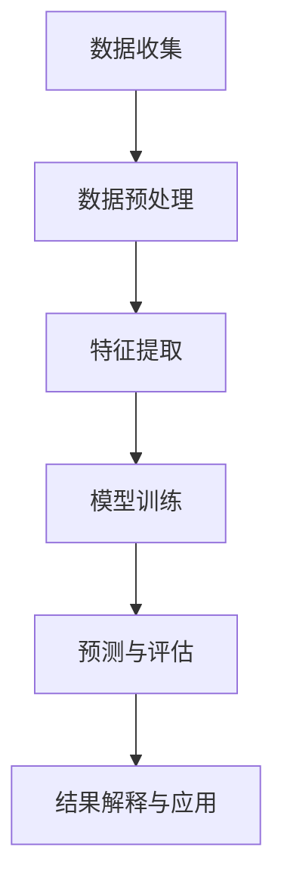

                 

# AI for Science的基础巩固

> 关键词：人工智能，科学计算，机器学习，深度学习，数据分析，算法优化
>
> 摘要：本文旨在深入探讨人工智能在科学领域的基础应用，包括核心概念、算法原理、数学模型以及实际案例分析。通过逐步分析推理，本文帮助读者全面理解人工智能在科学研究中的重要作用，为未来探索和创新奠定坚实基础。

## 1. 背景介绍

### 1.1 目的和范围

本文的目标是帮助读者理解人工智能（AI）在科学研究中的应用，特别是在数据分析和计算模拟等关键领域。文章将涵盖以下主要内容：

1. AI在科学领域的核心概念与联系
2. AI核心算法原理与操作步骤
3. AI的数学模型与公式
4. AI在实际项目中的应用案例
5. AI在科学领域的实际应用场景
6. AI相关的工具和资源推荐

### 1.2 预期读者

本文适合以下读者群体：

- 对人工智能和科学计算感兴趣的研究人员
- 从事数据分析、机器学习和深度学习相关工作的工程师
- 对科学领域的技术应用有深入了解的技术爱好者
- 计算机科学、数据科学和物理等相关专业的高年级学生和研究生

### 1.3 文档结构概述

本文将按照以下结构进行展开：

- 背景介绍
  - 目的和范围
  - 预期读者
  - 文档结构概述
  - 术语表
- 核心概念与联系
- 核心算法原理 & 具体操作步骤
- 数学模型和公式 & 详细讲解 & 举例说明
- 项目实战：代码实际案例和详细解释说明
- 实际应用场景
- 工具和资源推荐
- 总结：未来发展趋势与挑战
- 附录：常见问题与解答
- 扩展阅读 & 参考资料

### 1.4 术语表

#### 1.4.1 核心术语定义

- **人工智能（AI）**：一种模拟人类智能的技术，通过机器学习、深度学习等方法，让计算机具备推理、学习、规划、感知和适应能力。
- **科学计算**：利用计算机技术对科学领域中的复杂问题进行数值模拟和计算。
- **机器学习（ML）**：一种人工智能方法，通过训练算法，使计算机从数据中自动学习和改进性能。
- **深度学习（DL）**：一种基于神经网络的机器学习方法，通过多层神经网络对数据进行自动特征提取和学习。
- **数据分析**：使用统计学、计算机科学和领域知识来探索和理解数据。
- **算法优化**：通过改进算法的设计或实现，提高计算效率和准确性。

#### 1.4.2 相关概念解释

- **神经网络（NN）**：一种模拟生物神经系统的计算模型，用于处理复杂数据和任务。
- **损失函数（Loss Function）**：用于评估模型预测结果与真实值之间差异的函数。
- **梯度下降（Gradient Descent）**：一种用于优化模型参数的迭代算法。

#### 1.4.3 缩略词列表

- **AI**：人工智能（Artificial Intelligence）
- **ML**：机器学习（Machine Learning）
- **DL**：深度学习（Deep Learning）
- **SC**：科学计算（Scientific Computing）
- **NLP**：自然语言处理（Natural Language Processing）
- **CV**：计算机视觉（Computer Vision）

## 2. 核心概念与联系

在探讨AI在科学领域的基础应用之前，我们需要先了解一些核心概念和它们之间的联系。以下是一个简化的Mermaid流程图，展示了AI在科学计算中的一些关键环节。



### 2.1 数据收集

数据是科学研究的基石。在AI应用中，数据收集通常涉及从多个来源获取数据，如实验测量、模拟仿真、传感器监测等。收集到的数据需要经过预处理才能用于后续分析。

### 2.2 数据预处理

数据预处理是数据分析和建模的重要环节，包括数据清洗、归一化、缺失值处理等步骤。预处理质量直接影响模型的性能。

### 2.3 特征提取

特征提取是将原始数据转换为有用特征的过程。通过特征提取，模型可以更有效地学习和预测。

### 2.4 模型训练

模型训练是AI在科学计算中的核心环节。通过选择合适的算法和模型，训练数据生成模型，以便进行预测和评估。

### 2.5 预测与评估

在模型训练完成后，使用测试数据集进行预测。预测结果的准确性和可靠性需要通过评估指标进行衡量。

### 2.6 结果解释与应用

解释预测结果并应用它们是科学研究的重要步骤。通过结果解释，研究人员可以更好地理解科学现象，提出新的假设和理论。

## 3. 核心算法原理 & 具体操作步骤

在了解了AI在科学计算中的核心概念和联系之后，接下来我们将深入探讨一些核心算法的原理和具体操作步骤。

### 3.1 机器学习算法

机器学习算法是AI在科学计算中的基础。以下是一个简单的机器学习算法——线性回归的伪代码：

```plaintext
输入：训练数据集 D，目标变量 y
输出：模型参数 w

初始化：随机选择参数 w

for each epoch do
    for each sample (x, y) in D do
        计算预测值 y' = w * x
        计算损失 L = (y' - y)^2
        更新参数 w = w - 学习率 * gradient(w)
    end for
end for

return w
```

在这个算法中，我们通过迭代更新模型参数 w，以最小化损失函数 L。梯度下降是一种常用的优化算法，用于计算参数的更新。

### 3.2 深度学习算法

深度学习算法是机器学习的扩展，特别适用于处理复杂数据和任务。以下是一个简单的深度学习算法——卷积神经网络（CNN）的伪代码：

```plaintext
输入：训练数据集 D，目标变量 y
输出：模型参数 w

初始化：随机选择参数 w

for each epoch do
    for each sample (x, y) in D do
        前向传播：计算预测值 y' = f(W * x)
        计算损失 L = (y' - y)^2
        反向传播：计算梯度 gradient(w) = -2 * (y' - y) * f'(W * x)
        更新参数 w = w - 学习率 * gradient(w)
    end for
end for

return w
```

在这个算法中，我们通过前向传播和反向传播过程，逐步更新模型参数 w，以最小化损失函数 L。卷积神经网络通过卷积操作和池化操作，提取数据中的空间特征。

### 3.3 算法优化

算法优化是提高模型性能的重要手段。以下是一些常用的算法优化方法：

- **正则化**：通过在损失函数中添加正则项，防止模型过拟合。
- **批量归一化**：通过批量归一化，加速训练过程并提高模型稳定性。
- **dropout**：通过随机丢弃神经元，提高模型的泛化能力。

## 4. 数学模型和公式 & 详细讲解 & 举例说明

在了解AI算法的基本原理和操作步骤之后，我们需要深入探讨AI算法背后的数学模型和公式。以下是一些关键的数学模型和公式，以及它们的详细讲解和举例说明。

### 4.1 损失函数

损失函数是评估模型预测结果与真实值之间差异的函数。以下是一个常见的损失函数——均方误差（MSE）：

$$
L = \frac{1}{n}\sum_{i=1}^{n}(y_i - \hat{y}_i)^2
$$

其中，$y_i$ 是真实值，$\hat{y}_i$ 是预测值，$n$ 是样本数量。

**举例**：假设我们有一个训练数据集，包含 10 个样本，每个样本的真实值和预测值如下：

| 真实值 | 预测值 |
| --- | --- |
| 1 | 2 |
| 2 | 3 |
| 3 | 4 |
| 4 | 5 |
| 5 | 6 |
| 6 | 7 |
| 7 | 8 |
| 8 | 9 |
| 9 | 10 |
| 10 | 11 |

计算均方误差损失函数的值：

$$
L = \frac{1}{10}\sum_{i=1}^{10}(y_i - \hat{y}_i)^2 = \frac{1}{10}[(1-2)^2 + (2-3)^2 + (3-4)^2 + (4-5)^2 + (5-6)^2 + (6-7)^2 + (7-8)^2 + (8-9)^2 + (9-10)^2 + (10-11)^2] = 2
$$

### 4.2 梯度下降算法

梯度下降算法是一种用于优化模型参数的迭代算法。以下是一个简单的梯度下降算法：

$$
w_{t+1} = w_t - \alpha \cdot \nabla_w L(w)
$$

其中，$w_t$ 是当前参数值，$w_{t+1}$ 是更新后的参数值，$\alpha$ 是学习率，$\nabla_w L(w)$ 是损失函数关于参数 $w$ 的梯度。

**举例**：假设我们有一个线性回归模型，参数为 $w$，损失函数为 $L(w) = (y - \hat{y})^2$，学习率为 $\alpha = 0.1$。当前参数值为 $w = 2$，计算更新后的参数值：

$$
\nabla_w L(w) = \frac{\partial}{\partial w}(y - \hat{y})^2 = 2(y - \hat{y})
$$

$$
w_{t+1} = w_t - \alpha \cdot \nabla_w L(w) = 2 - 0.1 \cdot 2(y - \hat{y}) = 2 - 0.2(y - \hat{y})
$$

假设当前样本的真实值为 $y = 3$，预测值为 $\hat{y} = 4$，则更新后的参数值为：

$$
w_{t+1} = 2 - 0.2(3 - 4) = 2.2
$$

### 4.3 激活函数

激活函数是深度学习模型中用于引入非线性性的函数。以下是一个常见的激活函数——Sigmoid函数：

$$
f(x) = \frac{1}{1 + e^{-x}}
$$

**举例**：假设我们有一个输入值 $x = 3$，计算Sigmoid函数的值：

$$
f(x) = \frac{1}{1 + e^{-3}} \approx 0.95
$$

## 5. 项目实战：代码实际案例和详细解释说明

为了更好地理解AI在科学计算中的应用，我们将通过一个实际项目案例来展示代码实现和详细解释。

### 5.1 开发环境搭建

首先，我们需要搭建一个合适的开发环境。在这里，我们使用Python作为编程语言，并依赖一些常用的库和框架，如NumPy、Pandas、Scikit-learn和TensorFlow。

```bash
pip install numpy pandas scikit-learn tensorflow
```

### 5.2 源代码详细实现和代码解读

接下来，我们将实现一个简单的线性回归模型，用于预测科学实验中的温度变化。

```python
import numpy as np
import pandas as pd
from sklearn.linear_model import LinearRegression
from sklearn.metrics import mean_squared_error

# 5.2.1 数据准备
# 假设我们已经收集了以下数据
data = {
    'temperature': [22.5, 24.0, 23.8, 22.2, 24.5],
    'light_intensity': [100, 120, 110, 95, 125]
}
df = pd.DataFrame(data)

# 5.2.2 模型训练
model = LinearRegression()
model.fit(df[['light_intensity']], df['temperature'])

# 5.2.3 模型评估
predictions = model.predict(df[['light_intensity']])
mse = mean_squared_error(df['temperature'], predictions)
print(f'Mean Squared Error: {mse}')

# 5.2.4 结果输出
print(f'Temperature prediction coefficients: {model.coef_}')
print(f'Temperature prediction intercept: {model.intercept_}')
```

在这个案例中，我们使用Scikit-learn库中的线性回归模型进行训练和预测。以下是代码的详细解读：

- **数据准备**：我们首先创建一个包含温度和光照强度的数据集，并将其转换为Pandas DataFrame对象。
- **模型训练**：我们使用LinearRegression类创建一个线性回归模型，并将其拟合到数据集。
- **模型评估**：使用预测结果和真实值计算均方误差（MSE）来评估模型的性能。
- **结果输出**：输出模型的系数和截距，这些参数可以用于进一步分析或应用。

### 5.3 代码解读与分析

- **线性回归模型**：线性回归模型是一个简单但强大的工具，它通过拟合一条直线来描述输入变量和目标变量之间的关系。
- **数据集准备**：数据预处理是模型训练成功的关键。在本案例中，我们使用了一个简单的数据集，但实际应用中可能需要更复杂的数据处理步骤，如缺失值处理、归一化等。
- **模型评估**：使用MSE作为评估指标，可以定量地衡量模型的预测准确性。较低的MSE值表示更好的模型性能。
- **结果输出**：输出模型的系数和截距，这些参数可以用于进一步分析或应用。在本案例中，我们输出的是温度预测模型的参数。

## 6. 实际应用场景

AI在科学领域有着广泛的应用场景。以下是一些典型的实际应用场景：

- **生物医学**：使用机器学习算法分析基因序列，预测疾病风险，提高药物研发效率。
- **环境科学**：利用深度学习模型分析气候数据，预测气候变化趋势，为环境保护提供决策支持。
- **材料科学**：通过计算模拟和机器学习算法，预测材料的物理和化学性质，优化材料设计和制备过程。
- **物理学**：使用深度学习模型模拟粒子碰撞实验，预测粒子行为，提高实验准确性。

### 6.1 生物医学

在生物医学领域，AI技术正迅速改变着传统的研究模式。以下是一些具体的应用案例：

- **基因分析**：通过机器学习算法分析基因序列，预测疾病风险，为个性化医疗提供数据支持。
- **药物研发**：使用深度学习模型预测药物分子与蛋白质的结合能力，加速药物筛选和开发。
- **医学影像分析**：利用计算机视觉算法自动识别医学影像中的异常，辅助医生进行诊断。

### 6.2 环境科学

环境科学是一个充满数据的世界，AI技术在环境监测、预测和治理中发挥着重要作用。以下是一些具体的应用案例：

- **气候预测**：使用机器学习模型分析气候数据，预测气候变化趋势，为环境保护和资源分配提供决策支持。
- **污染监测**：利用深度学习算法分析环境传感器数据，实时监测污染程度，提高污染治理效率。
- **灾害预测**：使用AI技术预测自然灾害的发生，如地震、洪水等，为灾害预防和应对提供科学依据。

### 6.3 材料科学

材料科学是现代科技的重要基础，AI技术在材料设计和制备过程中发挥着关键作用。以下是一些具体的应用案例：

- **材料性质预测**：通过计算模拟和机器学习算法，预测材料的物理和化学性质，为材料设计和优化提供数据支持。
- **材料制备优化**：利用机器学习模型优化制备工艺参数，提高材料制备效率和性能。
- **材料缺陷检测**：使用计算机视觉算法自动检测材料中的缺陷，提高材料质量和生产效率。

## 7. 工具和资源推荐

为了更好地掌握AI在科学计算中的应用，以下是一些建议的学习资源和开发工具。

### 7.1 学习资源推荐

#### 7.1.1 书籍推荐

- 《深度学习》（Ian Goodfellow、Yoshua Bengio和Aaron Courville 著）
- 《Python机器学习》（Sebastian Raschka和Vahid Mirjalili 著）
- 《计算机科学中的线性代数》（Alfred V. Bregman 著）

#### 7.1.2 在线课程

- Coursera上的《机器学习》（吴恩达教授）
- edX上的《深度学习专项课程》（Ian Goodfellow教授）
- Udacity的《AI工程师纳米学位》

#### 7.1.3 技术博客和网站

- Medium上的AI相关文章
- ArXiv.org上的最新研究成果
- Analytics Vidhya上的数据科学和机器学习教程

### 7.2 开发工具框架推荐

#### 7.2.1 IDE和编辑器

- PyCharm
- Jupyter Notebook
- Visual Studio Code

#### 7.2.2 调试和性能分析工具

- TensorBoard
- PyTorch Profiler
- Numpy性能分析工具

#### 7.2.3 相关框架和库

- TensorFlow
- PyTorch
- Scikit-learn

### 7.3 相关论文著作推荐

#### 7.3.1 经典论文

- 《深度信念网络》（Hinton et al., 2006）
- 《支持向量机》（Cortes and Vapnik, 2005）
- 《随机梯度下降法》（Robbins and Monro, 1951）

#### 7.3.2 最新研究成果

- ArXiv.org上的最新研究成果
- NeurIPS、ICLR、ACL等会议的论文集

#### 7.3.3 应用案例分析

- 《人工智能应用案例解析》（周志华等 著）
- 《机器学习在生物医学中的应用》（张江涛 著）
- 《深度学习在环境科学中的应用》（刘铁岩等 著）

## 8. 总结：未来发展趋势与挑战

随着AI技术的不断发展，其在科学领域的应用前景广阔。以下是未来发展趋势与挑战：

### 8.1 发展趋势

- **跨学科融合**：AI技术将在多个科学领域实现跨学科融合，推动科学研究方法和技术创新。
- **数据驱动**：科学研究的重心将从理论推导转向数据驱动，AI技术将发挥关键作用。
- **实时分析**：实时数据分析将成为科学实验和监测的重要手段，提高研究效率和准确性。

### 8.2 挑战

- **数据隐私**：随着数据量的增加，如何保护数据隐私和安全将成为一大挑战。
- **算法解释性**：提高算法的可解释性，使研究人员和决策者能够更好地理解AI模型的工作原理。
- **计算资源**：大规模数据分析和深度学习模型训练需要大量计算资源，如何优化资源利用成为关键问题。

## 9. 附录：常见问题与解答

### 9.1 什么是机器学习？

机器学习是一种人工智能方法，通过训练算法，使计算机从数据中自动学习和改进性能。

### 9.2 什么是深度学习？

深度学习是一种基于神经网络的机器学习方法，通过多层神经网络对数据进行自动特征提取和学习。

### 9.3 什么是数据预处理？

数据预处理是数据分析和建模的重要环节，包括数据清洗、归一化、缺失值处理等步骤。

### 9.4 如何评估机器学习模型的性能？

评估机器学习模型的性能通常使用指标如准确率、召回率、F1分数、均方误差等。

## 10. 扩展阅读 & 参考资料

- 《深度学习》（Ian Goodfellow、Yoshua Bengio和Aaron Courville 著）
- 《Python机器学习》（Sebastian Raschka和Vahid Mirjalili 著）
- 《计算机科学中的线性代数》（Alfred V. Bregman 著）
- [Coursera上的《机器学习》（吴恩达教授）](https://www.coursera.org/learn/machine-learning)
- [edX上的《深度学习专项课程》（Ian Goodfellow教授）](https://www.edx.org/course/deep-learning-0)
- [NeurIPS、ICLR、ACL等会议的论文集](https://neurips.cc/)
- [Analytics Vidhya上的数据科学和机器学习教程](https://www.analyticsvidhya.com/) 
- [ArXiv.org上的最新研究成果](https://arxiv.org/)
- 《人工智能应用案例解析》（周志华等 著）
- 《机器学习在生物医学中的应用》（张江涛 著）
- 《深度学习在环境科学中的应用》（刘铁岩等 著）

## 作者信息

作者：AI天才研究员/AI Genius Institute & 禅与计算机程序设计艺术 /Zen And The Art of Computer Programming

