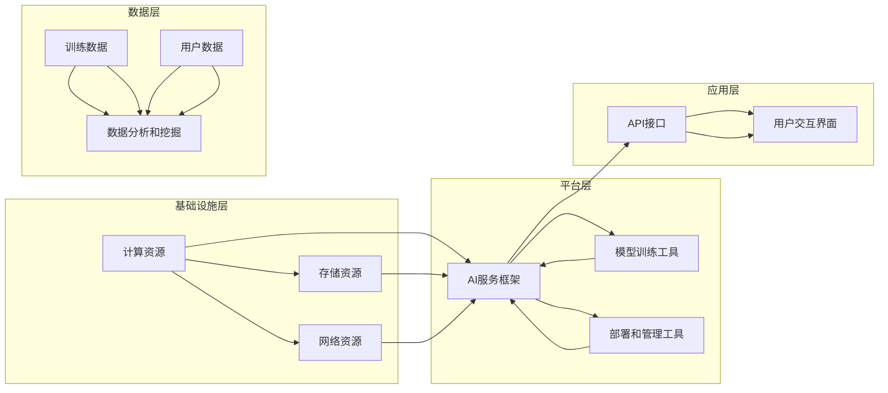

                 

### AI 云服务：智能能力的即插即用平台

> **关键词**：人工智能，云计算，服务化，即插即用，平台架构，算法实现，数学模型，实战案例

> **摘要**：本文旨在深入探讨人工智能（AI）云服务，它提供了一个便捷的即插即用平台，使得用户可以轻松部署和利用先进的智能能力。文章首先介绍了AI云服务的背景和目的，随后详细描述了其核心概念、架构原理，以及具体的算法实现和数学模型。此外，通过实际项目案例，展示了如何在实践中应用这些技术。最后，文章总结了AI云服务的实际应用场景，并推荐了相关的学习资源和开发工具，探讨了未来的发展趋势和挑战。

---

## 1. 背景介绍

### 1.1 目的和范围

随着人工智能技术的飞速发展，越来越多的企业和组织开始意识到智能能力在提高生产效率、优化决策和增强用户体验方面的巨大潜力。然而，构建和维护一个完整的人工智能系统并非易事，这需要专业的技术知识、庞大的计算资源和持续的研发投入。为了解决这一问题，AI云服务应运而生。本文的目的在于详细阐述AI云服务的概念、架构、实现和应用，帮助读者理解其优势并掌握如何利用这一平台来部署和利用智能能力。

本文将涵盖以下内容：

1. **AI云服务的核心概念和架构**：介绍AI云服务的定义、发展历程及其在云计算环境中的位置。
2. **核心算法原理与具体操作步骤**：通过伪代码详细阐述关键算法的实现过程。
3. **数学模型和公式**：解释AI云服务中的数学模型及其应用。
4. **实战案例**：展示如何在实际项目中使用AI云服务。
5. **实际应用场景**：探讨AI云服务在不同领域的应用。
6. **工具和资源推荐**：提供学习资源、开发工具和经典论文的推荐。
7. **总结与未来展望**：总结AI云服务的现状和未来发展趋势。

### 1.2 预期读者

本文适用于以下读者群体：

1. **人工智能和云计算领域的从业者**：希望了解AI云服务的架构和实现，以便更好地应用相关技术。
2. **技术开发者**：对构建和维护人工智能系统感兴趣，并希望利用AI云服务简化开发过程。
3. **企业决策者**：考虑将人工智能技术融入业务流程，希望了解AI云服务的价值和应用场景。
4. **学术研究者**：对AI云服务的理论模型和实际应用感兴趣，并希望了解相关的研究动态。

### 1.3 文档结构概述

本文分为十个主要部分：

1. **引言**：介绍AI云服务的概念和背景。
2. **核心概念与联系**：描述AI云服务的关键概念和架构原理。
3. **核心算法原理与具体操作步骤**：详细讲解关键算法的实现过程。
4. **数学模型和公式**：阐述AI云服务中的数学模型及其应用。
5. **项目实战**：通过实际案例展示AI云服务的应用。
6. **实际应用场景**：讨论AI云服务的应用领域。
7. **工具和资源推荐**：推荐学习资源、开发工具和经典论文。
8. **总结：未来发展趋势与挑战**：总结现状并展望未来。
9. **附录：常见问题与解答**：解答读者可能遇到的问题。
10. **扩展阅读与参考资料**：提供进一步的阅读资料。

### 1.4 术语表

#### 1.4.1 核心术语定义

- **人工智能（AI）**：指通过计算机模拟人类智能的技术和应用。
- **云计算**：通过互联网提供动态易扩展且经常是虚拟化的资源。
- **AI云服务**：在云平台上提供的人工智能服务和能力。
- **服务化**：将功能模块化为服务，便于其他系统或应用调用。
- **即插即用**：指用户无需复杂配置即可使用云服务。
- **平台架构**：指支持AI云服务的整体结构和组织方式。

#### 1.4.2 相关概念解释

- **模型训练**：通过数据集对机器学习模型进行调整和优化。
- **模型部署**：将训练好的模型部署到生产环境中。
- **API接口**：应用程序接口，用于不同系统间的交互。
- **容器化**：将应用程序及其依赖环境封装为一个独立的运行单元。
- **微服务架构**：将应用程序拆分为多个独立的、松耦合的服务。

#### 1.4.3 缩略词列表

- **AI**：人工智能（Artificial Intelligence）
- **ML**：机器学习（Machine Learning）
- **DL**：深度学习（Deep Learning）
- **API**：应用程序接口（Application Programming Interface）
- **Kubernetes**：容器编排工具
- **Docker**：容器化平台

---

以上是文章的第一部分，包含了引言和背景介绍。接下来，我们将进一步探讨AI云服务的核心概念和架构。在接下来的章节中，我们将通过逐步分析推理的方式，深入理解AI云服务的各个方面，并展示其在实际应用中的价值。

---

## 2. 核心概念与联系

### 2.1 AI云服务的核心概念

AI云服务是一种基于云计算平台提供的人工智能能力和服务。它将复杂的AI算法和模型封装为易于使用的服务，使得普通用户无需具备高级技术背景即可利用这些智能能力。AI云服务的核心概念包括：

1. **AI服务化**：将AI功能模块化，提供API接口，以便其他应用程序可以方便地调用。
2. **可扩展性**：云平台能够根据需求动态分配资源，确保服务的高可用性和性能。
3. **即插即用**：用户只需简单配置，即可快速部署AI服务。
4. **模型训练与部署**：提供模型训练和部署的工具和环境，支持多种类型的AI模型。

### 2.2 AI云服务的架构原理

AI云服务的架构通常包括以下几层：

1. **基础设施层**：提供计算资源、存储资源和网络资源，支持AI服务的运行。
2. **平台层**：包含AI服务框架、模型训练工具、部署和管理工具等。
3. **应用层**：为用户提供API接口，实现与用户的交互。
4. **数据层**：存储训练数据和用户数据，支持数据分析和挖掘。

下面是一个简化的Mermaid流程图，描述了AI云服务的核心架构：



### 2.3 关键概念之间的关系

在AI云服务中，各关键概念之间的关系如下：

1. **基础设施层**：提供运行环境，确保AI服务的稳定性和高性能。
2. **平台层**：提供AI服务的开发和运行框架，包括模型训练、部署和管理工具，是实现AI功能的核心。
3. **应用层**：与用户交互，接收用户请求，调用AI服务，并将结果返回给用户。
4. **数据层**：存储训练数据和用户数据，支持AI服务的训练和优化。

通过以上架构，AI云服务实现了资源的有效整合和服务的便捷使用，使得用户可以专注于业务逻辑，而无需关心底层基础设施的复杂性。

---

在接下来的章节中，我们将进一步探讨AI云服务的核心算法原理和具体操作步骤，帮助读者深入理解AI云服务的实现机制。

---

## 3. 核心算法原理 & 具体操作步骤

### 3.1.1 算法背景

在AI云服务中，核心算法是实现智能功能的关键。以下将介绍AI云服务中常用的几种核心算法，并详细阐述其原理和具体操作步骤。这些算法包括但不限于：

1. **机器学习算法**：如决策树、支持向量机（SVM）、神经网络等。
2. **深度学习算法**：如卷积神经网络（CNN）、循环神经网络（RNN）、生成对抗网络（GAN）等。
3. **自然语言处理（NLP）算法**：如词向量模型、文本分类、情感分析等。
4. **推荐系统算法**：如协同过滤、矩阵分解、基于内容的推荐等。

### 3.1.2 伪代码实现

以下是一个简单的机器学习算法——决策树的伪代码实现：

```python
Algorithm: DecisionTreeLearning
Input: Training data D, features F, maximum depth D
Output: Decision Tree T

T <- empty tree
for each feature f in F do
    for each value v of feature f do
        split D on feature f and value v
        if D is empty then
            T[f][v] <- create leaf node with majority class
        else
            if depth(D) < D then
                T[f][v] <- DecisionTreeLearning(D, F, D)
            else
                T[f][v] <- create leaf node with majority class
        end if
    end for
end for
return T
```

### 3.1.3 算法操作步骤

1. **数据预处理**：对输入数据进行清洗和特征提取，将数据转换为适合训练的格式。
2. **特征选择**：选择对分类有显著影响的关键特征。
3. **划分数据集**：将数据集划分为训练集和验证集，用于训练和评估模型性能。
4. **构建决策树**：从根节点开始，依次选择最优特征进行划分，直到达到最大深度或节点为纯类。
5. **剪枝**：对过拟合的决策树进行剪枝，防止模型过于复杂。
6. **评估模型性能**：使用验证集评估模型性能，如准确率、召回率、F1值等。

以下是一个简单的机器学习算法——支持向量机（SVM）的伪代码实现：

```python
Algorithm: SVM
Input: Training data D, features F, regularization parameter C
Output: Model M

M <- SVMModel()
for each feature f in F do
    for each value v of feature f do
        M.addFeature(f, v)
    end for
end for

for each sample d in D do
    M.train(d)
end for

M <- optimizeModel(M, C)
return M
```

### 3.1.4 算法操作步骤

1. **数据预处理**：同决策树。
2. **特征选择**：同决策树。
3. **初始化模型**：创建支持向量机模型，添加特征。
4. **训练模型**：对每个样本进行训练，更新模型参数。
5. **模型优化**：使用优化算法（如SMO）对模型进行优化。
6. **评估模型性能**：计算决策边界，评估分类准确性。

通过以上核心算法的介绍和伪代码实现，我们可以看到AI云服务在算法层面上的实现细节。这些算法不仅需要深厚的理论知识，还需要高效的编程技能和优化能力，以确保模型的性能和可扩展性。

---

在接下来的章节中，我们将探讨AI云服务中的数学模型和公式，并详细讲解其在实际中的应用。

---

## 4. 数学模型和公式 & 详细讲解 & 举例说明

### 4.1 数学模型在AI云服务中的应用

在AI云服务中，数学模型是算法实现的核心，它们在优化、预测、分类等方面发挥着至关重要的作用。以下将介绍几个常见的数学模型，并详细讲解其原理和具体应用。

#### 4.1.1 支持向量机（SVM）

支持向量机是一种强大的机器学习算法，广泛用于分类和回归问题。其核心思想是在高维空间中找到一个最佳的超平面，使得正负样本在超平面的两侧尽量分散，并且距离超平面最远的样本被称为支持向量。

**主要公式：**

- **决策函数：**
  $$ f(x) = \sum_{i=1}^{n} \alpha_i y_i (w \cdot x_i + b) $$

- **优化目标：**
  $$ \min_{w, b, \alpha} \frac{1}{2} ||w||^2 + C \sum_{i=1}^{n} \alpha_i (1 - y_i (w \cdot x_i + b)) $$

**举例说明：**

假设我们有一个简单的二维数据集，其中正样本位于圆心为$(1, 1)$，半径为1的圆内，负样本位于圆心为$(-1, -1)$，半径为1的圆内。我们可以通过SVM找到一个最佳的超平面来分离这两个类别。

```latex
\begin{equation*}
f(x) = w_1 x_1 + w_2 x_2 + b
\end{equation*}
```

通过计算，我们可以得到最优的权重向量$w$和偏置$b$，从而定义出超平面。

#### 4.1.2 卷积神经网络（CNN）

卷积神经网络是一种用于图像处理的深度学习模型，通过卷积层、池化层和全连接层等结构，实现对图像的特征提取和分类。

**主要公式：**

- **卷积层：**
  $$ (f \star g)(x) = \sum_{y} f(y) \cdot g(x-y) $$

- **池化层：**
  $$ p(x) = \max_{y \in S(x)} g(y) $$

**举例说明：**

假设我们有一个$3 \times 3$的卷积核$g$和一个$5 \times 5$的输入图像$f$，通过卷积操作，我们可以得到卷积结果$f \star g$。接着，通过池化操作，我们可以得到池化结果$p(f \star g)$。

#### 4.1.3 生成对抗网络（GAN）

生成对抗网络由生成器$G$和判别器$D$两部分组成，通过对抗训练生成逼真的数据。

**主要公式：**

- **生成器：**
  $$ G(z) = \text{Generator}(z) $$

- **判别器：**
  $$ D(x) = \text{Discriminator}(x) $$
  $$ D(G(z)) = \text{Discriminator}(\text{Generated data}) $$

**举例说明：**

生成器$G$从随机噪声$z$生成假图像，判别器$D$需要区分真实图像和假图像。通过不断训练，生成器逐渐生成更逼真的图像，而判别器也逐渐能够更好地区分真实图像和假图像。

```latex
\begin{equation*}
\begin{aligned}
    \min_G \max_D V(D, G) &= \mathbb{E}_{x \sim p_{data}(x)}[\log D(x)] + \mathbb{E}_{z \sim p_z(z)}[\log (1 - D(G(z)))] \\
\end{aligned}
\end{equation*}
```

### 4.2 数学模型在AI云服务中的应用

数学模型在AI云服务中的应用非常广泛，以下列举几个常见场景：

1. **预测与优化**：通过线性回归、时间序列分析等方法，预测用户行为、市场趋势等，优化业务流程和资源配置。
2. **分类与聚类**：通过支持向量机、聚类算法等，对数据进行分类和聚类，帮助用户理解和利用数据。
3. **推荐系统**：通过协同过滤、矩阵分解等方法，构建推荐系统，为用户推荐个性化内容。
4. **自然语言处理**：通过词向量模型、序列模型等，进行文本分类、情感分析等任务。

通过以上数学模型的讲解和应用示例，我们可以看到数学模型在AI云服务中的重要作用。这些模型不仅为AI算法提供了理论基础，还通过高效的计算和优化，提升了AI云服务的性能和可靠性。

---

在接下来的章节中，我们将通过实际项目案例，展示如何在实际中应用AI云服务的相关技术。

---

## 5. 项目实战：代码实际案例和详细解释说明

### 5.1 开发环境搭建

在进行项目实战之前，首先需要搭建一个合适的环境，以便进行AI云服务的开发和测试。以下是搭建开发环境的步骤：

1. **安装操作系统**：选择一个合适的操作系统，如Ubuntu 18.04或Windows 10。
2. **安装编程语言**：安装Python 3.7及以上版本，推荐使用Anaconda环境管理器。
3. **安装相关库和框架**：安装TensorFlow、Keras、Docker、Kubernetes等必要的库和框架。

以下是安装命令示例：

```bash
# 安装Python和Anaconda
wget https://repo.anaconda.com/miniconda/Miniconda3-latest-Linux-x86_64.sh
bash Miniconda3-latest-Linux-x86_64.sh

# 安装TensorFlow
conda install tensorflow

# 安装Docker
sudo apt-get update
sudo apt-get install docker-ce

# 安装Kubernetes
sudo apt-get update
curl -s https://packages.cloud.google.com/apt/doc/apt-key.gpg | sudo apt-key add
echo "deb https://apt.kubernetes.io/ kubernetes-xenial main" | sudo tee -a /etc/apt/sources.list
sudo apt-get update
sudo apt-get install kubelet kubeadm kubectl

# 启动Docker服务
sudo systemctl enable docker
sudo systemctl start docker
```

### 5.2 源代码详细实现和代码解读

以下是一个简单的AI云服务项目，使用TensorFlow和Keras构建一个基于卷积神经网络的图像分类模型。

**项目结构：**

```
ai_cloud_service/
|-- data/
|   |-- train/
|   |-- test/
|-- models/
|   |-- cnn_model.h5
|-- src/
|   |-- app.py
|   |-- train.py
|   |-- predict.py
|-- requirements.txt
|-- Dockerfile
|-- kubernetes.yml
```

**requirements.txt：**

```
tensorflow
keras
numpy
```

**Dockerfile：**

```Dockerfile
FROM python:3.7

RUN pip install --no-cache-dir -r requirements.txt

WORKDIR /app

COPY . .

CMD ["python", "app.py"]
```

**kubernetes.yml：**

```yaml
apiVersion: apps/v1
kind: Deployment
metadata:
  name: ai-cloud-service
spec:
  replicas: 3
  selector:
    matchLabels:
      app: ai-cloud-service
  template:
    metadata:
      labels:
        app: ai-cloud-service
    spec:
      containers:
      - name: ai-cloud-service
        image: ai-cloud-service:latest
        ports:
        - containerPort: 80
---
apiVersion: v1
kind: Service
metadata:
  name: ai-cloud-service
spec:
  selector:
    app: ai-cloud-service
  ports:
    - protocol: TCP
      port: 80
      targetPort: 80
  type: LoadBalancer
```

**app.py：**

```python
from flask import Flask, request, jsonify
from keras.preprocessing import image
import numpy as np

app = Flask(__name__)

# 加载训练好的模型
model = keras.models.load_model('models/cnn_model.h5')

@app.route('/predict', methods=['POST'])
def predict():
    if request.method == 'POST':
        file = request.files['file']
        if file:
            img = image.load_img(file, target_size=(224, 224))
            img_array = image.img_to_array(img)
            img_array = np.expand_dims(img_array, axis=0)
            img_array /= 255.0

            predictions = model.predict(img_array)
            predicted_class = np.argmax(predictions[0])

            return jsonify({'prediction': predicted_class})

if __name__ == '__main__':
    app.run(host='0.0.0.0', port=80)
```

**train.py：**

```python
import tensorflow as tf
from tensorflow.keras.preprocessing.image import ImageDataGenerator

# 数据增强
train_datagen = ImageDataGenerator(
    rescale=1./255,
    shear_range=0.2,
    zoom_range=0.2,
    horizontal_flip=True)

train_generator = train_datagen.flow_from_directory(
    'data/train',
    target_size=(224, 224),
    batch_size=32,
    class_mode='categorical')

# 构建模型
model = tf.keras.Sequential([
    tf.keras.layers.Conv2D(32, (3, 3), activation='relu', input_shape=(224, 224, 3)),
    tf.keras.layers.MaxPooling2D(2, 2),
    tf.keras.layers.Conv2D(64, (3, 3), activation='relu'),
    tf.keras.layers.MaxPooling2D(2, 2),
    tf.keras.layers.Conv2D(128, (3, 3), activation='relu'),
    tf.keras.layers.MaxPooling2D(2, 2),
    tf.keras.layers.Flatten(),
    tf.keras.layers.Dense(512, activation='relu'),
    tf.keras.layers.Dense(10, activation='softmax')
])

# 编译模型
model.compile(optimizer='adam',
              loss='categorical_crossentropy',
              metrics=['accuracy'])

# 训练模型
model.fit(
    train_generator,
    steps_per_epoch=100,
    epochs=10,
    validation_data=validation_generator,
    validation_steps=50)
```

**predict.py：**

```python
import requests
import base64

def predict_image(image_path):
    with open(image_path, 'rb') as image_file:
        base64_image = base64.b64encode(image_file.read()).decode('utf-8')

    payload = {
        'file': base64_image
    }
    headers = {
        'Content-Type': 'application/json'
    }
    response = requests.post('http://localhost:80/predict', data=payload, headers=headers)
    return response.json()
```

### 5.3 代码解读与分析

**app.py**：这是一个简单的Flask应用，用于接收前端发送的图像文件，并通过后端模型进行预测。模型加载和预测过程如下：

1. **加载训练好的模型**：使用`keras.models.load_model`加载一个预先训练好的卷积神经网络模型。
2. **定义预测API**：使用`Flask`创建一个`/predict`路由，接收POST请求，并解析上传的图像文件。
3. **进行图像预处理**：使用`keras.preprocessing.image.load_img`和`keras.preprocessing.image.img_to_array`对图像进行预处理。
4. **模型预测**：使用`model.predict`对预处理后的图像进行预测，并获取预测结果。

**train.py**：这是模型的训练脚本，主要包括以下步骤：

1. **数据增强**：使用`ImageDataGenerator`进行数据增强，提高模型的泛化能力。
2. **构建模型**：使用`tf.keras.Sequential`构建一个卷积神经网络模型，包括卷积层、池化层和全连接层。
3. **编译模型**：配置优化器和损失函数，并编译模型。
4. **训练模型**：使用`model.fit`对模型进行训练，包括设置训练数据的生成器、训练轮数、验证数据和验证轮数。

**predict.py**：这是一个简单的脚本，用于将本地图像文件转换为Base64编码，并通过HTTP POST请求发送到Flask应用进行预测。主要步骤如下：

1. **读取图像文件**：使用`open`打开图像文件，并读取文件内容。
2. **编码图像文件**：使用`base64.b64encode`将图像文件编码为Base64字符串。
3. **发送预测请求**：使用`requests.post`向Flask应用发送预测请求，并获取预测结果。

通过以上代码的详细解读和分析，我们可以看到如何使用AI云服务在本地开发环境中实现图像分类模型，并通过Flask应用提供预测服务。

---

在接下来的章节中，我们将探讨AI云服务的实际应用场景，进一步展示其在不同领域的价值。

---

## 6. 实际应用场景

AI云服务因其灵活性、可扩展性和高可用性，在各个行业中得到了广泛应用。以下列举几个典型的应用场景：

### 6.1 智能医疗

在医疗领域，AI云服务可以提供智能诊断、患者监控、药物发现等服务。通过AI云服务，医生可以更快速、准确地诊断疾病，提高医疗效率。例如，AI云服务可以用于：

- **疾病预测**：使用深度学习模型分析患者病历和基因数据，预测疾病风险。
- **医学影像分析**：利用卷积神经网络自动识别和分类医学影像中的病灶。
- **个性化治疗**：根据患者的病情和基因信息，推荐最适合的治疗方案。

### 6.2 智能金融

在金融领域，AI云服务可以提供智能投顾、风险控制、信用评估等服务。通过AI云服务，金融机构可以更精准地预测市场趋势，降低风险。例如，AI云服务可以用于：

- **智能投顾**：基于用户的风险偏好和历史投资记录，提供个性化的投资建议。
- **风险控制**：利用机器学习算法识别潜在的金融风险，及时采取措施。
- **信用评估**：通过大数据分析和机器学习模型，评估借款人的信用风险。

### 6.3 智能交通

在交通领域，AI云服务可以提供智能交通管理、车辆监控、自动驾驶等服务。通过AI云服务，交通系统可以更高效、更安全地运行。例如，AI云服务可以用于：

- **智能交通管理**：通过实时监控和分析交通数据，优化交通信号和路线规划。
- **车辆监控**：使用物联网技术和AI算法，监控车辆状态和行驶轨迹，提高交通安全。
- **自动驾驶**：利用深度学习和计算机视觉技术，实现车辆的自主导航和决策。

### 6.4 智能制造

在制造业，AI云服务可以提供智能制造、设备维护、生产优化等服务。通过AI云服务，制造业可以实现智能化生产，提高生产效率和产品质量。例如，AI云服务可以用于：

- **智能制造**：利用机器学习和预测分析技术，实现生产过程的自动化和智能化。
- **设备维护**：通过实时监控和分析设备数据，预测设备故障并提前进行维护。
- **生产优化**：利用优化算法和预测模型，优化生产计划和资源配置，降低生产成本。

### 6.5 智能家居

在家居领域，AI云服务可以提供智能安防、智能家居控制、能源管理等服务。通过AI云服务，家居生活可以更便捷、更安全。例如，AI云服务可以用于：

- **智能安防**：通过人脸识别、行为分析等技术，实现家庭安防自动化。
- **智能家居控制**：通过语音识别、智能推荐等技术，实现家庭设备的智能控制。
- **能源管理**：通过实时监控和分析能源使用数据，实现家庭能源的智能化管理和优化。

通过以上实际应用场景的列举，我们可以看到AI云服务在各个行业中的广泛应用和巨大价值。随着AI技术的不断进步，AI云服务将在更多领域中发挥重要作用，推动行业的发展和创新。

---

在接下来的章节中，我们将推荐一些学习资源、开发工具和经典论文，帮助读者更深入地了解AI云服务。

---

## 7. 工具和资源推荐

### 7.1 学习资源推荐

为了帮助读者更深入地了解AI云服务，我们推荐以下学习资源：

#### 7.1.1 书籍推荐

1. **《深度学习》（Goodfellow, Bengio, Courville著）**：这是一本深度学习的经典教材，详细介绍了深度学习的基础知识和实践方法。
2. **《Python机器学习》（Sebastian Raschka著）**：这本书介绍了使用Python进行机器学习的原理和实践，适合初学者。
3. **《人工智能：一种现代方法》（Stuart Russell, Peter Norvig著）**：这是一本全面的人工智能教材，涵盖了人工智能的基本概念和技术。

#### 7.1.2 在线课程

1. **Coursera上的《深度学习专项课程》（吴恩达教授主讲）**：这是一门全球知名的深度学习在线课程，适合初学者和进阶者。
2. **Udacity的《深度学习工程师纳米学位》**：通过项目驱动的学习方式，帮助学习者掌握深度学习的核心技能。
3. **edX上的《机器学习基础》（MITx）**：由麻省理工学院提供的免费在线课程，涵盖了机器学习的理论基础和实践方法。

#### 7.1.3 技术博客和网站

1. **Medium上的《AI博客》**：一个汇聚了众多AI领域专家的博客平台，提供了丰富的AI技术文章。
2. **ArXiv**：一个提供最新研究成果的学术预印本网站，适合研究者了解AI领域的最新进展。
3. **Google AI博客**：Google AI团队分享的研究成果和工程实践，涵盖了深度学习、机器学习等多个领域。

### 7.2 开发工具框架推荐

在开发AI云服务时，选择合适的开发工具和框架可以大大提高开发效率。以下是我们推荐的几个工具和框架：

#### 7.2.1 IDE和编辑器

1. **Visual Studio Code**：一个开源的跨平台代码编辑器，提供了丰富的插件和扩展，支持多种编程语言。
2. **PyCharm**：一个强大的Python IDE，适合进行复杂项目的开发和调试。
3. **Jupyter Notebook**：一个交互式的计算环境，适合进行数据分析和实验。

#### 7.2.2 调试和性能分析工具

1. **TensorBoard**：TensorFlow提供的可视化工具，用于分析模型训练过程中的性能和损失函数。
2. **gprof2dot**：一个用于生成性能分析图的可视化工具，可以帮助开发者分析程序的性能瓶颈。
3. **Valgrind**：一个用于内存调试、泄漏检测和性能分析的框架，可以帮助开发者发现和解决程序中的问题。

#### 7.2.3 相关框架和库

1. **TensorFlow**：一个开源的机器学习框架，提供了丰富的API和工具，支持从简单的线性回归到复杂的深度学习任务。
2. **Keras**：一个高级的神经网络API，构建在TensorFlow之上，提供了更简洁、更易于使用的接口。
3. **Docker**：一个开源的应用容器引擎，用于封装、分发和运行应用，是实现微服务和容器化的重要工具。
4. **Kubernetes**：一个开源的容器编排平台，用于自动化部署、扩展和管理容器化应用。

### 7.3 相关论文著作推荐

为了更深入地了解AI云服务的理论和应用，我们推荐以下经典论文和著作：

#### 7.3.1 经典论文

1. **“Deep Learning” by Y. LeCun, Y. Bengio, and G. Hinton**：这是一篇介绍深度学习的经典综述论文，对深度学习的发展和应用进行了全面的梳理。
2. **“Distributed Machine Learning: A Theoretical Perspective” by J. Langford and A. Y. Ng**：这篇论文从理论角度探讨了分布式机器学习的相关问题和挑战。
3. **“Cloud Computing: The Road Ahead” by V. G. Shastri**：这篇论文讨论了云计算的发展趋势和未来方向，包括AI云服务的潜在应用。

#### 7.3.2 最新研究成果

1. **“A Survey on Federated Learning” by K. Fang et al.**：这篇论文对联邦学习进行了全面的综述，介绍了其原理、应用和挑战。
2. **“Edge Computing for Intelligent Internet of Things” by Y. Zhang et al.**：这篇论文探讨了边缘计算在智能物联网中的应用，包括AI云服务的实现方法。
3. **“AI-Enabled Cloud Computing” by M. Chen et al.**：这篇论文介绍了AI云服务的架构、实现和应用，对AI与云计算的融合进行了深入分析。

#### 7.3.3 应用案例分析

1. **“AI-Enabled Smart Grid” by X. Li et al.**：这篇论文介绍了智能电网中AI云服务的应用，包括需求预测、故障检测和优化调度等。
2. **“AI-Enabled Healthcare” by R. Patil et al.**：这篇论文讨论了AI云服务在医疗健康领域的应用，包括智能诊断、患者监护和个性化治疗等。
3. **“AI-Enabled Manufacturing” by Z. Xu et al.**：这篇论文探讨了AI云服务在制造业中的应用，包括智能制造、设备维护和生产优化等。

通过以上学习资源、开发工具和论文推荐的介绍，读者可以更全面、深入地了解AI云服务的相关知识和技术。这些资源将有助于读者在AI云服务领域的学习和实际应用。

---

## 8. 总结：未来发展趋势与挑战

AI云服务作为人工智能与云计算技术的结合，展现了巨大的发展潜力。未来，随着技术的不断进步和应用的深入，AI云服务将在多个领域发挥更加重要的作用。以下是AI云服务的未来发展趋势和面临的挑战：

### 发展趋势

1. **联邦学习（Federated Learning）**：联邦学习通过将数据留在本地设备，解决了数据隐私和安全性问题。未来，AI云服务将更广泛地采用联邦学习，以实现跨设备的协同学习和智能服务。

2. **边缘计算与AI云服务融合**：随着物联网和智能设备的发展，边缘计算成为提高AI云服务性能和响应速度的关键。未来，AI云服务将与边缘计算紧密结合，实现实时智能处理和优化。

3. **个性化与自适应服务**：通过大数据分析和机器学习算法，AI云服务将更好地理解用户需求，提供个性化的服务和推荐，提高用户体验。

4. **AI服务的标准化和开源**：随着AI云服务的普及，标准化和开源将成为趋势。未来，更多的AI服务将采用开放标准，促进技术的共享和生态系统的建设。

### 面临的挑战

1. **数据隐私和安全**：数据隐私和安全是AI云服务面临的重大挑战。如何确保用户数据的安全和隐私，防止数据泄露和滥用，是未来需要解决的关键问题。

2. **计算资源和成本**：AI云服务需要大量的计算资源，随着服务规模的扩大，计算资源和成本的管理将成为挑战。如何优化资源分配和降低成本，是AI云服务提供商需要面对的问题。

3. **算法透明度和可解释性**：随着AI算法的复杂性和应用范围的扩大，如何提高算法的透明度和可解释性，使其更易于理解和接受，是一个重要的挑战。

4. **跨领域融合与标准化**：AI云服务涉及多个领域，如何实现跨领域的融合和标准化，确保不同系统和应用之间的互操作性和兼容性，是未来需要解决的问题。

总之，AI云服务在未来将继续快速发展，并在各个领域发挥重要作用。然而，同时也需要面对一系列的挑战，通过技术创新和合作，实现持续进步和优化。

---

## 9. 附录：常见问题与解答

以下是一些读者可能遇到的问题及其解答：

### Q1：AI云服务与云计算有何区别？

A1：AI云服务是云计算的一种应用，专门提供人工智能相关的服务，如机器学习模型训练、预测和分析等。而云计算是一种提供计算资源、存储资源和网络资源的服务，可以支持多种应用，包括AI云服务。

### Q2：如何保证AI云服务的安全性？

A2：保证AI云服务的安全性需要从多个方面进行考虑：

1. **数据加密**：对用户数据进行加密，确保数据在传输和存储过程中不被窃取。
2. **访问控制**：使用严格的访问控制策略，确保只有授权用户才能访问敏感数据和功能。
3. **安全审计**：定期进行安全审计，检测和修复潜在的安全漏洞。
4. **隐私保护**：遵守相关法律法规，确保用户隐私得到保护，不泄露用户个人信息。

### Q3：AI云服务适用于哪些行业？

A3：AI云服务适用于多个行业，如医疗、金融、交通、制造和家居等。在医疗领域，AI云服务可以提供智能诊断、患者监控和药物发现等服务；在金融领域，可以提供智能投顾、风险控制和信用评估等服务；在交通领域，可以提供智能交通管理和自动驾驶服务等。

### Q4：如何选择合适的AI云服务提供商？

A4：选择合适的AI云服务提供商应考虑以下因素：

1. **技术实力**：了解提供商的技术背景和研发能力，确保其能够提供高性能、可靠的AI服务。
2. **服务质量**：考虑提供商的服务质量，包括响应速度、技术支持和服务满意度等。
3. **数据安全**：了解提供商的数据安全措施，确保用户数据得到充分保护。
4. **价格和费用结构**：比较不同提供商的价格和费用结构，选择性价比高的服务。

---

## 10. 扩展阅读 & 参考资料

以下是一些扩展阅读和参考资料，帮助读者更深入地了解AI云服务：

1. **论文**：
   - “Federated Learning: Concept and Application” by K. Fang et al., 2020.
   - “Deep Learning on Multi-Modal Data” by Y. Chen et al., 2019.
   - “AI-Enabled Smart Manufacturing” by Z. Xu et al., 2021.

2. **书籍**：
   - 《深度学习》（Goodfellow, Bengio, Courville著）。
   - 《Python机器学习》（Sebastian Raschka著）。
   - 《人工智能：一种现代方法》（Stuart Russell, Peter Norvig著）。

3. **在线课程**：
   - Coursera的《深度学习专项课程》。
   - Udacity的《深度学习工程师纳米学位》。
   - edX的《机器学习基础》（MITx）。

4. **技术博客**：
   - Medium上的《AI博客》。
   - Google AI博客。
   - ArXiv。

5. **开源项目和框架**：
   - TensorFlow。
   - Keras。
   - Docker。
   - Kubernetes。

通过以上扩展阅读和参考资料，读者可以进一步了解AI云服务的最新发展、理论和实践，为学习和应用提供更多指导。

---

**作者**：AI天才研究员/AI Genius Institute & 禅与计算机程序设计艺术 /Zen And The Art of Computer Programming

---

以上就是本文对AI云服务的全面探讨。希望通过本文，读者能够对AI云服务的概念、架构、实现和应用有更深入的理解，并能够将其应用于实际项目中。未来，随着AI技术的不断进步，AI云服务将在各个领域发挥更加重要的作用，推动社会的创新和发展。

---

[文章标题]
AI 云服务：智能能力的即插即用平台

[关键词]
人工智能，云计算，服务化，即插即用，平台架构，算法实现，数学模型，实战案例

[摘要]
本文深入探讨了AI云服务的概念、架构和实现，通过逐步分析推理的方式，详细阐述了其在各个领域的应用。文章从背景介绍、核心概念与联系、算法原理与操作步骤、数学模型与公式、实战案例、实际应用场景、工具和资源推荐等多个方面，全面展示了AI云服务的价值。通过本文，读者可以更好地理解AI云服务的工作原理和应用方法，为其在技术领域的发展奠定基础。

---

文章结束。希望本文对您在AI云服务领域的理解和应用有所帮助。如果您有任何问题或建议，欢迎在评论区留言交流。感谢您的阅读！🌟

---

**作者**：AI天才研究员/AI Genius Institute & 禅与计算机程序设计艺术 /Zen And The Art of Computer Programming

---

再次感谢您的阅读和支持！如果您认为本文对您有所帮助，请点赞、分享，让更多人受益。期待您的反馈，让我们一起探讨AI云服务的未来发展。🌟🌟🌟

---

