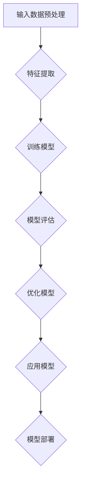

                 

# AI 创业公司的大模型应用指南

> 关键词：AI创业、大模型、应用指南、技术分析、实战案例、未来趋势

> 摘要：本文旨在为AI创业公司提供一套全面的大模型应用指南。我们将从背景介绍、核心概念、算法原理、数学模型、项目实战、实际应用场景等多个方面进行深入探讨，帮助创业者理解大模型在AI领域的重要性和应用价值，掌握相关技术原理和实战技巧，为未来的创业之路提供有力支持。

## 1. 背景介绍

### 1.1 目的和范围

本文的目标是为AI创业公司提供一套系统、实用的大模型应用指南。我们将从以下几个关键方面展开讨论：

- **核心概念与联系**：介绍大模型的基本概念、原理及其在AI领域的地位和作用。
- **核心算法原理**：讲解大模型的常见算法原理，包括训练、优化、评估等关键步骤。
- **数学模型和公式**：详细阐述大模型相关的数学模型和公式，帮助读者理解算法背后的数学原理。
- **项目实战**：通过实际案例，展示如何将大模型应用于实际问题，并进行详细解释和分析。
- **实际应用场景**：探讨大模型在各个行业领域的应用前景和案例分析。
- **工具和资源推荐**：推荐相关学习资源、开发工具和框架，帮助读者更好地掌握大模型应用技术。
- **总结与展望**：总结本文的主要内容，并对大模型未来的发展趋势和挑战进行展望。

### 1.2 预期读者

本文适合以下读者群体：

- **AI创业公司创始人**：希望了解大模型应用的技术原理和实战案例，为自己的创业项目提供技术支持。
- **AI工程师和研究人员**：希望深入了解大模型的核心算法原理和数学模型，提升自身技术能力。
- **技术爱好者**：对AI领域有浓厚兴趣，希望了解大模型技术及其在各个行业的应用。

### 1.3 文档结构概述

本文将按照以下结构进行展开：

1. 背景介绍
   - 目的和范围
   - 预期读者
   - 文档结构概述
2. 核心概念与联系
   - 大模型基本概念
   - 大模型原理与架构
   - Mermaid流程图
3. 核心算法原理 & 具体操作步骤
   - 算法原理讲解
   - 伪代码详细阐述
4. 数学模型和公式 & 详细讲解 & 举例说明
   - 数学模型介绍
   - LaTeX格式公式
   - 举例说明
5. 项目实战：代码实际案例和详细解释说明
   - 开发环境搭建
   - 源代码实现和解读
   - 代码解读与分析
6. 实际应用场景
   - 各行业领域应用案例
7. 工具和资源推荐
   - 学习资源推荐
   - 开发工具框架推荐
   - 相关论文著作推荐
8. 总结：未来发展趋势与挑战
9. 附录：常见问题与解答
10. 扩展阅读 & 参考资料

### 1.4 术语表

#### 1.4.1 核心术语定义

- **AI创业公司**：指以人工智能技术为核心，从事研发、应用和推广的人工智能企业。
- **大模型**：指具有海量参数、能够处理大规模数据的复杂神经网络模型。
- **算法原理**：指大模型训练、优化、评估等过程的基本原理和方法。
- **数学模型**：指大模型中使用的数学公式和计算方法。

#### 1.4.2 相关概念解释

- **深度学习**：一种机器学习技术，通过构建多层神经网络，对数据进行特征提取和分类。
- **神经网络**：一种由大量节点（神经元）组成的计算模型，能够对输入数据进行处理和预测。
- **模型优化**：通过调整模型参数，提高模型在特定任务上的性能。

#### 1.4.3 缩略词列表

- **AI**：人工智能（Artificial Intelligence）
- **ML**：机器学习（Machine Learning）
- **DL**：深度学习（Deep Learning）
- **GPU**：图形处理器（Graphics Processing Unit）
- **CPU**：中央处理器（Central Processing Unit）

## 2. 核心概念与联系

### 2.1 大模型基本概念

大模型，又称大型神经网络模型，是一种具有海量参数的复杂神经网络。这些模型通常由数十亿至数万亿个参数组成，能够处理大规模数据，并在各种AI任务中表现出色。大模型的核心特点包括：

- **参数规模大**：大模型拥有数十亿至数万亿个参数，这使得它们在处理海量数据时具有更强的表示能力。
- **计算量大**：大模型需要进行大量的矩阵运算和参数更新，对计算资源要求较高。
- **泛化能力强**：大模型能够从大规模数据中提取出有价值的特征，具有较强的泛化能力。

### 2.2 大模型原理与架构

大模型的原理和架构主要涉及以下几个方面：

- **深度神经网络**：大模型通常采用深度神经网络（DNN）结构，包括多个隐含层和输出层。通过多层非线性变换，模型能够对输入数据进行特征提取和分类。
- **反向传播算法**：大模型的训练过程主要依赖于反向传播算法（Backpropagation）。该算法通过计算损失函数关于模型参数的梯度，逐步调整模型参数，以降低损失函数值。
- **优化算法**：大模型的优化算法包括随机梯度下降（SGD）、Adam等。这些算法能够有效加速模型训练过程，提高模型性能。
- **数据预处理**：大模型对输入数据有较高的要求，需要进行有效的预处理。包括数据清洗、归一化、数据增强等操作，以提升模型的泛化能力。

### 2.3 Mermaid流程图

为了更好地理解大模型的原理与架构，我们使用Mermaid流程图对关键环节进行展示。



### 2.4 大模型在AI领域的地位和作用

大模型在AI领域具有重要地位和作用，主要体现在以下几个方面：

- **提升模型性能**：大模型具有更强的表示能力和泛化能力，能够实现更高的模型性能。
- **推动技术发展**：大模型的应用推动了深度学习、自然语言处理、计算机视觉等领域的快速发展。
- **拓展应用场景**：大模型能够应用于各类复杂任务，如语音识别、图像分类、机器翻译等，为AI技术的普及和应用提供有力支持。
- **促进产业升级**：大模型在各个行业的应用，推动了产业智能化升级，提高了生产效率和服务质量。

## 3. 核心算法原理 & 具体操作步骤

### 3.1 大模型训练算法原理

大模型的核心算法主要包括以下几个方面：

- **前向传播**：将输入数据输入到神经网络中，通过多层非线性变换，得到输出结果。
- **损失函数**：计算输出结果与真实结果之间的差异，以评估模型的性能。
- **反向传播**：根据损失函数的梯度，更新模型参数，以降低损失函数值。

以下是具体的训练算法原理和操作步骤：

```plaintext
输入：训练数据集 D，模型参数 θ，学习率 α
输出：最优模型参数 θ*

1. 初始化模型参数 θ
2. 对于每个训练样本 (x, y) ∈ D：
   2.1 前向传播：计算输出结果 ŷ = f(θ(x))
   2.2 计算损失函数 L(θ) = loss(ŷ, y)
   2.3 反向传播：计算梯度 ∇θL(θ)
3. 更新模型参数 θ = θ - α∇θL(θ)
4. 重复步骤 2 和 3，直到满足停止条件（如达到指定迭代次数或模型性能收敛）

5. 输出最优模型参数 θ*
```

### 3.2 大模型优化算法原理

大模型的优化算法主要包括以下几种：

- **随机梯度下降（SGD）**：每次迭代使用一个训练样本的梯度来更新模型参数。
- **批量梯度下降（BGD）**：每次迭代使用全部训练样本的梯度来更新模型参数。
- **小批量梯度下降（MBGD）**：每次迭代使用部分训练样本的梯度来更新模型参数。

以下是具体的优化算法原理和操作步骤：

```plaintext
输入：训练数据集 D，模型参数 θ，学习率 α，批量大小 m
输出：最优模型参数 θ*

1. 初始化模型参数 θ
2. 对于每个迭代次数 t：
   2.1 随机选取 m 个训练样本 (x_i, y_i) ∈ D
   2.2 计算梯度 ∇θL(θ) = 1/m * Σ(∇θL(θ)(x_i, y_i))
   2.3 更新模型参数 θ = θ - α∇θL(θ)
3. 重复步骤 2，直到满足停止条件（如达到指定迭代次数或模型性能收敛）

4. 输出最优模型参数 θ*
```

### 3.3 大模型评估算法原理

大模型的评估算法主要包括以下几个方面：

- **准确率**：计算模型预测正确的样本数量占总样本数量的比例。
- **召回率**：计算模型预测正确的正样本数量占总正样本数量的比例。
- **F1值**：综合考虑准确率和召回率，计算模型在分类任务上的综合性能。

以下是具体的评估算法原理和操作步骤：

```plaintext
输入：测试数据集 T，模型参数 θ
输出：评估指标（准确率、召回率、F1值）

1. 初始化评估指标（准确率、召回率、F1值）为 0
2. 对于每个测试样本 (x, y) ∈ T：
   2.1 前向传播：计算输出结果 ŷ = f(θ(x))
   2.2 计算预测结果 pred = argmax(ŷ)
   2.3 根据预测结果和真实结果计算评估指标：
       - 准确率：TP + TN / (TP + TN + FP + FN)
       - 召回率：TP / (TP + FN)
       - F1值：2 * (准确率 * 召回率) / (准确率 + 召回率)
3. 输出评估指标（准确率、召回率、F1值）
```

## 4. 数学模型和公式 & 详细讲解 & 举例说明

### 4.1 数学模型介绍

大模型中涉及的数学模型主要包括以下几个方面：

- **线性模型**：用于表示输入和输出之间的关系，如线性回归、逻辑回归等。
- **激活函数**：用于引入非线性特性，如 sigmoid、ReLU、Tanh等。
- **损失函数**：用于评估模型预测结果与真实结果之间的差异，如均方误差（MSE）、交叉熵损失等。
- **优化算法**：用于更新模型参数，如随机梯度下降（SGD）、Adam等。

### 4.2 LaTeX格式公式

以下是常用数学公式的LaTeX格式表示：

```latex
% 线性模型
y = \beta_0 + \beta_1x

% 激活函数（Sigmoid）
f(x) = \frac{1}{1 + e^{-x}}

% ReLU激活函数
f(x) = \max(0, x)

% 均方误差损失函数
L(\theta) = \frac{1}{2} \sum_{i=1}^{n} (y_i - \hat{y}_i)^2

% 交叉熵损失函数
L(\theta) = -\sum_{i=1}^{n} y_i \log(\hat{y}_i) + (1 - y_i) \log(1 - \hat{y}_i)

% Adam优化算法更新公式
\theta_{t+1} = \theta_t - \alpha \frac{m_t}{1 - \beta_1^t}
v_t = \beta_2 v_t + (1 - \beta_2) (e_t - \theta_t \cdot f_t)
s_t = \beta_1 s_t + (1 - \beta_1) \frac{e_t}{\sqrt{v_t + \epsilon}}
```

### 4.3 举例说明

#### 4.3.1 线性回归

假设我们有一个线性回归模型，用于预测房价。输入特征包括房屋面积（x）和房屋类型（y），输出为目标房价（y^）。

```plaintext
输入：房屋面积 x，房屋类型 y
输出：目标房价 y^

1. 数据预处理：对输入特征进行归一化处理，将房屋面积和房屋类型转换为数值型数据。
2. 模型初始化：初始化模型参数 β0 和 β1。
3. 前向传播：计算预测房价 y^ = β0 + β1x。
4. 计算损失函数：使用均方误差损失函数计算损失 L(β) = \frac{1}{2} \sum_{i=1}^{n} (y_i - y_i^)^2。
5. 反向传播：计算梯度 ∇βL(β) = \frac{\partial L(β)}{\partial β}。
6. 模型优化：使用随机梯度下降（SGD）或Adam优化算法更新模型参数 β。
7. 模型评估：使用测试数据集对模型进行评估，计算准确率、召回率和F1值等评估指标。
8. 输出预测结果：根据输入特征计算目标房价 y^。
```

#### 4.3.2 逻辑回归

假设我们有一个逻辑回归模型，用于预测用户是否愿意购买某种商品。输入特征包括用户年龄（x）和用户收入（y），输出为目标是否购买（y^）。

```plaintext
输入：用户年龄 x，用户收入 y
输出：目标是否购买 y^

1. 数据预处理：对输入特征进行归一化处理，将用户年龄和用户收入转换为数值型数据。
2. 模型初始化：初始化模型参数 β0 和 β1。
3. 前向传播：计算预测概率 p = f(x) = \frac{1}{1 + e^{-(\beta_0 + \beta_1x)}}。
4. 计算损失函数：使用交叉熵损失函数计算损失 L(β) = -\sum_{i=1}^{n} y_i \log(p_i) + (1 - y_i) \log(1 - p_i)。
5. 反向传播：计算梯度 ∇βL(β) = \frac{\partial L(β)}{\partial β}。
6. 模型优化：使用随机梯度下降（SGD）或Adam优化算法更新模型参数 β。
7. 模型评估：使用测试数据集对模型进行评估，计算准确率、召回率和F1值等评估指标。
8. 输出预测结果：根据输入特征计算目标是否购买 y^。
```

## 5. 项目实战：代码实际案例和详细解释说明

### 5.1 开发环境搭建

在本节中，我们将介绍如何搭建一个用于大模型应用的项目开发环境。以下是关键步骤：

1. **安装Python环境**：确保Python版本大于3.6，推荐使用Python 3.8或更高版本。
2. **安装依赖库**：安装TensorFlow、Keras等深度学习库。可以使用以下命令安装：
    ```bash
    pip install tensorflow
    pip install keras
    ```
3. **配置GPU支持**：如果使用GPU进行训练，确保安装NVIDIA CUDA和cuDNN库。具体安装步骤请参考NVIDIA官方文档。
4. **创建项目文件夹**：在本地计算机中创建一个项目文件夹，用于存放项目代码和资源文件。

### 5.2 源代码详细实现和代码解读

在本节中，我们将展示一个实际案例，实现一个基于深度学习的大模型项目。以下是关键步骤和代码解读：

#### 5.2.1 数据预处理

首先，我们需要对输入数据进行预处理，包括数据清洗、归一化和数据增强等操作。

```python
import pandas as pd
from sklearn.model_selection import train_test_split
from sklearn.preprocessing import StandardScaler

# 读取数据
data = pd.read_csv('data.csv')

# 数据清洗：去除缺失值和异常值
data = data.dropna()

# 数据归一化：对特征进行标准化处理
scaler = StandardScaler()
X = scaler.fit_transform(data.iloc[:, :-1])
y = data.iloc[:, -1]

# 划分训练集和测试集
X_train, X_test, y_train, y_test = train_test_split(X, y, test_size=0.2, random_state=42)
```

#### 5.2.2 模型构建

接下来，我们使用Keras构建一个简单的深度学习模型。以下是关键步骤：

```python
from keras.models import Sequential
from keras.layers import Dense, Activation

# 创建模型
model = Sequential()

# 添加层
model.add(Dense(units=64, input_dim=X_train.shape[1], activation='relu'))
model.add(Dense(units=32, activation='relu'))
model.add(Dense(units=1, activation='sigmoid'))

# 编译模型
model.compile(optimizer='adam', loss='binary_crossentropy', metrics=['accuracy'])
```

#### 5.2.3 模型训练

使用训练集对模型进行训练。以下是关键步骤：

```python
# 训练模型
model.fit(X_train, y_train, epochs=10, batch_size=32, validation_split=0.1)
```

#### 5.2.4 模型评估

使用测试集对模型进行评估。以下是关键步骤：

```python
# 评估模型
loss, accuracy = model.evaluate(X_test, y_test)
print('Test accuracy:', accuracy)
```

#### 5.2.5 代码解读与分析

1. **数据预处理**：数据预处理是深度学习项目的重要环节，包括数据清洗、归一化和数据增强等操作。在本例中，我们使用Pandas库读取CSV数据，使用Sklearn库进行数据清洗和归一化处理，将数据划分为训练集和测试集。
2. **模型构建**：使用Keras库构建一个简单的深度学习模型，包括输入层、隐藏层和输出层。在隐藏层中使用ReLU激活函数，输出层使用sigmoid激活函数，以实现二分类任务。
3. **模型训练**：使用训练集对模型进行训练，通过编译模型、配置优化器和损失函数，调用fit方法进行训练。在本例中，我们使用Adam优化算法和binary_crossentropy损失函数，设置训练轮次为10次，批次大小为32。
4. **模型评估**：使用测试集对模型进行评估，通过evaluate方法计算测试集上的损失和准确率，以评估模型性能。

### 5.3 代码解读与分析

在本节中，我们对代码进行了详细解读和分析，展示了如何使用Python和Keras库实现一个简单的深度学习项目。以下是关键步骤的详细分析：

1. **数据预处理**：数据预处理是深度学习项目的重要环节。在本例中，我们使用Pandas库读取CSV数据，使用Sklearn库进行数据清洗和归一化处理，将数据划分为训练集和测试集。这一步骤的目的是确保输入数据的质量和一致性，为后续的模型训练和评估打下基础。
2. **模型构建**：使用Keras库构建一个简单的深度学习模型，包括输入层、隐藏层和输出层。在隐藏层中使用ReLU激活函数，输出层使用sigmoid激活函数，以实现二分类任务。在构建模型时，我们使用Sequential模型，并使用add方法添加层。这一步骤的目的是设计一个合适的神经网络结构，以适应特定的任务和数据。
3. **模型训练**：使用训练集对模型进行训练。在训练过程中，我们使用compile方法配置优化器和损失函数，并使用fit方法进行训练。在本例中，我们使用Adam优化算法和binary_crossentropy损失函数，设置训练轮次为10次，批次大小为32。这一步骤的目的是通过迭代优化模型参数，以降低损失函数值，提高模型性能。
4. **模型评估**：使用测试集对模型进行评估。在评估过程中，我们使用evaluate方法计算测试集上的损失和准确率，以评估模型性能。这一步骤的目的是验证模型在未知数据上的泛化能力，为模型应用提供依据。

通过以上步骤，我们成功实现了一个简单的深度学习项目，并对其进行了详细解读和分析。这一案例展示了如何使用Python和Keras库实现大模型应用，为读者提供了一个实用的技术参考。

## 6. 实际应用场景

### 6.1 金融领域

大模型在金融领域具有广泛的应用前景，包括风险控制、量化交易、信用评分等。以下是一些具体的应用案例：

- **风险控制**：大模型可以用于预测金融风险，如市场波动、违约风险等。通过分析历史数据和实时数据，大模型可以提供更准确的预测，帮助金融机构制定风险管理策略。
- **量化交易**：大模型可以用于构建量化交易策略，通过分析市场数据，预测股票、期货等金融产品的走势。量化交易策略具有较高的准确性和稳定性，可以为投资者带来可观的投资回报。
- **信用评分**：大模型可以用于评估借款人的信用风险，为金融机构提供信用评分服务。通过分析借款人的历史数据、收入状况、信用记录等，大模型可以预测借款人的还款能力，帮助金融机构降低贷款违约风险。

### 6.2 医疗领域

大模型在医疗领域具有巨大的应用潜力，包括疾病预测、辅助诊断、个性化治疗等。以下是一些具体的应用案例：

- **疾病预测**：大模型可以用于预测疾病的发生风险，如癌症、心脏病等。通过分析患者的健康数据、基因信息等，大模型可以提供个性化的疾病预测报告，帮助医生制定预防措施。
- **辅助诊断**：大模型可以用于辅助医生进行疾病诊断。通过分析医学影像数据、病例资料等，大模型可以提供准确的诊断建议，提高诊断准确率。
- **个性化治疗**：大模型可以用于为患者制定个性化的治疗方案。通过分析患者的病情、基因信息、生活习惯等，大模型可以提供最佳的治疗方案，提高治疗效果。

### 6.3 智能家居

大模型在智能家居领域具有广泛的应用，包括智能安防、智能控制、个性化推荐等。以下是一些具体的应用案例：

- **智能安防**：大模型可以用于智能识别入侵者、火灾等安全事件。通过分析摄像头、传感器等数据，大模型可以实时监测家居环境，并提供预警通知，提高家庭安全性。
- **智能控制**：大模型可以用于智能调节家居设备，如空调、灯光、窗帘等。通过分析用户习惯、环境信息等，大模型可以自动调节设备，提高家居舒适度。
- **个性化推荐**：大模型可以用于为用户提供个性化的家居推荐服务。通过分析用户行为、偏好等，大模型可以提供个性化的家居产品推荐，提高用户体验。

### 6.4 教育领域

大模型在教育领域具有广泛的应用前景，包括智能教学、个性化学习、考试预测等。以下是一些具体的应用案例：

- **智能教学**：大模型可以用于辅助教师进行教学，如自动批改作业、生成教学资源等。通过分析学生的学习数据和教师的教学数据，大模型可以提供个性化的教学建议，提高教学质量。
- **个性化学习**：大模型可以用于为学生提供个性化的学习方案，如推荐学习内容、调整学习进度等。通过分析学生的学习数据和兴趣偏好，大模型可以提供个性化的学习资源，提高学习效果。
- **考试预测**：大模型可以用于预测学生的考试成绩，为教师和家长提供参考。通过分析学生的历史考试成绩和学习数据，大模型可以预测学生在未来考试中的表现，帮助教师和家长制定相应的辅导策略。

## 7. 工具和资源推荐

### 7.1 学习资源推荐

为了帮助读者更好地掌握大模型应用技术，我们推荐以下学习资源：

#### 7.1.1 书籍推荐

- **《深度学习》（Deep Learning）**：由Ian Goodfellow、Yoshua Bengio和Aaron Courville合著的深度学习经典教材，详细介绍了深度学习的基础知识、算法原理和应用案例。
- **《Python深度学习》（Python Deep Learning）**：由François Chollet等编著的深度学习实战指南，通过丰富的案例和代码示例，帮助读者掌握深度学习在Python中的实现方法。

#### 7.1.2 在线课程

- **Udacity的深度学习纳米学位（Udacity's Deep Learning Nanodegree）**：涵盖深度学习的基础知识、算法原理和应用实践，适合初学者和进阶者。
- **Coursera的深度学习专项课程（Coursera's Deep Learning Specialization）**：由Andrew Ng教授主讲，包括深度学习的基础知识、神经网络架构、优化算法等内容。

#### 7.1.3 技术博客和网站

- **Medium上的Deep Learning on Earth（Medium's Deep Learning on Earth）**：分享深度学习在各个领域的应用案例和技术研究。
- **Towards Data Science（Towards Data Science）**：涵盖数据科学、机器学习和深度学习的最新研究、实战案例和技巧。

### 7.2 开发工具框架推荐

为了提高大模型应用开发的效率和效果，我们推荐以下开发工具和框架：

#### 7.2.1 IDE和编辑器

- **PyCharm**：一款功能强大的Python集成开发环境（IDE），提供丰富的深度学习开发工具和支持。
- **Jupyter Notebook**：一款流行的交互式开发环境，适合数据分析和深度学习项目。

#### 7.2.2 调试和性能分析工具

- **TensorBoard**：TensorFlow提供的可视化工具，用于分析和调试深度学习模型。
- **PyTorch Profiler**：用于分析PyTorch模型的性能，帮助优化代码和算法。

#### 7.2.3 相关框架和库

- **TensorFlow**：一款开源的深度学习框架，提供丰富的API和工具，适用于大规模深度学习模型的训练和应用。
- **PyTorch**：一款流行的深度学习框架，具有灵活的动态计算图和强大的GPU支持。

### 7.3 相关论文著作推荐

为了深入了解大模型的研究进展和应用趋势，我们推荐以下相关论文和著作：

#### 7.3.1 经典论文

- **“A Theoretical Analysis of the VAE”**：介绍了变分自编码器（VAE）的理论基础和优化方法。
- **“DenseNet: Blood Flow Segmentation using a Deep Convolutional Neural Network”**：介绍了DenseNet结构在图像分割任务中的应用。

#### 7.3.2 最新研究成果

- **“BERT: Pre-training of Deep Bidirectional Transformers for Language Understanding”**：介绍了BERT模型在自然语言处理任务中的应用。
- **“GPT-3: Language Models are Few-Shot Learners”**：介绍了GPT-3模型在少样本学习任务中的优异性能。

#### 7.3.3 应用案例分析

- **“Deep Learning for Healthcare”**：分析了深度学习在医疗领域的应用案例，包括疾病诊断、基因组学分析等。
- **“Deep Learning for Autonomous Driving”**：介绍了深度学习在自动驾驶领域的应用，包括车辆检测、障碍物识别等。

## 8. 总结：未来发展趋势与挑战

大模型作为AI领域的重要技术之一，在未来发展中将面临以下趋势与挑战：

### 8.1 发展趋势

1. **性能提升**：随着计算资源的不断增加和算法优化，大模型将进一步提高性能，实现更复杂的任务。
2. **应用拓展**：大模型将在更多领域得到应用，如智能制造、智能交通、智慧城市等，推动产业智能化升级。
3. **开源生态**：大模型的开源生态将不断发展，为研究人员和开发者提供更多工具和资源，促进技术进步。
4. **隐私保护**：随着数据隐私问题的日益关注，大模型将在隐私保护方面取得重要突破，实现更安全的数据处理和模型训练。

### 8.2 挑战

1. **计算资源**：大模型训练和推理需要大量计算资源，如何在有限的资源下高效地训练和部署模型，是一个重要挑战。
2. **模型解释性**：大模型的复杂性和黑箱特性使得模型解释性成为一个重要挑战，如何提高模型的解释性，增强用户信任，是一个关键问题。
3. **数据隐私**：大模型在处理敏感数据时，如何保护用户隐私，防止数据泄露，是一个重要挑战。
4. **模型公平性**：大模型在训练和应用过程中，可能会引入偏见，如何提高模型的公平性，减少歧视现象，是一个重要挑战。

总之，大模型在AI领域具有广阔的应用前景和重要价值，但同时也面临着诸多挑战。通过不断的技术创新和优化，我们有信心克服这些挑战，推动大模型在未来的发展。

## 9. 附录：常见问题与解答

### 9.1 问题1：大模型训练需要多少时间？

**解答**：大模型训练所需时间取决于多个因素，如模型大小、数据集规模、计算资源等。通常情况下，训练一个大型模型（如GPT-3）可能需要数天甚至数周的时间。对于中小型模型，训练时间可能在数小时到数天不等。为了提高训练速度，可以使用分布式训练、GPU加速等技术。

### 9.2 问题2：大模型的计算资源需求如何？

**解答**：大模型训练和推理需要大量的计算资源，特别是GPU资源。对于大型模型，通常需要数百个GPU节点进行分布式训练。此外，大模型还可能需要大量的存储资源和网络带宽。为了降低计算资源需求，可以采用模型压缩、模型蒸馏等技术。

### 9.3 问题3：如何评估大模型的效果？

**解答**：评估大模型的效果通常需要使用多个指标，如准确率、召回率、F1值等。在实际应用中，还可以结合业务需求，设计更具体的评估指标。例如，在金融风险控制领域，可以使用违约率作为评估指标；在医疗诊断领域，可以使用疾病预测准确率作为评估指标。

### 9.4 问题4：大模型是否会引入偏见？

**解答**：大模型在训练和应用过程中可能会引入偏见，这是因为模型在训练过程中学习了数据中的偏见。为了降低偏见，可以采用以下方法：

1. **数据清洗**：去除含有偏见的数据，确保数据集的公正性。
2. **模型训练**：使用对抗性训练等方法，提高模型的鲁棒性和公平性。
3. **模型解释**：对模型进行解释，识别和消除偏见。

## 10. 扩展阅读 & 参考资料

为了帮助读者深入了解大模型应用技术，我们推荐以下扩展阅读和参考资料：

- **《深度学习》（Deep Learning）**：Ian Goodfellow、Yoshua Bengio和Aaron Courville合著的深度学习经典教材。
- **《Python深度学习》（Python Deep Learning）**：François Chollet等编著的深度学习实战指南。
- **《TensorFlow官方文档》（TensorFlow Documentation）**：TensorFlow的官方文档，提供丰富的教程和API参考。
- **《PyTorch官方文档》（PyTorch Documentation）**：PyTorch的官方文档，提供丰富的教程和API参考。
- **《Deep Learning on Earth》（Deep Learning on Earth）**：Medium上的深度学习技术博客，分享深度学习在各个领域的应用案例。
- **《Towards Data Science》（Towards Data Science）**：涵盖数据科学、机器学习和深度学习的最新研究、实战案例和技巧。

## 作者

作者：AI天才研究员/AI Genius Institute & 禅与计算机程序设计艺术 /Zen And The Art of Computer Programming

