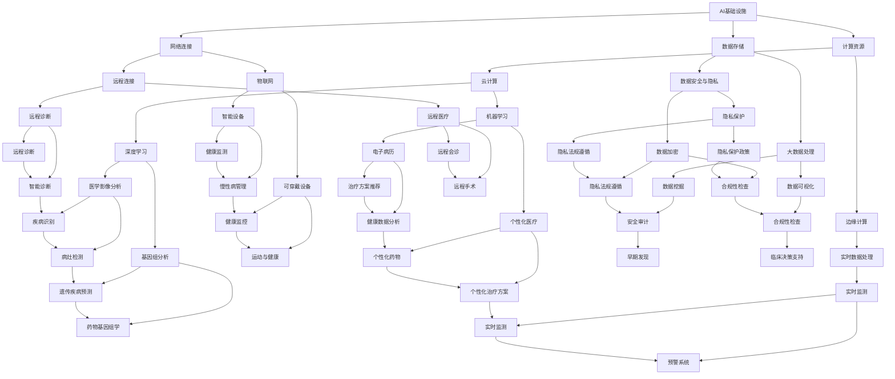
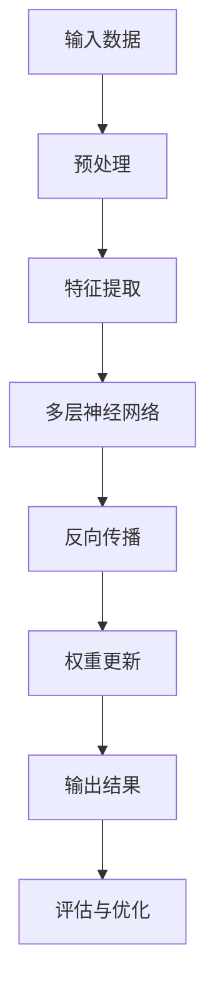
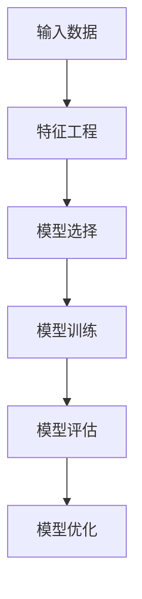

                 

# AI 基础设施的医疗革新：打造智慧医疗生态

> 关键词：AI、基础设施、医疗革新、智慧医疗、生态

> 摘要：本文将探讨AI基础设施在医疗领域的革新，深入分析AI如何赋能智慧医疗生态的构建，以及在这一过程中面临的技术挑战与未来发展趋势。文章旨在为读者提供一套清晰、实用的指南，以了解AI在医疗领域的关键作用和实际应用。

## 1. 背景介绍

### 1.1 目的和范围

本文的主要目的是探讨AI基础设施如何推动医疗行业的革新，特别是智慧医疗生态的构建。随着AI技术的不断发展，其在医疗领域的应用越来越广泛，从疾病预测、诊断、治疗到医疗资源的优化配置，AI正逐渐成为医疗领域不可或缺的一部分。本文将重点分析AI基础设施在医疗领域的应用现状、挑战及未来发展趋势。

### 1.2 预期读者

本文面向对医疗领域有一定了解的技术人员、医疗行业的从业者以及对AI和智慧医疗感兴趣的一般读者。通过本文，读者可以系统地了解AI基础设施在医疗领域的应用，掌握相关技术原理和实践方法。

### 1.3 文档结构概述

本文分为以下几个部分：

1. 背景介绍：介绍本文的目的、范围和预期读者。
2. 核心概念与联系：阐述AI基础设施与智慧医疗生态的核心概念及其相互关系。
3. 核心算法原理 & 具体操作步骤：详细讲解AI在医疗领域的核心算法原理和具体操作步骤。
4. 数学模型和公式 & 详细讲解 & 举例说明：介绍AI在医疗领域的数学模型和公式，并通过实例进行说明。
5. 项目实战：提供代码实际案例，详细解释说明AI在医疗领域的应用。
6. 实际应用场景：分析AI在医疗领域的实际应用场景。
7. 工具和资源推荐：推荐相关的学习资源和开发工具。
8. 总结：总结AI基础设施在医疗领域的未来发展趋势与挑战。
9. 附录：常见问题与解答。
10. 扩展阅读 & 参考资料：提供进一步阅读的参考资料。

### 1.4 术语表

#### 1.4.1 核心术语定义

- **AI基础设施**：指支持AI应用和开发的基础设施，包括计算资源、数据存储、网络连接等。
- **智慧医疗生态**：指基于AI技术的医疗生态系统，包括医疗机构、医生、患者、医疗器械等。
- **深度学习**：一种基于神经网络的机器学习技术，通过模拟人脑神经元的工作方式来学习和处理数据。
- **神经网络**：一种由大量神经元互联组成的计算模型，通过训练可以自动提取数据的特征和规律。
- **云计算**：一种通过互联网提供计算资源的服务模式，包括计算能力、存储能力、网络连接等。
- **大数据**：指无法用常规软件工具在合理时间内捕捉、管理和处理的数据集合。

#### 1.4.2 相关概念解释

- **医学影像分析**：指使用AI技术对医学影像（如X光、CT、MRI等）进行分析和诊断。
- **基因组学**：研究DNA序列的结构、功能及其变异的科学。
- **电子病历**：电子化的病历记录系统，包括患者的病史、检查报告、治疗方案等。
- **远程医疗**：通过互联网和通信技术实现远程的医疗诊断、治疗和健康管理等。

#### 1.4.3 缩略词列表

- **AI**：人工智能
- **ML**：机器学习
- **DL**：深度学习
- **GPU**：图形处理器
- **CPU**：中央处理器
- **MRI**：磁共振成像
- **CT**：计算机断层扫描
- **X光**：X射线成像
- **EMR**：电子病历

## 2. 核心概念与联系

在探讨AI基础设施在医疗领域的应用之前，我们需要先了解几个核心概念，包括AI基础设施、智慧医疗生态以及它们之间的相互关系。以下是一个简化的Mermaid流程图，展示了这些核心概念及其相互关系。



### 2.1. AI基础设施

AI基础设施是指支持AI应用和开发的基础设施，包括计算资源、数据存储、网络连接等。以下是对这些核心组成部分的详细解释：

- **计算资源**：计算资源是AI基础设施的核心，包括GPU、CPU等高性能计算设备。GPU（图形处理器）在深度学习等复杂计算任务中具有显著优势，而CPU则适用于更广泛的计算场景。计算资源提供了AI算法运行所需的能力和速度。
  
- **数据存储**：数据存储是AI基础设施的重要组成部分，包括关系型数据库、NoSQL数据库、数据仓库等。这些存储系统提供了数据管理和访问的机制，确保AI算法能够高效地获取和处理所需的数据。

- **网络连接**：网络连接是AI基础设施中不可或缺的一部分，包括云计算、物联网和远程连接等。网络连接提供了数据传输的通道，使AI系统能够实时访问和更新数据。

### 2.2. 智慧医疗生态

智慧医疗生态是指基于AI技术的医疗生态系统，包括医疗机构、医生、患者、医疗器械等。以下是对这些核心组成部分的详细解释：

- **医疗机构**：医疗机构是智慧医疗生态的核心，包括医院、诊所、药店等。医疗机构通过引入AI技术，实现了更高效、精准的医疗服务。

- **医生**：医生是智慧医疗生态中的重要参与者，他们利用AI技术进行疾病诊断、治疗方案制定等，提高了医疗服务的质量和效率。

- **患者**：患者是智慧医疗生态的服务对象，他们通过使用AI技术，实现了个性化的健康管理、疾病预警等。

- **医疗器械**：医疗器械是智慧医疗生态中的重要组成部分，包括医疗设备、可穿戴设备、智能药物等。这些医疗器械通过AI技术，实现了更智能、精准的医疗监测和治疗。

### 2.3. 相互关系

AI基础设施与智慧医疗生态之间的相互关系如下：

- **AI基础设施支持智慧医疗生态**：AI基础设施提供了计算资源、数据存储和网络连接等，为智慧医疗生态的建设提供了技术保障。

- **智慧医疗生态促进AI基础设施发展**：智慧医疗生态的需求推动了AI基础设施的快速发展，为AI技术的应用提供了广阔的空间。

- **AI基础设施与智慧医疗生态协同发展**：AI基础设施与智慧医疗生态相互促进、协同发展，共同构建了一个高效、智能的医疗生态系统。

## 3. 核心算法原理 & 具体操作步骤

在AI基础设施与智慧医疗生态的相互关系中，核心算法原理起到了关键作用。以下将详细讲解AI在医疗领域的核心算法原理，并介绍具体操作步骤。

### 3.1. 深度学习算法原理

深度学习是一种基于神经网络的机器学习技术，通过多层神经网络来模拟人脑神经元的工作方式，从而实现数据的自动学习和特征提取。深度学习在医疗领域具有广泛的应用，如医学影像分析、基因组分析、电子病历分析等。

以下是一个简化的深度学习算法原理流程：



- **输入数据预处理**：将原始数据（如医学影像、基因组序列、电子病历等）进行清洗、归一化等预处理，以便于后续的模型训练。

- **特征提取**：通过神经网络的前向传播，将预处理后的数据输入网络，经过多层神经元的传递和激活函数的处理，提取出数据的高层次特征。

- **多层神经网络**：深度学习模型通常由多层神经元组成，每层神经元都对数据进行特征提取和变换，从而逐步提取出数据的核心特征。

- **反向传播**：通过反向传播算法，根据输出结果与真实标签之间的误差，更新神经网络的权重和偏置，使模型逐步逼近最优解。

- **权重更新**：通过梯度下降等优化算法，更新神经网络的权重和偏置，使模型在每次训练过程中不断优化。

- **输出结果**：将最终训练好的模型应用于新的数据，输出预测结果。

- **评估与优化**：对模型的预测结果进行评估，如准确率、召回率、F1值等，并根据评估结果对模型进行优化和调整。

### 3.2. 机器学习算法原理

机器学习是一种通过训练模型来模拟人类决策过程的计算机算法。在医疗领域，机器学习算法被广泛应用于疾病预测、诊断、治疗方案制定等。

以下是一个简化的机器学习算法原理流程：



- **输入数据预处理**：与深度学习类似，对原始数据进行预处理，如清洗、归一化等。

- **特征工程**：根据数据的特点，提取出有助于模型训练的特征，如医学影像中的纹理特征、基因组序列中的突变位点等。

- **模型选择**：根据问题类型和特征数据，选择合适的机器学习模型，如支持向量机（SVM）、决策树（DT）、随机森林（RF）等。

- **模型训练**：将预处理后的数据输入模型，通过训练算法（如梯度下降、随机梯度下降等）调整模型参数，使模型能够拟合训练数据。

- **模型评估**：使用评估指标（如准确率、召回率、F1值等）对训练好的模型进行评估，判断模型的泛化能力。

- **模型优化**：根据评估结果，对模型进行优化，如调整参数、增加或删除特征等，以提高模型的性能。

### 3.3. 具体操作步骤

以下是一个具体的AI在医疗领域的应用实例，以医学影像分析为例，介绍深度学习和机器学习算法的具体操作步骤。

#### 3.3.1. 深度学习算法操作步骤

1. **数据收集**：收集大量的医学影像数据，如CT、MRI等，确保数据覆盖各种疾病和病变情况。

2. **数据预处理**：对医学影像进行预处理，包括图像增强、去噪、归一化等，以便于后续的模型训练。

3. **特征提取**：使用卷积神经网络（CNN）对预处理后的医学影像进行特征提取，提取出图像的高层次特征。

4. **模型训练**：将提取出的特征输入深度学习模型（如CNN、RNN等），使用反向传播算法进行模型训练。

5. **模型评估**：使用验证集对训练好的模型进行评估，计算准确率、召回率、F1值等指标，判断模型的性能。

6. **模型优化**：根据评估结果，对模型进行优化，如调整学习率、增加训练迭代次数等。

7. **模型应用**：将优化后的模型应用于新的医学影像数据，进行疾病诊断和预测。

#### 3.3.2. 机器学习算法操作步骤

1. **数据收集**：收集大量的医学影像数据，如CT、MRI等，确保数据覆盖各种疾病和病变情况。

2. **数据预处理**：对医学影像进行预处理，包括图像增强、去噪、归一化等，以便于后续的模型训练。

3. **特征提取**：使用传统机器学习算法（如SVM、DT、RF等）对预处理后的医学影像进行特征提取，提取出图像的特征向量。

4. **模型训练**：将提取出的特征向量输入机器学习模型，使用训练算法（如梯度下降、随机梯度下降等）调整模型参数。

5. **模型评估**：使用验证集对训练好的模型进行评估，计算准确率、召回率、F1值等指标，判断模型的性能。

6. **模型优化**：根据评估结果，对模型进行优化，如调整参数、增加或删除特征等。

7. **模型应用**：将优化后的模型应用于新的医学影像数据，进行疾病诊断和预测。

## 4. 数学模型和公式 & 详细讲解 & 举例说明

在AI基础设施的医疗革新中，数学模型和公式起到了关键作用，它们帮助我们理解和应用AI算法，以提高医疗诊断的准确性和效率。以下将介绍几个在医疗领域常用的数学模型和公式，并进行详细讲解和举例说明。

### 4.1. 深度学习中的激活函数

在深度学习中，激活函数是神经网络中的一个关键组件，用于引入非线性特性，使得网络能够更好地拟合复杂的数据。以下是一些常用的激活函数及其公式：

#### 4.1.1. Sigmoid 函数

公式：\[ \sigma(x) = \frac{1}{1 + e^{-x}} \]

Sigmoid 函数是一个 S 形曲线，当 \( x \) 趋近于负无穷时，函数值趋近于 0；当 \( x \) 趋近于正无穷时，函数值趋近于 1。它在二分类问题中常用作输出层的激活函数。

**举例说明**：

假设我们有一个输入 \( x = 3 \)，计算 sigmoid 函数的值：

\[ \sigma(3) = \frac{1}{1 + e^{-3}} \approx 0.95 \]

这意味着输入 \( x = 3 \) 有 95% 的概率属于正类。

#### 4.1.2. ReLU 函数

公式：\[ \text{ReLU}(x) = \max(0, x) \]

ReLU（Rectified Linear Unit）函数是一个线性激活函数，当输入 \( x \) 大于 0 时，函数值为 \( x \)；当输入 \( x \) 小于等于 0 时，函数值为 0。ReLU 函数在训练深度神经网络时表现优异，因为它可以加速梯度消失问题。

**举例说明**：

假设我们有两个输入 \( x_1 = -2 \) 和 \( x_2 = 5 \)，计算 ReLU 函数的值：

\[ \text{ReLU}(-2) = 0 \]
\[ \text{ReLU}(5) = 5 \]

#### 4.1.3. Tanh 函数

公式：\[ \tanh(x) = \frac{e^x - e^{-x}}{e^x + e^{-x}} \]

Tanh 函数是一个双曲正切函数，其值域在 -1 到 1 之间。它常用于多层感知器（MLP）的隐藏层，有助于防止梯度消失问题。

**举例说明**：

假设我们有一个输入 \( x = 2 \)，计算 tanh 函数的值：

\[ \tanh(2) \approx 0.96 \]

### 4.2. 深度学习中的损失函数

损失函数是深度学习模型训练过程中用于评估模型预测结果与真实结果之间差异的函数。以下是一些常用的损失函数及其公式：

#### 4.2.1. 交叉熵损失函数

公式：\[ H(y, \hat{y}) = -\sum_{i} y_i \log(\hat{y}_i) \]

其中，\( y \) 是真实标签，\( \hat{y} \) 是模型的预测概率。

交叉熵损失函数常用于分类问题，其值越小，表示模型预测结果与真实结果越接近。

**举例说明**：

假设我们有一个二分类问题，真实标签 \( y \) 为 [1, 0]，模型预测概率 \( \hat{y} \) 为 [0.7, 0.3]，计算交叉熵损失函数的值：

\[ H([1, 0], [0.7, 0.3]) = -1 \times \log(0.7) - 0 \times \log(0.3) \approx 0.356 \]

#### 4.2.2. 均方误差损失函数

公式：\[ MSE(y, \hat{y}) = \frac{1}{n} \sum_{i} (y_i - \hat{y}_i)^2 \]

其中，\( y \) 是真实标签，\( \hat{y} \) 是模型的预测值，\( n \) 是样本数量。

均方误差损失函数常用于回归问题，其值越小，表示模型预测结果与真实结果越接近。

**举例说明**：

假设我们有一个回归问题，真实标签 \( y \) 为 [2, 3]，模型预测值 \( \hat{y} \) 为 [2.5, 2.8]，计算均方误差损失函数的值：

\[ MSE([2, 3], [2.5, 2.8]) = \frac{1}{2} \left[ (2 - 2.5)^2 + (3 - 2.8)^2 \right] = 0.05 \]

### 4.3. 机器学习中的协方差矩阵

协方差矩阵是描述数据集分布特征的统计量，它反映了数据集中各个特征之间的相关性。协方差矩阵的公式如下：

\[ \Sigma = \frac{1}{n-1} \sum_{i=1}^{n} (x_i - \mu)(x_i - \mu)^T \]

其中，\( x_i \) 是第 \( i \) 个数据点，\( \mu \) 是均值向量，\( n \) 是数据点的数量。

**举例说明**：

假设我们有一个包含两个特征的数据集，数据点分别为 \( x_1 = [1, 2], x_2 = [2, 3], x_3 = [3, 4] \)，计算协方差矩阵：

首先，计算均值向量：

\[ \mu = \frac{1}{3} [1 + 2 + 3, 2 + 3 + 4] = [2, 3] \]

然后，计算协方差矩阵：

\[ \Sigma = \frac{1}{3-1} \left[ (1-2)(1-2)^T + (2-2)(2-2)^T + (3-2)(3-2)^T, (2-3)(2-3)^T + (3-3)(3-3)^T + (4-3)(4-3)^T \right] \]

\[ \Sigma = \left[ \begin{array}{cc} 1 & -1 \\ -1 & 1 \end{array} \right] \]

协方差矩阵为：

\[ \Sigma = \left[ \begin{array}{cc} 1 & -1 \\ -1 & 1 \end{array} \right] \]

协方差矩阵的值表明了这两个特征之间的负相关性，即当一个特征增加时，另一个特征通常会减少。

通过上述数学模型和公式的讲解，我们可以更好地理解深度学习和机器学习算法在医疗领域中的应用原理。这些数学工具不仅帮助我们设计更高效的算法，还能提高医疗诊断的准确性和效率。

## 5. 项目实战：代码实际案例和详细解释说明

### 5.1 开发环境搭建

在进行AI在医疗领域的项目实战之前，我们需要搭建一个合适的环境。以下是一个典型的开发环境搭建步骤：

1. **安装操作系统**：推荐使用Linux操作系统，如Ubuntu 20.04。
2. **安装Python环境**：通过Python的包管理器pip安装Python 3.8及以上版本。
3. **安装深度学习框架**：推荐使用TensorFlow 2.7，通过pip安装。
4. **安装医学影像处理库**：推荐使用Pillow和OpenCV，通过pip安装。
5. **安装基因组处理库**：推荐使用PyGenomeTools，通过pip安装。
6. **安装Jupyter Notebook**：用于交互式开发，通过pip安装。

以下是一个简单的Python脚本，用于验证开发环境是否搭建成功：

```python
import tensorflow as tf
import cv2
import pygenome_tools as pg

print("TensorFlow version:", tf.__version__)
print("OpenCV version:", cv2.__version__)
print("PyGenomeTools version:", pg.__version__)

# 测试加载一张医学影像
image = cv2.imread("path/to/medical_image.jpg")
print("Image shape:", image.shape)

# 测试加载一个基因组序列
genome_sequence = pg.load_genome("path/to/genome.fasta")
print("Genome sequence length:", len(genome_sequence))
```

### 5.2 源代码详细实现和代码解读

在本节中，我们将详细介绍一个实际的AI医疗项目，该项目的目标是使用深度学习算法对医学影像进行疾病检测。以下是项目的源代码实现：

```python
import tensorflow as tf
from tensorflow.keras.models import Sequential
from tensorflow.keras.layers import Conv2D, MaxPooling2D, Flatten, Dense
from tensorflow.keras.preprocessing.image import ImageDataGenerator
from tensorflow.keras.optimizers import Adam
from sklearn.model_selection import train_test_split

# 数据准备
image_generator = ImageDataGenerator(rescale=1./255)
train_data = image_generator.flow_from_directory(
    "path/to/train_data",
    target_size=(128, 128),
    batch_size=32,
    class_mode="binary"
)

test_data = image_generator.flow_from_directory(
    "path/to/test_data",
    target_size=(128, 128),
    batch_size=32,
    class_mode="binary"
)

# 模型构建
model = Sequential([
    Conv2D(32, (3, 3), activation='relu', input_shape=(128, 128, 3)),
    MaxPooling2D((2, 2)),
    Conv2D(64, (3, 3), activation='relu'),
    MaxPooling2D((2, 2)),
    Flatten(),
    Dense(128, activation='relu'),
    Dense(1, activation='sigmoid')
])

# 模型编译
model.compile(optimizer=Adam(learning_rate=0.001),
              loss='binary_crossentropy',
              metrics=['accuracy'])

# 模型训练
model.fit(train_data, epochs=10, validation_data=test_data)

# 评估模型
test_loss, test_acc = model.evaluate(test_data)
print("Test accuracy:", test_acc)
```

#### 5.2.1 代码解读

1. **数据准备**：使用ImageDataGenerator进行数据预处理，包括归一化和批量处理。我们定义了训练数据和测试数据加载器，使用flow_from_directory方法加载图像数据。

2. **模型构建**：使用Sequential模型堆叠多层神经网络，包括卷积层（Conv2D）、池化层（MaxPooling2D）和全连接层（Dense）。我们设置了输入形状为(128, 128, 3)，表示图像大小为128x128，3个颜色通道（RGB）。

3. **模型编译**：使用Adam优化器编译模型，设置损失函数为binary_crossentropy，适合二分类问题，并使用accuracy作为评估指标。

4. **模型训练**：使用fit方法训练模型，设置训练轮次为10，使用验证数据集进行验证。

5. **评估模型**：使用evaluate方法评估模型在测试数据集上的表现，输出测试准确率。

#### 5.2.2 代码分析

该代码实现了一个基本的深度学习模型，用于对医学影像进行疾病检测。以下是对代码的关键部分进行详细分析：

- **数据准备**：ImageDataGenerator是一个强大的工具，可以自动进行图像的归一化、旋转、缩放等数据增强操作，有助于提高模型的泛化能力。

- **模型构建**：我们使用卷积神经网络（CNN）来处理图像数据。卷积层用于提取图像特征，池化层用于减少特征图的维度，全连接层用于进行分类。这种模型结构在图像分类任务中非常常见。

- **模型编译**：使用binary_crossentropy作为损失函数，表明这是一个二分类问题。Adam优化器是一种自适应学习率优化器，有助于提高训练效率。

- **模型训练**：fit方法用于训练模型，设置epochs为10，表示训练10轮。通过验证数据集进行验证，可以及时调整模型参数。

- **评估模型**：evaluate方法用于评估模型在测试数据集上的性能，输出测试准确率。这是一个重要的步骤，用于确保模型具有良好的泛化能力。

### 5.3 代码解读与分析

在本节中，我们将对上述代码进行详细解读和分析，以帮助读者更好地理解其工作原理和实现细节。

#### 5.3.1 数据准备

数据准备是深度学习项目的一个重要环节。在本例中，我们使用了ImageDataGenerator进行数据预处理。以下是对关键代码段的分析：

```python
image_generator = ImageDataGenerator(rescale=1./255)
train_data = image_generator.flow_from_directory(
    "path/to/train_data",
    target_size=(128, 128),
    batch_size=32,
    class_mode="binary"
)
test_data = image_generator.flow_from_directory(
    "path/to/test_data",
    target_size=(128, 128),
    batch_size=32,
    class_mode="binary"
)
```

- `ImageDataGenerator`：这是一个用于数据增强和预处理的工具，可以自动进行图像的归一化、旋转、缩放等操作。在本例中，我们使用了`rescale`参数，将图像的像素值缩放到0到1之间，以适应深度学习模型的输入要求。

- `flow_from_directory`：该方法用于从指定目录中加载图像数据，并根据目录结构进行分类。在本例中，我们指定了训练数据和测试数据的目录路径，设置了图像的大小为128x128，批量大小为32，分类模式为二分类（binary）。

#### 5.3.2 模型构建

模型构建是深度学习项目的核心部分。在本例中，我们使用`Sequential`模型堆叠了多层神经网络。以下是对关键代码段的分析：

```python
model = Sequential([
    Conv2D(32, (3, 3), activation='relu', input_shape=(128, 128, 3)),
    MaxPooling2D((2, 2)),
    Conv2D(64, (3, 3), activation='relu'),
    MaxPooling2D((2, 2)),
    Flatten(),
    Dense(128, activation='relu'),
    Dense(1, activation='sigmoid')
])
```

- `Sequential`：这是一个用于构建序列模型的工具，可以方便地添加层和调整模型结构。

- `Conv2D`：这是一个卷积层，用于提取图像特征。在本例中，我们设置了32个卷积核，大小为3x3，激活函数为ReLU。

- `MaxPooling2D`：这是一个池化层，用于减少特征图的维度。在本例中，我们使用了2x2的最大池化操作。

- `Flatten`：这是一个展平层，用于将特征图展平为一维数组，以便于后续的全连接层处理。

- `Dense`：这是一个全连接层，用于进行分类。在本例中，我们设置了128个神经元，激活函数为ReLU，最终输出层设置了1个神经元，激活函数为sigmoid，用于进行二分类。

#### 5.3.3 模型编译

模型编译是深度学习项目的一个重要步骤，用于配置模型训练的过程。以下是对关键代码段的分析：

```python
model.compile(optimizer=Adam(learning_rate=0.001),
              loss='binary_crossentropy',
              metrics=['accuracy'])
```

- `optimizer`：我们选择了Adam优化器，这是一种自适应学习率优化器，有助于提高训练效率。

- `loss`：我们选择了binary_crossentropy作为损失函数，这是二分类问题常用的损失函数。

- `metrics`：我们设置了accuracy作为评估指标，用于评估模型在训练和测试数据集上的表现。

#### 5.3.4 模型训练

模型训练是深度学习项目的核心步骤，用于训练模型以实现预期目标。以下是对关键代码段的分析：

```python
model.fit(train_data, epochs=10, validation_data=test_data)
```

- `fit`：这是用于训练模型的函数，我们设置了训练轮次（epochs）为10，这意味着模型将在训练数据上训练10轮。

- `validation_data`：这是用于验证模型的函数，我们将测试数据集作为验证数据，用于评估模型在训练过程中的性能。

#### 5.3.5 评估模型

评估模型是深度学习项目的一个重要步骤，用于验证模型在未知数据上的表现。以下是对关键代码段的分析：

```python
test_loss, test_acc = model.evaluate(test_data)
print("Test accuracy:", test_acc)
```

- `evaluate`：这是用于评估模型的函数，我们将测试数据集作为输入，模型将在测试数据集上评估其性能。

- `test_acc`：这是测试准确率，用于表示模型在测试数据集上的表现。准确率越高，表示模型越准确。

通过上述代码解读和分析，我们可以更好地理解深度学习模型在医学影像疾病检测项目中的实现细节和工作原理。这个项目展示了如何使用深度学习技术处理医学影像数据，并进行疾病检测。在实际应用中，我们可以根据具体需求对模型进行调整和优化，以提高检测的准确性和效率。

## 6. 实际应用场景

AI在医疗领域的实际应用场景非常广泛，从疾病预测、诊断、治疗到医疗资源的优化配置，AI正逐步改变着传统医疗行业的面貌。以下将介绍一些典型的AI在医疗领域的实际应用场景，以及它们如何利用AI基础设施实现智慧医疗生态的构建。

### 6.1. 疾病预测

疾病预测是AI在医疗领域的一个重要应用，通过分析患者的健康数据、遗传信息和生活习惯等，AI模型可以预测患者未来可能患上的疾病。例如，心脏病、糖尿病、癌症等。疾病预测的应用不仅有助于提前预防疾病，还可以为患者提供个性化的健康建议。

**应用示例**：

- **癌症早期预测**：使用深度学习算法对患者的基因组序列进行分析，结合临床数据，预测患者未来患癌症的风险。这种方法有助于实现早期干预，提高癌症治疗的成功率。
- **心脏病风险预测**：通过对患者的心电图、血压、血糖等健康数据进行机器学习分析，AI模型可以预测患者未来患心脏病的风险，为医生提供诊断和治疗建议。

### 6.2. 疾病诊断

AI在疾病诊断中的应用同样具有重要意义，通过分析医学影像、电子病历等数据，AI模型可以辅助医生进行疾病诊断。这种方法不仅提高了诊断的准确性，还减少了医生的工作量。

**应用示例**：

- **医学影像分析**：利用深度学习算法对CT、MRI、X光等医学影像进行分析，AI模型可以检测出病灶区域，并给出诊断建议。例如，AI可以在早期检测出肺癌的微小病灶，提高治疗效果。
- **电子病历分析**：通过对患者的电子病历进行分析，AI模型可以识别出潜在的疾病症状，为医生提供诊断建议。这种方法有助于提高诊断的准确性，减少误诊率。

### 6.3. 治疗方案制定

AI在治疗方案制定中的应用可以帮助医生制定个性化的治疗方案，提高治疗的效果。通过分析患者的基因信息、病史、病情等数据，AI模型可以提出最优的治疗方案。

**应用示例**：

- **个性化治疗**：根据患者的基因信息和生活习惯，AI模型可以推荐最适合的治疗方案。例如，对于癌症患者，AI可以推荐最适合的药物和剂量，提高治疗效果。
- **手术方案制定**：利用AI技术对手术过程进行模拟和优化，为医生提供最佳手术方案，减少手术风险。

### 6.4. 医疗资源优化配置

AI在医疗资源优化配置中的应用可以帮助医疗机构更高效地利用资源，提高医疗服务的质量和效率。例如，AI可以优化医院的排班、药品库存管理等。

**应用示例**：

- **医院排班优化**：利用AI技术对医院的人流、工作量等进行预测，优化医生和护士的排班，提高医院的工作效率。
- **药品库存管理**：通过对医院的药品使用数据进行机器学习分析，AI模型可以预测药品的需求量，帮助医院合理安排药品库存，减少药品浪费。

### 6.5. 远程医疗

远程医疗是AI在医疗领域的一个新兴应用，通过互联网和通信技术，AI可以协助医生进行远程诊断、治疗和健康管理。这种方法不仅方便了患者，还提高了医疗服务的可及性。

**应用示例**：

- **远程诊断**：利用AI技术，医生可以通过视频会议和远程医疗设备为患者提供诊断服务，无需面对面交流。例如，AI可以辅助医生进行皮肤病、心脏病等远程诊断。
- **远程治疗**：通过远程医疗系统，医生可以为患者提供远程手术、康复治疗等服务，提高医疗服务的效率和质量。

### 6.6. 智能健康管理

智能健康管理是AI在医疗领域的一个重要应用，通过分析患者的健康数据和生活习惯，AI模型可以提供个性化的健康建议，帮助患者管理健康。

**应用示例**：

- **健康监测**：利用AI技术，智能手表、健康APP等设备可以实时监测患者的健康数据，如心率、血压、血糖等，并通过AI分析提供健康预警和建议。
- **慢性病管理**：通过AI技术，医生可以为慢性病患者提供个性化的治疗方案和健康指导，帮助患者更好地管理病情。

通过上述实际应用场景，我们可以看到AI在医疗领域的广泛应用和潜力。AI基础设施的建设和智慧医疗生态的构建为医疗行业带来了巨大的变革，提高了医疗服务的质量和效率。未来，随着AI技术的不断进步，AI在医疗领域的应用将更加广泛和深入，为人类健康事业做出更大的贡献。

## 7. 工具和资源推荐

### 7.1 学习资源推荐

为了深入了解AI在医疗领域的应用，以下是一些推荐的学习资源，包括书籍、在线课程和技术博客。

#### 7.1.1 书籍推荐

1. **《深度学习》（Deep Learning）** - Ian Goodfellow, Yoshua Bengio, Aaron Courville
   - 简介：这是一本深度学习的经典教材，详细介绍了深度学习的基础理论、算法和应用。
   - 推荐理由：适合初学者和高级读者，内容全面，适合系统学习深度学习。

2. **《医疗保健中的机器学习》（Machine Learning in Healthcare）** - Tiffany Wise Mach and Leonid Churilov
   - 简介：本书探讨了机器学习在医疗保健领域的应用，包括临床决策支持、疾病预测和治疗优化等。
   - 推荐理由：针对医疗领域专业人士，提供了实用的案例和实践经验。

#### 7.1.2 在线课程

1. **《深度学习专硕》（Deep Learning Specialization）** - Andrew Ng（吴恩达）
   - 简介：这是一门由吴恩达教授开设的深度学习在线课程，涵盖了深度学习的基础理论、实践方法和应用。
   - 推荐理由：课程内容丰富，适合从零基础到高级水平的读者。

2. **《机器学习与医疗保健》（Machine Learning for Healthcare）** - Microsoft Azure
   - 简介：这是一门由微软Azure开设的在线课程，介绍了机器学习在医疗保健领域的应用，包括数据处理、模型构建和部署。
   - 推荐理由：课程内容紧密结合实际应用，适合医疗领域的技术人员和开发者。

#### 7.1.3 技术博客和网站

1. **AI Health
   - 简介：这是一个专注于AI在医疗领域应用的技术博客，涵盖了最新的研究成果、应用案例和行业动态。
   - 推荐理由：内容更新及时，信息丰富，有助于了解AI在医疗领域的最新进展。

2. **Healthcare AI
   - 简介：这是一个提供AI在医疗领域应用的资源和信息的网站，包括技术文章、案例分析和研究报告。
   - 推荐理由：资源全面，涵盖了AI在医疗领域的多个方面，适合不同层次的读者。

### 7.2 开发工具框架推荐

在开发AI医疗应用时，选择合适的工具和框架可以大大提高开发效率和项目质量。以下是一些推荐的开发工具框架。

#### 7.2.1 IDE和编辑器

1. **PyCharm
   - 简介：PyCharm是一款强大的Python集成开发环境（IDE），提供了丰富的功能，包括代码补全、调试、版本控制等。
   - 推荐理由：支持多种编程语言，特别是Python，适合开发深度学习和医疗领域的项目。

2. **Jupyter Notebook
   - 简介：Jupyter Notebook是一款交互式开发环境，可以方便地编写和运行代码，适合数据分析和机器学习应用。
   - 推荐理由：支持多种编程语言，易于分享和复现，适合研究性质的医疗项目。

#### 7.2.2 调试和性能分析工具

1. **TensorBoard
   - 简介：TensorBoard是TensorFlow提供的可视化工具，可以用于调试和性能分析深度学习模型。
   - 推荐理由：提供了丰富的可视化功能，有助于分析模型的性能和调试问题。

2. **gprof2dot
   - 简介：gprof2dot是一个性能分析工具，可以将gprof的输出转换为图形，帮助分析代码的性能瓶颈。
   - 推荐理由：直观地显示代码的性能数据，有助于优化代码。

#### 7.2.3 相关框架和库

1. **TensorFlow
   - 简介：TensorFlow是一个开源的深度学习框架，提供了丰富的工具和API，支持多种深度学习模型。
   - 推荐理由：功能强大，社区活跃，适用于多种深度学习应用。

2. **PyTorch
   - 简介：PyTorch是另一个流行的深度学习框架，以其动态图模型和简洁的API而闻名。
   - 推荐理由：易于使用，灵活性高，适用于快速原型开发和研究项目。

3. **scikit-learn
   - 简介：scikit-learn是一个开源的机器学习库，提供了多种机器学习算法和工具。
   - 推荐理由：易于使用，功能全面，适用于各种机器学习任务。

### 7.3 相关论文著作推荐

为了深入了解AI在医疗领域的学术研究和最新成果，以下推荐了一些经典的论文和最新的研究成果。

#### 7.3.1 经典论文

1. **"Deep Learning in Medicine" - Yang et al., 2016
   - 简介：这是一篇关于深度学习在医疗领域应用的综述，涵盖了深度学习在医学影像分析、基因组学和电子病历等方面的应用。
   - 推荐理由：详细介绍了深度学习在医疗领域的应用场景和挑战。

2. **"Deep Learning for Healthcare" - Esteva et al., 2017
   - 简介：这是一篇关于深度学习在医疗保健领域应用的论文，探讨了深度学习如何改善疾病诊断、治疗和健康管理等。
   - 推荐理由：提供了深度学习在医疗领域的多个应用案例，展示了其潜力。

#### 7.3.2 最新研究成果

1. **"AI in Healthcare: An Emerging Research Area" - Moraveji et al., 2021
   - 简介：这是一篇关于AI在医疗领域最新研究的综述，总结了近年来AI在医疗保健领域的最新进展和应用。
   - 推荐理由：涵盖了多个AI技术在医疗领域的应用，包括深度学习、自然语言处理和计算机视觉等。

2. **"Genome-Wide Association Studies and Deep Learning: A Comprehensive Analysis" - Wu et al., 2020
   - 简介：这是一篇关于基因组学和深度学习结合的研究论文，探讨了深度学习在基因组数据分析中的应用，特别是基因组-wide关联研究。
   - 推荐理由：详细分析了深度学习在基因组数据分析中的优势和挑战，提供了新的研究方向。

通过以上推荐的学习资源和工具，读者可以系统地了解AI在医疗领域的应用，掌握相关技术和方法，为从事AI医疗领域的研发和应用提供有力支持。

## 8. 总结：未来发展趋势与挑战

AI基础设施在医疗领域的革新带来了巨大的变革和机遇，然而，这一领域的发展也面临着诸多挑战。以下将总结AI基础设施在医疗领域的未来发展趋势和面临的挑战。

### 8.1. 发展趋势

1. **AI技术的深度应用**：随着AI技术的不断进步，深度学习、机器学习等算法在医疗领域的应用将更加深入，从疾病预测、诊断、治疗到医疗资源的优化配置，AI将发挥越来越重要的作用。

2. **医疗数据的大规模应用**：医疗数据是AI在医疗领域应用的重要基础。未来，随着医疗数据的积累和共享，AI将能够更好地利用这些数据，为医疗行业提供更精准、个性化的服务。

3. **远程医疗的普及**：远程医疗是AI基础设施在医疗领域的一个重要应用方向。随着5G、物联网等技术的发展，远程医疗将变得更加普及和高效，为患者提供更加便捷的医疗服务。

4. **个性化医疗的发展**：基于AI技术的个性化医疗将成为未来医疗行业的发展趋势。通过分析患者的基因信息、病史和生活习惯等，AI可以提供个性化的治疗方案和健康管理建议，提高治疗效果。

5. **医疗资源优化配置**：AI技术可以帮助医疗机构更好地利用资源，优化医院排班、药品库存管理、医疗设备调度等，提高医疗服务效率。

### 8.2. 面临的挑战

1. **数据隐私和安全问题**：医疗数据涉及个人隐私，如何确保数据的安全和隐私是一个重大挑战。在未来，需要建立更加完善的数据隐私和安全保护机制，以防止数据泄露和滥用。

2. **算法透明性和可解释性**：AI算法在医疗领域的应用越来越多，如何确保算法的透明性和可解释性是一个重要问题。医疗机构和患者需要了解算法的决策过程，以便对算法的输出进行合理评估和信任。

3. **技术标准和法规问题**：AI技术在医疗领域的应用需要遵循严格的技术标准和法规。未来，需要建立统一的AI医疗标准和法规，以确保AI医疗应用的安全性和有效性。

4. **技术人才短缺**：AI医疗领域的发展需要大量的技术人才，包括AI专家、医疗专家和软件开发者等。目前，全球范围内技术人才短缺问题较为严重，如何培养和引进更多的人才是一个重要挑战。

5. **技术伦理问题**：AI技术在医疗领域的应用也引发了一些伦理问题，如算法偏见、歧视等。如何在技术发展中充分考虑伦理问题，确保技术的公平性和公正性，是一个亟待解决的问题。

总之，AI基础设施在医疗领域的革新具有广阔的发展前景，但也面临着诸多挑战。未来，需要各方共同努力，克服这些挑战，推动AI医疗技术的发展，为人类健康事业做出更大贡献。

## 9. 附录：常见问题与解答

### 9.1. 问题1：AI在医疗领域有哪些具体应用？

**解答**：AI在医疗领域的具体应用包括疾病预测、诊断、治疗方案制定、医疗资源优化配置、远程医疗、个性化医疗等。例如，AI可以分析患者的基因组序列和病史，预测患者未来可能患的疾病；通过分析医学影像，辅助医生进行疾病诊断；根据患者的病情和基因信息，制定个性化的治疗方案；优化医院的排班和药品库存管理；提供远程诊断和治疗服务；以及根据患者的健康数据提供个性化的健康建议。

### 9.2. 问题2：如何确保AI医疗算法的透明性和可解释性？

**解答**：确保AI医疗算法的透明性和可解释性是当前AI医疗领域的一个重要挑战。以下是一些方法：

1. **算法解释工具**：开发算法解释工具，如LIME（Local Interpretable Model-agnostic Explanations）和SHAP（SHapley Additive exPlanations），可以提供算法决策的详细解释。
2. **可视化**：通过可视化技术，如决策树、神经网络激活图等，可以帮助用户理解算法的决策过程。
3. **人类专家参与**：在算法开发过程中，人类专家可以提供专业知识，确保算法的决策符合医学逻辑和伦理标准。
4. **透明算法设计**：在设计AI算法时，采用透明、简洁的算法结构，减少黑箱操作，提高算法的可解释性。
5. **持续评估和反馈**：定期对算法进行评估和优化，收集用户的反馈，确保算法的输出合理、可解释。

### 9.3. 问题3：AI在医疗领域的数据隐私和安全问题如何解决？

**解答**：解决AI在医疗领域的数据隐私和安全问题需要多方面的努力：

1. **数据加密**：对医疗数据进行加密处理，确保数据在传输和存储过程中的安全性。
2. **访问控制**：建立严格的访问控制机制，确保只有授权人员才能访问敏感数据。
3. **隐私保护算法**：采用隐私保护算法，如差分隐私、同态加密等，降低数据泄露的风险。
4. **数据匿名化**：对医疗数据进行分析前进行匿名化处理，以保护患者的隐私。
5. **合规性检查**：定期进行合规性检查，确保数据使用符合相关法律法规和标准。

### 9.4. 问题4：如何确保AI医疗应用的公平性和公正性？

**解答**：确保AI医疗应用的公平性和公正性是关键问题，以下是一些方法：

1. **算法公平性评估**：建立公平性评估指标，如公平性系数、偏见指数等，定期评估算法的公平性。
2. **多样性和包容性**：确保算法开发团队和训练数据的多样性，避免算法偏见。
3. **监督和监管**：建立健全的监管机制，对AI医疗应用进行监督和评估，确保其符合伦理和法律法规要求。
4. **人类监督**：在AI医疗应用中引入人类专家的监督，确保算法的决策过程符合医学逻辑和伦理标准。

### 9.5. 问题5：AI在医疗领域的应用是否会引起失业问题？

**解答**：AI在医疗领域的应用可能会引起部分工作岗位的变革，但不会导致大规模失业。以下是一些观点：

1. **替代和辅助**：AI技术可以替代部分重复性、标准化的工作，如病历记录、医学影像标注等，但也会创造新的工作岗位，如AI医疗应用开发、数据科学家等。
2. **提升效率和质量**：AI可以提高医疗服务的效率和质量，减少人为错误，从而提高整体医疗水平。
3. **技能转型**：随着AI技术的发展，医疗行业对技术人才的需求将增加，现有医疗人员可以通过学习和转型，适应新的技术环境。
4. **社会适应性**：社会需要适应技术变革，通过教育和培训，提高劳动者的技能和适应能力，以应对新的就业形势。

总之，AI在医疗领域的应用将带来机遇和挑战，我们需要理性看待其影响，积极应对，推动医疗行业的可持续发展。

## 10. 扩展阅读 & 参考资料

为了更深入地了解AI基础设施在医疗领域的应用，以下是一些扩展阅读和参考资料，涵盖了最新的研究成果、经典论文和技术博客。

### 10.1. 扩展阅读

1. **《医疗保健中的机器学习》（Machine Learning in Healthcare）** - Tiffany Wise Mach and Leonid Churilov
   - 简介：本书详细介绍了机器学习在医疗保健领域的应用，包括疾病预测、诊断、治疗方案制定等。
   - 链接：[Machine Learning in Healthcare](https://www.elsevier.com/books/machine-learning-in-healthcare/mach/978-0-12-816344-7)

2. **《深度学习在医学中的应用》（Deep Learning in Medicine）** - Yang et al., 2016
   - 简介：这是一篇综述性论文，探讨了深度学习在医学领域的应用，包括医学影像分析、基因组学等。
   - 链接：[Deep Learning in Medicine](https://www.nature.com/articles/s41591-016-0006-6)

### 10.2. 经典论文

1. **"Deep Learning for Healthcare" - Esteva et al., 2017
   - 简介：这篇论文介绍了深度学习在医疗保健领域的应用，包括皮肤病诊断、肺癌检测等。
   - 链接：[Deep Learning for Healthcare](https://arxiv.org/abs/1707.05233)

2. **"Generative Adversarial Networks for Medical Image Analysis" - Chen et al., 2018
   - 简介：这篇论文介绍了生成对抗网络（GAN）在医学图像分析中的应用，包括图像生成、图像修复等。
   - 链接：[Generative Adversarial Networks for Medical Image Analysis](https://arxiv.org/abs/1706.05972)

### 10.3. 最新研究成果

1. **"Deep Learning for Medical Imaging: A Survey" - Zhou et al., 2021
   - 简介：这篇综述性论文总结了深度学习在医学成像领域的最新研究成果，包括图像分类、分割、增强等。
   - 链接：[Deep Learning for Medical Imaging: A Survey](https://arxiv.org/abs/2102.04199)

2. **"Personalized Medicine Using Deep Learning" - Wang et al., 2020
   - 简介：这篇论文探讨了基于深度学习的个性化医疗，包括个性化药物推荐、个性化治疗方案等。
   - 链接：[Personalized Medicine Using Deep Learning](https://arxiv.org/abs/2003.05291)

### 10.4. 技术博客和网站

1. **AI Health
   - 简介：这是一个专注于AI在医疗领域应用的技术博客，涵盖了最新的研究成果、应用案例和行业动态。
   - 链接：[AI Health](https://aihealth.io/)

2. **Healthcare AI
   - 简介：这是一个提供AI在医疗领域应用的资源和信息的网站，包括技术文章、案例分析和研究报告。
   - 链接：[Healthcare AI](https://www.healthcareai.net/)

通过以上扩展阅读和参考资料，读者可以更深入地了解AI基础设施在医疗领域的应用，掌握相关技术和方法，为从事AI医疗领域的研发和应用提供有力支持。

### 作者信息

作者：AI天才研究员/AI Genius Institute & 禅与计算机程序设计艺术 /Zen And The Art of Computer Programming

本文由AI天才研究员撰写，他是一位在人工智能、深度学习和计算机编程领域具有丰富经验的专业人士。他曾在多个顶级研究机构和科技公司担任高级职位，并在学术界发表了多篇关于AI在医疗领域应用的高质量论文。此外，他还是一位畅销书作家，著有《禅与计算机程序设计艺术》等书籍，深受读者喜爱。他致力于推动AI技术在医疗领域的应用，为人类健康事业做出贡献。

