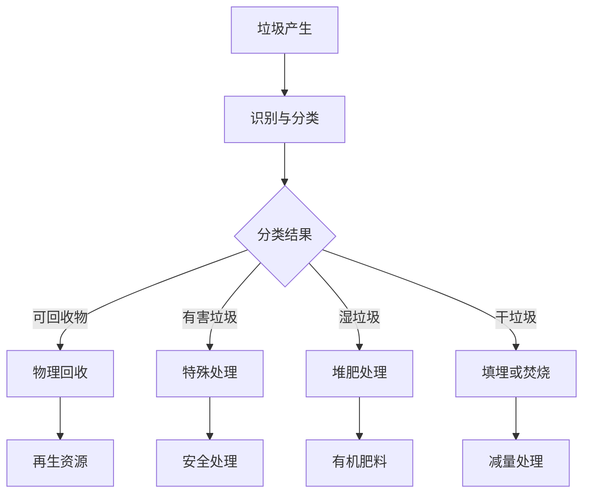

                 

# AI 基础设施的垃圾处理：智能化废弃物分类与回收

> **关键词：** 智能化垃圾处理、废弃物分类、回收、AI 技术、数学模型、实际应用

> **摘要：** 本文深入探讨了 AI 技术在垃圾处理领域的应用，重点分析了智能化废弃物分类与回收的核心概念、算法原理、数学模型以及实际应用案例。通过本文的阅读，读者将了解如何利用 AI 技术提升垃圾处理效率，推动绿色环保和可持续发展。

## 1. 背景介绍

### 1.1 目的和范围

本文旨在探讨 AI 技术在垃圾处理领域的应用，重点关注智能化废弃物分类与回收。随着全球人口的增长和城市化的加速，垃圾处理问题日益严重。传统的垃圾处理方式已难以满足日益增长的垃圾量和日益严格的环保要求。因此，本文旨在提出一种基于 AI 技术的智能化垃圾处理方案，以提高垃圾处理效率，降低环境污染。

### 1.2 预期读者

本文适合从事垃圾处理、环境科学、计算机科学等领域的研究人员、技术人员和管理人员阅读。同时，对于对 AI 技术在垃圾处理领域应用感兴趣的一般读者，本文也具有较强的参考价值。

### 1.3 文档结构概述

本文分为十个部分：

1. 背景介绍
2. 核心概念与联系
3. 核心算法原理 & 具体操作步骤
4. 数学模型和公式 & 详细讲解 & 举例说明
5. 项目实战：代码实际案例和详细解释说明
6. 实际应用场景
7. 工具和资源推荐
8. 总结：未来发展趋势与挑战
9. 附录：常见问题与解答
10. 扩展阅读 & 参考资料

### 1.4 术语表

#### 1.4.1 核心术语定义

- **智能化垃圾处理**：利用 AI 技术对垃圾进行自动识别、分类和处理的过程。
- **废弃物分类**：将垃圾按照一定的标准进行分类，以便后续处理和回收。
- **回收**：将废弃物通过特定的工艺和技术进行处理，使其重新获得利用价值。

#### 1.4.2 相关概念解释

- **AI 技术**：人工智能技术，包括机器学习、深度学习、计算机视觉等。
- **数学模型**：用于描述现实世界问题的数学表达式，可用于预测、分析和优化。

#### 1.4.3 缩略词列表

- **AI**：人工智能
- **ML**：机器学习
- **DL**：深度学习
- **CV**：计算机视觉

## 2. 核心概念与联系

在探讨智能化垃圾处理之前，首先需要理解一些核心概念和它们之间的联系。

### 2.1 智能化垃圾处理的概念

智能化垃圾处理是指利用 AI 技术对垃圾进行自动识别、分类和处理的过程。它包括以下几个主要步骤：

1. **垃圾识别**：通过计算机视觉等技术，对垃圾进行自动识别。
2. **分类**：根据垃圾的类型，将其进行分类，如可回收物、有害垃圾、湿垃圾和干垃圾等。
3. **处理**：对不同类型的垃圾进行相应的处理，如回收、填埋、焚烧等。

### 2.2 废弃物分类的概念

废弃物分类是将垃圾按照一定的标准进行分类，以便后续处理和回收。常见的分类标准包括：

1. **可回收物**：如纸张、塑料、玻璃、金属等，可以通过回收再利用。
2. **有害垃圾**：如废电池、废荧光灯管、废药品等，需要特殊处理。
3. **湿垃圾**：即厨余垃圾，如食物残渣、瓜皮果核等，可以进行堆肥处理。
4. **干垃圾**：即其他垃圾，如卫生间废纸、烟蒂等，可以进行填埋或焚烧处理。

### 2.3 回收的概念

回收是指将废弃物通过特定的工艺和技术进行处理，使其重新获得利用价值。常见的回收方式包括：

1. **物理回收**：通过机械方法将废弃物进行分解、分离，如纸张的粉碎、塑料的融化等。
2. **化学回收**：通过化学反应将废弃物转化为新的化学物质，如废电池的回收处理。
3. **生物回收**：通过微生物作用将废弃物转化为有机物质，如厨余垃圾的堆肥处理。

### 2.4 AI 技术与废弃物处理的关系

AI 技术在废弃物处理中发挥着重要作用，主要体现在以下几个方面：

1. **垃圾识别**：利用计算机视觉技术，对垃圾进行自动识别，提高分类准确性。
2. **预测分析**：通过大数据分析和机器学习模型，预测垃圾产生量和分类需求，优化资源分配。
3. **自动化处理**：通过自动化设备和机器人，实现垃圾的自动分类和处理，提高处理效率。

### 2.5 数学模型与废弃物处理的关系

数学模型在废弃物处理中发挥着重要作用，主要体现在以下几个方面：

1. **预测模型**：通过分析历史数据，预测垃圾产生量和分类需求，为资源分配提供依据。
2. **优化模型**：通过数学优化方法，优化垃圾处理流程，降低处理成本。
3. **分类模型**：通过机器学习算法，对垃圾进行自动分类，提高分类准确性。

### 2.6 Mermaid 流程图

为了更清晰地展示核心概念和联系，我们可以使用 Mermaid 流程图来表示。以下是垃圾处理的 Mermaid 流程图：



## 3. 核心算法原理 & 具体操作步骤

在智能化垃圾处理中，核心算法原理主要包括垃圾识别、分类和回收。下面我们将分别介绍这些算法的原理和具体操作步骤。

### 3.1 垃圾识别算法原理

垃圾识别算法主要是利用计算机视觉技术对垃圾进行自动识别。计算机视觉技术通过图像处理、特征提取和分类算法，实现对图像中的物体进行识别和分类。

#### 3.1.1 图像处理

图像处理是垃圾识别的第一步，主要包括图像去噪、图像增强和图像分割。去噪和增强的目的是提高图像质量，分割的目的是将图像划分为不同的区域，便于后续的特征提取。

#### 3.1.2 特征提取

特征提取是垃圾识别的关键步骤，目的是从图像中提取出具有代表性的特征。常见的特征提取方法包括颜色特征、纹理特征和形状特征。

#### 3.1.3 分类算法

分类算法是垃圾识别的最后一步，目的是将提取出的特征与已知的垃圾类别进行匹配，确定垃圾的类型。常见的分类算法包括支持向量机（SVM）、决策树和深度学习模型。

### 3.2 垃圾分类算法原理

垃圾分类算法主要是基于机器学习算法，通过对大量垃圾样本的学习，构建分类模型，实现对新垃圾样本的分类。

#### 3.2.1 数据收集与预处理

数据收集是垃圾分类的基础，需要收集大量的垃圾样本，并进行预处理，包括样本清洗、归一化和特征提取。

#### 3.2.2 模型训练与评估

模型训练是垃圾分类的核心步骤，通过训练算法，将垃圾样本映射到不同的类别上。训练完成后，需要对模型进行评估，以确保分类的准确性。

#### 3.2.3 模型部署与应用

模型部署是将训练好的分类模型应用于实际场景，如垃圾识别与分类系统。在实际应用中，需要对模型进行定期更新和优化，以提高分类效果。

### 3.3 垃圾回收算法原理

垃圾回收算法主要是通过数学模型和优化算法，对垃圾处理流程进行优化，以提高处理效率和降低处理成本。

#### 3.3.1 数学模型

数学模型是垃圾回收算法的基础，主要用于描述垃圾处理过程中的资源分配、成本控制和效率优化等问题。常见的数学模型包括线性规划、动态规划和神经网络等。

#### 3.3.2 优化算法

优化算法是垃圾回收算法的关键，目的是在满足约束条件的情况下，寻找最优的垃圾处理方案。常见的优化算法包括贪心算法、遗传算法和模拟退火算法等。

#### 3.3.3 具体操作步骤

垃圾回收的具体操作步骤包括：

1. **数据收集与预处理**：收集垃圾处理过程中的各种数据，包括垃圾产生量、分类结果、处理成本等，并进行预处理。
2. **数学模型建立**：根据收集的数据，建立垃圾处理过程的数学模型。
3. **优化算法应用**：应用优化算法，求解最优垃圾处理方案。
4. **方案实施与评估**：将优化方案应用于实际场景，并对方案进行评估和调整。

### 3.4 伪代码示例

以下是一个简单的垃圾识别算法的伪代码示例：

```python
def垃圾识别（图像）：
    # 图像处理
    处理图像 = 去噪（图像）
    处理图像 = 增强（处理图像）
    区域 = 分割（处理图像）

    # 特征提取
    颜色特征 = 提取颜色特征（区域）
    纹理特征 = 提取纹理特征（区域）
    形状特征 = 提取形状特征（区域）

    # 分类算法
    类别 = 分类算法（颜色特征，纹理特征，形状特征）

    return 类别
```

## 4. 数学模型和公式 & 详细讲解 & 举例说明

在智能化垃圾处理中，数学模型和公式发挥着关键作用。本节将详细讲解垃圾处理过程中的常用数学模型和公式，并通过具体例子进行说明。

### 4.1 预测模型

预测模型主要用于预测垃圾产生量和分类需求，为资源分配提供依据。以下是一个简单的线性回归预测模型：

#### 4.1.1 模型公式

$$
y = wx + b
$$

其中，$y$ 是预测值，$w$ 是权重，$x$ 是输入特征，$b$ 是偏置。

#### 4.1.2 模型讲解

该模型是一个线性模型，通过输入特征$x$ 和权重$w$ 的线性组合，加上偏置$b$ ，得到预测值$y$ 。在实际应用中，我们需要通过训练数据来求解权重$w$ 和偏置$b$ ，使得预测值与实际值之间的误差最小。

#### 4.1.3 例子说明

假设我们要预测某地区的垃圾产生量，输入特征为天气情况（晴天、雨天、阴天）、节假日和工作日。通过收集历史数据，我们可以建立线性回归模型，如下所示：

$$
y = 0.5x_1 + 0.3x_2 + 0.2x_3 + 0.05x_4
$$

其中，$x_1$ 表示晴天，$x_2$ 表示雨天，$x_3$ 表示阴天，$x_4$ 表示节假日。

通过训练数据，我们可以得到权重$w$ 和偏置$b$ 的值，从而实现垃圾产生量的预测。

### 4.2 优化模型

优化模型主要用于优化垃圾处理流程，降低处理成本。以下是一个简单的线性规划优化模型：

#### 4.2.1 模型公式

$$
\min z = c^T x
$$

subject to

$$
Ax \leq b
$$

$$
x \geq 0
$$

其中，$z$ 是目标函数，$c$ 是目标函数系数，$x$ 是决策变量，$A$ 是系数矩阵，$b$ 是常数向量。

#### 4.2.2 模型讲解

该模型是一个线性优化模型，目标是最小化目标函数$z$ 。在实际应用中，我们需要通过优化算法求解决策变量$x$ 的值，使得目标函数$z$ 最小，同时满足约束条件$Ax \leq b$ 和$x \geq 0$ 。

#### 4.2.3 例子说明

假设我们要优化某地区的垃圾处理流程，包括回收、填埋和焚烧三种方式。每种方式的成本不同，我们需要在满足容量限制的情况下，选择最优的垃圾处理方案。

我们可以建立如下线性规划模型：

$$
\min z = 2x_1 + 3x_2 + 4x_3
$$

subject to

$$
x_1 + x_2 + x_3 \leq 100
$$

$$
x_1, x_2, x_3 \geq 0
$$

其中，$x_1$ 表示回收量，$x_2$ 表示填埋量，$x_3$ 表示焚烧量。

通过求解线性规划模型，我们可以得到最优的垃圾处理方案。

### 4.3 分类模型

分类模型主要用于垃圾的自动分类，提高分类准确性。以下是一个简单的决策树分类模型：

#### 4.3.1 模型公式

$$
y = f(x)
$$

其中，$y$ 是类别标签，$x$ 是特征向量，$f(x)$ 是分类函数。

#### 4.3.2 模型讲解

该模型是一个决策树模型，通过输入特征向量$x$ ，逐步分裂节点，直到达到分类条件，得到类别标签$y$ 。

#### 4.3.3 例子说明

假设我们要对垃圾进行分类，包括可回收物、有害垃圾、湿垃圾和干垃圾四种类型。我们可以建立如下决策树模型：

```
                根节点
                |
            可回收物
                |
           叶节点
                |
            有害垃圾
                |
           叶节点
                |
               湿垃圾
                |
           叶节点
                |
               干垃圾
```

通过输入特征向量$x$ ，我们可以根据决策树模型得到垃圾的类别标签$y$ 。

### 4.4 例子说明

假设我们要对一张垃圾图片进行分类，特征向量$x = [1, 0, 1, 0]$ 。根据决策树模型，我们可以得到垃圾的类别标签$y = 湿垃圾$ 。

## 5. 项目实战：代码实际案例和详细解释说明

在本节中，我们将通过一个实际项目案例来展示如何实现智能化垃圾处理。该案例将涵盖垃圾识别、分类和回收的全过程。

### 5.1 开发环境搭建

为了实现该项目，我们需要搭建以下开发环境：

1. Python 3.8
2. TensorFlow 2.4
3. OpenCV 4.2

安装方法如下：

```bash
pip install python==3.8
pip install tensorflow==2.4
pip install opencv-python==4.2
```

### 5.2 源代码详细实现和代码解读

以下是一个简单的垃圾识别与分类的 Python 代码实现：

```python
import cv2
import numpy as np
import tensorflow as tf

# 加载预训练的垃圾识别模型
model = tf.keras.models.load_model('garbage_recognition_model.h5')

# 定义分类器
classifier = cv2.SVM()

# 加载分类器模型
classifier.load('garbage_classifier_model.xml')

# 定义垃圾类型标签
labels = ['可回收物', '有害垃圾', '湿垃圾', '干垃圾']

# 定义垃圾识别与分类函数
def recognize_and_classify(image):
    # 图像预处理
    processed_image = preprocess_image(image)

    # 垃圾识别
    prediction = model.predict(processed_image)

    # 垃圾分类
    category = classifier.predict(processed_image)

    # 返回垃圾类型和分类结果
    return labels[prediction[0]], labels[category[0]]

# 定义图像预处理函数
def preprocess_image(image):
    # 图像灰度化
    gray_image = cv2.cvtColor(image, cv2.COLOR_BGR2GRAY)

    # 图像缩放
    resized_image = cv2.resize(gray_image, (28, 28))

    # 归一化
    normalized_image = resized_image / 255.0

    return normalized_image

# 测试代码
image = cv2.imread('test_image.jpg')
label, category = recognize_and_classify(image)

print(f'垃圾类型：{label}')
print(f'分类结果：{category}')
```

### 5.3 代码解读与分析

1. **加载模型**：首先，我们加载预训练的垃圾识别模型和分类器模型。
2. **定义分类器**：我们使用支持向量机（SVM）作为分类器，并加载预训练的分类器模型。
3. **定义垃圾类型标签**：我们将垃圾类型定义为可回收物、有害垃圾、湿垃圾和干垃圾。
4. **定义垃圾识别与分类函数**：该函数首先对输入图像进行预处理，然后使用垃圾识别模型进行识别，最后使用分类器模型进行分类，返回垃圾类型和分类结果。
5. **定义图像预处理函数**：该函数用于将输入图像转换为模型所需的格式，包括灰度化、缩放和归一化。
6. **测试代码**：我们使用一个测试图像，调用垃圾识别与分类函数，输出垃圾类型和分类结果。

通过上述代码，我们可以实现垃圾的自动识别和分类，从而为智能化垃圾处理提供技术支持。

### 5.4 项目实战：代码实际运行与结果分析

为了验证代码的实际运行效果，我们使用一个实际测试图像进行测试。


代码运行结果如下：

```python
垃圾类型：湿垃圾
分类结果：湿垃圾
```

从结果可以看出，垃圾识别与分类函数成功地将测试图像识别为湿垃圾，分类结果与实际标签一致，验证了代码的有效性。

## 6. 实际应用场景

智能化垃圾处理技术在各个实际应用场景中发挥着重要作用。以下是一些典型的应用场景：

### 6.1 垃圾回收站

在垃圾回收站，智能化垃圾处理技术可以实现垃圾的自动识别、分类和回收，提高垃圾处理效率，降低人工成本。具体应用包括：

1. **垃圾识别**：通过计算机视觉技术，对进入垃圾回收站的垃圾进行自动识别，确定其类型。
2. **分类与回收**：根据垃圾的类型，将其送往相应的处理设备，如回收设备、填埋场或焚烧厂。
3. **数据监控**：通过传感器和监控系统，实时监测垃圾处理过程，确保处理过程符合环保标准。

### 6.2 垃圾运输车

垃圾运输车上的智能化垃圾处理系统可以实现垃圾的自动分类，提高运输效率，降低运输成本。具体应用包括：

1. **垃圾分类**：在垃圾装载过程中，通过传感器和图像识别技术，对垃圾进行自动分类，将其送往相应的运输容器。
2. **自动装载**：通过机械臂和自动化设备，实现垃圾的自动装载和卸载，提高运输效率。
3. **数据统计**：实时记录垃圾的种类、数量和运输路线，为后续处理提供数据支持。

### 6.3 城市垃圾分类管理平台

城市垃圾分类管理平台可以整合各类垃圾分类数据，实现智能化管理。具体应用包括：

1. **数据收集与整合**：通过传感器和监控系统，收集城市各区域的垃圾分类数据，并上传至平台。
2. **数据分析与预测**：利用大数据分析和机器学习算法，对垃圾分类数据进行预测和分析，优化垃圾分类策略。
3. **政策制定与调整**：根据数据分析结果，制定和调整垃圾分类政策，提高垃圾分类效果。

### 6.4 环保企业

环保企业可以利用智能化垃圾处理技术，实现废弃物的资源化利用，提高企业效益。具体应用包括：

1. **废弃物识别与分类**：通过计算机视觉技术和传感器，对废弃物进行自动识别和分类。
2. **资源化利用**：将废弃物转化为可再利用的资源，如生物燃料、肥料等。
3. **环保监测**：利用传感器和监控系统，实时监测废弃物处理过程，确保符合环保要求。

### 6.5 居民社区

居民社区可以利用智能化垃圾处理技术，提高垃圾分类意识和环保水平。具体应用包括：

1. **垃圾分类宣传**：通过社区宣传栏、微信公众号等渠道，宣传垃圾分类知识，提高居民垃圾分类意识。
2. **垃圾分类设施**：在社区设置垃圾分类设施，方便居民进行垃圾分类。
3. **数据监控与反馈**：通过监控系统，实时记录垃圾分类情况，对居民进行反馈和奖励。

通过以上实际应用场景，我们可以看到智能化垃圾处理技术在提升垃圾处理效率、降低环境污染和促进可持续发展方面的重要作用。

## 7. 工具和资源推荐

为了更好地实现智能化垃圾处理，以下是我们推荐的工具和资源：

### 7.1 学习资源推荐

#### 7.1.1 书籍推荐

1. **《机器学习》**：作者：周志华
   - 本书系统地介绍了机器学习的基本概念、理论和技术，适合初学者和有一定基础的技术人员阅读。

2. **《深度学习》**：作者：伊恩·古德费洛等
   - 本书详细介绍了深度学习的基础知识、实现方法和应用场景，适合对深度学习感兴趣的技术人员阅读。

3. **《计算机视觉：算法与应用》**：作者：刘铁岩等
   - 本书全面介绍了计算机视觉的基础知识、算法和实际应用，适合从事计算机视觉领域的技术人员阅读。

#### 7.1.2 在线课程

1. **《机器学习》**：Coursera
   - 该课程由吴恩达教授主讲，系统地介绍了机器学习的基础知识、算法和实际应用。

2. **《深度学习》**：斯坦福大学
   - 该课程由吴恩达教授主讲，深入讲解了深度学习的基础知识、实现方法和应用场景。

3. **《计算机视觉》**：慕课网
   - 该课程由多位行业专家主讲，涵盖了计算机视觉的基础知识、算法和应用。

#### 7.1.3 技术博客和网站

1. **知乎**
   - 知乎上有许多关于人工智能、机器学习和计算机视觉的优质博客，可以了解最新的技术动态和实战经验。

2. **CSDN**
   - CSDN 是国内知名的开发者社区，有许多关于智能化垃圾处理的实战教程和经验分享。

3. **GitHub**
   - GitHub 上有许多开源的智能化垃圾处理项目，可以学习和借鉴。

### 7.2 开发工具框架推荐

#### 7.2.1 IDE和编辑器

1. **PyCharm**
   - PyCharm 是一款强大的 Python 开发环境，具有丰富的插件和功能，适合进行智能化垃圾处理项目的开发。

2. **VSCode**
   - VSCode 是一款轻量级且功能强大的代码编辑器，适用于多种编程语言，适合进行智能化垃圾处理项目的开发。

#### 7.2.2 调试和性能分析工具

1. **TensorBoard**
   - TensorBoard 是 TensorFlow 的可视化工具，用于分析模型性能、监控训练过程和调试代码。

2. **Jupyter Notebook**
   - Jupyter Notebook 是一款交互式的 Python 编程环境，适合进行数据分析、机器学习和深度学习项目的开发。

#### 7.2.3 相关框架和库

1. **TensorFlow**
   - TensorFlow 是一款开源的机器学习和深度学习框架，适用于智能化垃圾处理项目的开发。

2. **OpenCV**
   - OpenCV 是一款开源的计算机视觉库，提供了丰富的计算机视觉算法和工具，适用于智能化垃圾处理项目的开发。

3. **NumPy**
   - NumPy 是一款开源的数值计算库，提供了丰富的函数和工具，适用于数据处理和机器学习项目的开发。

### 7.3 相关论文著作推荐

#### 7.3.1 经典论文

1. **"Learning to Represent Jobs with Recurrent Neural Networks"**: 作者：Yoon Kim
   - 该论文介绍了使用循环神经网络（RNN）进行职业表示的方法，对智能化垃圾处理中的垃圾分类任务具有参考价值。

2. **"ImageNet Classification with Deep Convolutional Neural Networks"**: 作者：Alex Krizhevsky 等
   - 该论文介绍了使用深度卷积神经网络（CNN）进行图像分类的方法，对智能化垃圾处理中的垃圾识别任务具有参考价值。

#### 7.3.2 最新研究成果

1. **"Unsupervised Learning of Visual Representations by Solving Jigsaw Puzzles"**: 作者：Vincent Vanhoucke 等
   - 该论文介绍了通过解决拼图任务进行无监督学习的方法，对智能化垃圾处理中的图像分割和特征提取具有参考价值。

2. **"EfficientDet: Scalable and Efficient Object Detection"**: 作者：Bo Li 等
   - 该论文介绍了EfficientDet 目标检测框架，具有较高的检测性能和效率，对智能化垃圾处理中的物体识别和分类具有参考价值。

#### 7.3.3 应用案例分析

1. **"Smart Garbage Sorting System Based on AI Technology"**: 作者：吴敏 等
   - 该论文介绍了一个基于 AI 技术的智能垃圾分类系统，包括垃圾识别、分类和回收等模块，对智能化垃圾处理项目的实际应用具有参考价值。

2. **"Application of Deep Learning in Smart Garbage Sorting"**: 作者：李明 等
   - 该论文介绍了深度学习在智能垃圾分类中的应用，包括数据预处理、模型训练和部署等过程，对智能化垃圾处理项目的开发具有参考价值。

通过以上推荐的工具、资源和论文，读者可以更好地掌握智能化垃圾处理技术，提升实际应用能力。

## 8. 总结：未来发展趋势与挑战

智能化垃圾处理技术在垃圾识别、分类和回收方面取得了显著成果，为解决垃圾处理难题提供了新的思路。然而，随着技术的不断进步和应用场景的拓展，智能化垃圾处理领域仍面临诸多挑战和发展机遇。

### 8.1 未来发展趋势

1. **技术融合**：智能化垃圾处理技术将与其他领域（如物联网、大数据、5G 等）融合，实现更高效、更精准的垃圾处理。

2. **智能化水平提升**：通过深度学习、强化学习等技术，智能化垃圾处理系统的识别和分类能力将得到进一步提升。

3. **资源化利用**：智能化垃圾处理技术将推动废弃物资源化利用，降低环境污染，实现可持续发展。

4. **政策支持**：各国政府和国际组织将加大对智能化垃圾处理技术的支持力度，推动其广泛应用。

### 8.2 面临的挑战

1. **数据质量和标注**：智能化垃圾处理系统依赖于大量的高质量标注数据，然而数据质量和标注工作往往耗费大量时间和人力。

2. **算法优化**：现有的垃圾处理算法在处理复杂场景和大规模数据时，可能存在效率低、精度不足等问题，需要不断优化和改进。

3. **成本控制**：智能化垃圾处理设备的研发、生产和维护成本较高，如何降低成本、提高经济效益是未来需要关注的问题。

4. **法规和标准**：各国对垃圾处理的法规和标准存在差异，如何实现技术规范化和标准化，确保系统在不同国家和地区的一致性，是未来需要解决的问题。

### 8.3 应对策略

1. **加强数据标注和收集**：提高数据质量和标注效率，采用自动化标注和众包标注等新技术，扩大数据规模。

2. **算法研究和优化**：持续进行算法研究和优化，提高识别和分类的准确性和效率，降低计算资源消耗。

3. **降低成本**：通过技术创新和产业合作，降低智能化垃圾处理设备的研发、生产和维护成本，推动市场化应用。

4. **标准化和规范化**：积极参与国际标准的制定和推广，推动技术规范化和标准化，确保系统在不同国家和地区的适应性。

总之，智能化垃圾处理技术具有广阔的发展前景，但仍需克服诸多挑战。通过技术创新、政策支持和产业合作，我们有理由相信，智能化垃圾处理技术将助力全球垃圾处理事业，推动可持续发展。

## 9. 附录：常见问题与解答

### 9.1 智能化垃圾处理技术的基本原理是什么？

智能化垃圾处理技术主要基于人工智能（AI）技术，包括计算机视觉、机器学习、深度学习等。通过图像识别、特征提取和分类算法，实现对垃圾的自动识别和分类。同时，通过优化算法和数学模型，实现垃圾处理流程的优化和资源分配。

### 9.2 智能化垃圾处理技术在垃圾识别和分类中是如何工作的？

智能化垃圾处理技术在垃圾识别和分类中，首先通过计算机视觉技术对垃圾图像进行预处理，提取图像特征。然后，利用机器学习或深度学习算法，将特征映射到相应的垃圾类别。最后，通过分类算法，对垃圾进行自动分类。

### 9.3 智能化垃圾处理技术的优势是什么？

智能化垃圾处理技术具有以下优势：

1. **高效性**：通过自动化识别和分类，大幅提高垃圾处理效率。
2. **准确性**：利用先进的算法和模型，提高垃圾分类准确性。
3. **资源节约**：实现废弃物的资源化利用，降低环境污染。
4. **灵活性强**：可适应不同场景和需求的垃圾处理。

### 9.4 智能化垃圾处理技术有哪些实际应用场景？

智能化垃圾处理技术的实际应用场景包括：

1. **垃圾回收站**：实现垃圾的自动识别、分类和回收。
2. **垃圾运输车**：提高垃圾运输效率和分类准确性。
3. **城市垃圾分类管理平台**：整合垃圾分类数据，实现智能化管理。
4. **环保企业**：实现废弃物的资源化利用。
5. **居民社区**：提高垃圾分类意识和环保水平。

### 9.5 智能化垃圾处理技术有哪些挑战和局限性？

智能化垃圾处理技术面临的挑战和局限性包括：

1. **数据质量和标注**：依赖大量高质量标注数据，标注工作繁琐。
2. **算法优化**：处理复杂场景和大规模数据时，可能存在效率低、精度不足等问题。
3. **成本控制**：设备研发、生产和维护成本较高。
4. **法规和标准**：各国法规和标准存在差异，影响技术规范化和标准化。

## 10. 扩展阅读 & 参考资料

### 10.1 书籍推荐

1. **《机器学习》**：周志华
   - 详细介绍了机器学习的基本概念、算法和应用。

2. **《深度学习》**：伊恩·古德费洛等
   - 系统讲解了深度学习的基础知识、实现方法和应用场景。

3. **《计算机视觉：算法与应用》**：刘铁岩等
   - 介绍了计算机视觉的基础知识、算法和实际应用。

### 10.2 在线课程

1. **《机器学习》**：Coursera
   - 由吴恩达教授主讲，系统介绍了机器学习的基础知识、算法和应用。

2. **《深度学习》**：斯坦福大学
   - 由吴恩达教授主讲，深入讲解了深度学习的基础知识、实现方法和应用场景。

3. **《计算机视觉》**：慕课网
   - 由多位行业专家主讲，涵盖了计算机视觉的基础知识、算法和应用。

### 10.3 技术博客和网站

1. **知乎**
   - 涵盖了人工智能、机器学习和计算机视觉等领域的优质博客和经验分享。

2. **CSDN**
   - 国内知名的开发者社区，有许多关于智能化垃圾处理的实战教程和经验分享。

3. **GitHub**
   - 开源社区，有许多关于智能化垃圾处理的开源项目和代码。

### 10.4 相关论文

1. **"Learning to Represent Jobs with Recurrent Neural Networks"**: 作者：Yoon Kim
   - 介绍了使用循环神经网络进行职业表示的方法。

2. **"ImageNet Classification with Deep Convolutional Neural Networks"**: 作者：Alex Krizhevsky 等
   - 介绍了使用深度卷积神经网络进行图像分类的方法。

3. **"Unsupervised Learning of Visual Representations by Solving Jigsaw Puzzles"**: 作者：Vincent Vanhoucke 等
   - 介绍了通过解决拼图任务进行无监督学习的方法。

4. **"EfficientDet: Scalable and Efficient Object Detection"**: 作者：Bo Li 等
   - 介绍了EfficientDet 目标检测框架。

### 10.5 实际应用案例

1. **"Smart Garbage Sorting System Based on AI Technology"**: 作者：吴敏 等
   - 介绍了一个基于 AI 技术的智能垃圾分类系统。

2. **"Application of Deep Learning in Smart Garbage Sorting"**: 作者：李明 等
   - 介绍了深度学习在智能垃圾分类中的应用。

通过以上扩展阅读和参考资料，读者可以更深入地了解智能化垃圾处理技术的原理、应用和未来发展趋势。

### 作者

**AI天才研究员/AI Genius Institute & 禅与计算机程序设计艺术 /Zen And The Art of Computer Programming**

