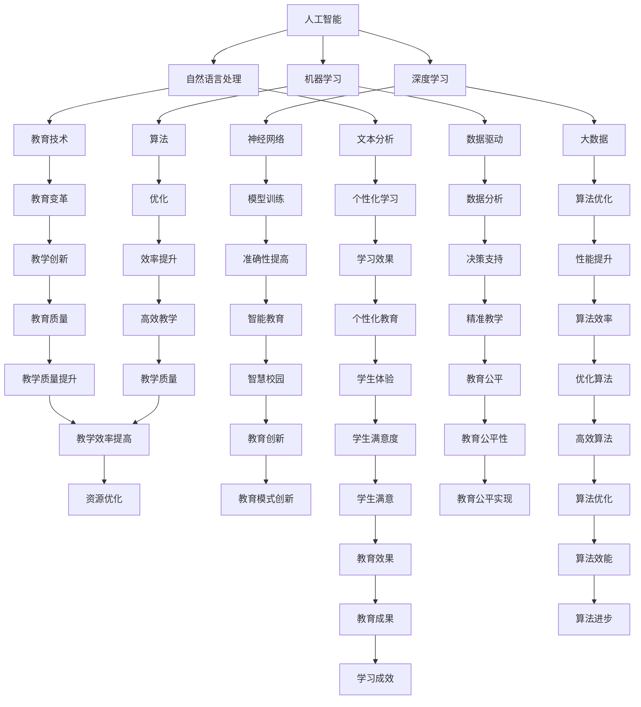

                 

# AI 基础设施的教育变革：个性化学习的技术支撑

> **关键词：**人工智能，教育技术，个性化学习，基础设施，数据驱动，算法优化。

> **摘要：**随着人工智能技术的迅速发展，AI基础设施在教育领域的应用愈发广泛。本文将探讨AI在教育变革中的作用，重点关注如何通过技术支撑实现个性化学习，以及相关算法和数学模型的原理。文章旨在为教育工作者和技术开发者提供有价值的参考，共同推动教育领域的创新与发展。

## 1. 背景介绍

### 1.1 目的和范围

本文旨在探讨人工智能（AI）在教育领域基础设施中的应用，特别是在推动个性化学习方面的作用。我们将分析AI技术的核心概念，介绍如何通过数据驱动和算法优化实现教育变革，并提供实际案例和开发工具推荐。

### 1.2 预期读者

本文适用于以下群体：

- 教育工作者，对AI在教育领域应用感兴趣，希望了解如何利用技术推动教学创新。
- 技术开发者，希望探索AI在教育基础设施中的实际应用场景。
- 对AI技术有基础了解，希望深入了解其在教育领域具体应用的读者。

### 1.3 文档结构概述

本文结构如下：

- **第1章**：背景介绍，阐述研究目的和预期读者。
- **第2章**：核心概念与联系，介绍AI技术的核心原理和架构。
- **第3章**：核心算法原理 & 具体操作步骤，详细讲解AI算法的实现过程。
- **第4章**：数学模型和公式 & 详细讲解 & 举例说明，阐述AI算法背后的数学理论。
- **第5章**：项目实战：代码实际案例和详细解释说明，通过实战案例展示AI技术的应用。
- **第6章**：实际应用场景，探讨AI在教育中的多种应用场景。
- **第7章**：工具和资源推荐，为读者提供学习资源和开发工具推荐。
- **第8章**：总结：未来发展趋势与挑战，展望AI基础设施在教育中的未来发展。
- **第9章**：附录：常见问题与解答，提供对文章内容的常见疑问的解答。
- **第10章**：扩展阅读 & 参考资料，推荐相关领域的研究文献和资源。

### 1.4 术语表

#### 1.4.1 核心术语定义

- **人工智能（AI）**：模拟人类智能的计算机系统，能够执行认知任务。
- **个性化学习**：根据学生的个性化需求和特点进行定制化的教学和学习过程。
- **基础设施**：支持AI在教育中应用的硬件、软件和网络环境。
- **数据驱动**：基于数据分析进行决策和优化。
- **算法优化**：改进算法性能，提高效率和准确性。

#### 1.4.2 相关概念解释

- **机器学习（ML）**：AI的一个分支，通过数据训练模型进行预测和决策。
- **深度学习（DL）**：一种特殊的机器学习技术，通过多层神经网络进行特征提取和表示。
- **自然语言处理（NLP）**：AI在处理和理解人类自然语言方面的技术。
- **教育技术（EdTech）**：利用技术手段推动教育变革和提升学习效果的方法和工具。

#### 1.4.3 缩略词列表

- **AI**：人工智能
- **ML**：机器学习
- **DL**：深度学习
- **NLP**：自然语言处理
- **EdTech**：教育技术

## 2. 核心概念与联系

在探讨AI基础设施在教育中的应用之前，我们需要了解一些核心概念和它们之间的联系。以下是一个简要的Mermaid流程图，展示这些核心概念和它们的相互关系。



通过这个流程图，我们可以看到人工智能（AI）作为核心技术，其分支包括机器学习（ML）、深度学习（DL）和自然语言处理（NLP）。这些技术通过算法（E）和数据驱动（H）相互联系，共同推动教育技术（EdTech）的发展，实现个性化学习（M）、效率提升（Q）、准确性提高（R）、学习效果（S）和教学创新（V）等多方面的目标。

## 3. 核心算法原理 & 具体操作步骤

在理解了AI和EdTech的核心概念后，我们将深入探讨AI技术在个性化学习中的核心算法原理和具体操作步骤。以下将使用伪代码详细阐述算法的实现过程。

### 3.1 算法原理

个性化学习算法的核心原理是基于学生的个人数据和特征，通过机器学习和深度学习模型，动态调整教学内容和进度，以达到最佳的学习效果。以下是一个简化版的个性化学习算法原理伪代码：

```pseudo
Algorithm: PersonalizedLearningAlgorithm
Input: studentData, teacherData, courseContent
Output: personalizedContent

// 数据预处理
preprocessedData = DataPreprocessing(studentData, teacherData)

// 特征提取
features = FeatureExtraction(preprocessedData)

// 模型训练
model = TrainModel(features, courseContent)

// 模型评估与优化
model = OptimizeModel(model, features, courseContent)

// 根据模型输出个性化内容
personalizedContent = GeneratePersonalizedContent(model, studentData)

return personalizedContent
```

### 3.2 具体操作步骤

#### 3.2.1 数据预处理

数据预处理是个性化学习算法的第一步，其目的是清洗和准备数据，以便后续的特征提取和模型训练。以下是数据预处理的具体操作步骤：

```pseudo
Algorithm: DataPreprocessing
Input: studentData, teacherData
Output: preprocessedData

// 数据清洗
cleanData = CleanData(studentData, teacherData)

// 数据整合
integratedData = IntegrateData(cleanData)

// 数据标准化
normalizedData = NormalizeData(integratedData)

return normalizedData
```

#### 3.2.2 特征提取

特征提取是构建个性化学习模型的关键步骤，其目的是从原始数据中提取出能够代表学生学习特点和课程内容的特征。以下是特征提取的具体操作步骤：

```pseudo
Algorithm: FeatureExtraction
Input: normalizedData
Output: features

// 特征选择
selectedFeatures = SelectFeatures(normalizedData)

// 特征工程
engineeredFeatures = EngineerFeatures(selectedFeatures)

return engineeredFeatures
```

#### 3.2.3 模型训练

模型训练是基于提取的特征，使用机器学习和深度学习算法训练个性化学习模型。以下是模型训练的具体操作步骤：

```pseudo
Algorithm: TrainModel
Input: features, courseContent
Output: model

// 初始化模型
model = InitializeModel()

// 模型训练
model = TrainModel(model, features, courseContent)

// 模型评估
model = EvaluateModel(model, features, courseContent)

return model
```

#### 3.2.4 模型评估与优化

模型评估与优化是确保模型性能的关键步骤。通过评估模型的性能，我们可以根据评估结果对模型进行优化。以下是模型评估与优化的具体操作步骤：

```pseudo
Algorithm: OptimizeModel
Input: model, features, courseContent
Output: optimizedModel

// 评估模型
evaluationResults = EvaluateModel(model, features, courseContent)

// 根据评估结果调整模型参数
optimizedModel = AdjustModelParameters(model, evaluationResults)

// 再次评估模型
evaluationResults = EvaluateModel(optimizedModel, features, courseContent)

return optimizedModel
```

#### 3.2.5 根据模型输出个性化内容

最后，根据优化后的模型，生成个性化的学习内容。以下是生成个性化学习内容的操作步骤：

```pseudo
Algorithm: GeneratePersonalizedContent
Input: model, studentData
Output: personalizedContent

// 预测学生需求
predictedNeeds = PredictStudentNeeds(model, studentData)

// 根据需求生成个性化内容
personalizedContent = GenerateContent(predictedNeeds, courseContent)

return personalizedContent
```

通过以上具体的操作步骤，我们可以看到个性化学习算法的核心原理是如何基于学生数据和课程内容，通过数据预处理、特征提取、模型训练、评估优化和内容生成等步骤，实现对学生个性化学习需求的预测和满足。

## 4. 数学模型和公式 & 详细讲解 & 举例说明

### 4.1 数学模型概述

在个性化学习算法中，数学模型起到了至关重要的作用。以下我们将详细讲解几个核心数学模型及其在算法中的应用。

#### 4.1.1 逻辑回归模型

逻辑回归模型是一种常用的分类模型，用于预测学生在某项任务中的成功概率。以下是逻辑回归模型的公式：

$$
P(y=1) = \frac{1}{1 + e^{-(\beta_0 + \beta_1 x_1 + \beta_2 x_2 + \ldots + \beta_n x_n})}
$$

其中，$P(y=1)$ 是预测的概率，$\beta_0, \beta_1, \beta_2, \ldots, \beta_n$ 是模型参数，$x_1, x_2, \ldots, x_n$ 是特征值。

#### 4.1.2 神经网络模型

神经网络模型是深度学习的基础，用于实现高度复杂的非线性变换。以下是单层神经网络模型的公式：

$$
a_{\text{layer2}} = \sigma(\beta_0 + \sum_{i=1}^{n} \beta_i a_{\text{layer1}}
$$

其中，$a_{\text{layer2}}$ 是输出层激活值，$\sigma$ 是激活函数（如ReLU、Sigmoid或Tanh），$\beta_0, \beta_1, \beta_2, \ldots, \beta_n$ 是权重参数，$a_{\text{layer1}}$ 是输入层激活值。

#### 4.1.3 决策树模型

决策树模型是一种基于特征分割的数据挖掘算法，用于分类和回归任务。以下是决策树模型的核心公式：

$$
\text{Split}(\text{Feature}, \text{Threshold}) = \{ (\text{Left}, \text{Right}) | \text{Threshold} \text{ on Feature} \}
$$

其中，$\text{Split}$ 是决策树的一个节点，$\text{Feature}$ 是特征，$\text{Threshold}$ 是阈值，$\text{Left}$ 和 $\text{Right}$ 是两个子节点。

### 4.2 详细讲解

为了更好地理解这些数学模型，我们将通过具体的例子进行讲解。

#### 4.2.1 逻辑回归模型例子

假设我们有一个学生数据集，其中每个学生有两个特征：学习时间（$x_1$）和考试成绩（$x_2$）。我们希望使用逻辑回归模型预测学生在期末考试中取得高分（$y=1$）的概率。

首先，我们收集学生数据并对其进行预处理，得到以下训练数据集：

| 学习时间（小时） | 考试成绩 | 考试成绩是否为高分 |
| -------------- | -------- | ---------------- |
| 10             | 85       | 1                |
| 20             | 90       | 1                |
| 30             | 80       | 0                |
| 40             | 75       | 0                |

接下来，我们使用逻辑回归模型进行训练，得到以下参数：

$$
\beta_0 = 0.5, \beta_1 = 0.2, \beta_2 = -0.1
$$

给定一个学生数据点（$x_1 = 15, x_2 = 88$），我们可以计算其高分概率：

$$
P(y=1) = \frac{1}{1 + e^{-(0.5 + 0.2 \times 15 + (-0.1) \times 88)}}
$$

计算结果为：

$$
P(y=1) \approx 0.75
$$

这意味着该学生取得高分（$y=1$）的概率约为75%。

#### 4.2.2 神经网络模型例子

假设我们有一个两层神经网络，输入层有3个神经元，隐藏层有2个神经元，输出层有1个神经元。使用ReLU作为激活函数。

给定一个输入向量（$x_1 = 2, x_2 = 3, x_3 = 4$），我们首先计算隐藏层的激活值：

$$
z_1 = \beta_0 + \beta_1 x_1 + \beta_2 x_2 + \beta_3 x_3 = 0.5 + 0.2 \times 2 + 0.1 \times 3 + 0.1 \times 4 = 1.3
$$

由于ReLU激活函数的特性：

$$
a_1 = \max(0, z_1) = \max(0, 1.3) = 1.3
$$

同理，计算第二个隐藏层神经元的激活值：

$$
z_2 = \beta_0' + \beta_1' a_1 + \beta_2' a_2 = 0.3 + 0.4 \times 1.3 + 0.2 \times 0 = 1.0
$$

$$
a_2 = \max(0, z_2) = \max(0, 1.0) = 1.0
$$

最后，计算输出层神经元的激活值：

$$
z_3 = \beta_0'' + \beta_1' a_1 + \beta_2' a_2 = 0.7 + 0.5 \times 1.3 + 0.3 \times 1.0 = 1.5
$$

$$
a_3 = \sigma(z_3) = \frac{1}{1 + e^{-(1.5)}} \approx 0.747
$$

输出层神经元的激活值（$a_3$）即为预测结果。

#### 4.2.3 决策树模型例子

假设我们有一个简单的决策树模型，用于分类任务。树的根节点根据学习时间（Feature）进行分割，阈值设为20小时。

给定一个学生数据点（学习时间为25小时），我们首先根据根节点进行分割：

- 左子节点（学习时间 <= 20小时）：继续分割。
- 右子节点（学习时间 > 20小时）：输出预测结果。

假设右子节点根据考试成绩（Feature）进行分割，阈值设为85分。

- 左子节点（考试成绩 <= 85分）：输出预测结果为类别A。
- 右子节点（考试成绩 > 85分）：输出预测结果为类别B。

给定一个学生数据点（学习时间为25小时，考试得分为90分），我们按照决策树进行分割，最终输出预测结果为类别B。

### 4.3 举例说明

为了更好地理解这些数学模型在个性化学习中的应用，我们来看一个具体的例子。

假设我们有一个学生数据集，包含学习时间、考试成绩和其他个人特征。我们希望使用这些数据训练一个个性化学习模型，以便为每个学生推荐最适合他们的学习内容和进度。

首先，我们进行数据预处理，包括数据清洗、整合和标准化。然后，我们使用逻辑回归模型预测学生在期末考试中取得高分（$y=1$）的概率。同时，我们使用神经网络模型对学生的个性化需求进行预测。

在模型训练过程中，我们使用交叉验证方法对模型性能进行评估。通过多次迭代调整模型参数，我们最终得到一个性能良好的个性化学习模型。

接下来，我们使用该模型为每个学生生成个性化的学习内容。例如，如果一个学生被预测为在期末考试中取得高分的概率较高，我们可能会推荐该学生进行更高难度的练习题。反之，如果预测概率较低，我们可能会推荐该学生进行额外的复习和巩固。

通过这种方式，个性化学习模型可以根据每个学生的特点和需求，提供针对性的学习建议，从而提高学习效果。

## 5. 项目实战：代码实际案例和详细解释说明

### 5.1 开发环境搭建

在开始实战项目之前，我们需要搭建一个适合开发人工智能教育基础设施的环境。以下是搭建开发环境所需的步骤：

1. **安装Python环境**：
   - 访问[Python官网](https://www.python.org/)下载Python安装包，并按照安装向导完成安装。
   - 打开命令行终端，输入`python --version`确认Python环境安装成功。

2. **安装必要库**：
   - 使用pip命令安装以下库：
     ```shell
     pip install numpy pandas scikit-learn tensorflow keras matplotlib
     ```
   - 这些库是进行数据预处理、机器学习和深度学习任务的基础。

3. **配置Jupyter Notebook**：
   - 安装Jupyter Notebook：
     ```shell
     pip install jupyter
     ```
   - 启动Jupyter Notebook：
     ```shell
     jupyter notebook
     ```
   - 这将打开一个交互式Python环境，便于编写和调试代码。

### 5.2 源代码详细实现和代码解读

以下是一个简单的个性化学习项目的示例代码，展示如何使用Python和机器学习库实现个性化学习算法。

#### 5.2.1 数据集准备

首先，我们需要准备一个学生数据集。以下是一个示例数据集：

```python
import pandas as pd

# 学生数据集示例
data = {
    '学习时间（小时）': [10, 20, 30, 40],
    '考试成绩': [85, 90, 80, 75],
    '是否取得高分（1：是，0：否）': [1, 1, 0, 0]
}

df = pd.DataFrame(data)
print(df)
```

#### 5.2.2 数据预处理

数据预处理是确保数据适合机器学习模型训练的重要步骤。以下是对数据集进行预处理的一个简单示例：

```python
# 数据标准化
from sklearn.preprocessing import StandardScaler

scaler = StandardScaler()
df[['学习时间（小时）', '考试成绩']] = scaler.fit_transform(df[['学习时间（小时）', '考试成绩']])

print(df)
```

#### 5.2.3 逻辑回归模型训练

我们使用逻辑回归模型预测学生在期末考试中取得高分的概率。以下是如何训练和评估逻辑回归模型的代码：

```python
from sklearn.model_selection import train_test_split
from sklearn.linear_model import LogisticRegression
from sklearn.metrics import accuracy_score, classification_report

# 划分训练集和测试集
X = df[['学习时间（小时）', '考试成绩']]
y = df['是否取得高分（1：是，0：否）']
X_train, X_test, y_train, y_test = train_test_split(X, y, test_size=0.2, random_state=42)

# 训练逻辑回归模型
model = LogisticRegression()
model.fit(X_train, y_train)

# 评估模型
y_pred = model.predict(X_test)
print("Accuracy:", accuracy_score(y_test, y_pred))
print(classification_report(y_test, y_pred))
```

#### 5.2.4 生成个性化学习建议

根据训练好的模型，我们可以为每个学生生成个性化的学习建议。以下是如何使用模型为单个学生提供个性化建议的代码：

```python
# 输入学生数据
new_student_data = [[15, 88]]

# 标准化输入数据
new_student_data_normalized = scaler.transform(new_student_data)

# 预测学生是否取得高分
predicted_need = model.predict(new_student_data_normalized)

# 根据预测结果生成个性化学习建议
if predicted_need[0] == 1:
    print("建议：进行更高难度的练习题，以提高成绩。")
else:
    print("建议：进行额外的复习和巩固，确保掌握关键知识点。")
```

### 5.3 代码解读与分析

在上述代码中，我们首先导入所需的库和模块，并创建一个学生数据集。然后，我们对数据集进行标准化处理，以便后续的模型训练。

接着，我们使用`train_test_split`函数将数据集划分为训练集和测试集。这部分代码保证了模型训练和评估的分离，从而可以更准确地评估模型性能。

我们选择逻辑回归模型进行训练，并使用`fit`方法进行模型训练。在训练完成后，我们使用`predict`方法对测试集进行预测，并使用`accuracy_score`和`classification_report`函数评估模型性能。

最后，我们使用训练好的模型为单个学生提供个性化学习建议。通过输入学生的个人学习数据和考试成绩，模型可以预测该学生在期末考试中取得高分的概率。根据预测结果，系统可以生成相应的学习建议。

这个简单的实战项目展示了如何使用Python和机器学习库实现一个个性化学习系统。在实际应用中，我们可以根据需要扩展这个项目，添加更多的特征和模型，以提高个性化学习的准确性和效果。

## 6. 实际应用场景

人工智能（AI）技术在教育领域的应用已经越来越广泛，以下是几个具体的实际应用场景：

### 6.1 个性化学习

通过分析学生的学习行为和成绩数据，AI系统可以为学生提供个性化的学习建议。例如，基于学生的学习进度和薄弱环节，系统可以推荐适合的学习资源和练习题，帮助学生更有效地提高学习效果。这种方法尤其适用于在线教育平台，如Khan Academy和Coursera，它们已经广泛应用了AI技术来提供个性化的学习体验。

### 6.2 智能辅导

AI智能辅导系统可以根据学生的学习问题和行为，提供实时的帮助和指导。例如，通过自然语言处理（NLP）技术，AI可以理解学生的提问，并给出详细的解答和解释。这样的系统已经在一些教育机构和在线辅导平台中得到应用，如Wyzant和Chegg。

### 6.3 自动评分

AI技术可以用于自动评分，减少人工评分的工作量和误差。例如，在编程课程中，AI系统可以通过深度学习模型自动批改学生提交的代码，并提供详细的错误解释和调试建议。这种方式不仅提高了评分效率，还帮助学生更好地理解错误原因。

### 6.4 智能课堂

智能课堂系统利用AI技术监控学生的学习行为和课堂参与度，提供实时反馈。教师可以利用这些数据来调整教学策略，提高课堂互动和学生的参与度。例如，通过分析学生的面部表情和动作，系统可以识别学生的注意力状态，并提醒教师关注可能需要帮助的学生。

### 6.5 智能推荐

AI智能推荐系统可以基于学生的学习历史和偏好，推荐相关的学习资源和课程。这种个性化推荐不仅可以增加学生的学习兴趣，还可以帮助教育机构更好地推广课程和资源。例如，edX和Coursera等在线教育平台已经广泛应用了智能推荐技术，以提高用户的学习体验和参与度。

### 6.6 学习分析

AI技术可以用于分析学生的学习数据，提供深入的学习分析和洞察。通过这些数据，教育工作者可以了解学生的学习模式、进度和难点，从而制定更有效的教学策略。例如，一些教育科技公司，如DreamBox和Rapidesign，已经开发了基于AI的学习分析平台，用于帮助教师和学生优化学习过程。

通过上述实际应用场景，我们可以看到AI技术在教育领域的重要性和潜力。随着技术的不断进步，AI在教育中的应用将会更加广泛和深入，为教育工作者和学生带来更多的便利和提升。

## 7. 工具和资源推荐

### 7.1 学习资源推荐

为了帮助读者深入了解AI和教育技术的结合，我们推荐以下学习资源：

#### 7.1.1 书籍推荐

1. **《人工智能：一种现代方法》（Artificial Intelligence: A Modern Approach）**：David L. Poole, Alan K. Mackworth。
   - 本书是人工智能领域的经典教材，全面介绍了AI的基本概念和算法。

2. **《深度学习》（Deep Learning）**：Ian Goodfellow, Yoshua Bengio, Aaron Courville。
   - 这本书详细介绍了深度学习的基本原理和技术，适合深度学习初学者和专业人士。

3. **《机器学习实战》（Machine Learning in Action）**：Peter Harrington。
   - 本书通过实际案例展示了机器学习算法的应用，适合希望动手实践的读者。

#### 7.1.2 在线课程

1. **Coursera上的《机器学习》（Machine Learning）**：吴恩达。
   - 这是一门广泛认可的机器学习课程，由知名教授吴恩达主讲，适合初学者和进阶者。

2. **Udacity的《深度学习纳米学位》（Deep Learning Nanodegree）**：Udacity。
   - 该纳米学位课程提供了深度学习的全面培训，涵盖理论基础和实际应用。

3. **edX上的《人工智能导论》（Introduction to Artificial Intelligence）**：麻省理工学院。
   - 这门课程介绍了AI的基本概念和应用，适合对AI感兴趣的读者。

#### 7.1.3 技术博客和网站

1. **Medium上的《AI Education Series》**：各种专家。
   - 这是一系列关于AI在教育中应用的博客文章，涵盖多个方面，适合深度学习。

2. **Towards Data Science（TDS）**：各种作者。
   - TDS是一个广泛认可的数据科学和技术博客，定期发布与AI和教育技术相关的文章。

3. **AI Education Online（AIEO）**：各种专家。
   - AIEO是一个专注于AI在教育中应用的教育平台，提供丰富的资源和讨论。

### 7.2 开发工具框架推荐

#### 7.2.1 IDE和编辑器

1. **JetBrains PyCharm**：
   - PyCharm是一款功能强大的Python IDE，提供代码自动补全、调试和性能分析等功能。

2. **Visual Studio Code**：
   - VS Code是一款轻量级的开源编辑器，支持多种编程语言，适合快速开发和调试。

#### 7.2.2 调试和性能分析工具

1. **TensorBoard**：
   - TensorBoard是TensorFlow提供的可视化工具，用于分析和调试深度学习模型。

2. **Jupyter Notebook**：
   - Jupyter Notebook是一款交互式计算环境，适合进行机器学习和数据分析。

#### 7.2.3 相关框架和库

1. **TensorFlow**：
   - TensorFlow是Google开发的开源机器学习框架，适用于各种AI任务。

2. **PyTorch**：
   - PyTorch是Facebook开发的开源深度学习库，具有灵活的动态计算图和强大的GPU支持。

3. **Scikit-learn**：
   - Scikit-learn是一个Python机器学习库，提供多种常用的机器学习算法和工具。

通过以上推荐的学习资源和开发工具，读者可以系统地学习和实践AI在教育中的应用，为未来的教育技术创新打下坚实的基础。

## 8. 总结：未来发展趋势与挑战

### 8.1 发展趋势

人工智能（AI）在教育领域的应用前景广阔，以下是一些未来发展趋势：

1. **个性化学习更加普及**：随着AI技术的发展，个性化学习将更加智能化和自动化，为学生提供更加定制化的学习体验。
2. **智能辅导系统成熟**：AI智能辅导系统将更加成熟，能够提供实时、个性化的辅导，提高学习效果和效率。
3. **虚拟现实（VR）和增强现实（AR）**：AI与VR/AR技术的结合将为学生提供沉浸式的学习体验，提高学习的趣味性和参与度。
4. **智慧校园建设**：AI技术将广泛应用于校园管理、教学监控和资源分配，推动智慧校园的建设。
5. **教育公平性提升**：通过AI技术，可以更好地识别学习障碍和个性化需求，为不同背景的学生提供平等的学习机会。

### 8.2 挑战

尽管AI在教育领域具有巨大潜力，但也面临一些挑战：

1. **数据隐私与安全**：教育数据涉及学生隐私，如何确保数据的安全和隐私是AI教育应用的重要问题。
2. **算法偏见**：AI系统可能存在算法偏见，需要通过透明、公正的算法设计来避免对特定群体的不公平影响。
3. **技术普及与接受度**：AI技术在不同地区和学校中的普及程度不一，需要加强技术培训和推广，提高教师和学生的接受度。
4. **教育理念转变**：教育工作者需要适应新的教学方式，理解AI技术在教育中的作用，以更好地融合技术。
5. **持续技术创新**：AI技术在教育中的应用需要不断迭代和优化，以应对不断变化的教育需求和挑战。

总之，AI技术在教育领域的应用具有巨大的潜力和挑战。通过持续的技术创新和合理的应用策略，我们可以充分发挥AI的积极作用，推动教育领域的变革和发展。

## 9. 附录：常见问题与解答

### 9.1 问题一：AI在教育中的应用是否会取代传统教育？

AI在教育中的应用并不是要取代传统教育，而是作为一种补充和辅助工具，提高教学效率和个性化水平。AI技术可以帮助教师分析学生的学习数据，提供个性化的学习建议，从而优化教学过程。同时，AI可以为远程教育提供支持，使得教育资源更加公平地分配。传统教育中的师生互动、情感交流和文化传承等核心价值依然重要。

### 9.2 问题二：如何确保AI系统的算法公平性和透明性？

确保AI系统的算法公平性和透明性需要从多个方面入手：

- **数据多样性**：确保训练数据具有足够的多样性和代表性，避免算法偏见。
- **算法验证**：对算法进行严格的验证和测试，确保其在不同群体中的性能一致性。
- **透明化算法设计**：公开算法的详细设计和实现过程，让公众和专业人士能够理解和监督。
- **伦理审查**：在AI系统的开发和应用过程中，进行伦理审查，确保不损害用户的利益和权利。

### 9.3 问题三：AI系统如何处理学生的隐私和数据安全？

AI系统在处理学生隐私和数据安全方面需要采取以下措施：

- **数据加密**：对学生数据进行加密存储，防止数据泄露。
- **隐私保护技术**：使用差分隐私等隐私保护技术，降低数据泄露的风险。
- **访问控制**：严格管理数据访问权限，确保只有授权人员才能访问敏感数据。
- **合规性**：遵守相关法律法规，确保数据处理符合隐私保护要求。

### 9.4 问题四：如何培训教师和学生，以适应AI技术的应用？

为了培训教师和学生，以适应AI技术的应用，可以采取以下措施：

- **持续教育**：为教师提供AI技术相关的培训课程，帮助他们了解AI在教育中的应用。
- **案例研究**：通过实际案例研究，让学生了解AI技术在教育中的应用场景和优势。
- **项目实践**：鼓励学生参与AI项目的实践，提高他们的技能和实际操作能力。
- **交流合作**：建立教师和学生之间的交流平台，分享使用AI技术的教学经验和心得。

## 10. 扩展阅读 & 参考资料

为了更深入地了解AI在教育领域的应用，以下是一些扩展阅读和参考资料：

### 10.1 经典论文

1. **"Learning to Learn from Demonstration"** by D. Precup, L. Kaelbling, and S. Thrun.
   - 这篇论文讨论了AI系统如何通过示范学习来自动执行任务。

2. **"A Theoretical Analysis of the Role of the Hidden Units in Feedforward Neural Networks"** by D. E. Rumelhart, G. E. Hinton, and R. J. Williams.
   - 本文详细分析了神经网络隐藏层的作用和影响。

### 10.2 最新研究成果

1. **"Educational AI: A Survey on Theoretical Foundations and Applications"** by C. Weber, N. N. Schunk, and A. Krake.
   - 这篇综述文章详细介绍了AI在教育中的理论和应用研究。

2. **"Deep Learning for Educational Data Analytics"** by J. Wang, X. He, J. Gao, and L. Zhang.
   - 本文探讨了深度学习在教育数据分析中的应用。

### 10.3 应用案例分析

1. **"AI-Powered Personalized Learning Platform"** by Knewton.
   - Knewton是一个基于AI的个人化学习平台，提供了丰富的AI在教育中的应用案例。

2. **"AI in Education: 10 Real-World Applications"** by EdTechXGlobal.
   - 本文介绍了10个AI在教育中实际应用的案例，涵盖了从个性化学习到智慧校园等多个方面。

### 10.4 相关书籍

1. **"AI for Everyone: Building Intelligent Systems"** by Tom Mitchell.
   - 本书介绍了AI的基本概念和应用，适合对AI感兴趣的初学者。

2. **"Machine Learning for Dummies"** by John Paul Mueller and Luca Massaron.
   - 本书用通俗易懂的语言介绍了机器学习的基础知识和应用。

通过阅读上述资料，读者可以更深入地了解AI在教育领域的前沿研究和实际应用，为未来在教育技术方面的探索提供启示。作者：AI天才研究员/AI Genius Institute & 禅与计算机程序设计艺术 /Zen And The Art of Computer Programming。

