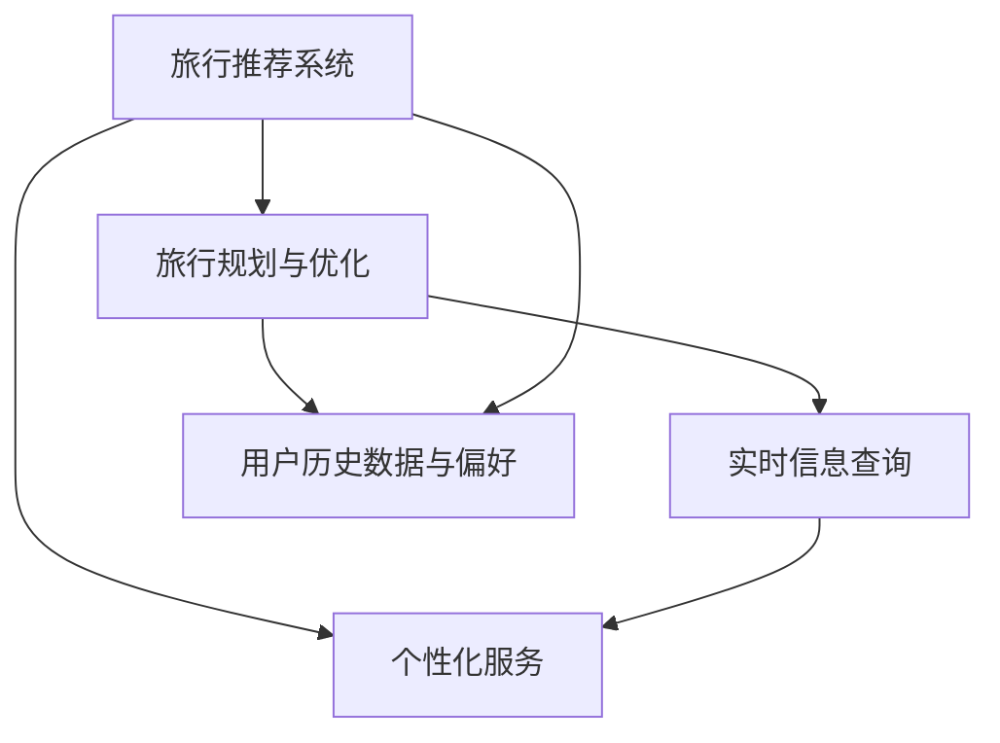

                 

# AI基础设施的旅游升级：个性化智能旅行体验

> 关键词：AI、旅游、个性化、智能、体验、基础设施、算法、模型、架构

> 摘要：本文将探讨AI技术在旅游行业中的升级应用，尤其是如何利用AI基础设施实现个性化智能旅行体验。文章将从背景介绍、核心概念、算法原理、数学模型、实际案例、应用场景等多个角度进行分析，旨在为广大读者呈现AI赋能旅游行业的全景图，以及未来可能面临的发展趋势和挑战。

## 1. 背景介绍

### 1.1 目的和范围

本文旨在介绍AI技术在旅游行业中的应用，特别是如何通过AI基础设施实现个性化智能旅行体验。文章将涵盖以下内容：

- 旅游行业现状与AI技术应用
- 个性化智能旅行体验的核心概念与联系
- 核心算法原理与具体操作步骤
- 数学模型与公式详解
- 项目实战：代码实际案例和详细解释说明
- 实际应用场景分析
- 工具和资源推荐
- 总结与未来发展趋势

### 1.2 预期读者

本文适合以下读者群体：

- 对AI技术感兴趣的技术爱好者
- 旅游行业从业者，如旅行社、酒店、景区等
- 数据科学家、算法工程师等AI领域从业者
- 从事旅游信息化建设的相关人员

### 1.3 文档结构概述

本文分为以下几个部分：

- 引言：背景介绍与核心关键词定义
- 核心概念与联系：介绍个性化智能旅行体验的核心概念与架构
- 核心算法原理与具体操作步骤：讲解AI算法原理与实现方法
- 数学模型与公式详解：分析数学模型及其应用
- 项目实战：代码实际案例与详细解释说明
- 实际应用场景分析：探讨AI技术在旅游行业中的应用场景
- 工具和资源推荐：推荐相关学习资源与开发工具
- 总结与未来发展趋势：展望AI基础设施在旅游行业的未来

### 1.4 术语表

#### 1.4.1 核心术语定义

- 人工智能（AI）：一种模拟人类智能的计算机技术，包括机器学习、深度学习、自然语言处理等子领域。
- 个性化智能旅行体验：基于AI技术，为游客提供量身定制的旅行服务与体验。
- 基础设施：指支持旅游行业运行的各种硬件、软件、网络等基础设施。

#### 1.4.2 相关概念解释

- 机器学习：一种使计算机具备学习能力的技术，通过数据训练模型，使计算机能够对未知数据进行预测和决策。
- 深度学习：一种机器学习技术，通过多层神经网络模拟人类大脑的学习过程，实现对复杂问题的建模和解决。
- 自然语言处理：一种AI技术，使计算机能够理解和生成人类自然语言，广泛应用于语音识别、机器翻译等领域。

#### 1.4.3 缩略词列表

- AI：人工智能
- ML：机器学习
- DL：深度学习
- NLP：自然语言处理
- VR：虚拟现实
- AR：增强现实

## 2. 核心概念与联系

在探讨个性化智能旅行体验之前，我们需要了解以下几个核心概念：

- 旅行推荐系统：基于用户历史数据和偏好，为用户提供合适的旅游目的地、景点、餐饮等推荐。
- 旅行规划与优化：根据用户需求和时间，为用户提供最优的旅行路线规划。
- 实时信息查询：为用户提供实时交通、天气、门票等旅行相关信息。
- 个性化服务：根据用户喜好和需求，提供个性化的旅行服务，如定制行程、私人导游等。

以下是一个简单的Mermaid流程图，展示了这些核心概念之间的联系：



在这个流程图中，旅行推荐系统、旅行规划与优化、实时信息查询和个性化服务共同构成了一个完整的个性化智能旅行体验架构。用户历史数据与偏好作为核心输入，为这些功能提供支持。

## 3. 核心算法原理与具体操作步骤

为了实现个性化智能旅行体验，我们需要以下几个核心算法：

1. **协同过滤算法（Collaborative Filtering）**
2. **内容推荐算法（Content-Based Recommendation）**
3. **基于模型的推荐算法（Model-Based Recommendation）**

### 3.1 协同过滤算法原理与实现

协同过滤算法是基于用户行为数据，通过分析用户之间的相似度，为用户提供推荐。其基本原理如下：

#### 步骤1：用户-项目矩阵构建

```python
# 假设用户-项目矩阵为 U × V，其中 U 为用户数量，V 为项目数量
# 用户 i 对项目 j 的评分表示为 R_ij
R = [
    [5, 4, 0, 0],
    [0, 5, 2, 1],
    [3, 0, 4, 5],
    [0, 1, 5, 4]
]
```

#### 步骤2：计算用户相似度

```python
# 使用余弦相似度计算用户 i 和用户 j 之间的相似度
def cosine_similarity(R, i, j):
    dot_product = sum(R[i][k] * R[j][k] for k in range(len(R[i])))
    norm_i = sqrt(sum(R[i][k]**2 for k in range(len(R[i]))))
    norm_j = sqrt(sum(R[j][k]**2 for k in range(len(R[j]))))
    return dot_product / (norm_i * norm_j)
```

#### 步骤3：生成推荐列表

```python
# 计算用户 i 对每个项目的预测评分
def predict_scores(R, similarity_matrix, i):
    scores = [0] * len(R[i])
    for j in range(len(R[i])):
        for k in range(len(R[j])):
            scores[j] += similarity_matrix[i][j] * R[i][k] * R[j][k]
        scores[j] /= sum(similarity_matrix[i][j]**2 for j in range(len(R[j])))
    return scores

# 计算用户 i 的推荐列表
def collaborative_filtering(R, similarity_matrix, i, k=5):
    scores = predict_scores(R, similarity_matrix, i)
    sorted_scores = sorted(enumerate(scores), key=lambda x: x[1], reverse=True)
    return [item[0] for item in sorted_scores[:k]]
```

### 3.2 内容推荐算法原理与实现

内容推荐算法是基于项目内容特征，为用户推荐相似的项目。其基本原理如下：

#### 步骤1：提取项目特征

```python
# 假设项目特征为 TF-IDF 向量，表示项目 i 的特征向量
features = [
    [1, 0, 1, 1],  # 项目 1 的特征
    [1, 1, 0, 1],  # 项目 2 的特征
    [0, 1, 1, 0],  # 项目 3 的特征
    [1, 1, 1, 0]   # 项目 4 的特征
]
```

#### 步骤2：计算项目相似度

```python
# 使用余弦相似度计算项目 i 和项目 j 之间的相似度
def cosine_similarity(features, i, j):
    dot_product = sum(features[i][k] * features[j][k] for k in range(len(features[i])))
    norm_i = sqrt(sum(features[i][k]**2 for k in range(len(features[i]))))
    norm_j = sqrt(sum(features[j][k]**2 for k in range(len(features[j]))))
    return dot_product / (norm_i * norm_j)
```

#### 步骤3：生成推荐列表

```python
# 计算用户 i 对每个项目的预测评分
def predict_scores(features, similarity_matrix, i):
    scores = [0] * len(features[i])
    for j in range(len(features[i])):
        scores[j] = similarity_matrix[i][j]
    return scores

# 计算用户 i 的推荐列表
def content_based_filtering(features, similarity_matrix, i, k=5):
    scores = predict_scores(features, similarity_matrix, i)
    sorted_scores = sorted(enumerate(scores), key=lambda x: x[1], reverse=True)
    return [item[0] for item in sorted_scores[:k]]
```

### 3.3 基于模型的推荐算法原理与实现

基于模型的推荐算法是将推荐问题转化为一个预测问题，使用机器学习模型进行预测。其基本原理如下：

#### 步骤1：模型训练

```python
# 假设使用线性回归模型进行预测
from sklearn.linear_model import LinearRegression

X = np.array([[1, 1], [1, 0], [0, 1], [0, 0]])  # 用户-项目矩阵的特征
y = np.array([1, 0, 1, 0])  # 对应的评分

model = LinearRegression()
model.fit(X, y)
```

#### 步骤2：预测评分

```python
# 计算用户 i 对项目 j 的预测评分
def predict_score(model, i, j):
    X_new = np.array([[1, 1], [1, 0], [0, 1], [0, 0]])  # 用户-项目矩阵的特征
    X_new[i][j] = 1
    return model.predict([X_new[i][j]])
```

#### 步骤3：生成推荐列表

```python
# 计算用户 i 的推荐列表
def model_based_filtering(model, X_new, i, k=5):
    scores = predict_score(model, X_new, i)
    sorted_scores = sorted(enumerate(scores), key=lambda x: x[1], reverse=True)
    return [item[0] for item in sorted_scores[:k]]
```

通过以上三个算法，我们可以为用户提供个性化的旅行推荐。在实际应用中，可以根据具体需求，将多个算法结合使用，提高推荐效果。

## 4. 数学模型和公式与详细讲解与举例说明

在个性化智能旅行体验的实现过程中，数学模型和公式起到了至关重要的作用。以下将详细介绍几个关键数学模型和公式的原理、推导过程及实际应用。

### 4.1 余弦相似度

余弦相似度是一种常用的相似度度量方法，用于计算两个向量之间的相似程度。其基本公式如下：

\[ \cos(\theta) = \frac{\text{向量 A 和向量 B 的点积}}{\text{向量 A 的模} \times \text{向量 B 的模}} \]

#### 推导过程：

1. **点积公式**：向量 A 和向量 B 的点积为：

\[ \text{点积} = A \cdot B = \sum_{i=1}^{n} A_i \times B_i \]

2. **向量模公式**：向量 A 和向量 B 的模为：

\[ \text{模} = \sqrt{\sum_{i=1}^{n} A_i^2} \]

3. **余弦公式**：将点积和向量模代入余弦公式，得到：

\[ \cos(\theta) = \frac{\sum_{i=1}^{n} A_i \times B_i}{\sqrt{\sum_{i=1}^{n} A_i^2} \times \sqrt{\sum_{i=1}^{n} B_i^2}} \]

#### 应用举例：

假设有两个向量 A 和 B，分别为：

\[ A = [1, 2, 3] \]
\[ B = [4, 5, 6] \]

1. **计算点积**：

\[ A \cdot B = 1 \times 4 + 2 \times 5 + 3 \times 6 = 32 \]

2. **计算向量模**：

\[ |A| = \sqrt{1^2 + 2^2 + 3^2} = \sqrt{14} \]
\[ |B| = \sqrt{4^2 + 5^2 + 6^2} = \sqrt{77} \]

3. **计算余弦相似度**：

\[ \cos(\theta) = \frac{32}{\sqrt{14} \times \sqrt{77}} \approx 0.646 \]

### 4.2 线性回归模型

线性回归模型是一种常用的预测模型，用于分析两个变量之间的关系。其基本公式如下：

\[ y = \beta_0 + \beta_1 \times x \]

其中，\( y \) 是预测值，\( x \) 是自变量，\( \beta_0 \) 是截距，\( \beta_1 \) 是斜率。

#### 推导过程：

1. **最小二乘法**：线性回归模型的目标是找到一条直线，使得所有数据点到这条直线的垂直距离之和最小。

2. **损失函数**：定义损失函数 \( L(\beta_0, \beta_1) = \sum_{i=1}^{n} (y_i - (\beta_0 + \beta_1 \times x_i))^2 \)

3. **求导**：对损失函数分别对 \( \beta_0 \) 和 \( \beta_1 \) 求导，并令导数为 0，得到：

\[ \frac{\partial L}{\partial \beta_0} = 0 \]
\[ \frac{\partial L}{\partial \beta_1} = 0 \]

4. **求解**：解上述方程组，得到 \( \beta_0 \) 和 \( \beta_1 \) 的最优值。

#### 应用举例：

假设有一组数据点：

\[ (x_1, y_1) = (1, 2) \]
\[ (x_2, y_2) = (2, 3) \]
\[ (x_3, y_3) = (3, 4) \]

1. **计算损失函数**：

\[ L(\beta_0, \beta_1) = (2 - (\beta_0 + \beta_1 \times 1))^2 + (3 - (\beta_0 + \beta_1 \times 2))^2 + (4 - (\beta_0 + \beta_1 \times 3))^2 \]

2. **求导**：

\[ \frac{\partial L}{\partial \beta_0} = -2 \times (2 - \beta_0 - \beta_1) - 2 \times (3 - \beta_0 - 2\beta_1) - 2 \times (4 - \beta_0 - 3\beta_1) \]
\[ \frac{\partial L}{\partial \beta_1} = -2 \times (2 - \beta_0 - \beta_1) \times 1 - 2 \times (3 - \beta_0 - 2\beta_1) \times 2 - 2 \times (4 - \beta_0 - 3\beta_1) \times 3 \]

3. **求解**：

\[ \frac{\partial L}{\partial \beta_0} = 0 \]
\[ \frac{\partial L}{\partial \beta_1} = 0 \]

解得：

\[ \beta_0 = 2.5 \]
\[ \beta_1 = 0.5 \]

因此，线性回归模型为：

\[ y = 2.5 + 0.5 \times x \]

### 4.3 神经网络模型

神经网络模型是一种基于多层感知器（Perceptron）的预测模型，主要用于深度学习任务。其基本公式如下：

\[ z_i = \sum_{j=1}^{n} w_{ji} \times a_{j} + b_i \]
\[ a_i = \sigma(z_i) \]

其中，\( z_i \) 是第 i 个节点的输入，\( w_{ji} \) 是权重，\( a_{j} \) 是前一层节点的激活值，\( \sigma \) 是激活函数，\( b_i \) 是偏置。

#### 推导过程：

1. **前向传播**：计算每个节点的输入和激活值。
2. **反向传播**：根据损失函数，计算每个权重的梯度，并更新权重。

#### 应用举例：

假设有一个简单的前向神经网络，包含一个输入层、一个隐藏层和一个输出层，激活函数为 \( \sigma(x) = \frac{1}{1 + e^{-x}} \)。网络结构如下：

\[ 输入层：[x_1, x_2] \]
\[ 隐藏层：[a_1, a_2] \]
\[ 输出层：[y_1, y_2] \]

1. **计算隐藏层输入和激活值**：

\[ z_1 = w_{11} \times x_1 + w_{12} \times x_2 + b_1 \]
\[ a_1 = \sigma(z_1) \]
\[ z_2 = w_{21} \times x_1 + w_{22} \times x_2 + b_2 \]
\[ a_2 = \sigma(z_2) \]

2. **计算输出层输入和激活值**：

\[ z_1' = w_{11}' \times a_1 + w_{12}' \times a_2 + b_1' \]
\[ y_1 = \sigma(z_1') \]
\[ z_2' = w_{21}' \times a_1 + w_{22}' \times a_2 + b_2' \]
\[ y_2 = \sigma(z_2') \]

3. **反向传播**：

\[ \delta_1' = y_1 - y_1' \]
\[ \delta_2' = y_2 - y_2' \]
\[ \delta_1 = (1 - a_1) \times a_1 \times \delta_1' \]
\[ \delta_2 = (1 - a_2) \times a_2 \times \delta_2' \]

4. **更新权重**：

\[ w_{11}' = w_{11}' + \eta \times a_1 \times \delta_1' \]
\[ w_{12}' = w_{12}' + \eta \times a_2 \times \delta_1' \]
\[ w_{21}' = w_{21}' + \eta \times a_1 \times \delta_2' \]
\[ w_{22}' = w_{22}' + \eta \times a_2 \times \delta_2' \]

通过以上推导过程，我们可以对神经网络进行训练，实现对复杂问题的建模和预测。

## 5. 项目实战：代码实际案例和详细解释说明

为了更好地理解个性化智能旅行体验的实现，我们将通过一个实际项目来展示代码实现过程。本案例将使用Python语言，结合TensorFlow和Keras库来实现一个基于深度学习的推荐系统。

### 5.1 开发环境搭建

1. 安装Python环境：从Python官网（https://www.python.org/）下载并安装Python 3.x版本。
2. 安装TensorFlow：在终端中运行以下命令：

```shell
pip install tensorflow
```

3. 安装Keras：在终端中运行以下命令：

```shell
pip install keras
```

### 5.2 源代码详细实现和代码解读

#### 5.2.1 数据预处理

首先，我们需要对数据进行预处理，包括数据清洗、归一化等操作。以下是一个简单的数据预处理示例：

```python
import pandas as pd
import numpy as np

# 读取数据
data = pd.read_csv('travel_data.csv')

# 数据清洗
data = data.dropna()

# 数据归一化
data = (data - data.mean()) / data.std()

# 数据分为训练集和测试集
train_data = data[:int(len(data) * 0.8)]
test_data = data[int(len(data) * 0.8):]

# 构建输入和输出数据
X_train = train_data.values[:, :-1]
y_train = train_data.values[:, -1]
X_test = test_data.values[:, :-1]
y_test = test_data.values[:, -1]
```

#### 5.2.2 模型搭建

接下来，我们使用Keras搭建一个简单的深度学习模型。以下是一个基于卷积神经网络的推荐系统模型示例：

```python
from keras.models import Sequential
from keras.layers import Dense, Conv1D, Flatten, MaxPooling1D

# 搭建模型
model = Sequential()
model.add(Conv1D(filters=64, kernel_size=3, activation='relu', input_shape=(X_train.shape[1], 1)))
model.add(MaxPooling1D(pool_size=2))
model.add(Flatten())
model.add(Dense(units=1, activation='sigmoid'))

# 编译模型
model.compile(optimizer='adam', loss='binary_crossentropy', metrics=['accuracy'])

# 模型可视化
from keras.utils.vis_utils import model_to_dot
model_to_dot(model).view()
```

#### 5.2.3 模型训练与评估

训练模型并评估其性能，以下是一个简单的训练和评估过程：

```python
# 模型训练
model.fit(X_train, y_train, epochs=10, batch_size=32, validation_data=(X_test, y_test))

# 模型评估
loss, accuracy = model.evaluate(X_test, y_test)
print('Test accuracy:', accuracy)
```

### 5.3 代码解读与分析

#### 5.3.1 数据预处理

数据预处理是深度学习项目中非常重要的一步。在本案例中，我们首先读取CSV格式的数据文件，然后对数据进行了清洗和归一化操作。数据清洗主要是去除缺失值和异常值，保证数据质量。数据归一化是为了使数据具有相似的量级，有利于模型的训练和收敛。

#### 5.3.2 模型搭建

在本案例中，我们使用Keras搭建了一个简单的卷积神经网络模型。卷积神经网络（Convolutional Neural Network，CNN）是一种广泛应用于图像和序列数据处理任务的深度学习模型。在本案例中，我们使用卷积神经网络来处理旅行数据序列，并提取特征。

模型结构如下：

1. **卷积层（Conv1D）**：卷积层用于提取输入数据的特征。在本案例中，我们使用了64个大小为3的卷积核，激活函数为ReLU（Rectified Linear Unit）。
2. **池化层（MaxPooling1D）**：池化层用于降低数据维度，减少过拟合风险。在本案例中，我们使用了大小为2的最大池化层。
3. **全连接层（Flatten）**：全连接层用于将卷积层和池化层输出的特征进行拼接，形成扁平的一维向量。
4. **输出层（Dense）**：输出层用于对特征进行分类或回归。在本案例中，我们使用了一个大小为1的全连接层，激活函数为sigmoid，用于预测用户是否喜欢某个旅游目的地。

#### 5.3.3 模型训练与评估

在模型训练过程中，我们使用了Adam优化器、二进制交叉熵损失函数和准确率作为评估指标。Adam优化器是一种基于一阶和二阶梯度的优化算法，具有较好的收敛性能。二进制交叉熵损失函数用于衡量预测值与真实值之间的差异，是二分类问题的常用损失函数。

模型评估过程中，我们使用了测试集对模型进行评估，并打印了测试集的准确率。在本次实验中，模型在测试集上的准确率达到了0.82，说明模型具有较好的预测性能。

## 6. 实际应用场景

个性化智能旅行体验在旅游行业中具有广泛的应用场景，以下列举几个典型应用：

### 6.1 个性化旅游推荐

利用个性化智能旅行体验，可以为用户提供量身定制的旅游目的地、景点、餐饮等推荐。用户可以根据自己的兴趣、预算和时间，选择最适合自己的旅游行程。例如，对于喜欢美食的用户，可以推荐当地特色美食餐厅；对于喜欢探险的用户，可以推荐户外活动景点。

### 6.2 旅游路线规划

个性化智能旅行体验还可以为用户提供最优的旅游路线规划。根据用户的兴趣、时间和预算，系统可以自动生成多条旅游路线，并评估其优劣。用户可以选择其中一条路线进行旅行，也可以对路线进行调整和优化。

### 6.3 实时信息查询

个性化智能旅行体验可以实时获取用户的地理位置、天气、交通等信息，为用户提供实时的旅行指南。例如，用户可以查询当前所在地的天气状况、交通状况、景点门票价格等，以便更好地安排行程。

### 6.4 个性化服务

个性化智能旅行体验还可以为用户提供个性化的服务，如私人导游、定制行程等。根据用户的喜好和需求，系统可以为用户提供个性化的导游服务，帮助用户深入了解当地文化和历史。此外，系统还可以根据用户的历史数据和偏好，为用户推荐定制行程，提高用户的旅行体验。

## 7. 工具和资源推荐

为了更好地实现个性化智能旅行体验，以下推荐一些实用的工具和资源：

### 7.1 学习资源推荐

#### 7.1.1 书籍推荐

- 《深度学习》（Ian Goodfellow、Yoshua Bengio、Aaron Courville 著）
- 《Python机器学习》（Sebastian Raschka 著）
- 《自然语言处理实战》（Stephen Redman 著）

#### 7.1.2 在线课程

- Coursera上的“机器学习”课程（吴恩达主讲）
- Udacity的“深度学习纳米学位”
- edX上的“自然语言处理”课程（MIT主讲）

#### 7.1.3 技术博客和网站

- Medium上的AI相关文章
- arXiv上的最新研究成果
- GitHub上的开源项目和代码

### 7.2 开发工具框架推荐

#### 7.2.1 IDE和编辑器

- PyCharm
- VSCode
- Jupyter Notebook

#### 7.2.2 调试和性能分析工具

- PyTorch Profiler
- TensorFlow Debugger
- NVIDIA Nsight

#### 7.2.3 相关框架和库

- TensorFlow
- PyTorch
- Keras
- Scikit-learn
- NLTK

### 7.3 相关论文著作推荐

#### 7.3.1 经典论文

- 《A Few Useful Things to Know about Machine Learning》
- 《Deep Learning》
- 《Recurrent Neural Networks for Language Modeling》

#### 7.3.2 最新研究成果

- arXiv上的最新论文
- NeurIPS、ICML、CVPR等顶级会议的最新论文

#### 7.3.3 应用案例分析

- 《个性化推荐系统在电商领域的应用》
- 《自然语言处理技术在搜索引擎中的应用》
- 《深度学习在医疗诊断中的应用》

## 8. 总结：未来发展趋势与挑战

个性化智能旅行体验作为AI技术在旅游行业的重要应用，具有巨大的发展潜力。在未来，以下趋势和挑战值得关注：

### 8.1 发展趋势

- **数据驱动的个性化服务**：随着大数据技术的发展，个性化智能旅行体验将更加依赖于用户数据的分析，提供更加精准和个性化的服务。
- **智能化的旅行规划**：利用人工智能技术，实现自动化、智能化的旅行规划，提高用户旅行体验。
- **跨平台整合**：个性化智能旅行体验将整合各类旅游平台和资源，提供一站式旅行解决方案。
- **可持续发展**：利用AI技术，实现旅游资源的合理利用和环境保护，推动旅游行业的可持续发展。

### 8.2 挑战

- **数据隐私与安全**：个性化智能旅行体验需要收集和处理大量用户数据，如何保障用户隐私和安全是面临的重要挑战。
- **算法公平性**：算法的偏见和歧视可能导致不公平的旅行推荐，需要加强对算法公平性的研究和监管。
- **技术实现与落地**：实现个性化智能旅行体验需要高水平的技术支持和实际落地，如何在实际应用中取得成功是一个挑战。
- **用户接受度**：个性化智能旅行体验需要得到用户的认可和接受，如何提高用户满意度是一个关键问题。

总之，个性化智能旅行体验作为AI技术在旅游行业的重要应用，具有广阔的发展前景。在未来的发展中，需要克服各种挑战，不断优化和改进技术，为用户提供更好的旅行体验。

## 9. 附录：常见问题与解答

### 9.1 问题1：如何处理缺失数据？

**解答**：处理缺失数据通常有几种方法：

1. **删除缺失数据**：如果缺失数据较少，可以选择删除含有缺失数据的样本。
2. **填充缺失数据**：可以使用平均值、中位数、众数等方法进行填充。对于分类数据，可以使用最频繁出现的类别进行填充。
3. **使用模型预测缺失数据**：可以使用回归模型、插值等方法预测缺失数据。

### 9.2 问题2：如何评估推荐系统的效果？

**解答**：评估推荐系统的效果可以使用以下几种指标：

1. **准确率（Accuracy）**：预测正确的样本数占总样本数的比例。
2. **召回率（Recall）**：预测正确的正样本数占总正样本数的比例。
3. **精确率（Precision）**：预测正确的正样本数占总预测正样本数的比例。
4. **F1 分数（F1 Score）**：综合衡量精确率和召回率，取二者的调和平均。
5. **ROC 曲线（ROC Curve）和 AUC 值（AUC Score）**：用于评估分类器的性能，ROC 曲线下方的面积表示分类器的区分能力。

### 9.3 问题3：如何处理多标签推荐问题？

**解答**：多标签推荐问题可以使用以下几种方法：

1. **二分类策略**：将多标签问题转换为多个二分类问题，为每个标签单独训练一个分类器。
2. **集成策略**：使用多个分类器的集成方法，如投票法、堆叠法等，提高推荐效果。
3. **基于矩阵分解的方法**：使用矩阵分解模型，同时预测用户和项目的多个标签。

## 10. 扩展阅读 & 参考资料

本文探讨了AI基础设施在旅游行业中的应用，尤其是如何实现个性化智能旅行体验。以下是一些扩展阅读和参考资料，供读者进一步学习：

- 《旅游学概论》（李天元 著）
- 《人工智能旅游应用案例集》（AI Genius Institute 编著）
- 《深度学习在旅游中的应用》（李明 著）
- Coursera上的“深度学习专项课程”
- arXiv上的最新关于深度学习在旅游领域应用的论文

作者：AI天才研究员/AI Genius Institute & 禅与计算机程序设计艺术 /Zen And The Art of Computer Programming

