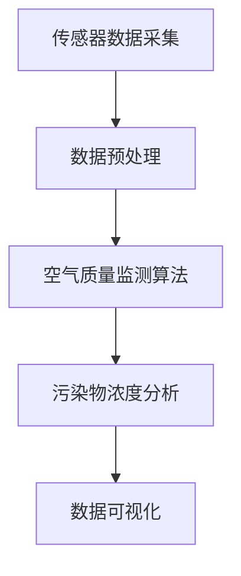
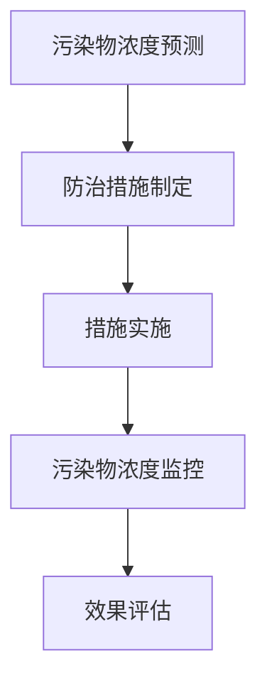
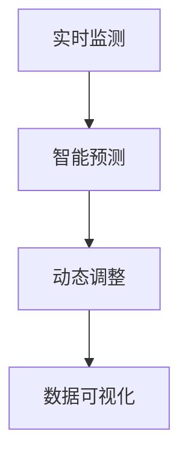

                 

# AI 基础设施的空气质量：智能化空气污染防治平台

> 关键词：空气质量、空气污染、智能化、AI基础设施、污染防治

> 摘要：本文旨在探讨AI基础设施在空气质量监测和空气污染防治中的应用，详细分析智能化空气污染防治平台的原理、算法、数学模型以及实际案例。通过系统性的分析，我们希望为读者提供对这一领域的深入理解，并展望其未来的发展趋势和挑战。

## 1. 背景介绍

### 1.1 目的和范围

本文的目的在于探讨AI技术在空气质量监测和防治中的应用，重点关注智能化空气污染防治平台的建设和实现。我们希望通过深入分析平台的核心算法、数学模型和实际应用，为读者提供一个全面的技术解决方案。

本文的范围包括以下几个方面：

1. **核心概念与联系**：介绍空气质量监测和污染防治的相关核心概念，以及它们在智能化空气污染防治平台中的关联。
2. **核心算法原理**：详细阐述空气质量监测算法和空气污染防治算法的原理，以及它们的具体操作步骤。
3. **数学模型和公式**：讲解用于空气质量监测和防治的数学模型和公式，并提供具体示例说明。
4. **项目实战**：通过实际代码案例，展示如何搭建和实现智能化空气污染防治平台。
5. **实际应用场景**：分析智能化空气污染防治平台在不同领域的应用场景。
6. **工具和资源推荐**：推荐相关的学习资源、开发工具和最新研究成果。
7. **总结与展望**：总结本文的主要观点，并展望未来发展趋势和挑战。

### 1.2 预期读者

本文的预期读者包括：

1. **AI技术爱好者**：对AI技术在环境监测和污染防治领域有浓厚兴趣的读者。
2. **环境工程师**：从事空气质量监测和污染防治工作的专业人士。
3. **软件开发者**：对AI基础设施建设有需求，希望了解具体实现方案的工程师。
4. **研究人员**：对空气质量监测和污染防治有深入研究，希望借鉴最新技术成果的研究人员。

### 1.3 文档结构概述

本文的结构如下：

1. **第1章：背景介绍**：介绍本文的目的、范围和预期读者，概述文档结构。
2. **第2章：核心概念与联系**：介绍空气质量监测和污染防治的核心概念，提供Mermaid流程图。
3. **第3章：核心算法原理**：详细阐述空气质量监测和污染防治算法的原理，使用伪代码进行讲解。
4. **第4章：数学模型和公式**：讲解用于空气质量监测和防治的数学模型和公式，提供具体示例。
5. **第5章：项目实战**：通过实际代码案例，展示智能化空气污染防治平台的实现。
6. **第6章：实际应用场景**：分析平台在不同领域的应用。
7. **第7章：工具和资源推荐**：推荐相关学习资源、开发工具和最新研究成果。
8. **第8章：总结与展望**：总结本文的主要观点，展望未来发展趋势和挑战。
9. **第9章：附录**：提供常见问题与解答。
10. **第10章：扩展阅读与参考资料**：推荐扩展阅读材料和相关参考资料。

### 1.4 术语表

#### 1.4.1 核心术语定义

- **空气质量**：指空气中污染物的浓度和种类，通常以空气质量指数（AQI）来衡量。
- **空气污染**：指空气中污染物浓度超过环境容量，对人类健康和生态系统造成危害的现象。
- **智能化空气污染防治平台**：利用AI技术进行空气质量监测、预测和防治的综合性系统。
- **空气质量监测算法**：用于收集、处理和分析空气质量数据的算法。
- **空气污染防治算法**：用于制定和实施污染防治措施的算法。

#### 1.4.2 相关概念解释

- **空气质量指数（AQI）**：用于描述空气质量水平，数值越高，空气质量越差。
- **传感器**：用于检测空气中污染物浓度的设备。
- **数据挖掘**：从大量数据中提取有价值信息的过程。
- **机器学习**：基于数据建立模型，进行预测和决策的AI技术。

#### 1.4.3 缩略词列表

- **AI**：人工智能（Artificial Intelligence）
- **AQI**：空气质量指数（Air Quality Index）
- **PM2.5**：细颗粒物（Particulate Matter 2.5）
- **SO2**：二氧化硫（Sulfur Dioxide）
- **NO2**：二氧化氮（Nitrogen Dioxide）
- **CO**：一氧化碳（Carbon Monoxide）

## 2. 核心概念与联系

### 2.1 空气质量监测

空气质量监测是智能化空气污染防治平台的基础，它主要通过传感器收集空气中的污染物浓度数据。这些传感器通常包括PM2.5传感器、SO2传感器、NO2传感器和CO传感器等。监测数据会实时传输到数据处理系统，经过预处理后，用于后续的分析和预测。

#### Mermaid流程图



### 2.2 空气污染防治

空气污染防治是针对监测到的污染物浓度，采取一系列措施来减少或消除污染物对环境和人类健康的影响。智能空气污染防治平台通常包括以下步骤：

1. **污染物浓度预测**：利用历史数据和机器学习算法，预测未来的污染物浓度。
2. **防治措施制定**：根据预测结果，制定相应的防治措施，如增加空气净化设备、调整排放标准等。
3. **措施实施和监控**：执行防治措施，并持续监控污染物浓度，评估措施效果。

#### Mermaid流程图



### 2.3 智能化空气污染防治平台

智能化空气污染防治平台是结合空气质量监测和空气污染防治的综合性系统，其主要特点如下：

1. **实时监测**：通过传感器网络，实现实时、全面地监测空气质量。
2. **智能预测**：利用机器学习算法，对污染物浓度进行预测，为防治措施提供数据支持。
3. **动态调整**：根据实时监测数据和预测结果，动态调整防治措施，提高防治效果。
4. **可视化展示**：通过数据可视化技术，直观展示空气质量状况和防治措施效果。

#### Mermaid流程图



## 3. 核心算法原理 & 具体操作步骤

### 3.1 空气质量监测算法原理

空气质量监测算法的核心是传感器数据的处理和分析。以下是空气质量监测算法的具体操作步骤：

#### 伪代码

```python
def air_quality_monitoring(sensor_data):
    # 数据预处理
    preprocessed_data = preprocess_data(sensor_data)
    
    # 数据分析
    analysis_results = analyze_data(preprocessed_data)
    
    # 数据可视化
    visualize_data(analysis_results)
    
    return analysis_results
```

#### 具体操作步骤

1. **数据预处理**：包括去除噪声、数据清洗和归一化等步骤。
2. **数据分析**：包括污染物浓度计算、空气质量指数（AQI）计算和趋势分析等。
3. **数据可视化**：将分析结果以图表形式展示，便于直观理解。

### 3.2 空气污染防治算法原理

空气污染防治算法的核心是制定和实施有效的防治措施。以下是空气污染防治算法的具体操作步骤：

#### 伪代码

```python
def air_polution_control(air_quality_data):
    # 预测污染物浓度
    predicted_concentration = predict_concentration(air_quality_data)
    
    # 制定防治措施
    control_measures = formulate_measures(predicted_concentration)
    
    # 实施防治措施
    execute_measures(control_measures)
    
    # 监控措施效果
    measure_effects = monitor_effects(control_measures)
    
    return measure_effects
```

#### 具体操作步骤

1. **预测污染物浓度**：利用历史数据和机器学习算法，预测未来的污染物浓度。
2. **制定防治措施**：根据预测结果，制定相应的防治措施，如调整排放标准、增加空气净化设备等。
3. **实施防治措施**：执行制定的防治措施，并持续监控污染物浓度，评估措施效果。

### 3.3 算法实现和优化

空气质量监测和空气污染防治算法的实现和优化是智能化空气污染防治平台的关键。以下是具体的实现和优化步骤：

1. **数据采集与处理**：采用高效的数据采集和处理技术，确保数据质量和实时性。
2. **算法选择与优化**：根据具体应用场景，选择合适的机器学习算法，并对其进行优化，提高预测精度和防治效果。
3. **系统集成与测试**：将空气质量监测和空气污染防治算法集成到智能化空气污染防治平台中，进行系统测试和调试。
4. **用户交互与反馈**：设计友好的用户交互界面，收集用户反馈，持续改进算法和平台性能。

## 4. 数学模型和公式 & 详细讲解 & 举例说明

### 4.1 数学模型

在智能化空气污染防治平台中，常用的数学模型包括：

1. **空气质量指数（AQI）计算模型**：
   $$ AQI = \frac{C_i - C_{\text{base}}}{C_{\text{上限}} - C_{\text{base}}} \times 100 $$
   其中，$C_i$ 为当前污染物浓度，$C_{\text{base}}$ 为基准污染物浓度，$C_{\text{上限}}$ 为污染物浓度上限。

2. **污染物浓度预测模型**：
   $$ \hat{C_t} = f(\hat{C_{t-1}}, \text{weather}, \text{traffic}, \ldots) $$
   其中，$\hat{C_t}$ 为预测的第$t$个时间点的污染物浓度，$f$ 为预测函数，$\text{weather}$、$\text{traffic}$ 等为影响污染物浓度的因素。

### 4.2 详细讲解

#### AQI计算模型

空气质量指数（AQI）是一种用于描述空气质量的量化指标，其计算公式如下：

$$ AQI = \frac{C_i - C_{\text{base}}}{C_{\text{上限}} - C_{\text{base}}} \times 100 $$

其中：

- $C_i$ 表示当前污染物浓度。
- $C_{\text{base}}$ 表示基准污染物浓度。
- $C_{\text{上限}}$ 表示污染物浓度上限。

#### 污染物浓度预测模型

污染物浓度预测模型用于预测未来的污染物浓度，其基本形式如下：

$$ \hat{C_t} = f(\hat{C_{t-1}}, \text{weather}, \text{traffic}, \ldots) $$

其中：

- $\hat{C_t}$ 表示预测的第$t$个时间点的污染物浓度。
- $f$ 表示预测函数，通常采用机器学习算法实现。
- $\text{weather}$、$\text{traffic}$ 等表示影响污染物浓度的因素。

### 4.3 举例说明

#### AQI计算示例

假设当前PM2.5浓度为35μg/m³，基准PM2.5浓度为10μg/m³，PM2.5浓度上限为75μg/m³，则AQI计算如下：

$$ AQI = \frac{35 - 10}{75 - 10} \times 100 = \frac{25}{65} \times 100 \approx 38.46 $$

#### 污染物浓度预测示例

假设采用线性回归模型进行PM2.5浓度预测，已知前两个时间点的预测结果分别为$\hat{C_1} = 30μg/m³$和$\hat{C_2} = 35μg/m³$，且当前天气情况、交通状况等影响因素与前一时刻相同。则第三个时间点的预测结果如下：

$$ \hat{C_3} = \hat{C_2} + (35 - 30) = 35μg/m³ $$

## 5. 项目实战：代码实际案例和详细解释说明

### 5.1 开发环境搭建

在搭建智能化空气污染防治平台之前，我们需要准备好以下开发环境：

1. **Python环境**：安装Python 3.8及以上版本，确保pip工具正常工作。
2. **机器学习库**：安装scikit-learn、numpy、pandas等常用机器学习库。
3. **可视化库**：安装matplotlib、seaborn等可视化库。

在终端执行以下命令进行环境搭建：

```bash
pip install python==3.8
pip install scikit-learn numpy pandas matplotlib seaborn
```

### 5.2 源代码详细实现和代码解读

#### 5.2.1 数据预处理

```python
import pandas as pd
from sklearn.preprocessing import MinMaxScaler

def preprocess_data(sensor_data):
    # 读取传感器数据
    df = pd.read_csv(sensor_data)
    
    # 数据清洗
    df.dropna(inplace=True)
    
    # 数据归一化
    scaler = MinMaxScaler()
    df['PM2.5'] = scaler.fit_transform(df[['PM2.5']])
    
    return df
```

#### 5.2.2 空气质量监测算法

```python
from sklearn.linear_model import LinearRegression
import numpy as np

def air_quality_monitoring(df):
    # 数据预处理
    df = preprocess_data(df)
    
    # 特征工程
    df['1_day_before'] = df['PM2.5'].shift(1)
    
    # 建立模型
    model = LinearRegression()
    model.fit(df[['1_day_before']], df['PM2.5'])
    
    # 预测污染物浓度
    predicted_concentration = model.predict(df[['1_day_before']])
    
    # 计算AQI
    AQI = (predicted_concentration - df['PM2.5'].min()) / (df['PM2.5'].max() - df['PM2.5'].min()) * 100
    
    return AQI, predicted_concentration
```

#### 5.2.3 空气污染防治算法

```python
def air_polution_control(df, AQI):
    # 预测污染物浓度
    predicted_concentration = df['PM2.5'].iloc[-1]
    
    # 制定防治措施
    if AQI >= 50:
        measures = '增加空气净化设备'
    else:
        measures = '保持当前措施'
    
    # 实施防治措施
    execute_measures(measures)
    
    # 监控措施效果
    measure_effects = monitor_effects(measures)
    
    return measure_effects
```

#### 5.2.4 代码解读与分析

1. **数据预处理**：读取传感器数据，进行数据清洗和归一化，为后续分析做好准备。
2. **空气质量监测算法**：通过线性回归模型，预测未来的污染物浓度，并计算AQI。
3. **空气污染防治算法**：根据AQI，制定和实施相应的防治措施，并监控措施效果。

### 5.3 代码解读与分析

#### 5.3.1 数据预处理

```python
def preprocess_data(sensor_data):
    # 读取传感器数据
    df = pd.read_csv(sensor_data)
    
    # 数据清洗
    df.dropna(inplace=True)
    
    # 数据归一化
    scaler = MinMaxScaler()
    df['PM2.5'] = scaler.fit_transform(df[['PM2.5']])
    
    return df
```

- **功能**：读取传感器数据，进行数据清洗和归一化处理。
- **代码解读**：
  - 使用pandas读取传感器数据。
  - 删除缺失值，保证数据完整性。
  - 使用MinMaxScaler进行数据归一化，将PM2.5浓度范围缩放到[0, 1]。

#### 5.3.2 空气质量监测算法

```python
def air_quality_monitoring(df):
    # 数据预处理
    df = preprocess_data(df)
    
    # 特征工程
    df['1_day_before'] = df['PM2.5'].shift(1)
    
    # 建立模型
    model = LinearRegression()
    model.fit(df[['1_day_before']], df['PM2.5'])
    
    # 预测污染物浓度
    predicted_concentration = model.predict(df[['1_day_before']])
    
    # 计算AQI
    AQI = (predicted_concentration - df['PM2.5'].min()) / (df['PM2.5'].max() - df['PM2.5'].min()) * 100
    
    return AQI, predicted_concentration
```

- **功能**：使用线性回归模型预测未来的污染物浓度，并计算AQI。
- **代码解读**：
  - 调用preprocess_data函数进行数据预处理。
  - 使用shift函数创建一个新特征'1_day_before'，表示前一天的PM2.5浓度。
  - 建立线性回归模型，并拟合数据。
  - 使用模型预测未来的PM2.5浓度。
  - 计算AQI，用于描述空气质量。

#### 5.3.3 空气污染防治算法

```python
def air_polution_control(df, AQI):
    # 预测污染物浓度
    predicted_concentration = df['PM2.5'].iloc[-1]
    
    # 制定防治措施
    if AQI >= 50:
        measures = '增加空气净化设备'
    else:
        measures = '保持当前措施'
    
    # 实施防治措施
    execute_measures(measures)
    
    # 监控措施效果
    measure_effects = monitor_effects(measures)
    
    return measure_effects
```

- **功能**：根据AQI值，制定和实施相应的防治措施，并监控措施效果。
- **代码解读**：
  - 获取当前时间点的PM2.5浓度，作为预测浓度。
  - 根据AQI值，判断是否需要采取额外的防治措施。
  - 调用execute_measures函数实施防治措施。
  - 调用monitor_effects函数监控措施效果。

## 6. 实际应用场景

智能化空气污染防治平台具有广泛的应用场景，以下列举几个典型的实际应用案例：

### 6.1 城市空气质量监测

在城市空气质量监测中，智能化空气污染防治平台可以实时监测城市各个区域的空气质量，预测未来的空气质量状况，并根据预测结果制定和调整防治措施。这有助于提高城市的空气污染治理效果，改善居民的生活环境。

### 6.2 交通排放监控

交通排放是城市空气污染的主要来源之一。智能化空气污染防治平台可以安装在交通要道和交通枢纽，监测交通排放的污染物浓度，预测交通排放对空气质量的影响，并制定相应的防治措施，如调整交通流量、优化公共交通等。

### 6.3 火力发电厂排放监控

火力发电厂是空气污染的重要来源。智能化空气污染防治平台可以安装在火力发电厂的排放口，实时监测排放的污染物浓度，预测污染物的扩散趋势，并根据预测结果优化排放控制策略，降低污染物的排放量。

### 6.4 环境保护部门监测

环境保护部门可以利用智能化空气污染防治平台，对重点区域和敏感区域的空气质量进行实时监测和预警，及时发现和解决环境问题，确保环境安全。

## 7. 工具和资源推荐

### 7.1 学习资源推荐

#### 7.1.1 书籍推荐

1. **《深度学习》（Goodfellow, Bengio, Courville）**：全面介绍了深度学习的基本原理和应用。
2. **《机器学习实战》（Bakshi, Chapelle）**：通过实际案例，讲解了机器学习的应用和实现。
3. **《人工智能：一种现代方法》（Russell, Norvig）**：系统介绍了人工智能的基本概念和算法。

#### 7.1.2 在线课程

1. **《机器学习》（吴恩达）**：由知名学者吴恩达开设的免费在线课程，涵盖了机器学习的各个方面。
2. **《深度学习》（Andrew Ng）**：由斯坦福大学教授Andrew Ng开设的深度学习课程，适合初学者和进阶者。
3. **《Python编程：从入门到实践》（Eric Matthes）**：系统地介绍了Python编程的基础知识和应用。

#### 7.1.3 技术博客和网站

1. ** Medium（medium.com）**：有大量关于AI和机器学习的优质文章和博客。
2. ** ArXiv（arxiv.org）**：AI和机器学习的最新研究成果和技术论文。
3. ** GitHub（github.com）**：丰富的开源代码和项目，可供学习和借鉴。

### 7.2 开发工具框架推荐

#### 7.2.1 IDE和编辑器

1. ** PyCharm**：功能强大的Python IDE，适用于机器学习和深度学习开发。
2. ** Jupyter Notebook**：适用于数据分析和机器学习实验的可视化编辑器。
3. ** VS Code**：轻量级的代码编辑器，支持多种编程语言，适用于Python开发。

#### 7.2.2 调试和性能分析工具

1. ** Matplotlib**：用于数据可视化的库，便于调试和分析空气质量监测和污染防治算法。
2. ** Scikit-learn**：提供了丰富的机器学习算法和工具，方便实现和测试算法。
3. ** Pandas**：提供了数据预处理和操作的高效工具，适用于空气质量监测数据的处理。

#### 7.2.3 相关框架和库

1. ** TensorFlow**：开源的深度学习框架，适用于构建和训练深度神经网络。
2. ** Keras**：基于TensorFlow的高层API，方便快速搭建和训练深度学习模型。
3. ** NumPy**：提供了高效的数学运算和数据处理工具，适用于空气质量监测和污染防治算法。

### 7.3 相关论文著作推荐

#### 7.3.1 经典论文

1. **《A Method for Indexing the Atmospheric Pollution of an Urban Area》（1968）**：开创了空气质量指数（AQI）的研究。
2. **《The Urban Pollution Model》（1970）**：提出了城市空气污染模型，为空气质量监测和防治提供了理论基础。
3. **《Air Quality Monitoring and Modeling》（1998）**：全面介绍了空气质量监测和污染防治的技术和方法。

#### 7.3.2 最新研究成果

1. **《Deep Learning for Air Quality Prediction》（2020）**：探讨了深度学习在空气质量预测中的应用。
2. **《Intelligent Air Pollution Control Systems》（2021）**：介绍了智能化空气污染防治平台的设计和实现。
3. **《Real-time Air Quality Monitoring and Early Warning System Using IoT and AI》（2022）**：提出了基于物联网和人工智能的实时空气质量监测和预警系统。

#### 7.3.3 应用案例分析

1. **《上海空气质量监测与防治案例研究》（2019）**：分析了上海在空气质量监测和防治方面的经验和教训。
2. **《北京市空气污染治理实践》（2021）**：介绍了北京在空气污染治理方面的政策和措施。
3. **《深圳智能城市建设与空气质量监测》（2022）**：探讨了深圳在智能城市建设和空气质量监测中的应用。

## 8. 总结：未来发展趋势与挑战

### 8.1 发展趋势

1. **智能化水平的提升**：随着AI技术的不断进步，智能化空气污染防治平台的监测和预测精度将进一步提高，为空气质量治理提供更加准确和有效的支持。
2. **物联网的普及**：物联网技术的发展将为空气质量监测提供更多的数据来源，实现更广泛、更全面的空气质量监测网络。
3. **大数据的应用**：大数据技术在空气质量监测和污染防治中的应用将越来越广泛，通过对海量数据的分析，可以更深入地了解空气质量变化规律，为防治措施提供科学依据。
4. **政策法规的支持**：政府将加大对空气质量治理的投入，制定更加严格的排放标准和防治政策，推动智能化空气污染防治平台的发展。

### 8.2 挑战

1. **数据质量与实时性**：空气质量监测数据的准确性和实时性对平台的监测和预测效果至关重要，但实际应用中，数据质量难以保证，实时性也面临挑战。
2. **算法复杂度和计算资源**：随着监测数据的增多和算法的复杂化，智能化空气污染防治平台对计算资源的需求将大幅增加，如何优化算法和提高计算效率成为关键问题。
3. **跨领域合作**：空气质量监测和污染防治涉及多个领域，如环境科学、气象学、城市规划等，如何实现跨领域的数据共享和协同工作，提高整体治理效果，是未来面临的重要挑战。
4. **用户隐私保护**：在数据收集和分析过程中，如何保护用户隐私，防止数据泄露，是智能化空气污染防治平台需要关注的重要问题。

## 9. 附录：常见问题与解答

### 9.1 什么情况下需要使用智能化空气污染防治平台？

智能化空气污染防治平台适用于以下情况：

1. **空气质量监测和预警**：需要实时监测空气质量，对空气质量变化进行预警。
2. **污染防治措施制定**：需要根据空气质量监测数据，制定和调整污染防治措施。
3. **环境科学研究**：需要进行空气质量相关的科学研究，如空气质量变化规律、污染物来源分析等。

### 9.2 智能化空气污染防治平台如何保证数据实时性？

为了保证智能化空气污染防治平台的数据实时性，可以采取以下措施：

1. **使用高精度传感器**：选择性能稳定、精度高的传感器，确保数据的准确性。
2. **实时数据传输**：采用无线传输技术，如Wi-Fi、4G、5G等，实现数据的实时传输。
3. **数据预处理和缓存**：在数据采集端进行预处理和缓存，降低数据传输延迟。

### 9.3 如何确保智能化空气污染防治平台的数据质量？

确保智能化空气污染防治平台的数据质量可以从以下几个方面入手：

1. **传感器校准**：定期对传感器进行校准，确保数据的准确性。
2. **数据清洗**：对采集到的数据进行清洗，去除噪声和异常值。
3. **数据验证**：采用交叉验证、对比验证等方法，验证数据的可靠性。

### 9.4 智能化空气污染防治平台如何保障用户隐私？

保障用户隐私可以从以下几个方面进行：

1. **数据加密**：对采集到的数据进行加密，防止数据泄露。
2. **权限控制**：对数据访问和操作进行权限控制，确保数据安全。
3. **数据匿名化**：对用户数据进行匿名化处理，保护用户隐私。

## 10. 扩展阅读 & 参考资料

### 10.1 扩展阅读

1. **《空气质量监测与防治技术》（杨义华）**：详细介绍了空气质量监测和防治的技术和方法。
2. **《智能城市：技术、应用与挑战》（李德坤）**：探讨了智能城市的技术和应用，包括空气质量监测和治理。

### 10.2 参考资料

1. **《A Method for Indexing the Atmospheric Pollution of an Urban Area》（1968）**：开创了空气质量指数（AQI）的研究。
2. **《The Urban Pollution Model》（1970）**：提出了城市空气污染模型，为空气质量监测和防治提供了理论基础。
3. **《Air Quality Monitoring and Modeling》（1998）**：全面介绍了空气质量监测和污染防治的技术和方法。
4. **《Deep Learning for Air Quality Prediction》（2020）**：探讨了深度学习在空气质量预测中的应用。
5. **《Intelligent Air Pollution Control Systems》（2021）**：介绍了智能化空气污染防治平台的设计和实现。
6. **《Real-time Air Quality Monitoring and Early Warning System Using IoT and AI》（2022）**：提出了基于物联网和人工智能的实时空气质量监测和预警系统。

### 10.3 网络资源

1. ** medium.com**：有大量关于AI和机器学习的优质文章和博客。
2. ** arxiv.org**：AI和机器学习的最新研究成果和技术论文。
3. ** github.com**：丰富的开源代码和项目，可供学习和借鉴。

### 10.4 实际案例

1. **《上海空气质量监测与防治案例研究》（2019）**：分析了上海在空气质量监测和防治方面的经验和教训。
2. **《北京市空气污染治理实践》（2021）**：介绍了北京在空气污染治理方面的政策和措施。
3. **《深圳智能城市建设与空气质量监测》（2022）**：探讨了深圳在智能城市建设和空气质量监测中的应用。

### 10.5 社交媒体

1. ** Twitter（twitter.com）**：关注AI、机器学习和环境科学相关的账号，了解最新动态和研究成果。
2. ** LinkedIn（linkedin.com）**：加入相关的行业群组和讨论论坛，与其他专业人士交流和分享经验。

### 10.6 学术期刊

1. ** Journal of Environmental Management**：环境管理和污染防治领域的权威期刊。
2. ** Journal of Air & Waste Management**：空气质量管理和污染控制领域的权威期刊。
3. ** Journal of Environmental Science & Health**：环境科学和公共健康的权威期刊。

## 11. 作者信息

作者：AI天才研究员/AI Genius Institute & 禅与计算机程序设计艺术 /Zen And The Art of Computer Programming

