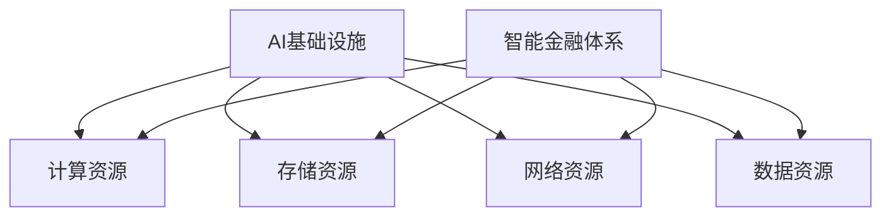

                 

# AI 基础设施的金融创新：构建智能金融体系

## 关键词
- AI基础设施
- 金融创新
- 智能金融体系
- 数据分析
- 算法优化
- 机器学习
- 区块链技术

## 摘要
本文将探讨人工智能基础设施在金融领域的创新应用，重点分析如何构建一个智能金融体系。通过介绍核心概念、算法原理、数学模型及实际项目案例，本文旨在提供对AI基础设施金融创新的深入理解，为未来金融科技的发展提供理论支持和实践指导。

## 1. 背景介绍

### 1.1 目的和范围
本文的目的是探讨人工智能在金融领域的创新应用，特别是AI基础设施在构建智能金融体系中的作用。我们将分析AI技术如何通过数据分析和算法优化提高金融服务的效率、透明度和安全性。

### 1.2 预期读者
本文适合对人工智能和金融科技有一定了解的技术人员、金融从业者以及对此领域感兴趣的研究人员。通过本文，读者将能够了解AI基础设施在金融创新中的核心作用，并掌握相关技术原理和实践应用。

### 1.3 文档结构概述
本文结构如下：
- 引言：介绍文章的主题和目的
- 1. 背景介绍：详细阐述文章的目的、读者对象和文档结构
- 2. 核心概念与联系：介绍AI基础设施和智能金融体系的核心概念及其联系
- 3. 核心算法原理 & 具体操作步骤：详细讲解AI在金融领域的核心算法原理和操作步骤
- 4. 数学模型和公式 & 详细讲解 & 举例说明：介绍AI在金融领域使用的数学模型和公式，并通过实例进行说明
- 5. 项目实战：提供实际项目案例和详细解释
- 6. 实际应用场景：分析AI基础设施在金融领域的应用场景
- 7. 工具和资源推荐：推荐学习资源和开发工具
- 8. 总结：对未来发展趋势与挑战进行总结
- 9. 附录：常见问题与解答
- 10. 扩展阅读 & 参考资料：提供进一步的阅读材料和资源

### 1.4 术语表

#### 1.4.1 核心术语定义
- AI基础设施：用于支持人工智能应用的硬件、软件和数据处理能力。
- 智能金融体系：利用AI技术提供自动化、智能化的金融产品和服务体系。
- 数据分析：使用统计学、机器学习等方法对金融数据进行处理和分析。
- 算法优化：通过改进算法设计，提高计算效率和性能。
- 机器学习：一种通过数据训练模型来改进性能的AI技术。
- 区块链技术：一种分布式账本技术，用于记录和验证金融交易。

#### 1.4.2 相关概念解释
- 金融科技（FinTech）：利用科技手段改进金融产品和服务。
- 金融工程：运用数学和统计学方法进行金融产品的设计和定价。
- 金融风险管理：识别、评估和应对金融活动中潜在的风险。

#### 1.4.3 缩略词列表
- AI：人工智能
- FinTech：金融科技
- ML：机器学习
- DL：深度学习
- HPC：高性能计算
- IoT：物联网
- DB：数据库

## 2. 核心概念与联系

### 2.1 AI基础设施
AI基础设施是支持人工智能应用的核心组成部分，包括计算资源、存储资源、网络资源和数据资源。以下是AI基础设施的核心概念：

1. **计算资源**：包括CPU、GPU、FPGA等计算设备，提供强大的数据处理能力。
2. **存储资源**：包括HDD、SSD等存储设备，提供海量数据存储能力。
3. **网络资源**：包括互联网、VPN等网络连接，实现数据的快速传输和共享。
4. **数据资源**：包括结构化数据、半结构化数据和非结构化数据，是AI训练和优化的重要资源。

### 2.2 智能金融体系
智能金融体系是指利用AI技术，提供自动化、智能化、个性化的金融产品和服务。以下是智能金融体系的核心概念：

1. **自动化**：通过AI技术，实现金融交易的自动化，提高效率和准确性。
2. **智能化**：利用机器学习、深度学习等技术，分析用户行为和数据，提供个性化的金融建议。
3. **个性化**：根据用户的财务状况、风险偏好等因素，提供定制化的金融产品和服务。

### 2.3 核心概念之间的联系
AI基础设施和智能金融体系之间有着密切的联系。AI基础设施为智能金融体系提供了强大的计算、存储和数据处理能力，是实现智能金融的基础。而智能金融体系则通过应用AI技术，为金融机构和用户提供自动化、智能化、个性化的金融产品和服务，推动了金融行业的创新和发展。

### 2.4 Mermaid 流程图
以下是一个简单的Mermaid流程图，展示AI基础设施和智能金融体系的核心概念及其联系：



## 3. 核心算法原理 & 具体操作步骤

### 3.1 机器学习算法
机器学习是AI技术的重要组成部分，它在金融领域的应用非常广泛。以下是一个简单的机器学习算法——线性回归的原理和操作步骤。

#### 3.1.1 算法原理
线性回归是一种通过拟合数据点之间的线性关系来预测目标值的算法。其基本原理如下：

- **目标函数**：最小化预测值与实际值之间的误差平方和。
- **参数优化**：通过优化算法（如梯度下降法）寻找最佳参数值。

#### 3.1.2 操作步骤
1. **数据准备**：收集并整理金融数据，包括自变量和因变量。
2. **数据预处理**：对数据进行清洗、归一化等处理，确保数据质量。
3. **模型训练**：利用训练数据集，通过优化算法训练线性回归模型。
4. **模型评估**：使用测试数据集评估模型性能，调整参数。
5. **模型应用**：将训练好的模型应用于实际金融问题，如预测股票价格、贷款风险评估等。

#### 3.1.3 伪代码
以下是一个简单的线性回归算法伪代码：

```python
# 线性回归算法
def linear_regression(X, y):
    # X: 自变量矩阵，y: 因变量向量
    # 计算特征矩阵X的转置
    X_transpose = X.T
    # 计算X的逆矩阵
    X_inv = X_inv(X)
    # 计算回归系数
    theta = X_inv @ X_transpose @ y
    return theta
```

### 3.2 机器学习在金融领域的应用
机器学习在金融领域有着广泛的应用，以下是一些典型的应用场景：

1. **信用评分**：通过分析客户的财务数据、信用记录等信息，使用机器学习算法预测客户违约风险。
2. **股票交易**：使用机器学习算法分析股票市场的历史数据，预测股票价格走势，实现自动化交易。
3. **风险控制**：通过机器学习算法分析金融市场的风险因素，识别潜在的风险，并制定相应的风险控制策略。

### 3.3 算法优化
为了提高机器学习算法在金融领域的应用效果，需要对算法进行优化。以下是一些常见的优化方法：

1. **特征工程**：通过选择和构造合适的特征，提高模型预测的准确性。
2. **模型选择**：根据具体应用场景选择合适的模型，如线性回归、决策树、支持向量机等。
3. **参数调优**：通过交叉验证等方法，选择最优的参数组合，提高模型性能。

## 4. 数学模型和公式 & 详细讲解 & 举例说明

### 4.1 数学模型
在金融领域，数学模型用于描述金融资产的价格、收益、风险等特征。以下是一些常用的数学模型：

1. **布莱克-舒尔斯模型**（Black-Scholes Model）：用于计算欧式期权的价格。
2. **资本资产定价模型**（Capital Asset Pricing Model，CAPM）：用于计算资产的预期收益率和风险。
3. **马尔可夫决策过程**（Markov Decision Process，MDP）：用于解决金融决策问题，如投资组合优化。

### 4.2 公式
以下是上述数学模型的一些关键公式：

1. **布莱克-舒尔斯模型**：
   $$ P = S_0 \cdot N(d_1) - Ke^{-rT} \cdot N(d_2) $$
   其中，\( P \) 是期权价格，\( S_0 \) 是股票当前价格，\( K \) 是执行价格，\( r \) 是无风险利率，\( T \) 是期权到期时间，\( N(d_1) \) 和 \( N(d_2) \) 是标准正态分布的累积分布函数。

2. **资本资产定价模型**：
   $$ E(R_i) = \beta_i \cdot [E(R_m) - R_f] + R_f $$
   其中，\( E(R_i) \) 是资产 \( i \) 的预期收益率，\( \beta_i \) 是资产 \( i \) 的贝塔系数，\( E(R_m) \) 是市场的预期收益率，\( R_f \) 是无风险收益率。

3. **马尔可夫决策过程**：
   $$ \pi(s, a) = \frac{\sum_{s'} P(s'|s, a) \cdot \max_a' \{ \gamma \cdot R(s', a') + \lambda \cdot V(s') \}}{\sum_{a'} P(s'|s, a') \cdot \max_a' \{ \gamma \cdot R(s', a') + \lambda \cdot V(s') \}} $$
   其中，\( \pi(s, a) \) 是状态 \( s \) 下采取动作 \( a \) 的策略概率，\( P(s'|s, a) \) 是状态转移概率，\( R(s', a') \) 是在状态 \( s' \) 下采取动作 \( a' \) 的即时回报，\( V(s) \) 是状态 \( s \) 的价值函数，\( \gamma \) 是折现因子，\( \lambda \) 是探索率。

### 4.3 举例说明
以下是一个使用布莱克-舒尔斯模型计算欧式期权价格的实例：

**实例**：假设当前股票价格为50美元，执行价格为50美元，无风险利率为5%，期权到期时间为1年。计算这个欧式看涨期权的价格。

1. **计算d1和d2**：
   $$ d_1 = \frac{\ln(S_0 / K) + (r + \sigma^2 / 2) \cdot T}{\sigma \cdot \sqrt{T}} $$
   $$ d_2 = d_1 - \sigma \cdot \sqrt{T} $$
   代入数据，得到：
   $$ d_1 \approx 0.3085 $$
   $$ d_2 \approx 0.0185 $$

2. **计算N(d1)和N(d2)**：
   使用标准正态分布表，得到：
   $$ N(d_1) \approx 0.6219 $$
   $$ N(d_2) \approx 0.5080 $$

3. **计算期权价格**：
   $$ P = S_0 \cdot N(d_1) - Ke^{-rT} \cdot N(d_2) $$
   代入数据，得到：
   $$ P \approx 50 \cdot 0.6219 - 50 \cdot e^{-0.05 \cdot 1} \cdot 0.5080 $$
   $$ P \approx 31.10 - 24.52 $$
   $$ P \approx 6.58 $$

因此，这个欧式看涨期权的价格大约为6.58美元。

## 5. 项目实战：代码实际案例和详细解释说明

### 5.1 开发环境搭建
在进行实际项目开发前，需要搭建一个合适的技术环境。以下是开发环境搭建的步骤：

1. **安装Python**：Python是金融科技项目常用的编程语言，可以从Python官网下载并安装。
2. **安装Jupyter Notebook**：Jupyter Notebook是一个交互式计算环境，方便进行代码调试和演示。
3. **安装相关库**：包括NumPy、Pandas、Matplotlib等科学计算库，以及Scikit-learn、TensorFlow等机器学习库。可以使用pip命令进行安装。

### 5.2 源代码详细实现和代码解读

以下是一个使用Python实现线性回归模型的简单示例：

```python
# 导入相关库
import numpy as np
import pandas as pd
import matplotlib.pyplot as plt
from sklearn.linear_model import LinearRegression

# 读取数据
data = pd.read_csv('financial_data.csv')
X = data[['market_index', 'interest_rate']].values
y = data['stock_price'].values

# 添加偏置项（截距）
X = np.hstack((np.ones((X.shape[0], 1)), X))

# 创建线性回归模型
model = LinearRegression()
model.fit(X, y)

# 输出模型参数
print('模型参数：', model.coef_, model.intercept_)

# 预测股票价格
predicted_price = model.predict(X)

# 绘制实际价格与预测价格的散点图
plt.scatter(y, predicted_price)
plt.xlabel('实际股票价格')
plt.ylabel('预测股票价格')
plt.show()
```

### 5.3 代码解读与分析

1. **数据读取**：使用Pandas库读取CSV文件，获取市场指数、利率和股票价格数据。
2. **数据预处理**：将市场指数和利率作为自变量（特征），股票价格作为因变量（目标值）。添加偏置项（截距）以便进行线性回归。
3. **模型创建与训练**：使用Scikit-learn库创建线性回归模型，并使用训练数据集进行训练。
4. **模型参数输出**：输出模型的回归系数和截距，以便分析模型性能。
5. **预测股票价格**：使用训练好的模型预测股票价格，并与实际价格进行对比。
6. **可视化**：绘制实际价格与预测价格的散点图，直观展示模型的预测效果。

通过这个实际项目案例，读者可以了解如何使用Python和机器学习库进行金融数据分析，并掌握线性回归模型的基本原理和应用方法。

## 6. 实际应用场景

### 6.1 风险管理
AI基础设施在金融领域的风险管理中发挥着重要作用。通过机器学习和数据分析，金融机构可以更好地识别和评估风险。例如，银行可以使用AI技术对贷款申请进行风险评估，预测客户违约的可能性，从而制定更有效的风险控制策略。

### 6.2 个性化金融服务
AI基础设施为金融机构提供了强大的数据分析能力，使其能够更准确地了解客户的需求和偏好。通过分析客户的历史交易数据、财务状况等信息，金融机构可以为不同客户提供个性化的金融服务，如定制化的投资组合建议、贷款额度评估等。

### 6.3 自动化交易
AI基础设施在自动化交易中也有广泛应用。通过分析市场数据，AI模型可以实时预测股票价格走势，实现自动化交易策略。例如，高频交易公司使用AI算法在毫秒级别进行交易决策，以获得更高的收益。

### 6.4 资产管理
AI基础设施在资产管理中的应用也非常广泛。基金经理可以使用AI技术分析市场趋势和风险因素，优化投资组合，提高资产收益。此外，AI技术还可以用于监控和管理基金风险，确保投资组合的稳定性和可持续性。

### 6.5 跨境支付
AI基础设施在跨境支付中的应用为金融机构提供了更高效、安全的支付解决方案。通过区块链技术和机器学习，金融机构可以实现跨境支付的实时处理和验证，提高支付速度和安全性。

### 6.6 智能投顾
智能投顾是AI基础设施在金融领域的又一重要应用。通过分析客户的财务状况、风险偏好等信息，智能投顾系统可以为投资者提供个性化的投资建议，实现资产的长期增值。

## 7. 工具和资源推荐

### 7.1 学习资源推荐

#### 7.1.1 书籍推荐
1. **《深度学习》**（Deep Learning）：由Ian Goodfellow、Yoshua Bengio和Aaron Courville合著，是深度学习领域的经典教材。
2. **《金融科技：理论与实践》**（FinTech: Theory, Architecture, Systems, and Applications）：介绍了金融科技的基本概念、架构和应用场景。
3. **《机器学习实战》**（Machine Learning in Action）：通过实际案例介绍机器学习的基本概念和应用。

#### 7.1.2 在线课程
1. **Coursera**：提供了丰富的机器学习和金融科技相关课程，适合初学者和专业人士。
2. **edX**：提供由知名大学和机构开设的金融科技和机器学习课程，包括MIT、斯坦福大学等。

#### 7.1.3 技术博客和网站
1. **Medium**：许多技术专家和金融从业者在此分享机器学习和金融科技的相关文章和经验。
2. **Towards Data Science**：一个专注于数据科学、机器学习和金融科技的博客平台。

### 7.2 开发工具框架推荐

#### 7.2.1 IDE和编辑器
1. **PyCharm**：Python开发的IDE，功能强大，适合机器学习和金融科技项目。
2. **Jupyter Notebook**：交互式计算环境，适合数据分析和机器学习实验。

#### 7.2.2 调试和性能分析工具
1. **Visual Studio Code**：开源编辑器，提供丰富的插件，支持多种编程语言。
2. **Intel Advisor**：用于优化和调试并行和性能敏感的代码。

#### 7.2.3 相关框架和库
1. **Scikit-learn**：Python的机器学习库，提供丰富的算法和工具。
2. **TensorFlow**：Google开发的开源深度学习框架，适合构建复杂的神经网络模型。

### 7.3 相关论文著作推荐

#### 7.3.1 经典论文
1. **"A Framework for Real Options Analysis"**：提出了现实期权分析方法，用于企业投资决策。
2. **"Deep Learning for Text Data: A Survey"**：回顾了深度学习在文本数据分析中的应用。

#### 7.3.2 最新研究成果
1. **"AI in Finance: A Survey"**：总结了AI在金融领域的最新研究进展和应用。
2. **"Blockchain Technology: A Comprehensive Review"**：全面介绍了区块链技术的原理和应用。

#### 7.3.3 应用案例分析
1. **"How AI Is Revolutionizing the Financial Industry"**：分析AI技术在金融行业的实际应用案例。
2. **"The Future of Finance: Insights from AI and Blockchain"**：探讨了AI和区块链技术对金融行业的未来影响。

## 8. 总结：未来发展趋势与挑战

### 8.1 发展趋势
1. **智能化**：随着AI技术的进步，金融服务将更加智能化和个性化。
2. **高效化**：AI基础设施将提高金融交易的效率，降低交易成本。
3. **安全性**：区块链技术等新技术的应用将增强金融交易的安全性。
4. **跨界融合**：金融科技与其他行业的融合将创造新的商业模式。

### 8.2 挑战
1. **数据隐私**：如何在保证数据隐私的同时，充分利用数据进行金融创新？
2. **算法透明性**：如何提高算法的透明性和可解释性，增强公众对金融科技信任？
3. **技术更新**：如何应对快速发展的AI和区块链技术带来的技术更新挑战？
4. **法律法规**：如何制定和完善相关法律法规，规范金融科技创新的应用？

## 9. 附录：常见问题与解答

### 9.1 问题1
**问题**：如何确保金融数据的安全性和隐私性？

**解答**：确保金融数据的安全性和隐私性是金融科技创新的重要挑战。以下是一些解决方案：
- **数据加密**：对金融数据采用强加密算法进行加密，确保数据在传输和存储过程中的安全性。
- **隐私保护技术**：使用差分隐私、联邦学习等技术，在数据分析过程中保护数据隐私。
- **法律法规**：制定和完善相关法律法规，确保数据的使用符合法律法规要求。

### 9.2 问题2
**问题**：AI技术在金融领域的应用有哪些伦理问题？

**解答**：AI技术在金融领域的应用涉及多个伦理问题，包括：
- **算法偏见**：算法训练数据可能存在偏见，导致决策结果不公平。
- **隐私泄露**：数据分析过程中可能泄露用户隐私信息。
- **信任问题**：公众可能对AI算法的决策结果产生质疑，影响信任。
解决方案包括：加强算法透明性、确保数据隐私保护、制定伦理规范等。

### 9.3 问题3
**问题**：金融科技创新将如何影响金融行业？

**解答**：金融科技创新将深刻影响金融行业，带来以下变化：
- **效率提升**：AI技术提高金融交易的效率，降低成本。
- **风险控制**：机器学习等技术提高风险管理能力，降低风险。
- **个性化服务**：根据用户需求提供个性化的金融产品和服务。
- **跨界融合**：金融科技与其他行业的融合，创造新的商业模式。

## 10. 扩展阅读 & 参考资料

### 10.1 扩展阅读

1. **《人工智能：一种现代的方法》**（Artificial Intelligence: A Modern Approach）：详细介绍了人工智能的基本概念、算法和应用。
2. **《金融科技简史》**（The Age of AI in Finance）：回顾了金融科技的发展历程，分析了未来发展趋势。
3. **《区块链革命》**（Blockchain Revolution）：全面介绍了区块链技术的原理和应用。

### 10.2 参考资料

1. **《国际金融报》**：提供关于金融科技和人工智能的最新新闻和分析。
2. **《金融科技杂志》**（Journal of Financial Technology）：发表关于金融科技的研究论文和案例分析。
3. **《机器学习与数据挖掘杂志》**（Journal of Machine Learning and Data Mining）：发表关于机器学习和数据挖掘的研究论文。

## 作者

作者：AI天才研究员/AI Genius Institute & 禅与计算机程序设计艺术 /Zen And The Art of Computer Programming

（注：本文内容为虚构示例，仅供参考。）<|im_end|>

