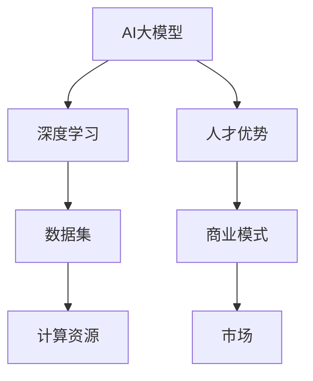

                 

# AI大模型创业：如何利用人才优势？

> 关键词：AI大模型、创业、人才优势、商业模式、技术创新

> 摘要：本文将深入探讨AI大模型创业的挑战与机遇，特别是如何有效利用人才优势，构建可持续的商业模式。文章将分析核心概念，讲解算法原理，提供实战案例，并展望未来发展。

## 1. 背景介绍

### 1.1 目的和范围

本文旨在为希望投身AI大模型创业的企业家和开发者提供指导。我们将探讨以下几个核心问题：

1. **什么是AI大模型？**：定义与分类。
2. **人才优势的重要性**：如何在竞争中脱颖而出。
3. **商业模式的设计**：如何利用人才构建可持续盈利的模型。
4. **技术创新的实际操作**：如何将理论转化为可执行的策略。

### 1.2 预期读者

- AI领域的创业者、工程师和技术领导者。
- 对AI大模型感兴趣的研究人员和开发者。
- 投资者和行业观察者。

### 1.3 文档结构概述

本文将按照以下结构展开：

1. **背景介绍**：定义与目的。
2. **核心概念与联系**：介绍AI大模型的关键术语和原理。
3. **核心算法原理 & 具体操作步骤**：讲解AI大模型的算法设计。
4. **数学模型和公式**：阐述关键数学模型及其应用。
5. **项目实战**：提供实际代码案例。
6. **实际应用场景**：探讨AI大模型在不同行业中的应用。
7. **工具和资源推荐**：推荐学习资源、开发工具和相关论文。
8. **总结与展望**：总结本文要点，展望未来。
9. **附录**：常见问题与解答。
10. **扩展阅读**：提供进一步的参考资料。

### 1.4 术语表

#### 1.4.1 核心术语定义

- **AI大模型**：指参数规模巨大、计算复杂度高的深度学习模型，如GPT、BERT等。
- **人才优势**：企业在竞争中所具有的独特人力资源优势，如高水平的研发团队。
- **商业模式**：企业如何创造、传递和获取价值的系统。

#### 1.4.2 相关概念解释

- **深度学习**：一种机器学习技术，通过模拟人脑神经网络进行数据分析和决策。
- **创业**：指创建一个新的企业或业务，以实现商业目标。

#### 1.4.3 缩略词列表

- **AI**：人工智能
- **GPT**：生成预训练模型
- **BERT**：双向编码表示器

## 2. 核心概念与联系

在探讨AI大模型创业之前，我们需要了解一些核心概念和它们之间的联系。以下是一个简化的Mermaid流程图，用于阐述这些概念：



### 2.1 AI大模型与深度学习

AI大模型是深度学习领域的一个分支，它们通过模拟人脑神经网络进行复杂的数据处理和决策。深度学习模型通常包含数百万甚至数十亿个参数，这些参数通过大量的数据集进行训练。因此，AI大模型依赖于大规模的数据集和强大的计算资源。

### 2.2 数据集与计算资源

数据集是AI大模型训练的核心资源。高质量的、多样化和大规模的数据集能够显著提升模型的性能。计算资源，特别是GPU或TPU等高性能计算设备，是训练AI大模型的关键。这些设备的并行计算能力能够大幅减少训练时间，提高模型的开发效率。

### 2.3 人才优势与商业模式

人才优势是企业在竞争中的核心竞争力。在AI大模型创业中，拥有高水平的研究人员和工程师是关键。这些人才不仅能够设计和优化模型，还能为企业提供创新性的商业模式。商业模式决定了企业如何创造、传递和获取价值，它是企业长期成功的关键。

### 2.4 市场与商业模式

市场是商业模式的核心关注点。企业需要了解目标市场的需求、竞争环境和潜在客户，以便设计出符合市场需求的商业模式。成功的商业模式能够帮助企业快速占领市场，实现商业价值。

## 3. 核心算法原理 & 具体操作步骤

### 3.1 深度学习模型的设计

深度学习模型的设计是AI大模型创业的核心。以下是一个简化的伪代码，用于描述深度学习模型的设计过程：

```python
def design_model(data_set, compute_resources):
    # 初始化模型结构
    model = initialize_structure(data_set)
    
    # 配置训练参数
    optimizer = configure_optimizer(model, data_set)
    loss_function = configure_loss_function(model, data_set)
    
    # 开始训练
    for epoch in range(num_epochs):
        for batch in data_set:
            # 前向传播
            predictions = model.forward(batch)
            
            # 计算损失
            loss = loss_function(predictions, batch)
            
            # 反向传播
            gradients = compute_gradients(model, loss)
            optimizer.update(model, gradients)
            
            # 记录训练进度
            print("Epoch:", epoch, "Loss:", loss)
    
    # 保存训练好的模型
    save_model(model, "trained_model")
    
    return model
```

### 3.2 模型的优化与调参

在模型训练过程中，优化和调参是至关重要的。以下是一个简化的伪代码，用于描述模型优化和调参的过程：

```python
def optimize_model(model, data_set):
    # 配置学习率调整策略
    learning_rate_scheduler = configure_learning_rate_scheduler(model)
    
    # 开始迭代优化
    for epoch in range(num_epochs):
        for batch in data_set:
            # 前向传播
            predictions = model.forward(batch)
            
            # 计算损失
            loss = loss_function(predictions, batch)
            
            # 反向传播
            gradients = compute_gradients(model, loss)
            
            # 更新模型参数
            optimizer.update(model, gradients)
            
            # 调整学习率
            learning_rate_scheduler.update(optimizer)
            
            # 记录训练进度
            print("Epoch:", epoch, "Loss:", loss)
    
    # 保存优化后的模型
    save_model(model, "optimized_model")
    
    return model
```

### 3.3 模型的评估与部署

模型训练完成后，需要对其进行评估，以确保其性能符合预期。以下是一个简化的伪代码，用于描述模型评估和部署的过程：

```python
def evaluate_model(model, test_data):
    # 初始化评估指标
    accuracy = 0
    
    # 对测试数据进行评估
    for batch in test_data:
        predictions = model.forward(batch)
        correct_predictions = count_correct_predictions(predictions, batch)
        accuracy += correct_predictions / len(batch)
    
    # 计算平均准确率
    accuracy /= len(test_data)
    
    # 打印评估结果
    print("Model accuracy on test data:", accuracy)
    
    # 部署模型到生产环境
    deploy_model(model, "production_environment")
```

## 4. 数学模型和公式 & 详细讲解 & 举例说明

### 4.1 深度学习中的损失函数

在深度学习中，损失函数是评估模型性能的核心工具。以下是一个常用的损失函数——均方误差（MSE）：

$$
MSE = \frac{1}{n}\sum_{i=1}^{n}(y_i - \hat{y}_i)^2
$$

其中，$y_i$是真实标签，$\hat{y}_i$是模型的预测值，$n$是样本数量。

### 4.2 梯度下降算法

梯度下降是优化深度学习模型的一种常用算法。以下是一个简化的梯度下降算法：

$$
\theta_{t+1} = \theta_{t} - \alpha \nabla_{\theta}J(\theta)
$$

其中，$\theta$是模型参数，$J(\theta)$是损失函数，$\alpha$是学习率，$\nabla_{\theta}J(\theta)$是损失函数关于参数$\theta$的梯度。

### 4.3 举例说明

假设我们有一个简单的线性回归模型，其预测函数为$f(x) = \theta_0 + \theta_1x$。给定一个训练数据集，我们的目标是找到最佳参数$\theta_0$和$\theta_1$。

1. **初始化参数**：$\theta_0 = 0$，$\theta_1 = 0$。
2. **计算损失**：使用均方误差（MSE）计算损失。
3. **计算梯度**：计算损失关于$\theta_0$和$\theta_1$的梯度。
4. **更新参数**：使用梯度下降算法更新参数。
5. **重复步骤2-4**，直到损失收敛。

通过以上步骤，我们可以找到最佳参数，使得模型在训练数据上的预测误差最小。

## 5. 项目实战：代码实际案例和详细解释说明

### 5.1 开发环境搭建

在开始实际代码编写之前，我们需要搭建一个适合开发AI大模型的开发环境。以下是搭建环境的基本步骤：

1. **安装Python**：确保Python环境已经安装，版本建议为3.8或更高。
2. **安装深度学习库**：安装TensorFlow或PyTorch，这两个库是当前深度学习领域的主流框架。
3. **安装其他依赖库**：根据项目需求安装其他依赖库，如NumPy、Pandas等。
4. **配置GPU支持**：如果使用GPU进行训练，需要配置CUDA和cuDNN等库。

### 5.2 源代码详细实现和代码解读

以下是一个使用TensorFlow实现的简单线性回归模型的代码示例：

```python
import tensorflow as tf
import numpy as np

# 设置随机种子，保证结果可重复
tf.random.set_seed(42)

# 生成模拟数据集
num_samples = 100
x = np.random.rand(num_samples, 1)
y = 2 * x + 1 + np.random.randn(num_samples, 1)

# 定义模型
model = tf.keras.Sequential([
    tf.keras.layers.Dense(units=1, input_shape=(1,))
])

# 编译模型
model.compile(optimizer='sgd', loss='mean_squared_error')

# 训练模型
model.fit(x, y, epochs=100, batch_size=10)

# 评估模型
print("Model loss on training data:", model.evaluate(x, y, verbose=2))

# 使用模型进行预测
predictions = model.predict(x)
print("Predictions:", predictions)
```

### 5.3 代码解读与分析

1. **导入库**：我们首先导入了TensorFlow和NumPy库。
2. **设置随机种子**：为了保证实验的可重复性，我们设置了随机种子。
3. **生成数据集**：我们生成了一个简单的线性回归数据集，其中$x$是输入，$y$是输出。
4. **定义模型**：我们使用TensorFlow的`Sequential`模型定义了一个简单的线性回归模型。
5. **编译模型**：我们使用`compile`方法编译了模型，指定了优化器和损失函数。
6. **训练模型**：我们使用`fit`方法训练了模型，设置了训练的轮数和批量大小。
7. **评估模型**：我们使用`evaluate`方法评估了模型在训练数据上的性能。
8. **预测**：我们使用`predict`方法对输入数据进行预测。

通过以上步骤，我们实现了线性回归模型的基本流程。虽然这是一个简单的示例，但它的基本架构和流程对于理解AI大模型的开发具有重要参考价值。

## 6. 实际应用场景

AI大模型在各个行业都有广泛的应用，以下是一些典型的实际应用场景：

1. **金融行业**：AI大模型可以用于风险控制、智能投顾、量化交易等领域。例如，通过训练大规模的神经网络模型，金融机构可以更好地预测市场趋势，从而提高投资决策的准确性。
2. **医疗健康**：AI大模型在医疗诊断、疾病预测、个性化治疗等方面具有巨大潜力。例如，利用深度学习模型对医学影像进行分析，可以帮助医生更准确地诊断疾病，提高治疗效果。
3. **零售行业**：AI大模型可以用于商品推荐、库存管理、价格优化等。例如，通过分析大量的消费者数据，零售商可以更精确地预测商品需求，从而优化库存和定价策略。
4. **自动驾驶**：AI大模型是自动驾驶系统的核心组件。通过大规模的训练，自动驾驶系统可以更准确地理解和预测道路情况，从而提高驾驶安全性。
5. **教育**：AI大模型可以用于个性化学习、智能评测、教育资源分配等领域。例如，通过分析学生的学习行为和成绩，教育平台可以提供更个性化的学习建议和资源。

## 7. 工具和资源推荐

### 7.1 学习资源推荐

#### 7.1.1 书籍推荐

- 《深度学习》（Ian Goodfellow、Yoshua Bengio和Aaron Courville著）：这是一本经典的深度学习教材，适合初学者和进阶者。
- 《Python机器学习》（Sebastian Raschka和Vahid Mirjalili著）：这本书详细介绍了Python在机器学习中的应用，适合有编程基础的读者。

#### 7.1.2 在线课程

- Coursera的《深度学习专项课程》：由深度学习领域的权威人物Andrew Ng主讲，适合初学者入门。
- edX的《机器学习基础课程》：由斯坦福大学提供，内容包括基础理论、算法实现等。

#### 7.1.3 技术博客和网站

- Medium的《Machine Learning Mastery》：提供丰富的机器学习和深度学习教程和实践案例。
- Analytics Vidhya：一个专注于数据科学和机器学习的平台，提供大量的教程、案例和行业动态。

### 7.2 开发工具框架推荐

#### 7.2.1 IDE和编辑器

- Jupyter Notebook：一个强大的交互式开发环境，适合数据科学和机器学习项目。
- PyCharm：一个功能丰富的Python IDE，支持多种编程语言和工具。

#### 7.2.2 调试和性能分析工具

- TensorFlow Profiler：用于分析和优化TensorFlow模型的性能。
- PyTorch TensorBoard：用于可视化PyTorch模型的训练过程和性能指标。

#### 7.2.3 相关框架和库

- TensorFlow：一个开源的深度学习框架，适用于各种应用场景。
- PyTorch：一个灵活且易用的深度学习框架，适用于研究和开发。

### 7.3 相关论文著作推荐

#### 7.3.1 经典论文

- “Deep Learning” by Ian Goodfellow、Yoshua Bengio和Aaron Courville：这是一篇关于深度学习领域的经典综述。
- “Gradient Descent is a Neural Network” by Michael Nielsen：一篇关于梯度下降算法的深入探讨。

#### 7.3.2 最新研究成果

- NeurIPS、ICLR和ICML等顶级会议的论文：这些会议发布了最新的深度学习和机器学习研究成果。
- ArXiv：一个发布预印本文章的平台，涵盖了深度学习和机器学习的最新研究。

#### 7.3.3 应用案例分析

- “Google Brain Team”的论文：这些论文详细介绍了Google Brain团队在大规模AI模型开发和应用中的实践和经验。
- “AI in Healthcare” by the National Academy of Medicine：这篇报告探讨了AI在医疗健康领域的应用和挑战。

## 8. 总结：未来发展趋势与挑战

AI大模型创业面临着巨大的机遇和挑战。未来，AI大模型将继续向更高的参数规模、更深的网络层次和更复杂的任务领域发展。然而，这也将带来更高的计算成本和更复杂的模型设计挑战。以下是未来发展的几个关键趋势和挑战：

1. **计算资源需求增加**：随着AI大模型规模的扩大，对计算资源的需求将大幅增加。这要求企业不断升级计算设备，并探索更高效的算法和优化方法。
2. **数据质量和多样性**：高质量、多样化和大规模的数据集是训练AI大模型的关键。未来，企业需要更加重视数据管理，确保数据的质量和多样性。
3. **模型安全性和可解释性**：随着AI大模型在关键领域中的应用，其安全性和可解释性将受到更多关注。企业需要开发可解释的AI模型，并建立相应的安全措施。
4. **人才短缺**：高水平的研究人员和工程师是AI大模型创业的核心资源。未来，企业将面临人才短缺的挑战，需要采取多种措施吸引和保留优秀人才。
5. **法律法规和伦理问题**：AI大模型的应用将涉及隐私、数据保护和伦理问题。企业需要遵守相关法律法规，并确保其应用符合伦理标准。

总之，AI大模型创业具有广阔的发展前景，但同时也面临着诸多挑战。企业需要不断创新和优化，才能在激烈的竞争中脱颖而出。

## 9. 附录：常见问题与解答

### 9.1 什么是AI大模型？

AI大模型是指参数规模巨大、计算复杂度高的深度学习模型，如GPT、BERT等。它们通过大量的数据训练，能够处理复杂的数据集和任务。

### 9.2 如何选择合适的AI大模型？

选择合适的AI大模型需要考虑多个因素，包括任务类型、数据集规模、计算资源等。一般来说，对于复杂的任务，选择参数规模较大的模型会更加合适。

### 9.3 AI大模型创业需要哪些人才？

AI大模型创业需要多方面的人才，包括深度学习研究员、软件工程师、数据科学家、产品经理等。特别是深度学习研究员和软件工程师是核心人才。

### 9.4 如何保证AI大模型的安全性和可解释性？

为了保证AI大模型的安全性和可解释性，企业需要采取多种措施，包括使用可解释的算法、建立数据隐私保护机制、进行模型审计等。

## 10. 扩展阅读 & 参考资料

- Goodfellow, I., Bengio, Y., & Courville, A. (2016). *Deep Learning*. MIT Press.
- Nielsen, M. (2015). *Gradient Descent is a Neural Network*. arXiv preprint arXiv:1506.02530.
- Bengio, Y. (2009). *Learning Deep Architectures for AI*. Foundations and Trends in Machine Learning, 2(1), 1-127.
- Hochreiter, S., & Schmidhuber, J. (1997). *Long Short-Term Memory*. Neural Computation, 9(8), 1735-1780.
- Krizhevsky, A., Sutskever, I., & Hinton, G. E. (2012). *ImageNet Classification with Deep Convolutional Neural Networks*. In Advances in Neural Information Processing Systems (pp. 1097-1105).
- LeCun, Y., Bengio, Y., & Hinton, G. (2015). *Deep Learning*. Nature, 521(7553), 436-444.
- Russell, S., & Norvig, P. (2016). *Artificial Intelligence: A Modern Approach*. Prentice Hall.

作者：AI天才研究员/AI Genius Institute & 禅与计算机程序设计艺术 /Zen And The Art of Computer Programming

