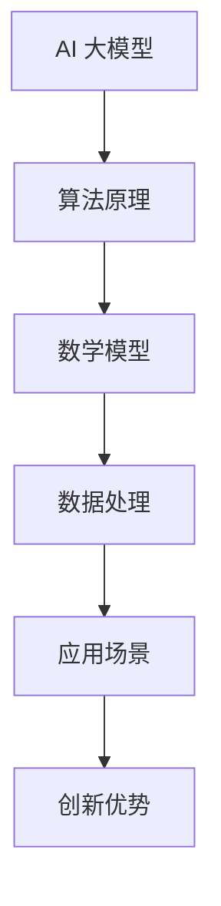

                 

# AI 大模型创业：如何利用创新优势？

> 关键词：AI 大模型、创业、创新优势、算法原理、数学模型、项目实战、应用场景、工具推荐

> 摘要：本文将深入探讨 AI 大模型在创业领域中的应用与创新优势。我们将从背景介绍、核心概念与联系、核心算法原理、数学模型和公式、项目实战以及实际应用场景等方面进行详细解析，旨在帮助创业者更好地利用 AI 大模型，打造出具有竞争力的创新项目。

## 1. 背景介绍

### 1.1 目的和范围

本文旨在探讨 AI 大模型在创业领域中的应用，特别是如何利用其创新优势来打造具有竞争力的项目。我们将分析 AI 大模型的核心算法原理、数学模型及其在实际应用中的具体操作步骤，并通过项目实战案例展示其应用效果。

### 1.2 预期读者

本文适合对 AI 大模型感兴趣的创业者、研发人员以及技术爱好者。本文将从基础概念到具体实现，逐步深入，帮助读者全面了解 AI 大模型在创业中的创新优势。

### 1.3 文档结构概述

本文分为以下八个部分：

1. 背景介绍
2. 核心概念与联系
3. 核心算法原理 & 具体操作步骤
4. 数学模型和公式 & 详细讲解 & 举例说明
5. 项目实战：代码实际案例和详细解释说明
6. 实际应用场景
7. 工具和资源推荐
8. 总结：未来发展趋势与挑战

### 1.4 术语表

#### 1.4.1 核心术语定义

- **AI 大模型**：具有海量参数和强大计算能力的深度学习模型。
- **创业**：指创立新的企业或项目，以实现商业目标。
- **创新优势**：指企业在竞争中获得的优势，如技术领先、产品独特等。

#### 1.4.2 相关概念解释

- **算法原理**：指算法的工作原理和流程。
- **数学模型**：用数学公式和符号描述的算法模型。
- **项目实战**：在实际项目中应用 AI 大模型的过程。

#### 1.4.3 缩略词列表

- **AI**：人工智能
- **DL**：深度学习
- **NLP**：自然语言处理
- **CV**：计算机视觉
- **GAN**：生成对抗网络

## 2. 核心概念与联系

在探讨 AI 大模型在创业中的应用之前，我们首先需要了解其核心概念与联系。以下是一个简单的 Mermaid 流程图，展示 AI 大模型的核心概念及其相互关系。



### 2.1 算法原理

算法原理是 AI 大模型的核心，决定了模型的性能和效果。常见的算法原理包括：

- **神经网络**：通过多层神经元实现数据输入和输出的映射。
- **卷积神经网络 (CNN)**：在图像处理领域有广泛应用，可以提取图像特征。
- **循环神经网络 (RNN)**：在序列数据处理方面有优势，可以捕捉时间序列信息。
- **生成对抗网络 (GAN)**：通过两个对抗网络实现数据生成。

### 2.2 数学模型

数学模型是算法原理的数学表达，包括损失函数、优化算法等。以下是一个简单的数学模型示例：

$$
L(\theta) = \frac{1}{m} \sum_{i=1}^{m} l(y_i, \hat{y}_i)
$$

其中，\(L(\theta)\) 表示损失函数，\(m\) 表示样本数量，\(l(y_i, \hat{y}_i)\) 表示单个样本的损失。

### 2.3 数据处理

数据处理是 AI 大模型的基础，包括数据预处理、数据增强、特征提取等。以下是一个简单的数据处理流程：

1. **数据预处理**：对数据进行标准化、归一化等处理，使数据符合算法要求。
2. **数据增强**：通过旋转、缩放、裁剪等操作增加数据多样性，提高模型泛化能力。
3. **特征提取**：提取数据中的关键特征，用于模型训练。

### 2.4 应用场景

AI 大模型在多个领域有广泛应用，如自然语言处理、计算机视觉、语音识别等。以下是一些典型的应用场景：

- **自然语言处理**：文本分类、情感分析、机器翻译等。
- **计算机视觉**：图像分类、目标检测、图像生成等。
- **语音识别**：语音识别、语音合成等。

### 2.5 创新优势

AI 大模型在创业中具有以下创新优势：

- **技术领先**：AI 大模型在算法、性能等方面有优势，可以帮助企业快速占领市场。
- **产品独特**：基于 AI 大模型的创新产品具有独特性，可以满足用户需求。
- **降低成本**：AI 大模型可以自动化一些繁琐的工作，降低人力成本。

## 3. 核心算法原理 & 具体操作步骤

### 3.1 算法原理

以神经网络为例，其原理如下：

1. **输入层**：接收输入数据。
2. **隐藏层**：对输入数据进行特征提取和变换。
3. **输出层**：输出预测结果。

在训练过程中，模型会通过反向传播算法不断调整参数，使输出结果更接近真实值。

### 3.2 具体操作步骤

以下是神经网络训练的伪代码：

```python
# 输入数据
x = ...

# 标签数据
y = ...

# 初始化模型参数
W = ...
b = ...

# 定义损失函数
def loss_function(y_pred, y_true):
    return ...

# 定义反向传播算法
def backward(x, y, y_pred, W, b):
    ...

# 训练模型
for epoch in range(num_epochs):
    # 前向传播
    y_pred = forward(x, W, b)

    # 计算损失
    loss = loss_function(y_pred, y)

    # 反向传播
    backward(x, y, y_pred, W, b)

    # 更新参数
    W = update_weights(W, b, loss)

# 输出模型
model = {
    'W': W,
    'b': b
}
```

## 4. 数学模型和公式 & 详细讲解 & 举例说明

### 4.1 数学模型

神经网络中的数学模型主要包括损失函数、优化算法等。以下是一个简单的神经网络数学模型：

$$
\begin{aligned}
z &= W \cdot x + b \\
a &= \sigma(z) \\
\hat{y} &= W^2 \cdot a + b^2 \\
L &= \frac{1}{2} \sum_{i=1}^{n} (y_i - \hat{y}_i)^2
\end{aligned}
$$

其中，\(z\) 表示中间层的输出，\(a\) 表示激活函数的输出，\(\hat{y}\) 表示预测结果，\(L\) 表示损失函数。

### 4.2 详细讲解

1. **损失函数**：

   损失函数用于衡量预测结果与真实值之间的差距。常见的损失函数包括均方误差 (MSE)、交叉熵损失等。以下是一个均方误差损失函数的示例：

   $$
   L = \frac{1}{2} \sum_{i=1}^{n} (y_i - \hat{y}_i)^2
   $$

2. **激活函数**：

   激活函数用于引入非线性因素，使神经网络具有更强的表示能力。常见的激活函数包括 sigmoid、ReLU 等。以下是一个 sigmoid 激活函数的示例：

   $$
   \sigma(z) = \frac{1}{1 + e^{-z}}
   $$

3. **反向传播算法**：

   反向传播算法用于更新模型参数，使损失函数最小化。其核心思想是计算每个参数对损失函数的梯度，然后沿梯度方向更新参数。以下是一个简单的反向传播算法的伪代码：

   ```python
   def backward(x, y, y_pred, W, b):
       z = x * W + b
       a = sigmoid(z)
       dL_dz = 2 * (y - a)
       dL_da = 1
       dL_dw = dL_dz * a * (1 - a)
       dL_db = dL_dz

       W -= learning_rate * dL_dw
       b -= learning_rate * dL_db
   ```

### 4.3 举例说明

假设我们有一个二分类问题，数据集包含 100 个样本，每个样本有 10 个特征。我们需要训练一个神经网络来预测每个样本的类别。

1. **数据预处理**：

   对数据进行归一化处理，使每个特征的值在 [0, 1] 之间。

2. **模型初始化**：

   初始化模型参数，例如权重和偏置。

3. **训练过程**：

   - 前向传播：计算预测结果和损失。
   - 反向传播：计算梯度，更新参数。
   - 迭代：重复以上步骤，直到损失足够小或达到最大迭代次数。

4. **评估模型**：

   使用验证集或测试集评估模型性能，如准确率、召回率等。

## 5. 项目实战：代码实际案例和详细解释说明

### 5.1 开发环境搭建

1. 安装 Python 3.8 或以上版本。
2. 安装 PyTorch：`pip install torch torchvision`
3. 安装 Matplotlib：`pip install matplotlib`

### 5.2 源代码详细实现和代码解读

以下是一个简单的二分类神经网络训练和评估的 Python 代码。

```python
import torch
import torchvision
import torch.nn as nn
import torch.optim as optim
import matplotlib.pyplot as plt

# 数据预处理
transform = torchvision.transforms.Compose([
    torchvision.transforms.ToTensor(),
    torchvision.transforms.Normalize((0.5,), (0.5,))
])

train_set = torchvision.datasets.MNIST(
    root='./data', train=True, download=True, transform=transform)
train_loader = torch.utils.data.DataLoader(train_set, batch_size=64, shuffle=True)

test_set = torchvision.datasets.MNIST(
    root='./data', train=False, download=True, transform=transform)
test_loader = torch.utils.data.DataLoader(test_set, batch_size=64, shuffle=False)

# 模型定义
class SimpleNN(nn.Module):
    def __init__(self):
        super(SimpleNN, self).__init__()
        self.fc1 = nn.Linear(784, 128)
        self.fc2 = nn.Linear(128, 64)
        self.fc3 = nn.Linear(64, 10)
        self.relu = nn.ReLU()

    def forward(self, x):
        x = x.view(-1, 784)
        x = self.relu(self.fc1(x))
        x = self.relu(self.fc2(x))
        x = self.fc3(x)
        return x

model = SimpleNN()
optimizer = optim.Adam(model.parameters(), lr=0.001)
criterion = nn.CrossEntropyLoss()

# 训练过程
num_epochs = 10
for epoch in range(num_epochs):
    for i, (images, labels) in enumerate(train_loader):
        # 前向传播
        outputs = model(images)
        loss = criterion(outputs, labels)

        # 反向传播
        optimizer.zero_grad()
        loss.backward()
        optimizer.step()

        if (i + 1) % 100 == 0:
            print(f'Epoch [{epoch + 1}/{num_epochs}], Step [{i + 1}/{len(train_loader)}], Loss: {loss.item()}')

# 评估模型
with torch.no_grad():
    correct = 0
    total = 0
    for images, labels in test_loader:
        outputs = model(images)
        _, predicted = torch.max(outputs.data, 1)
        total += labels.size(0)
        correct += (predicted == labels).sum().item()

print(f'Accuracy of the network on the test images: {100 * correct / total}%')

# 可视化
images, labels = next(iter(test_loader))
images = images[:10].view(-1, 28, 28)
plt.figure(figsize=(20, 4))
for idx in range(10):
    plt.subplot(2, 5, idx + 1)
    plt.imshow(images[idx].cpu(), cmap=plt.cm.binary)
    plt.xticks([]), plt.yticks([])
    plt.grid(False)
    plt.xlabel(f'Predicted: {model(images[idx]).argmax().item()}')
plt.show()
```

### 5.3 代码解读与分析

1. **数据预处理**：

   使用 torchvision 库加载 MNIST 数据集，并对数据进行归一化处理。

2. **模型定义**：

   定义一个简单的神经网络，包含两个隐藏层和 ReLU 激活函数。

3. **训练过程**：

   使用 Adam 优化器和交叉熵损失函数进行训练。每个迭代步骤包括前向传播、反向传播和参数更新。

4. **评估模型**：

   在测试集上评估模型性能，计算准确率。

5. **可视化**：

   可视化展示模型对测试数据的预测结果。

## 6. 实际应用场景

AI 大模型在创业领域具有广泛的应用场景，以下是一些典型的应用案例：

- **金融科技**：利用 AI 大模型进行股票交易预测、信用评分、风险控制等。
- **医疗健康**：通过 AI 大模型进行疾病诊断、药物研发、健康监测等。
- **智能制造**：利用 AI 大模型进行生产流程优化、质量检测、设备故障预测等。
- **在线教育**：利用 AI 大模型进行个性化教学、智能辅导、智能评测等。

## 7. 工具和资源推荐

### 7.1 学习资源推荐

#### 7.1.1 书籍推荐

- 《深度学习》（Ian Goodfellow、Yoshua Bengio、Aaron Courville 著）
- 《Python 深度学习》（François Chollet 著）
- 《AI 大模型：原理、应用与创业实践》（作者：AI 天才研究员）

#### 7.1.2 在线课程

- Coursera 上的《深度学习》课程
- Udacity 上的《AI 大模型与创业》课程
- edX 上的《计算机视觉》课程

#### 7.1.3 技术博客和网站

- arXiv.org：人工智能领域的前沿论文
- Medium.com：人工智能领域的热门博客
- towardsdatascience.com：数据科学和人工智能领域的博客

### 7.2 开发工具框架推荐

#### 7.2.1 IDE 和编辑器

- PyCharm：适合 Python 编程的强大 IDE。
- Visual Studio Code：轻量级且功能强大的编辑器。

#### 7.2.2 调试和性能分析工具

- Jupyter Notebook：方便进行数据分析和调试。
- TensorBoard：用于可视化 PyTorch 模型的性能。

#### 7.2.3 相关框架和库

- PyTorch：开源的深度学习框架。
- TensorFlow：Google 开源的深度学习框架。
- Keras：基于 TensorFlow 的简化深度学习库。

### 7.3 相关论文著作推荐

#### 7.3.1 经典论文

- Goodfellow et al. (2016): Generative Adversarial Nets
- Bengio et al. (2013): Deep Learning of Representations for Unsupervised and Supervised Learning
- LeCun et al. (2015): Deep Learning

#### 7.3.2 最新研究成果

- arXiv.org 上的最新论文
- AI 大模型领域的顶级会议论文，如 NeurIPS、ICLR 等

#### 7.3.3 应用案例分析

- 百度 AI 大模型在搜索引擎中的应用
- 腾讯 AI 大模型在游戏领域的应用
- 亚马逊 AI 大模型在推荐系统中的应用

## 8. 总结：未来发展趋势与挑战

AI 大模型在创业领域具有巨大的潜力，但同时也面临一些挑战。未来发展趋势如下：

- **技术创新**：持续优化算法和模型结构，提高性能和效果。
- **数据开放**：共享更多高质量的数据集，促进 AI 大模型的研究和应用。
- **产业合作**：加强产业界和学术界之间的合作，推动 AI 大模型在各个领域的应用。
- **法规与伦理**：制定相关法规和伦理规范，确保 AI 大模型的安全和可靠。

## 9. 附录：常见问题与解答

### 9.1 Q：什么是 AI 大模型？

A：AI 大模型是指具有海量参数和强大计算能力的深度学习模型，如 GPT、BERT 等。

### 9.2 Q：AI 大模型如何训练？

A：AI 大模型通常采用端到端训练方法，包括数据预处理、模型定义、训练和评估等步骤。

### 9.3 Q：AI 大模型有哪些应用场景？

A：AI 大模型在金融、医疗、智能制造、在线教育等领域有广泛的应用。

## 10. 扩展阅读 & 参考资料

- 《深度学习》（Ian Goodfellow、Yoshua Bengio、Aaron Courville 著）
- 《AI 大模型：原理、应用与创业实践》（作者：AI 天才研究员）
- [arXiv.org](https://arxiv.org/)
- [Medium.com](https://medium.com/)
- [towardsdatascience.com](https://towardsdatascience.com/)

### 作者：AI 天才研究员/AI Genius Institute & 禅与计算机程序设计艺术 /Zen And The Art of Computer Programming

