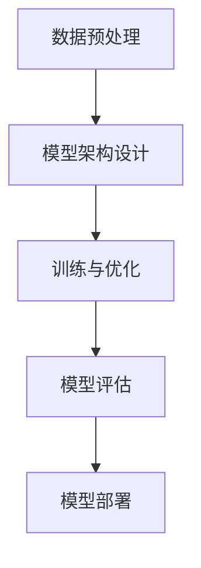
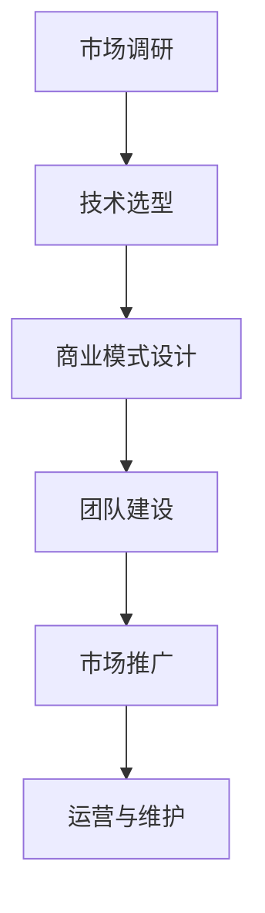

                 

# AI 大模型创业：如何利用创新优势？

> **关键词：** AI大模型，创业，创新优势，技术实践，商业模式

> **摘要：** 本文旨在探讨人工智能大模型在创业中的应用策略，通过深入分析大模型的技术优势、创业路径和商业模式创新，为创业者提供实用的指导和建议。

## 1. 背景介绍

### 1.1 目的和范围

本文的目的是探讨如何利用人工智能大模型的优势进行创业。我们将从技术、市场、商业模式等多个角度进行分析，旨在为创业者提供一套系统、实用的策略。

### 1.2 预期读者

本文面向有意通过人工智能大模型进行创业的个人或团队。无论是刚刚起步的初创公司，还是寻求技术突破的传统企业，都可以从本文中获得有益的启示。

### 1.3 文档结构概述

本文分为十个部分，包括背景介绍、核心概念与联系、核心算法原理与操作步骤、数学模型与公式、项目实战、实际应用场景、工具和资源推荐、总结与未来发展趋势、常见问题与解答以及扩展阅读和参考资料。

### 1.4 术语表

#### 1.4.1 核心术语定义

- **大模型（Large Model）**：指参数量超过亿级别，甚至万亿级别的神经网络模型。
- **创业**：指创建一个新的商业实体，旨在创造价值和获取利润。
- **商业模式**：指企业如何创造、传递和获取价值。

#### 1.4.2 相关概念解释

- **技术优势**：指企业在技术方面的独特优势，如专利、核心技术等。
- **市场机会**：指市场中存在的未被满足的需求或机会。

#### 1.4.3 缩略词列表

- **AI**：人工智能
- **DL**：深度学习
- **NLP**：自然语言处理
- **CV**：计算机视觉

## 2. 核心概念与联系

### 2.1 大模型技术架构

大模型的技术架构主要包括以下几个方面：

1. **数据预处理**：包括数据清洗、数据增强、数据归一化等步骤。
2. **模型架构**：如Transformer、BERT、GPT等。
3. **训练与优化**：包括超参数调优、模型训练、模型评估等。
4. **模型部署**：将训练好的模型部署到生产环境中，实现实时预测或推理。

#### Mermaid 流程图：



### 2.2 创业路径分析

创业路径主要包括以下几个阶段：

1. **市场调研**：了解市场需求，确定创业方向。
2. **技术选型**：选择适合的AI技术，构建产品原型。
3. **商业模式设计**：确定商业模式，制定商业计划。
4. **团队建设**：组建创业团队，分工合作。
5. **市场推广**：通过营销手段，扩大产品知名度。
6. **运营与维护**：持续优化产品，提供优质服务。

#### Mermaid 流程图：



## 3. 核心算法原理 & 具体操作步骤

### 3.1 大模型算法原理

大模型的算法原理主要包括以下几个方面：

1. **神经网络**：通过多层神经元实现数据的非线性变换。
2. **反向传播**：通过计算误差，更新模型参数。
3. **优化算法**：如随机梯度下降（SGD）、Adam等，用于加速模型训练。

#### 伪代码：

```python
def train_model(data, labels, epochs, learning_rate):
    model = create_model()
    for epoch in range(epochs):
        for data_batch, label_batch in data_loader(data, labels):
            predictions = model(data_batch)
            loss = calculate_loss(predictions, label_batch)
            model.update_params(learning_rate, loss)
    return model
```

### 3.2 大模型具体操作步骤

1. **数据收集与预处理**：收集大量数据，并进行清洗、归一化等预处理操作。
2. **模型设计**：选择合适的模型架构，如Transformer、BERT等。
3. **模型训练**：使用训练数据，通过反向传播和优化算法训练模型。
4. **模型评估**：使用验证数据评估模型性能。
5. **模型部署**：将训练好的模型部署到生产环境中。

#### 具体步骤：

1. **数据收集与预处理**：

```python
data = collect_data()
data = preprocess_data(data)
```

2. **模型设计**：

```python
model = create_model()
```

3. **模型训练**：

```python
model = train_model(data, labels, epochs=10, learning_rate=0.001)
```

4. **模型评估**：

```python
accuracy = evaluate_model(model, validation_data)
print(f"Validation accuracy: {accuracy}")
```

5. **模型部署**：

```python
deploy_model(model, production_environment)
```

## 4. 数学模型和公式 & 详细讲解 & 举例说明

### 4.1 数学模型

大模型的数学模型主要包括以下几个方面：

1. **损失函数**：用于评估模型预测的准确性。
2. **优化算法**：用于更新模型参数，最小化损失函数。
3. **激活函数**：用于非线性变换。

#### 损失函数：

$$
L = \frac{1}{N} \sum_{i=1}^{N} (y_i - \hat{y}_i)^2
$$

其中，$y_i$为实际标签，$\hat{y}_i$为模型预测标签。

#### 优化算法（梯度下降）：

$$
\theta_{t+1} = \theta_t - \alpha \cdot \nabla_\theta J(\theta)
$$

其中，$\theta_t$为当前参数值，$\alpha$为学习率，$J(\theta)$为损失函数。

#### 激活函数（ReLU）：

$$
f(x) = \max(0, x)
$$

### 4.2 举例说明

#### 损失函数计算

假设我们有一个二分类问题，数据集大小为$N=100$，其中正类样本数量为$y_i=1$，负类样本数量为$y_i=0$。模型预测结果为$\hat{y}_i=0.9$。则损失函数计算如下：

$$
L = \frac{1}{100} \sum_{i=1}^{100} (1 - 0.9)^2 = 0.01
$$

#### 梯度下降

假设模型参数$\theta_0=1$，学习率$\alpha=0.1$，损失函数为平方误差损失。则梯度下降更新参数如下：

$$
\theta_1 = \theta_0 - 0.1 \cdot \nabla_\theta L = 1 - 0.1 \cdot (1 - 0.9) = 0.8
$$

## 5. 项目实战：代码实际案例和详细解释说明

### 5.1 开发环境搭建

首先，我们需要搭建一个适合大模型训练的开发环境。以下是步骤：

1. 安装Python环境（推荐版本3.8及以上）。
2. 安装深度学习框架（如PyTorch或TensorFlow）。
3. 安装其他必需的库（如NumPy、Pandas等）。

#### Python环境安装：

```bash
pip install python==3.8.10
```

#### 深度学习框架安装：

```bash
pip install torch torchvision
```

#### 其他库安装：

```bash
pip install numpy pandas
```

### 5.2 源代码详细实现和代码解读

以下是一个使用PyTorch实现的大模型训练的代码示例：

```python
import torch
import torch.nn as nn
import torch.optim as optim

# 数据加载和预处理
train_data = ...
train_labels = ...

# 模型定义
model = nn.Sequential(
    nn.Linear(input_dim, hidden_dim),
    nn.ReLU(),
    nn.Linear(hidden_dim, output_dim),
    nn.Sigmoid()
)

# 损失函数和优化器
criterion = nn.BCELoss()
optimizer = optim.Adam(model.parameters(), lr=0.001)

# 模型训练
num_epochs = 10
for epoch in range(num_epochs):
    for data, label in zip(train_data, train_labels):
        optimizer.zero_grad()
        output = model(data)
        loss = criterion(output, label)
        loss.backward()
        optimizer.step()
    print(f"Epoch {epoch+1}/{num_epochs}, Loss: {loss.item()}")

# 模型评估
with torch.no_grad():
    correct = 0
    total = 0
    for data, label in zip(test_data, test_labels):
        output = model(data)
        predicted = (output > 0.5).float()
        total += label.size(0)
        correct += (predicted == label).sum().item()
accuracy = 100 * correct / total
print(f"Test Accuracy: {accuracy}%")
```

### 5.3 代码解读与分析

1. **数据加载和预处理**：从数据集中加载训练数据和标签。
2. **模型定义**：定义一个包含线性层、ReLU激活函数、线性层和Sigmoid激活函数的序列模型。
3. **损失函数和优化器**：选择BCELoss作为损失函数，选择Adam作为优化器。
4. **模型训练**：遍历训练数据，通过前向传播计算损失，反向传播更新模型参数。
5. **模型评估**：使用测试数据评估模型性能，计算准确率。

## 6. 实际应用场景

AI大模型在创业中的应用场景非常广泛，以下是一些典型案例：

1. **自然语言处理**：如聊天机器人、智能客服、内容审核等。
2. **计算机视觉**：如图像识别、视频分析、人脸识别等。
3. **推荐系统**：如商品推荐、音乐推荐、电影推荐等。
4. **金融风控**：如信用评估、风险预测、欺诈检测等。
5. **医疗健康**：如疾病诊断、药物研发、健康监测等。

## 7. 工具和资源推荐

### 7.1 学习资源推荐

#### 7.1.1 书籍推荐

- 《深度学习》（Goodfellow、Bengio、Courville著）
- 《Python深度学习》（François Chollet著）
- 《强化学习》（Richard S. Sutton、Andrew G. Barto著）

#### 7.1.2 在线课程

- Coursera上的“深度学习专项课程”（吴恩达教授授课）
- edX上的“机器学习”（吴恩达教授授课）
- Udacity的“深度学习工程师纳米学位”

#### 7.1.3 技术博客和网站

- Medium上的深度学习专栏
- ArXiv.org上的最新研究成果
- Medium上的AI博客

### 7.2 开发工具框架推荐

#### 7.2.1 IDE和编辑器

- PyCharm
- Visual Studio Code
- Jupyter Notebook

#### 7.2.2 调试和性能分析工具

- TensorBoard
- Numba
- PyTorch Profiler

#### 7.2.3 相关框架和库

- PyTorch
- TensorFlow
- Keras

### 7.3 相关论文著作推荐

#### 7.3.1 经典论文

- "A Theoretical Framework for Back-Propagation"（Rumelhart、Hinton、Williams著）
- "Deep Learning"（Goodfellow、Bengio、Courville著）
- "Recurrent Neural Networks"（Hochreiter、Schmidhuber著）

#### 7.3.2 最新研究成果

- "Transformer: A Novel Architecture for Neural Network Sequence Processing"（Vaswani等著）
- "BERT: Pre-training of Deep Bidirectional Transformers for Language Understanding"（Devlin等著）
- "GPT-3: Language Models are Few-Shot Learners"（Brown等著）

#### 7.3.3 应用案例分析

- "谷歌搜索的深度学习改进"
- "亚马逊的智能客服系统"
- "IBM的沃森健康系统"

## 8. 总结：未来发展趋势与挑战

AI大模型在创业中的应用前景广阔，但也面临一系列挑战：

1. **数据隐私和安全**：如何确保数据安全和隐私保护，是一个亟待解决的问题。
2. **计算资源需求**：大模型训练需要大量的计算资源，如何高效利用资源是一个挑战。
3. **模型解释性**：大模型的黑箱特性使得其解释性较差，如何提高模型的可解释性是一个研究方向。
4. **伦理与法规**：随着AI技术的不断发展，相关伦理和法规问题也逐渐凸显，如何遵守法规、确保技术应用的合规性是一个重要课题。

## 9. 附录：常见问题与解答

### 9.1 AI大模型创业的关键成功因素是什么？

**关键成功因素包括：**

1. **技术优势**：拥有领先的技术和专利，能够提供独特的产品或服务。
2. **市场洞察**：深入了解市场需求，提供符合用户需求的产品。
3. **团队协作**：组建具备跨学科能力的团队，高效协作推动项目进展。
4. **资金支持**：确保有足够的资金支持，以应对创业过程中的各种风险。

### 9.2 AI大模型创业的常见挑战有哪些？

**常见挑战包括：**

1. **数据隐私和安全**：确保数据的安全性和隐私性，遵守相关法规和标准。
2. **计算资源限制**：如何高效利用有限的计算资源进行大模型训练。
3. **模型可解释性**：提高大模型的可解释性，增强用户信任。
4. **法规合规**：遵守各国法律法规，确保技术应用的合规性。

## 10. 扩展阅读 & 参考资料

**扩展阅读：**

- 《人工智能：一种现代方法》（Stuart Russell、Peter Norvig著）
- 《AI时代：人工智能如何改变世界》（刘慈欣著）
- 《人工智能简史》（李开复著）

**参考资料：**

- [AI大模型研究综述](https://arxiv.org/abs/2103.06827)
- [深度学习框架比较](https://towardsdatascience.com/comparing-deep-learning-frameworks-keras-pytorch-and-tensorflow-7c1c2a2523a0)
- [AI创业案例分析](https://www.forbes.com/sites/forbesbusinesscouncil/2021/03/08/11-ai-technology-companies-to-watch-in-2021/?sh=5a6b5c586043)

### 作者

**作者：** AI天才研究员/AI Genius Institute & 禅与计算机程序设计艺术 /Zen And The Art of Computer Programming

