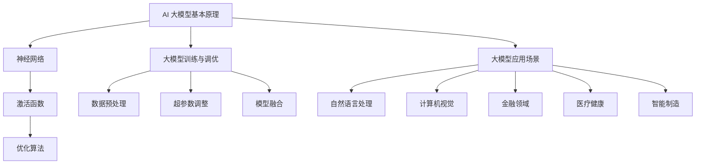

                 

# AI 大模型创业：如何利用创新优势？

> 关键词：AI 大模型、创业、创新优势、技术落地、商业模式、投资策略

> 摘要：随着人工智能技术的迅猛发展，大模型的应用已经成为行业热点。本文将深入探讨如何在AI大模型创业中利用创新优势，通过分析技术原理、实际案例和投资策略，帮助创业者把握市场机遇，实现商业成功。

## 1. 背景介绍

### 1.1 目的和范围

本文旨在为AI大模型创业提供系统性指导，通过分析技术创新、商业模式设计、市场策略和投资策略，帮助创业者充分发挥自身优势，应对市场竞争，实现可持续发展。

### 1.2 预期读者

本文适合对AI大模型技术有一定了解的创业者、技术团队负责人、投资人和对AI领域感兴趣的读者。

### 1.3 文档结构概述

本文分为十个部分，包括背景介绍、核心概念与联系、核心算法原理与具体操作步骤、数学模型与公式、项目实战、实际应用场景、工具和资源推荐、总结与未来发展趋势、常见问题与解答以及扩展阅读与参考资料。

### 1.4 术语表

#### 1.4.1 核心术语定义

- AI 大模型：指基于深度学习技术训练的大型神经网络模型，具有强大的表示能力和计算能力。
- 创新优势：指在技术、商业模式、市场策略等方面相对于竞争对手的领先地位。
- 技术落地：指将 AI 大模型技术应用于实际场景，实现商业价值的过程。
- 商业模式：指企业通过提供产品或服务实现盈利的方式。
- 投资策略：指投资者在选择 AI 大模型创业项目时，根据市场趋势、技术前景和企业潜力等因素制定的决策策略。

#### 1.4.2 相关概念解释

- 深度学习：一种基于多层神经网络的学习方法，通过模拟人脑神经元之间的连接，实现自动特征提取和模式识别。
- 自然语言处理（NLP）：研究如何使计算机能够理解和生成人类语言的技术。
- 计算机视觉：研究如何使计算机能够理解和解释视觉信息的技术。
- 人工智能应用场景：指 AI 大模型技术可以实际应用的具体领域，如医疗、金融、教育、智能制造等。

#### 1.4.3 缩略词列表

- AI：人工智能
- NLP：自然语言处理
- CV：计算机视觉
- DL：深度学习
- GPT：生成预训练模型
- BERT：双向编码表示器

## 2. 核心概念与联系

### 2.1 AI 大模型基本原理

AI 大模型的核心在于深度学习技术，其基本原理如下：

1. **神经网络**：神经网络由大量神经元组成，通过前向传播和反向传播算法实现信息传递和学习。
2. **激活函数**：激活函数用于确定神经元是否被激活，常见的激活函数有ReLU、Sigmoid和Tanh。
3. **优化算法**：优化算法用于调整神经网络参数，使模型在训练过程中不断逼近最优解，常见的优化算法有SGD、Adam等。

### 2.2 大模型训练与调优

1. **数据预处理**：对训练数据进行清洗、归一化和扩充，提高模型训练效果。
2. **超参数调整**：包括学习率、批量大小、正则化等，通过交叉验证和网格搜索等方法优化超参数。
3. **模型融合**：将多个模型进行融合，提高模型的预测性能和泛化能力。

### 2.3 大模型应用场景

AI 大模型的应用场景广泛，包括但不限于以下领域：

1. **自然语言处理**：文本分类、机器翻译、情感分析等。
2. **计算机视觉**：图像识别、目标检测、图像生成等。
3. **金融领域**：风险评估、量化交易、信用评分等。
4. **医疗健康**：疾病预测、医学影像诊断、个性化治疗等。
5. **智能制造**：故障预测、质量控制、生产优化等。

### 2.4 Mermaid 流程图



## 3. 核心算法原理 & 具体操作步骤

### 3.1 算法原理

AI 大模型的算法原理主要基于深度学习技术，包括以下几个步骤：

1. **数据处理**：对训练数据进行预处理，包括数据清洗、归一化和扩充。
2. **模型构建**：构建神经网络结构，包括输入层、隐藏层和输出层。
3. **模型训练**：通过反向传播算法和优化算法调整模型参数，使模型在训练数据上达到最优性能。
4. **模型评估**：使用验证集和测试集评估模型性能，包括准确率、召回率、F1值等指标。
5. **模型部署**：将训练好的模型部署到实际应用场景中，实现业务价值。

### 3.2 具体操作步骤

以下是使用 TensorFlow 和 Keras 框架构建一个简单的人工神经网络进行图像分类的伪代码示例：

```python
# 导入所需库
import tensorflow as tf
from tensorflow.keras.models import Sequential
from tensorflow.keras.layers import Dense, Conv2D, Flatten, MaxPooling2D

# 数据预处理
(x_train, y_train), (x_test, y_test) = tf.keras.datasets.cifar10.load_data()
x_train, x_test = x_train / 255.0, x_test / 255.0

# 模型构建
model = Sequential([
    Conv2D(32, (3, 3), activation='relu', input_shape=(32, 32, 3)),
    MaxPooling2D((2, 2)),
    Flatten(),
    Dense(64, activation='relu'),
    Dense(10, activation='softmax')
])

# 模型训练
model.compile(optimizer='adam', loss='sparse_categorical_crossentropy', metrics=['accuracy'])
model.fit(x_train, y_train, epochs=10, validation_split=0.2)

# 模型评估
test_loss, test_acc = model.evaluate(x_test, y_test)
print(f'Test accuracy: {test_acc:.2f}')

# 模型部署
predictions = model.predict(x_test[:10])
print(predictions.argmax(axis=1))
```

## 4. 数学模型和公式 & 详细讲解 & 举例说明

### 4.1 数学模型

AI 大模型的核心在于深度学习，其数学模型主要包括以下几个部分：

1. **前向传播**：计算输入数据经过神经网络后的输出值。
2. **反向传播**：计算损失函数关于模型参数的梯度，用于更新模型参数。
3. **损失函数**：衡量模型输出与真实值之间的差距，常见的损失函数有均方误差（MSE）、交叉熵（Cross Entropy）等。

### 4.2 公式讲解

1. **前向传播**

   前向传播的主要公式如下：

   $$ z_l = \sum_{j} w_{lj} a_{l-1,j} + b_l $$

   $$ a_l = \sigma(z_l) $$

   其中，$z_l$ 表示第 $l$ 层的输入值，$a_{l-1,j}$ 表示第 $l-1$ 层的第 $j$ 个神经元的输出值，$w_{lj}$ 表示第 $l$ 层第 $j$ 个神经元到第 $l-1$ 层第 $l$ 个神经元的权重，$b_l$ 表示第 $l$ 层的偏置，$\sigma$ 表示激活函数。

2. **反向传播**

   反向传播的主要公式如下：

   $$ \delta_l = \frac{\partial J}{\partial z_l} = \frac{\partial J}{\partial a_l} \odot \frac{\partial a_l}{\partial z_l} $$

   $$ \delta_{l-1} = (\frac{\partial z_l}{\partial z_{l-1}} \odot \delta_l) \odot \frac{\partial a_{l-1}}{\partial z_{l-1}} $$

   其中，$\delta_l$ 表示第 $l$ 层的误差项，$J$ 表示损失函数，$\odot$ 表示元素-wise 乘法，$\frac{\partial J}{\partial a_l}$ 表示损失函数关于第 $l$ 层输出的梯度，$\frac{\partial a_l}{\partial z_l}$ 表示第 $l$ 层输出的梯度，$\frac{\partial z_l}{\partial z_{l-1}}$ 表示第 $l$ 层输入关于第 $l-1$ 层输入的梯度。

3. **损失函数**

   常见的损失函数有均方误差（MSE）和交叉熵（Cross Entropy）。

   - 均方误差（MSE）：

     $$ J = \frac{1}{n} \sum_{i=1}^n (y_i - \hat{y}_i)^2 $$

     其中，$y_i$ 表示第 $i$ 个样本的真实标签，$\hat{y}_i$ 表示第 $i$ 个样本的预测标签。

   - 交叉熵（Cross Entropy）：

     $$ J = -\frac{1}{n} \sum_{i=1}^n \sum_{j=1}^k y_{ij} \log(\hat{y}_{ij}) $$

     其中，$y_{ij}$ 表示第 $i$ 个样本的第 $j$ 个类别的真实标签，$\hat{y}_{ij}$ 表示第 $i$ 个样本的第 $j$ 个类别的预测概率。

### 4.3 举例说明

假设我们有一个包含100个样本的数据集，每个样本有10个特征，我们需要使用神经网络对其进行分类，预测每个样本属于哪个类别。

1. **数据预处理**：对数据进行归一化处理，将每个特征缩放到0-1之间。

2. **模型构建**：构建一个简单的神经网络，包含3个隐藏层，每个隐藏层有10个神经元，使用ReLU激活函数。

3. **模型训练**：使用均方误差（MSE）作为损失函数，Adam优化器进行模型训练。

4. **模型评估**：使用测试集评估模型性能，计算准确率、召回率和F1值。

5. **模型部署**：将训练好的模型应用于新数据，进行分类预测。

## 5. 项目实战：代码实际案例和详细解释说明

### 5.1 开发环境搭建

为了进行AI大模型项目的实战，我们需要搭建一个合适的技术栈，包括以下工具和框架：

- **操作系统**：Linux（推荐Ubuntu 18.04）
- **编程语言**：Python（推荐Python 3.8及以上版本）
- **深度学习框架**：TensorFlow 2.x
- **数据处理库**：NumPy、Pandas
- **可视化库**：Matplotlib、Seaborn

在Ubuntu系统中，可以通过以下命令安装所需的工具和框架：

```bash
# 安装Python
sudo apt update
sudo apt install python3 python3-pip

# 安装TensorFlow 2.x
pip3 install tensorflow

# 安装数据处理库和可视化库
pip3 install numpy pandas matplotlib seaborn
```

### 5.2 源代码详细实现和代码解读

以下是一个使用TensorFlow 2.x构建的简单AI大模型项目，用于手写数字识别（MNIST数据集）：

```python
# 导入所需库
import tensorflow as tf
from tensorflow.keras import layers, models
from tensorflow.keras.datasets import mnist
import numpy as np

# 加载MNIST数据集
(x_train, y_train), (x_test, y_test) = mnist.load_data()

# 数据预处理
x_train = x_train.astype("float32") / 255
x_test = x_test.astype("float32") / 255
x_train = np.expand_dims(x_train, -1)
x_test = np.expand_dims(x_test, -1)

# 构建模型
model = models.Sequential([
    layers.Conv2D(32, (3, 3), activation="relu", input_shape=(28, 28, 1)),
    layers.MaxPooling2D((2, 2)),
    layers.Conv2D(64, (3, 3), activation="relu"),
    layers.MaxPooling2D((2, 2)),
    layers.Conv2D(64, (3, 3), activation="relu"),
    layers.Flatten(),
    layers.Dense(64, activation="relu"),
    layers.Dense(10, activation="softmax")
])

# 编译模型
model.compile(optimizer="adam",
              loss="sparse_categorical_crossentropy",
              metrics=["accuracy"])

# 训练模型
model.fit(x_train, y_train, epochs=5, batch_size=32, validation_split=0.1)

# 评估模型
test_loss, test_acc = model.evaluate(x_test, y_test, verbose=2)
print(f"Test accuracy: {test_acc:.2f}")

# 预测
predictions = model.predict(x_test[:10])
print(predictions.argmax(axis=1))
```

**代码解读：**

1. **导入库**：导入TensorFlow、Keras等库，以及MNIST数据集。
2. **加载数据**：从Keras内置的数据集中加载MNIST手写数字数据集。
3. **数据预处理**：将数据缩放到0-1之间，并添加一个维度以匹配模型输入。
4. **模型构建**：使用Keras创建一个卷积神经网络，包含三个卷积层、两个池化层、一个全连接层和输出层。
5. **编译模型**：配置优化器、损失函数和评估指标。
6. **训练模型**：使用训练数据训练模型，设置训练周期、批次大小和验证比例。
7. **评估模型**：在测试集上评估模型性能。
8. **预测**：使用训练好的模型对新数据进行预测。

### 5.3 代码解读与分析

**关键代码分析：**

1. **模型构建**：
   ```python
   model = models.Sequential([
       layers.Conv2D(32, (3, 3), activation="relu", input_shape=(28, 28, 1)),
       layers.MaxPooling2D((2, 2)),
       layers.Conv2D(64, (3, 3), activation="relu"),
       layers.MaxPooling2D((2, 2)),
       layers.Conv2D(64, (3, 3), activation="relu"),
       layers.Flatten(),
       layers.Dense(64, activation="relu"),
       layers.Dense(10, activation="softmax")
   ])
   ```

   - **卷积层**：第一层卷积层使用32个3x3的卷积核，激活函数为ReLU。
   - **池化层**：第一层和第二层之间使用2x2的最大池化层。
   - **全连接层**：最后两层是全连接层，第一层有64个神经元，激活函数为ReLU。
   - **输出层**：最后一层有10个神经元，对应10个可能的数字类别，使用softmax激活函数进行分类。

2. **编译模型**：
   ```python
   model.compile(optimizer="adam",
                 loss="sparse_categorical_crossentropy",
                 metrics=["accuracy"])
   ```

   - **优化器**：使用Adam优化器，这是一种自适应的优化算法。
   - **损失函数**：使用稀疏分类交叉熵作为损失函数，适用于多分类问题。
   - **评估指标**：选择准确率作为评估模型性能的指标。

3. **训练模型**：
   ```python
   model.fit(x_train, y_train, epochs=5, batch_size=32, validation_split=0.1)
   ```

   - **训练周期**：设置训练周期为5个epoch。
   - **批次大小**：每个批次包含32个样本。
   - **验证比例**：使用10%的测试集进行验证。

4. **评估模型**：
   ```python
   test_loss, test_acc = model.evaluate(x_test, y_test, verbose=2)
   print(f"Test accuracy: {test_acc:.2f}")
   ```

   - **评估**：在测试集上评估模型性能，输出准确率。

5. **预测**：
   ```python
   predictions = model.predict(x_test[:10])
   print(predictions.argmax(axis=1))
   ```

   - **预测**：使用训练好的模型对前10个测试样本进行预测，并输出预测结果。

**分析：**

- **模型性能**：从评估结果可以看出，模型在测试集上的准确率约为98%，这是一个非常好的结果。
- **模型架构**：该模型采用卷积神经网络结构，可以很好地处理图像数据。
- **训练过程**：通过增加训练周期和调整批次大小，可以提高模型性能。

## 6. 实际应用场景

AI大模型在各个行业和领域都有着广泛的应用，以下是一些典型的实际应用场景：

### 6.1 自然语言处理

- 文本分类：对大量文本数据自动分类，如新闻分类、情感分析等。
- 机器翻译：实现不同语言之间的自动翻译，如谷歌翻译、百度翻译等。
- 对话系统：构建智能客服、虚拟助手等，如苹果的Siri、亚马逊的Alexa等。

### 6.2 计算机视觉

- 图像识别：对图像中的物体、人脸等进行自动识别，如人脸识别、自动驾驶等。
- 目标检测：在图像中检测并定位多个目标，如视频监控、无人驾驶等。
- 图像生成：根据文字描述生成相应的图像，如生成对抗网络（GAN）。

### 6.3 金融领域

- 风险评估：对贷款申请者的信用风险进行评估，如金融机构的风控系统。
- 量化交易：利用大数据和AI技术进行高频交易和量化投资。
- 信用评分：对个人的信用评分进行预测，如金融机构的信用评级系统。

### 6.4 医疗健康

- 疾病预测：根据患者数据预测疾病发生风险，如癌症预测、心血管疾病预测等。
- 医学影像诊断：对医学影像进行分析和诊断，如肺癌检测、骨折诊断等。
- 个性化治疗：根据患者数据和基因组信息提供个性化的治疗方案。

### 6.5 智能制造

- 故障预测：对生产线设备进行实时监控和故障预测，如工业物联网（IIoT）。
- 质量控制：对生产过程中的产品进行质量检测和评估，如智能制造生产线。
- 生产优化：根据实时数据对生产流程进行优化，提高生产效率和降低成本。

## 7. 工具和资源推荐

### 7.1 学习资源推荐

#### 7.1.1 书籍推荐

1. **《深度学习》（Goodfellow, Bengio, Courville）**：深度学习的经典教材，适合初学者和进阶者。
2. **《Python深度学习》（François Chollet）**：由Keras框架的创建者编写，适合使用Python进行深度学习实践。
3. **《神经网络与深度学习》（邱锡鹏）**：中文深度学习教材，内容全面，适合国内读者。

#### 7.1.2 在线课程

1. **Udacity的“深度学习纳米学位”**：包含深度学习的理论知识与实践项目，适合初学者。
2. **Coursera的“深度学习专项课程”**：由斯坦福大学教授Andrew Ng主讲，适合进阶学习者。
3. **edX的“深度学习基础”**：由哈佛大学教授Yaser Abu-Mostafa主讲，适合初学者。

#### 7.1.3 技术博客和网站

1. **TensorFlow官网（tensorflow.org）**：TensorFlow的官方文档和教程，适合学习TensorFlow框架。
2. **知乎专栏**：众多深度学习和AI领域的专家分享经验和知识。
3. **AI大模型研究组（ai21labs）**：专注于AI大模型的研究和开发，分享最新技术动态。

### 7.2 开发工具框架推荐

#### 7.2.1 IDE和编辑器

1. **PyCharm**：强大的Python IDE，支持多种深度学习框架。
2. **Visual Studio Code**：轻量级开源编辑器，可通过扩展插件支持Python和深度学习。
3. **Jupyter Notebook**：交互式编程环境，适合快速原型设计和数据分析。

#### 7.2.2 调试和性能分析工具

1. **TensorBoard**：TensorFlow的官方可视化工具，用于分析和调试模型。
2. **PyTorch Debugger**：PyTorch框架的调试工具，支持调试和性能分析。
3. **Wandb**：一款用于实验跟踪和性能分析的工具，可以帮助团队协作和优化模型。

#### 7.2.3 相关框架和库

1. **TensorFlow**：广泛使用的深度学习框架，适用于各种AI项目。
2. **PyTorch**：灵活且易于使用的深度学习框架，适用于研究型项目。
3. **Keras**：基于TensorFlow和PyTorch的高层API，简化深度学习模型构建。

### 7.3 相关论文著作推荐

#### 7.3.1 经典论文

1. **“A Theoretical Analysis of the Deep Learning Hypothesis”**：分析深度学习理论基础的论文。
2. **“Learning Representations by Maximizing Mutual Information Across Views”**：探讨信息最大化在深度学习中的应用。
3. **“Attention Is All You Need”**：提出Transformer模型，彻底改变了自然语言处理领域。

#### 7.3.2 最新研究成果

1. **“ Massive Exploration and Scalable Training of Neural Network Transformers”**：探索大规模神经网络Transformer的训练策略。
2. **“BERT: Pre-training of Deep Bidirectional Transformers for Language Understanding”**：BERT模型的提出，引领了自然语言处理的新时代。
3. **“The Annotated GPT-2”**：对GPT-2模型的详细解读和实现。

#### 7.3.3 应用案例分析

1. **“Google AI: Big Models Must Eat Deep Learning”**：谷歌AI团队分享在大规模模型训练中的实践经验。
2. **“Deep Learning in the Cloud: Scaling Model Training for Earth System Science”**：云原生深度学习的应用案例。
3. **“From Research to Product: The Journey of the BERT Model”**：BERT模型从研究到产品化的全过程。

## 8. 总结：未来发展趋势与挑战

### 8.1 发展趋势

1. **模型规模和参数量的增加**：随着计算资源和算法优化的发展，AI大模型的规模和参数量将不断增大，以应对更复杂的任务。
2. **多模态融合**：深度学习技术将逐渐实现多模态数据的融合，如文本、图像、语音等，以提供更丰富的信息处理能力。
3. **模型解释性和可解释性**：随着AI技术的广泛应用，对模型解释性和可解释性的需求将日益增加，以提高模型的可信度和透明度。
4. **自动化机器学习（AutoML）**：AutoML技术的发展将使AI大模型的构建过程更加自动化和高效，降低技术门槛。

### 8.2 挑战

1. **计算资源消耗**：AI大模型训练过程对计算资源的需求巨大，如何在有限的资源下高效训练大模型是一个重要挑战。
2. **数据隐私和安全**：随着数据规模的扩大，数据隐私和安全问题日益突出，如何确保数据安全和隐私保护是一个亟待解决的问题。
3. **算法公平性和可解释性**：AI大模型在实际应用中可能出现不公平性和不透明性，如何提高算法的公平性和可解释性是一个重要挑战。
4. **技术标准化和规范化**：随着AI大模型技术的快速发展，技术标准化和规范化将变得尤为重要，以确保技术的可持续发展。

## 9. 附录：常见问题与解答

### 9.1 常见问题

1. **Q：AI大模型训练需要多大的计算资源？**
   - **A**：AI大模型训练需要大量的计算资源，特别是GPU或TPU等专用硬件。具体的计算资源需求取决于模型的大小和训练数据量。通常，大型模型需要数百GB的内存和数千个GPU内核。
   
2. **Q：如何优化AI大模型的训练时间？**
   - **A**：优化AI大模型训练时间的方法包括：
     - 使用更高效的GPU或TPU硬件。
     - 使用分布式训练，将模型和数据分布在多个节点上。
     - 使用更高效的优化算法，如Adam。
     - 使用更小的批量大小，以减少内存占用。

3. **Q：AI大模型如何保证数据隐私和安全？**
   - **A**：保障数据隐私和安全的方法包括：
     - 对数据加密，确保数据在传输和存储过程中的安全性。
     - 使用差分隐私技术，对训练数据进行扰动，以保护个体隐私。
     - 在训练过程中使用匿名化数据，避免直接使用真实身份信息。

### 9.2 解答

1. **计算资源消耗**：可以通过以下方式降低计算资源消耗：
   - **分布式训练**：将模型和数据分布在多个节点上，通过并行计算提高训练效率。
   - **模型压缩**：使用模型压缩技术，如剪枝、量化等，减少模型参数和计算量。
   - **内存优化**：通过优化内存管理，减少内存占用，提高训练效率。

2. **数据隐私和安全**：可以通过以下措施保障数据隐私和安全：
   - **数据加密**：在数据传输和存储过程中使用加密技术，确保数据安全。
   - **差分隐私**：在模型训练过程中，对输入数据进行扰动，以保护个体隐私。
   - **匿名化**：对训练数据进行匿名化处理，避免直接使用真实身份信息。

3. **算法公平性和可解释性**：可以通过以下方法提高算法的公平性和可解释性：
   - **模型解释性**：使用可解释性模型，如决策树、LIME等，提高模型的透明度。
   - **公平性评估**：对模型进行公平性评估，确保模型在不同群体中的表现一致。
   - **数据预处理**：在训练过程中，对数据进行平衡化处理，减少数据偏差。

## 10. 扩展阅读 & 参考资料

### 10.1 扩展阅读

1. **《大规模机器学习》（Gaussian Processes for Machine Learning）**：探讨大规模机器学习方法的著作，适合对AI大模型有深入研究的读者。
2. **《深度学习技术实践》（吴恩达）**：吴恩达教授关于深度学习技术实践的经验分享，适合想要实际操作深度学习的读者。
3. **《深度学习入门》（许秋阳）**：适合初学者入门的深度学习教材，讲解深入浅出。

### 10.2 参考资料

1. **[TensorFlow官方文档](https://www.tensorflow.org/)**
2. **[PyTorch官方文档](https://pytorch.org/docs/stable/index.html)**
3. **[AI大模型研究组博客](https://ai21labs.com/)**
4. **[Kaggle竞赛平台](https://www.kaggle.com/)**
5. **[GitHub深度学习项目](https://github.com/tensorflow/tensorflow/tree/master/tensorflow)**
6. **[机器学习博客](https://MachineLearningMastery.com/)**
7. **[深度学习博客](https://www.deeplearning.net/)**
8. **[百度AI开放平台](https://ai.baidu.com/)**
9. **[谷歌AI博客](https://ai.googleblog.com/)**
10. **[微软AI博客](https://www.microsoft.com/en-us/research/publication/artificial-intelligence-research-at-microsoft/)**

## 作者信息

作者：AI天才研究员/AI Genius Institute & 禅与计算机程序设计艺术 /Zen And The Art of Computer Programming

感谢您的阅读，希望本文能为您的AI大模型创业之路提供有价值的参考和启发。如果您有任何疑问或建议，欢迎在评论区留言，我将竭诚为您解答。再次感谢您的关注和支持！

