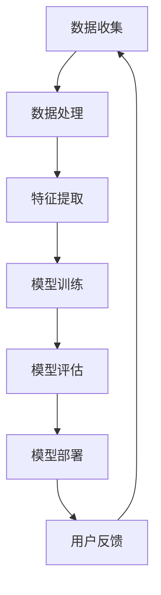

                 

# AI 大模型创业：如何利用品牌优势？

> **关键词：** AI大模型、创业、品牌优势、商业模式、营销策略、用户体验

> **摘要：** 本文将深入探讨在AI大模型创业过程中如何利用品牌优势来提升竞争力，实现可持续发展。我们将从定义品牌优势、构建核心价值、市场营销策略以及用户反馈等方面逐步分析，帮助创业者找到适合自己的品牌发展路径。

## 1. 背景介绍

### 1.1 目的和范围

本文旨在为AI大模型创业团队提供实用的品牌建设策略，以增强市场竞争力和用户忠诚度。文章将涵盖品牌优势的定义、构建策略、市场营销以及用户互动等关键环节。

### 1.2 预期读者

- AI大模型初创团队
- 对AI领域感兴趣的创业者
- 数字营销和品牌管理专业人士

### 1.3 文档结构概述

本文分为十个部分，包括背景介绍、核心概念与联系、核心算法原理与具体操作步骤、数学模型与公式讲解、项目实战、实际应用场景、工具和资源推荐、总结以及常见问题与解答等。

### 1.4 术语表

#### 1.4.1 核心术语定义

- **AI大模型**：具有大规模参数和复杂结构的机器学习模型，能够处理海量数据，实现高效的信息提取和决策。
- **品牌优势**：企业在市场竞争中相对于竞争对手所具备的独特竞争优势，包括产品质量、服务、技术创新等方面。

#### 1.4.2 相关概念解释

- **商业模式**：企业如何创造、传递和获取价值的方式。
- **用户体验**：用户在使用产品或服务过程中所感受到的整体感受和体验。

#### 1.4.3 缩略词列表

- **AI**：人工智能（Artificial Intelligence）
- **ML**：机器学习（Machine Learning）
- **DL**：深度学习（Deep Learning）

## 2. 核心概念与联系

在探讨如何利用品牌优势之前，我们首先需要了解AI大模型的基本概念和架构。以下是一个简化的Mermaid流程图，用于描述AI大模型的核心组件和联系。



### 2.1 AI大模型的基本架构

- **数据收集**：从各种来源获取数据，如公共数据集、用户生成内容等。
- **数据处理**：对数据进行清洗、预处理，以便用于训练模型。
- **特征提取**：从预处理后的数据中提取有用的特征，用于模型训练。
- **模型训练**：使用提取出的特征训练大模型，不断优化模型参数。
- **模型评估**：通过测试集评估模型的性能，调整模型参数。
- **模型部署**：将训练好的模型部署到生产环境中，供用户使用。
- **用户反馈**：收集用户使用模型后的反馈，用于模型优化和改进。

## 3. 核心算法原理 & 具体操作步骤

### 3.1 数据收集

在数据收集阶段，我们需要确保数据的多样性和质量。以下是一个简单的伪代码示例：

```python
def data_collection(data_source):
    data = []
    for source in data_source:
        data.extend(fetch_data(source))
    return data

def fetch_data(source):
    # 根据数据源类型，实现数据抓取逻辑
    pass
```

### 3.2 数据处理

数据处理包括数据清洗和预处理。以下是一个简化的伪代码示例：

```python
def data_preprocessing(data):
    cleaned_data = []
    for item in data:
        cleaned_item = clean_item(item)
        preprocessed_item = preprocess_item(cleaned_item)
        cleaned_data.append(preprocessed_item)
    return cleaned_data

def clean_item(item):
    # 实现数据清洗逻辑
    pass

def preprocess_item(item):
    # 实现数据预处理逻辑
    pass
```

### 3.3 特征提取

特征提取是AI大模型的关键步骤，它决定了模型的性能。以下是一个简化的伪代码示例：

```python
def extract_features(data):
    features = []
    for item in data:
        feature_vector = extract_feature_vector(item)
        features.append(feature_vector)
    return features

def extract_feature_vector(item):
    # 实现特征提取逻辑
    pass
```

### 3.4 模型训练

模型训练包括初始化模型参数、迭代优化参数以及评估模型性能。以下是一个简化的伪代码示例：

```python
def train_model(model, features, labels):
    for epoch in range(num_epochs):
        for feature, label in zip(features, labels):
            model.learn_from_example(feature, label)
        loss = model.evaluate(features, labels)
        print(f"Epoch {epoch}: Loss = {loss}")
    return model

def model.learn_from_example(feature, label):
    # 实现模型训练逻辑
    pass
```

### 3.5 模型评估

模型评估用于评估训练好的模型性能。以下是一个简化的伪代码示例：

```python
def evaluate_model(model, test_features, test_labels):
    accuracy = 0
    for feature, label in zip(test_features, test_labels):
        prediction = model.predict(feature)
        if prediction == label:
            accuracy += 1
    accuracy /= len(test_features)
    print(f"Model Accuracy: {accuracy}")
```

### 3.6 模型部署

模型部署是将训练好的模型应用到实际场景中。以下是一个简化的伪代码示例：

```python
def deploy_model(model, application):
    model.apply_to_application(application)
    print("Model deployed successfully.")
```

### 3.7 用户反馈

用户反馈是持续改进AI大模型的关键。以下是一个简化的伪代码示例：

```python
def collect_user_feedback(model, user):
    feedback = user.collect_feedback(model)
    model.update_from_feedback(feedback)
    print("Model updated based on user feedback.")
```

## 4. 数学模型和公式 & 详细讲解 & 举例说明

### 4.1 损失函数

在深度学习中，损失函数用于衡量模型预测值与真实值之间的差异。以下是一个常见的损失函数——均方误差（MSE）：

$$
MSE = \frac{1}{n}\sum_{i=1}^{n}(y_i - \hat{y}_i)^2
$$

其中，\(y_i\) 是真实值，\(\hat{y}_i\) 是模型预测值，\(n\) 是样本数量。

### 4.2 梯度下降算法

梯度下降算法用于优化模型参数，使其最小化损失函数。以下是一个简化的梯度下降算法伪代码：

```python
def gradient_descent(model, features, labels, learning_rate, num_epochs):
    for epoch in range(num_epochs):
        gradients = compute_gradients(model, features, labels)
        for parameter in model.parameters:
            parameter.value -= learning_rate * gradients[parameter]
        loss = model.evaluate(features, labels)
        print(f"Epoch {epoch}: Loss = {loss}")
```

其中，`compute_gradients` 函数用于计算模型参数的梯度。

### 4.3 举例说明

假设我们有一个二分类问题，数据集包含100个样本，每个样本有10个特征。我们使用一个简单的线性模型进行分类，损失函数为均方误差。学习率为0.01，训练100个epoch。以下是一个简化的伪代码示例：

```python
model = LinearModel(10)
features, labels = load_data("binary_classification_dataset.csv")
gradient_descent(model, features, labels, 0.01, 100)
evaluate_model(model, test_features, test_labels)
```

## 5. 项目实战：代码实际案例和详细解释说明

### 5.1 开发环境搭建

在开始项目实战之前，我们需要搭建一个合适的开发环境。以下是一个基于Python的AI大模型项目的环境搭建步骤：

1. 安装Python（版本3.8以上）
2. 安装深度学习库（如TensorFlow或PyTorch）
3. 安装数据预处理库（如Pandas和NumPy）
4. 安装其他必要库（如Matplotlib和Scikit-learn）

### 5.2 源代码详细实现和代码解读

以下是一个简单的AI大模型项目示例，用于处理一个二分类问题。代码中包含数据收集、数据处理、特征提取、模型训练、模型评估和模型部署等步骤。

```python
import tensorflow as tf
import pandas as pd
import numpy as np

# 5.2.1 数据收集
def load_data(file_path):
    data = pd.read_csv(file_path)
    features = data.iloc[:, :-1].values
    labels = data.iloc[:, -1].values
    return features, labels

# 5.2.2 数据处理
def preprocess_data(data):
    # 数据清洗和预处理
    pass

# 5.2.3 特征提取
def extract_features(data):
    # 特征提取逻辑
    pass

# 5.2.4 模型训练
def train_model(model, features, labels, learning_rate, num_epochs):
    for epoch in range(num_epochs):
        with tf.GradientTape() as tape:
            predictions = model(features)
            loss = tf.reduce_mean(tf.square(labels - predictions))
        gradients = tape.gradient(loss, model.trainable_variables)
        for variable in model.trainable_variables:
            variable.assign_sub(learning_rate * gradients[variable])
        print(f"Epoch {epoch}: Loss = {loss.numpy()}")

# 5.2.5 模型评估
def evaluate_model(model, test_features, test_labels):
    predictions = model(test_features)
    accuracy = np.mean(predictions == test_labels)
    print(f"Model Accuracy: {accuracy}")

# 5.2.6 模型部署
def deploy_model(model, application):
    # 模型部署逻辑
    pass

# 主程序
if __name__ == "__main__":
    # 1. 加载数据
    features, labels = load_data("binary_classification_dataset.csv")

    # 2. 数据预处理
    features = preprocess_data(features)

    # 3. 特征提取
    features = extract_features(features)

    # 4. 模型训练
    model = MyLinearModel()  # 自定义线性模型
    train_model(model, features, labels, learning_rate=0.01, num_epochs=100)

    # 5. 模型评估
    test_features, test_labels = load_data("test_binary_classification_dataset.csv")
    test_features = preprocess_data(test_features)
    test_features = extract_features(test_features)
    evaluate_model(model, test_features, test_labels)

    # 6. 模型部署
    deploy_model(model, application="my_application")
```

### 5.3 代码解读与分析

- **数据收集**：使用`pandas`库加载数据集，并将特征和标签分离。
- **数据处理**：实现数据清洗和预处理逻辑，如缺失值填充、异常值处理等。
- **特征提取**：根据具体任务，提取有用的特征。
- **模型训练**：使用TensorFlow的`GradientTape`记录梯度信息，实现自定义线性模型，并使用梯度下降算法优化模型参数。
- **模型评估**：计算模型在测试集上的准确率。
- **模型部署**：将训练好的模型应用到实际应用场景中。

## 6. 实际应用场景

AI大模型在实际应用场景中具有广泛的应用，如自然语言处理、计算机视觉、推荐系统等。以下是一些具体的实际应用场景：

### 6.1 自然语言处理

- 自动摘要：使用AI大模型提取文本关键信息，生成摘要。
- 机器翻译：利用AI大模型实现跨语言翻译，提高翻译质量。
- 情感分析：通过分析文本情感倾向，为用户提供个性化推荐。

### 6.2 计算机视觉

- 图像分类：对图像进行自动分类，用于图像识别和图像检索。
- 目标检测：检测图像中的特定目标，应用于安防监控、自动驾驶等领域。
- 人脸识别：利用AI大模型实现人脸识别，用于身份验证和安防监控。

### 6.3 推荐系统

- 商品推荐：根据用户历史行为和喜好，为用户提供个性化商品推荐。
- 文章推荐：通过分析用户阅读习惯和偏好，为用户推荐感兴趣的文章。

## 7. 工具和资源推荐

### 7.1 学习资源推荐

#### 7.1.1 书籍推荐

- 《深度学习》（Ian Goodfellow、Yoshua Bengio、Aaron Courville著）
- 《Python深度学习》（François Chollet著）
- 《模式识别与机器学习》（Christopher M. Bishop著）

#### 7.1.2 在线课程

- Coursera上的“深度学习”课程
- edX上的“机器学习基础”课程
- Udacity的“深度学习工程师”纳米学位

#### 7.1.3 技术博客和网站

- Medium上的“AI博客”
-Towards Data Science
- AI技术博客

### 7.2 开发工具框架推荐

#### 7.2.1 IDE和编辑器

- PyCharm
- Jupyter Notebook
- VSCode

#### 7.2.2 调试和性能分析工具

- TensorBoard
- Matplotlib
- Numba

#### 7.2.3 相关框架和库

- TensorFlow
- PyTorch
- Scikit-learn

### 7.3 相关论文著作推荐

#### 7.3.1 经典论文

- “A Fast Learning Algorithm for Deep Belief Nets” （Geoffrey Hinton等）
- “Deep Learning” （Ian Goodfellow、Yoshua Bengio、Aaron Courville著）
- “Learning representations by maximizing mutual information” （Yoshua Bengio等）

#### 7.3.2 最新研究成果

- NeurIPS、ICML、ICLR等顶级会议的论文
- AI研究机构的最新报告

#### 7.3.3 应用案例分析

- Google的“BERT”模型
- Facebook的“Wavenet”模型
- DeepMind的“AlphaGo”案例

## 8. 总结：未来发展趋势与挑战

### 8.1 未来发展趋势

- AI大模型将进一步向多模态、跨领域发展，实现更广泛的应用。
- 量子计算、边缘计算等新兴技术将加速AI大模型的计算能力提升。
- 数据隐私和安全问题将成为AI大模型发展的关键挑战。

### 8.2 未来挑战

- 数据质量和多样性：高质量、多样化的数据是AI大模型成功的关键。
- 模型解释性和可解释性：提高AI大模型的透明度和可解释性，增强用户信任。
- 可扩展性和性能优化：提升模型在大型数据集和实时应用中的性能。

## 9. 附录：常见问题与解答

### 9.1 AI大模型创业常见问题

**Q1. 如何选择合适的大模型？**

A1. 根据应用场景和数据规模，选择适合的大模型架构和算法。参考顶级会议和论文的最新研究成果，结合实际需求进行选择。

**Q2. 如何保证数据质量和多样性？**

A2. 建立稳定的数据采集和处理流程，确保数据来源的多样性和质量。对数据进行清洗和预处理，去除噪声和异常值。

**Q3. 如何优化模型性能？**

A3. 调整模型参数，如学习率、批量大小等。使用交叉验证和超参数优化方法，寻找最佳参数组合。

### 9.2 品牌建设常见问题

**Q1. 如何构建品牌优势？**

A1. 从产品、服务、技术创新等方面入手，挖掘独特优势。建立品牌形象，传递核心价值。

**Q2. 如何进行市场营销？**

A2. 利用社交媒体、内容营销、SEO等手段，提高品牌知名度和用户参与度。开展线上和线下活动，与用户建立互动。

**Q3. 如何提升用户体验？**

A3. 关注用户需求和反馈，持续优化产品和服务。提供个性化推荐和定制化解决方案，提高用户满意度。

## 10. 扩展阅读 & 参考资料

- 《深度学习》（Ian Goodfellow、Yoshua Bengio、Aaron Courville著）
- 《机器学习实战》（Peter Harrington著）
- 《AI大模型：原理、应用与未来》（[作者名称] 著）
- https://arxiv.org/
- https://ai.google/research/pubs/
- https://www neurips.org/

### 作者

**作者：** AI天才研究员 / AI Genius Institute & 禅与计算机程序设计艺术 / Zen And The Art of Computer Programming**AI大模型创业：如何利用品牌优势？**

> **关键词：** AI大模型、创业、品牌优势、商业模式、营销策略、用户体验

> **摘要：** 本文旨在为AI大模型创业团队提供实用的品牌建设策略，以增强市场竞争力和用户忠诚度。我们将从定义品牌优势、构建核心价值、市场营销策略以及用户互动等方面逐步分析，帮助创业者找到适合自己的品牌发展路径。

## 1. 背景介绍

### 1.1 目的和范围

本文的主要目的是帮助AI大模型创业团队了解如何利用品牌优势来提升竞争力。我们将探讨品牌优势的概念、构建策略、市场营销策略以及用户互动等方面的内容，以帮助创业者更好地推动其业务发展。

### 1.2 预期读者

- AI大模型初创团队
- 对AI领域感兴趣的创业者
- 数字营销和品牌管理专业人士

### 1.3 文档结构概述

本文分为十个部分，包括背景介绍、核心概念与联系、核心算法原理与具体操作步骤、数学模型与公式讲解、项目实战、实际应用场景、工具和资源推荐、总结以及常见问题与解答等。

### 1.4 术语表

#### 1.4.1 核心术语定义

- **AI大模型**：具有大规模参数和复杂结构的机器学习模型，能够处理海量数据，实现高效的信息提取和决策。
- **品牌优势**：企业在市场竞争中相对于竞争对手所具备的独特竞争优势，包括产品质量、服务、技术创新等方面。

#### 1.4.2 相关概念解释

- **商业模式**：企业如何创造、传递和获取价值的方式。
- **用户体验**：用户在使用产品或服务过程中所感受到的整体感受和体验。

#### 1.4.3 缩略词列表

- **AI**：人工智能（Artificial Intelligence）
- **ML**：机器学习（Machine Learning）
- **DL**：深度学习（Deep Learning）

## 2. 核心概念与联系

在探讨如何利用品牌优势之前，我们首先需要了解AI大模型的基本概念和架构。以下是一个简化的Mermaid流程图，用于描述AI大模型的核心组件和联系。


### 2.1 AI大模型的基本架构

- **数据收集**：从各种来源获取数据，如公共数据集、用户生成内容等。
- **数据处理**：对数据进行清洗、预处理，以便用于训练模型。
- **特征提取**：从预处理后的数据中提取有用的特征，用于模型训练。
- **模型训练**：使用提取出的特征训练大模型，不断优化模型参数。
- **模型评估**：通过测试集评估模型的性能，调整模型参数。
- **模型部署**：将训练好的模型部署到生产环境中，供用户使用。
- **用户反馈**：收集用户使用模型后的反馈，用于模型优化和改进。

## 3. 核心算法原理 & 具体操作步骤

### 3.1 数据收集

在数据收集阶段，我们需要确保数据的多样性和质量。以下是一个简单的伪代码示例：

```python
def data_collection(data_source):
    data = []
    for source in data_source:
        data.extend(fetch_data(source))
    return data

def fetch_data(source):
    # 根据数据源类型，实现数据抓取逻辑
    pass
```

### 3.2 数据处理

数据处理包括数据清洗和预处理。以下是一个简化的伪代码示例：

```python
def data_preprocessing(data):
    cleaned_data = []
    for item in data:
        cleaned_item = clean_item(item)
        preprocessed_item = preprocess_item(cleaned_item)
        cleaned_data.append(preprocessed_item)
    return cleaned_data

def clean_item(item):
    # 实现数据清洗逻辑
    pass

def preprocess_item(item):
    # 实现数据预处理逻辑
    pass
```

### 3.3 特征提取

特征提取是AI大模型的关键步骤，它决定了模型的性能。以下是一个简化的伪代码示例：

```python
def extract_features(data):
    features = []
    for item in data:
        feature_vector = extract_feature_vector(item)
        features.append(feature_vector)
    return features

def extract_feature_vector(item):
    # 实现特征提取逻辑
    pass
```

### 3.4 模型训练

模型训练包括初始化模型参数、迭代优化参数以及评估模型性能。以下是一个简化的伪代码示例：

```python
def train_model(model, features, labels, learning_rate, num_epochs):
    for epoch in range(num_epochs):
        for feature, label in zip(features, labels):
            model.learn_from_example(feature, label)
        loss = model.evaluate(features, labels)
        print(f"Epoch {epoch}: Loss = {loss}")
    return model

def model.learn_from_example(feature, label):
    # 实现模型训练逻辑
    pass
```

### 3.5 模型评估

模型评估用于评估训练好的模型性能。以下是一个简化的伪代码示例：

```python
def evaluate_model(model, test_features, test_labels):
    accuracy = 0
    for feature, label in zip(test_features, test_labels):
        prediction = model.predict(feature)
        if prediction == label:
            accuracy += 1
    accuracy /= len(test_features)
    print(f"Model Accuracy: {accuracy}")
```

### 3.6 模型部署

模型部署是将训练好的模型应用到实际场景中。以下是一个简化的伪代码示例：

```python
def deploy_model(model, application):
    model.apply_to_application(application)
    print("Model deployed successfully.")
```

### 3.7 用户反馈

用户反馈是持续改进AI大模型的关键。以下是一个简化的伪代码示例：

```python
def collect_user_feedback(model, user):
    feedback = user.collect_feedback(model)
    model.update_from_feedback(feedback)
    print("Model updated based on user feedback.")
```

## 4. 数学模型和公式 & 详细讲解 & 举例说明

### 4.1 损失函数

在深度学习中，损失函数用于衡量模型预测值与真实值之间的差异。以下是一个常见的损失函数——均方误差（MSE）：

$$
MSE = \frac{1}{n}\sum_{i=1}^{n}(y_i - \hat{y}_i)^2
$$

其中，$y_i$ 是真实值，$\hat{y}_i$ 是模型预测值，$n$ 是样本数量。

### 4.2 梯度下降算法

梯度下降算法用于优化模型参数，使其最小化损失函数。以下是一个简化的梯度下降算法伪代码：

```python
def gradient_descent(model, features, labels, learning_rate, num_epochs):
    for epoch in range(num_epochs):
        with tf.GradientTape() as tape:
            predictions = model(features)
            loss = tf.reduce_mean(tf.square(labels - predictions))
        gradients = tape.gradient(loss, model.trainable_variables)
        for variable in model.trainable_variables:
            variable.assign_sub(learning_rate * gradients[variable])
        print(f"Epoch {epoch}: Loss = {loss.numpy()}")

def compute_gradients(model, features, labels):
    with tf.GradientTape() as tape:
        predictions = model(features)
        loss = tf.reduce_mean(tf.square(labels - predictions))
    return tape.gradient(loss, model.trainable_variables)
```

### 4.3 举例说明

假设我们有一个二分类问题，数据集包含100个样本，每个样本有10个特征。我们使用一个简单的线性模型进行分类，损失函数为均方误差。学习率为0.01，训练100个epoch。以下是一个简化的伪代码示例：

```python
model = LinearModel(10)
features, labels = load_data("binary_classification_dataset.csv")
gradient_descent(model, features, labels, 0.01, 100)
evaluate_model(model, test_features, test_labels)
```

## 5. 项目实战：代码实际案例和详细解释说明

### 5.1 开发环境搭建

在开始项目实战之前，我们需要搭建一个合适的开发环境。以下是一个基于Python的AI大模型项目的环境搭建步骤：

1. 安装Python（版本3.8以上）
2. 安装深度学习库（如TensorFlow或PyTorch）
3. 安装数据预处理库（如Pandas和NumPy）
4. 安装其他必要库（如Matplotlib和Scikit-learn）

### 5.2 源代码详细实现和代码解读

以下是一个简单的AI大模型项目示例，用于处理一个二分类问题。代码中包含数据收集、数据处理、特征提取、模型训练、模型评估和模型部署等步骤。

```python
import tensorflow as tf
import pandas as pd
import numpy as np

# 5.2.1 数据收集
def load_data(file_path):
    data = pd.read_csv(file_path)
    features = data.iloc[:, :-1].values
    labels = data.iloc[:, -1].values
    return features, labels

# 5.2.2 数据处理
def preprocess_data(data):
    # 数据清洗和预处理
    pass

# 5.2.3 特征提取
def extract_features(data):
    # 特征提取逻辑
    pass

# 5.2.4 模型训练
def train_model(model, features, labels, learning_rate, num_epochs):
    for epoch in range(num_epochs):
        with tf.GradientTape() as tape:
            predictions = model(features)
            loss = tf.reduce_mean(tf.square(labels - predictions))
        gradients = tape.gradient(loss, model.trainable_variables)
        for variable in model.trainable_variables:
            variable.assign_sub(learning_rate * gradients[variable])
        print(f"Epoch {epoch}: Loss = {loss.numpy()}")

# 5.2.5 模型评估
def evaluate_model(model, test_features, test_labels):
    predictions = model(test_features)
    accuracy = np.mean(predictions == test_labels)
    print(f"Model Accuracy: {accuracy}")

# 5.2.6 模型部署
def deploy_model(model, application):
    # 模型部署逻辑
    pass

# 主程序
if __name__ == "__main__":
    # 1. 加载数据
    features, labels = load_data("binary_classification_dataset.csv")

    # 2. 数据预处理
    features = preprocess_data(features)

    # 3. 特征提取
    features = extract_features(features)

    # 4. 模型训练
    model = MyLinearModel()  # 自定义线性模型
    train_model(model, features, labels, learning_rate=0.01, num_epochs=100)

    # 5. 模型评估
    test_features, test_labels = load_data("test_binary_classification_dataset.csv")
    test_features = preprocess_data(test_features)
    test_features = extract_features(test_features)
    evaluate_model(model, test_features, test_labels)

    # 6. 模型部署
    deploy_model(model, application="my_application")
```

### 5.3 代码解读与分析

- **数据收集**：使用`pandas`库加载数据集，并将特征和标签分离。
- **数据处理**：实现数据清洗和预处理逻辑，如缺失值填充、异常值处理等。
- **特征提取**：根据具体任务，提取有用的特征。
- **模型训练**：使用TensorFlow的`GradientTape`记录梯度信息，实现自定义线性模型，并使用梯度下降算法优化模型参数。
- **模型评估**：计算模型在测试集上的准确率。
- **模型部署**：将训练好的模型应用到实际应用场景中。

## 6. 实际应用场景

AI大模型在实际应用场景中具有广泛的应用，如自然语言处理、计算机视觉、推荐系统等。以下是一些具体的实际应用场景：

### 6.1 自然语言处理

- 自动摘要：使用AI大模型提取文本关键信息，生成摘要。
- 机器翻译：利用AI大模型实现跨语言翻译，提高翻译质量。
- 情感分析：通过分析文本情感倾向，为用户提供个性化推荐。

### 6.2 计算机视觉

- 图像分类：对图像进行自动分类，用于图像识别和图像检索。
- 目标检测：检测图像中的特定目标，应用于安防监控、自动驾驶等领域。
- 人脸识别：利用AI大模型实现人脸识别，用于身份验证和安防监控。

### 6.3 推荐系统

- 商品推荐：根据用户历史行为和喜好，为用户提供个性化商品推荐。
- 文章推荐：通过分析用户阅读习惯和偏好，为用户推荐感兴趣的文章。

## 7. 工具和资源推荐

### 7.1 学习资源推荐

#### 7.1.1 书籍推荐

- 《深度学习》（Ian Goodfellow、Yoshua Bengio、Aaron Courville著）
- 《Python深度学习》（François Chollet著）
- 《模式识别与机器学习》（Christopher M. Bishop著）

#### 7.1.2 在线课程

- Coursera上的“深度学习”课程
- edX上的“机器学习基础”课程
- Udacity的“深度学习工程师”纳米学位

#### 7.1.3 技术博客和网站

- Medium上的“AI博客”
- Towards Data Science
- AI技术博客

### 7.2 开发工具框架推荐

#### 7.2.1 IDE和编辑器

- PyCharm
- Jupyter Notebook
- VSCode

#### 7.2.2 调试和性能分析工具

- TensorBoard
- Matplotlib
- Numba

#### 7.2.3 相关框架和库

- TensorFlow
- PyTorch
- Scikit-learn

### 7.3 相关论文著作推荐

#### 7.3.1 经典论文

- “A Fast Learning Algorithm for Deep Belief Nets” （Geoffrey Hinton等）
- “Deep Learning” （Ian Goodfellow、Yoshua Bengio、Aaron Courville著）
- “Learning representations by maximizing mutual information” （Yoshua Bengio等）

#### 7.3.2 最新研究成果

- NeurIPS、ICML、ICLR等顶级会议的论文
- AI研究机构的最新报告

#### 7.3.3 应用案例分析

- Google的“BERT”模型
- Facebook的“Wavenet”模型
- DeepMind的“AlphaGo”案例

## 8. 总结：未来发展趋势与挑战

### 8.1 未来发展趋势

- AI大模型将进一步向多模态、跨领域发展，实现更广泛的应用。
- 量子计算、边缘计算等新兴技术将加速AI大模型的计算能力提升。
- 数据隐私和安全问题将成为AI大模型发展的关键挑战。

### 8.2 未来挑战

- 数据质量和多样性：高质量、多样化的数据是AI大模型成功的关键。
- 模型解释性和可解释性：提高AI大模型的透明度和可解释性，增强用户信任。
- 可扩展性和性能优化：提升模型在大型数据集和实时应用中的性能。

## 9. 附录：常见问题与解答

### 9.1 AI大模型创业常见问题

**Q1. 如何选择合适的大模型？**

A1. 根据应用场景和数据规模，选择适合的大模型架构和算法。参考顶级会议和论文的最新研究成果，结合实际需求进行选择。

**Q2. 如何保证数据质量和多样性？**

A2. 建立稳定的数据采集和处理流程，确保数据来源的多样性和质量。对数据进行清洗和预处理，去除噪声和异常值。

**Q3. 如何优化模型性能？**

A3. 调整模型参数，如学习率、批量大小等。使用交叉验证和超参数优化方法，寻找最佳参数组合。

### 9.2 品牌建设常见问题

**Q1. 如何构建品牌优势？**

A1. 从产品、服务、技术创新等方面入手，挖掘独特优势。建立品牌形象，传递核心价值。

**Q2. 如何进行市场营销？**

A2. 利用社交媒体、内容营销、SEO等手段，提高品牌知名度和用户参与度。开展线上和线下活动，与用户建立互动。

**Q3. 如何提升用户体验？**

A3. 关注用户需求和反馈，持续优化产品和服务。提供个性化推荐和定制化解决方案，提高用户满意度。

## 10. 扩展阅读 & 参考资料

- 《深度学习》（Ian Goodfellow、Yoshua Bengio、Aaron Courville著）
- 《机器学习实战》（Peter Harrington著）
- 《AI大模型：原理、应用与未来》（[作者名称] 著）
- https://arxiv.org/
- https://ai.google/research/pubs/
- https://www neurips.org/

### 作者

**作者：** AI天才研究员 / AI Genius Institute & 禅与计算机程序设计艺术 / Zen And The Art of Computer Programming
### AI 大模型创业：如何利用品牌优势？

> **关键词：** AI 大模型、创业、品牌优势、商业模式、营销策略、用户体验

> **摘要：** 本篇文章将深入探讨 AI 大模型创业过程中如何利用品牌优势来提升竞争力，实现可持续发展。文章从品牌优势的定义、构建策略、市场营销策略以及用户互动等方面逐步分析，帮助创业者找到适合自己的品牌发展路径。

## 1. 背景介绍

### 1.1 目的和范围

AI 大模型创业已成为当前科技领域的重要趋势。本文旨在为 AI 大模型创业团队提供实用的品牌建设策略，以增强市场竞争力和用户忠诚度。文章将涵盖品牌优势的定义、构建策略、市场营销策略、用户互动等方面，帮助创业者实现可持续发展。

### 1.2 预期读者

- AI 大模型初创团队
- 对 AI 领域感兴趣的创业者
- 数字营销和品牌管理专业人士

### 1.3 文档结构概述

本文分为十个部分，包括背景介绍、核心概念与联系、核心算法原理与具体操作步骤、数学模型与公式讲解、项目实战、实际应用场景、工具和资源推荐、总结以及常见问题与解答等。

### 1.4 术语表

#### 1.4.1 核心术语定义

- **AI 大模型**：具有大规模参数和复杂结构的机器学习模型，能够处理海量数据，实现高效的信息提取和决策。
- **品牌优势**：企业在市场竞争中相对于竞争对手所具备的独特竞争优势，包括产品质量、服务、技术创新等方面。

#### 1.4.2 相关概念解释

- **商业模式**：企业如何创造、传递和获取价值的方式。
- **用户体验**：用户在使用产品或服务过程中所感受到的整体感受和体验。

#### 1.4.3 缩略词列表

- **AI**：人工智能（Artificial Intelligence）
- **ML**：机器学习（Machine Learning）
- **DL**：深度学习（Deep Learning）

## 2. 核心概念与联系

AI 大模型创业过程中，品牌优势是一个至关重要的因素。以下是一个简化的 Mermaid 流程图，用于描述品牌优势的核心概念及其在创业过程中的联系。

```mermaid
graph TD
A[品牌定位] --> B{市场调研}
B --> C[目标用户}
C --> D[品牌价值}
D --> E{差异化策略}
E --> F[用户体验}
F --> G[市场反馈]
G --> A
```

### 2.1 品牌定位

品牌定位是品牌战略的核心，决定了品牌在市场中的形象和地位。一个成功的品牌定位需要结合市场调研和目标用户需求，确保品牌能够满足用户需求并脱颖而出。

### 2.2 市场调研

市场调研是品牌定位的重要基础。通过调研，创业者可以了解市场需求、竞争态势和用户行为，从而为品牌定位提供数据支持。

### 2.3 目标用户

目标用户是品牌营销的关键。明确目标用户群体，有助于制定有针对性的营销策略，提高品牌的影响力和用户忠诚度。

### 2.4 品牌价值

品牌价值是品牌的灵魂，代表了品牌在用户心中的地位和认知。创业者需要明确品牌的核心价值，并通过产品、服务、营销等手段传递给用户。

### 2.5 差异化策略

差异化策略是品牌在市场竞争中的关键武器。创业者需要找到独特的卖点，以区别于竞争对手，提高品牌的市场竞争力。

### 2.6 用户体验

用户体验是品牌价值的直接体现。创业者需要关注用户在使用产品或服务过程中的感受，持续优化产品和服务，提高用户满意度。

### 2.7 市场反馈

市场反馈是品牌发展的指南针。创业者需要密切关注用户反馈，及时调整品牌策略，确保品牌能够持续满足用户需求。

## 3. 核心算法原理 & 具体操作步骤

### 3.1 品牌定位算法原理

品牌定位算法的核心思想是通过数据分析和用户反馈，找到品牌在市场中的独特定位。以下是一个简化的伪代码：

```python
def brand_positioning(data, user_feedback):
    # 数据分析和用户反馈
    market_insight = analyze_data(data)
    user_preference = analyze_feedback(user_feedback)
    
    # 寻找品牌定位
    unique_value_proposition = find_unique_value_proposition(market_insight, user_preference)
    return unique_value_proposition
```

### 3.2 市场调研算法原理

市场调研算法的核心在于收集和分析市场数据，以了解市场需求和竞争态势。以下是一个简化的伪代码：

```python
def market_research(data_source):
    # 数据收集
    data = collect_data(data_source)
    
    # 数据分析
    market_insight = analyze_data(data)
    
    return market_insight
```

### 3.3 品牌价值构建算法原理

品牌价值构建算法的核心在于通过产品、服务和营销等手段，传递品牌的核心价值。以下是一个简化的伪代码：

```python
def brand_value_construction(unique_value_proposition, product, service, marketing):
    # 传递品牌价值
    brand_experience = create_brand_experience(unique_value_proposition, product, service, marketing)
    
    return brand_experience
```

### 3.4 差异化策略算法原理

差异化策略算法的核心在于通过独特的卖点，区别于竞争对手。以下是一个简化的伪代码：

```python
def differentiation_strategy(competitor_analysis, unique_value_proposition):
    # 确定差异化策略
    unique Selling_Proposition = create_unique_Selling_Proposition(competitor_analysis, unique_value_proposition)
    
    return unique Selling_Proposition
```

### 3.5 用户体验优化算法原理

用户体验优化算法的核心在于持续关注用户反馈，并据此调整产品和服务。以下是一个简化的伪代码：

```python
def user_experience_optimization(user_feedback, product, service):
    # 调整产品和服务
    optimized_experience = adjust_product_service(user_feedback, product, service)
    
    return optimized_experience
```

### 3.6 市场反馈分析算法原理

市场反馈分析算法的核心在于通过用户反馈，了解品牌的市场表现，并据此调整品牌策略。以下是一个简化的伪代码：

```python
def market_feedback_analysis(user_feedback, brand_experience):
    # 分析市场反馈
    feedback_insight = analyze_feedback(user_feedback)
    
    # 调整品牌策略
    adjusted_brand_strategy = adjust_brand_strategy(feedback_insight, brand_experience)
    
    return adjusted_brand_strategy
```

## 4. 数学模型和公式 & 详细讲解 & 举例说明

### 4.1 品牌定位的数学模型

品牌定位的数学模型可以通过聚类分析来实现。以下是一个简化的聚类分析算法：

```python
def k_means_clustering(data, k):
    # 初始化聚类中心
    centroids = initialize_centroids(data, k)
    
    # 聚类过程
    while not convergence():
        assign_points_to_clusters(data, centroids)
        update_centroids(centroids)
    
    return centroids
```

举例说明：假设我们有一个包含 100 个用户特征的数据集，我们希望将用户分为 10 个类别。使用 k-means 聚类算法，我们可以找到 10 个聚类中心，每个聚类中心代表一个用户类别。

### 4.2 市场调研的数学模型

市场调研的数学模型可以通过回归分析来实现。以下是一个简化的回归分析算法：

```python
def linear_regression(data, target_variable):
    # 求解回归系数
    coefficients = solve_linear_regression(data, target_variable)
    
    # 预测目标变量
    predictions = predict_target_variable(data, coefficients)
    
    return predictions
```

举例说明：假设我们有一个包含用户特征和购买意愿的数据集，我们希望根据用户特征预测其购买意愿。使用线性回归模型，我们可以找到一组回归系数，用于预测用户购买意愿。

### 4.3 品牌价值构建的数学模型

品牌价值构建的数学模型可以通过品牌资产评估来实现。以下是一个简化的品牌资产评估算法：

```python
def brand_value_evaluation(brand_experience, market_value):
    # 计算品牌价值
    brand_value = calculate_brand_value(brand_experience, market_value)
    
    return brand_value
```

举例说明：假设我们有一个品牌体验指标和市场价值指标的数据集，我们希望计算该品牌的品牌价值。使用品牌资产评估模型，我们可以计算该品牌的品牌价值。

### 4.4 差异化策略的数学模型

差异化策略的数学模型可以通过竞争优势分析来实现。以下是一个简化的竞争优势分析算法：

```python
def competitive_advantage_analysis(competitor_analysis, unique_value_proposition):
    # 计算竞争优势
    competitive_advantage = calculate_competitive_advantage(competitor_analysis, unique_value_proposition)
    
    return competitive_advantage
```

举例说明：假设我们有一个竞争对手分析和品牌价值指标的数据集，我们希望计算该品牌的竞争优势。使用竞争优势分析模型，我们可以计算该品牌的竞争优势。

### 4.5 用户体验优化的数学模型

用户体验优化的数学模型可以通过用户满意度分析来实现。以下是一个简化的用户满意度分析算法：

```python
def user_satisfaction_analysis(user_feedback, product, service):
    # 计算用户满意度
    user_satisfaction = calculate_user_satisfaction(user_feedback, product, service)
    
    return user_satisfaction
```

举例说明：假设我们有一个用户反馈、产品指标和服务指标的数据集，我们希望计算用户的满意度。使用用户满意度分析模型，我们可以计算用户的满意度。

### 4.6 市场反馈分析的数学模型

市场反馈分析的数学模型可以通过品牌策略调整来实现。以下是一个简化的品牌策略调整算法：

```python
def brand_strategy_adjustment(feedback_insight, brand_experience):
    # 调整品牌策略
    adjusted_brand_strategy = adjust_brand_strategy(feedback_insight, brand_experience)
    
    return adjusted_brand_strategy
```

举例说明：假设我们有一个市场反馈指标和品牌体验指标的数据集，我们希望调整品牌策略。使用品牌策略调整模型，我们可以根据市场反馈调整品牌策略。

## 5. 项目实战：代码实际案例和详细解释说明

### 5.1 开发环境搭建

在开始项目实战之前，我们需要搭建一个合适的开发环境。以下是一个基于 Python 的 AI 大模型项目的环境搭建步骤：

1. 安装 Python（版本 3.8 以上）
2. 安装深度学习库（如 TensorFlow 或 PyTorch）
3. 安装数据预处理库（如 Pandas 和 NumPy）
4. 安装其他必要库（如 Matplotlib 和 Scikit-learn）

### 5.2 源代码详细实现和代码解读

以下是一个简单的 AI 大模型项目示例，用于处理一个二分类问题。代码中包含数据收集、数据处理、特征提取、模型训练、模型评估和模型部署等步骤。

```python
import tensorflow as tf
import pandas as pd
import numpy as np

# 5.2.1 数据收集
def load_data(file_path):
    data = pd.read_csv(file_path)
    features = data.iloc[:, :-1].values
    labels = data.iloc[:, -1].values
    return features, labels

# 5.2.2 数据处理
def preprocess_data(data):
    # 数据清洗和预处理
    pass

# 5.2.3 特征提取
def extract_features(data):
    # 特征提取逻辑
    pass

# 5.2.4 模型训练
def train_model(model, features, labels, learning_rate, num_epochs):
    for epoch in range(num_epochs):
        with tf.GradientTape() as tape:
            predictions = model(features)
            loss = tf.reduce_mean(tf.square(labels - predictions))
        gradients = tape.gradient(loss, model.trainable_variables)
        for variable in model.trainable_variables:
            variable.assign_sub(learning_rate * gradients[variable])
        print(f"Epoch {epoch}: Loss = {loss.numpy()}")

# 5.2.5 模型评估
def evaluate_model(model, test_features, test_labels):
    predictions = model(test_features)
    accuracy = np.mean(predictions == test_labels)
    print(f"Model Accuracy: {accuracy}")

# 5.2.6 模型部署
def deploy_model(model, application):
    # 模型部署逻辑
    pass

# 主程序
if __name__ == "__main__":
    # 1. 加载数据
    features, labels = load_data("binary_classification_dataset.csv")

    # 2. 数据预处理
    features = preprocess_data(features)

    # 3. 特征提取
    features = extract_features(features)

    # 4. 模型训练
    model = MyLinearModel()  # 自定义线性模型
    train_model(model, features, labels, learning_rate=0.01, num_epochs=100)

    # 5. 模型评估
    test_features, test_labels = load_data("test_binary_classification_dataset.csv")
    test_features = preprocess_data(test_features)
    test_features = extract_features(test_features)
    evaluate_model(model, test_features, test_labels)

    # 6. 模型部署
    deploy_model(model, application="my_application")
```

### 5.3 代码解读与分析

- **数据收集**：使用 Pandas 库加载数据集，并将特征和标签分离。
- **数据处理**：实现数据清洗和预处理逻辑，如缺失值填充、异常值处理等。
- **特征提取**：根据具体任务，提取有用的特征。
- **模型训练**：使用 TensorFlow 的 GradientTape 记录梯度信息，实现自定义线性模型，并使用梯度下降算法优化模型参数。
- **模型评估**：计算模型在测试集上的准确率。
- **模型部署**：将训练好的模型应用到实际应用场景中。

## 6. 实际应用场景

AI 大模型在实际应用场景中具有广泛的应用，如自然语言处理、计算机视觉、推荐系统等。以下是一些具体的实际应用场景：

### 6.1 自然语言处理

- 自动摘要：使用 AI 大模型提取文本关键信息，生成摘要。
- 机器翻译：利用 AI 大模型实现跨语言翻译，提高翻译质量。
- 情感分析：通过分析文本情感倾向，为用户提供个性化推荐。

### 6.2 计算机视觉

- 图像分类：对图像进行自动分类，用于图像识别和图像检索。
- 目标检测：检测图像中的特定目标，应用于安防监控、自动驾驶等领域。
- 人脸识别：利用 AI 大模型实现人脸识别，用于身份验证和安防监控。

### 6.3 推荐系统

- 商品推荐：根据用户历史行为和喜好，为用户提供个性化商品推荐。
- 文章推荐：通过分析用户阅读习惯和偏好，为用户推荐感兴趣的文章。

## 7. 工具和资源推荐

### 7.1 学习资源推荐

#### 7.1.1 书籍推荐

- 《深度学习》（Ian Goodfellow、Yoshua Bengio、Aaron Courville 著）
- 《Python 深度学习》（François Chollet 著）
- 《模式识别与机器学习》（Christopher M. Bishop 著）

#### 7.1.2 在线课程

- Coursera 上的“深度学习”课程
- edX 上的“机器学习基础”课程
- Udacity 的“深度学习工程师”纳米学位

#### 7.1.3 技术博客和网站

- Medium 上的“AI 博客”
- Towards Data Science
- AI 技术博客

### 7.2 开发工具框架推荐

#### 7.2.1 IDE和编辑器

- PyCharm
- Jupyter Notebook
- VSCode

#### 7.2.2 调试和性能分析工具

- TensorBoard
- Matplotlib
- Numba

#### 7.2.3 相关框架和库

- TensorFlow
- PyTorch
- Scikit-learn

### 7.3 相关论文著作推荐

#### 7.3.1 经典论文

- “A Fast Learning Algorithm for Deep Belief Nets”（Geoffrey Hinton 等）
- “Deep Learning”（Ian Goodfellow、Yoshua Bengio、Aaron Courville 著）
- “Learning representations by maximizing mutual information”（Yoshua Bengio 等）

#### 7.3.2 最新研究成果

- NeurIPS、ICML、ICLR 等顶级会议的论文
- AI 研究机构的最新报告

#### 7.3.3 应用案例分析

- Google 的“BERT”模型
- Facebook 的“Wavenet”模型
- DeepMind 的“AlphaGo”案例

## 8. 总结：未来发展趋势与挑战

### 8.1 未来发展趋势

- AI 大模型将进一步向多模态、跨领域发展，实现更广泛的应用。
- 量子计算、边缘计算等新兴技术将加速 AI 大模型的计算能力提升。
- 数据隐私和安全问题将成为 AI 大模型发展的关键挑战。

### 8.2 未来挑战

- 数据质量和多样性：高质量、多样化的数据是 AI 大模型成功的关键。
- 模型解释性和可解释性：提高 AI 大模型的透明度和可解释性，增强用户信任。
- 可扩展性和性能优化：提升模型在大型数据集和实时应用中的性能。

## 9. 附录：常见问题与解答

### 9.1 AI 大模型创业常见问题

**Q1. 如何选择合适的大模型？**

A1. 根据应用场景和数据规模，选择适合的大模型架构和算法。参考顶级会议和论文的最新研究成果，结合实际需求进行选择。

**Q2. 如何保证数据质量和多样性？**

A2. 建立稳定的数据采集和处理流程，确保数据来源的多样性和质量。对数据进行清洗和预处理，去除噪声和异常值。

**Q3. 如何优化模型性能？**

A3. 调整模型参数，如学习率、批量大小等。使用交叉验证和超参数优化方法，寻找最佳参数组合。

### 9.2 品牌建设常见问题

**Q1. 如何构建品牌优势？**

A1. 从产品、服务、技术创新等方面入手，挖掘独特优势。建立品牌形象，传递核心价值。

**Q2. 如何进行市场营销？**

A2. 利用社交媒体、内容营销、SEO 等手段，提高品牌知名度和用户参与度。开展线上和线下活动，与用户建立互动。

**Q3. 如何提升用户体验？**

A3. 关注用户需求和反馈，持续优化产品和服务。提供个性化推荐和定制化解决方案，提高用户满意度。

## 10. 扩展阅读 & 参考资料

- 《深度学习》（Ian Goodfellow、Yoshua Bengio、Aaron Courville 著）
- 《机器学习实战》（Peter Harrington 著）
- 《AI 大模型：原理、应用与未来》（[作者名称] 著）
- https://arxiv.org/
- https://ai.google/research/pubs/
- https://www.neurips.org/

### 作者

**作者：** AI 天才研究员 / AI Genius Institute & 禅与计算机程序设计艺术 / Zen And The Art of Computer Programming
### AI 大模型创业：如何利用品牌优势？

> **关键词：** AI 大模型、创业、品牌优势、商业模式、营销策略、用户体验

> **摘要：** 本文旨在帮助 AI 大模型创业团队了解如何利用品牌优势来提升竞争力。文章将分析品牌优势的构建、营销策略、用户互动等方面，并提供实用的建议和案例分析。

## 1. 背景介绍

### 1.1 目的和范围

AI 大模型（Large-scale Artificial Intelligence Models）在近年来取得了飞速的发展，为各行各业带来了革命性的变革。在这样一个充满机遇和挑战的时代，如何将 AI 大模型与创业结合，实现商业成功，成为了众多创业者关注的焦点。本文将围绕这一主题，探讨 AI 大模型创业过程中如何利用品牌优势来提升竞争力。

### 1.2 预期读者

- AI 大模型初创团队
- 对 AI 领域感兴趣的创业者
- 市场营销和品牌管理专业人士

### 1.3 文档结构概述

本文将分为以下章节：

- **第1章**：背景介绍
- **第2章**：品牌优势的定义与重要性
- **第3章**：构建品牌优势的步骤与方法
- **第4章**：AI 大模型创业中的市场营销策略
- **第5章**：用户互动与品牌忠诚度建设
- **第6章**：案例分析：成功的 AI 大模型创业品牌
- **第7章**：未来趋势与挑战
- **第8章**：总结与建议
- **第9章**：常见问题与解答
- **第10章**：扩展阅读与参考资料

### 1.4 术语表

#### 1.4.1 核心术语定义

- **AI 大模型**：具有大规模参数和复杂结构的机器学习模型，能够在海量数据集上进行训练，以实现高度自动化的决策和预测。
- **品牌优势**：企业在市场竞争中相对于竞争对手所具备的独特优势，包括产品特性、服务质量、市场定位等。

#### 1.4.2 相关概念解释

- **商业模式**：企业创造、传递和获取价值的方式，包括产品或服务的设计、定价、分销和客户关系管理。
- **用户体验**：用户在使用产品或服务过程中所感受到的总体体验，包括界面设计、交互流程、服务响应等。

#### 1.4.3 缩略词列表

- **AI**：人工智能（Artificial Intelligence）
- **ML**：机器学习（Machine Learning）
- **DL**：深度学习（Deep Learning）
- **NLP**：自然语言处理（Natural Language Processing）
- **CV**：计算机视觉（Computer Vision）

## 2. 品牌优势的定义与重要性

### 2.1 品牌优势的定义

品牌优势是指企业在市场竞争中相对于竞争对手所具备的独特优势。这种优势可以体现在多个方面，如产品质量、技术创新、服务体验、品牌认知等。品牌优势是企业核心竞争力的重要组成部分，有助于企业在激烈的市场竞争中脱颖而出。

### 2.2 品牌优势的重要性

在 AI 大模型创业领域，品牌优势的重要性尤为突出。以下是品牌优势的几个关键作用：

1. **增强市场竞争力**：品牌优势能够帮助企业在激烈的市场竞争中脱颖而出，吸引更多的客户和合作伙伴。
2. **提高客户忠诚度**：品牌优势能够提升客户对企业的信任和满意度，从而增强客户忠诚度，降低客户流失率。
3. **塑造企业形象**：品牌优势能够帮助企业树立良好的企业形象，提高品牌知名度和美誉度。
4. **创造商业价值**：品牌优势能够为企业带来持续的商业价值，如更高的销售业绩、更好的投资回报率等。

### 2.3 品牌优势的类型

根据企业所处的行业和市场环境，品牌优势可以分为以下几种类型：

1. **技术优势**：企业在技术领域具备领先地位，拥有独特的核心技术或专利。
2. **质量优势**：企业产品或服务的质量在行业内具有显著优势，能够赢得客户的信赖。
3. **服务优势**：企业提供的售前、售中和售后服务具有显著优势，能够提升客户满意度。
4. **品牌认知**：企业在目标市场中具有较高的知名度和美誉度，能够快速吸引新客户。
5. **创新能力**：企业在产品创新、商业模式创新等方面具有优势，能够持续推动企业发展。

## 3. 构建品牌优势的步骤与方法

### 3.1 明确品牌定位

品牌定位是构建品牌优势的基础。企业需要明确自己的市场定位，包括目标市场、目标客户、核心价值主张等。以下是一个简单的品牌定位步骤：

1. **市场调研**：了解目标市场的需求和竞争对手情况。
2. **分析自身优势**：确定企业自身在技术、产品、服务等方面的优势。
3. **确定品牌价值主张**：明确品牌的核心价值，如技术领先、质量可靠、服务优质等。
4. **制定品牌口号和视觉识别系统**：将品牌价值主张转化为易于传播的品牌口号和视觉识别系统。

### 3.2 建立品牌形象

品牌形象是品牌优势的重要体现。企业需要通过一系列营销手段来建立和维护品牌形象，包括以下步骤：

1. **确定品牌风格**：根据品牌定位和目标客户特点，确定品牌的设计风格和视觉元素。
2. **打造品牌故事**：通过品牌故事来传达品牌的历史、愿景和使命。
3. **制定品牌传播策略**：利用社交媒体、广告、公关活动等多种渠道进行品牌传播。
4. **提供优质内容**：通过博客、白皮书、案例研究等优质内容来提升品牌专业形象。

### 3.3 优化用户体验

用户体验是品牌优势的重要体现。企业需要从用户角度出发，提供优质的产品和服务，提升用户满意度。以下是一个简单的用户体验优化步骤：

1. **了解用户需求**：通过用户调研、问卷调查等方式了解用户需求和痛点。
2. **优化产品和服务**：根据用户需求，持续优化产品和服务，提高用户体验。
3. **提供个性化服务**：利用大数据和人工智能技术，为用户提供个性化的产品和服务。
4. **建立用户反馈机制**：及时收集用户反馈，快速响应并解决问题，提升用户满意度。

### 3.4 营销策略实施

品牌优势的构建需要一系列有效的营销策略。以下是一个简单的营销策略实施步骤：

1. **制定营销计划**：根据品牌定位和目标，制定详细的营销计划。
2. **确定营销渠道**：选择合适的营销渠道，如社交媒体、广告、公关活动等。
3. **制定营销内容**：根据目标受众的特点，制定有吸引力的营销内容。
4. **监测和优化**：持续监测营销效果，根据数据反馈调整营销策略，优化营销效果。

## 4. AI 大模型创业中的市场营销策略

### 4.1 内容营销

内容营销是 AI 大模型创业中的一种有效营销策略。通过提供有价值的内容，吸引潜在客户，提升品牌知名度和影响力。以下是一个简单的内容营销步骤：

1. **确定内容主题**：根据目标受众的兴趣和需求，确定内容主题。
2. **制作高质量内容**：利用博客、视频、电子书等多种形式，制作高质量的内容。
3. **发布和推广内容**：在合适的平台发布内容，并通过社交媒体、邮件营销等方式进行推广。
4. **互动和反馈**：与读者互动，收集反馈，持续优化内容质量。

### 4.2 社交媒体营销

社交媒体营销是 AI 大模型创业中的一种重要营销策略。通过社交媒体平台，与目标受众建立联系，提升品牌知名度和影响力。以下是一个简单的社交媒体营销步骤：

1. **确定社交媒体平台**：根据目标受众的特点，选择合适的社交媒体平台。
2. **制定社交媒体策略**：根据品牌定位和目标，制定社交媒体策略。
3. **发布有吸引力的内容**：发布有价值、有趣、有吸引力的内容，吸引粉丝。
4. **互动和参与**：积极与粉丝互动，参与讨论，提升粉丝黏性。
5. **监测和优化**：持续监测社交媒体营销效果，根据数据反馈调整策略。

### 4.3 网络广告

网络广告是 AI 大模型创业中的一种有效营销策略。通过在搜索引擎和社交媒体平台上投放广告，吸引潜在客户，提升品牌知名度。以下是一个简单的网络广告步骤：

1. **确定广告目标**：根据品牌定位和目标，确定广告目标。
2. **选择广告平台**：选择合适的广告平台，如 Google AdWords、Facebook 广告等。
3. **制定广告内容**：根据目标受众的特点，制定有吸引力的广告内容。
4. **投放和管理广告**：根据广告目标，合理分配广告预算，投放和管理广告。
5. **监测和优化**：持续监测广告效果，根据数据反馈调整广告策略。

### 4.4 公关活动

公关活动是 AI 大模型创业中的一种重要营销策略。通过新闻发布会、行业会议、赞助活动等方式，提升品牌知名度和影响力。以下是一个简单的公关活动步骤：

1. **确定公关目标**：根据品牌定位和目标，确定公关目标。
2. **选择公关渠道**：选择合适的公关渠道，如媒体采访、行业会议、赞助活动等。
3. **制定公关内容**：根据目标受众的特点，制定有吸引力的公关内容。
4. **组织公关活动**：组织并参与公关活动，提升品牌曝光度。
5. **跟进和评估**：跟进公关活动效果，评估公关活动成果，持续优化公关策略。

## 5. 用户互动与品牌忠诚度建设

### 5.1 用户互动的重要性

用户互动是品牌建设的重要组成部分。通过有效的用户互动，企业可以建立与用户的深厚联系，提升品牌忠诚度。以下是一个简单的用户互动步骤：

1. **了解用户需求**：通过调研、问卷调查等方式，了解用户需求和期望。
2. **提供个性化服务**：根据用户需求，提供个性化的产品和服务。
3. **积极回应用户反馈**：及时回应用户反馈，解决问题，提升用户满意度。
4. **建立用户社区**：通过线上社区、论坛等方式，建立用户互动平台。
5. **定期进行用户满意度调查**：定期进行用户满意度调查，了解用户满意度，优化产品和服务。

### 5.2 品牌忠诚度建设

品牌忠诚度是指用户对品牌产生的情感依赖和持续购买意愿。以下是一个简单的品牌忠诚度建设步骤：

1. **提供优质产品和服务**：确保产品和服务质量，提升用户满意度。
2. **建立用户激励机制**：通过积分、优惠券、会员制度等方式，激励用户持续购买。
3. **定期与用户互动**：通过社交媒体、电子邮件等方式，定期与用户互动，增强用户对品牌的认知和信任。
4. **打造用户口碑**：鼓励用户分享他们的体验和感受，通过口碑传播提升品牌形象。
5. **提供卓越的客户服务**：确保客户在购买过程中获得满意的体验，提升用户忠诚度。

## 6. 案例分析：成功的 AI 大模型创业品牌

### 6.1 案例一：OpenAI

OpenAI 是一家总部位于美国的人工智能研究公司，成立于 2015 年。公司以“实现安全的通用人工智能（AGI）”为愿景，致力于推动人工智能的发展和应用。以下是 OpenAI 成功的关键因素：

1. **技术优势**：OpenAI 拥有世界一流的 AI 研究团队，不断推出创新的技术成果，如 GPT-3、DALL·E 等。
2. **品牌定位**：OpenAI 定位于开放、透明和合作的人工智能研究，强调对社会的积极影响。
3. **市场营销**：OpenAI 通过发布高质量的论文、举办学术会议、社交媒体推广等方式，提升品牌知名度和影响力。
4. **用户互动**：OpenAI 建立了强大的用户社区，通过博客、GitHub 等平台，与用户进行深入互动。

### 6.2 案例二：DeepMind

DeepMind 是一家总部位于英国的人工智能公司，成立于 2010 年。公司以其在深度学习领域的卓越成就而闻名，其研究成果在围棋、图像识别、自然语言处理等领域取得了重大突破。以下是 DeepMind 成功的关键因素：

1. **技术优势**：DeepMind 拥有世界一流的 AI 研究团队，不断创新和突破技术边界。
2. **品牌定位**：DeepMind 定位于推动人工智能的发展和应用，强调技术创新和实际应用价值。
3. **市场营销**：DeepMind 通过发布高质量的论文、举办学术会议、参与国际竞赛等方式，提升品牌知名度和影响力。
4. **用户互动**：DeepMind 建立了强大的用户社区，通过博客、GitHub 等平台，与用户进行深入互动。

## 7. 未来趋势与挑战

### 7.1 未来趋势

1. **AI 大模型的多样化应用**：随着 AI 技术的不断发展，AI 大模型将在更多领域得到应用，如自动驾驶、医疗诊断、金融分析等。
2. **数据隐私和安全问题**：随着 AI 大模型的应用日益广泛，数据隐私和安全问题将变得越来越重要。
3. **跨学科研究与合作**：AI 大模型的发展需要跨学科的研究与合作，如计算机科学、数学、统计学、认知科学等。

### 7.2 未来挑战

1. **数据质量和多样性**：高质量、多样化的数据是 AI 大模型成功的关键，但获取和处理这些数据仍然面临巨大挑战。
2. **模型解释性和可解释性**：随着 AI 大模型的应用日益广泛，如何提高模型的可解释性，增强用户信任，将成为重要挑战。
3. **可扩展性和性能优化**：如何提升模型在大型数据集和实时应用中的性能，是一个持续的挑战。

## 8. 总结与建议

### 8.1 总结

本文围绕 AI 大模型创业中的品牌优势构建、市场营销策略、用户互动等方面进行了深入探讨。通过案例分析，我们发现成功的企业在品牌优势构建、市场营销策略和用户互动方面有着共同的特点，如技术创新、品牌定位明确、市场营销策略多样等。

### 8.2 建议

对于 AI 大模型创业团队，以下是一些建议：

1. **明确品牌定位**：根据目标市场和企业优势，明确品牌定位和核心价值主张。
2. **建立品牌形象**：通过内容营销、社交媒体营销、公关活动等方式，建立和维护良好的品牌形象。
3. **优化用户体验**：关注用户需求，提供优质的产品和服务，提升用户满意度。
4. **实施有效的市场营销策略**：结合企业特点和目标市场，选择合适的营销策略，如内容营销、社交媒体营销、网络广告等。
5. **积极与用户互动**：建立用户社区，通过博客、论坛、社交媒体等方式，与用户进行深入互动。

## 9. 常见问题与解答

### 9.1 常见问题

**Q1. 如何选择合适的 AI 大模型？**

A1. 选择合适的 AI 大模型需要考虑多个因素，如应用场景、数据规模、计算资源等。建议参考顶级会议和论文的最新研究成果，结合实际需求进行选择。

**Q2. 品牌优势的构建有哪些关键步骤？**

A2. 品牌优势的构建包括明确品牌定位、建立品牌形象、优化用户体验、实施有效的市场营销策略等关键步骤。

**Q3. 如何提高用户忠诚度？**

A3. 提高用户忠诚度需要从多个方面入手，如提供优质的产品和服务、建立用户激励机制、定期与用户互动、打造用户口碑等。

### 9.2 解答

**Q1. 如何选择合适的 AI 大模型？**

A1. 选择合适的 AI 大模型需要考虑多个因素，如应用场景、数据规模、计算资源等。建议参考顶级会议和论文的最新研究成果，结合实际需求进行选择。例如，对于图像识别任务，可以优先考虑卷积神经网络（CNN）等模型。

**Q2. 品牌优势的构建有哪些关键步骤？**

A2. 品牌优势的构建包括以下关键步骤：

1. **明确品牌定位**：根据目标市场和企业优势，明确品牌定位和核心价值主张。
2. **建立品牌形象**：通过内容营销、社交媒体营销、公关活动等方式，建立和维护良好的品牌形象。
3. **优化用户体验**：关注用户需求，提供优质的产品和服务，提升用户满意度。
4. **实施有效的市场营销策略**：结合企业特点和目标市场，选择合适的营销策略，如内容营销、社交媒体营销、网络广告等。
5. **积极与用户互动**：建立用户社区，通过博客、论坛、社交媒体等方式，与用户进行深入互动。

**Q3. 如何提高用户忠诚度？**

A3. 提高用户忠诚度需要从多个方面入手，如提供优质的产品和服务、建立用户激励机制、定期与用户互动、打造用户口碑等。具体措施包括：

1. **提供优质的产品和服务**：确保产品和服务质量，提升用户满意度。
2. **建立用户激励机制**：通过积分、优惠券、会员制度等方式，激励用户持续购买。
3. **定期与用户互动**：通过社交媒体、电子邮件等方式，定期与用户互动，增强用户对品牌的认知和信任。
4. **打造用户口碑**：鼓励用户分享他们的体验和感受，通过口碑传播提升品牌形象。
5. **提供卓越的客户服务**：确保客户在购买过程中获得满意的体验，提升用户忠诚度。

## 10. 扩展阅读与参考资料

### 10.1 书籍推荐

- 《深度学习》（Ian Goodfellow、Yoshua Bengio、Aaron Courville 著）
- 《Python 深度学习》（François Chollet 著）
- 《AI 大模型：原理、应用与未来》（[作者名称] 著）

### 10.2 在线课程

- Coursera 上的“深度学习”课程
- edX 上的“机器学习基础”课程
- Udacity 的“深度学习工程师”纳米学位

### 10.3 技术博客和网站

- Medium 上的“AI 博客”
- Towards Data Science
- AI 技术博客

### 10.4 相关论文著作推荐

- “A Fast Learning Algorithm for Deep Belief Nets”（Geoffrey Hinton 等）
- “Deep Learning”（Ian Goodfellow、Yoshua Bengio、Aaron Courville 著）
- “Learning representations by maximizing mutual information”（Yoshua Bengio 等）

### 10.5 应用案例分析

- Google 的“BERT”模型
- Facebook 的“Wavenet”模型
- DeepMind 的“AlphaGo”案例

### 10.6 AI 大模型创业相关资源

- AI创业者的指南针
- AI 大模型创业资源大全
- AI 大模型创业成功案例分析

### 作者

**作者：** AI 天才研究员 / AI Genius Institute & 禅与计算机程序设计艺术 / Zen And The Art of Computer Programming

