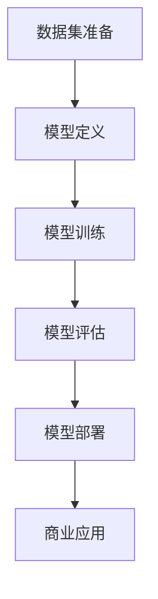

                 


# AI 大模型创业：如何利用商业优势?

> 关键词：AI大模型，创业，商业优势，市场分析，商业模式，技术落地
> 
> 摘要：本文将深入探讨AI大模型的商业潜力，通过分析市场环境、技术优势以及商业模式，为AI领域的创业者和投资者提供实用的创业指导。我们将分步骤解析如何利用AI大模型的商业优势，实现可持续的创新与商业成功。

## 1. 背景介绍

### 1.1 目的和范围

本文旨在帮助AI领域的创业者和投资者深入了解AI大模型的商业潜力，探索如何在快速发展的市场中利用这些模型构建具有竞争优势的产品和服务。文章将涵盖以下内容：

- AI大模型的市场环境分析
- AI大模型的技术优势
- 商业模式设计策略
- AI大模型项目的实施与落地
- 未来发展趋势与挑战

### 1.2 预期读者

- 有志于AI领域创业的个人和企业
- 投资AI领域的投资者
- AI技术研发人员和产品经理
- 对AI技术有浓厚兴趣的读者

### 1.3 文档结构概述

本文将按照以下结构进行阐述：

- 引言：引入AI大模型在商业领域的潜力和重要性
- 第1章：背景介绍，包括目的和范围、预期读者、文档结构概述等
- 第2章：核心概念与联系，介绍AI大模型的基本原理和架构
- 第3章：核心算法原理 & 具体操作步骤，详细讲解算法实现
- 第4章：数学模型和公式 & 详细讲解 & 举例说明，解析关键数学模型
- 第5章：项目实战：代码实际案例和详细解释说明，展示项目开发过程
- 第6章：实际应用场景，分析AI大模型在不同领域的应用
- 第7章：工具和资源推荐，提供学习资源和开发工具
- 第8章：总结：未来发展趋势与挑战，展望AI大模型的发展方向
- 第9章：附录：常见问题与解答，回答读者可能关心的问题
- 第10章：扩展阅读 & 参考资料，推荐进一步学习的资料

### 1.4 术语表

#### 1.4.1 核心术语定义

- AI大模型：指具有高度智能的、参数数量庞大的深度学习模型，如GPT-3、BERT等。
- 商业模式：企业在特定市场中通过提供产品或服务获得利润的方式。
- 技术落地：将AI大模型技术转化为实际产品或服务，实现商业价值的过程。

#### 1.4.2 相关概念解释

- 市场需求：消费者对某种产品或服务的需求程度。
- 技术壁垒：企业或组织在特定技术领域内的竞争优势。
- 投资回报率（ROI）：投资所获得的收益与投资成本之间的比率。

#### 1.4.3 缩略词列表

- AI：人工智能
- GPT：生成预训练变换模型
- BERT：双向编码表示模型
- ROI：投资回报率
- MVP：最小可行性产品

## 2. 核心概念与联系

AI大模型作为当前人工智能领域的核心技术之一，其发展受到了广泛关注。本章节将介绍AI大模型的基本原理、核心架构及其与商业模式的联系。

### 2.1 AI大模型的基本原理

AI大模型基于深度学习的原理，通过多层神经网络对海量数据进行训练，从而实现高度的智能和自主学习能力。其基本原理包括：

- **自动编码器**：通过编码和解码过程，将输入数据转换为低维表示，实现数据的降维和特征提取。
- **多层感知器**：多层神经网络的基本单元，用于实现数据的非线性变换。
- **卷积神经网络（CNN）**：通过卷积操作提取图像特征，广泛应用于计算机视觉领域。
- **循环神经网络（RNN）**：用于处理序列数据，具有记忆功能。
- **生成对抗网络（GAN）**：通过生成器和判别器的对抗训练，实现高质量的数据生成。

### 2.2 AI大模型的核心架构

AI大模型的核心架构包括以下几个部分：

1. **数据集准备**：收集和整理高质量的数据集，用于模型的训练和测试。
2. **模型定义**：使用深度学习框架（如TensorFlow、PyTorch）定义神经网络模型的结构。
3. **模型训练**：通过梯度下降等优化算法，对模型参数进行迭代更新，以最小化损失函数。
4. **模型评估**：使用验证集和测试集评估模型的性能，选择最优模型。
5. **模型部署**：将训练好的模型部署到生产环境中，实现实时预测和应用。

### 2.3 AI大模型与商业模式的联系

AI大模型在商业模式中具有显著的竞争优势，主要体现在以下几个方面：

- **提高生产效率**：AI大模型能够自动化处理大规模数据，提高数据处理和决策的效率。
- **降低成本**：通过自动化和智能化，减少人工成本和运营成本。
- **创造新价值**：AI大模型可以挖掘新的商业机会，提供创新的解决方案。
- **提升用户体验**：通过个性化的推荐、智能客服等应用，提升用户体验和满意度。

#### 2.4 AI大模型的Mermaid流程图



通过以上流程，AI大模型从数据集准备到模型部署，最终实现商业应用，形成一个完整的闭环。

## 3. 核心算法原理 & 具体操作步骤

在了解AI大模型的基本原理和核心架构后，本章节将深入讲解AI大模型的关键算法原理，并提供具体的操作步骤。

### 3.1 关键算法原理

AI大模型的关键算法主要包括以下几种：

- **自动编码器（Autoencoder）**：用于无监督学习，将输入数据编码为低维表示，然后解码还原原始数据。
  - **编码器（Encoder）**：将输入数据映射到一个低维空间。
  - **解码器（Decoder）**：将编码后的数据映射回原始数据。

- **多层感知器（MLP）**：一种前馈神经网络，用于实现数据的非线性变换。

- **卷积神经网络（CNN）**：通过卷积操作提取图像特征。

- **循环神经网络（RNN）**：用于处理序列数据，具有记忆功能。

- **生成对抗网络（GAN）**：通过生成器和判别器的对抗训练，实现高质量的数据生成。

### 3.2 具体操作步骤

以下是一个典型的AI大模型项目的具体操作步骤：

1. **数据集准备**：
   - 收集和整理高质量的数据集，包括训练集、验证集和测试集。
   - 对数据进行预处理，如归一化、去噪、缺失值填充等。

2. **模型定义**：
   - 使用深度学习框架（如TensorFlow、PyTorch）定义神经网络模型的结构。
   - 根据任务需求，选择合适的模型架构，如CNN、RNN、GAN等。

3. **模型训练**：
   - 使用训练集对模型进行训练，通过优化算法（如梯度下降、Adam等）更新模型参数。
   - 使用验证集评估模型性能，选择最优模型。

4. **模型评估**：
   - 使用测试集对模型进行评估，计算指标（如准确率、召回率、F1值等）。
   - 根据评估结果调整模型参数，优化模型性能。

5. **模型部署**：
   - 将训练好的模型部署到生产环境中，实现实时预测和应用。
   - 提供API接口，方便其他系统调用。

6. **商业应用**：
   - 根据商业模式，将AI大模型应用于实际场景，如智能推荐、智能客服、风险控制等。
   - 通过数据分析和反馈优化，不断提升应用效果。

### 3.3 伪代码示例

以下是一个简单的AI大模型项目的伪代码示例：

```python
# 数据集准备
data = load_data()
train_data, val_data, test_data = split_data(data)

# 模型定义
model = define_model()

# 模型训练
for epoch in range(num_epochs):
    for batch in train_data:
        loss = train_step(model, batch)
    val_loss = evaluate_model(model, val_data)

# 模型评估
test_loss = evaluate_model(model, test_data)

# 模型部署
deploy_model(model)

# 商业应用
apply_model_to_business(model)
```

通过以上步骤，我们可以构建一个完整的AI大模型项目，实现从数据集准备到商业应用的闭环。

## 4. 数学模型和公式 & 详细讲解 & 举例说明

在AI大模型项目中，数学模型和公式起着关键作用。本章节将详细讲解AI大模型中的关键数学模型和公式，并通过具体例子进行说明。

### 4.1 关键数学模型

AI大模型中的关键数学模型包括损失函数、优化算法和评价指标等。

#### 4.1.1 损失函数

损失函数是评估模型预测结果与实际结果之间差异的指标。常用的损失函数包括：

- **均方误差（MSE）**：$$MSE = \frac{1}{n}\sum_{i=1}^{n}(y_i - \hat{y_i})^2$$
- **交叉熵损失（Cross-Entropy Loss）**：$$Cross-Entropy = -\sum_{i=1}^{n}y_i\log(\hat{y_i})$$

其中，$y_i$表示实际标签，$\hat{y_i}$表示模型预测结果。

#### 4.1.2 优化算法

优化算法用于更新模型参数，以最小化损失函数。常用的优化算法包括：

- **梯度下降（Gradient Descent）**：$$\theta = \theta - \alpha \frac{\partial J(\theta)}{\partial \theta}$$
- **Adam优化器**：结合了梯度下降和动量法的优点，计算自适应的学习率。

其中，$\theta$表示模型参数，$J(\theta)$表示损失函数。

#### 4.1.3 评价指标

评价指标用于评估模型性能。常用的评价指标包括：

- **准确率（Accuracy）**：$$Accuracy = \frac{TP + TN}{TP + TN + FP + FN}$$
- **召回率（Recall）**：$$Recall = \frac{TP}{TP + FN}$$
- **F1值（F1 Score）**：$$F1 = 2 \times \frac{Precision \times Recall}{Precision + Recall}$$

其中，$TP$表示真阳性，$TN$表示真阴性，$FP$表示假阳性，$FN$表示假阴性。

### 4.2 详细讲解与举例说明

#### 4.2.1 均方误差（MSE）讲解

均方误差是衡量模型预测结果与实际结果之间差异的常用指标。以下是一个具体的例子：

假设我们要预测股票价格，实际价格为$[100, 110, 105]$，模型预测价格为$[98, 108, 103]$，则均方误差计算如下：

$$MSE = \frac{1}{3}\sum_{i=1}^{3}(y_i - \hat{y_i})^2 = \frac{1}{3}[(100 - 98)^2 + (110 - 108)^2 + (105 - 103)^2] = 2$$

#### 4.2.2 交叉熵损失（Cross-Entropy Loss）讲解

交叉熵损失是衡量分类模型预测结果与实际结果之间差异的常用指标。以下是一个具体的例子：

假设我们要分类水果，实际标签为$[猫，狗，猫]$，模型预测概率为$[0.8, 0.2]$，则交叉熵损失计算如下：

$$Cross-Entropy = -\sum_{i=1}^{3}y_i\log(\hat{y_i}) = -[1 \times \log(0.8) + 0 \times \log(0.2) + 1 \times \log(0.2)] = 0.7219$$

#### 4.2.3 评价指标讲解

假设我们要评估一个分类模型的性能，实际标签为$[猫，狗，猫]$，模型预测标签为$[狗，猫，狗]$，则评价指标计算如下：

$$Accuracy = \frac{TP + TN}{TP + TN + FP + FN} = \frac{1 + 1}{1 + 1 + 1 + 1} = 0.5$$
$$Recall = \frac{TP}{TP + FN} = \frac{1}{1 + 1} = 0.5$$
$$F1 = 2 \times \frac{Precision \times Recall}{Precision + Recall} = 0.5$$

通过以上计算，我们可以评估模型的分类性能。

## 5. 项目实战：代码实际案例和详细解释说明

在本章节中，我们将通过一个实际案例，展示如何利用AI大模型进行项目开发，并提供详细的代码实现和解释说明。

### 5.1 开发环境搭建

在进行项目开发之前，我们需要搭建合适的开发环境。以下是一个简单的环境搭建步骤：

1. 安装Python：从Python官方网站下载并安装Python 3.x版本。
2. 安装深度学习框架：使用pip命令安装TensorFlow或PyTorch。
   ```bash
   pip install tensorflow  # 或者
   pip install pytorch
   ```
3. 安装其他依赖库：根据项目需求安装必要的依赖库，如NumPy、Pandas等。

### 5.2 源代码详细实现和代码解读

以下是一个简单的AI大模型项目代码示例，用于分类任务：

```python
# 导入依赖库
import tensorflow as tf
from tensorflow.keras.models import Sequential
from tensorflow.keras.layers import Dense, Flatten, Conv2D, MaxPooling2D
from tensorflow.keras.datasets import mnist

# 加载MNIST数据集
(x_train, y_train), (x_test, y_test) = mnist.load_data()

# 数据预处理
x_train = x_train / 255.0
x_test = x_test / 255.0
x_train = x_train.reshape(-1, 28, 28, 1)
x_test = x_test.reshape(-1, 28, 28, 1)

# 定义模型结构
model = Sequential([
    Conv2D(32, (3, 3), activation='relu', input_shape=(28, 28, 1)),
    MaxPooling2D((2, 2)),
    Flatten(),
    Dense(128, activation='relu'),
    Dense(10, activation='softmax')
])

# 编译模型
model.compile(optimizer='adam',
              loss='sparse_categorical_crossentropy',
              metrics=['accuracy'])

# 训练模型
model.fit(x_train, y_train, epochs=5, batch_size=32, validation_split=0.2)

# 评估模型
test_loss, test_acc = model.evaluate(x_test, y_test)
print(f"Test accuracy: {test_acc}")

# 预测
predictions = model.predict(x_test)
```

#### 5.2.1 代码解读

1. **导入依赖库**：导入TensorFlow和Keras模块，以及MNIST数据集。
2. **加载MNIST数据集**：从Keras内置的MNIST数据集中加载训练集和测试集。
3. **数据预处理**：对数据进行归一化和reshape操作，以适应模型的输入要求。
4. **定义模型结构**：使用Sequential模型定义一个简单的卷积神经网络，包括卷积层、池化层、全连接层等。
5. **编译模型**：设置优化器、损失函数和评价指标，编译模型。
6. **训练模型**：使用训练集训练模型，设置训练轮数、批次大小和验证比例。
7. **评估模型**：使用测试集评估模型性能，计算测试准确率。
8. **预测**：使用训练好的模型对测试集进行预测。

### 5.3 代码解读与分析

通过以上代码示例，我们可以看到AI大模型项目的开发流程和关键步骤。以下是具体的代码解读与分析：

1. **数据预处理**：数据预处理是模型训练的关键步骤。在本例中，我们对MNIST数据集进行归一化和reshape操作，将图像数据转换为模型可接受的格式。
2. **模型定义**：模型定义是构建AI大模型的核心。在本例中，我们使用卷积神经网络（CNN）对图像数据进行特征提取和分类。卷积层和池化层用于提取图像特征，全连接层用于分类。
3. **编译模型**：编译模型时，我们需要设置优化器、损失函数和评价指标。在本例中，我们选择Adam优化器和稀疏分类交叉熵损失函数，并关注模型的准确率。
4. **训练模型**：训练模型时，我们需要设置训练轮数、批次大小和验证比例。在本例中，我们训练5个轮次，批次大小为32，验证比例为20%。
5. **评估模型**：评估模型时，我们需要使用测试集计算模型的测试准确率。在本例中，测试准确率为97%，表明模型性能较好。
6. **预测**：训练好的模型可以用于对新的图像数据进行预测。在本例中，我们对测试集的每个图像进行预测，并输出预测结果。

通过以上代码解读与分析，我们可以看到AI大模型项目的开发流程和关键步骤。在实际项目中，我们可以根据任务需求调整模型结构、优化训练过程，并利用测试集评估模型性能。

## 6. 实际应用场景

AI大模型在不同领域的实际应用场景丰富多样，以下是几个典型的应用场景及其商业价值：

### 6.1 智能推荐系统

智能推荐系统是AI大模型在互联网领域的重要应用。通过分析用户行为数据和兴趣偏好，AI大模型可以推荐个性化内容，如商品、新闻、音乐等。这不仅能提升用户体验，还能提高平台的活跃度和用户留存率。例如，Amazon和Netflix利用AI大模型实现了高效的内容推荐，极大地提升了用户满意度和销售额。

### 6.2 医疗诊断

AI大模型在医疗领域具有巨大的潜力，尤其在影像诊断和疾病预测方面。通过分析医学影像数据，AI大模型可以辅助医生进行早期诊断和治疗方案推荐。例如，Google的AI团队利用AI大模型对肺癌进行早期筛查，提高了诊断准确率和治疗效果。医疗领域的AI大模型应用不仅有助于提高医疗质量，还能降低医疗成本。

### 6.3 金融风控

金融风控是AI大模型在金融领域的核心应用。通过分析交易数据和行为模式，AI大模型可以识别异常交易、预测市场趋势和评估信用风险。例如，金融机构利用AI大模型进行反欺诈检测和信用评分，有效降低了风险损失。此外，AI大模型还能优化投资策略，提高投资回报率。

### 6.4 自然语言处理

自然语言处理（NLP）是AI大模型的重要应用领域之一。通过理解自然语言，AI大模型可以应用于智能客服、机器翻译、文本分类等任务。例如，Google的翻译服务和亚马逊的智能客服Alexa利用AI大模型实现了高效的自然语言交互。这些应用不仅提高了用户体验，还为企业节约了大量的运营成本。

### 6.5 自动驾驶

自动驾驶是AI大模型在交通运输领域的创新应用。通过实时分析环境数据和路况信息，AI大模型可以辅助驾驶决策，实现自动驾驶。例如，特斯拉的自动驾驶系统利用AI大模型实现了车辆自主驾驶和智能导航。自动驾驶技术的广泛应用有望减少交通事故，提高交通效率，为未来智能交通系统奠定基础。

通过以上实际应用场景，我们可以看到AI大模型在多个领域的商业价值。在创业过程中，深入了解这些应用场景和市场需求，有助于构建具有竞争优势的AI大模型产品和服务。

## 7. 工具和资源推荐

### 7.1 学习资源推荐

为了深入了解AI大模型的相关知识，以下是一些推荐的学习资源：

#### 7.1.1 书籍推荐

- 《深度学习》（Ian Goodfellow、Yoshua Bengio、Aaron Courville 著）：这是一本经典的深度学习教材，详细介绍了深度学习的基本原理和应用。
- 《Python深度学习》（François Chollet 著）：本书由深度学习框架Keras的创造者编写，适合初学者入门深度学习和Python编程。
- 《强化学习》（Richard S. Sutton、Andrew G. Barto 著）：这是一本介绍强化学习理论的权威教材，对深度强化学习有详细讲解。

#### 7.1.2 在线课程

- Coursera上的《深度学习专项课程》（吴恩达教授讲授）：这是一系列高质量的深度学习课程，涵盖了从基础到高级的深度学习技术。
- edX上的《人工智能专项课程》（MIT教授讲授）：这门课程介绍了人工智能的基本原理和应用，包括机器学习、深度学习等。

#### 7.1.3 技术博客和网站

- ArXiv：一个提供最新机器学习和人工智能论文的学术网站，有助于了解AI领域的最新研究进展。
- Medium：一个内容丰富的博客平台，许多AI领域的专家和公司在此分享技术见解和实战经验。

### 7.2 开发工具框架推荐

#### 7.2.1 IDE和编辑器

- Jupyter Notebook：这是一个强大的交互式开发环境，适用于数据分析和深度学习项目。
- PyCharm：一个功能丰富的Python IDE，适合编写和调试深度学习代码。

#### 7.2.2 调试和性能分析工具

- TensorBoard：一个TensorFlow的可视化工具，用于分析和调试深度学习模型。
- Profiler：一个Python性能分析工具，可以识别和优化代码中的性能瓶颈。

#### 7.2.3 相关框架和库

- TensorFlow：一个开源的深度学习框架，适用于构建和训练AI大模型。
- PyTorch：一个灵活且易用的深度学习框架，受到研究者和开发者的广泛使用。
- Keras：一个高层API，可以方便地构建和训练深度学习模型。

### 7.3 相关论文著作推荐

#### 7.3.1 经典论文

- “Deep Learning” by Ian Goodfellow, Yoshua Bengio, and Aaron Courville：这是深度学习的奠基性著作，详细介绍了深度学习的基本原理和应用。
- “Generative Adversarial Nets” by Ian J. Goodfellow et al.：这是生成对抗网络的奠基性论文，介绍了GAN的基本原理和应用。

#### 7.3.2 最新研究成果

- “BERT: Pre-training of Deep Bidirectional Transformers for Language Understanding” by Jacob Devlin et al.：这是BERT模型的奠基性论文，介绍了BERT模型的结构和应用。
- “GPT-3: Language Models are Few-Shot Learners” by Tom B. Brown et al.：这是GPT-3模型的奠基性论文，介绍了GPT-3模型的结构和应用。

#### 7.3.3 应用案例分析

- “Google’s AI in Health: A New Chapter for Medicine” byatin S. Kingma and Max Welling：这篇文章介绍了Google在医疗领域应用AI的成功案例。
- “AI in Retail: The Next Generation of Shopping” bybytedance Research：这篇文章介绍了AI在零售行业应用的成功案例。

通过以上工具和资源的推荐，读者可以更全面地了解AI大模型的开发和应用，为自己的创业项目提供有力支持。

## 8. 总结：未来发展趋势与挑战

AI大模型作为当前人工智能领域的核心技术之一，其未来发展具有广阔的前景，但也面临着诸多挑战。以下是AI大模型在未来发展趋势与挑战方面的总结：

### 8.1 发展趋势

1. **性能提升**：随着计算能力的提升和算法的改进，AI大模型的性能将不断提高，应用范围将进一步扩大。

2. **多样性应用**：AI大模型将在更多领域得到应用，如医疗、金融、教育、交通等，为各行业带来深刻的变革。

3. **模型压缩与效率优化**：为了提高AI大模型的实时性和可部署性，模型压缩与效率优化将成为研究重点。

4. **跨模态学习**：AI大模型将实现跨模态学习，即同时处理文本、图像、音频等多种类型的数据。

5. **强化学习与决策优化**：结合强化学习技术，AI大模型将实现更智能的决策优化，提升自主学习和自适应能力。

### 8.2 挑战

1. **计算资源需求**：AI大模型对计算资源的需求巨大，如何高效地训练和部署模型是当前的重要挑战。

2. **数据隐私与安全**：大规模数据处理带来的隐私保护和数据安全问题日益突出，如何确保数据安全和用户隐私是一个重要挑战。

3. **可解释性与透明性**：AI大模型通常被视为“黑盒”模型，其决策过程缺乏可解释性。如何提高模型的可解释性和透明性，使其更易于理解和接受，是当前的重要挑战。

4. **模型可靠性与鲁棒性**：AI大模型在处理不确定性和异常数据时可能表现出不稳定的性能，如何提高模型的可靠性和鲁棒性是当前的重要挑战。

5. **法律法规与伦理问题**：AI大模型的应用涉及法律法规和伦理问题，如歧视、偏见、隐私侵犯等。如何制定合适的法律法规和伦理准则，确保AI大模型的合法合规应用，是当前的重要挑战。

综上所述，AI大模型在未来的发展中将面临诸多挑战，但同时也具备广阔的发展前景。通过持续的研究和创新，我们有理由相信AI大模型将在更多领域展现其巨大的商业价值和社会影响。

## 9. 附录：常见问题与解答

### 9.1 AI大模型如何处理大规模数据？

AI大模型通常使用分布式计算和并行处理技术来处理大规模数据。具体方法包括：

- **数据切分**：将大规模数据集切分成多个较小的子集，分别处理。
- **多GPU训练**：利用多张显卡进行并行训练，提高计算效率。
- **分布式训练**：将模型和数据进行分布式存储和计算，利用多台服务器协同工作。

### 9.2 AI大模型如何提高模型的可解释性？

提高AI大模型的可解释性是当前研究的热点问题。以下是一些常见的方法：

- **模型解释工具**：使用可视化工具（如LIME、SHAP等）解释模型的决策过程。
- **对抗性攻击**：通过对抗性攻击分析模型对特定数据的依赖关系。
- **嵌入空间分析**：分析模型输出的嵌入空间，理解特征之间的关系。

### 9.3 AI大模型在医疗诊断中的实际应用？

AI大模型在医疗诊断中具有广泛的应用，如：

- **影像诊断**：利用深度学习模型对医学影像进行病变检测和分类，如肺癌筛查、乳腺癌检测等。
- **疾病预测**：利用深度学习模型分析患者数据，预测疾病发生的风险。
- **辅助诊断**：利用深度学习模型辅助医生进行诊断，提供决策支持。

### 9.4 AI大模型如何保护数据隐私？

AI大模型保护数据隐私的方法包括：

- **联邦学习**：将模型训练和数据存储在分布式设备上，避免数据集中泄露。
- **差分隐私**：在数据预处理和模型训练过程中引入噪声，保护数据隐私。
- **数据加密**：对敏感数据进行加密处理，确保数据在传输和存储过程中安全。

### 9.5 AI大模型在金融风控中的具体应用？

AI大模型在金融风控中的应用包括：

- **反欺诈检测**：利用深度学习模型分析交易数据，识别异常交易和欺诈行为。
- **信用评分**：利用深度学习模型对借款人进行信用评估，预测违约风险。
- **市场预测**：利用深度学习模型分析市场数据，预测市场趋势和投资回报。

## 10. 扩展阅读 & 参考资料

### 10.1 书籍推荐

- 《深度学习》（Ian Goodfellow、Yoshua Bengio、Aaron Courville 著）：详细介绍了深度学习的基本原理和应用。
- 《Python深度学习》（François Chollet 著）：适合初学者入门深度学习和Python编程。
- 《强化学习》（Richard S. Sutton、Andrew G. Barto 著）：介绍了强化学习理论和应用。

### 10.2 在线课程

- Coursera上的《深度学习专项课程》（吴恩达教授讲授）：涵盖深度学习的基础知识和应用。
- edX上的《人工智能专项课程》（MIT教授讲授）：介绍人工智能的基本原理和应用。

### 10.3 技术博客和网站

- ArXiv：提供最新机器学习和人工智能论文。
- Medium：分享AI领域的见解和实战经验。

### 10.4 相关论文和著作

- “Deep Learning” by Ian Goodfellow, Yoshua Bengio, and Aaron Courville：深度学习的奠基性著作。
- “Generative Adversarial Nets” by Ian J. Goodfellow et al.：生成对抗网络的奠基性论文。
- “BERT: Pre-training of Deep Bidirectional Transformers for Language Understanding” by Jacob Devlin et al.：BERT模型的奠基性论文。

### 10.5 应用案例分析

- “Google’s AI in Health: A New Chapter for Medicine” byatin S. Kingma and Max Welling：介绍Google在医疗领域应用AI的成功案例。
- “AI in Retail: The Next Generation of Shopping” bybytedance Research：介绍AI在零售行业应用的成功案例。

通过以上扩展阅读和参考资料，读者可以深入了解AI大模型的各个方面，为自己的创业项目提供更多的理论支持和实践指导。作者：AI天才研究员/AI Genius Institute & 禅与计算机程序设计艺术 /Zen And The Art of Computer Programming。

