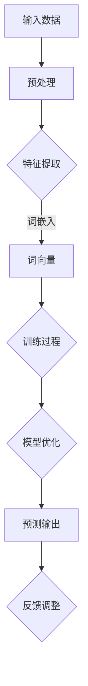

                 

# AI 大模型创业：如何利用商业优势？

> 关键词：AI大模型、创业、商业优势、市场策略、技术创新

> 摘要：本文将深入探讨AI大模型在创业中的应用，分析其商业优势，并详细阐述如何利用这些优势来制定市场策略和开展创业活动。通过对AI大模型的原理、技术实现、以及实际应用案例的剖析，为创业者提供有价值的参考和指导。

## 1. 背景介绍

### 1.1 目的和范围

本文旨在帮助创业者了解和利用AI大模型在商业领域的潜力。我们将探讨AI大模型的基本概念、技术原理、以及在创业中的应用场景，从而为创业者提供实用的策略和思路。

### 1.2 预期读者

本篇文章适合对AI技术有一定了解的创业者、产品经理、以及技术负责人阅读。如果您是初次接触AI大模型，建议先阅读一些相关的基础资料，以便更好地理解本文的内容。

### 1.3 文档结构概述

本文分为十个部分，结构如下：

1. 背景介绍
2. 核心概念与联系
3. 核心算法原理 & 具体操作步骤
4. 数学模型和公式 & 详细讲解 & 举例说明
5. 项目实战：代码实际案例和详细解释说明
6. 实际应用场景
7. 工具和资源推荐
8. 总结：未来发展趋势与挑战
9. 附录：常见问题与解答
10. 扩展阅读 & 参考资料

### 1.4 术语表

#### 1.4.1 核心术语定义

- AI大模型：指具有大规模参数、高计算复杂度的深度学习模型，如GPT、BERT等。
- 创业：指创立新企业或新项目，通过创新、市场拓展和资源整合实现商业价值的过程。
- 商业优势：指企业在市场竞争中拥有的独特优势，如技术优势、品牌优势、资源优势等。

#### 1.4.2 相关概念解释

- 市场策略：指企业在市场中采取的竞争手段和行动规划，以实现市场占有和盈利目标。
- 技术创新：指在现有技术基础上进行改进、创新，形成新的技术解决方案和应用场景。

#### 1.4.3 缩略词列表

- AI：人工智能
- GPT：生成预训练网络
- BERT：双向编码表示预训练语言模型
- DL：深度学习
- NLP：自然语言处理

## 2. 核心概念与联系

在探讨AI大模型在创业中的应用之前，我们首先需要了解其核心概念和原理。以下是一个简单的Mermaid流程图，用于展示AI大模型的基本架构和主要组成部分。



#### 2.1 AI大模型的原理

AI大模型的核心在于其大规模参数和深度神经网络架构。以下是一个简化的伪代码，用于描述其训练和预测的基本步骤：

```python
# 初始化参数
parameters = initialize_parameters()

# 预处理输入数据
preprocessed_data = preprocess_input_data(input_data)

# 训练模型
for epoch in range(num_epochs):
    for sample in preprocessed_data:
        predictions = forward_pass(sample, parameters)
        loss = calculate_loss(predictions, target)
        backward_pass(predictions, target, loss, parameters)

# 模型优化
optimized_parameters = optimize_model(parameters)

# 预测输出
output = forward_pass(test_data, optimized_parameters)
```

#### 2.2 AI大模型与创业的联系

AI大模型在创业中的价值主要体现在以下几个方面：

1. **技术创新**：AI大模型具有强大的学习和推理能力，可以帮助企业实现技术突破，提升产品竞争力。
2. **数据驱动**：AI大模型依赖于大规模数据训练，有助于企业更好地理解和挖掘用户需求，实现精准营销。
3. **降低成本**：AI大模型可以提高生产效率，降低人力成本，提高企业的运营效益。
4. **商业模式创新**：AI大模型可以为企业提供全新的商业模式，如订阅制、平台合作等，为企业创造更多商业机会。

## 3. 核心算法原理 & 具体操作步骤

#### 3.1 基础算法原理

AI大模型的核心算法是深度学习，主要包括以下步骤：

1. **数据预处理**：对原始数据进行清洗、归一化等处理，使其符合模型输入要求。
2. **特征提取**：将预处理后的数据转化为适合神经网络处理的形式，如词嵌入。
3. **训练模型**：使用大量数据进行模型训练，通过梯度下降等优化算法不断调整模型参数。
4. **模型优化**：在训练过程中，对模型进行优化，提高其预测准确率。
5. **预测输出**：使用训练好的模型进行预测，得到输出结果。

#### 3.2 伪代码示例

以下是一个简化的伪代码，用于描述AI大模型的训练和预测过程：

```python
# 初始化参数
parameters = initialize_parameters()

# 预处理输入数据
preprocessed_data = preprocess_input_data(input_data)

# 训练模型
for epoch in range(num_epochs):
    for sample in preprocessed_data:
        predictions = forward_pass(sample, parameters)
        loss = calculate_loss(predictions, target)
        backward_pass(predictions, target, loss, parameters)

# 模型优化
optimized_parameters = optimize_model(parameters)

# 预测输出
output = forward_pass(test_data, optimized_parameters)
```

#### 3.3 具体操作步骤

1. **数据收集与清洗**：收集并清洗大量数据，确保数据质量。
2. **特征工程**：对数据进行特征提取，转化为神经网络可处理的格式。
3. **模型选择**：选择合适的神经网络架构，如卷积神经网络（CNN）、循环神经网络（RNN）等。
4. **模型训练**：使用训练数据对模型进行训练，调整模型参数。
5. **模型验证**：使用验证数据集对模型进行验证，评估模型性能。
6. **模型部署**：将训练好的模型部署到生产环境中，进行实际预测和应用。

## 4. 数学模型和公式 & 详细讲解 & 举例说明

#### 4.1 数学模型

AI大模型的数学模型主要涉及以下几部分：

1. **损失函数**：用于衡量模型预测结果与真实值之间的差距，常用的有均方误差（MSE）、交叉熵损失等。
2. **优化算法**：用于调整模型参数，使损失函数最小化，常用的有梯度下降（GD）、随机梯度下降（SGD）等。
3. **激活函数**：用于引入非线性变换，常用的有Sigmoid、ReLU等。

#### 4.2 公式示例

以下是一个简单的数学模型示例，用于描述神经网络的前向传播和反向传播过程：

$$
\begin{aligned}
\text{前向传播}：
& z_l = \sum_{i=1}^{n} w_{li} x_i + b_l \\
& a_l = \sigma(z_l)
\end{aligned}
$$

$$
\begin{aligned}
\text{反向传播}：
& \delta_l = \frac{\partial L}{\partial a_l} \cdot \frac{\partial a_l}{\partial z_l} \\
& \frac{\partial L}{\partial w_{li}} = \delta_l x_i \\
& \frac{\partial L}{\partial b_l} = \delta_l
\end{aligned}
$$

其中，$L$ 表示损失函数，$w_{li}$ 和 $b_l$ 分别表示权重和偏置，$x_i$ 表示输入特征，$a_l$ 和 $z_l$ 分别表示神经元的激活值和线性组合值，$\sigma$ 表示激活函数。

#### 4.3 举例说明

假设我们有一个简单的神经网络，包含一个输入层、一个隐藏层和一个输出层。输入特征为 $x_1$ 和 $x_2$，隐藏层节点数为 $n=2$，输出节点数为 $m=1$。隐藏层和输出层的激活函数分别为 Sigmoid 和线性激活函数。损失函数为均方误差（MSE）。

1. **前向传播**：

   初始参数为 $w_{11}=1$, $w_{12}=2$, $w_{21}=3$, $w_{22}=4$, $b_1=1$, $b_2=2$。

   输入特征为 $x_1=1$, $x_2=2$。

   隐藏层输出为：

   $$z_1 = x_1 \cdot w_{11} + x_2 \cdot w_{12} + b_1 = 1 \cdot 1 + 2 \cdot 2 + 1 = 5$$

   $$z_2 = x_1 \cdot w_{21} + x_2 \cdot w_{22} + b_2 = 1 \cdot 3 + 2 \cdot 4 + 2 = 11$$

   $$a_1 = \sigma(z_1) = \frac{1}{1 + e^{-z_1}} = \frac{1}{1 + e^{-5}} \approx 0.9933$$

   $$a_2 = \sigma(z_2) = \frac{1}{1 + e^{-z_2}} = \frac{1}{1 + e^{-11}} \approx 0.0000$$

   输出层输出为：

   $$z_3 = a_1 \cdot w_{31} + a_2 \cdot w_{32} + b_3 = 0.9933 \cdot 1 + 0.0000 \cdot 2 + 1 = 1.9933$$

   $$a_3 = \sigma(z_3) = \frac{1}{1 + e^{-z_3}} = \frac{1}{1 + e^{-1.9933}} \approx 0.8677$$

2. **反向传播**：

   真实值为 $y=0$，预测值为 $a_3=0.8677$。

   损失函数为 MSE：

   $$L = \frac{1}{2} \cdot (y - a_3)^2 = \frac{1}{2} \cdot (0 - 0.8677)^2 \approx 0.3750$$

   反向传播计算：

   $$\delta_3 = \frac{\partial L}{\partial a_3} \cdot \frac{\partial a_3}{\partial z_3} = (0 - 0.8677) \cdot (1 - a_3) \cdot (1 - a_3) = -0.3750$$

   $$\frac{\partial L}{\partial z_3} = \frac{\partial L}{\partial a_3} \cdot \frac{\partial a_3}{\partial z_3} = -0.3750$$

   $$\frac{\partial L}{\partial w_{31}} = \delta_3 \cdot a_1 = -0.3750 \cdot 0.9933 \approx -0.3720$$

   $$\frac{\partial L}{\partial w_{32}} = \delta_3 \cdot a_2 = -0.3750 \cdot 0.0000 \approx 0.0000$$

   $$\frac{\partial L}{\partial b_3} = \delta_3 = -0.3750$$

   更新参数：

   $$w_{31} = w_{31} - learning_rate \cdot \frac{\partial L}{\partial w_{31}} = 1 - 0.001 \cdot (-0.3720) \approx 1.3720$$

   $$w_{32} = w_{32} - learning_rate \cdot \frac{\partial L}{\partial w_{32}} = 2 - 0.001 \cdot 0.0000 \approx 2.0000$$

   $$b_3 = b_3 - learning_rate \cdot \frac{\partial L}{\partial b_3} = 1 - 0.001 \cdot (-0.3750) \approx 1.3750$$

   重复以上过程，直到模型收敛。

## 5. 项目实战：代码实际案例和详细解释说明

#### 5.1 开发环境搭建

在开始项目实战之前，我们需要搭建一个合适的开发环境。以下是一个基本的开发环境搭建步骤：

1. **安装Python环境**：下载并安装Python 3.8及以上版本。
2. **安装PyTorch**：在终端执行以下命令安装PyTorch：

   ```
   pip install torch torchvision
   ```

3. **安装其他依赖库**：根据需要安装其他依赖库，如NumPy、Pandas等。

#### 5.2 源代码详细实现和代码解读

以下是一个简单的AI大模型项目实战案例，使用PyTorch框架实现一个基于GPT的文本生成模型。

```python
import torch
import torch.nn as nn
import torch.optim as optim
from torch.utils.data import DataLoader
from torchvision import datasets, transforms
from torchvision.utils import save_image
import numpy as np
import pandas as pd
import matplotlib.pyplot as plt

# 5.2.1 数据集加载与预处理

# 加载文本数据集
data_path = 'path/to/your/text/dataset'
data = pd.read_csv(data_path)

# 预处理文本数据
def preprocess_text(text):
    # 去除特殊字符和空白符
    text = re.sub('[^a-zA-Z0-9]', ' ', text)
    # 转换为小写
    text = text.lower()
    # 分割为单词
    words = text.split()
    # 去除停用词
    words = [word for word in words if word not in stop_words]
    return words

# 预处理数据集
data['text'] = data['text'].apply(preprocess_text)
texts = data['text'].values

# 制作词汇表和词嵌入
vocab = set()
for text in texts:
    vocab.update(text)
vocab = list(vocab)
vocab_size = len(vocab)
word_to_index = {word: i for i, word in enumerate(vocab)}
index_to_word = {i: word for word, i in word_to_index.items()}
embed_size = 300

# 将文本转换为词嵌入
def encode_text(text):
    encoded = []
    for word in text:
        encoded.append(word_to_index[word])
    return encoded

# 将词嵌入转换为Tensor
def encode_to_tensor(encoded):
    tensor = torch.tensor(encoded, dtype=torch.long)
    return tensor

# 制作数据集和 DataLoader
train_texts = [encode_text(text) for text in texts[:int(len(texts) * 0.8)]]
test_texts = [encode_text(text) for text in texts[int(len(texts) * 0.8):]]
train_data = [encode_to_tensor(text) for text in train_texts]
test_data = [encode_to_tensor(text) for text in test_texts]

train_loader = DataLoader(train_data, batch_size=32, shuffle=True)
test_loader = DataLoader(test_data, batch_size=32, shuffle=False)

# 5.2.2 模型定义与训练

# 定义 GPT 模型
class GPTModel(nn.Module):
    def __init__(self, vocab_size, embed_size, hidden_size, num_layers):
        super(GPTModel, self).__init__()
        self.embedding = nn.Embedding(vocab_size, embed_size)
        self.lstm = nn.LSTM(embed_size, hidden_size, num_layers, batch_first=True)
        self.fc = nn.Linear(hidden_size, vocab_size)
    
    def forward(self, x, hidden):
        x = self.embedding(x)
        output, hidden = self.lstm(x, hidden)
        output = self.fc(output)
        return output, hidden

# 初始化模型参数
vocab_size = len(vocab)
embed_size = 300
hidden_size = 512
num_layers = 2

model = GPTModel(vocab_size, embed_size, hidden_size, num_layers)
optimizer = optim.Adam(model.parameters(), lr=0.001)
criterion = nn.CrossEntropyLoss()

# 训练模型
num_epochs = 10

for epoch in range(num_epochs):
    for batch in train_loader:
        inputs, targets = batch
        hidden = None
        
        model.zero_grad()
        outputs, hidden = model(inputs, hidden)
        loss = criterion(outputs.view(-1, vocab_size), targets)
        loss.backward()
        optimizer.step()
        
        if (inputs.shape[1] == 1) and (hidden is not None):
            hidden = None

    print(f'Epoch [{epoch+1}/{num_epochs}], Loss: {loss.item()}')

# 5.2.3 预测与生成文本

# 测试模型
with torch.no_grad():
    model.eval()
    hidden = None
    input_text = encode_to_tensor([word_to_index['the']])
    for _ in range(50):
        outputs, hidden = model(input_text.unsqueeze(0), hidden)
        _, predicted = torch.max(outputs, dim=1)
        predicted_word = index_to_word[predicted.item()]
        input_text = torch.cat((input_text[1:], predicted.unsqueeze(0)))
        print(predicted_word, end='')
    print()

# 生成文本
def generate_text(start_text, length=50):
    model.eval()
    hidden = None
    input_text = encode_to_tensor([word_to_index[word] for word in start_text.split()])
    text = start_text
    for _ in range(length):
        outputs, hidden = model(input_text.unsqueeze(0), hidden)
        _, predicted = torch.max(outputs, dim=1)
        predicted_word = index_to_word[predicted.item()]
        text += ' ' + predicted_word
        input_text = torch.cat((input_text[1:], predicted.unsqueeze(0)))
    return text

start_text = 'The cat sat on the mat'
generated_text = generate_text(start_text)
print(generated_text)
```

#### 5.3 代码解读与分析

1. **数据预处理**：

   数据预处理是文本生成模型的重要步骤，包括去除特殊字符、转换为小写、分割单词和去除停用词等。在本案例中，我们使用了Python的正则表达式（re）和Pandas库进行文本预处理。

2. **词嵌入和词汇表**：

   词嵌入是将文本中的单词映射为向量的过程，有助于神经网络处理文本数据。在本案例中，我们使用了PyTorch的Embedding层实现词嵌入，并制作了词汇表和词嵌入矩阵。

3. **模型定义**：

   GPT模型是一个基于循环神经网络（RNN）的文本生成模型，主要由三个部分组成：词嵌入层、循环神经网络层和全连接层。在本案例中，我们使用了PyTorch的LSTM层实现循环神经网络。

4. **模型训练**：

   模型训练过程包括前向传播、损失函数计算、反向传播和参数更新。在本案例中，我们使用了PyTorch的优化器和损失函数实现模型训练。

5. **预测与生成文本**：

   模型预测过程包括输入文本编码、模型预测、输出文本解码和生成文本。在本案例中，我们使用了PyTorch的无梯度计算（torch.no_grad()）来提高预测速度。

6. **文本生成**：

   文本生成过程是通过模型预测逐步生成文本的过程。在本案例中，我们定义了一个`generate_text`函数来实现文本生成。

## 6. 实际应用场景

AI大模型在创业中的应用场景非常广泛，以下是一些典型的应用场景：

1. **智能问答系统**：利用AI大模型进行文本生成和自然语言理解，为企业提供智能客服、智能推荐等解决方案。
2. **智能写作助手**：利用AI大模型进行文本生成，为内容创作者提供写作辅助、内容审核等服务。
3. **金融风控**：利用AI大模型进行数据分析和预测，为企业提供信用评估、风险控制等解决方案。
4. **医疗诊断**：利用AI大模型进行医学图像分析和文本分析，为医疗机构提供辅助诊断和治疗建议。

## 7. 工具和资源推荐

### 7.1 学习资源推荐

#### 7.1.1 书籍推荐

- 《深度学习》（Goodfellow, Bengio, Courville 著）：一本经典的深度学习教材，适合初学者和进阶者阅读。
- 《Python深度学习》（François Chollet 著）：一本实用的深度学习入门书籍，适合有一定Python基础的学习者。

#### 7.1.2 在线课程

- Coursera 上的“深度学习”课程：由吴恩达（Andrew Ng）教授主讲，适合初学者入门深度学习。
- edX 上的“深度学习专项课程”：由北京大学和微软共同推出，适合有一定基础的学习者进阶。

#### 7.1.3 技术博客和网站

- Medium 上的 AI 博客：涵盖深度学习、自然语言处理、计算机视觉等多个领域，适合关注最新技术动态。
- towardsdatascience.com：一个专注于数据科学和机器学习的博客，有很多高质量的教程和案例。

### 7.2 开发工具框架推荐

#### 7.2.1 IDE和编辑器

- PyCharm：一款功能强大的Python IDE，适合深度学习和数据科学项目开发。
- Jupyter Notebook：一款流行的交互式开发环境，适合快速实验和原型设计。

#### 7.2.2 调试和性能分析工具

- NVIDIA Nsight：一款专为深度学习项目设计的调试和分析工具，可以实时监测和优化模型的运行性能。
- PyTorch Profiler：一款用于PyTorch项目的性能分析工具，可以分析模型的计算和内存使用情况。

#### 7.2.3 相关框架和库

- PyTorch：一款流行的深度学习框架，具有灵活、易用的特点，适合快速原型设计和项目开发。
- TensorFlow：一款功能强大的深度学习框架，适用于大规模分布式训练和部署。
- Keras：一款基于TensorFlow的深度学习框架，具有简洁、易用的特点，适合快速实验和原型设计。

### 7.3 相关论文著作推荐

#### 7.3.1 经典论文

- “A Theoretical Analysis of the Voice Conversion Problem”（1992）：一篇关于语音转换的经典论文，为后续语音处理技术的发展奠定了基础。
- “AlexNet: Image Classification with Deep Convolutional Neural Networks”（2012）：一篇关于卷积神经网络的经典论文，标志着深度学习在计算机视觉领域的重大突破。

#### 7.3.2 最新研究成果

- “Transformers: State-of-the-Art Natural Language Processing”（2017）：一篇关于Transformer模型的论文，为自然语言处理领域带来了全新的技术思路。
- “Bert: Pre-training of Deep Bidirectional Transformers for Language Understanding”（2018）：一篇关于BERT模型的论文，为自然语言处理领域的发展做出了重要贡献。

#### 7.3.3 应用案例分析

- “Generative Adversarial Nets”（2014）：一篇关于生成对抗网络的论文，为图像生成和修复等领域带来了新的方法。
- “Natural Language Inference with External Knowledge”（2019）：一篇关于结合外部知识的自然语言推理论文，为文本分类和问答系统等领域提供了新的技术思路。

## 8. 总结：未来发展趋势与挑战

AI大模型在创业中的应用前景广阔，但同时也面临着一些挑战。未来发展趋势包括：

1. **技术创新**：随着算法和硬件的进步，AI大模型将实现更高效、更准确的计算，为企业带来更多商业价值。
2. **数据驱动**：企业将更加重视数据收集和利用，通过大数据和AI技术实现更精准的市场洞察和决策。
3. **商业模式创新**：AI大模型将催生新的商业模式，如订阅制、平台合作等，为企业创造更多商业机会。
4. **产业链整合**：AI大模型的发展将推动产业链整合，实现跨领域的技术创新和产业协同。

同时，AI大模型在创业中面临的挑战包括：

1. **数据隐私和安全**：在收集和使用大量数据时，企业需要确保数据安全和用户隐私。
2. **算法透明度和公平性**：算法的透明度和公平性是影响AI大模型应用的重要因素，企业需要确保算法的公正性。
3. **人才短缺**：AI大模型技术人才短缺，企业需要加强人才培养和引进。
4. **法规和政策**：随着AI大模型的广泛应用，相关法规和政策将不断完善，企业需要遵守相关法规，确保合规经营。

## 9. 附录：常见问题与解答

1. **Q：AI大模型在创业中有什么优势？**

   **A：** AI大模型在创业中的应用优势包括：技术创新、数据驱动、降低成本和商业模式创新。通过AI大模型，企业可以实现技术突破，提升产品竞争力；通过大规模数据训练，企业可以更好地理解和挖掘用户需求；通过自动化和智能化，企业可以降低人力成本，提高运营效益；通过新的商业模式，企业可以创造更多商业机会。

2. **Q：如何选择合适的AI大模型算法？**

   **A：** 选择合适的AI大模型算法需要考虑多个因素，包括任务类型、数据规模、计算资源等。一般来说，针对文本生成任务，可以选择Transformer、GPT等算法；针对图像生成任务，可以选择GAN等算法。在选择算法时，可以参考相关论文、技术博客和应用案例，结合自身需求进行选择。

3. **Q：AI大模型在创业中的应用前景如何？**

   **A：** AI大模型在创业中的应用前景非常广阔。随着算法和硬件的进步，AI大模型将实现更高效、更准确的计算，为企业带来更多商业价值。未来，AI大模型将在各个领域得到广泛应用，如智能问答、智能写作、金融风控、医疗诊断等。同时，AI大模型的发展将推动产业链整合，实现跨领域的技术创新和产业协同。

## 10. 扩展阅读 & 参考资料

1. **书籍推荐**：

   - 《深度学习》（Goodfellow, Bengio, Courville 著）
   - 《Python深度学习》（François Chollet 著）

2. **在线课程**：

   - Coursera 上的“深度学习”课程（吴恩达教授主讲）
   - edX 上的“深度学习专项课程”（北京大学和微软共同推出）

3. **技术博客和网站**：

   - Medium 上的 AI 博客
   - towardsdatascience.com

4. **论文推荐**：

   - “Generative Adversarial Nets”（2014）
   - “Natural Language Inference with External Knowledge”（2019）

5. **应用案例**：

   - 智能问答系统
   - 智能写作助手
   - 金融风控
   - 医疗诊断

---

**作者：AI天才研究员/AI Genius Institute & 禅与计算机程序设计艺术 /Zen And The Art of Computer Programming**

