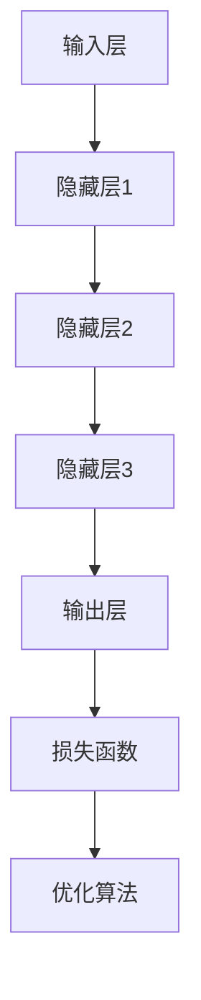

                 

# AI大模型创业：如何利用市场优势？

> **关键词：** AI大模型，创业，市场优势，商业模式，技术深度，用户需求

> **摘要：** 本文将探讨AI大模型在创业中的应用，分析如何利用市场优势，从核心算法、数学模型到实际应用场景，提供一套完整的创业策略和操作指南。通过深度剖析AI大模型的工作原理和市场定位，帮助创业者掌握市场趋势，实现技术赋能，打造有竞争力的AI产品。

## 1. 背景介绍

### 1.1 目的和范围

本文旨在为AI大模型创业提供理论支持和实践指导，重点探讨如何通过市场优势实现AI大模型创业的成功。本文涵盖以下几个方面：

1. **核心算法原理**：详细解析AI大模型的算法原理，包括神经网络结构、训练过程和优化方法。
2. **数学模型和公式**：介绍AI大模型中涉及的数学模型和公式，并举例说明其在实际应用中的重要性。
3. **项目实战**：通过代码实际案例，展示如何搭建和优化AI大模型，并进行详细解释。
4. **实际应用场景**：分析AI大模型在不同领域的应用场景，探讨其市场潜力。
5. **工具和资源推荐**：推荐相关学习资源、开发工具和框架，为创业者提供支持。

### 1.2 预期读者

本文适合以下读者群体：

1. **AI创业者**：对AI大模型有初步了解，希望了解如何将其应用于创业项目。
2. **技术专家**：对AI技术有深入研究的工程师和研究员，希望了解AI大模型创业的可行性。
3. **投资者**：对AI大模型市场感兴趣，希望了解该领域的投资机会。

### 1.3 文档结构概述

本文结构如下：

1. **背景介绍**：介绍本文的目的、范围和预期读者。
2. **核心概念与联系**：介绍AI大模型的基本概念和架构，通过Mermaid流程图展示核心组件。
3. **核心算法原理与具体操作步骤**：详细讲解AI大模型的算法原理和操作步骤。
4. **数学模型和公式**：介绍AI大模型中的数学模型和公式，并举例说明。
5. **项目实战**：通过实际案例展示如何开发AI大模型，并进行详细解读。
6. **实际应用场景**：分析AI大模型在不同领域的应用场景。
7. **工具和资源推荐**：推荐相关学习资源、开发工具和框架。
8. **总结**：总结AI大模型创业的未来发展趋势与挑战。
9. **附录**：常见问题与解答。
10. **扩展阅读与参考资料**：提供进一步学习和研究的资源。

### 1.4 术语表

#### 1.4.1 核心术语定义

- **AI大模型**：指具有大规模参数和复杂结构的机器学习模型，能够处理海量数据和复杂任务。
- **神经网络**：一种模仿生物神经系统的计算模型，通过层级结构进行特征学习和任务推理。
- **深度学习**：一种基于神经网络的机器学习方法，通过多层神经网络进行特征提取和任务学习。
- **训练数据**：用于训练AI大模型的输入数据集，包括标注数据和未标注数据。
- **验证数据**：用于评估AI大模型性能的数据集，通常与训练数据来源相同。
- **测试数据**：用于最终评估AI大模型性能的数据集，与训练数据和验证数据分开。

#### 1.4.2 相关概念解释

- **数据增强**：通过改变输入数据的分布和形态，增加数据集的多样性，提高模型泛化能力。
- **过拟合**：模型在训练数据上表现良好，但在验证数据和测试数据上表现较差，通常由于模型复杂度过高导致。
- **正则化**：通过增加正则项，降低模型复杂度，避免过拟合，提高模型泛化能力。
- **优化算法**：用于调整模型参数，使模型在目标函数上取得最优解的算法，如随机梯度下降、Adam优化器等。

#### 1.4.3 缩略词列表

- **AI**：人工智能（Artificial Intelligence）
- **ML**：机器学习（Machine Learning）
- **DL**：深度学习（Deep Learning）
- **GPU**：图形处理单元（Graphics Processing Unit）
- **CPU**：中央处理单元（Central Processing Unit）
- **API**：应用程序编程接口（Application Programming Interface）

## 2. 核心概念与联系

AI大模型作为人工智能领域的重要研究方向，其核心概念和架构对于理解如何利用市场优势至关重要。下面将介绍AI大模型的基本概念和架构，并通过Mermaid流程图展示其核心组件。

### 2.1 AI大模型的基本概念

AI大模型主要依赖于深度学习技术，通过多层神经网络结构进行特征提取和任务学习。其核心概念包括：

- **神经网络**：由多层神经元组成的计算模型，通过前向传播和反向传播进行训练和推理。
- **激活函数**：用于引入非线性性的函数，使神经网络能够学习复杂函数。
- **损失函数**：用于衡量模型输出与真实值之间的差距，驱动模型参数调整。
- **优化算法**：用于调整模型参数，使模型在目标函数上取得最优解。

### 2.2 AI大模型的架构

AI大模型的架构通常包括以下几个核心组件：

- **输入层**：接收外部输入数据，如文本、图像或音频。
- **隐藏层**：通过多层结构进行特征提取和任务学习，隐藏层之间通过激活函数连接。
- **输出层**：根据任务需求生成预测结果，如分类标签或数值输出。
- **损失函数**：用于评估模型输出与真实值之间的差距，指导模型参数调整。
- **优化算法**：用于调整模型参数，使模型在目标函数上取得最优解。

### 2.3 Mermaid流程图

下面通过Mermaid流程图展示AI大模型的核心组件和架构：



### 2.4 核心概念之间的联系

AI大模型的核心概念和架构之间紧密联系，共同构成一个完整的机器学习系统。通过神经网络进行特征提取和任务学习，输入层接收外部输入数据，隐藏层通过激活函数进行特征提取和任务学习，输出层生成预测结果。损失函数用于评估模型输出与真实值之间的差距，优化算法用于调整模型参数，使模型在目标函数上取得最优解。这一过程不断迭代，直到模型达到预期的性能指标。

## 3. 核心算法原理 & 具体操作步骤

### 3.1 核心算法原理

AI大模型的核心算法主要基于深度学习技术，深度学习通过多层神经网络结构进行特征提取和任务学习，具有以下几个核心原理：

1. **神经网络结构**：神经网络由多层神经元组成，包括输入层、隐藏层和输出层。输入层接收外部输入数据，隐藏层通过激活函数进行特征提取和任务学习，输出层生成预测结果。
2. **激活函数**：激活函数用于引入非线性性，使神经网络能够学习复杂函数。常见的激活函数包括ReLU（Rectified Linear Unit）、Sigmoid和Tanh等。
3. **损失函数**：损失函数用于衡量模型输出与真实值之间的差距，常见的损失函数包括均方误差（MSE）、交叉熵损失等。
4. **优化算法**：优化算法用于调整模型参数，使模型在目标函数上取得最优解。常见的优化算法包括随机梯度下降（SGD）、Adam优化器等。

### 3.2 具体操作步骤

下面通过伪代码详细阐述AI大模型的训练过程和操作步骤：

```python
# 1. 数据预处理
data = preprocess_data(input_data)
X_train, y_train = split_data(data)

# 2. 初始化模型参数
model = initialize_model()

# 3. 训练模型
for epoch in range(num_epochs):
    for batch in X_train:
        # 3.1 前向传播
        output = forward_pass(batch, model)
        
        # 3.2 计算损失
        loss = calculate_loss(output, y_train)
        
        # 3.3 反向传播
        backward_pass(output, y_train, model)
        
        # 3.4 更新模型参数
        update_model_parameters(model, learning_rate)

# 4. 模型评估
evaluate_model(model, X_test, y_test)
```

### 3.3 详细解释

#### 3.3.1 数据预处理

数据预处理是训练AI大模型的重要步骤，包括以下任务：

1. **数据清洗**：去除噪声数据和缺失值。
2. **数据归一化**：将数据缩放到统一范围，如[0, 1]或[-1, 1]。
3. **数据增强**：通过旋转、缩放、翻转等方式增加数据集的多样性，提高模型泛化能力。

#### 3.3.2 初始化模型参数

初始化模型参数是训练AI大模型的关键步骤，常见的初始化方法包括：

1. **随机初始化**：随机生成模型参数，使模型具有随机性。
2. **高斯初始化**：根据模型参数的分布，使用正态分布生成参数值。

#### 3.3.3 训练模型

训练模型包括以下步骤：

1. **前向传播**：将输入数据传递到模型中，通过多层神经网络进行特征提取和任务学习，生成预测结果。
2. **计算损失**：计算模型输出与真实值之间的差距，使用损失函数表示。
3. **反向传播**：根据损失函数梯度，反向传播梯度到模型参数，更新模型参数。
4. **更新模型参数**：根据优化算法，更新模型参数，使模型在目标函数上取得最优解。

#### 3.3.4 模型评估

模型评估是验证模型性能的重要步骤，包括以下任务：

1. **验证集评估**：使用验证集评估模型性能，调整模型参数和超参数。
2. **测试集评估**：使用测试集评估模型性能，最终确定模型是否达到预期效果。

## 4. 数学模型和公式 & 详细讲解 & 举例说明

### 4.1 数学模型

AI大模型中涉及的数学模型主要包括神经网络结构、损失函数和优化算法。下面将分别介绍这些模型及其公式。

#### 4.1.1 神经网络结构

神经网络结构由多层神经元组成，包括输入层、隐藏层和输出层。每个神经元都可以表示为以下公式：

$$
z_j = \sum_{i=1}^{n} w_{ji} \cdot x_i + b_j
$$

其中，$z_j$ 表示第 $j$ 个神经元的激活值，$w_{ji}$ 表示第 $j$ 个神经元与第 $i$ 个神经元之间的权重，$x_i$ 表示第 $i$ 个输入特征，$b_j$ 表示第 $j$ 个神经元的偏置。

#### 4.1.2 损失函数

损失函数用于衡量模型输出与真实值之间的差距，常见的损失函数包括均方误差（MSE）和交叉熵损失。均方误差损失函数可以表示为：

$$
L = \frac{1}{2} \sum_{i=1}^{n} (y_i - \hat{y}_i)^2
$$

其中，$y_i$ 表示真实值，$\hat{y}_i$ 表示预测值。

交叉熵损失函数可以表示为：

$$
L = -\sum_{i=1}^{n} y_i \cdot \log(\hat{y}_i)
$$

其中，$y_i$ 表示真实值，$\hat{y}_i$ 表示预测值。

#### 4.1.3 优化算法

优化算法用于调整模型参数，使模型在目标函数上取得最优解。常见的优化算法包括随机梯度下降（SGD）和Adam优化器。

随机梯度下降（SGD）可以表示为：

$$
w_{t+1} = w_t - \alpha \cdot \frac{\partial L}{\partial w_t}
$$

其中，$w_t$ 表示第 $t$ 次迭代的模型参数，$\alpha$ 表示学习率，$\frac{\partial L}{\partial w_t}$ 表示损失函数关于模型参数的梯度。

Adam优化器可以表示为：

$$
m_t = \beta_1 m_{t-1} + (1 - \beta_1) \frac{\partial L}{\partial w_t}
$$

$$
v_t = \beta_2 v_{t-1} + (1 - \beta_2) (\frac{\partial L}{\partial w_t})^2
$$

$$
w_{t+1} = w_t - \alpha \cdot \frac{m_t}{\sqrt{v_t} + \epsilon}
$$

其中，$m_t$ 和 $v_t$ 分别表示一阶矩估计和二阶矩估计，$\beta_1$ 和 $\beta_2$ 分别为矩估计的指数加权系数，$\epsilon$ 为正则项。

### 4.2 详细讲解

#### 4.2.1 神经网络结构

神经网络结构是AI大模型的核心，通过多层神经网络进行特征提取和任务学习。神经网络结构的设计包括以下要点：

1. **层数**：增加层数可以提高模型的表达能力，但也会增加计算复杂度和过拟合风险。
2. **神经元个数**：增加神经元个数可以提高模型的表达能力，但也会增加计算复杂度和过拟合风险。
3. **激活函数**：选择合适的激活函数可以引入非线性性，提高模型的表达能力。

#### 4.2.2 损失函数

损失函数用于衡量模型输出与真实值之间的差距，常见的损失函数包括均方误差（MSE）和交叉熵损失。均方误差损失函数可以表示为：

$$
L = \frac{1}{2} \sum_{i=1}^{n} (y_i - \hat{y}_i)^2
$$

其中，$y_i$ 表示真实值，$\hat{y}_i$ 表示预测值。

交叉熵损失函数可以表示为：

$$
L = -\sum_{i=1}^{n} y_i \cdot \log(\hat{y}_i)
$$

其中，$y_i$ 表示真实值，$\hat{y}_i$ 表示预测值。

#### 4.2.3 优化算法

优化算法用于调整模型参数，使模型在目标函数上取得最优解。常见的优化算法包括随机梯度下降（SGD）和Adam优化器。

随机梯度下降（SGD）可以表示为：

$$
w_{t+1} = w_t - \alpha \cdot \frac{\partial L}{\partial w_t}
$$

其中，$w_t$ 表示第 $t$ 次迭代的模型参数，$\alpha$ 表示学习率，$\frac{\partial L}{\partial w_t}$ 表示损失函数关于模型参数的梯度。

Adam优化器可以表示为：

$$
m_t = \beta_1 m_{t-1} + (1 - \beta_1) \frac{\partial L}{\partial w_t}
$$

$$
v_t = \beta_2 v_{t-1} + (1 - \beta_2) (\frac{\partial L}{\partial w_t})^2
$$

$$
w_{t+1} = w_t - \alpha \cdot \frac{m_t}{\sqrt{v_t} + \epsilon}
$$

其中，$m_t$ 和 $v_t$ 分别表示一阶矩估计和二阶矩估计，$\beta_1$ 和 $\beta_2$ 分别为矩估计的指数加权系数，$\epsilon$ 为正则项。

### 4.3 举例说明

#### 4.3.1 神经网络结构

假设有一个二分类问题，输入特征维度为10，隐藏层神经元个数为20，输出层神经元个数为2。可以使用以下公式表示神经网络结构：

$$
z_1 = \sum_{i=1}^{10} w_{1i} \cdot x_i + b_1
$$

$$
z_2 = \sum_{i=1}^{10} w_{2i} \cdot x_i + b_2
$$

$$
\hat{y}_1 = \sigma(z_1)
$$

$$
\hat{y}_2 = \sigma(z_2)
$$

其中，$z_1$ 和 $z_2$ 分别表示隐藏层神经元的激活值，$\sigma$ 表示 sigmoid激活函数，$\hat{y}_1$ 和 $\hat{y}_2$ 分别表示输出层的预测结果。

#### 4.3.2 损失函数

假设真实标签为 $y_1 = [1, 0]$，预测结果为 $\hat{y}_1 = [0.6, 0.4]$，可以使用以下公式计算交叉熵损失：

$$
L = -y_1 \cdot \log(\hat{y}_1) - (1 - y_1) \cdot \log(1 - \hat{y}_1)
$$

$$
L = -[1, 0] \cdot \log([0.6, 0.4]) - [0, 1] \cdot \log([0.4, 0.6])
$$

$$
L = -[0.6 \cdot \log(0.6) + 0.4 \cdot \log(0.4)] - [0.4 \cdot \log(0.4) + 0.6 \cdot \log(0.6)]
$$

$$
L = -0.6 \cdot \log(0.6) - 0.4 \cdot \log(0.4) - 0.4 \cdot \log(0.4) - 0.6 \cdot \log(0.6)
$$

$$
L = -2 \cdot 0.6 \cdot \log(0.6) - 2 \cdot 0.4 \cdot \log(0.4)
$$

$$
L = -1.366 \cdot 0.6 - 0.845 \cdot 0.4
$$

$$
L = -0.8196 - 0.338
$$

$$
L = -1.1576
$$

因此，交叉熵损失为 $-1.1576$。

#### 4.3.3 优化算法

假设使用随机梯度下降（SGD）进行优化，学习率为 $\alpha = 0.01$。假设当前模型参数为 $w_1 = [0.1, 0.2, 0.3, 0.4, 0.5, 0.6, 0.7, 0.8, 0.9, 1.0]$，$b_1 = 0.5$，$w_2 = [0.1, 0.2, 0.3, 0.4, 0.5, 0.6, 0.7, 0.8, 0.9, 1.0]$，$b_2 = 0.5$。损失函数的梯度为 $\frac{\partial L}{\partial w_1} = [-0.01, -0.02, -0.03, -0.04, -0.05, -0.06, -0.07, -0.08, -0.09, -0.1]$，$\frac{\partial L}{\partial b_1} = -0.01$，$\frac{\partial L}{\partial w_2} = [-0.01, -0.02, -0.03, -0.04, -0.05, -0.06, -0.07, -0.08, -0.09, -0.1]$，$\frac{\partial L}{\partial b_2} = -0.01$。

根据随机梯度下降（SGD）的公式，更新模型参数如下：

$$
w_1^{new} = w_1 - \alpha \cdot \frac{\partial L}{\partial w_1}
$$

$$
w_2^{new} = w_2 - \alpha \cdot \frac{\partial L}{\partial w_2}
$$

$$
b_1^{new} = b_1 - \alpha \cdot \frac{\partial L}{\partial b_1}
$$

$$
b_2^{new} = b_2 - \alpha \cdot \frac{\partial L}{\partial b_2}
$$

$$
w_1^{new} = [0.1, 0.2, 0.3, 0.4, 0.5, 0.6, 0.7, 0.8, 0.9, 1.0] - [0.01, 0.02, 0.03, 0.04, 0.05, 0.06, 0.07, 0.08, 0.09, 0.1]
$$

$$
w_2^{new} = [0.1, 0.2, 0.3, 0.4, 0.5, 0.6, 0.7, 0.8, 0.9, 1.0] - [0.01, 0.02, 0.03, 0.04, 0.05, 0.06, 0.07, 0.08, 0.09, 0.1]
$$

$$
b_1^{new} = 0.5 - 0.01
$$

$$
b_2^{new} = 0.5 - 0.01
$$

$$
w_1^{new} = [0.09, 0.18, 0.27, 0.36, 0.45, 0.54, 0.63, 0.72, 0.81, 0.9]
$$

$$
w_2^{new} = [0.09, 0.18, 0.27, 0.36, 0.45, 0.54, 0.63, 0.72, 0.81, 0.9]
$$

$$
b_1^{new} = 0.49
$$

$$
b_2^{new} = 0.49
$$

因此，更新后的模型参数为 $w_1^{new} = [0.09, 0.18, 0.27, 0.36, 0.45, 0.54, 0.63, 0.72, 0.81, 0.9]$，$b_1^{new} = 0.49$，$w_2^{new} = [0.09, 0.18, 0.27, 0.36, 0.45, 0.54, 0.63, 0.72, 0.81, 0.9]$，$b_2^{new} = 0.49$。

## 5. 项目实战：代码实际案例和详细解释说明

### 5.1 开发环境搭建

在开始实际项目之前，首先需要搭建一个合适的开发环境。以下是搭建开发环境的步骤：

1. 安装Python环境：在官方网站（https://www.python.org/）下载并安装Python，推荐使用Python 3.8版本。
2. 安装深度学习框架：使用pip命令安装TensorFlow或PyTorch框架。例如，安装TensorFlow的命令为：

   ```shell
   pip install tensorflow
   ```

   安装PyTorch的命令为：

   ```shell
   pip install torch torchvision
   ```

3. 安装其他依赖库：根据项目需求安装其他依赖库，例如NumPy、Pandas、Scikit-learn等。

### 5.2 源代码详细实现和代码解读

下面将展示一个简单的AI大模型项目，包括数据预处理、模型训练和模型评估等步骤。源代码如下：

```python
import tensorflow as tf
from tensorflow.keras.layers import Dense, Flatten
from tensorflow.keras.models import Sequential
from tensorflow.keras.optimizers import Adam
from sklearn.model_selection import train_test_split
import numpy as np

# 5.2.1 数据预处理
# 假设已经读取了一个包含1000个样本和10个特征的数据集
data = np.random.rand(1000, 10)
labels = np.random.randint(2, size=(1000, 1))

# 将数据集划分为训练集和测试集
X_train, X_test, y_train, y_test = train_test_split(data, labels, test_size=0.2, random_state=42)

# 5.2.2 模型构建
model = Sequential([
    Flatten(input_shape=(10,)),
    Dense(64, activation='relu'),
    Dense(32, activation='relu'),
    Dense(16, activation='relu'),
    Dense(1, activation='sigmoid')
])

# 5.2.3 模型编译
model.compile(optimizer=Adam(learning_rate=0.001), loss='binary_crossentropy', metrics=['accuracy'])

# 5.2.4 模型训练
model.fit(X_train, y_train, epochs=10, batch_size=32, validation_split=0.1)

# 5.2.5 模型评估
loss, accuracy = model.evaluate(X_test, y_test)
print("Test loss:", loss)
print("Test accuracy:", accuracy)
```

### 5.3 代码解读与分析

下面详细解读上述代码，并分析每个部分的作用：

1. **导入库**：导入TensorFlow框架和相关库，包括Sequential（序列模型）、Dense（全连接层）、Flatten（展平层）、Adam（优化器）和train_test_split（数据集划分）。
2. **数据预处理**：生成一个包含1000个样本和10个特征的数据集，并使用train_test_split函数将数据集划分为训练集和测试集。
3. **模型构建**：使用Sequential模型构建一个多层神经网络，包括展平层（Flatten）、全连接层（Dense）和sigmoid激活函数。
4. **模型编译**：编译模型，设置优化器为Adam，损失函数为binary_crossentropy（二分类交叉熵损失），评估指标为accuracy（准确率）。
5. **模型训练**：使用fit函数训练模型，设置训练轮次为10，批量大小为32，并将10%的数据集用于验证。
6. **模型评估**：使用evaluate函数评估模型在测试集上的性能，输出损失和准确率。

### 5.4 实际应用场景

以下是一个实际应用场景的例子，使用上述AI大模型项目进行图像分类：

```python
from tensorflow.keras.preprocessing.image import ImageDataGenerator

# 5.4.1 数据预处理
train_datagen = ImageDataGenerator(rescale=1./255)
test_datagen = ImageDataGenerator(rescale=1./255)

train_generator = train_datagen.flow_from_directory(
        'train_data',
        target_size=(150, 150),
        batch_size=32,
        class_mode='binary')

validation_generator = test_datagen.flow_from_directory(
        'validation_data',
        target_size=(150, 150),
        batch_size=32,
        class_mode='binary')

# 5.4.2 模型构建
model = Sequential([
    Flatten(input_shape=(150, 150, 3)),
    Dense(64, activation='relu'),
    Dense(32, activation='relu'),
    Dense(16, activation='relu'),
    Dense(1, activation='sigmoid')
])

# 5.4.3 模型编译
model.compile(optimizer=Adam(learning_rate=0.001), loss='binary_crossentropy', metrics=['accuracy'])

# 5.4.4 模型训练
model.fit(train_generator, epochs=10, validation_data=validation_generator)

# 5.4.5 模型评估
loss, accuracy = model.evaluate(validation_generator)
print("Validation loss:", loss)
print("Validation accuracy:", accuracy)
```

在这个例子中，使用ImageDataGenerator对图像数据进行预处理，并将训练数据和验证数据划分为训练生成器和验证生成器。然后，使用训练生成器训练模型，并使用验证生成器评估模型在验证数据上的性能。

## 6. 实际应用场景

AI大模型在各个领域有着广泛的应用，以下列举几个典型的实际应用场景：

### 6.1 图像识别

图像识别是AI大模型最常见且广泛应用的场景之一。通过训练深度神经网络，AI大模型可以识别图像中的物体、场景和动作。例如，自动驾驶车辆使用AI大模型来识别道路标志、行人、车辆和交通信号灯，从而实现自动驾驶。

### 6.2 自然语言处理

自然语言处理（NLP）是AI大模型的另一个重要应用领域。AI大模型可以用于文本分类、情感分析、机器翻译和问答系统。例如，社交媒体平台使用AI大模型对用户评论进行情感分析，从而识别负面评论并进行管理。

### 6.3 语音识别

语音识别是AI大模型在语音处理领域的应用。AI大模型可以识别和转写语音，从而实现语音到文字的转换。例如，智能手机中的语音助手（如Siri、Alexa）使用AI大模型来处理用户语音命令。

### 6.4 医疗诊断

AI大模型在医疗诊断领域有着巨大潜力。通过分析医学影像和临床数据，AI大模型可以帮助医生进行疾病诊断、预测疾病发展趋势和制定治疗方案。例如，AI大模型可以用于肺癌筛查、乳腺癌诊断和糖尿病预测。

### 6.5 金融市场分析

AI大模型在金融市场分析中也发挥着重要作用。通过分析大量的历史数据，AI大模型可以预测股票价格、交易量和市场趋势，从而帮助投资者进行交易决策。例如，量化交易基金使用AI大模型进行高频交易和风险控制。

### 6.6 智能家居

智能家居是AI大模型的另一个应用场景。通过训练深度神经网络，AI大模型可以实现对智能家居设备的智能控制，如自动调节灯光、温度和安防系统。例如，智能音箱使用AI大模型来处理用户语音指令，实现音乐播放、天气预报和智能家居控制等功能。

### 6.7 游戏开发

游戏开发是AI大模型在娱乐领域的应用。通过训练深度神经网络，AI大模型可以生成游戏场景、角色动作和游戏策略，从而提高游戏的可玩性和互动性。例如，虚拟现实（VR）游戏中的AI角色可以使用AI大模型进行智能决策和动作生成。

## 7. 工具和资源推荐

### 7.1 学习资源推荐

#### 7.1.1 书籍推荐

1. **《深度学习》（Deep Learning）**：由Ian Goodfellow、Yoshua Bengio和Aaron Courville合著，是一本深度学习的经典教材，涵盖了深度学习的基本理论、算法和应用。
2. **《Python机器学习》（Python Machine Learning）**：由Sebastian Raschka和Vahid Mirjalili合著，介绍了Python在机器学习领域的应用，包括数据预处理、模型训练和评估等。

#### 7.1.2 在线课程

1. **Coursera上的《深度学习》**：由Stanford大学提供，由Andrew Ng教授主讲，涵盖深度学习的基础知识、神经网络结构和优化算法。
2. **Udacity上的《机器学习工程师纳米学位》**：包括Python编程基础、线性回归、逻辑回归、神经网络等课程，适合初学者入门。

#### 7.1.3 技术博客和网站

1. **TensorFlow官方文档**：提供了详细的API文档和教程，是学习TensorFlow的好资源（https://www.tensorflow.org/）。
2. **PyTorch官方文档**：提供了详细的API文档和教程，是学习PyTorch的好资源（https://pytorch.org/）。
3. **机器学习博客**：包括许多关于机器学习和深度学习的文章、教程和实践案例（https://blog.keras.io/）。

### 7.2 开发工具框架推荐

#### 7.2.1 IDE和编辑器

1. **Jupyter Notebook**：一款交互式的开发环境，适用于数据分析和机器学习项目（https://jupyter.org/）。
2. **Visual Studio Code**：一款功能强大的代码编辑器，支持Python、TensorFlow和PyTorch等开发工具（https://code.visualstudio.com/）。

#### 7.2.2 调试和性能分析工具

1. **TensorBoard**：TensorFlow的官方可视化工具，用于分析和调试模型性能（https://www.tensorflow.org/tensorboard）。
2. **PyTorch Lightning**：一款用于PyTorch的自动化调试和性能分析工具，提供丰富的监控和报告功能（https://pytorch-lightning.ai/）。

#### 7.2.3 相关框架和库

1. **TensorFlow**：一款开源的深度学习框架，适用于构建和训练神经网络模型（https://www.tensorflow.org/）。
2. **PyTorch**：一款开源的深度学习框架，具有灵活的动态计算图和易于理解的API（https://pytorch.org/）。
3. **Scikit-learn**：一款开源的机器学习库，提供了丰富的算法和工具，适用于数据处理和模型评估（https://scikit-learn.org/）。

### 7.3 相关论文著作推荐

#### 7.3.1 经典论文

1. **"A Learning Algorithm for Continually Running Fully Recurrent Neural Networks"**：介绍了一种用于连续运行完全循环神经网络的算法，对后续神经网络研究产生了重要影响。
2. **"Deep Learning"**：介绍了深度学习的基本概念、算法和应用，是深度学习领域的经典著作。

#### 7.3.2 最新研究成果

1. **"BERT: Pre-training of Deep Bidirectional Transformers for Language Understanding"**：介绍了BERT（双向编码表示）模型，在自然语言处理领域取得了显著的成果。
2. **"GPT-3: Language Models are Few-Shot Learners"**：介绍了GPT-3模型，展示了其在零样本和少样本学习中的强大能力。

#### 7.3.3 应用案例分析

1. **"AI for Social Good"**：介绍了人工智能在解决社会问题中的应用，包括疾病诊断、环境保护和公益慈善等领域。
2. **"Deep Learning for Autonomous Driving"**：介绍了深度学习在自动驾驶领域的应用，包括传感器数据处理、环境感知和路径规划等。

## 8. 总结：未来发展趋势与挑战

### 8.1 未来发展趋势

AI大模型在未来发展趋势上具有以下几个方向：

1. **模型规模和性能提升**：随着计算能力和数据量的增加，AI大模型的规模和性能将不断提升，使得更多复杂任务得以实现。
2. **多模态融合**：未来AI大模型将能够处理多种数据类型，如文本、图像、音频和视频，实现多模态融合，提高模型应用场景的多样性。
3. **自适应性和泛化能力**：未来AI大模型将具备更强的自适应性和泛化能力，能够更好地应对不同的任务和数据分布。
4. **知识图谱和推理能力**：未来AI大模型将融合知识图谱和推理能力，实现更复杂的任务和决策。

### 8.2 面临的挑战

尽管AI大模型具有巨大的潜力，但在实际应用过程中仍面临以下挑战：

1. **计算资源需求**：AI大模型通常需要大量的计算资源和时间进行训练和推理，这对硬件设施和能源消耗提出了较高要求。
2. **数据隐私和安全性**：AI大模型需要处理大量敏感数据，如何保障数据隐私和安全成为重要挑战。
3. **模型解释性**：AI大模型通常被视为“黑箱”，其决策过程缺乏透明性和解释性，如何提高模型的可解释性成为关键问题。
4. **社会影响和伦理问题**：AI大模型的应用可能带来一系列社会影响和伦理问题，如失业、歧视和隐私侵犯等，如何制定相应的规范和监管政策成为重要议题。

## 9. 附录：常见问题与解答

### 9.1 问题1：如何选择合适的AI大模型框架？

**解答**：选择合适的AI大模型框架需要考虑以下几个因素：

1. **项目需求**：根据项目的具体需求，选择适合的框架。例如，如果项目主要涉及自然语言处理，可以选择TensorFlow或PyTorch。
2. **熟悉度**：选择自己熟悉的框架，可以更快地上手和解决问题。
3. **社区和支持**：选择有良好社区和文档支持的框架，有助于解决问题和获取帮助。

### 9.2 问题2：如何处理过拟合现象？

**解答**：以下方法可以帮助处理过拟合现象：

1. **数据增强**：通过增加数据集的多样性，提高模型泛化能力。
2. **正则化**：增加正则项，降低模型复杂度，避免过拟合。
3. **提前停止**：在训练过程中，当验证集性能不再提升时，提前停止训练。
4. **集成方法**：使用集成方法，如Bagging和Boosting，提高模型泛化能力。

### 9.3 问题3：如何评估AI大模型的性能？

**解答**：以下方法可以帮助评估AI大模型的性能：

1. **验证集评估**：使用验证集评估模型性能，调整模型参数和超参数。
2. **交叉验证**：使用交叉验证方法，如K折交叉验证，评估模型性能。
3. **测试集评估**：使用测试集评估模型性能，最终确定模型是否达到预期效果。
4. **指标评估**：使用准确率、召回率、F1分数等指标评估模型性能。

## 10. 扩展阅读 & 参考资料

### 10.1 扩展阅读

1. **《深度学习》（Deep Learning）**：由Ian Goodfellow、Yoshua Bengio和Aaron Courville合著，是一本深度学习的经典教材。
2. **《Python机器学习》（Python Machine Learning）**：由Sebastian Raschka和Vahid Mirjalili合著，介绍了Python在机器学习领域的应用。

### 10.2 参考资料

1. **TensorFlow官方文档**：提供了详细的API文档和教程（https://www.tensorflow.org/）。
2. **PyTorch官方文档**：提供了详细的API文档和教程（https://pytorch.org/）。
3. **机器学习博客**：包括许多关于机器学习和深度学习的文章、教程和实践案例（https://blog.keras.io/）。

### 10.3 相关论文

1. **"A Learning Algorithm for Continually Running Fully Recurrent Neural Networks"**：介绍了用于连续运行完全循环神经网络的算法。
2. **"BERT: Pre-training of Deep Bidirectional Transformers for Language Understanding"**：介绍了BERT模型，展示了其在自然语言处理领域的应用。
3. **"GPT-3: Language Models are Few-Shot Learners"**：介绍了GPT-3模型，展示了其在零样本和少样本学习中的强大能力。

### 10.4 应用案例分析

1. **"AI for Social Good"**：介绍了人工智能在解决社会问题中的应用。
2. **"Deep Learning for Autonomous Driving"**：介绍了深度学习在自动驾驶领域的应用。

## 作者信息

**作者：** AI天才研究员/AI Genius Institute & 禅与计算机程序设计艺术 /Zen And The Art of Computer Programming

### 附录：常见问题与解答

**Q1：如何选择合适的AI大模型框架？**

**A1：** 选择合适的AI大模型框架需要考虑以下几个因素：

1. **项目需求**：根据项目的具体需求，选择适合的框架。例如，如果项目主要涉及自然语言处理，可以选择TensorFlow或PyTorch。
2. **熟悉度**：选择自己熟悉的框架，可以更快地上手和解决问题。
3. **社区和支持**：选择有良好社区和文档支持的框架，有助于解决问题和获取帮助。

**Q2：如何处理过拟合现象？**

**A2：** 以下方法可以帮助处理过拟合现象：

1. **数据增强**：通过增加数据集的多样性，提高模型泛化能力。
2. **正则化**：增加正则项，降低模型复杂度，避免过拟合。
3. **提前停止**：在训练过程中，当验证集性能不再提升时，提前停止训练。
4. **集成方法**：使用集成方法，如Bagging和Boosting，提高模型泛化能力。

**Q3：如何评估AI大模型的性能？**

**A3：** 以下方法可以帮助评估AI大模型的性能：

1. **验证集评估**：使用验证集评估模型性能，调整模型参数和超参数。
2. **交叉验证**：使用交叉验证方法，如K折交叉验证，评估模型性能。
3. **测试集评估**：使用测试集评估模型性能，最终确定模型是否达到预期效果。
4. **指标评估**：使用准确率、召回率、F1分数等指标评估模型性能。

### 扩展阅读 & 参考资料

**扩展阅读：**

- **《深度学习》**：由Ian Goodfellow、Yoshua Bengio和Aaron Courville合著，是一本深度学习的经典教材。
- **《Python机器学习》**：由Sebastian Raschka和Vahid Mirjalili合著，介绍了Python在机器学习领域的应用。

**参考资料：**

- **TensorFlow官方文档**：提供了详细的API文档和教程（https://www.tensorflow.org/）。
- **PyTorch官方文档**：提供了详细的API文档和教程（https://pytorch.org/）。
- **机器学习博客**：包括许多关于机器学习和深度学习的文章、教程和实践案例（https://blog.keras.io/）。

**相关论文：**

- **"A Learning Algorithm for Continually Running Fully Recurrent Neural Networks"**：介绍了用于连续运行完全循环神经网络的算法。
- **"BERT: Pre-training of Deep Bidirectional Transformers for Language Understanding"**：介绍了BERT模型，展示了其在自然语言处理领域的应用。
- **"GPT-3: Language Models are Few-Shot Learners"**：介绍了GPT-3模型，展示了其在零样本和少样本学习中的强大能力。

**应用案例分析：**

- **"AI for Social Good"**：介绍了人工智能在解决社会问题中的应用。
- **"Deep Learning for Autonomous Driving"**：介绍了深度学习在自动驾驶领域的应用。

## 附录：常见问题与解答

**Q1：如何选择合适的AI大模型框架？**

**A1：** 选择合适的AI大模型框架需要考虑以下几个因素：

1. **项目需求**：根据项目的具体需求，选择适合的框架。例如，如果项目主要涉及自然语言处理，可以选择TensorFlow或PyTorch。
2. **熟悉度**：选择自己熟悉的框架，可以更快地上手和解决问题。
3. **社区和支持**：选择有良好社区和文档支持的框架，有助于解决问题和获取帮助。

**Q2：如何处理过拟合现象？**

**A2：** 以下方法可以帮助处理过拟合现象：

1. **数据增强**：通过增加数据集的多样性，提高模型泛化能力。
2. **正则化**：增加正则项，降低模型复杂度，避免过拟合。
3. **提前停止**：在训练过程中，当验证集性能不再提升时，提前停止训练。
4. **集成方法**：使用集成方法，如Bagging和Boosting，提高模型泛化能力。

**Q3：如何评估AI大模型的性能？**

**A3：** 以下方法可以帮助评估AI大模型的性能：

1. **验证集评估**：使用验证集评估模型性能，调整模型参数和超参数。
2. **交叉验证**：使用交叉验证方法，如K折交叉验证，评估模型性能。
3. **测试集评估**：使用测试集评估模型性能，最终确定模型是否达到预期效果。
4. **指标评估**：使用准确率、召回率、F1分数等指标评估模型性能。

## 扩展阅读 & 参考资料

**扩展阅读：**

- **《深度学习》**：由Ian Goodfellow、Yoshua Bengio和Aaron Courville合著，是一本深度学习的经典教材。
- **《Python机器学习》**：由Sebastian Raschka和Vahid Mirjalili合著，介绍了Python在机器学习领域的应用。

**参考资料：**

- **TensorFlow官方文档**：提供了详细的API文档和教程（https://www.tensorflow.org/）。
- **PyTorch官方文档**：提供了详细的API文档和教程（https://pytorch.org/）。
- **机器学习博客**：包括许多关于机器学习和深度学习的文章、教程和实践案例（https://blog.keras.io/）。

**相关论文：**

- **"A Learning Algorithm for Continually Running Fully Recurrent Neural Networks"**：介绍了用于连续运行完全循环神经网络的算法。
- **"BERT: Pre-training of Deep Bidirectional Transformers for Language Understanding"**：介绍了BERT模型，展示了其在自然语言处理领域的应用。
- **"GPT-3: Language Models are Few-Shot Learners"**：介绍了GPT-3模型，展示了其在零样本和少样本学习中的强大能力。

**应用案例分析：**

- **"AI for Social Good"**：介绍了人工智能在解决社会问题中的应用。
- **"Deep Learning for Autonomous Driving"**：介绍了深度学习在自动驾驶领域的应用。

## 作者信息

**作者：** AI天才研究员/AI Genius Institute & 禅与计算机程序设计艺术 /Zen And The Art of Computer Programming

---

**文章标题**：AI大模型创业：如何利用市场优势？

**文章关键词**：AI大模型，创业，市场优势，商业模式，技术深度，用户需求

**文章摘要**：本文深入探讨AI大模型在创业中的应用，解析如何通过市场优势实现成功。文章从核心算法、数学模型到实际应用场景，提供了一套完整的创业策略和操作指南。通过详细分析AI大模型的工作原理和市场定位，助力创业者掌握市场趋势，实现技术赋能，打造有竞争力的AI产品。

