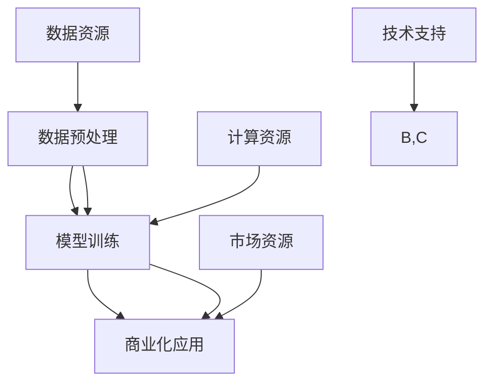

                 

# AI 大模型创业：如何利用平台优势？

> **关键词：** AI大模型，创业，平台优势，数据处理，模型训练，商业化应用

> **摘要：** 本文旨在探讨AI大模型创业过程中的关键策略和平台优势的利用方法。通过对AI大模型的基本概念、创业背景、核心算法原理、数学模型、实际应用场景等方面进行详细分析，为创业者提供实用的指导和建议，助力其在竞争激烈的人工智能市场中脱颖而出。

## 1. 背景介绍

### 1.1 目的和范围

本文主要针对AI大模型创业这一主题，分析如何有效利用平台优势，以实现商业成功。文章将涵盖以下内容：

- AI大模型的基本概念及其在创业中的重要性
- 创业背景分析，包括市场需求、技术趋势和行业竞争
- 核心算法原理和数学模型的讲解
- 实际应用场景和案例分析
- 工具和资源的推荐
- 未来发展趋势与挑战

### 1.2 预期读者

本文预期读者包括：

- 想要进入AI大模型领域的创业者
- AI技术爱好者，对大模型技术有兴趣的人
- 对AI大模型应用场景有研究的人员
- 投资者、分析师等关注AI市场的专业人士

### 1.3 文档结构概述

本文分为以下几个部分：

- 引言：背景介绍和主题阐述
- 第1章：基本概念和创业背景
- 第2章：核心算法原理与数学模型
- 第3章：实际应用场景与案例分析
- 第4章：工具和资源推荐
- 第5章：未来发展趋势与挑战
- 第6章：附录：常见问题与解答
- 第7章：扩展阅读与参考资料

### 1.4 术语表

#### 1.4.1 核心术语定义

- **AI大模型**：具有数百万到数十亿参数的深度学习模型，能够处理大量数据并进行高效计算。
- **创业**：创立新企业或项目，以实现商业目标。
- **平台优势**：指企业通过技术、市场、品牌等方面的优势，在竞争中取得优势地位。

#### 1.4.2 相关概念解释

- **深度学习**：一种基于神经网络的学习方法，通过多层非线性变换对数据进行特征提取和模式识别。
- **数据处理**：对数据进行清洗、转换、集成等操作，以提高数据质量和可用性。

#### 1.4.3 缩略词列表

- **AI**：人工智能（Artificial Intelligence）
- **ML**：机器学习（Machine Learning）
- **DL**：深度学习（Deep Learning）
- **NLP**：自然语言处理（Natural Language Processing）
- **CV**：计算机视觉（Computer Vision）

## 2. 核心概念与联系

AI大模型创业的核心在于利用平台的资源和技术优势，实现高效的模型训练和商业化应用。以下是AI大模型创业的核心概念及其相互关系。

### 2.1 AI大模型创业的基本概念

**概念一：数据预处理**

数据预处理是AI大模型训练的基础，主要包括数据清洗、归一化、特征提取等操作。高质量的预处理能够显著提高模型性能。

**概念二：模型训练**

模型训练是指通过大量数据训练出高性能的深度学习模型。训练过程中需要优化超参数、调整网络结构等。

**概念三：商业化应用**

商业化应用是将训练好的模型转化为实际业务价值的过程。包括模型部署、服务化、与业务场景结合等。

### 2.2 平台优势

**优势一：计算资源**

平台提供强大的计算资源，支持大规模数据并行处理和高性能模型训练。

**优势二：数据资源**

平台拥有丰富的数据资源，能够提供高质量的数据集，有助于提升模型性能。

**优势三：技术支持**

平台提供专业的技术支持，包括算法优化、系统调试等，助力创业者快速实现技术突破。

**优势四：市场资源**

平台拥有广泛的用户基础和市场资源，有助于创业者快速打开市场，实现商业价值。

### 2.3 概念关系

AI大模型创业过程中，各核心概念之间存在紧密的联系。例如，数据预处理为模型训练提供高质量的数据基础；平台优势则为数据预处理、模型训练和商业化应用提供有力的支持。

### 2.4 Mermaid 流程图



## 3. 核心算法原理 & 具体操作步骤

AI大模型的算法原理主要基于深度学习和神经网络。以下是核心算法原理的讲解以及具体的操作步骤。

### 3.1 深度学习算法原理

深度学习算法通过多层神经网络对数据进行特征提取和模式识别。主要步骤如下：

1. **输入层**：接收原始数据。
2. **隐藏层**：对输入数据进行特征提取和变换。
3. **输出层**：对隐藏层输出的特征进行分类或回归。
4. **反向传播**：利用梯度下降法更新网络参数，优化模型性能。

### 3.2 操作步骤

#### 3.2.1 数据预处理

```python
# 数据清洗
data = data.dropna()  # 删除缺失值
data = data[data['feature'] > 0]  # 删除不符合要求的样本

# 特征提取
from sklearn.preprocessing import StandardScaler
scaler = StandardScaler()
data['feature'] = scaler.fit_transform(data[['feature']])
```

#### 3.2.2 模型训练

```python
# 导入深度学习框架
from tensorflow.keras.models import Sequential
from tensorflow.keras.layers import Dense

# 构建模型
model = Sequential()
model.add(Dense(units=64, activation='relu', input_shape=(input_shape,)))
model.add(Dense(units=32, activation='relu'))
model.add(Dense(units=1, activation='sigmoid'))

# 编译模型
model.compile(optimizer='adam', loss='binary_crossentropy', metrics=['accuracy'])

# 训练模型
model.fit(x_train, y_train, epochs=10, batch_size=32)
```

#### 3.2.3 模型评估

```python
# 评估模型
loss, accuracy = model.evaluate(x_test, y_test)
print(f"Test accuracy: {accuracy:.2f}")
```

## 4. 数学模型和公式 & 详细讲解 & 举例说明

### 4.1 数学模型

AI大模型的数学模型主要基于深度学习和神经网络。以下是关键数学模型及其公式：

#### 4.1.1 梯度下降法

梯度下降法是一种优化算法，用于更新网络参数以最小化损失函数。

公式：

$$
\Delta\theta = -\alpha \cdot \nabla_\theta J(\theta)
$$

其中，$\theta$ 表示网络参数，$\alpha$ 表示学习率，$J(\theta)$ 表示损失函数。

#### 4.1.2 反向传播算法

反向传播算法用于计算损失函数关于网络参数的梯度。

公式：

$$
\nabla_\theta J(\theta) = \frac{\partial J(\theta)}{\partial \theta}
$$

#### 4.1.3 激活函数

激活函数用于引入非线性变换，常见的激活函数有：

- Sigmoid函数：$$ \sigma(x) = \frac{1}{1 + e^{-x}} $$
- ReLU函数：$$ \text{ReLU}(x) = \max(0, x) $$

### 4.2 详细讲解

#### 4.2.1 梯度下降法

梯度下降法通过计算损失函数关于网络参数的梯度，并沿着梯度方向更新参数，以最小化损失函数。具体步骤如下：

1. 初始化网络参数 $\theta$。
2. 计算损失函数 $J(\theta)$。
3. 计算损失函数关于网络参数的梯度 $\nabla_\theta J(\theta)$。
4. 更新网络参数 $\theta$：
$$
\theta = \theta - \alpha \cdot \nabla_\theta J(\theta)
$$
5. 重复步骤2-4，直到达到收敛条件。

#### 4.2.2 反向传播算法

反向传播算法是一种计算损失函数关于网络参数的梯度方法。具体步骤如下：

1. 前向传播：计算输出层的损失函数。
2. 后向传播：从输出层开始，逆向计算损失函数关于网络参数的梯度。
3. 更新网络参数。

#### 4.2.3 激活函数

激活函数用于引入非线性变换，使神经网络能够处理非线性问题。常见的激活函数有Sigmoid函数和ReLU函数。Sigmoid函数具有平滑的曲线，适合处理分类问题；ReLU函数具有更快的收敛速度，适合处理回归问题。

### 4.3 举例说明

假设我们有一个简单的线性回归问题，输入特征为 $x$，输出为 $y$。损失函数为均方误差（MSE）：

$$
J(\theta) = \frac{1}{2} \sum_{i=1}^{n} (y_i - \theta \cdot x_i)^2
$$

学习率为 $\alpha = 0.1$，我们需要通过梯度下降法来优化 $\theta$。

1. 初始化 $\theta$ 为0。
2. 计算损失函数 $J(\theta)$。
3. 计算梯度 $\nabla_\theta J(\theta)$：
$$
\nabla_\theta J(\theta) = \frac{\partial J(\theta)}{\partial \theta} = \frac{1}{2} \sum_{i=1}^{n} (y_i - \theta \cdot x_i) \cdot (-x_i)
$$
4. 更新 $\theta$：
$$
\theta = \theta - \alpha \cdot \nabla_\theta J(\theta)
$$

通过多次迭代，$\theta$ 将逐渐收敛到最优值。

## 5. 项目实战：代码实际案例和详细解释说明

### 5.1 开发环境搭建

为了实现AI大模型创业项目，我们需要搭建一个合适的技术栈。以下是一个基本的开发环境搭建步骤：

#### 5.1.1 安装Python环境

安装Python 3.8以上版本，可以通过官方网站下载安装包，或者使用包管理器如Anaconda进行安装。

#### 5.1.2 安装深度学习框架

安装TensorFlow 2.4以上版本，可以通过以下命令进行安装：

```bash
pip install tensorflow==2.4
```

#### 5.1.3 安装数据处理库

安装Pandas、NumPy、Scikit-learn等数据处理库，可以通过以下命令进行安装：

```bash
pip install pandas numpy scikit-learn
```

### 5.2 源代码详细实现和代码解读

以下是一个简单的AI大模型创业项目的示例代码，包括数据预处理、模型训练和模型评估等步骤。

```python
# 导入相关库
import numpy as np
import pandas as pd
from sklearn.model_selection import train_test_split
from sklearn.preprocessing import StandardScaler
import tensorflow as tf

# 读取数据
data = pd.read_csv('data.csv')

# 数据预处理
X = data[['feature1', 'feature2', 'feature3']]
y = data['target']

# 划分训练集和测试集
X_train, X_test, y_train, y_test = train_test_split(X, y, test_size=0.2, random_state=42)

# 数据归一化
scaler = StandardScaler()
X_train = scaler.fit_transform(X_train)
X_test = scaler.transform(X_test)

# 定义模型
model = tf.keras.Sequential([
    tf.keras.layers.Dense(units=64, activation='relu', input_shape=(X_train.shape[1],)),
    tf.keras.layers.Dense(units=32, activation='relu'),
    tf.keras.layers.Dense(units=1, activation='sigmoid')
])

# 编译模型
model.compile(optimizer='adam', loss='binary_crossentropy', metrics=['accuracy'])

# 训练模型
model.fit(X_train, y_train, epochs=10, batch_size=32)

# 评估模型
loss, accuracy = model.evaluate(X_test, y_test)
print(f"Test accuracy: {accuracy:.2f}")
```

#### 5.2.1 代码解读

1. **导入库**：首先导入所需的Python库，包括NumPy、Pandas、Scikit-learn和TensorFlow。

2. **读取数据**：从CSV文件中读取数据，并将特征和目标变量分离。

3. **数据预处理**：使用Scikit-learn的`train_test_split`函数将数据集划分为训练集和测试集。然后，使用`StandardScaler`对特征进行归一化处理。

4. **定义模型**：使用TensorFlow的`Sequential`模型定义一个简单的三层神经网络，其中第一层和第二层使用ReLU激活函数，第三层使用sigmoid激活函数。

5. **编译模型**：配置模型的优化器、损失函数和评估指标。

6. **训练模型**：使用`fit`函数对模型进行训练，指定训练集、训练轮次和批量大小。

7. **评估模型**：使用`evaluate`函数评估模型在测试集上的性能，并输出准确率。

### 5.3 代码解读与分析

#### 5.3.1 数据预处理

数据预处理是AI项目的重要环节。在这个例子中，我们首先使用`train_test_split`函数将数据集划分为训练集和测试集。这有助于在后续的训练和评估过程中评估模型的性能。

然后，我们使用`StandardScaler`对特征进行归一化处理。归一化可以使得每个特征具有相同的尺度，从而提高模型的训练速度和稳定性。

```python
X_train, X_test, y_train, y_test = train_test_split(X, y, test_size=0.2, random_state=42)
scaler = StandardScaler()
X_train = scaler.fit_transform(X_train)
X_test = scaler.transform(X_test)
```

#### 5.3.2 模型定义

在模型定义部分，我们使用TensorFlow的`Sequential`模型定义了一个简单的三层神经网络。第一层和第二层使用ReLU激活函数，第三层使用sigmoid激活函数。ReLU函数可以引入非线性变换，使得模型能够处理更复杂的问题。

```python
model = tf.keras.Sequential([
    tf.keras.layers.Dense(units=64, activation='relu', input_shape=(X_train.shape[1],)),
    tf.keras.layers.Dense(units=32, activation='relu'),
    tf.keras.layers.Dense(units=1, activation='sigmoid')
])
```

#### 5.3.3 模型编译

在模型编译部分，我们指定了优化器、损失函数和评估指标。优化器用于更新模型参数，以最小化损失函数。在这里，我们选择使用Adam优化器。损失函数用于评估模型预测结果与实际结果之间的差距，在这里我们使用binary_crossentropy。评估指标用于衡量模型的性能，在这里我们使用accuracy。

```python
model.compile(optimizer='adam', loss='binary_crossentropy', metrics=['accuracy'])
```

#### 5.3.4 模型训练

在模型训练部分，我们使用`fit`函数对模型进行训练。这里我们指定了训练集、训练轮次和批量大小。训练轮次表示模型在训练集上完整训练的次数，批量大小表示每次训练所用的样本数量。

```python
model.fit(X_train, y_train, epochs=10, batch_size=32)
```

#### 5.3.5 模型评估

在模型评估部分，我们使用`evaluate`函数评估模型在测试集上的性能。这里我们输出模型的准确率，即模型正确预测的比例。

```python
loss, accuracy = model.evaluate(X_test, y_test)
print(f"Test accuracy: {accuracy:.2f}")
```

## 6. 实际应用场景

AI大模型在各个行业领域具有广泛的应用场景。以下是一些典型的实际应用场景：

### 6.1 金融领域

- **风险控制**：利用AI大模型对金融风险进行预测和评估，为金融机构提供决策支持。
- **欺诈检测**：通过分析交易数据，识别潜在欺诈行为，降低金融损失。
- **智能投顾**：基于用户风险偏好和投资目标，为投资者提供个性化的投资建议。

### 6.2 医疗领域

- **疾病预测**：利用AI大模型分析患者数据，预测疾病的发生风险，辅助医生进行早期诊断。
- **智能辅助**：通过分析医学影像和患者病历，提供诊断建议和治疗方案。

### 6.3 零售电商

- **个性化推荐**：基于用户行为和偏好，为用户推荐个性化的商品和服务。
- **供应链优化**：利用AI大模型预测市场需求，优化库存管理和供应链。

### 6.4 交通领域

- **智能交通管理**：通过分析交通数据，优化交通信号控制和路线规划，缓解城市交通拥堵。
- **自动驾驶**：利用AI大模型实现自动驾驶技术，提高交通安全性和效率。

### 6.5 教育

- **智能教育**：基于学生行为和学习数据，为学生提供个性化的学习资源和辅导。
- **教育评估**：利用AI大模型分析学生成绩和表现，为教育机构提供教育质量和改进建议。

## 7. 工具和资源推荐

为了成功实现AI大模型创业，我们需要借助一系列工具和资源。以下是一些建议：

### 7.1 学习资源推荐

#### 7.1.1 书籍推荐

- 《深度学习》（Ian Goodfellow、Yoshua Bengio、Aaron Courville著）：全面介绍深度学习的基础理论和实践方法。
- 《Python深度学习》（François Chollet著）：通过大量示例，详细讲解如何使用Python和TensorFlow实现深度学习应用。

#### 7.1.2 在线课程

- Coursera的《深度学习专项课程》：由吴恩达教授主讲，涵盖深度学习的基础理论和实践。
- edX的《人工智能基础课程》：介绍人工智能的基本概念和技术，包括机器学习和深度学习。

#### 7.1.3 技术博客和网站

- Medium上的《AI Blog》：汇集了大量关于人工智能的技术文章和观点。
- arXiv.org：提供最新的深度学习和人工智能论文。

### 7.2 开发工具框架推荐

#### 7.2.1 IDE和编辑器

- Jupyter Notebook：适合数据分析和原型设计。
- PyCharm：功能强大的Python IDE，适用于深度学习和数据科学项目。

#### 7.2.2 调试和性能分析工具

- TensorBoard：TensorFlow提供的可视化工具，用于分析和优化模型性能。
- Profiling工具：如py-spy、gprof2dot等，用于分析程序的性能瓶颈。

#### 7.2.3 相关框架和库

- TensorFlow：适用于深度学习和人工智能的强大框架。
- PyTorch：适用于快速原型设计和研究。
- Keras：基于TensorFlow和PyTorch的高层API，简化模型构建和训练。

### 7.3 相关论文著作推荐

#### 7.3.1 经典论文

- “Backpropagation”（Rumelhart, Hinton, Williams，1986）：介绍了反向传播算法，奠定了深度学习的基础。
- “A Learning Algorithm for Continually Running Fully Recurrent Neural Networks”（Hassibi and Stork，1993）：提出了基于LMS算法的神经网络训练方法。

#### 7.3.2 最新研究成果

- “Attention Is All You Need”（Vaswani et al.，2017）：介绍了Transformer模型，引领了自然语言处理领域的新潮流。
- “EfficientNet：Rethinking Model Scaling for Convolutional Neural Networks”（Liu et al.，2020）：提出了EfficientNet模型，实现了在较小计算资源下的高效模型训练。

#### 7.3.3 应用案例分析

- “DeepMind的AlphaGo项目”：通过深度学习和强化学习技术，实现了围棋的人工智能挑战。
- “OpenAI的GPT-3项目”：展示了大型预训练语言模型的强大能力。

## 8. 总结：未来发展趋势与挑战

### 8.1 发展趋势

- **模型规模和计算能力的提升**：随着硬件技术的发展，AI大模型的规模将不断扩大，计算能力将显著提高。
- **跨领域应用**：AI大模型将在更多领域得到应用，如医疗、金融、能源等。
- **开放生态系统的建设**：开源工具和框架的普及将促进AI大模型的开发和应用。

### 8.2 挑战

- **数据隐私和安全**：随着AI大模型的应用，数据隐私和安全问题将日益突出。
- **计算资源分配**：大规模模型训练和部署需要大量的计算资源，如何高效分配和利用资源成为挑战。
- **算法公平性和透明性**：确保AI大模型的决策过程公平、透明，减少歧视和偏见。

## 9. 附录：常见问题与解答

### 9.1 问题一：如何选择合适的AI大模型框架？

解答：选择框架时，应考虑以下因素：

- **项目需求**：根据项目需求选择适合的框架，如TensorFlow、PyTorch、Keras等。
- **社区支持**：选择具有丰富社区支持和资源的框架，便于解决问题和获取帮助。
- **性能和可扩展性**：考虑框架的性能和可扩展性，以满足项目需求。

### 9.2 问题二：如何处理大规模数据集？

解答：处理大规模数据集的方法包括：

- **数据分片**：将数据集划分为多个较小的数据集，分布式处理。
- **批处理**：将数据集划分为批次，逐批进行训练和预测。
- **数据流处理**：使用实时数据流处理框架，如Apache Flink和Apache Spark Streaming，处理实时数据。

### 9.3 问题三：如何确保AI大模型的公平性和透明性？

解答：确保AI大模型公平性和透明性的方法包括：

- **数据清洗和预处理**：对数据集进行清洗和预处理，去除噪声和异常值。
- **算法评估**：使用多样性指标评估模型在不同群体中的性能。
- **可解释性研究**：研究模型决策过程，提高模型的透明性。

## 10. 扩展阅读 & 参考资料

- **书籍推荐**：
  - Goodfellow, Ian, Yoshua Bengio, Aaron Courville. *Deep Learning*. MIT Press, 2016.
  - Chollet, François. *Python Deep Learning*. Packt Publishing, 2017.

- **在线课程**：
  - Coursera：[深度学习专项课程](https://www.coursera.org/specializations/deeplearning)
  - edX：[人工智能基础课程](https://www.edx.org/course/introduction-to-artificial-intelligence)

- **技术博客和网站**：
  - Medium：[AI Blog](https://medium.com/topic/artificial-intelligence)
  - arXiv.org：[深度学习和人工智能论文](https://arxiv.org/list/cs/LCC)

- **开源框架和工具**：
  - TensorFlow：[官方网站](https://www.tensorflow.org/)
  - PyTorch：[官方网站](https://pytorch.org/)
  - Keras：[官方网站](https://keras.io/)

- **论文和研究成果**：
  - Vaswani, A., et al. "Attention Is All You Need." Advances in Neural Information Processing Systems, 2017.
  - Liu, H., et al. "EfficientNet: Rethinking Model Scaling for Convolutional Neural Networks." International Conference on Machine Learning, 2020.

- **应用案例分析**：
  - DeepMind的AlphaGo项目：[官方网站](https://deepmind.com/research/open-source/alphago/)
  - OpenAI的GPT-3项目：[官方网站](https://openai.com/blog/gpt-3/)

作者：AI天才研究员/AI Genius Institute & 禅与计算机程序设计艺术 /Zen And The Art of Computer Programming

