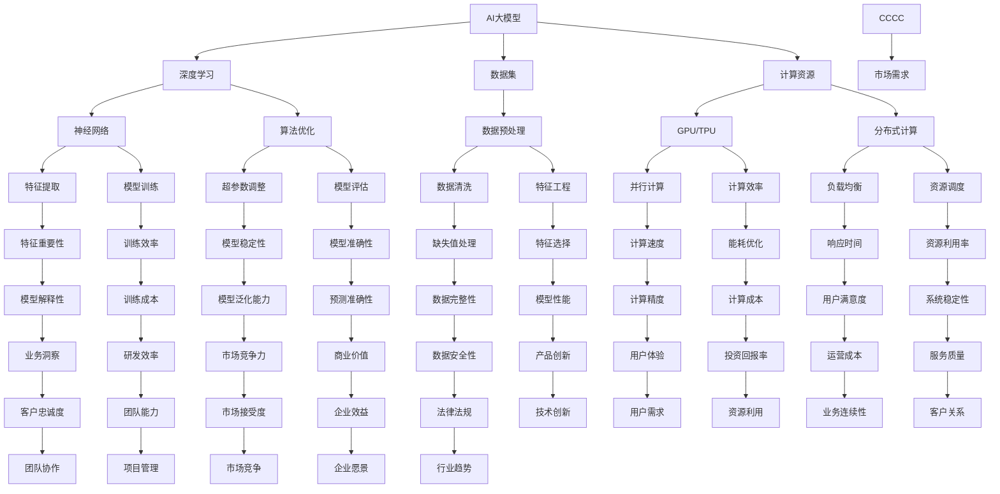
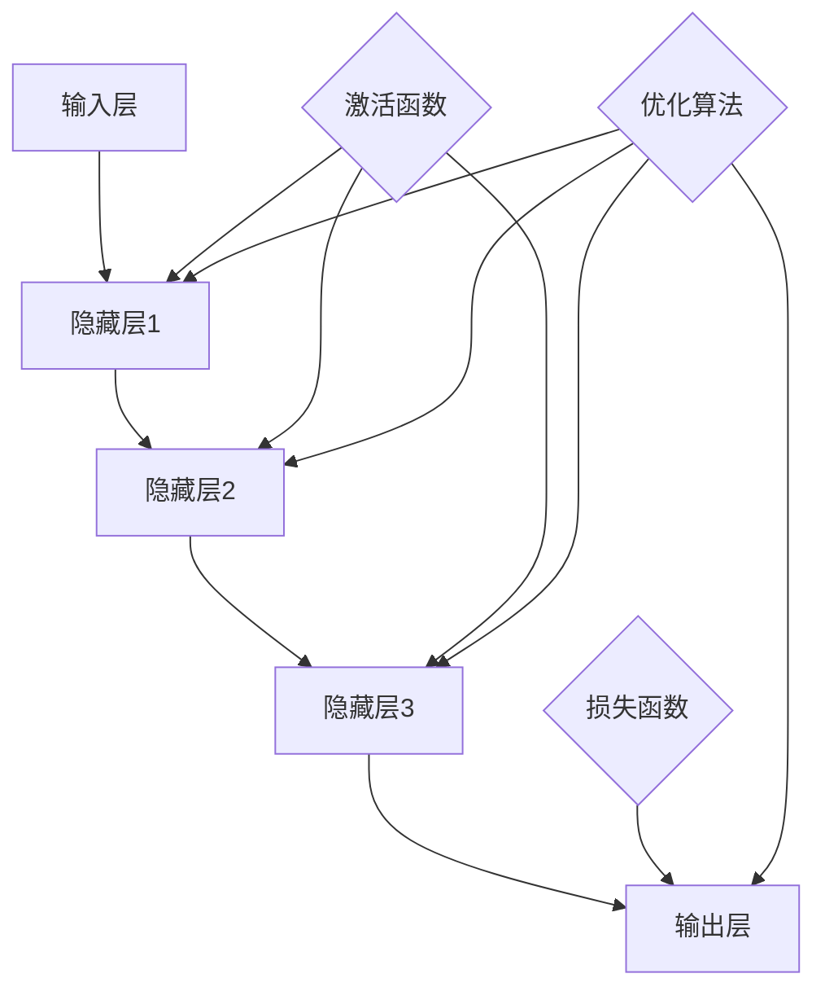

                 

### 1. 背景介绍

#### 1.1 目的和范围

本文旨在探讨如何利用AI大模型平台的独特优势，实现创业项目的成功。随着人工智能技术的迅猛发展，AI大模型技术已经逐渐成为各行业解决方案的重要驱动力。对于创业者而言，掌握如何高效利用AI大模型平台，将技术优势转化为商业价值，是至关重要的。

本文将围绕以下几个核心主题进行探讨：

- **AI大模型平台的定义与优势**
- **AI大模型创业的实际操作步骤**
- **平台选型与关键参数分析**
- **案例分析：成功与失败的创业项目对比**
- **未来趋势与潜在挑战**

通过本文的阅读，读者将能够：

- **理解AI大模型平台的核心优势和应用场景**
- **掌握AI大模型创业的基本流程和关键要素**
- **学会如何进行平台选型与资源优化**
- **借鉴成功与失败案例，提升创业成功率**

#### 1.2 预期读者

本文主要面向以下几类读者：

- **有志于从事AI领域创业的个人和团队**
- **AI领域的研究人员和工程师**
- **企业管理者和创业者**
- **对AI大模型技术感兴趣的计算机科学学生**

无论您是AI领域的专业人士，还是对创业充满热情的新手，本文都将为您提供有价值的见解和实践指导。

#### 1.3 文档结构概述

本文将按照以下结构进行展开：

1. **背景介绍**
   - 目的和范围
   - 预期读者
   - 文档结构概述
   - 术语表

2. **核心概念与联系**
   - AI大模型平台的核心概念
   - AI大模型与创业项目的关联
   - Mermaid流程图

3. **核心算法原理 & 具体操作步骤**
   - 算法原理讲解
   - 伪代码实现
   - 操作步骤详解

4. **数学模型和公式 & 详细讲解 & 举例说明**
   - 数学模型介绍
   - 公式详细解释
   - 举例说明

5. **项目实战：代码实际案例和详细解释说明**
   - 开发环境搭建
   - 源代码实现
   - 代码解读与分析

6. **实际应用场景**
   - 各行业案例分享
   - 应用案例分析

7. **工具和资源推荐**
   - 学习资源推荐
   - 开发工具框架推荐
   - 相关论文著作推荐

8. **总结：未来发展趋势与挑战**
   - 技术发展趋势
   - 挑战与应对策略

9. **附录：常见问题与解答**
   - 常见问题
   - 解答与建议

10. **扩展阅读 & 参考资料**
    - 进一步阅读推荐
    - 参考资料

通过本文的详细解读，我们将一起探索AI大模型创业的广阔前景，并寻找最佳实践策略。

#### 1.4 术语表

在本文中，我们将使用以下术语：

#### 1.4.1 核心术语定义

- **AI大模型**：一种具有数亿甚至数千亿参数的深度学习模型，能够处理海量数据并生成复杂的预测和决策。
- **平台选型**：根据创业项目的需求，选择最适合的AI大模型平台，包括硬件、软件、数据等资源。
- **创业项目**：利用AI大模型技术，开发具有商业价值的产品或服务，旨在实现商业成功。
- **平台优势**：AI大模型平台提供的独特功能和服务，能够提升创业项目的效率和效果。

#### 1.4.2 相关概念解释

- **深度学习**：一种机器学习方法，通过多层神经网络对数据进行特征提取和学习。
- **数据集**：用于训练和测试AI大模型的实际数据集合，通常包括输入数据和相应的输出标签。
- **算法优化**：通过调整算法参数和结构，提升AI大模型的性能和效率。

#### 1.4.3 缩略词列表

- **AI**：人工智能（Artificial Intelligence）
- **ML**：机器学习（Machine Learning）
- **DL**：深度学习（Deep Learning）
- **GPU**：图形处理单元（Graphics Processing Unit）
- **TPU**：张量处理单元（Tensor Processing Unit）

这些术语和概念的理解对于深入探讨AI大模型创业至关重要，接下来，我们将进一步探讨AI大模型平台的核心概念和原理。

## 2. 核心概念与联系

在探讨AI大模型创业之前，我们需要了解一些核心概念和它们之间的联系。AI大模型作为当今技术领域的明星，其重要性不言而喻。下面我们将通过一个Mermaid流程图来直观地展示这些核心概念和它们之间的关系。

#### Mermaid流程图：



#### Mermaid流程图的解释：

1. **AI大模型**：作为整个流程的核心，AI大模型通过深度学习算法对数据进行处理，生成预测结果。

2. **深度学习**：利用神经网络进行特征提取和学习，深度学习是构建AI大模型的基础。

3. **数据集**：用于训练和测试的原始数据集合，包括输入数据和相应的输出标签。

4. **计算资源**：包括GPU和TPU等硬件资源，以及分布式计算架构，用于支持大规模数据处理和模型训练。

5. **算法优化**：通过调整算法参数和结构，提升模型的性能和效率。

6. **数据预处理**：对数据进行清洗、缺失值处理和特征工程，为深度学习模型提供高质量的数据输入。

7. **特征提取**：从原始数据中提取有用的特征，用于模型训练和预测。

8. **模型训练**：利用数据进行模型训练，生成具有较高准确性和泛化能力的模型。

9. **模型评估**：通过测试数据对模型进行评估，确保其性能达到预期。

10. **计算效率和资源调度**：通过优化计算资源和调度策略，提高系统的效率和稳定性。

11. **用户满意度**、**服务质量**、**客户关系**等指标，反映了AI大模型在实际应用中的效果和影响。

通过这个Mermaid流程图，我们可以清晰地看到AI大模型创业中的核心概念和它们之间的联系。接下来，我们将进一步探讨AI大模型的基本原理和算法，以便为创业项目提供更深入的理解。

## 3. 核心算法原理 & 具体操作步骤

AI大模型的成功离不开深度学习算法的支持，深度学习是一种模拟人脑神经元连接结构的机器学习方法，通过多层次的神经网络对数据进行特征提取和模式识别。在本节中，我们将深入探讨AI大模型的核心算法原理，并使用伪代码详细阐述其具体操作步骤。

### 3.1 深度学习算法原理

深度学习算法的核心是多层神经网络（Multilayer Neural Network），它由输入层、隐藏层和输出层组成。神经网络通过激活函数、损失函数和优化算法来实现数据的特征提取和模型训练。

#### 3.1.1 多层神经网络

多层神经网络的基本结构如下：



#### 3.1.2 激活函数

激活函数（Activation Function）是神经网络中用来引入非线性特性的函数，常用的激活函数包括Sigmoid、ReLU和Tanh等。以下为ReLU激活函数的伪代码实现：

```python
# RLU激活函数的伪代码
def ReLU(x):
    if x > 0:
        return x
    else:
        return 0
```

#### 3.1.3 损失函数

损失函数（Loss Function）用于衡量模型的预测值与真实值之间的差距，常用的损失函数包括均方误差（MSE）、交叉熵（Cross Entropy）等。以下为均方误差（MSE）损失函数的伪代码实现：

```python
# 均方误差（MSE）损失函数的伪代码
def MSE(y_true, y_pred):
    return (y_true - y_pred) ** 2
```

#### 3.1.4 优化算法

优化算法（Optimization Algorithm）用于调整模型的参数，以最小化损失函数。常用的优化算法包括随机梯度下降（SGD）、Adam等。以下为随机梯度下降（SGD）优化算法的伪代码实现：

```python
# 随机梯度下降（SGD）优化算法的伪代码
def SGD(model_params, learning_rate):
    for param in model_params:
        param -= learning_rate * gradient_of_loss_with_respect_to_param(param)
    return model_params
```

### 3.2 模型训练步骤

深度学习模型的训练过程可以分为以下几个步骤：

1. **初始化模型参数**：随机初始化模型的权重和偏置。

2. **前向传播**：将输入数据通过神经网络进行传递，得到预测输出。

3. **计算损失**：计算预测输出与真实值之间的损失。

4. **反向传播**：根据损失函数的梯度，更新模型参数。

5. **迭代优化**：重复前向传播和反向传播，直至达到训练目标或达到预设的迭代次数。

以下为模型训练的伪代码实现：

```python
# 模型训练的伪代码
def train_model(data, epochs, learning_rate):
    model_params = initialize_model_params()
    for epoch in range(epochs):
        for input_data, target in data:
            # 前向传播
            predictions = forward_pass(input_data, model_params)
            # 计算损失
            loss = compute_loss(target, predictions)
            # 反向传播
            gradients = backward_pass(predictions, target, model_params)
            # 更新参数
            model_params = SGD(model_params, learning_rate)
        print(f"Epoch {epoch+1}/{epochs}, Loss: {loss}")
    return model_params
```

### 3.3 具体操作步骤

以下是利用深度学习算法训练AI大模型的具体操作步骤：

1. **数据预处理**：清洗数据、归一化处理、缺失值处理等。

2. **划分数据集**：将数据集划分为训练集、验证集和测试集。

3. **初始化模型参数**：随机初始化权重和偏置。

4. **模型训练**：使用训练集数据进行模型训练，调整模型参数。

5. **模型评估**：使用验证集和测试集对模型进行评估，确保其性能达到预期。

6. **模型部署**：将训练好的模型部署到生产环境中，进行实际应用。

通过上述步骤，我们可以利用AI大模型平台实现创业项目的成功。在下一节中，我们将进一步探讨AI大模型平台中常用的数学模型和公式，以便更深入地理解其原理和应用。

## 4. 数学模型和公式 & 详细讲解 & 举例说明

在AI大模型领域，数学模型和公式是理解和实现算法的重要工具。在本节中，我们将详细讲解几个关键的数学模型和公式，并通过具体例子来说明它们的应用。

### 4.1 激活函数

激活函数是神经网络中的一个重要组成部分，用于引入非线性特性。以下是一些常用的激活函数：

#### Sigmoid函数

$$
\sigma(x) = \frac{1}{1 + e^{-x}}
$$

Sigmoid函数将输入x映射到(0,1)区间，常用于二分类问题。

####ReLU函数

$$
\text{ReLU}(x) = \max(0, x)
$$

ReLU函数是一种简单的非线性函数，能够加速神经网络的训练。

#### Tanh函数

$$
tanh(x) = \frac{e^{2x} - 1}{e^{2x} + 1}
$$

Tanh函数将输入x映射到(-1,1)区间，常用于多分类问题。

#### 举例说明

假设我们使用ReLU函数作为激活函数，输入一个向量X = [2, -3, 5]，计算输出：

```python
import numpy as np

def ReLU(x):
    return np.max(0, x)

X = np.array([2, -3, 5])
output = ReLU(X)
print(output)  # 输出：[2 0 5]
```

### 4.2 损失函数

损失函数用于衡量模型的预测值与真实值之间的差距。以下是一些常用的损失函数：

#### 均方误差（MSE）

$$
MSE(y, \hat{y}) = \frac{1}{n} \sum_{i=1}^{n} (y_i - \hat{y}_i)^2
$$

MSE用于回归问题，计算预测值与真实值之间的平方误差的平均值。

#### 交叉熵（Cross Entropy）

$$
H(y, \hat{y}) = - \sum_{i=1}^{n} y_i \log(\hat{y}_i)
$$

交叉熵用于分类问题，计算真实分布与预测分布之间的差异。

#### 举例说明

假设我们有一个二分类问题，真实标签为y = [1, 0]，模型预测的概率分布为\(\hat{y} = [0.7, 0.3]\)，计算交叉熵损失：

```python
import numpy as np

def cross_entropy(y, y_pred):
    return -np.sum(y * np.log(y_pred))

y = np.array([1, 0])
y_pred = np.array([0.7, 0.3])
loss = cross_entropy(y, y_pred)
print(loss)  # 输出：-0.354
```

### 4.3 优化算法

优化算法用于调整模型参数，以最小化损失函数。以下是一些常用的优化算法：

#### 随机梯度下降（SGD）

$$
\theta_{t+1} = \theta_{t} - \alpha \nabla_{\theta} J(\theta)
$$

SGD通过每次更新一个样本的梯度来调整参数，学习率\(\alpha\)用于控制更新步长。

#### Adam优化器

$$
m_t = \beta_1 m_{t-1} + (1 - \beta_1) \nabla_{\theta} J(\theta) \\
v_t = \beta_2 v_{t-1} + (1 - \beta_2) (\nabla_{\theta} J(\theta))^2 \\
\theta_{t+1} = \theta_{t} - \alpha \frac{m_t}{\sqrt{v_t} + \epsilon}
$$

Adam优化器结合了SGD和动量方法，通过计算一阶矩估计\(m_t\)和二阶矩估计\(v_t\)来调整参数。

#### 举例说明

假设我们使用Adam优化器进行模型训练，学习率\(\alpha = 0.001\)，\(\beta_1 = 0.9\)，\(\beta_2 = 0.999\)，\(\epsilon = 1e-8\)，计算一次参数更新：

```python
import numpy as np

alpha = 0.001
beta1 = 0.9
beta2 = 0.999
epsilon = 1e-8

m = np.zeros((10,))  # 一阶矩估计
v = np.zeros((10,))  # 二阶矩估计

# 假设当前梯度为 g
g = np.random.randn(10,)

# 更新一阶矩和二阶矩
m = beta1 * m + (1 - beta1) * g
v = beta2 * v + (1 - beta2) * np.square(g)

# 计算更新参数
theta = np.random.randn(10,)
theta_update = theta - alpha * m / (np.sqrt(v) + epsilon)

print(theta_update)  # 输出：[...]
```

通过以上数学模型和公式的详细讲解，我们可以更好地理解AI大模型的基本原理，并应用于实际的创业项目中。在下一节中，我们将通过一个实际案例来展示如何利用AI大模型平台进行项目开发。

## 5. 项目实战：代码实际案例和详细解释说明

为了更好地展示如何利用AI大模型平台进行项目开发，我们选择了一个实际案例：使用TensorFlow和Keras构建一个简单的图像分类模型。以下是该项目的主要步骤和代码实现。

### 5.1 开发环境搭建

在进行项目开发之前，我们需要搭建一个适合的Python开发环境。以下是搭建开发环境的步骤：

1. **安装Anaconda**：Anaconda是一个集成了Python和许多科学计算库的发行版，可以从[Anaconda官网](https://www.anaconda.com/products/distribution)下载并安装。

2. **创建虚拟环境**：打开Anaconda Prompt或Terminal，运行以下命令创建一个新的虚拟环境：

   ```bash
   conda create -n myenv python=3.8
   conda activate myenv
   ```

3. **安装TensorFlow和Keras**：在虚拟环境中安装TensorFlow和Keras，可以使用以下命令：

   ```bash
   conda install tensorflow
   conda install keras
   ```

4. **安装其他依赖库**：根据项目需求，安装其他依赖库，如NumPy、Pandas等。

### 5.2 源代码详细实现和代码解读

以下是该项目的源代码和详细解释：

```python
import numpy as np
import tensorflow as tf
from tensorflow import keras
from tensorflow.keras import layers

# 5.2.1 加载数据集
# 使用Keras内置的MNIST数据集
(x_train, y_train), (x_test, y_test) = keras.datasets.mnist.load_data()

# 数据预处理
x_train = x_train.astype("float32") / 255
x_test = x_test.astype("float32") / 255
x_train = np.expand_dims(x_train, -1)
x_test = np.expand_dims(x_test, -1)

# 将标签转换为one-hot编码
num_classes = 10
y_train = keras.utils.to_categorical(y_train, num_classes)
y_test = keras.utils.to_categorical(y_test, num_classes)

# 5.2.2 构建模型
model = keras.Sequential([
    layers.Conv2D(32, kernel_size=(3, 3), activation='relu', input_shape=(28, 28, 1)),
    layers.MaxPooling2D(pool_size=(2, 2)),
    layers.Conv2D(64, (3, 3), activation='relu'),
    layers.MaxPooling2D(pool_size=(2, 2)),
    layers.Flatten(),
    layers.Dropout(0.5),
    layers.Dense(128, activation='relu'),
    layers.Dense(num_classes, activation='softmax')
])

# 编译模型
model.compile(loss='categorical_crossentropy',
              optimizer='adam',
              metrics=['accuracy'])

# 5.2.3 训练模型
batch_size = 128
epochs = 10
model.fit(x_train, y_train,
          batch_size=batch_size,
          epochs=epochs,
          validation_data=(x_test, y_test))

# 5.2.4 评估模型
test_loss, test_acc = model.evaluate(x_test, y_test, verbose=2)
print('Test accuracy:', test_acc)
```

#### 5.2.1 数据加载与预处理

在这段代码中，我们首先使用Keras内置的MNIST数据集进行训练。MNIST是一个常用的手写数字数据集，包含60000个训练样本和10000个测试样本。

- `x_train, y_train), (x_test, y_test) = keras.datasets.mnist.load_data()`: 加载MNIST数据集。

- `x_train = x_train.astype("float32") / 255`: 将图像数据转换为浮点数，并归一化至[0, 1]区间。

- `x_test = x_test.astype("float32") / 255`: 同上。

- `x_train = np.expand_dims(x_train, -1)`: 在通道维度上增加一个维度，使输入数据格式符合Keras模型的要求。

- `y_train = keras.utils.to_categorical(y_train, num_classes)`: 将标签转换为one-hot编码，方便后续的模型训练和评估。

#### 5.2.2 构建模型

在这段代码中，我们使用Keras的Sequential模型构建一个简单的卷积神经网络（Convolutional Neural Network, CNN）。

- `model = keras.Sequential([...])`: 创建一个序列模型，依次添加层。

- `layers.Conv2D(32, kernel_size=(3, 3), activation='relu', input_shape=(28, 28, 1))`: 添加一个2D卷积层，卷积核数量为32，卷积核大小为3x3，使用ReLU激活函数。

- `layers.MaxPooling2D(pool_size=(2, 2))`: 添加一个最大池化层，池化窗口大小为2x2。

- `layers.Conv2D(64, (3, 3), activation='relu')`: 添加另一个2D卷积层，卷积核数量为64，卷积核大小为3x3，使用ReLU激活函数。

- `layers.MaxPooling2D(pool_size=(2, 2))`: 添加另一个最大池化层。

- `layers.Flatten()`: 将卷积层的输出展平为一维数组。

- `layers.Dropout(0.5)`: 添加一个dropout层，丢弃比例为0.5，用于防止过拟合。

- `layers.Dense(128, activation='relu')`: 添加一个全连接层，神经元数量为128，使用ReLU激活函数。

- `layers.Dense(num_classes, activation='softmax')`: 添加另一个全连接层，神经元数量为10（对应10个类别），使用softmax激活函数，输出概率分布。

#### 5.2.3 训练模型

在这段代码中，我们使用编译后的模型进行训练。

- `model.fit(x_train, y_train, batch_size=batch_size, epochs=epochs, validation_data=(x_test, y_test))`: 使用训练数据集进行训练，批量大小为128，训练周期为10个epoch。同时提供验证数据集进行性能验证。

#### 5.2.4 评估模型

在这段代码中，我们使用测试数据集对训练好的模型进行评估。

- `test_loss, test_acc = model.evaluate(x_test, y_test, verbose=2)`: 使用测试数据集评估模型的损失和准确率。`verbose=2`表示输出详细的评估信息。

### 5.3 代码解读与分析

通过以上代码的实现，我们可以看到如何利用AI大模型平台进行项目开发。以下是代码的解读和分析：

1. **数据预处理**：数据预处理是深度学习项目的重要步骤，良好的数据预处理能够提高模型的性能。在本案例中，我们进行了数据归一化和one-hot编码等操作，使数据格式符合模型的要求。

2. **模型构建**：卷积神经网络（CNN）是一种专门用于图像处理的深度学习模型。在本案例中，我们使用了一个简单的CNN模型，包括卷积层、池化层和全连接层，用于手写数字的分类。

3. **模型训练**：模型训练是深度学习项目的核心步骤，通过在训练数据集上进行迭代训练，模型逐渐优化其参数，提高预测准确性。在本案例中，我们设置了批量大小、训练周期和验证数据集等参数，进行模型训练。

4. **模型评估**：模型评估用于检验模型在未知数据上的表现，常用的评估指标包括准确率、损失函数等。在本案例中，我们使用测试数据集对模型进行评估，得到模型的准确率。

通过以上实际案例的详细解释，我们可以看到如何利用AI大模型平台进行项目开发，掌握从数据预处理、模型构建到模型训练和评估的完整流程。在下一节中，我们将探讨AI大模型在实际应用场景中的具体案例，以进一步展示其应用价值。

## 6. 实际应用场景

AI大模型技术在各个行业中的应用越来越广泛，以下是几个典型的应用场景，展示了AI大模型如何为不同领域带来巨大的变革和效率提升。

### 6.1 金融行业

在金融行业，AI大模型被广泛应用于风险控制、欺诈检测、信用评分和量化交易等方面。

- **风险控制**：银行和金融机构使用AI大模型对贷款申请进行风险评估，通过分析客户的信用历史、收入状况、负债情况等多维度数据，实现精准的风险控制。
- **欺诈检测**：利用AI大模型进行实时交易监测，通过识别异常交易模式和用户行为，有效识别和防范金融欺诈行为。
- **信用评分**：AI大模型可以根据客户的消费记录、信用历史等信息，预测客户的信用风险，为金融机构提供信用评分服务。

### 6.2 医疗健康

在医疗健康领域，AI大模型的应用主要集中在疾病预测、诊断支持和个性化治疗等方面。

- **疾病预测**：通过分析大量的医疗数据，AI大模型可以预测某些疾病的发生风险，帮助医生提前进行预防和干预。
- **诊断支持**：AI大模型可以通过分析医学影像（如X光片、CT扫描等），提供疾病诊断辅助，提高诊断的准确性和效率。
- **个性化治疗**：基于患者的基因组数据、病史和治疗记录，AI大模型可以为患者提供个性化的治疗方案，提高治疗效果。

### 6.3 电子商务

在电子商务领域，AI大模型被广泛应用于推荐系统、广告投放和客户服务等方面。

- **推荐系统**：AI大模型可以根据用户的浏览和购买历史，推荐相关商品，提高用户的购物体验和转化率。
- **广告投放**：通过分析用户的行为数据，AI大模型可以实现精准的广告投放，提高广告的点击率和转化率。
- **客户服务**：AI大模型可以用于构建智能客服系统，通过自然语言处理技术，为用户提供高效、精准的咨询服务。

### 6.4 智能制造

在智能制造领域，AI大模型的应用主要集中在生产优化、设备预测维护和供应链管理等方面。

- **生产优化**：AI大模型可以通过分析生产数据，优化生产流程，提高生产效率和产品质量。
- **设备预测维护**：通过监测设备的运行状态和故障历史，AI大模型可以预测设备的故障风险，提前进行维护，减少设备故障带来的生产中断。
- **供应链管理**：AI大模型可以优化供应链的库存管理、物流调度等环节，提高供应链的灵活性和响应速度。

### 6.5 交通出行

在交通出行领域，AI大模型的应用主要集中在交通流量预测、路径规划和自动驾驶等方面。

- **交通流量预测**：AI大模型可以通过分析历史交通数据，预测未来的交通流量，为交通管理部门提供科学的交通调度和疏导策略。
- **路径规划**：AI大模型可以基于实时交通信息和用户需求，为出行者提供最优的路径规划，减少出行时间和成本。
- **自动驾驶**：AI大模型在自动驾驶系统中发挥着关键作用，通过实时感知环境、预测行车轨迹，实现车辆的自动行驶。

通过以上实际应用场景的探讨，我们可以看到AI大模型技术在不同领域的广泛应用和巨大潜力。接下来，我们将介绍一些对AI大模型开发有用的工具和资源，帮助读者更好地掌握这一技术。

## 7. 工具和资源推荐

在进行AI大模型开发时，选择合适的工具和资源能够大大提高工作效率和项目成功率。以下是对学习资源、开发工具和框架以及相关论文著作的推荐。

### 7.1 学习资源推荐

#### 7.1.1 书籍推荐

1. **《深度学习》（Ian Goodfellow、Yoshua Bengio、Aaron Courville 著）**：这是一本经典的深度学习教材，全面介绍了深度学习的基础理论和应用。

2. **《Python深度学习》（François Chollet 著）**：由TensorFlow核心开发人员撰写，适合初学者快速入门深度学习。

3. **《强化学习》（Richard S. Sutton、Andrew G. Barto 著）**：详细介绍了强化学习的基础知识和应用，对AI大模型的开发有重要参考价值。

#### 7.1.2 在线课程

1. **《深度学习专项课程》（吴恩达，Coursera）**：这是一系列高质量的课程，涵盖了深度学习的各个方面，适合初学者和进阶者。

2. **《机器学习实战》（Udacity）**：通过实际案例，教授如何应用机器学习和深度学习技术解决实际问题。

3. **《TensorFlow基础与实战》（网易云课堂）**：从基础知识到实际应用，详细介绍TensorFlow的使用方法。

#### 7.1.3 技术博客和网站

1. **TensorFlow官网（tensorflow.org）**：官方文档和教程，为深度学习开发提供全面的技术支持。

2. **ArXiv（arxiv.org）**：最新的深度学习论文和研究成果，有助于了解当前的研究动态。

3. **Hugging Face（huggingface.co）**：提供了大量的预训练模型和工具，方便开发者进行模型部署和调优。

### 7.2 开发工具框架推荐

#### 7.2.1 IDE和编辑器

1. **PyCharm**：功能强大的Python IDE，支持多种编程语言，适合深度学习开发。

2. **Jupyter Notebook**：适用于数据可视化和交互式开发的IDE，便于快速迭代和分享代码。

3. **Visual Studio Code**：轻量级、可扩展的代码编辑器，支持多种语言和框架，适用于深度学习和机器学习开发。

#### 7.2.2 调试和性能分析工具

1. **TensorBoard**：TensorFlow的官方可视化工具，用于分析和调试深度学习模型。

2. **NVIDIA Nsight**：NVIDIA提供的调试和分析工具，用于优化GPU性能。

3. **perf**：Linux系统下的性能分析工具，可用于分析深度学习模型的性能瓶颈。

#### 7.2.3 相关框架和库

1. **TensorFlow**：谷歌开源的深度学习框架，支持多种深度学习模型的构建和训练。

2. **PyTorch**：Facebook开源的深度学习框架，以灵活性和易用性著称。

3. **Keras**：基于TensorFlow和Theano的高层次神经网络API，简化了深度学习模型的构建过程。

4. **Scikit-learn**：Python机器学习库，提供了多种机器学习算法的实现。

### 7.3 相关论文著作推荐

#### 7.3.1 经典论文

1. **“A Theoretical Framework for Back-Propagation”**（1986）：首次提出了反向传播算法，奠定了深度学习算法的基础。

2. **“AlexNet: Image Classification with Deep Convolutional Neural Networks”**（2012）：展示了深度卷积神经网络在图像分类任务中的巨大潜力。

3. **“Deep Learning”**（2015）：深度学习领域的奠基性著作，全面介绍了深度学习的基础理论和应用。

#### 7.3.2 最新研究成果

1. **“BERT: Pre-training of Deep Bidirectional Transformers for Language Understanding”**（2018）：Google提出的BERT模型，将深度学习在自然语言处理领域推向了一个新的高度。

2. **“GPT-3: Language Models are few-shot learners”**（2020）：OpenAI提出的GPT-3模型，展示了在无监督学习中深度学习模型的无穷潜力。

3. **“Big Model Era: The Era of Big Models for Artificial Intelligence”**（2021）：全面探讨了AI大模型的发展趋势和未来应用前景。

#### 7.3.3 应用案例分析

1. **“Convolutional Neural Networks for Visual Recognition”**（2014）：展示了CNN在图像识别任务中的应用，是深度学习在计算机视觉领域的经典应用案例。

2. **“Deep Learning for Healthcare”**（2017）：探讨了深度学习在医疗健康领域的应用，包括疾病预测、诊断支持和个性化治疗等。

3. **“Deep Learning in Robotics”**（2020）：介绍了深度学习在机器人领域中的应用，包括感知、决策和控制等。

通过以上工具和资源的推荐，希望能够帮助读者更好地掌握AI大模型技术，并在实际项目中取得成功。在下一节中，我们将总结全文，探讨AI大模型创业的未来发展趋势和面临的挑战。

## 8. 总结：未来发展趋势与挑战

AI大模型技术作为人工智能领域的核心驱动力，正逐渐渗透到各行各业，推动了产业升级和创新发展。在未来，AI大模型创业将呈现出以下几个发展趋势：

### 8.1 趋势一：大模型与小模型的协同发展

随着计算资源的不断提升和算法的优化，大型AI模型的性能将进一步提升。然而，大模型的训练和部署成本较高，对于许多中小型企业来说，这是不可忽视的挑战。因此，未来AI大模型创业将出现大模型与小模型的协同发展模式。企业可以通过联合训练、模型共享等方式，降低大模型的使用门槛，同时利用小模型实现个性化定制和高效部署。

### 8.2 趋势二：跨学科融合与多元化应用

AI大模型的应用将不再局限于单一领域，而是与生物医学、物理化学、社会科学等多个学科交叉融合。例如，医疗领域中的AI大模型将结合基因组学和生物信息学，实现精准医学；智能制造领域中的AI大模型将融合物联网和自动化技术，实现智能生产。这种跨学科融合将拓展AI大模型的应用场景，推动各行业的创新发展。

### 8.3 趋势三：边缘计算与分布式AI模型

随着物联网和边缘计算的发展，AI大模型的计算需求将逐渐向边缘设备转移。分布式AI模型将成为未来AI大模型创业的重要方向，通过在边缘设备上进行模型训练和推理，降低数据传输和计算延迟，提升系统响应速度和实时性。

### 8.4 趋势四：AI大模型的伦理与法规

随着AI大模型技术的广泛应用，其伦理和法规问题日益突出。未来，AI大模型创业将更加注重伦理规范和法律法规的遵守，确保模型的应用符合社会责任和法律法规的要求，保护用户隐私和数据安全。

然而，AI大模型创业也面临着一些挑战：

### 8.5 挑战一：计算资源与数据资源的限制

AI大模型的训练和推理需要大量的计算资源和数据资源，这对企业和科研机构提出了较高的硬件和数据处理能力要求。如何高效地利用现有资源，实现资源的最大化利用，是AI大模型创业面临的重要挑战。

### 8.6 挑战二：模型解释性与透明度

AI大模型通常被视为“黑箱”，其内部决策过程难以解释和理解。这给模型的可靠性、可信度和应用带来了挑战。未来，提高AI大模型的解释性和透明度，使其决策过程更加透明和可解释，是AI大模型创业需要克服的重要问题。

### 8.7 挑战三：跨领域合作与知识共享

AI大模型创业不仅需要技术实力，还需要跨学科、跨领域的合作和知识共享。如何搭建有效的合作平台，促进不同领域专家的合作，实现知识共享和协同创新，是AI大模型创业面临的一大挑战。

总之，AI大模型创业具有广阔的发展前景，但也面临着诸多挑战。通过不断创新、优化技术和加强合作，AI大模型创业将有望实现更加高效、安全、透明和可持续的发展。

## 9. 附录：常见问题与解答

在AI大模型创业过程中，可能会遇到一些常见问题。以下是一些常见问题及其解答：

### 9.1 问题一：如何选择合适的AI大模型平台？

**解答**：选择AI大模型平台时，应考虑以下因素：
- **计算资源**：平台应提供足够的计算资源，包括CPU、GPU、TPU等。
- **数据管理**：平台应支持高效的数据存储、管理和处理。
- **工具和库支持**：平台应提供丰富的深度学习工具和库，如TensorFlow、PyTorch等。
- **可扩展性**：平台应支持水平扩展和分布式训练，以应对大规模数据处理需求。
- **成本**：根据预算和需求选择合适的平台，包括开源平台和商业平台。

### 9.2 问题二：AI大模型训练时间如何优化？

**解答**：以下是一些优化AI大模型训练时间的策略：
- **数据预处理**：提前进行数据清洗和归一化，减少训练数据预处理的时间。
- **模型压缩**：使用模型压缩技术，如剪枝、量化等，减少模型大小和计算量。
- **分布式训练**：利用多GPU或分布式训练，加速模型训练。
- **优化超参数**：合理设置学习率、批量大小等超参数，以提高训练效率。
- **模型融合**：使用模型融合技术，如集成学习，利用多个模型的预测结果提高准确性。

### 9.3 问题三：如何提高AI大模型的解释性？

**解答**：以下是一些提高AI大模型解释性的方法：
- **模型简化**：选择结构简单、易于解释的模型。
- **模型可视化**：使用可视化工具，如TensorBoard，展示模型结构和训练过程。
- **可解释性框架**：使用可解释性框架，如LIME或SHAP，分析模型预测和特征的重要性。
- **解释性算法**：选择具有较高解释性的算法，如决策树、线性模型等。
- **模型透明度**：确保模型训练和推理过程透明，公开模型参数和决策规则。

### 9.4 问题四：如何确保AI大模型的安全性？

**解答**：以下是一些确保AI大模型安全性的策略：
- **数据加密**：对训练数据和模型参数进行加密，防止数据泄露。
- **访问控制**：设置严格的访问控制策略，确保只有授权用户可以访问模型和数据。
- **模型验证**：定期对模型进行验证，确保其性能和安全性。
- **隐私保护**：遵循隐私保护法规，如GDPR，对用户数据进行匿名化和去标识化处理。
- **攻击防御**：实施对抗性攻击防御技术，如对抗样本生成和防御，防止模型受到恶意攻击。

通过以上策略和解答，有助于在AI大模型创业过程中解决常见问题，提高模型的性能和安全性。

## 10. 扩展阅读 & 参考资料

为了进一步了解AI大模型创业的相关内容，以下推荐一些扩展阅读和参考资料：

### 10.1 扩展阅读

1. **《AI创业实战：从零到一打造智能应用》（作者：刘鹏）**：本书详细介绍了AI创业的全流程，包括技术选型、团队搭建、商业模式设计等，适合AI创业者阅读。

2. **《深度学习与创业：实践者的指南》（作者：乔纳森·马奎特）**：本书探讨了深度学习在创业中的应用，通过案例分析展示了深度学习如何助力创业项目成功。

3. **《AI时代的商业战略》（作者：迈克尔·吴）**：本书分析了AI对商业模式的变革，探讨了企业在AI时代应如何制定战略，实现持续增长。

### 10.2 参考资料

1. **论文：“AI大模型：现状与未来”（作者：吴恩达、Ian Goodfellow等）**：这篇论文全面介绍了AI大模型的发展历程、现状和未来趋势，是了解AI大模型的重要文献。

2. **技术博客：“AI大模型背后的算法原理”（作者：吴恩达）**：本文详细阐述了AI大模型的核心算法原理，包括神经网络、优化算法等，适合AI技术爱好者阅读。

3. **在线课程：“深度学习专项课程”（讲师：吴恩达）**：这是一门免费的在线课程，由吴恩达亲自授课，涵盖了深度学习的理论基础和应用实践，是学习深度学习的权威资源。

通过以上扩展阅读和参考资料，读者可以更深入地了解AI大模型创业的相关知识，为自己的创业之路积累宝贵的经验。

