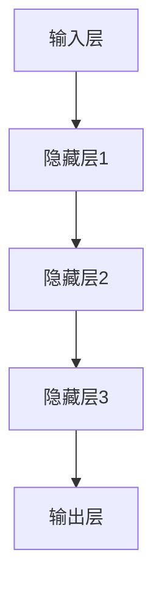

                 

# AI 大模型创业：如何利用技术优势？

> 关键词：大模型、创业、技术优势、算法、数学模型、实际应用、开发工具

> 摘要：本文将探讨如何在AI大模型创业中充分利用技术优势。通过介绍大模型的核心概念、算法原理、数学模型以及实际应用场景，结合实战案例，为创业者提供一套完整的指导方案，帮助他们在竞争激烈的市场中脱颖而出。

## 1. 背景介绍

### 1.1 目的和范围

本文旨在为AI大模型创业者提供一套实用指南，帮助他们理解大模型的技术优势，并掌握如何将其应用于实际创业项目中。我们将从以下几个方面展开讨论：

1. 大模型的核心概念及其在AI领域的地位。
2. 大模型的主要算法原理和数学模型。
3. 大模型在实际应用场景中的实战案例。
4. 创业者如何利用大模型技术打造具有竞争力的产品。

### 1.2 预期读者

本文适合以下读者：

1. 拥有AI基础知识的创业者。
2. 对AI大模型技术感兴趣的技术爱好者。
3. 想要了解大模型在创业中应用的技术专家。

### 1.3 文档结构概述

本文分为10个部分：

1. 背景介绍
2. 核心概念与联系
3. 核心算法原理 & 具体操作步骤
4. 数学模型和公式 & 详细讲解 & 举例说明
5. 项目实战：代码实际案例和详细解释说明
6. 实际应用场景
7. 工具和资源推荐
8. 总结：未来发展趋势与挑战
9. 附录：常见问题与解答
10. 扩展阅读 & 参考资料

### 1.4 术语表

#### 1.4.1 核心术语定义

- 大模型：具有数百万至数十亿参数的深度学习模型，能够处理复杂的数据和任务。
- 创业：创立并运营一家新公司，旨在实现商业价值和市场影响力。
- 技术优势：企业在特定技术领域的领先地位，使其在市场竞争中占据优势。

#### 1.4.2 相关概念解释

- 深度学习：一种人工智能分支，通过多层神经网络从数据中自动学习特征。
- 人工智能：模拟、延伸和扩展人类智能的理论、方法、技术及应用。

#### 1.4.3 缩略词列表

- AI：人工智能
- DNN：深度神经网络
- CNN：卷积神经网络
- RNN：循环神经网络
- LSTM：长短期记忆网络

## 2. 核心概念与联系

在探讨AI大模型创业之前，我们首先需要了解大模型的核心概念及其在AI领域的地位。以下是关于大模型的基本概念和其在AI领域的重要性：

### 2.1 大模型的核心概念

大模型是指具有数百万至数十亿参数的深度学习模型。这些模型通过自动学习数据中的特征，能够解决各种复杂任务，如图像识别、语音识别、自然语言处理等。

### 2.2 大模型在AI领域的地位

随着计算能力的提升和数据量的增加，大模型在AI领域的地位日益凸显。以下是几个关键点：

1. **处理复杂任务**：大模型具有强大的表示能力，能够处理复杂的任务和数据。
2. **超越人类水平**：在某些任务上，如图像识别、语音识别等，大模型的性能已经超越人类水平。
3. **推动AI技术发展**：大模型的研究和应用推动了AI技术的进步，促进了新的算法、架构和应用的出现。

### 2.3 大模型与相关技术的联系

大模型并非孤立存在，它与许多相关技术紧密相连。以下是一些关键联系：

1. **深度学习**：大模型是基于深度学习技术发展而来的，深度学习是AI的核心技术之一。
2. **计算能力**：大模型需要强大的计算能力才能训练和推理，因此与高性能计算技术密切相关。
3. **数据集**：大模型训练需要大量的数据集，数据集的质量和规模对大模型的性能至关重要。

### 2.4 大模型架构

大模型通常采用分层结构，包括输入层、隐藏层和输出层。每个层次由多个神经元组成，通过非线性激活函数连接。以下是一个简单的大模型架构：



### 2.5 大模型的训练过程

大模型的训练过程通常包括以下几个阶段：

1. **数据预处理**：对输入数据进行预处理，如标准化、归一化等。
2. **模型初始化**：初始化模型参数，通常使用随机初始化。
3. **正向传播**：将输入数据传递到模型中，计算输出结果。
4. **反向传播**：计算损失函数，并使用梯度下降等优化算法更新模型参数。
5. **迭代训练**：重复正向传播和反向传播，直到模型收敛。

## 3. 核心算法原理 & 具体操作步骤

### 3.1 算法原理

大模型的算法原理主要基于深度学习技术。深度学习通过多层神经网络从数据中自动学习特征，实现从输入到输出的映射。以下是几个核心算法原理：

1. **多层神经网络**：多层神经网络通过多个隐藏层对输入数据进行变换，提取更有用的特征。
2. **反向传播算法**：反向传播算法是一种用于训练神经网络的方法，通过计算损失函数的梯度来更新模型参数。
3. **优化算法**：优化算法用于调整模型参数，以最小化损失函数。常见的优化算法包括梯度下降、随机梯度下降、Adam等。

### 3.2 操作步骤

以下是使用反向传播算法训练大模型的具体操作步骤：

1. **数据预处理**：

```python
# 示例：标准化输入数据
X = (X - X.mean()) / X.std()
```

2. **模型初始化**：

```python
# 示例：使用随机初始化初始化模型参数
W1 = np.random.randn(n1, n0)
b1 = np.zeros((n1,))
W2 = np.random.randn(n2, n1)
b2 = np.zeros((n2,))
```

3. **正向传播**：

```python
# 示例：计算模型输出
z2 = X.dot(W1) + b1
a2 = sigmoid(z2)
z3 = a2.dot(W2) + b2
a3 = sigmoid(z3)
y_hat = a3
```

4. **反向传播**：

```python
# 示例：计算损失函数的梯度
delta_3 = (y_hat - y) * (a3 * (1 - a3))
delta_2 = delta_3.dot(W2.T) * (a2 * (1 - a2))

# 更新模型参数
W2 += a2.T.dot(delta_3)
b2 += delta_3
W1 += X.T.dot(delta_2)
b1 += delta_2
```

5. **迭代训练**：

```python
# 示例：迭代训练模型
for i in range(num_iterations):
    # 正向传播
    z2, a2, z3, a3, y_hat = forward_pass(X, W1, b1, W2, b2)

    # 反向传播
    delta_3 = (y_hat - y) * (a3 * (1 - a3))
    delta_2 = delta_3.dot(W2.T) * (a2 * (1 - a2))

    # 更新模型参数
    W2 += a2.T.dot(delta_3)
    b2 += delta_3
    W1 += X.T.dot(delta_2)
    b1 += delta_2
```

## 4. 数学模型和公式 & 详细讲解 & 举例说明

### 4.1 数学模型概述

大模型的数学模型主要包括以下几个方面：

1. **激活函数**：激活函数用于引入非线性，常见的激活函数包括Sigmoid、ReLU、Tanh等。
2. **损失函数**：损失函数用于衡量模型预测值与真实值之间的差距，常见的损失函数包括均方误差（MSE）、交叉熵（CE）等。
3. **优化算法**：优化算法用于调整模型参数，以最小化损失函数，常见的优化算法包括梯度下降、Adam等。

### 4.2 激活函数

激活函数是神经网络中非常重要的组成部分，它引入了非线性，使得模型能够拟合复杂的函数。以下是几种常见的激活函数：

1. **Sigmoid函数**：

$$
\sigma(x) = \frac{1}{1 + e^{-x}}
$$

Sigmoid函数将输入映射到（0,1）区间，可以较好地处理二分类问题。

2. **ReLU函数**：

$$
\sigma(x) =
\begin{cases}
0 & \text{if } x < 0 \\
x & \text{if } x \geq 0
\end{cases}
$$

ReLU函数在训练过程中具有很好的性能，可以加速梯度下降。

3. **Tanh函数**：

$$
\sigma(x) = \frac{e^x - e^{-x}}{e^x + e^{-x}}
$$

Tanh函数将输入映射到（-1,1）区间，可以较好地处理多分类问题。

### 4.3 损失函数

损失函数用于衡量模型预测值与真实值之间的差距，是优化过程中需要最小化的目标函数。以下是几种常见的损失函数：

1. **均方误差（MSE）**：

$$
MSE = \frac{1}{n} \sum_{i=1}^{n} (y_i - \hat{y}_i)^2
$$

MSE用于回归问题，可以衡量预测值与真实值之间的误差。

2. **交叉熵（CE）**：

$$
CE = -\frac{1}{n} \sum_{i=1}^{n} y_i \log(\hat{y}_i) + (1 - y_i) \log(1 - \hat{y}_i)
$$

CE用于分类问题，可以衡量预测概率与真实标签之间的差距。

### 4.4 优化算法

优化算法用于调整模型参数，以最小化损失函数。以下是几种常见的优化算法：

1. **梯度下降**：

$$
\theta = \theta - \alpha \cdot \nabla_\theta J(\theta)
$$

梯度下降通过沿着损失函数的负梯度方向更新参数，是最简单且常用的优化算法。

2. **随机梯度下降（SGD）**：

$$
\theta = \theta - \alpha \cdot \nabla_\theta J(\theta; x^{(i)}, y^{(i)})
$$

SGD在梯度下降的基础上，每次迭代仅使用一个样本来更新参数，可以加快收敛速度。

3. **Adam**：

$$
m_t = \beta_1 m_{t-1} + (1 - \beta_1) [g_t - \epsilon]
$$
$$
v_t = \beta_2 v_{t-1} + (1 - \beta_2) [(g_t - \epsilon)^2]
$$
$$
\theta = \theta - \alpha \cdot \frac{m_t}{1 - \beta_1^t}
$$

Adam结合了SGD和Momentum的优点，可以更好地处理稀疏梯度问题。

### 4.5 举例说明

假设我们有一个简单的神经网络，用于二分类问题。输入数据为二维，输出数据为1个单元。我们使用Sigmoid函数作为激活函数，MSE作为损失函数，梯度下降作为优化算法。以下是具体的计算过程：

1. **模型初始化**：

$$
W = \begin{bmatrix}
w_{11} & w_{12} \\
w_{21} & w_{22}
\end{bmatrix}, \quad b = \begin{bmatrix}
b_1 \\
b_2
\end{bmatrix}
$$

2. **正向传播**：

$$
z = X \cdot W + b
$$

$$
a = \sigma(z)
$$

3. **计算损失函数**：

$$
J(\theta) = \frac{1}{2} \sum_{i=1}^{n} (y_i - a_i)^2
$$

4. **反向传播**：

$$
\delta = (y - a) \cdot \sigma'(z)
$$

5. **更新模型参数**：

$$
W = W - \alpha \cdot X^T \cdot \delta
$$

$$
b = b - \alpha \cdot \delta
$$

通过以上步骤，我们可以训练出具有良好性能的神经网络。

## 5. 项目实战：代码实际案例和详细解释说明

### 5.1 开发环境搭建

在开始项目实战之前，我们需要搭建一个合适的开发环境。以下是推荐的开发工具和框架：

1. **编程语言**：Python
2. **深度学习框架**：TensorFlow或PyTorch
3. **编辑器**：PyCharm或Visual Studio Code
4. **虚拟环境**：使用Anaconda创建虚拟环境

以下是搭建开发环境的步骤：

1. 安装Python（推荐版本3.8及以上）。
2. 安装TensorFlow或PyTorch。
3. 安装Anaconda并创建虚拟环境。
4. 在虚拟环境中安装必要的库，如NumPy、Pandas等。

### 5.2 源代码详细实现和代码解读

以下是一个简单的AI大模型项目，用于实现手写数字识别。我们使用TensorFlow作为深度学习框架。

```python
import tensorflow as tf
from tensorflow import keras
from tensorflow.keras import layers

# 加载MNIST数据集
mnist = keras.datasets.mnist
(train_images, train_labels), (test_images, test_labels) = mnist.load_data()

# 数据预处理
train_images = train_images / 255.0
test_images = test_images / 255.0

# 构建模型
model = keras.Sequential([
    layers.Flatten(input_shape=(28, 28)),
    layers.Dense(128, activation='relu'),
    layers.Dense(10, activation='softmax')
])

# 编译模型
model.compile(optimizer='adam',
              loss='sparse_categorical_crossentropy',
              metrics=['accuracy'])

# 训练模型
model.fit(train_images, train_labels, epochs=5)

# 评估模型
test_loss, test_acc = model.evaluate(test_images, test_labels)
print(f'测试准确率：{test_acc}')
```

### 5.3 代码解读与分析

以下是代码的详细解读：

1. **导入库**：

   - 导入TensorFlow和Keras库，用于构建和训练模型。
   - 导入MNIST数据集。

2. **数据预处理**：

   - 将图像数据缩放到[0, 1]范围。
   - 将标签转换为one-hot编码。

3. **构建模型**：

   - 使用`Sequential`模型，将多层全连接神经网络堆叠在一起。
   - 第一层使用`Flatten`层将图像数据展平为一维向量。
   - 第二层使用`Dense`层，包含128个神经元，激活函数为ReLU。
   - 第三层使用`Dense`层，包含10个神经元，激活函数为softmax。

4. **编译模型**：

   - 选择`adam`优化器。
   - 选择`sparse_categorical_crossentropy`作为损失函数，适用于多分类问题。
   - 指定`accuracy`作为评估指标。

5. **训练模型**：

   - 使用训练数据训练模型，设置训练轮数为5。

6. **评估模型**：

   - 使用测试数据评估模型性能，打印测试准确率。

通过以上步骤，我们成功训练了一个手写数字识别模型。在实际应用中，可以根据需求调整模型架构、优化参数，以提高模型性能。

## 6. 实际应用场景

AI大模型在众多领域具有广泛的应用场景。以下是几个典型应用领域：

### 6.1 自然语言处理

自然语言处理（NLP）是AI的重要分支，AI大模型在NLP任务中发挥着重要作用。以下是一些具体应用场景：

1. **文本分类**：例如，新闻分类、情感分析等。
2. **机器翻译**：如谷歌翻译、百度翻译等。
3. **问答系统**：如ChatGPT、BERT等。

### 6.2 计算机视觉

计算机视觉是AI的另一个重要分支，AI大模型在图像识别、目标检测等方面具有显著优势。以下是一些具体应用场景：

1. **图像识别**：例如，人脸识别、车牌识别等。
2. **目标检测**：例如，自动驾驶、无人机等。
3. **图像生成**：例如，人脸生成、艺术作品生成等。

### 6.3 语音识别

语音识别是将语音信号转换为文本的过程。AI大模型在语音识别任务中取得了显著成果。以下是一些具体应用场景：

1. **语音助手**：例如，苹果的Siri、亚马逊的Alexa等。
2. **语音合成**：例如，文本转语音、朗读器等。
3. **语音识别**：例如，电话客服、语音搜索等。

### 6.4 医疗健康

AI大模型在医疗健康领域具有广泛应用，包括疾病诊断、药物研发、健康管理等方面。以下是一些具体应用场景：

1. **疾病诊断**：例如，癌症筛查、心血管疾病预测等。
2. **药物研发**：例如，新药筛选、药物配方优化等。
3. **健康管理**：例如，健康数据监测、个性化健康建议等。

### 6.5 金融领域

AI大模型在金融领域具有广泛的应用，包括风险管理、投资策略、信用评估等方面。以下是一些具体应用场景：

1. **风险管理**：例如，信用评分、市场预测等。
2. **投资策略**：例如，量化投资、智能投顾等。
3. **信用评估**：例如，信用评分、贷款审批等。

## 7. 工具和资源推荐

### 7.1 学习资源推荐

#### 7.1.1 书籍推荐

- 《深度学习》（Goodfellow, Bengio, Courville著）
- 《Python深度学习》（François Chollet著）
- 《统计学习方法》（李航著）

#### 7.1.2 在线课程

- Coursera的“深度学习”课程
- edX的“深度学习与神经网络”课程
- Udacity的“深度学习工程师”纳米学位

#### 7.1.3 技术博客和网站

- TensorFlow官方文档
- PyTorch官方文档
- ArXiv：最新研究成果论文

### 7.2 开发工具框架推荐

#### 7.2.1 IDE和编辑器

- PyCharm
- Visual Studio Code

#### 7.2.2 调试和性能分析工具

- TensorBoard
- PyTorch Lightning

#### 7.2.3 相关框架和库

- TensorFlow
- PyTorch
- Keras

### 7.3 相关论文著作推荐

#### 7.3.1 经典论文

- “Backpropagation”（Rumelhart, Hinton, Williams著）
- “Gradient-Based Learning Applied to Document Recognition”（LeCun, Bengio, Hinton著）
- “A Theoretical Framework for Backpropagation”（Werbos著）

#### 7.3.2 最新研究成果

- “Attention Is All You Need”（Vaswani et al.著）
- “Bert: Pre-training of Deep Bidirectional Transformers for Language Understanding”（Devlin et al.著）
- “Gshard: Scaling Giant Neural Networks using Global Shard Computing”（You et al.著）

#### 7.3.3 应用案例分析

- “Facebook AI Research”（FAIR）的论文和项目
- “谷歌大脑”的论文和项目
- “百度深度学习”的论文和项目

## 8. 总结：未来发展趋势与挑战

随着AI技术的不断发展，大模型在AI领域的地位日益凸显。未来，大模型将继续推动AI技术向更高层次发展，为创业者带来更多机遇。然而，大模型的发展也面临一些挑战：

1. **计算资源需求**：大模型需要大量的计算资源进行训练和推理，如何高效地利用计算资源是一个重要问题。
2. **数据隐私和安全**：大模型训练需要大量数据，如何在保护数据隐私和安全的前提下进行数据采集和处理是一个重要挑战。
3. **算法公平性和透明性**：大模型在处理复杂任务时，可能会引入偏见和歧视，如何保证算法的公平性和透明性是一个重要问题。
4. **可持续发展**：大模型的训练和推理过程消耗大量能源，如何实现可持续发展是一个重要课题。

## 9. 附录：常见问题与解答

### 9.1 什么是大模型？

大模型是指具有数百万至数十亿参数的深度学习模型，能够处理复杂的数据和任务。

### 9.2 大模型在AI领域的地位如何？

大模型在AI领域具有非常重要的地位，它们能够处理复杂任务，超越人类水平，并推动AI技术的进步。

### 9.3 如何搭建AI大模型开发环境？

搭建AI大模型开发环境需要安装Python、深度学习框架（如TensorFlow或PyTorch）、编辑器（如PyCharm或Visual Studio Code）等工具。

### 9.4 大模型在创业中的应用有哪些？

大模型在自然语言处理、计算机视觉、语音识别、医疗健康、金融等领域具有广泛应用，创业者可以根据自身需求选择合适的应用场景。

## 10. 扩展阅读 & 参考资料

- 《深度学习》（Goodfellow, Bengio, Courville著）
- 《Python深度学习》（François Chollet著）
- 《统计学习方法》（李航著）
- TensorFlow官方文档（https://www.tensorflow.org/）
- PyTorch官方文档（https://pytorch.org/）
- ArXiv（https://arxiv.org/）
- Coursera的“深度学习”课程（https://www.coursera.org/learn/neural-networks-deep-learning）
- edX的“深度学习与神经网络”课程（https://www.edx.org/course/deep-learning-by-emory-university）
- Udacity的“深度学习工程师”纳米学位（https://www.udacity.com/course/deep-learning-nanodegree--nd893）

## 作者

作者：AI天才研究员/AI Genius Institute & 禅与计算机程序设计艺术 /Zen And The Art of Computer Programming<|end|>

