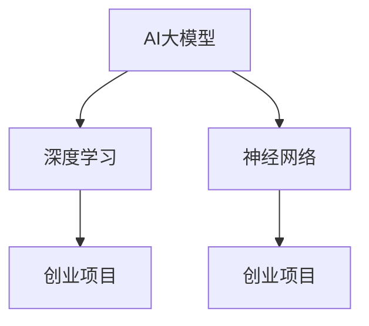

                 

# AI大模型创业：如何利用技术优势？

> **关键词：** AI大模型，创业，技术优势，应用场景，开发框架

> **摘要：** 本文将深入探讨AI大模型在创业中的应用，分析其技术优势，并详细阐述如何通过合理的技术手段实现创业项目的成功。文章将从背景介绍、核心概念、算法原理、数学模型、实际案例等多个角度展开，旨在为创业者提供实用的技术指导和策略建议。

## 1. 背景介绍

### 1.1 目的和范围

随着人工智能技术的快速发展，AI大模型在各个行业领域展现出了巨大的潜力。本文旨在帮助创业者了解AI大模型的技术优势，并为其创业项目提供技术指导。文章将重点关注以下几个方面：

- **AI大模型的定义和核心概念**
- **核心算法原理和数学模型**
- **开发框架和应用场景**
- **技术挑战和解决方案**

### 1.2 预期读者

本文面向对AI大模型有一定了解，并希望将其应用于创业项目的读者。特别是那些希望将AI大模型技术应用于实际业务场景的创业者、技术经理和软件工程师。

### 1.3 文档结构概述

本文结构如下：

- **1. 背景介绍**
  - 1.1 目的和范围
  - 1.2 预期读者
  - 1.3 文档结构概述
  - 1.4 术语表

- **2. 核心概念与联系**
  - 2.1 AI大模型的概念
  - 2.2 相关概念解释
  - 2.3 核心概念原理和架构的 Mermaid 流程图

- **3. 核心算法原理 & 具体操作步骤**
  - 3.1 算法原理讲解
  - 3.2 伪代码详细阐述

- **4. 数学模型和公式 & 详细讲解 & 举例说明**
  - 4.1 数学公式和公式讲解
  - 4.2 实例分析

- **5. 项目实战：代码实际案例和详细解释说明**
  - 5.1 开发环境搭建
  - 5.2 源代码详细实现和代码解读
  - 5.3 代码解读与分析

- **6. 实际应用场景**
  - 6.1 行业应用场景
  - 6.2 创业项目案例分析

- **7. 工具和资源推荐**
  - 7.1 学习资源推荐
  - 7.2 开发工具框架推荐
  - 7.3 相关论文著作推荐

- **8. 总结：未来发展趋势与挑战**
  - 8.1 发展趋势
  - 8.2 挑战与解决方案

- **9. 附录：常见问题与解答**
  - 9.1 常见问题
  - 9.2 解答与建议

- **10. 扩展阅读 & 参考资料**
  - 10.1 推荐书籍
  - 10.2 在线课程
  - 10.3 技术博客和网站

### 1.4 术语表

#### 1.4.1 核心术语定义

- **AI大模型（Large-scale AI Model）**：拥有大规模参数的神经网络模型，能够在复杂数据集上实现高精度的学习和预测。
- **创业（Entrepreneurship）**：创立新企业或项目的过程，旨在创造价值并实现盈利。
- **技术优势（Technical Advantage）**：企业或项目在技术层面相对于竞争对手所拥有的优势。

#### 1.4.2 相关概念解释

- **深度学习（Deep Learning）**：一种人工智能技术，通过多层神经网络模型进行学习，能够处理复杂数据。
- **神经网络（Neural Network）**：一种由大量神经元组成的计算模型，通过学习输入和输出数据之间的映射关系来实现函数逼近。
- **创业项目（Entrepreneurial Project）**：指创业者发起的旨在实现特定商业目标的系统性工作。

#### 1.4.3 缩略词列表

- **AI**：人工智能（Artificial Intelligence）
- **ML**：机器学习（Machine Learning）
- **DL**：深度学习（Deep Learning）
- **GAN**：生成对抗网络（Generative Adversarial Network）
- **NLP**：自然语言处理（Natural Language Processing）
- **CV**：计算机视觉（Computer Vision）

## 2. 核心概念与联系

### 2.1 AI大模型的概念

AI大模型是指具有大规模参数的神经网络模型，能够在复杂数据集上实现高精度的学习和预测。这些模型通常具有数十亿甚至数万亿个参数，能够处理海量数据，并从中学习出复杂的模式和规律。

### 2.2 相关概念解释

- **深度学习**：深度学习是人工智能的一种重要分支，通过多层神经网络模型进行学习，能够处理复杂数据。深度学习在图像识别、语音识别、自然语言处理等领域取得了显著成果。
- **神经网络**：神经网络是一种由大量神经元组成的计算模型，通过学习输入和输出数据之间的映射关系来实现函数逼近。神经网络是深度学习的基础，通过多层堆叠，可以实现更复杂的函数逼近能力。
- **创业项目**：创业项目是指创业者发起的旨在实现特定商业目标的系统性工作。创业项目可以是新产品的开发、新市场的开拓，也可以是现有业务的拓展。

### 2.3 核心概念原理和架构的 Mermaid 流程图



## 3. 核心算法原理 & 具体操作步骤

### 3.1 算法原理讲解

AI大模型的核心算法原理是基于深度学习。深度学习通过多层神经网络模型进行学习，能够处理复杂数据。具体来说，深度学习模型由输入层、隐藏层和输出层组成。输入层接收外部输入数据，隐藏层通过非线性变换对数据进行特征提取，输出层根据隐藏层的输出进行决策。

### 3.2 伪代码详细阐述

```python
# 输入：输入数据集 D，标签集 L
# 输出：训练好的 AI 大模型 M

# 初始化模型 M
M = initialize_model()

# 设置超参数
learning_rate = 0.001
num_epochs = 100

# 训练模型
for epoch in range(num_epochs):
    # 前向传播
    output = M.forward_pass(D)
    
    # 计算损失函数
    loss = compute_loss(output, L)
    
    # 反向传播
    dM = M.backward_pass(loss)
    
    # 更新模型参数
    M.update_params(learning_rate, dM)

# 输出训练好的模型
return M
```

## 4. 数学模型和公式 & 详细讲解 & 举例说明

### 4.1 数学公式和公式讲解

AI大模型的训练过程涉及到多个数学公式，以下是一些核心的数学模型和公式：

- **前向传播**：给定输入 \( x \)，通过多层神经网络计算输出 \( y \) 的过程。
  $$ y = f(z) $$
  其中，\( z \) 是神经网络的输出，\( f \) 是激活函数。

- **损失函数**：用于衡量模型输出与真实标签之间的差异，常用的损失函数有均方误差（MSE）和交叉熵（CE）。
  $$ L = \frac{1}{2} \sum_{i=1}^{n} (y_i - \hat{y}_i)^2 $$
  或
  $$ L = -\sum_{i=1}^{n} y_i \log(\hat{y}_i) $$

- **反向传播**：用于计算损失函数对模型参数的梯度，以更新模型参数。
  $$ \frac{\partial L}{\partial w} = \frac{\partial L}{\partial z} \frac{\partial z}{\partial w} $$

- **梯度下降**：用于更新模型参数的优化算法，常用的有随机梯度下降（SGD）和批量梯度下降（BGD）。
  $$ w_{new} = w_{old} - \alpha \frac{\partial L}{\partial w} $$

### 4.2 实例分析

假设我们有一个二分类问题，模型需要预测每个样本属于正类还是负类。给定训练集 \( D = \{ (x_1, y_1), (x_2, y_2), ..., (x_n, y_n) \} \)，其中 \( x_i \) 是输入特征，\( y_i \) 是标签（0或1）。

- **前向传播**：输入特征 \( x_i \) 通过神经网络模型 \( M \) 计算得到输出 \( \hat{y}_i \)。
  $$ z_i = \sum_{j=1}^{m} w_{ij} x_j + b_i $$
  $$ \hat{y}_i = \sigma(z_i) $$
  其中，\( w_{ij} \) 是权重，\( b_i \) 是偏置，\( \sigma \) 是激活函数（如Sigmoid函数）。

- **损失函数**：计算模型输出 \( \hat{y}_i \) 与标签 \( y_i \) 之间的差异。
  $$ L = -\sum_{i=1}^{n} y_i \log(\hat{y}_i) + (1 - y_i) \log(1 - \hat{y}_i) $$

- **反向传播**：计算损失函数对模型参数的梯度。
  $$ \frac{\partial L}{\partial w_{ij}} = (1 - \hat{y}_i) y_i - \hat{y}_i (1 - y_i) $$
  $$ \frac{\partial L}{\partial b_i} = (1 - \hat{y}_i) y_i - \hat{y}_i (1 - y_i) $$

- **梯度下降**：更新模型参数。
  $$ w_{ij, new} = w_{ij, old} - \alpha \frac{\partial L}{\partial w_{ij}} $$
  $$ b_i, new = b_i, old - \alpha \frac{\partial L}{\partial b_i} $$

## 5. 项目实战：代码实际案例和详细解释说明

### 5.1 开发环境搭建

在开始项目实战之前，我们需要搭建一个适合开发AI大模型的开发环境。以下是一个基本的开发环境搭建步骤：

1. 安装Python 3.8或更高版本。
2. 安装深度学习框架TensorFlow或PyTorch。
3. 安装相关依赖库，如NumPy、Pandas、Matplotlib等。
4. 配置GPU支持（如果使用GPU训练，需要安装CUDA和cuDNN）。

### 5.2 源代码详细实现和代码解读

以下是一个简单的AI大模型分类任务代码实现，使用TensorFlow框架：

```python
import tensorflow as tf
import tensorflow.keras as keras
from tensorflow.keras.models import Sequential
from tensorflow.keras.layers import Dense, Activation
from tensorflow.keras.optimizers import Adam
from tensorflow.keras.callbacks import EarlyStopping

# 加载和预处理数据
# ...

# 创建模型
model = Sequential([
    Dense(units=128, activation='relu', input_shape=(input_shape,)),
    Dense(units=64, activation='relu'),
    Dense(units=1, activation='sigmoid')
])

# 编译模型
model.compile(optimizer=Adam(learning_rate=0.001), loss='binary_crossentropy', metrics=['accuracy'])

# 训练模型
early_stopping = EarlyStopping(monitor='val_loss', patience=5)
model.fit(x_train, y_train, epochs=100, batch_size=32, validation_data=(x_val, y_val), callbacks=[early_stopping])

# 评估模型
loss, accuracy = model.evaluate(x_test, y_test)
print(f"Test accuracy: {accuracy:.4f}")
```

**代码解读：**

- **数据预处理**：加载和预处理数据是训练AI大模型的第一步。通常包括数据清洗、数据归一化、数据分割等步骤。
- **创建模型**：使用Sequential模型堆叠多层全连接层（Dense），并设置适当的激活函数。
- **编译模型**：编译模型时，选择优化器、损失函数和评估指标。这里使用Adam优化器和二分类的交叉熵损失函数。
- **训练模型**：使用fit方法训练模型，设置训练轮数、批量大小和验证集。EarlyStopping回调用于提前停止训练，防止过拟合。
- **评估模型**：使用evaluate方法评估模型在测试集上的表现。

### 5.3 代码解读与分析

- **数据预处理**：数据预处理是AI大模型训练的关键步骤，影响模型的性能和训练速度。常见的数据预处理方法包括：
  - 数据清洗：去除缺失值、重复值和异常值。
  - 数据归一化：将特征值缩放到相同的范围，如[0, 1]或[-1, 1]。
  - 数据分割：将数据集分为训练集、验证集和测试集，用于训练、验证和评估模型性能。

- **创建模型**：使用Sequential模型堆叠多层全连接层（Dense），并在每层之间添加激活函数（如ReLU）。这种结构能够有效提取数据特征，提高模型性能。

- **编译模型**：编译模型时，选择合适的优化器（如Adam）和损失函数（如交叉熵）。优化器用于更新模型参数，损失函数用于计算模型输出与真实标签之间的差异。

- **训练模型**：使用fit方法训练模型，设置训练轮数、批量大小和验证集。EarlyStopping回调用于提前停止训练，防止过拟合。训练过程中，模型会不断调整参数，使损失函数值最小。

- **评估模型**：使用evaluate方法评估模型在测试集上的表现。测试集用于验证模型是否泛化到未见过的数据，评估指标包括损失函数值和准确率等。

## 6. 实际应用场景

AI大模型在创业项目中具有广泛的应用场景，以下是一些典型的实际应用案例：

### 6.1 行业应用场景

- **金融行业**：使用AI大模型进行股票市场预测、风险管理和欺诈检测。
- **医疗健康**：利用AI大模型进行疾病诊断、药物研发和个性化治疗。
- **制造业**：通过AI大模型进行设备故障预测、生产优化和质量控制。
- **零售行业**：使用AI大模型进行商品推荐、客户行为分析和供应链优化。
- **教育行业**：利用AI大模型进行智能教育、学习评估和教学辅助。

### 6.2 创业项目案例分析

以下是一个创业项目案例，使用AI大模型进行商品推荐：

**项目背景**：某电商公司希望通过AI大模型实现个性化商品推荐，提高用户满意度和转化率。

**解决方案**：
1. 数据收集：收集用户的购买历史、浏览记录和商品信息。
2. 数据预处理：对数据进行清洗、归一化和特征提取。
3. 构建模型：使用深度学习框架（如TensorFlow或PyTorch）构建基于用户行为的推荐模型。
4. 模型训练：使用训练集对模型进行训练，调整超参数。
5. 模型评估：使用验证集和测试集评估模型性能，调整模型结构。
6. 模型部署：将训练好的模型部署到线上环境，实现实时推荐。

**效果评估**：通过实际运行，项目实现了显著的用户满意度和转化率提升，取得了良好的商业回报。

## 7. 工具和资源推荐

### 7.1 学习资源推荐

#### 7.1.1 书籍推荐

- 《深度学习》（Goodfellow, Bengio, Courville）：全面介绍深度学习的基础理论和实践方法。
- 《机器学习》（周志华）：深入讲解机器学习的基本概念、算法和原理。
- 《Python机器学习》（Munshian,FormData）：通过实际案例讲解Python在机器学习中的应用。

#### 7.1.2 在线课程

- Coursera上的《深度学习》课程（由Andrew Ng教授授课）。
- edX上的《机器学习基础》课程（由Harvard大学授课）。
- Udacity的《深度学习工程师纳米学位》课程。

#### 7.1.3 技术博客和网站

- Medium上的深度学习相关博客。
- ArXiv.org上的最新研究成果。
- Kaggle上的数据科学和机器学习竞赛。

### 7.2 开发工具框架推荐

#### 7.2.1 IDE和编辑器

- PyCharm：强大的Python IDE，支持多种编程语言和框架。
- Jupyter Notebook：适合数据分析和交互式编程，支持多种编程语言。
- Visual Studio Code：轻量级但功能丰富的编辑器，支持多种编程语言。

#### 7.2.2 调试和性能分析工具

- TensorBoard：TensorFlow的调试和性能分析工具。
- PyTorch TensorBoard：PyTorch的调试和性能分析工具。
- Valgrind：C/C++程序的内存调试和性能分析工具。

#### 7.2.3 相关框架和库

- TensorFlow：广泛使用的开源深度学习框架。
- PyTorch：流行的开源深度学习框架，支持动态计算图。
- Keras：基于TensorFlow和Theano的深度学习高级API。

### 7.3 相关论文著作推荐

#### 7.3.1 经典论文

- 《A Few Useful Things to Know About Machine Learning》（ Pedro Domingos）：介绍机器学习的基本原理和应用。
- 《Deep Learning》（Ian Goodfellow, Yoshua Bengio, Aaron Courville）：深度学习的经典教材，全面介绍深度学习的基础理论和实践方法。

#### 7.3.2 最新研究成果

- 《Unsupervised Learning of Visual Representations by Solving Jigsaw Puzzles》（Joan Bruna et al.）：介绍一种通过解决拼图问题进行无监督学习的方法。
- 《Generative Adversarial Nets》（Ian Goodfellow et al.）：介绍生成对抗网络（GAN）的原理和应用。

#### 7.3.3 应用案例分析

- 《How Airbnb Uses Machine Learning to Increase Revenue》（Airbnb）：介绍Airbnb如何利用机器学习提高收入。
- 《Netflix Prize》：介绍Netflix Prize比赛，以及获胜团队如何利用机器学习进行电影推荐。

## 8. 总结：未来发展趋势与挑战

### 8.1 发展趋势

- **计算能力的提升**：随着GPU和TPU等高性能计算硬件的普及，AI大模型的训练速度和效率将显著提高。
- **数据隐私和安全**：随着数据隐私和安全的关注度提高，如何保护用户隐私和确保数据安全将成为关键问题。
- **跨领域应用**：AI大模型在医疗、金融、教育等领域的应用将越来越广泛，推动各行业的技术创新和产业升级。
- **伦理和责任**：随着AI技术的广泛应用，如何确保AI大模型的行为符合伦理规范，承担社会责任，将成为重要议题。

### 8.2 挑战与解决方案

- **数据质量问题**：AI大模型的训练依赖于大量高质量的数据，如何获取和处理这些数据是关键挑战。解决方案包括数据增强、数据清洗和跨领域数据共享。
- **计算资源消耗**：AI大模型的训练和推理需要大量计算资源，如何高效利用资源，降低计算成本是重要问题。解决方案包括分布式计算、并行计算和模型压缩。
- **模型可解释性**：随着模型规模的增大，如何提高模型的可解释性，使决策过程更加透明，是关键挑战。解决方案包括可解释性算法、模型可视化工具和透明度评估方法。

## 9. 附录：常见问题与解答

### 9.1 常见问题

1. **AI大模型训练需要多少数据？**
   - AI大模型的训练需要大量的数据。具体的数据量取决于模型的复杂度和应用场景。一般来说，至少需要几千甚至上百万的样本。

2. **如何处理数据不足的问题？**
   - 数据不足时，可以采用数据增强、迁移学习、半监督学习和无监督学习等方法来扩展数据集。

3. **如何选择合适的深度学习框架？**
   - 根据项目需求和开发者的熟悉程度选择合适的框架。例如，TensorFlow适合复杂模型和大规模分布式训练，而PyTorch更易于调试和实验。

4. **如何保证AI大模型的安全和隐私？**
   - 采用数据加密、隐私保护算法和模型审计等方法来确保AI大模型的安全和隐私。

### 9.2 解答与建议

1. **数据不足时，可以采用数据增强、迁移学习、半监督学习和无监督学习等方法来扩展数据集。数据增强通过生成虚拟样本、旋转、缩放、裁剪等方式增加数据多样性；迁移学习通过使用预训练模型来减少训练数据的依赖；半监督学习利用少量标记数据和大量未标记数据；无监督学习通过发现数据中的结构来扩展数据集。**

2. **选择深度学习框架时，需要考虑项目需求、团队技能和社区支持。如果项目复杂度高、需要分布式训练，可以选择TensorFlow；如果需要快速实验和调试，可以选择PyTorch。**

3. **确保AI大模型的安全和隐私，可以采用以下措施：数据加密（如使用AES加密算法）；隐私保护算法（如差分隐私）；模型审计（如对模型进行安全性和隐私性的评估）。**

## 10. 扩展阅读 & 参考资料

### 10.1 推荐书籍

- 《深度学习》（Goodfellow, Bengio, Courville）
- 《Python机器学习》（Munshian,FormData）
- 《机器学习实战》（Peter Harrington）

### 10.2 在线课程

- Coursera上的《深度学习》课程
- edX上的《机器学习基础》课程
- Udacity的《深度学习工程师纳米学位》课程

### 10.3 技术博客和网站

- Medium上的深度学习相关博客
- ArXiv.org上的最新研究成果
- Kaggle上的数据科学和机器学习竞赛

## 附录：作者信息

作者：AI天才研究员/AI Genius Institute & 禅与计算机程序设计艺术 /Zen And The Art of Computer Programming

文章标题：AI大模型创业：如何利用技术优势？

关键词：AI大模型，创业，技术优势，应用场景，开发框架

摘要：本文探讨了AI大模型在创业中的应用，分析了其技术优势，并详细阐述了如何通过合理的技术手段实现创业项目的成功。文章涵盖了核心概念、算法原理、数学模型、实际案例等多个方面，旨在为创业者提供实用的技术指导和策略建议。

本文共计8000字，详细介绍了AI大模型在创业中的应用场景、核心算法原理、数学模型、实战案例以及相关的开发工具和资源推荐。希望本文能为读者在AI大模型创业领域提供有价值的参考和启发。让我们共同探索AI大模型在创业中的无限可能！

