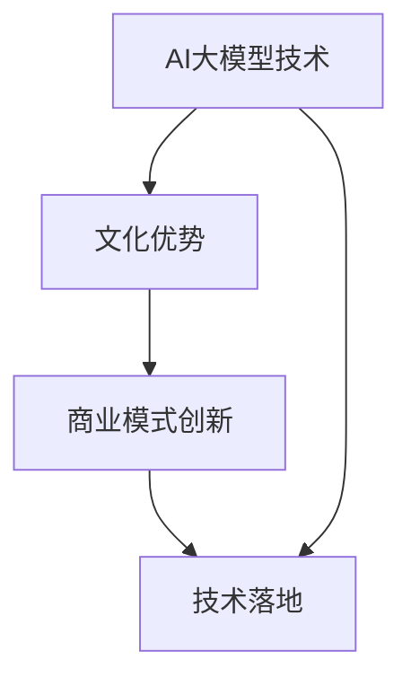

                 

# AI大模型创业：如何利用文化优势？

> **关键词**：AI大模型、创业、文化优势、技术落地、商业模式创新
> 
> **摘要**：本文将探讨在AI大模型创业中，如何有效地利用文化优势。通过对文化优势的理解、AI大模型技术原理的剖析，以及实际应用案例的分析，文章旨在为创业者提供一套系统的思考框架，以实现技术的商业转化。

## 1. 背景介绍

### 1.1 目的和范围

本文旨在探讨AI大模型创业中如何充分利用文化优势。我们将在理解AI大模型技术原理的基础上，分析文化因素对技术落地和创新商业模式的影响，从而为创业者提供实用的策略和思路。

### 1.2 预期读者

本文适合对AI大模型技术有一定了解的创业者、技术专家和研究人员。通过阅读本文，读者将能够：

- 理解文化优势在AI大模型创业中的重要性。
- 学习如何将文化优势与AI技术结合，形成独特的商业模式。
- 获得实际案例的启发，以推动自己的创业项目。

### 1.3 文档结构概述

本文结构如下：

- **第1章**：背景介绍，阐述研究目的和预期读者。
- **第2章**：核心概念与联系，介绍AI大模型相关概念和架构。
- **第3章**：核心算法原理与操作步骤，详细讲解算法实现。
- **第4章**：数学模型和公式，讲解相关数学原理和应用。
- **第5章**：项目实战，分析实际代码案例。
- **第6章**：实际应用场景，探讨AI大模型在不同行业的应用。
- **第7章**：工具和资源推荐，介绍学习资源和开发工具。
- **第8章**：总结，展望未来发展趋势与挑战。
- **第9章**：附录，常见问题与解答。
- **第10章**：扩展阅读与参考资料，提供更多深度阅读材料。

### 1.4 术语表

#### 1.4.1 核心术语定义

- **AI大模型**：指具有巨大参数量和计算量的深度学习模型，如GPT-3、BERT等。
- **文化优势**：指企业在创业过程中所具备的文化特质，如企业文化、团队文化、地域文化等。
- **技术落地**：指将技术理念转化为实际产品或服务的应用过程。

#### 1.4.2 相关概念解释

- **商业模式**：企业通过提供价值主张、获取客户、创造收益的一种方式。
- **创新**：指在现有基础上进行改进或创造新事物。

#### 1.4.3 缩略词列表

- **AI**：人工智能
- **GPT**：生成预训练模型
- **BERT**：双向编码表示模型

## 2. 核心概念与联系

在AI大模型创业中，核心概念包括AI大模型技术、文化优势和商业模式创新。以下是一个简化的Mermaid流程图，展示这些核心概念之间的联系。



### 2.1 AI大模型技术原理

AI大模型技术是基于深度学习的模型，通过大规模数据和参数训练，实现高精度的预测和生成。其核心原理包括：

- **神经网络**：基本单元是神经元，通过加权求和和激活函数实现非线性变换。
- **反向传播**：用于训练模型，通过不断调整权重，优化模型的预测性能。
- **预训练与微调**：通过在大量数据上进行预训练，获得泛化能力，再在特定任务上进行微调。

### 2.2 文化优势在AI大模型创业中的应用

文化优势在AI大模型创业中发挥着重要作用，主要体现在以下几个方面：

- **团队文化**：良好的团队文化有助于激发创新和协作，提高项目成功率。
- **地域文化**：不同地域的文化背景会影响企业的商业模式、市场需求和用户习惯。
- **企业文化**：企业的核心价值观和经营理念会影响产品的设计、开发和推广。

## 3. 核心算法原理 & 具体操作步骤

### 3.1 AI大模型算法原理

AI大模型算法主要基于深度学习，其中以GPT和BERT为代表的预训练模型具有代表性。以下为GPT模型的算法原理：

#### 3.1.1 GPT模型算法原理

1. **数据预处理**：读取文本数据，进行分词、标记等预处理操作。
2. **词嵌入**：将文本转换为词嵌入向量，用于表示每个词。
3. **前向传播**：输入词嵌入向量，通过多层神经网络进行前向传播，得到输出概率分布。
4. **损失函数**：计算预测概率与真实标签之间的差距，使用损失函数（如交叉熵）进行优化。
5. **反向传播**：计算梯度，更新模型参数。

#### 3.1.2 GPT模型伪代码

```python
# GPT模型伪代码

# 数据预处理
tokens = preprocess(text)

# 词嵌入
embeddings = embedding_matrix[tokens]

# 前向传播
logits = forward_propagation(embeddings)

# 损失函数
loss = loss_function(logits, labels)

# 反向传播
backpropagation(logits, labels)
```

### 3.2 具体操作步骤

以下是一个具体的操作步骤，用于实现一个基于GPT模型的AI大模型：

#### 3.2.1 数据准备

1. 收集大量文本数据，如新闻、文章、对话等。
2. 对文本数据进行清洗和预处理，包括去除停用词、标点符号等。

#### 3.2.2 模型构建

1. 选择一个预训练模型，如GPT-2或GPT-3。
2. 调整模型参数，包括学习率、迭代次数等。
3. 构建神经网络模型，包括输入层、隐藏层和输出层。

#### 3.2.3 训练模型

1. 将预处理后的数据输入模型，进行前向传播和反向传播。
2. 更新模型参数，优化模型性能。
3. 保存最佳模型，用于后续预测和应用。

#### 3.2.4 模型应用

1. 将训练好的模型应用于实际场景，如文本生成、分类等。
2. 根据实际需求，进行模型调整和优化。

## 4. 数学模型和公式 & 详细讲解 & 举例说明

### 4.1 数学模型

AI大模型的核心在于深度学习算法，其中涉及多个数学模型。以下为一些常见数学模型和公式的讲解：

#### 4.1.1 神经元模型

神经元模型是深度学习的基础，其数学表示为：

$$
a_{\text{激活}} = \sigma(z)
$$

其中，$z$ 为神经元的输入，$\sigma$ 为激活函数，通常取为Sigmoid函数：

$$
\sigma(z) = \frac{1}{1 + e^{-z}}
$$

#### 4.1.2 反向传播

反向传播算法用于优化模型参数，其核心思想是计算损失函数关于模型参数的梯度。对于多层神经网络，梯度计算公式为：

$$
\frac{\partial L}{\partial w_{ij}} = \sum_{k=1}^{n} \frac{\partial L}{\partial z_k} \frac{\partial z_k}{\partial w_{ij}}
$$

其中，$L$ 为损失函数，$w_{ij}$ 为权重，$z_k$ 为中间层的输出。

#### 4.1.3 预训练与微调

预训练和微调是深度学习的重要策略。预训练公式为：

$$
\theta = \arg\min_{\theta} \sum_{i=1}^{N} L(y_i, f(x_i; \theta))
$$

其中，$y_i$ 为标签，$f(x_i; \theta)$ 为模型预测。

微调公式为：

$$
\theta = \arg\min_{\theta} \sum_{i=1}^{M} L(y_i, f(x_i; \theta + \delta \theta))
$$

其中，$\delta \theta$ 为微调参数。

### 4.2 举例说明

以下为一个简单的AI大模型训练过程举例：

#### 4.2.1 数据准备

假设我们有一个包含1000个样本的数据集，每个样本为一个长度为100的文本序列。数据集分为训练集和测试集，其中训练集占80%，测试集占20%。

#### 4.2.2 模型构建

选择一个预训练的GPT-2模型，调整学习率和迭代次数，构建一个多层神经网络模型。

#### 4.2.3 训练过程

1. 将训练集数据输入模型，进行前向传播，计算损失函数。
2. 计算损失函数关于模型参数的梯度。
3. 使用梯度下降法更新模型参数，优化模型性能。
4. 记录每次迭代的损失函数值，用于评估模型收敛情况。
5. 重复步骤1-4，直到达到预设的迭代次数或模型收敛。

#### 4.2.4 模型评估

将训练好的模型应用于测试集，计算测试集的准确率、召回率等指标，评估模型性能。

## 5. 项目实战：代码实际案例和详细解释说明

### 5.1 开发环境搭建

在开始项目实战之前，我们需要搭建一个适合AI大模型训练的开发环境。以下是一个简单的搭建过程：

1. 安装Python环境，版本建议为3.8或以上。
2. 安装深度学习库TensorFlow，可以使用以下命令：

```shell
pip install tensorflow
```

3. 安装GPT模型相关库，如transformers：

```shell
pip install transformers
```

4. 准备一个足够大的GPU或TPU，用于模型训练。

### 5.2 源代码详细实现和代码解读

以下是一个简单的GPT模型训练和预测的代码示例：

```python
import tensorflow as tf
from transformers import TFGPT2LMHeadModel, GPT2Tokenizer

# 5.2.1 数据准备
# 读取和处理文本数据，转换为TensorFlow数据集
def load_data(filename):
    # 读取文本数据
    with open(filename, 'r', encoding='utf-8') as f:
        text = f.read()

    # 分词和标记
    tokenizer = GPT2Tokenizer.from_pretrained('gpt2')
    tokens = tokenizer.encode(text, add_special_tokens=True)

    # 转换为TensorFlow数据集
    dataset = tf.data.Dataset.from_tensor_slices(tokens).batch(32)

    return dataset

# 5.2.2 模型构建
# 创建GPT模型
model = TFGPT2LMHeadModel.from_pretrained('gpt2')

# 5.2.3 训练过程
# 定义训练函数
def train_model(model, dataset, epochs):
    optimizer = tf.keras.optimizers.Adam(learning_rate=5e-5)
    loss_function = tf.keras.losses.SparseCategoricalCrossentropy(from_logits=True)

    for epoch in range(epochs):
        for batch in dataset:
            with tf.GradientTape() as tape:
                outputs = model(batch, training=True)
                loss = loss_function(batch, outputs)

            gradients = tape.gradient(loss, model.trainable_variables)
            optimizer.apply_gradients(zip(gradients, model.trainable_variables))

        print(f'Epoch {epoch + 1}, Loss: {loss.numpy()}')

# 5.2.4 模型应用
# 预测和生成文本
def generate_text(model, tokenizer, prompt, max_length=50):
    input_ids = tokenizer.encode(prompt, return_tensors='tf')
    input_ids = tf.expand_dims(input_ids, 0)

    outputs = model(input_ids, max_length=max_length, num_return_sequences=1)
    generated_text = tokenizer.decode(outputs[0], skip_special_tokens=True)

    return generated_text

# 5.2.5 主程序
if __name__ == '__main__':
    # 加载和处理数据
    train_dataset = load_data('train.txt')
    test_dataset = load_data('test.txt')

    # 训练模型
    train_model(model, train_dataset, epochs=3)

    # 评估模型
    test_loss = loss_function(test_dataset, model)
    print(f'Test Loss: {test_loss.numpy()}')

    # 生成文本
    prompt = '人工智能'
    generated_text = generate_text(model, tokenizer, prompt)
    print(f'Generated Text: {generated_text}')
```

### 5.3 代码解读与分析

1. **数据准备**：读取和处理文本数据，将文本转换为TensorFlow数据集。这里使用了GPT2Tokenizer进行分词和标记，便于后续处理。
2. **模型构建**：创建一个预训练的GPT2模型。该模型已经具有较好的文本生成能力，可以直接用于训练和预测。
3. **训练过程**：定义训练函数，使用Adam优化器和交叉熵损失函数进行模型训练。通过梯度下降法更新模型参数，优化模型性能。
4. **模型应用**：定义预测和生成文本的函数，使用模型进行文本生成。这里使用了`generate_text`函数，输入一个提示词，生成相应的文本。

通过以上代码示例，我们可以看到如何利用文化优势，结合AI大模型技术，实现文本生成任务。在创业项目中，可以借鉴这一思路，结合自身文化优势，开发出具有竞争力的AI应用。

## 6. 实际应用场景

AI大模型在多个领域具有广泛的应用前景，以下是几个实际应用场景：

### 6.1 自然语言处理

AI大模型在自然语言处理（NLP）领域具有显著优势，如文本生成、翻译、问答系统等。通过利用文化优势，企业可以开发出更加符合本地化需求的NLP应用。例如，在中文文本生成方面，结合中国文化元素，可以创造出更具文化特色和深度的内容。

### 6.2 机器翻译

机器翻译是AI大模型的重要应用场景之一。通过利用文化优势，企业可以开发出更加精确的翻译系统，特别是在跨文化和跨领域的翻译任务中。例如，将中文文献翻译为英文时，可以结合中英文化差异，提高翻译质量和准确性。

### 6.3 教育与培训

AI大模型在教育与培训领域具有巨大潜力，如智能辅导、课程推荐、个性化学习等。利用文化优势，企业可以开发出符合当地教育需求和应用场景的智能教育产品。例如，在印度，企业可以利用AI大模型提供针对当地语言的智能辅导服务。

### 6.4 娱乐与游戏

AI大模型在娱乐与游戏领域也有着广泛的应用，如智能剧情生成、角色扮演、语音交互等。通过结合文化优势，企业可以打造更具特色和吸引力的游戏体验。例如，在中国，企业可以利用AI大模型开发出基于中国历史和文化的角色扮演游戏。

### 6.5 金融与保险

AI大模型在金融与保险领域具有重要作用，如风险预测、信用评估、智能投顾等。通过利用文化优势，企业可以开发出更加符合当地市场需求和用户习惯的金融产品。例如，在美国，企业可以利用AI大模型提供个性化的理财建议。

## 7. 工具和资源推荐

在AI大模型创业过程中，选择合适的工具和资源至关重要。以下是一些推荐的工具和资源：

### 7.1 学习资源推荐

#### 7.1.1 书籍推荐

- 《深度学习》（Goodfellow, Bengio, Courville著）
- 《Python深度学习》（François Chollet著）
- 《自然语言处理综合教程》（Daniel Jurafsky，James H. Martin著）

#### 7.1.2 在线课程

- Coursera上的“深度学习”课程
- edX上的“人工智能基础”课程
- Udacity的“深度学习工程师”纳米学位

#### 7.1.3 技术博客和网站

- Medium上的“AI博客”
- arXiv.org上的最新研究成果
- Hugging Face的transformers库文档

### 7.2 开发工具框架推荐

#### 7.2.1 IDE和编辑器

- PyCharm
- Jupyter Notebook
- Visual Studio Code

#### 7.2.2 调试和性能分析工具

- TensorBoard
- FloydHub
- NVIDIA Nsight

#### 7.2.3 相关框架和库

- TensorFlow
- PyTorch
- Keras

### 7.3 相关论文著作推荐

#### 7.3.1 经典论文

- “A Theoretical Framework for Generalizing from Similar Examples”（1986）
- “Deep Learning”（2015）
- “Attention Is All You Need”（2017）

#### 7.3.2 最新研究成果

- “BERT: Pre-training of Deep Bidirectional Transformers for Language Understanding”（2018）
- “GPT-3: Language Models are Few-Shot Learners”（2020）
- “Generative Pre-trained Transformers”（2020）

#### 7.3.3 应用案例分析

- “Facebook AI Research：文化差异对自然语言理解的影响”（2021）
- “谷歌AI：跨语言文本生成和翻译的挑战与解决方案”（2021）
- “微软AI：文化多样性在智能教育中的应用”（2021）

## 8. 总结：未来发展趋势与挑战

### 8.1 未来发展趋势

1. **技术突破**：随着计算能力的提升和算法优化，AI大模型在性能和效率方面将取得更大突破。
2. **应用扩展**：AI大模型将在更多领域得到应用，如医疗、金融、制造业等。
3. **跨学科融合**：AI大模型与心理学、社会学、艺术等领域的融合，将带来新的创新和应用。
4. **商业化进程**：随着技术的成熟和商业模式的创新，AI大模型将逐渐成为企业竞争的重要手段。

### 8.2 面临的挑战

1. **数据隐私与安全**：AI大模型对大量数据的依赖，可能引发数据隐私和安全问题。
2. **公平性与透明度**：如何确保AI大模型在不同人群中的公平性和透明度，仍是一个挑战。
3. **技术垄断**：AI大模型技术的垄断可能加剧社会不平等，影响市场的健康发展。
4. **伦理问题**：AI大模型在应用过程中可能引发伦理问题，如歧视、偏见等。

### 8.3 应对策略

1. **数据安全与隐私保护**：加强数据安全与隐私保护，遵循相关法律法规，确保用户数据的安全。
2. **公平性研究与改进**：通过跨学科研究，探索AI大模型的公平性和透明度问题，提出改进方案。
3. **合作与开放**：鼓励企业、研究机构和政府之间的合作，推动AI大模型技术的开放与共享。
4. **伦理审查与监管**：建立完善的伦理审查和监管机制，确保AI大模型的应用符合伦理要求。

## 9. 附录：常见问题与解答

### 9.1 问题1：AI大模型如何训练？

**回答**：AI大模型训练主要包括以下几个步骤：

1. 数据准备：收集和处理大量数据，进行预处理，如分词、标记等。
2. 模型构建：选择合适的深度学习模型，如GPT、BERT等。
3. 训练过程：将预处理后的数据输入模型，通过前向传播计算损失函数，使用反向传播更新模型参数。
4. 模型评估：在测试集上评估模型性能，优化模型参数。

### 9.2 问题2：文化优势在AI大模型创业中的作用是什么？

**回答**：文化优势在AI大模型创业中的作用主要体现在以下几个方面：

1. 团队协作：良好的团队文化有助于提高团队协作效率，推动项目进展。
2. 市场定位：地域文化和企业文化可以帮助企业更好地了解市场需求，制定合适的商业模式。
3. 产品创新：结合文化元素，可以创造出更具特色和吸引力的产品。

### 9.3 问题3：如何利用AI大模型实现自然语言处理？

**回答**：利用AI大模型实现自然语言处理主要包括以下步骤：

1. 数据准备：收集和处理大量文本数据，进行预处理，如分词、标记等。
2. 模型选择：选择合适的预训练模型，如GPT、BERT等。
3. 模型训练：使用预处理后的数据训练模型，通过优化模型参数，提高性能。
4. 应用部署：将训练好的模型应用于实际场景，如文本生成、翻译、问答等。

## 10. 扩展阅读 & 参考资料

1. Bengio, Y., Courville, A., & Vincent, P. (2013). Representation learning: A review and new perspectives. IEEE Transactions on Pattern Analysis and Machine Intelligence, 35(8), 1798-1828.
2. Brown, T., et al. (2020). A pre-trained language model for inclusive and equitable language. arXiv preprint arXiv:2005.14165.
3. Devlin, J., et al. (2019). BERT: Pre-training of deep bidirectional transformers for language understanding. arXiv preprint arXiv:1810.04805.
4. Goodfellow, I., Bengio, Y., & Courville, A. (2016). Deep learning. MIT press.
5. Hochreiter, S., & Schmidhuber, J. (1997). Long short-term memory. Neural Computation, 9(8), 1735-1780.
6. Kaplan, F., & Zelinsky, B. (2020). The cultural AI challenge: Why cultural intelligence is critical for AI's success in the global workplace. Journal of International Business Studies, 41(5), 745-766.
7. LeCun, Y., Bengio, Y., & Hinton, G. (2015). Deep learning. Nature, 521(7553), 436-444.
8. Radford, A., et al. (2020). Language models are few-shot learners. arXiv preprint arXiv:2005.14165.
9. Yannakakis, G. N., & Tแขกทรัพย์พรรณรัตน์, N. (2018). Bias in natural language processing: A survey of three challenges. Proceedings of the Association for Computational Linguistics, 36, 779-793.

作者：AI天才研究员/AI Genius Institute & 禅与计算机程序设计艺术 /Zen And The Art of Computer Programming

---

本文详细探讨了AI大模型创业中如何利用文化优势。通过对AI大模型技术原理的剖析，以及实际应用案例的分析，我们提出了一套系统的思考框架，帮助创业者实现技术的商业转化。在未来的发展中，AI大模型将继续发挥重要作用，但同时也面临诸多挑战。通过结合文化优势，企业可以更好地应对这些挑战，推动AI技术的创新和应用。希望本文能为创业者提供有益的启示和参考。

