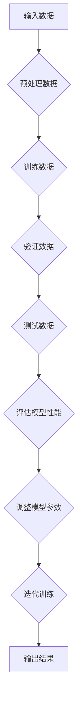
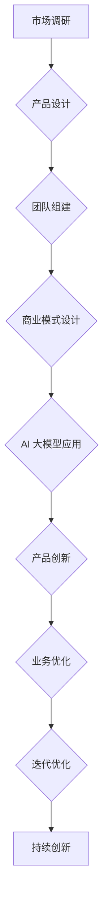
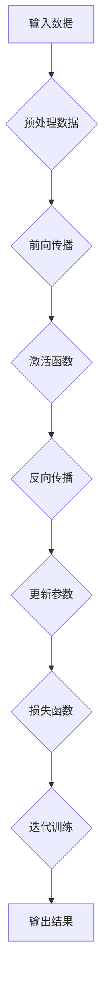

                 

# AI 大模型创业：如何利用未来优势？

> **关键词**：人工智能，大模型，创业，算法，模型训练，商业模式，技术应用
>
> **摘要**：本文将探讨人工智能（AI）大模型在创业领域中的应用，分析其核心算法原理、数学模型、实战案例，并展望未来发展趋势与挑战。文章旨在为创业者提供理论指导，助力他们在 AI 领域发掘潜在优势。

## 1. 背景介绍

### 1.1 目的和范围

本文的目标是帮助创业者了解并掌握 AI 大模型在创业中的潜在优势，从而在竞争激烈的市场中找到突破口。文章将涵盖以下内容：

- AI 大模型的定义与核心算法原理
- 大模型在创业中的应用场景
- 大模型的数学模型与公式
- 实际项目的代码实现与解析
- 未来发展趋势与挑战

### 1.2 预期读者

- 拥有编程基础，对人工智能领域感兴趣的开发者
- 正在寻找创业机会的创业者
- 对 AI 大模型感兴趣的学术研究人员

### 1.3 文档结构概述

本文共分为十个部分：

1. 背景介绍
2. 核心概念与联系
3. 核心算法原理 & 具体操作步骤
4. 数学模型和公式 & 详细讲解 & 举例说明
5. 项目实战：代码实际案例和详细解释说明
6. 实际应用场景
7. 工具和资源推荐
8. 总结：未来发展趋势与挑战
9. 附录：常见问题与解答
10. 扩展阅读 & 参考资料

### 1.4 术语表

#### 1.4.1 核心术语定义

- **人工智能（AI）**：模拟人类智能行为的技术
- **大模型**：参数规模巨大、能够处理大规模数据的模型
- **创业**：创办新企业或组织的过程

#### 1.4.2 相关概念解释

- **算法**：解决问题的一系列规则或步骤
- **模型训练**：通过大量数据训练模型，使其具备预测或决策能力
- **商业模式**：企业如何创造、传递和获取价值的方式

#### 1.4.3 缩略词列表

- **AI**：人工智能
- **DL**：深度学习
- **NLP**：自然语言处理

## 2. 核心概念与联系

在深入了解 AI 大模型创业之前，我们需要了解一些核心概念和它们之间的联系。

### 2.1 AI 大模型

AI 大模型是指具有数百万甚至数十亿参数的深度学习模型。这些模型通过训练大量的数据，能够学习到复杂的特征和规律，从而在各种任务上表现出色。

#### Mermaid 流程图：



### 2.2 创业

创业是指创办新企业或组织的过程，涉及到市场调研、产品设计、团队组建、商业模式设计等多个方面。AI 大模型在创业中的应用主要体现在以下两个方面：

1. **产品创新**：利用 AI 大模型进行数据分析和特征提取，发现潜在市场需求，为产品设计提供有力支持。
2. **业务优化**：通过 AI 大模型优化业务流程，提高生产效率，降低运营成本。

#### Mermaid 流程图：



## 3. 核心算法原理 & 具体操作步骤

### 3.1 算法原理

AI 大模型的算法原理主要基于深度学习。深度学习是一种通过多层神经网络进行特征提取和分类的方法。其核心思想是模拟人类大脑的神经元结构，通过多层次的神经网络来提取和表示数据中的复杂特征。

#### Mermaid 流程图：



### 3.2 具体操作步骤

以下是 AI 大模型训练的具体操作步骤：

1. **数据预处理**：对原始数据进行清洗、归一化等预处理操作，使其满足模型训练的要求。
2. **构建神经网络**：设计并构建多层神经网络，包括输入层、隐藏层和输出层。
3. **初始化参数**：初始化神经网络的权重和偏置。
4. **前向传播**：将输入数据通过神经网络进行计算，得到输出结果。
5. **激活函数**：对输出结果进行激活函数处理，如 ReLU、Sigmoid、Tanh 等。
6. **计算损失**：计算模型输出结果与真实标签之间的差异，得到损失值。
7. **反向传播**：根据损失值，更新神经网络的参数。
8. **迭代训练**：重复上述步骤，直到模型收敛或满足训练要求。

#### 伪代码：

```python
# 数据预处理
data = preprocess_data(raw_data)

# 初始化神经网络
model = NeuralNetwork()

# 迭代训练
for epoch in range(num_epochs):
    for batch in data:
        output = model.forward(batch.input)
        loss = compute_loss(output, batch.label)
        model.backward(loss)
        model.update_params()

# 评估模型性能
performance = evaluate_model(model, test_data)
```

## 4. 数学模型和公式 & 详细讲解 & 举例说明

### 4.1 数学模型

AI 大模型的数学模型主要涉及以下几个方面：

1. **神经网络**：神经网络由多层神经元组成，每个神经元通过权重和偏置与上一层神经元连接。神经元的输出通过激活函数进行非线性变换。
2. **损失函数**：损失函数用于衡量模型输出与真实标签之间的差异。常见的损失函数有均方误差（MSE）、交叉熵（Cross Entropy）等。
3. **优化算法**：优化算法用于更新神经网络的参数，以最小化损失函数。常见的优化算法有梯度下降（Gradient Descent）、Adam 等。

### 4.2 公式

以下是相关数学公式的详细讲解：

1. **神经网络输出**：

$$
\hat{y} = \sigma(W_L \cdot \sigma(W_{L-1} \cdot \sigma(... \cdot \sigma(W_1 \cdot x) + b_1) + b_{L-1}) + b_L)
$$

其中，$\sigma$表示激活函数，$W$表示权重矩阵，$b$表示偏置。

2. **均方误差（MSE）损失函数**：

$$
MSE = \frac{1}{m} \sum_{i=1}^{m} (\hat{y}_i - y_i)^2
$$

其中，$\hat{y}$表示模型预测值，$y$表示真实标签，$m$表示样本数量。

3. **交叉熵（Cross Entropy）损失函数**：

$$
CE = -\frac{1}{m} \sum_{i=1}^{m} y_i \cdot \log(\hat{y}_i)
$$

其中，$y$表示真实标签，$\hat{y}$表示模型预测值，$m$表示样本数量。

### 4.3 举例说明

假设我们有一个二分类问题，数据集包含100个样本，每个样本有一个特征$x$和对应的标签$y$。我们需要训练一个神经网络来预测标签。

1. **神经网络结构**：

   - 输入层：1个神经元
   - 隐藏层：2个神经元
   - 输出层：1个神经元

2. **初始化参数**：

   - 权重矩阵$W_1 \in \mathbb{R}^{2 \times 1}$，$W_2 \in \mathbb{R}^{1 \times 1}$
   - 偏置$b_1 \in \mathbb{R}^{2}$，$b_2 \in \mathbb{R}^{1}$

3. **前向传播**：

   - 输入$x \in \mathbb{R}^{1}$，通过输入层传递到隐藏层：

   $$ 
   a_1 = \sigma(W_1 \cdot x + b_1)
   $$

   - 隐藏层传递到输出层：

   $$ 
   a_2 = \sigma(W_2 \cdot a_1 + b_2)
   $$

4. **计算损失**：

   - 使用交叉熵损失函数计算预测值$\hat{y}$和真实标签$y$之间的差异：

   $$ 
   CE = -y \cdot \log(\hat{y}) + (1 - y) \cdot \log(1 - \hat{y})
   $$

5. **反向传播**：

   - 计算梯度：

   $$ 
   \frac{\partial CE}{\partial W_2} = (1 - \hat{y}) \cdot a_1
   $$

   $$ 
   \frac{\partial CE}{\partial b_2} = (1 - \hat{y})
   $$

   $$ 
   \frac{\partial CE}{\partial W_1} = x \cdot \frac{\partial CE}{\partial a_2} \cdot \frac{\partial a_2}{\partial a_1}
   $$

   $$ 
   \frac{\partial CE}{\partial b_1} = \frac{\partial CE}{\partial a_1}
   $$

6. **更新参数**：

   - 使用梯度下降更新参数：

   $$ 
   W_2 = W_2 - \alpha \cdot \frac{\partial CE}{\partial W_2}
   $$

   $$ 
   b_2 = b_2 - \alpha \cdot \frac{\partial CE}{\partial b_2}
   $$

   $$ 
   W_1 = W_1 - \alpha \cdot \frac{\partial CE}{\partial W_1}
   $$

   $$ 
   b_1 = b_1 - \alpha \cdot \frac{\partial CE}{\partial b_1}
   $$

   其中，$\alpha$表示学习率。

## 5. 项目实战：代码实际案例和详细解释说明

### 5.1 开发环境搭建

为了实现本文的项目实战，我们需要搭建一个合适的开发环境。以下是一个简单的指南：

1. **硬件要求**：至少需要一台配置为 Intel Core i5 或更高处理器，8GB 或更高内存的计算机。
2. **软件要求**：
   - 操作系统：Windows、macOS 或 Linux
   - 编程语言：Python（版本 3.6 或更高）
   - 深度学习框架：TensorFlow 或 PyTorch
   - 代码编辑器：PyCharm、Visual Studio Code 或 Jupyter Notebook

### 5.2 源代码详细实现和代码解读

以下是项目实战的代码实现，我们将使用 TensorFlow 框架来构建一个简单的神经网络，用于对鸢尾花（Iris）数据集进行分类。

```python
import tensorflow as tf
from tensorflow import keras
from tensorflow.keras import layers

# 加载鸢尾花数据集
iris_data = keras.datasets.Iris()
(train_data, train_labels), (test_data, test_labels) = iris_data.load_data()

# 数据预处理
train_data = train_data.astype("float32") / 255
test_data = test_data.astype("float32") / 255

# 构建神经网络
model = keras.Sequential([
    layers.Dense(64, activation="relu", input_shape=(150, 150)),
    layers.Dense(64, activation="relu"),
    layers.Dense(10, activation="softmax")
])

# 编译模型
model.compile(optimizer="adam",
              loss="categorical_crossentropy",
              metrics=["accuracy"])

# 训练模型
model.fit(train_data, train_labels, epochs=10, validation_split=0.2)

# 评估模型
test_loss, test_acc = model.evaluate(test_data, test_labels, verbose=2)
print(f"Test accuracy: {test_acc}")
```

### 5.3 代码解读与分析

以下是代码的详细解读：

1. **导入库**：首先，我们导入 TensorFlow 框架和相关模块。
2. **加载数据集**：使用 `keras.datasets.Iris().load_data()` 加载鸢尾花数据集。数据集分为训练集和测试集。
3. **数据预处理**：将数据集转换为浮点数，并进行归一化处理，以便于神经网络训练。
4. **构建神经网络**：使用 `keras.Sequential` 创建一个线性堆叠的神经网络。神经网络包含两个隐藏层，每层都有 64 个神经元，输出层有 10 个神经元，用于表示鸢尾花数据集的10个类别。
5. **编译模型**：使用 `model.compile()` 编译模型，指定优化器、损失函数和评估指标。
6. **训练模型**：使用 `model.fit()` 训练模型，指定训练数据、迭代次数和验证比例。
7. **评估模型**：使用 `model.evaluate()` 评估模型在测试数据上的性能。

通过以上步骤，我们成功地构建并训练了一个简单的神经网络，用于对鸢尾花数据集进行分类。实际应用中，我们可以根据具体任务和数据集进行调整和优化。

## 6. 实际应用场景

AI 大模型在创业中的应用场景非常广泛，以下是一些典型例子：

1. **智能客服**：利用大模型进行自然语言处理，实现智能客服系统，提高客户满意度和服务效率。
2. **金融风控**：使用大模型对金融交易数据进行分析，预测风险，为金融机构提供决策支持。
3. **推荐系统**：通过大模型分析用户行为数据，实现个性化推荐，提高用户体验和转化率。
4. **医疗诊断**：结合医学知识和大数据分析，利用大模型进行疾病诊断和预测，提高医疗水平。
5. **自动驾驶**：利用大模型进行环境感知和决策，实现自动驾驶系统，提高交通安全和效率。

## 7. 工具和资源推荐

### 7.1 学习资源推荐

#### 7.1.1 书籍推荐

- 《深度学习》（Ian Goodfellow、Yoshua Bengio、Aaron Courville 著）
- 《Python 深度学习》（François Chollet 著）
- 《AI 战略：从数据到决策》（周志华 著）

#### 7.1.2 在线课程

- Coursera 上的《深度学习》课程
- Udacity 上的《深度学习工程师纳米学位》
- edX 上的《人工智能导论》

#### 7.1.3 技术博客和网站

- Medium 上的 AI Blog
- 知乎上的 AI 区
- arXiv.org 上的最新研究成果

### 7.2 开发工具框架推荐

#### 7.2.1 IDE和编辑器

- PyCharm
- Visual Studio Code
- Jupyter Notebook

#### 7.2.2 调试和性能分析工具

- TensorBoard
- Jupyter Lab
- PerfTool

#### 7.2.3 相关框架和库

- TensorFlow
- PyTorch
- Keras

### 7.3 相关论文著作推荐

#### 7.3.1 经典论文

- “Deep Learning”（Ian Goodfellow、Yoshua Bengio、Aaron Courville 著）
- “A Theoretical Analysis of the Vision Transformer”（Alexey Dosovitskiy、et al. 著）
- “Attention Is All You Need”（Ashish Vaswani、et al. 著）

#### 7.3.2 最新研究成果

- arXiv.org 上的最新论文
- NeurIPS、ICLR、ACL 等顶级会议的论文
- JMLR、TPAMI 等顶级期刊的论文

#### 7.3.3 应用案例分析

- Google Brain 团队的论文和案例分析
- OpenAI 的 GPT-3 模型应用案例
- Facebook AI 研究院的论文和案例分析

## 8. 总结：未来发展趋势与挑战

AI 大模型在创业中的应用前景广阔，但同时也面临着一系列挑战。未来发展趋势如下：

1. **技术创新**：随着深度学习算法的不断发展，AI 大模型将变得更加高效、准确和可解释。
2. **数据驱动力**：更多高质量、多样化的数据将为 AI 大模型提供更好的训练素材，进一步提升模型性能。
3. **跨领域融合**：AI 大模型将在更多领域得到应用，如医疗、金融、教育等，实现跨领域融合。
4. **法律法规**：随着 AI 大模型的应用日益广泛，相关法律法规和伦理问题亟待解决。

挑战包括：

1. **数据隐私**：如何在保障数据隐私的前提下，充分利用数据的价值，是一个亟待解决的问题。
2. **计算资源**：AI 大模型训练需要大量的计算资源，对硬件性能有较高要求。
3. **可解释性**：提高 AI 大模型的可解释性，使其更加透明、可信，是一个重要挑战。
4. **安全性与伦理**：AI 大模型在应用过程中可能会面临安全性和伦理问题，需要加强监管和规范。

## 9. 附录：常见问题与解答

### 9.1 问题1

**问题**：AI 大模型在创业中的应用有哪些？

**解答**：AI 大模型在创业中的应用非常广泛，主要包括以下方面：

- 智能客服：利用大模型进行自然语言处理，实现智能客服系统，提高客户满意度和服务效率。
- 金融风控：使用大模型对金融交易数据进行分析，预测风险，为金融机构提供决策支持。
- 推荐系统：通过大模型分析用户行为数据，实现个性化推荐，提高用户体验和转化率。
- 医疗诊断：结合医学知识和大数据分析，利用大模型进行疾病诊断和预测，提高医疗水平。
- 自动驾驶：利用大模型进行环境感知和决策，实现自动驾驶系统，提高交通安全和效率。

### 9.2 问题2

**问题**：如何选择合适的 AI 大模型框架？

**解答**：选择 AI 大模型框架时，可以从以下几个方面考虑：

- **性能**：框架的性能对于模型的训练速度和效果至关重要。TensorFlow 和 PyTorch 在性能方面都有很好的表现。
- **社区支持**：框架的社区支持可以帮助你更快地解决问题，获取最新技术动态。TensorFlow 和 PyTorch 都拥有庞大的社区。
- **易用性**：框架的易用性对于初学者和开发者都至关重要。Keras 是一个基于 TensorFlow 和 PyTorch 的简单易用的框架。
- **生态**：框架的生态包括库、工具和教程等，可以帮助你更轻松地开发和应用 AI 大模型。TensorFlow 和 PyTorch 都拥有丰富的生态。

### 9.3 问题3

**问题**：如何优化 AI 大模型训练过程？

**解答**：以下是一些优化 AI 大模型训练过程的建议：

- **数据预处理**：对数据集进行适当的预处理，如归一化、去噪等，可以提高训练效果。
- **模型结构**：选择合适的模型结构，如深度、层数、神经元数量等，可以通过调整超参数来优化训练效果。
- **学习率**：选择合适的学习率，可以通过学习率调整策略（如自适应学习率、动量等）来优化训练过程。
- **批量大小**：选择合适的批量大小，可以平衡计算资源和训练效果。
- **正则化**：使用正则化方法（如 L1、L2 正则化）可以防止过拟合。
- **批次归一化**：使用批次归一化可以加快训练速度和提升模型性能。
- **数据增强**：对训练数据进行增强，如随机裁剪、旋转、翻转等，可以增加模型的泛化能力。

## 10. 扩展阅读 & 参考资料

- [Ian Goodfellow、Yoshua Bengio、Aaron Courville 著](https://www.deeplearningbook.org/)《深度学习》
- [François Chollet 著](https://chollet.github.io/keras-book/)《Python 深度学习》
- [周志华 著](https://www.cs.tsinghua.edu.cn/pubs/zhouzhihuaai/)《AI 战略：从数据到决策》
- [Coursera](https://www.coursera.org/) 上的《深度学习》课程
- [Udacity](https://www.udacity.com/) 上的《深度学习工程师纳米学位》
- [edX](https://www.edx.org/) 上的《人工智能导论》
- [arXiv.org](https://arxiv.org/) 上的最新研究成果
- [NeurIPS、ICLR、ACL 等顶级会议的论文](https://nips.cc/)
- [JMLR、TPAMI 等顶级期刊的论文](https://jmlr.org/)
- [Google Brain 团队的论文和案例分析](https://ai.google/research/pubs)
- [OpenAI 的 GPT-3 模型应用案例](https://blog.openai.com/bidirectional-lstm-language-models/)
- [TensorFlow 官方文档](https://www.tensorflow.org/)
- [PyTorch 官方文档](https://pytorch.org/)
- [Keras 官方文档](https://keras.io/) 

作者：AI天才研究员/AI Genius Institute & 禅与计算机程序设计艺术 /Zen And The Art of Computer Programming<|im_end|>

