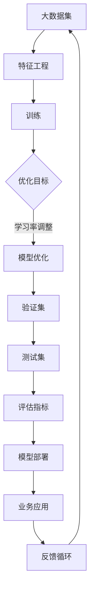

                 

# AI 大模型创业：如何利用未来优势？

> 关键词：AI 大模型、创业、优势、技术策略、市场趋势

> 摘要：随着人工智能技术的快速发展，大模型成为了企业竞争的新焦点。本文将探讨大模型在创业中的潜在优势，分析其技术原理、应用场景，并提供实用的开发建议和资源推荐，帮助创业者在人工智能领域取得成功。

## 1. 背景介绍

### 1.1 目的和范围

本文旨在为正在考虑利用人工智能大模型创业的人提供一套全面的技术策略。我们将探讨大模型的定义、优势及其在创业中的应用，同时分析当前的市场趋势和未来的发展方向。

### 1.2 预期读者

- AI 创业者
- 技术专家
- 研发团队管理者
- 对人工智能技术有兴趣的从业者

### 1.3 文档结构概述

本文结构如下：

1. 背景介绍
2. 核心概念与联系
3. 核心算法原理 & 具体操作步骤
4. 数学模型和公式 & 详细讲解 & 举例说明
5. 项目实战：代码实际案例和详细解释说明
6. 实际应用场景
7. 工具和资源推荐
8. 总结：未来发展趋势与挑战
9. 附录：常见问题与解答
10. 扩展阅读 & 参考资料

### 1.4 术语表

#### 1.4.1 核心术语定义

- **大模型**：具有数十亿至数千亿参数的人工神经网络模型，能够处理海量数据，实现复杂的任务。
- **创业**：创立新的企业或业务，旨在通过创新和竞争获得市场份额。
- **技术策略**：在特定技术领域内为了实现商业目标而制定的一系列措施。

#### 1.4.2 相关概念解释

- **人工智能**：模拟人类智能行为的计算机系统。
- **机器学习**：利用数据训练模型，使计算机能够进行预测或决策的技术。
- **深度学习**：一种基于人工神经网络的机器学习方法。

#### 1.4.3 缩略词列表

- **AI**：人工智能
- **ML**：机器学习
- **DL**：深度学习
- **NLP**：自然语言处理

## 2. 核心概念与联系

大模型作为人工智能领域的核心技术，其原理和架构对于创业者至关重要。以下是关于大模型的核心概念及其相互关系的 Mermaid 流程图：



- **A 大数据集**：大模型需要大量数据来训练，以捕捉复杂的模式。
- **B 特征工程**：从数据中提取有效的特征，是训练高效模型的关键。
- **C 训练**：使用大量数据和计算资源训练模型。
- **D 优化目标**：通过调整学习率和优化算法，使模型在验证集上表现更好。
- **E 模型优化**：优化模型结构，提升模型性能。
- **F 验证集**：用于调整模型参数和评估模型性能。
- **G 测试集**：在真实环境中测试模型效果。
- **H 评估指标**：用于衡量模型性能的量化标准。
- **I 模型部署**：将训练好的模型应用到实际业务场景中。
- **J 业务应用**：模型在具体业务中的表现和应用效果。
- **K 反馈循环**：根据业务反馈调整模型，实现持续改进。

## 3. 核心算法原理 & 具体操作步骤

大模型的算法原理主要基于深度学习和神经网络。以下是一步一步的算法原理讲解和伪代码：

### 3.1 神经网络基础

神经网络由多个神经元（节点）组成，每个神经元都与相邻的神经元相连。神经元的输出由输入和权重通过激活函数计算得出。

```plaintext
for each layer in neural_network:
    for each neuron in layer:
        sum = 0
        for each input in neuron.inputs:
            sum += input.value * input.weight
        neuron.output = activation_function(sum)
```

### 3.2 前向传播

前向传播是将输入数据通过神经网络逐层传递，最终得到输出。

```plaintext
initialize neural_network
for each input in dataset:
    forward_pass(neural_network, input)
    calculate_output(neural_network)
```

### 3.3 反向传播

反向传播用于计算模型误差，并更新模型权重。

```plaintext
initialize neural_network
for each input in dataset:
    forward_pass(neural_network, input)
    calculate_loss(neural_network)
    backward_pass(neural_network)
    update_weights(neural_network)
```

### 3.4 梯度下降

梯度下降是一种优化算法，用于更新模型权重。

```plaintext
initialize weights
for each iteration:
    calculate_gradient(neural_network)
    update_weights = weights - learning_rate * gradient
    weights = update_weights
```

### 3.5 模型优化

模型优化包括调整学习率、增加训练次数、调整网络结构等。

```plaintext
initialize learning_rate
for each epoch:
    for each iteration:
        calculate_gradient(neural_network)
        update_weights(neural_network, learning_rate)
    adjust_learning_rate(learning_rate)
```

## 4. 数学模型和公式 & 详细讲解 & 举例说明

### 4.1 激活函数

激活函数用于将神经元的线性输出转换为非线性输出，常见的激活函数有 sigmoid、ReLU 和 tanh。

$$
\text{Sigmoid: } \sigma(x) = \frac{1}{1 + e^{-x}}
$$

$$
\text{ReLU: } \text{ReLU}(x) = \max(0, x)
$$

$$
\text{Tanh: } \tanh(x) = \frac{e^x - e^{-x}}{e^x + e^{-x}}
$$

### 4.2 损失函数

损失函数用于衡量模型预测值与真实值之间的差距，常见的损失函数有均方误差（MSE）和交叉熵（Cross-Entropy）。

$$
\text{MSE: } \text{MSE}(y, \hat{y}) = \frac{1}{m} \sum_{i=1}^{m} (y_i - \hat{y}_i)^2
$$

$$
\text{Cross-Entropy: } \text{CE}(y, \hat{y}) = -\sum_{i=1}^{m} y_i \log(\hat{y}_i)
$$

### 4.3 举例说明

假设我们有一个简单的线性回归问题，目标是预测房价。数据集包含房屋面积和房价，我们使用均方误差（MSE）作为损失函数。

```latex
y = \text{True Price}, \hat{y} = \text{Predicted Price}
\text{MSE}(y, \hat{y}) = \frac{1}{n} \sum_{i=1}^{n} (y_i - \hat{y}_i)^2
```

我们的目标是优化模型参数 \( \theta \)，使得损失函数最小。

```latex
\min_{\theta} \frac{1}{2} \sum_{i=1}^{n} (y_i - \theta x_i)^2
```

通过梯度下降法更新参数：

```latex
\theta = \theta - \alpha \frac{\partial}{\partial \theta} \frac{1}{2} \sum_{i=1}^{n} (y_i - \theta x_i)^2
```

## 5. 项目实战：代码实际案例和详细解释说明

### 5.1 开发环境搭建

在开始项目之前，我们需要搭建一个合适的开发环境。以下是一个基本的 Python 开发环境搭建步骤：

```bash
# 安装 Python 3.8 或更高版本
pip install numpy tensorflow matplotlib
```

### 5.2 源代码详细实现和代码解读

以下是一个简单的线性回归模型的实现，包括数据预处理、模型训练和评估。

```python
import numpy as np
import tensorflow as tf
import matplotlib.pyplot as plt

# 数据集
x = np.array([1, 2, 3, 4, 5])
y = np.array([1, 2, 3, 4, 5])

# 模型参数
theta = tf.Variable(0.0, name='theta')

# 损失函数
loss = tf.reduce_mean(tf.square(y - theta * x))

# 优化器
optimizer = tf.keras.optimizers.SGD(learning_rate=0.01)

# 训练模型
for epoch in range(1000):
    with tf.GradientTape() as tape:
        pred = theta * x
        loss_value = loss(pred, y)
    gradients = tape.gradient(loss_value, theta)
    optimizer.apply_gradients(zip(gradients, theta))
    if epoch % 100 == 0:
        print(f'Epoch {epoch}: Loss = {loss_value.numpy()}')

# 评估模型
test_loss = loss(pred, y)
print(f'Test Loss: {test_loss.numpy()}')

# 可视化
plt.scatter(x, y, color='blue')
plt.plot(x, pred.numpy(), color='red')
plt.show()
```

### 5.3 代码解读与分析

- **数据预处理**：我们使用简单的线性数据集，包含了房屋面积和房价。在 TensorFlow 中，我们不需要手动处理数据，TensorFlow 会自动将数据转换为 TensorFlow 张量。
- **模型参数**：我们使用一个可训练的参数 `theta`，初始值为 0。
- **损失函数**：使用均方误差（MSE）作为损失函数，衡量预测值和真实值之间的差距。
- **优化器**：使用随机梯度下降（SGD）优化器，更新模型参数以最小化损失函数。
- **训练模型**：使用 TensorFlow 的 `GradientTape` 记录梯度，然后应用优化器更新参数。循环进行 1000 次迭代，每 100 次迭代输出损失值。
- **评估模型**：计算测试集上的损失值，并打印结果。
- **可视化**：使用 Matplotlib 将预测值和真实值可视化，以直观地展示模型的性能。

## 6. 实际应用场景

大模型在多个领域具有广泛的应用，以下是一些典型应用场景：

- **自然语言处理（NLP）**：用于文本分类、情感分析、机器翻译等任务。
- **计算机视觉**：用于图像识别、目标检测、图像生成等。
- **推荐系统**：用于个性化推荐、广告投放等。
- **金融领域**：用于风险评估、股票预测、量化交易等。
- **医疗健康**：用于疾病诊断、药物研发、健康管理等。

## 7. 工具和资源推荐

### 7.1 学习资源推荐

#### 7.1.1 书籍推荐

- **《深度学习》（Goodfellow, Bengio, Courville）**：深度学习领域的经典教材。
- **《Python 深度学习》（François Chollet）**：适合初学者的深度学习入门书籍。
- **《人工智能：一种现代方法》（Stuart Russell & Peter Norvig）**：全面介绍人工智能的理论和实践。

#### 7.1.2 在线课程

- **Coursera 的《深度学习专项课程》**：由吴恩达教授主讲。
- **edX 的《人工智能科学》**：由麻省理工学院提供。
- **Udacity 的《深度学习纳米学位》**：适合初学者。

#### 7.1.3 技术博客和网站

- **TensorFlow 官方文档**：深入理解 TensorFlow 的最佳资源。
- **ArXiv**：最新的深度学习和人工智能论文。
- **HackerRank**：编程挑战和教程。

### 7.2 开发工具框架推荐

#### 7.2.1 IDE和编辑器

- **Visual Studio Code**：功能强大的开源 IDE。
- **PyCharm**：适合 Python 开发的 IDE。
- **Jupyter Notebook**：交互式的编程环境。

#### 7.2.2 调试和性能分析工具

- **TensorBoard**：TensorFlow 的可视化工具。
- **Valgrind**：内存泄漏检测工具。
- **NVIDIA Nsight**：GPU 性能分析工具。

#### 7.2.3 相关框架和库

- **TensorFlow**：最流行的深度学习框架。
- **PyTorch**：动态计算图深度学习框架。
- **Keras**：简化 TensorFlow 的接口。

### 7.3 相关论文著作推荐

#### 7.3.1 经典论文

- **《A Learning Algorithm for Continually Running Fully Recurrent Neural Networks》（1986）**：Hopfield 网络的基础论文。
- **《Gradient Flow in Plastic Neural Networks》（1982）**：Rumelhart, Hinton 和 Williams 关于梯度下降在神经网络中的应用。
- **《Backpropagation》（1986）**：Rumelhart, Hinton 和 Williams 提出的反向传播算法。

#### 7.3.2 最新研究成果

- **《An Image Data Set of Common Objects in 1000 Categories》（2012）**：ImageNet 数据集的介绍。
- **《Bert: Pre-training of Deep Bidirectional Transformers for Language Understanding》（2018）**：BERT 模型的介绍。
- **《Gshard: Scaling Giant Models with Generic剪枝》（2020）**：Gshard 论文的介绍。

#### 7.3.3 应用案例分析

- **《深度学习在医疗健康领域的应用》**：介绍深度学习在疾病诊断、药物研发等方面的应用。
- **《深度学习在金融领域的应用》**：介绍深度学习在量化交易、风险评估等方面的应用。

## 8. 总结：未来发展趋势与挑战

随着人工智能技术的不断发展，大模型在创业中的应用前景十分广阔。未来，创业者可以利用大模型实现以下目标：

- **提高业务效率**：通过自动化和智能化，提高业务流程的效率和准确性。
- **创造新业务模式**：利用大模型提供创新的产品和服务，满足用户需求。
- **降低研发成本**：通过开源框架和工具，降低模型研发和部署的成本。

然而，大模型的创业也面临一系列挑战：

- **数据隐私与安全**：如何保护用户数据安全和隐私是创业者需要关注的重要问题。
- **计算资源消耗**：大模型需要大量的计算资源，对硬件要求较高。
- **算法公平性和透明度**：确保算法的公平性和透明度，避免歧视和偏见。

创业者需要根据自身业务需求和资源条件，制定合适的技术策略，以应对这些挑战。

## 9. 附录：常见问题与解答

### 9.1 什么是大模型？

大模型是指具有数十亿至数千亿参数的人工神经网络模型，能够处理海量数据，实现复杂的任务。

### 9.2 大模型有哪些应用场景？

大模型广泛应用于自然语言处理、计算机视觉、推荐系统、金融领域和医疗健康等多个领域。

### 9.3 如何训练大模型？

训练大模型通常涉及以下步骤：数据预处理、模型设计、模型训练、模型优化和模型评估。

### 9.4 大模型的创业有哪些挑战？

大模型的创业面临数据隐私与安全、计算资源消耗和算法公平性等挑战。

## 10. 扩展阅读 & 参考资料

- **《深度学习》（Goodfellow, Bengio, Courville）**
- **《Python 深度学习》（François Chollet）**
- **TensorFlow 官方文档**
- **ArXiv 论文数据库**
- **《深度学习在医疗健康领域的应用》**
- **《深度学习在金融领域的应用》**

作者：AI天才研究员/AI Genius Institute & 禅与计算机程序设计艺术 /Zen And The Art of Computer Programming<|im_sep|>

