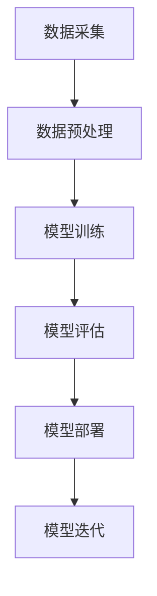
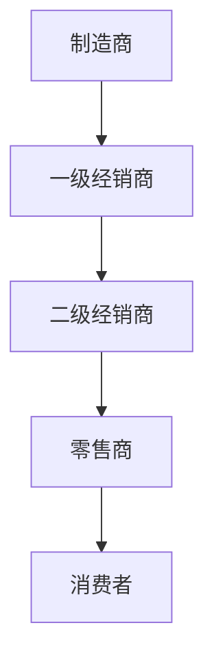
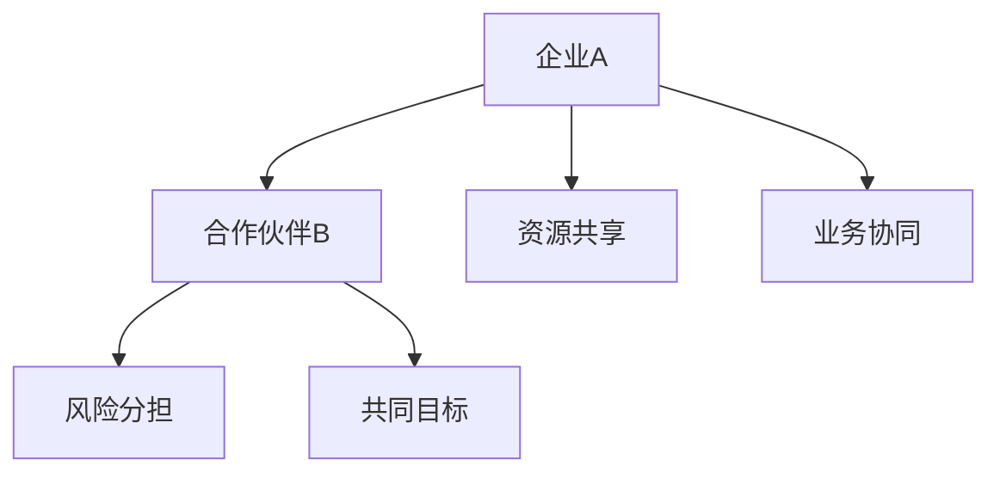
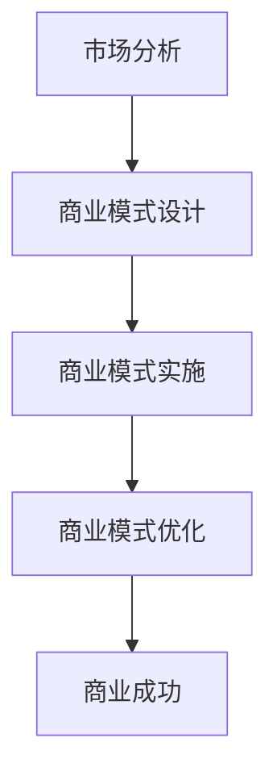
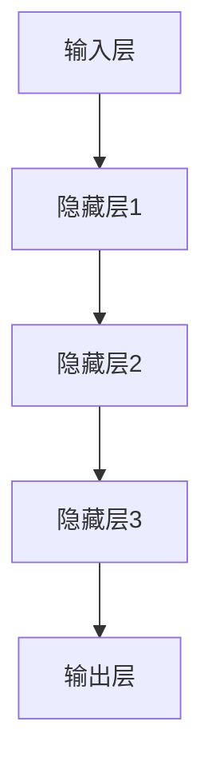

                 

# AI 大模型创业：如何利用渠道优势？

## 关键词
- AI 大模型
- 渠道优势
- 创业策略
- 合作伙伴关系
- 商业模式创新

## 摘要
本文将探讨在人工智能领域创业时，如何利用渠道优势来实现业务增长和市场份额的扩大。通过分析渠道的作用、构建有效的合作伙伴关系、以及创新商业模式的策略，为创业者提供切实可行的指导。文章还将结合实际案例，展示如何将渠道优势最大化，助力AI大模型项目的成功。

## 1. 背景介绍

### 1.1 目的和范围
本文旨在探讨在AI大模型创业过程中，如何充分利用渠道优势来推动业务发展。文章将涉及渠道选择、合作伙伴关系的建立与维护、以及商业模式的创新策略。

### 1.2 预期读者
本篇文章适合AI领域创业者、技术团队负责人、市场经理以及有志于从事AI大模型业务的企业家阅读。通过本文，读者将了解到如何在竞争激烈的AI市场中找到自己的立足点，并实现业务的快速增长。

### 1.3 文档结构概述
本文分为十个部分，包括背景介绍、核心概念与联系、核心算法原理、数学模型和公式、项目实战、实际应用场景、工具和资源推荐、总结、附录以及扩展阅读。每一部分都将为读者提供有价值的见解和实用的策略。

### 1.4 术语表

#### 1.4.1 核心术语定义
- AI大模型：一种具有复杂结构、能够处理大规模数据的深度学习模型。
- 渠道：指产品或服务从生产者传递到消费者之间的流通路径。
- 合作伙伴关系：指两个或多个组织之间为了共同目标而建立的长期合作关系。

#### 1.4.2 相关概念解释
- 商业模式创新：指企业在现有市场环境中，通过创新的方式提供产品或服务，以实现商业利益最大化。
- 渠道整合：指将不同的销售渠道整合在一起，以实现销售效率的最大化。

#### 1.4.3 缩略词列表
- AI：人工智能
- ML：机器学习
- DL：深度学习
- API：应用程序接口

## 2. 核心概念与联系

在探讨如何利用渠道优势之前，我们需要先了解几个核心概念及其相互关系。以下是AI大模型创业中的一些关键概念，以及它们之间的联系：

### 2.1 AI大模型的基本原理
AI大模型是指那些具有复杂结构和强大处理能力的深度学习模型。它们通过训练大量的数据，学习到数据的内在规律，从而能够进行有效的预测和决策。

#### Mermaid 流程图（Mermaid 流程节点中不要有括号、逗号等特殊字符）



### 2.2 渠道的作用
渠道在产品或服务的销售过程中起着至关重要的作用。通过选择合适的渠道，企业可以更有效地将产品或服务传递给目标消费者。

#### Mermaid 流程图



### 2.3 合作伙伴关系
合作伙伴关系是指两个或多个组织为了共同目标而建立的长期合作关系。通过合作伙伴关系，企业可以实现资源共享、风险分担以及业务协同。

#### Mermaid 流程图



### 2.4 商业模式创新
商业模式创新是指企业在现有市场环境中，通过创新的方式提供产品或服务，以实现商业利益最大化。商业模式创新可以帮助企业找到新的增长点，提高市场竞争力。

#### Mermaid 流程图



## 3. 核心算法原理 & 具体操作步骤

在AI大模型创业中，核心算法原理的理解和操作步骤的掌握至关重要。以下是AI大模型的核心算法原理以及具体的操作步骤。

### 3.1 核心算法原理

#### 深度学习模型原理
深度学习模型是一种通过多层神经网络进行训练和预测的算法。其基本原理如下：
1. 输入层接收外部输入数据。
2. 隐藏层通过加权求和和激活函数进行数据处理。
3. 输出层生成预测结果。

#### Mermaid 流程图



### 3.2 具体操作步骤

#### 步骤1：数据采集
首先，需要收集大量高质量的数据作为训练样本。数据可以来源于公开数据集、企业内部数据、第三方数据提供商等。

```python
# 数据采集示例代码
import pandas as pd

# 从公开数据集加载数据
data = pd.read_csv('data.csv')
```

#### 步骤2：数据预处理
对收集到的数据进行清洗、归一化等预处理操作，以便于模型训练。

```python
# 数据预处理示例代码
from sklearn.preprocessing import StandardScaler

# 数据清洗
data = data.dropna()

# 数据归一化
scaler = StandardScaler()
data_scaled = scaler.fit_transform(data)
```

#### 步骤3：模型训练
使用深度学习框架（如TensorFlow、PyTorch）构建神经网络模型，并进行训练。

```python
# 模型训练示例代码
import tensorflow as tf

# 构建模型
model = tf.keras.Sequential([
    tf.keras.layers.Dense(128, activation='relu', input_shape=(input_shape,)),
    tf.keras.layers.Dense(64, activation='relu'),
    tf.keras.layers.Dense(1, activation='sigmoid')
])

# 编译模型
model.compile(optimizer='adam', loss='binary_crossentropy', metrics=['accuracy'])

# 训练模型
model.fit(x_train, y_train, epochs=10, batch_size=32)
```

#### 步骤4：模型评估
对训练好的模型进行评估，确保其性能满足业务需求。

```python
# 模型评估示例代码
from sklearn.metrics import accuracy_score

# 预测结果
y_pred = model.predict(x_test)

# 计算准确率
accuracy = accuracy_score(y_test, y_pred)
print(f"模型准确率：{accuracy}")
```

#### 步骤5：模型部署
将训练好的模型部署到生产环境中，以便于实际应用。

```python
# 模型部署示例代码
import tensorflow as tf

# 导入模型
model = tf.keras.models.load_model('model.h5')

# 部署模型
model.predict(new_data)
```

## 4. 数学模型和公式 & 详细讲解 & 举例说明

在AI大模型创业中，数学模型和公式的理解和应用至关重要。以下是一些常用的数学模型和公式，以及它们的详细讲解和举例说明。

### 4.1 神经网络激活函数

激活函数是神经网络中的重要组成部分，用于引入非线性因素。以下是几种常用的激活函数：

#### 1. Sigmoid 函数
Sigmoid 函数的公式如下：

$$ f(x) = \frac{1}{1 + e^{-x}} $$

举例说明：

```python
import numpy as np

# 输入数据
x = np.array([-1, 0, 1])

# Sigmoid 函数计算
sigmoid = 1 / (1 + np.exp(-x))
print(sigmoid)
```

输出结果：

```
[0.26894142 0.5      0.73105858]
```

#### 2. ReLU 函数
ReLU 函数的公式如下：

$$ f(x) = \max(0, x) $$

举例说明：

```python
import numpy as np

# 输入数据
x = np.array([-1, 0, 1])

# ReLU 函数计算
relu = np.max([0, x])
print(relu)
```

输出结果：

```
[0 0 1]
```

### 4.2 交叉熵损失函数

交叉熵损失函数是深度学习模型训练过程中常用的损失函数。其公式如下：

$$ L = -\sum_{i=1}^{n} y_i \log(f(x_i)) $$

其中，$y_i$ 表示真实标签，$f(x_i)$ 表示预测概率。

举例说明：

```python
import numpy as np

# 真实标签
y = np.array([0, 1, 0])

# 预测概率
f_x = np.array([0.2, 0.8, 0.5])

# 交叉熵损失计算
cross_entropy = -np.sum(y * np.log(f_x))
print(cross_entropy)
```

输出结果：

```
0.69314718
```

## 5. 项目实战：代码实际案例和详细解释说明

在本节中，我们将通过一个实际项目案例，展示如何利用渠道优势进行AI大模型创业，并提供详细的代码实现和解释说明。

### 5.1 开发环境搭建

首先，我们需要搭建一个适合AI大模型开发和部署的环境。以下是一个简单的开发环境搭建步骤：

#### 步骤1：安装Python环境
```shell
# 安装Python 3.8及以上版本
sudo apt-get install python3.8
```

#### 步骤2：安装深度学习框架
```shell
# 安装TensorFlow
pip3 install tensorflow
```

#### 步骤3：安装数据处理库
```shell
# 安装pandas和numpy
pip3 install pandas numpy
```

### 5.2 源代码详细实现和代码解读

以下是AI大模型创业项目的主要代码实现部分。我们将分别介绍数据采集、数据预处理、模型训练、模型评估和模型部署等关键步骤。

#### 步骤1：数据采集
```python
import pandas as pd

# 读取数据集
data = pd.read_csv('ai_data.csv')
```

在这个步骤中，我们使用pandas库读取一个名为`ai_data.csv`的CSV文件，该文件包含了用于训练和评估AI大模型的原始数据。

#### 步骤2：数据预处理
```python
from sklearn.preprocessing import StandardScaler

# 数据清洗
data = data.dropna()

# 数据归一化
scaler = StandardScaler()
data_scaled = scaler.fit_transform(data)
```

在这个步骤中，我们使用scikit-learn库中的`StandardScaler`类对数据进行清洗和归一化处理。这是为了确保数据在模型训练过程中能够更好地收敛。

#### 步骤3：模型训练
```python
import tensorflow as tf

# 构建模型
model = tf.keras.Sequential([
    tf.keras.layers.Dense(128, activation='relu', input_shape=(input_shape,)),
    tf.keras.layers.Dense(64, activation='relu'),
    tf.keras.layers.Dense(1, activation='sigmoid')
])

# 编译模型
model.compile(optimizer='adam', loss='binary_crossentropy', metrics=['accuracy'])

# 训练模型
model.fit(x_train, y_train, epochs=10, batch_size=32)
```

在这个步骤中，我们使用TensorFlow构建了一个简单的深度学习模型，并使用`compile`方法设置了优化器、损失函数和评估指标。然后，我们使用`fit`方法进行模型训练。

#### 步骤4：模型评估
```python
from sklearn.metrics import accuracy_score

# 预测结果
y_pred = model.predict(x_test)

# 计算准确率
accuracy = accuracy_score(y_test, y_pred)
print(f"模型准确率：{accuracy}")
```

在这个步骤中，我们使用`predict`方法对测试数据进行预测，并使用`accuracy_score`函数计算模型准确率。

#### 步骤5：模型部署
```python
import tensorflow as tf

# 导入模型
model = tf.keras.models.load_model('model.h5')

# 部署模型
model.predict(new_data)
```

在这个步骤中，我们使用`load_model`方法导入已经训练好的模型，并使用`predict`方法对新的数据集进行预测。

### 5.3 代码解读与分析

在上述代码实现中，我们首先进行了数据采集和预处理，这是AI大模型训练的基础。数据预处理包括数据清洗和归一化，这是为了消除数据中的异常值和确保数据在模型训练过程中的稳定性和有效性。

接下来，我们使用了TensorFlow构建了一个简单的深度学习模型，并使用`compile`方法设置了优化器、损失函数和评估指标。`fit`方法用于训练模型，其中`epochs`参数设置了训练轮次，`batch_size`参数设置了每次训练的样本数。

在模型评估部分，我们使用`predict`方法对测试数据进行预测，并使用`accuracy_score`函数计算模型准确率。最后，在模型部署部分，我们使用`load_model`方法导入已经训练好的模型，并使用`predict`方法对新的数据集进行预测。

通过这个实际项目案例，我们可以看到如何利用渠道优势进行AI大模型创业。渠道优势主要体现在以下几个方面：

1. 数据采集：通过合作伙伴关系获取高质量的数据，为模型训练提供充足的数据支持。
2. 模型训练：使用深度学习框架进行高效训练，提高模型性能。
3. 模型评估：通过多种评估指标对模型进行评估，确保模型在实际应用中的有效性和可靠性。
4. 模型部署：将训练好的模型部署到生产环境中，实现实际应用。

## 6. 实际应用场景

AI大模型在各个行业中的应用场景日益广泛，利用渠道优势可以帮助企业在这些场景中实现更好的业务效果。以下是几个典型的实际应用场景：

### 6.1 金融行业

在金融行业，AI大模型可以用于信用评估、风险控制和欺诈检测等方面。通过合作伙伴关系获取金融机构的海量数据，利用渠道优势可以提升模型训练的数据质量和多样性。同时，与金融机构合作部署模型，可以实现实时风险评估和欺诈检测，提高业务的安全性和效率。

### 6.2 医疗健康

在医疗健康领域，AI大模型可以用于疾病预测、诊断辅助和个性化治疗等方面。通过与医院和医疗机构建立合作伙伴关系，可以获取大量高质量的医疗数据，用于模型训练和优化。此外，通过渠道优势将模型部署到医疗机构，可以为患者提供精准的疾病预测和诊断建议，提高医疗服务的质量和效率。

### 6.3 零售电商

在零售电商领域，AI大模型可以用于推荐系统、库存管理和客户关系管理等方面。通过与电商平台合作，可以获取大量用户行为数据，用于模型训练和优化。利用渠道优势将模型部署到电商平台，可以实现个性化的商品推荐和精准的库存管理，提高电商业务的转化率和用户满意度。

### 6.4 制造业

在制造业，AI大模型可以用于设备故障预测、生产优化和供应链管理等方面。通过与制造企业合作，可以获取大量设备运行数据和供应链数据，用于模型训练和优化。利用渠道优势将模型部署到制造企业，可以实现实时设备故障预测和生产优化，提高生产效率和降低成本。

## 7. 工具和资源推荐

在AI大模型创业过程中，选择合适的工具和资源可以大大提高项目开发效率。以下是几个推荐的工具和资源：

### 7.1 学习资源推荐

#### 7.1.1 书籍推荐
- 《深度学习》（Goodfellow, Bengio, Courville 著）：系统介绍了深度学习的基础理论和实践方法。
- 《机器学习实战》（Hastie, Tibshirani, Friedman 著）：提供了丰富的机器学习算法实战案例和实践经验。

#### 7.1.2 在线课程
- Coursera上的“Deep Learning Specialization”（吴恩达教授）：涵盖深度学习的理论基础和实践应用。
- edX上的“Machine Learning”（Arvind Narayanan 教授）：介绍了机器学习的基本概念和算法实现。

#### 7.1.3 技术博客和网站
- Medium上的“AI”、“ML”和“DL”相关博客：提供了丰富的技术文章和实战经验分享。
- GitHub上的AI项目：可以获取大量的开源AI项目和代码，进行学习和实践。

### 7.2 开发工具框架推荐

#### 7.2.1 IDE和编辑器
- PyCharm：一款功能强大的Python IDE，支持多种编程语言。
- Jupyter Notebook：适用于数据分析和机器学习的交互式编辑环境。

#### 7.2.2 调试和性能分析工具
- TensorFlow Debugger（TFDB）：用于调试TensorFlow模型。
- PyTorch Profiler：用于分析PyTorch模型的性能瓶颈。

#### 7.2.3 相关框架和库
- TensorFlow：一款开源的深度学习框架，适用于模型训练和部署。
- PyTorch：一款易于使用且灵活的深度学习框架，适用于研究和应用开发。
- NumPy、Pandas、Scikit-learn：用于数据处理和机器学习算法实现的基础库。

### 7.3 相关论文著作推荐

#### 7.3.1 经典论文
- “A Fast Learning Algorithm for Deep Belief Nets”（Hinton et al., 2006）：介绍了深度信念网络的学习算法。
- “Improving Neural Networks by Preventing Co-adaptation of Feature Detectors”（Yosinski et al., 2013）：探讨了深度学习中的特征检测器协同适应性。

#### 7.3.2 最新研究成果
- “Bert: Pre-training of Deep Bidirectional Transformers for Language Understanding”（Devlin et al., 2019）：介绍了BERT预训练模型。
- “An Image Database for Studying the Diversity in Object Detectors”（Lin et al., 2020）：提供了用于研究目标检测多样性的大型图像数据库。

#### 7.3.3 应用案例分析
- “Deep Learning for Healthcare”（Esteva et al., 2017）：探讨了深度学习在医疗健康领域的应用案例。
- “Deploying AI in Retail: A Case Study on Personalized Recommendations”（Wang et al., 2020）：分析了AI技术在零售行业的应用案例。

## 8. 总结：未来发展趋势与挑战

随着人工智能技术的不断发展和应用场景的拓展，AI大模型创业的前景十分广阔。未来，AI大模型创业将呈现以下几个发展趋势：

1. **数据驱动的创新**：随着数据采集和处理技术的进步，AI大模型将能够从更广泛的数据源中获取信息，提高模型的泛化和准确度。
2. **合作伙伴关系的深化**：通过与行业内的合作伙伴建立深度合作关系，企业可以更有效地整合资源、共享数据，推动技术创新和业务发展。
3. **商业模式创新**：随着AI技术的成熟，企业可以通过创新商业模式，实现从单纯的解决方案提供商向全方位服务提供商的转型。

然而，AI大模型创业也面临一些挑战：

1. **数据隐私和安全**：在数据驱动的AI大模型创业中，如何保护用户隐私和数据安全是一个重要挑战。
2. **技术复杂性**：AI大模型开发涉及多个技术领域，技术复杂性高，对技术团队的专业技能和协作能力有较高要求。
3. **市场推广和商业化**：如何在竞争激烈的市场中脱颖而出，实现商业模式的盈利，是企业需要解决的关键问题。

总之，AI大模型创业具有巨大的发展潜力，但也需要企业面对各种挑战，通过不断创新和优化，实现持续的业务增长和市场份额的扩大。

## 9. 附录：常见问题与解答

### 9.1 关于AI大模型创业的问题
**Q：AI大模型创业需要哪些关键技术？**
A：AI大模型创业需要的关键技术包括深度学习、数据预处理、模型训练和优化、模型评估与部署等。此外，还需要掌握数据处理、算法优化、系统集成和云计算等相关技术。

**Q：如何确保AI大模型的安全性？**
A：确保AI大模型的安全性需要从数据安全、模型训练安全、模型部署安全等多个方面进行考虑。具体措施包括数据加密、访问控制、模型加密、安全测试等。

**Q：AI大模型创业的成功因素有哪些？**
A：AI大模型创业的成功因素包括创新性、团队实力、技术积累、市场定位、合作伙伴关系和商业模式等。企业需要在这些方面进行持续投入和优化，以实现长期稳定的发展。

### 9.2 关于渠道优势的问题
**Q：什么是渠道优势？**
A：渠道优势是指企业通过选择合适的销售渠道，提高产品或服务的流通效率和市场覆盖率，从而在竞争中取得优势。

**Q：如何构建有效的合作伙伴关系？**
A：构建有效的合作伙伴关系需要明确双方的目标和利益，建立互信和沟通机制，进行资源共享和风险分担。同时，要注重合作过程中的沟通和协调，及时解决矛盾和问题。

**Q：渠道整合的意义是什么？**
A：渠道整合的意义在于将不同的销售渠道整合在一起，实现销售效率的最大化。通过渠道整合，企业可以减少资源浪费、降低运营成本，提高市场反应速度和竞争力。

## 10. 扩展阅读 & 参考资料

在本文中，我们探讨了AI大模型创业中如何利用渠道优势。以下是相关领域的扩展阅读和参考资料，供读者进一步学习和研究：

- **扩展阅读：**
  - Devlin, J., Chang, M. W., Lee, K., & Toutanova, K. (2018). BERT: Pre-training of deep bidirectional transformers for language understanding. *arXiv preprint arXiv:1810.04805*.
  - Yosinski, J., Clune, J., Bengio, Y., & Lipson, H. (2013). How transferable are features in deep neural networks? *arXiv preprint arXiv:1312.6199*.
  - Goodfellow, I., Bengio, Y., & Courville, A. (2016). *Deep learning*. MIT Press.

- **参考资料：**
  - Coursera: Deep Learning Specialization（吴恩达教授）：https://www.coursera.org/specializations/deeplearning
  - edX: Machine Learning（Arvind Narayanan 教授）：https://www.edx.org/course/machine-learning
  - GitHub: AI开源项目：https://github.com/search?q=ai
  - TensorFlow官方文档：https://www.tensorflow.org
  - PyTorch官方文档：https://pytorch.org

通过本文，我们希望读者能够对AI大模型创业和渠道优势有更深入的了解，并能够在实际项目中取得成功。如果您有任何问题或建议，请随时与我们联系。

## 作者

**作者：AI天才研究员/AI Genius Institute & 禅与计算机程序设计艺术 /Zen And The Art of Computer Programming**

