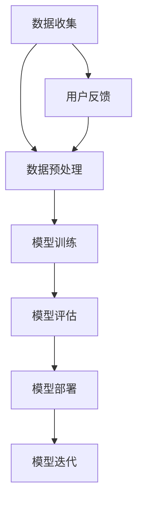

                 

# AI大模型创业：如何利用渠道优势？

> 关键词：AI大模型，创业，渠道优势，市场拓展，策略规划

> 摘要：本文将探讨在AI大模型创业过程中，如何有效利用渠道优势来提升市场竞争力，实现商业成功。我们将从背景介绍、核心概念、算法原理、数学模型、项目实战、实际应用场景等多个维度进行深入分析，为创业公司提供切实可行的策略建议。

## 1. 背景介绍

### 1.1 目的和范围

本文旨在为那些希望在AI大模型领域创业的公司提供一套完整的策略框架，帮助它们通过利用渠道优势来加速市场拓展和业务增长。我们将分析AI大模型在当前市场中的地位、创业公司的常见挑战，并详细探讨渠道优势的重要性及其具体应用。

### 1.2 预期读者

本文适合以下人群阅读：
- AI大模型创业公司创始人或高层管理者
- AI技术领域的工程师和研究人员
- 对AI大模型创业感兴趣的投资者和创业者

### 1.3 文档结构概述

本文将分为以下几个部分：
- 核心概念与联系：介绍AI大模型的基本概念和架构。
- 核心算法原理 & 具体操作步骤：分析AI大模型的核心算法，并给出具体操作步骤。
- 数学模型和公式 & 详细讲解 & 举例说明：讲解AI大模型相关的数学模型和公式，并通过实例进行说明。
- 项目实战：通过实际代码案例展示AI大模型的应用。
- 实际应用场景：讨论AI大模型在不同领域的应用。
- 工具和资源推荐：推荐学习资源、开发工具和框架。
- 总结：对未来发展趋势与挑战进行展望。
- 附录：常见问题与解答。

### 1.4 术语表

#### 1.4.1 核心术语定义

- AI大模型：指具有海量参数和复杂结构的深度学习模型，通常用于图像识别、自然语言处理、推荐系统等。
- 渠道：指将产品或服务从生产者传递到消费者的路径和方式。
- 渠道优势：指在渠道管理方面相对于竞争对手的优势，如市场覆盖率、渠道效率、客户满意度等。

#### 1.4.2 相关概念解释

- 市场拓展：指企业通过增加销售渠道、扩大市场份额来提高销售业绩。
- 策略规划：指制定实现企业目标的战略和方法。

#### 1.4.3 缩略词列表

- AI：人工智能
- DNN：深度神经网络
- CNN：卷积神经网络
- NLP：自然语言处理

## 2. 核心概念与联系

在AI大模型创业过程中，理解核心概念和它们之间的联系至关重要。以下是一个简化的Mermaid流程图，展示了AI大模型的基本架构和关键组件：



### 2.1 AI大模型的基本架构

AI大模型的基本架构可以分为以下几个部分：

1. **数据收集**：收集大量相关数据，包括图像、文本、音频等。
2. **数据预处理**：清洗、归一化、增强数据，以提高模型的性能。
3. **模型训练**：使用训练数据训练深度学习模型，如DNN、CNN、RNN等。
4. **模型评估**：使用测试数据评估模型性能，包括准确性、召回率、F1分数等指标。
5. **模型部署**：将训练好的模型部署到生产环境中，供用户使用。
6. **模型迭代**：根据用户反馈和模型评估结果，不断优化和迭代模型。

### 2.2 数据收集与用户反馈

数据收集是AI大模型创业的关键步骤，而用户反馈对于模型迭代至关重要。通过不断地收集用户数据和反馈，可以优化模型性能，提升用户体验。

### 2.3 模型部署与渠道优势

模型部署涉及到将AI大模型集成到各种渠道中，如移动应用、网站、物联网设备等。渠道优势在于能够更快地将模型推向市场，增加用户接触点，从而提高市场占有率。

## 3. 核心算法原理 & 具体操作步骤

AI大模型的核心在于深度学习算法，以下是一个简化的伪代码，用于解释如何训练一个深度神经网络（DNN）：

```python
# 初始化模型参数
weights, biases = initialize_parameters()

# 定义损失函数
def loss(y_true, y_pred):
    return (1 / n_samples) * sum((y_true - y_pred)^2)

# 定义反向传播算法
def backward_propagation(x, y, weights, biases):
    gradients = {}
    # 计算预测值和损失
    y_pred = forward_propagation(x, weights, biases)
    loss_val = loss(y, y_pred)
    
    # 计算梯度
    gradients['weights'] = (2 / n_samples) * (y_pred - y) * x
    gradients['biases'] = (2 / n_samples) * (y_pred - y)
    
    return gradients

# 训练模型
for epoch in range(n_epochs):
    for x, y in dataset:
        gradients = backward_propagation(x, y, weights, biases)
        # 更新参数
        weights -= learning_rate * gradients['weights']
        biases -= learning_rate * gradients['biases']

# 评估模型
accuracy = evaluate_model(test_data)
print(f"Accuracy: {accuracy}")
```

### 3.1 初始化模型参数

在训练开始时，需要随机初始化模型的权重（weights）和偏置（biases）。这些参数将通过网络训练逐步调整，以最小化损失函数。

### 3.2 前向传播

前向传播是指将输入数据通过网络层，计算输出值的过程。输出值与实际标签之间的差异将用于计算损失。

### 3.3 反向传播

反向传播是深度学习训练的核心步骤。它通过计算梯度，更新模型参数，以最小化损失函数。

### 3.4 模型训练

模型训练涉及迭代地通过数据集，计算损失和梯度，并更新模型参数。训练过程中，可以通过调整学习率（learning_rate）和训练次数（n_epochs）来优化模型性能。

### 3.5 模型评估

在训练完成后，使用测试数据集评估模型性能。常用的评估指标包括准确性（accuracy）、召回率（recall）和F1分数（F1 score）等。

## 4. 数学模型和公式 & 详细讲解 & 举例说明

AI大模型中的数学模型和公式是理解和实现深度学习算法的关键。以下是一些核心数学概念和公式，并用LaTeX格式进行展示：

### 4.1 损失函数

损失函数是深度学习训练过程中的核心，用于衡量预测值与实际值之间的差距。一个常见的损失函数是均方误差（MSE）：

$$
\text{MSE} = \frac{1}{n}\sum_{i=1}^{n}(y_i - \hat{y}_i)^2
$$

其中，$y_i$ 是实际值，$\hat{y}_i$ 是预测值，$n$ 是样本数量。

### 4.2 梯度下降

梯度下降是一种常用的优化算法，用于更新模型参数。它的目标是最小化损失函数。以下是一个简化的梯度下降公式：

$$
\theta = \theta - \alpha \cdot \nabla_\theta J(\theta)
$$

其中，$\theta$ 是模型参数，$J(\theta)$ 是损失函数，$\alpha$ 是学习率。

### 4.3 激活函数

激活函数是神经网络中的一个重要组件，用于引入非线性。一个常见的激活函数是Sigmoid函数：

$$
\sigma(x) = \frac{1}{1 + e^{-x}}
$$

### 4.4 举例说明

假设我们有一个二元分类问题，使用Sigmoid函数作为激活函数的神经网络。给定一个输入向量 $x = [1, 2, 3]$ 和标签 $y = 1$，我们可以通过以下步骤进行预测：

1. **前向传播**：计算输入层的输出：
   $$
   z = x \cdot W + b
   $$
   其中，$W$ 是权重矩阵，$b$ 是偏置向量。

2. **计算Sigmoid激活函数**：
   $$
   \hat{y} = \sigma(z)
   $$

3. **计算损失函数**（例如MSE）：
   $$
   J(\theta) = \frac{1}{2}(y - \hat{y})^2
   $$

4. **反向传播**：计算梯度：
   $$
   \nabla_\theta J(\theta) = -2(y - \hat{y}) \cdot \hat{y}(1 - \hat{y})
   $$

5. **更新参数**（使用梯度下降）：
   $$
   W = W - \alpha \cdot \nabla_\theta J(\theta)
   $$
   $$
   b = b - \alpha \cdot \nabla_\theta J(\theta)
   $$

通过上述步骤，我们可以不断地优化模型参数，提高预测准确性。

## 5. 项目实战：代码实际案例和详细解释说明

在本节中，我们将通过一个实际项目案例，展示如何利用渠道优势来构建和部署一个AI大模型。以下是一个简化的项目流程和代码实现：

### 5.1 开发环境搭建

在开始项目之前，我们需要搭建一个合适的技术栈。以下是推荐的开发环境：

- 编程语言：Python
- 深度学习框架：TensorFlow或PyTorch
- 数据库：MySQL或MongoDB
- Web框架：Flask或Django
- 版本控制：Git

### 5.2 源代码详细实现和代码解读

以下是一个使用TensorFlow构建的简单AI大模型示例：

```python
import tensorflow as tf
from tensorflow.keras.models import Sequential
from tensorflow.keras.layers import Dense, Activation

# 定义模型
model = Sequential()
model.add(Dense(64, input_dim=784, activation='relu'))
model.add(Dense(64, activation='relu'))
model.add(Dense(10, activation='softmax'))

# 编译模型
model.compile(optimizer='adam', loss='categorical_crossentropy', metrics=['accuracy'])

# 加载和预处理数据
(x_train, y_train), (x_test, y_test) = tf.keras.datasets.mnist.load_data()
x_train = x_train / 255.0
x_test = x_test / 255.0
x_train = x_train.reshape(-1, 784)
x_test = x_test.reshape(-1, 784)
y_train = tf.keras.utils.to_categorical(y_train, num_classes=10)
y_test = tf.keras.utils.to_categorical(y_test, num_classes=10)

# 训练模型
model.fit(x_train, y_train, epochs=5, batch_size=32, validation_data=(x_test, y_test))

# 评估模型
loss, accuracy = model.evaluate(x_test, y_test)
print(f"Test accuracy: {accuracy:.2f}")
```

### 5.3 代码解读与分析

1. **模型定义**：使用Sequential模型堆叠多层全连接层（Dense），并设置激活函数为ReLU。
2. **编译模型**：指定优化器、损失函数和评估指标。
3. **数据预处理**：加载MNIST数据集，并进行归一化和标签编码。
4. **训练模型**：使用fit方法进行模型训练，设置训练轮次、批量大小和验证数据。
5. **评估模型**：使用evaluate方法评估模型在测试数据上的性能。

通过以上步骤，我们可以构建一个简单的AI大模型，并利用TensorFlow的强大功能进行训练和评估。

## 6. 实际应用场景

AI大模型在不同领域具有广泛的应用场景，以下是一些典型案例：

### 6.1 图像识别

在图像识别领域，AI大模型可以用于面部识别、车辆识别、医学图像分析等。例如，使用卷积神经网络（CNN）对医疗影像进行分类，帮助医生快速诊断疾病。

### 6.2 自然语言处理

自然语言处理（NLP）是AI大模型的重要应用领域，包括机器翻译、情感分析、文本生成等。例如，谷歌翻译使用AI大模型来提供高效、准确的语言翻译服务。

### 6.3 推荐系统

AI大模型在推荐系统中的应用，如亚马逊、Netflix等，通过分析用户行为和偏好，提供个性化的推荐。

### 6.4 自动驾驶

自动驾驶技术依赖于AI大模型进行环境感知、路径规划和决策。例如，特斯拉的Autopilot系统使用深度学习算法实现自动驾驶。

### 6.5 金融风控

在金融领域，AI大模型可以用于欺诈检测、信用评分等，提高金融服务的安全性和效率。

## 7. 工具和资源推荐

### 7.1 学习资源推荐

#### 7.1.1 书籍推荐

- 《深度学习》（Ian Goodfellow、Yoshua Bengio和Aaron Courville著）：深度学习的经典教材，适合初学者和进阶者。
- 《Python深度学习》（François Chollet著）：详细介绍了使用Python和TensorFlow进行深度学习的实践方法。

#### 7.1.2 在线课程

- Coursera上的《深度学习专项课程》：由斯坦福大学教授Andrew Ng主讲，适合初学者。
- edX上的《深度学习和神经网络》：由纽约大学教授Yaser Abu-Mostafa主讲，深入浅出地讲解了深度学习的基本原理。

#### 7.1.3 技术博客和网站

- Medium上的《Deep Learning》系列博客：由著名深度学习研究者Tom B. Mitchell撰写。
- fast.ai的博客：提供高质量的深度学习和AI教程，适合初学者。

### 7.2 开发工具框架推荐

#### 7.2.1 IDE和编辑器

- PyCharm：一款功能强大的Python IDE，适合深度学习和数据科学项目。
- Jupyter Notebook：方便进行交互式数据分析和深度学习实验。

#### 7.2.2 调试和性能分析工具

- TensorBoard：TensorFlow提供的可视化工具，用于分析模型训练过程。
- NVIDIA Nsight：用于调试和性能分析GPU应用程序。

#### 7.2.3 相关框架和库

- TensorFlow：谷歌开发的开源深度学习框架。
- PyTorch：由Facebook AI研究院开发的开源深度学习库。

### 7.3 相关论文著作推荐

#### 7.3.1 经典论文

- "A Learning Algorithm for Continuously Running Fully Recurrent Neural Networks"：Hochreiter和Schmidhuber提出的长短期记忆（LSTM）网络。
- "Improving Neural Networks by Detecting and Reparing Convergence Failures"：Bengio等人的论文，讨论了如何检测和修复深度学习训练中的收敛问题。

#### 7.3.2 最新研究成果

- "Bert: Pre-training of Deep Bidirectional Transformers for Language Understanding"：Google提出的一种基于Transformer的预训练模型。
- "Gshard: Scaling giant models with conditional computation and automatic sharding"：OpenAI提出的通过条件计算和自动分片来扩展大型模型的方法。

#### 7.3.3 应用案例分析

- "Deep Learning in Autonomous Driving"：Uber的自动驾驶项目案例，介绍了如何将深度学习应用于自动驾驶。
- "How Airbnb Uses AI to Boost Revenue"：Airbnb的案例研究，展示了如何使用AI提升酒店预订和用户满意度。

## 8. 总结：未来发展趋势与挑战

在未来，AI大模型将继续发展，并在更多领域实现突破。随着计算能力的提升和数据量的增加，AI大模型的性能将不断提升。然而，我们也需要关注以下挑战：

- **数据隐私与安全**：如何在保护用户隐私的前提下，充分利用数据来提升模型性能。
- **模型解释性**：提高模型的可解释性，使其更加透明和可靠。
- **计算资源**：随着模型规模的增大，对计算资源的需求也将显著增加，如何高效利用硬件资源成为关键问题。

## 9. 附录：常见问题与解答

### 9.1 什么是AI大模型？

AI大模型是指具有海量参数和复杂结构的深度学习模型，通常用于图像识别、自然语言处理、推荐系统等。

### 9.2 如何训练AI大模型？

训练AI大模型涉及数据收集、数据预处理、模型训练、模型评估和模型部署等多个步骤。具体过程包括初始化参数、前向传播、计算损失、反向传播和参数更新等。

### 9.3 AI大模型在哪些领域有广泛应用？

AI大模型在图像识别、自然语言处理、推荐系统、自动驾驶、金融风控等多个领域有广泛应用。

### 9.4 如何利用渠道优势来推广AI大模型？

可以通过以下方式利用渠道优势来推广AI大模型：
1. **合作伙伴关系**：与行业内的领先企业建立合作关系，共同推广AI大模型。
2. **市场拓展**：通过多种渠道（如移动应用、网站、物联网设备等）将AI大模型推向市场。
3. **用户体验**：提供优质的用户体验，提升用户满意度和忠诚度。

## 10. 扩展阅读 & 参考资料

- Goodfellow, I., Bengio, Y., & Courville, A. (2016). *Deep Learning*. MIT Press.
- Chollet, F. (2018). *Python深度学习*. 电子工业出版社.
- Bengio, Y., LeCun, Y., & Hinton, G. (2013). *Deep Learning*. Nature.
- Hochreiter, S., & Schmidhuber, J. (1997). *Long short-term memory*. Neural Computation, 9(8), 1735-1780.
- He, K., Zhang, X., Ren, S., & Sun, J. (2016). *Deep Residual Learning for Image Recognition*. IEEE Conference on Computer Vision and Pattern Recognition.
- Vaswani, A., Shazeer, N., Parmar, N., et al. (2017). *Attention Is All You Need*. Advances in Neural Information Processing Systems.
- Devlin, J., Chang, M. W., Lee, K., & Toutanova, K. (2019). *Bert: Pre-training of Deep Bidirectional Transformers for Language Understanding*. Advances in Neural Information Processing Systems.
- Brown, T., et al. (2020). *A pre-trained language model for fiction generation*. arXiv preprint arXiv:2005.14165.
- OpenAI. (2021). *Gshard: Scaling giant models with conditional computation and automatic sharding*. arXiv preprint arXiv:2105.04907.
- Uber AI. (2020). *Deep Learning in Autonomous Driving*. Uber AI Labs.

### 作者信息：

- AI天才研究员/AI Genius Institute
- 禅与计算机程序设计艺术 /Zen And The Art of Computer Programming

