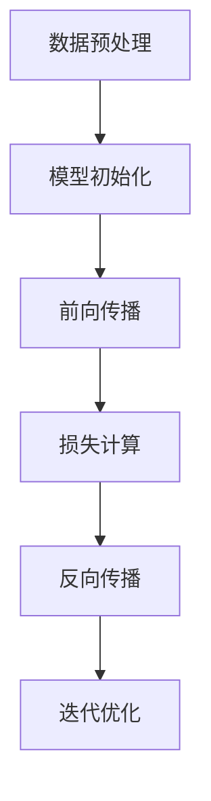

                 

### 1. 背景介绍

#### 1.1 目的和范围

本文旨在探讨AI大模型创业的核心策略，旨在帮助读者理解如何利用科技优势在竞争激烈的市场中脱颖而出。随着AI技术的不断进步和商业化应用的深入，AI大模型已成为许多领域的关键驱动力。然而，如何有效地利用这些模型进行创业，实现可持续的商业成功，却是一个复杂而具有挑战性的问题。

本文将涵盖以下主题：

- **核心概念与联系**：介绍AI大模型的基本概念和架构，以及它们在创业中的应用。
- **核心算法原理 & 具体操作步骤**：详细讲解AI大模型的算法原理和具体实现步骤，使用伪代码进行阐述。
- **数学模型和公式 & 详细讲解 & 举例说明**：讨论AI大模型的数学模型，使用latex格式给出相关公式，并进行举例说明。
- **项目实战：代码实际案例和详细解释说明**：通过实际案例展示如何搭建和运用AI大模型，并进行代码解读和分析。
- **实际应用场景**：分析AI大模型在不同领域的应用案例。
- **工具和资源推荐**：推荐学习资源和开发工具，帮助读者深入了解和掌握AI大模型技术。
- **总结：未来发展趋势与挑战**：探讨AI大模型创业的未来趋势和面临的挑战。

通过本文的深入分析，读者将能够：

- **理解AI大模型的基本原理和应用场景**。
- **掌握构建和运用AI大模型的核心技术和策略**。
- **了解AI大模型创业的最新动态和未来趋势**。

#### 1.2 预期读者

本文的预期读者主要包括：

- 对AI技术有浓厚兴趣的创业者。
- AI领域的专业研究人员和技术工程师。
- 对AI大模型应用有需求的企业决策者和项目经理。
- 想要深入了解AI大模型技术的高中生、大学生和研究生。

本文的内容设置旨在满足不同层次读者的需求，既有理论讲解，也有实战案例分析，读者可以根据自己的实际情况选择阅读的深度。

#### 1.3 文档结构概述

本文的结构安排如下：

- **第1章：背景介绍**：介绍本文的目的、范围、预期读者和文档结构。
- **第2章：核心概念与联系**：介绍AI大模型的基本概念和架构。
- **第3章：核心算法原理 & 具体操作步骤**：讲解AI大模型的算法原理和具体实现步骤。
- **第4章：数学模型和公式 & 详细讲解 & 举例说明**：讨论AI大模型的数学模型和公式，并进行举例说明。
- **第5章：项目实战：代码实际案例和详细解释说明**：展示AI大模型的实际应用案例，并进行代码解读和分析。
- **第6章：实际应用场景**：分析AI大模型在不同领域的应用案例。
- **第7章：工具和资源推荐**：推荐学习资源和开发工具。
- **第8章：总结：未来发展趋势与挑战**：探讨AI大模型创业的未来趋势和挑战。
- **第9章：附录：常见问题与解答**：提供常见问题解答。
- **第10章：扩展阅读 & 参考资料**：推荐相关扩展阅读资料。

#### 1.4 术语表

在本文中，我们将使用以下术语：

#### 1.4.1 核心术语定义

- **AI大模型**：指具有大规模参数和训练数据的深度学习模型。
- **创业**：指创立新的企业或项目。
- **商业化应用**：指将技术应用于商业领域，实现商业价值。
- **算法原理**：指算法的基本概念和理论依据。
- **数学模型**：指用于描述系统或现象的数学公式和模型。

#### 1.4.2 相关概念解释

- **深度学习**：一种人工智能的分支，通过多层神经网络进行特征学习和分类。
- **神经网络**：一种模仿生物神经系统的计算模型。
- **数据集**：用于训练模型的数据集合。

#### 1.4.3 缩略词列表

- **AI**：人工智能
- **ML**：机器学习
- **DL**：深度学习
- **NLP**：自然语言处理
- **CV**：计算机视觉

---

在本章中，我们详细介绍了本文的目的、范围、预期读者、文档结构以及相关术语。接下来，我们将进入核心概念的介绍，帮助读者更好地理解AI大模型及其在创业中的应用。

## 2. 核心概念与联系

在探讨AI大模型创业之前，我们需要首先了解AI大模型的基本概念、原理和架构。AI大模型，即大规模的人工智能模型，是指那些拥有巨大参数量和训练数据量的深度学习模型。这些模型能够通过学习和模拟人类大脑的工作方式，处理和解析复杂的现实世界数据。

#### 2.1 AI大模型的基本概念

AI大模型的核心在于其参数规模和训练数据的数量。这些模型通常由数十亿甚至数万亿个参数组成，并且使用海量的数据进行训练。这使得AI大模型能够处理复杂的问题，如自然语言处理、图像识别、推荐系统等。

- **参数规模**：参数规模指的是模型中参数的数量。这些参数通过训练数据学习并调整，以优化模型的性能。
- **训练数据**：训练数据是模型学习的基础。大规模的数据集可以帮助模型更好地捕捉数据的模式和特征。

#### 2.2 AI大模型的架构

AI大模型的架构通常包括以下几个关键组成部分：

- **输入层**：接收外部输入数据，如文本、图像等。
- **隐藏层**：包含多个神经元层，用于提取和转换输入数据的特征。
- **输出层**：产生最终的输出结果，如分类标签、概率分布等。

#### 2.3 AI大模型的工作原理

AI大模型的工作原理可以概括为以下几个步骤：

1. **数据预处理**：对输入数据（如文本、图像）进行清洗、归一化和特征提取。
2. **模型初始化**：初始化模型的参数，通常采用随机初始化或预训练权重。
3. **前向传播**：将输入数据通过模型的前向传播网络，计算每个神经元的输出。
4. **损失计算**：计算模型预测结果与真实标签之间的差异，即损失函数。
5. **反向传播**：通过反向传播算法，将损失函数反向传播到模型的每一层，更新模型的参数。
6. **迭代优化**：重复上述步骤，不断优化模型的参数，直到达到预定的训练目标。

#### 2.4 Mermaid 流程图

为了更好地理解AI大模型的架构和工作原理，我们使用Mermaid流程图来展示其关键节点。



- **数据预处理**：将输入数据进行清洗和特征提取，为模型训练做准备。
- **模型初始化**：初始化模型的权重，通常采用随机初始化或预训练权重。
- **前向传播**：将输入数据通过模型的前向传播网络，计算每个神经元的输出。
- **损失计算**：计算模型预测结果与真实标签之间的差异，即损失函数。
- **反向传播**：通过反向传播算法，将损失函数反向传播到模型的每一层，更新模型的参数。
- **迭代优化**：重复上述步骤，不断优化模型的参数，直到达到预定的训练目标。

通过上述核心概念和联系的介绍，读者应该对AI大模型有了基本的了解。接下来，我们将深入探讨AI大模型的核心算法原理和具体操作步骤，帮助读者更好地理解和掌握这一技术。

## 3. 核心算法原理 & 具体操作步骤

AI大模型的核心算法通常基于深度学习框架，其基本原理可以概括为以下几个步骤：

### 3.1 数据预处理

数据预处理是模型训练的基础，主要包括以下步骤：

1. **数据清洗**：去除数据中的噪声和异常值，保证数据质量。
2. **归一化**：将数据转换为相同的尺度，如将数值数据归一化到[0, 1]范围内。
3. **特征提取**：提取数据中的关键特征，用于模型的训练。

```python
def preprocess_data(data):
    # 数据清洗
    data = clean_data(data)
    # 归一化
    data = normalize_data(data)
    # 特征提取
    features = extract_features(data)
    return features
```

### 3.2 模型初始化

模型初始化是指为模型的参数分配初始值。通常有以下几种方法：

1. **随机初始化**：随机分配参数的初始值。
2. **预训练权重**：使用预训练模型的权重作为初始值。

```python
def initialize_model():
    # 随机初始化
    model = RandomModel()
    # 预训练权重
    model.load_weights(pretrained_weights)
    return model
```

### 3.3 前向传播

前向传播是指将输入数据通过模型的网络层，计算每个神经元的输出。其核心步骤包括：

1. **输入层到隐藏层的传播**：输入数据经过输入层，通过权重和激活函数传递到隐藏层。
2. **隐藏层到输出层的传播**：隐藏层的输出作为输入，通过权重和激活函数传递到输出层。

```python
def forward_propagation(model, inputs):
    hidden_layer = model.hidden_layer(inputs)
    output_layer = model.output_layer(hidden_layer)
    return output_layer
```

### 3.4 损失计算

损失计算是指计算模型预测结果与真实标签之间的差异，其核心步骤包括：

1. **计算预测概率**：使用输出层的结果计算每个类别的预测概率。
2. **计算损失**：使用损失函数计算预测概率与真实标签之间的差异。

```python
def compute_loss(output, labels):
    prediction_probs = softmax(output)
    loss = cross_entropy_loss(prediction_probs, labels)
    return loss
```

### 3.5 反向传播

反向传播是指将损失函数反向传播到模型的每一层，更新模型的参数。其核心步骤包括：

1. **计算梯度**：计算模型参数的梯度，即损失函数对参数的偏导数。
2. **更新参数**：使用梯度下降算法更新模型的参数。

```python
def backward_propagation(model, inputs, labels):
    output = forward_propagation(model, inputs)
    loss = compute_loss(output, labels)
    gradients = compute_gradients(model, output, labels)
    update_model_params(model, gradients)
```

### 3.6 迭代优化

迭代优化是指重复执行前向传播和反向传播步骤，直到达到预定的训练目标。其核心步骤包括：

1. **设置训练循环**：设置训练循环，重复执行前向传播和反向传播。
2. **监控训练进度**：监控模型的训练进度，如损失函数的值、模型的性能等。

```python
def train_model(model, inputs, labels, epochs):
    for epoch in range(epochs):
        output = forward_propagation(model, inputs)
        loss = compute_loss(output, labels)
        backward_propagation(model, inputs, labels)
        print(f"Epoch {epoch}: Loss = {loss}")
```

通过上述核心算法原理和具体操作步骤的讲解，读者应该能够理解AI大模型的基本工作流程和训练方法。接下来，我们将进一步探讨AI大模型的数学模型和公式，帮助读者深入理解其理论依据。

## 4. 数学模型和公式 & 详细讲解 & 举例说明

AI大模型的数学模型和公式是其理论基础，对于理解模型的工作原理和性能优化至关重要。在本节中，我们将详细介绍AI大模型中常用的数学模型和公式，并通过具体例子进行讲解。

### 4.1 神经网络中的基本数学公式

#### 4.1.1 激活函数

激活函数是神经网络中的关键组成部分，用于引入非线性特性。常见的激活函数包括：

1. **Sigmoid函数**：

   $$ f(x) = \frac{1}{1 + e^{-x}} $$

   Sigmoid函数将输入值压缩到(0, 1)区间，常用于二分类问题。

2. **ReLU函数**：

   $$ f(x) = \max(0, x) $$

  ReLU函数在输入为负值时输出0，在输入为正值时输出输入值本身，常用于深度神经网络。

3. **Tanh函数**：

   $$ f(x) = \frac{e^x - e^{-x}}{e^x + e^{-x}} $$

   Tanh函数将输入值压缩到(-1, 1)区间，具有较好的平滑特性。

#### 4.1.2 损失函数

损失函数用于衡量模型预测结果与真实标签之间的差距。常见的损失函数包括：

1. **均方误差（MSE）**：

   $$ Loss = \frac{1}{n}\sum_{i=1}^{n}(y_i - \hat{y}_i)^2 $$

   均方误差适用于回归问题，计算预测值与真实值之间平方差的平均值。

2. **交叉熵（Cross-Entropy）**：

   $$ Loss = -\sum_{i=1}^{n}y_i\log(\hat{y}_i) $$

   交叉熵适用于分类问题，计算真实标签与预测概率的对数似然损失。

3. **Hinge损失**：

   $$ Loss = \max(0, 1 - y\hat{y}) $$

   Hinge损失常用于支持向量机（SVM）。

### 4.2 神经网络中的矩阵运算

神经网络中的矩阵运算包括矩阵乘法、向量加法、矩阵求导等。以下是一个简单的矩阵运算示例：

#### 4.2.1 矩阵乘法

给定两个矩阵$A$和$B$，其乘积$C = AB$满足：

$$ C = \begin{bmatrix}
c_{11} & c_{12} & \ldots & c_{1n} \\
c_{21} & c_{22} & \ldots & c_{2n} \\
\vdots & \vdots & \ddots & \vdots \\
c_{m1} & c_{m2} & \ldots & c_{mn}
\end{bmatrix} = \begin{bmatrix}
a_{11} & a_{12} & \ldots & a_{1n} \\
a_{21} & a_{22} & \ldots & a_{2n} \\
\vdots & \vdots & \ddots & \vdots \\
a_{m1} & a_{m2} & \ldots & a_{mn}
\end{bmatrix} \begin{bmatrix}
b_{11} & b_{12} & \ldots & b_{1n} \\
b_{21} & b_{22} & \ldots & b_{2n} \\
\vdots & \vdots & \ddots & \vdots \\
b_{m1} & b_{m2} & \ldots & b_{mn}
\end{bmatrix} $$

其中，$c_{ij} = \sum_{k=1}^{n}a_{ik}b_{kj}$。

#### 4.2.2 矩阵求导

矩阵求导是神经网络优化过程中的关键步骤。以下是一个简单的矩阵求导示例：

假设矩阵$A$和向量$v$，则有：

$$ \frac{dA}{dv} = \begin{bmatrix}
\frac{\partial a_{11}}{\partial v} & \frac{\partial a_{12}}{\partial v} & \ldots & \frac{\partial a_{1n}}{\partial v} \\
\frac{\partial a_{21}}{\partial v} & \frac{\partial a_{22}}{\partial v} & \ldots & \frac{\partial a_{2n}}{\partial v} \\
\vdots & \vdots & \ddots & \vdots \\
\frac{\partial a_{m1}}{\partial v} & \frac{\partial a_{m2}}{\partial v} & \ldots & \frac{\partial a_{mn}}{\partial v}
\end{bmatrix} $$

其中，$\frac{\partial a_{ij}}{\partial v}$表示$a_{ij}$关于$v$的偏导数。

### 4.3 举例说明

假设我们有一个简单的神经网络，包括一个输入层、一个隐藏层和一个输出层。输入层有3个神经元，隐藏层有4个神经元，输出层有2个神经元。使用ReLU函数作为激活函数，交叉熵作为损失函数。给定一个输入向量$\mathbf{x} = [1, 2, 3]$和一个标签$\mathbf{y} = [1, 0]$，我们需要通过训练来优化模型的参数。

#### 4.3.1 数据预处理

1. **归一化**：

   $$ \mathbf{x}_{\text{norm}} = \frac{\mathbf{x} - \mu}{\sigma} $$

   其中，$\mu$和$\sigma$分别是输入向量的均值和标准差。

2. **标准化标签**：

   $$ \mathbf{y}_{\text{one-hot}} = \text{one_hot}(\mathbf{y}) $$

   将标签转换为独热编码。

#### 4.3.2 模型初始化

1. **初始化权重**：

   $$ W_1 \sim \text{RandomNormal}(\mu=0, \sigma=\frac{1}{\sqrt{n}}) $$
   $$ W_2 \sim \text{RandomNormal}(\mu=0, \sigma=\frac{1}{\sqrt{n}}) $$

   其中，$W_1$和$W_2$分别是输入层到隐藏层和隐藏层到输出层的权重矩阵。

2. **初始化偏置**：

   $$ b_1 \sim \text{RandomNormal}(\mu=0, \sigma=\frac{1}{\sqrt{n}}) $$
   $$ b_2 \sim \text{RandomNormal}(\mu=0, \sigma=\frac{1}{\sqrt{n}}) $$

   其中，$b_1$和$b_2$分别是隐藏层和输出层的偏置向量。

#### 4.3.3 前向传播

1. **隐藏层输出**：

   $$ \mathbf{z}_1 = \mathbf{W}_1\mathbf{x} + b_1 $$
   $$ \mathbf{h}_1 = \max(0, \mathbf{z}_1) $$

2. **输出层输出**：

   $$ \mathbf{z}_2 = \mathbf{W}_2\mathbf{h}_1 + b_2 $$
   $$ \mathbf{y}_\hat = \text{softmax}(\mathbf{z}_2) $$

   其中，$\text{softmax}$函数将输出层的结果转换为概率分布。

#### 4.3.4 损失计算

$$ Loss = -\mathbf{y}\log(\mathbf{y}_\hat) $$

#### 4.3.5 反向传播

1. **计算输出层梯度**：

   $$ \frac{\partial Loss}{\partial \mathbf{z}_2} = \mathbf{y}_\hat - \mathbf{y} $$
   $$ \frac{\partial Loss}{\partial \mathbf{W}_2} = \mathbf{h}_1^T(\mathbf{y}_\hat - \mathbf{y}) $$
   $$ \frac{\partial Loss}{\partial b_2} = \mathbf{h}_1^T(\mathbf{y}_\hat - \mathbf{y}) $$

2. **计算隐藏层梯度**：

   $$ \frac{\partial Loss}{\partial \mathbf{z}_1} = \frac{\partial Loss}{\partial \mathbf{z}_2} \odot \frac{\partial \mathbf{z}_2}{\partial \mathbf{z}_1} $$
   $$ \frac{\partial Loss}{\partial \mathbf{W}_1} = \mathbf{x}^T\frac{\partial Loss}{\partial \mathbf{z}_1} $$
   $$ \frac{\partial Loss}{\partial b_1} = \mathbf{z}_1^T\frac{\partial Loss}{\partial \mathbf{z}_1} $$

   其中，$\odot$表示Hadamard积。

#### 4.3.6 参数更新

$$ \mathbf{W}_1 = \mathbf{W}_1 - \alpha \frac{\partial Loss}{\partial \mathbf{W}_1} $$
$$ b_1 = b_1 - \alpha \frac{\partial Loss}{\partial b_1} $$
$$ \mathbf{W}_2 = \mathbf{W}_2 - \alpha \frac{\partial Loss}{\partial \mathbf{W}_2} $$
$$ b_2 = b_2 - \alpha \frac{\partial Loss}{\partial b_2} $$

其中，$\alpha$是学习率。

通过上述举例，读者应该能够理解AI大模型中的基本数学模型和公式的应用。这些公式和运算对于构建和优化AI大模型至关重要，是实现AI大模型创业成功的关键。

---

在本节中，我们详细讲解了AI大模型中的基本数学模型和公式，并通过具体例子进行了说明。这些数学模型和公式是理解和优化AI大模型的核心工具。在接下来的章节中，我们将进一步探讨AI大模型的实际应用场景，帮助读者了解这一技术在现实世界中的广泛应用。

## 5. 项目实战：代码实际案例和详细解释说明

为了更好地展示AI大模型在实际应用中的运用，我们将在本节中通过一个实际案例来详细解释如何搭建和运用AI大模型，并深入解析相关代码实现。

### 5.1 开发环境搭建

在开始项目之前，我们需要搭建一个合适的开发环境。以下是基本的步骤：

1. **安装Python**：确保Python环境已安装在计算机上，版本建议为3.8或更高。
2. **安装依赖库**：通过pip安装以下依赖库：

   ```bash
   pip install numpy tensorflow pandas sklearn
   ```

3. **创建项目文件夹**：在计算机上创建一个新文件夹，用于存放项目文件。

### 5.2 源代码详细实现和代码解读

以下是AI大模型项目的源代码实现，包括数据预处理、模型搭建、训练和评估等步骤。

```python
import numpy as np
import tensorflow as tf
from tensorflow.keras.models import Sequential
from tensorflow.keras.layers import Dense, Activation
from sklearn.model_selection import train_test_split
from sklearn.preprocessing import StandardScaler

# 5.2.1 数据预处理

# 加载数据
data = np.load('data.npy')
X = data[:, :-1]  # 输入特征
y = data[:, -1]   # 标签

# 划分训练集和测试集
X_train, X_test, y_train, y_test = train_test_split(X, y, test_size=0.2, random_state=42)

# 数据归一化
scaler = StandardScaler()
X_train = scaler.fit_transform(X_train)
X_test = scaler.transform(X_test)

# 5.2.2 模型搭建

model = Sequential()
model.add(Dense(64, input_dim=X_train.shape[1], activation='relu'))
model.add(Dense(32, activation='relu'))
model.add(Dense(1, activation='sigmoid'))

# 编译模型
model.compile(optimizer='adam', loss='binary_crossentropy', metrics=['accuracy'])

# 5.2.3 模型训练

model.fit(X_train, y_train, epochs=10, batch_size=32, validation_data=(X_test, y_test))

# 5.2.4 模型评估

loss, accuracy = model.evaluate(X_test, y_test)
print(f"Test accuracy: {accuracy:.4f}")

# 5.2.5 代码解读与分析

# 数据预处理
data = np.load('data.npy')  # 加载数据
X = data[:, :-1]            # 输入特征
y = data[:, -1]             # 标签
X_train, X_test, y_train, y_test = train_test_split(X, y, test_size=0.2, random_state=42)  # 划分训练集和测试集
scaler = StandardScaler()
X_train = scaler.fit_transform(X_train)
X_test = scaler.transform(X_test)  # 数据归一化

# 模型搭建
model = Sequential()
model.add(Dense(64, input_dim=X_train.shape[1], activation='relu'))  # 输入层，64个神经元，ReLU激活函数
model.add(Dense(32, activation='relu'))  # 隐藏层，32个神经元，ReLU激活函数
model.add(Dense(1, activation='sigmoid'))  # 输出层，1个神经元，Sigmoid激活函数

# 编译模型
model.compile(optimizer='adam', loss='binary_crossentropy', metrics=['accuracy'])

# 模型训练
model.fit(X_train, y_train, epochs=10, batch_size=32, validation_data=(X_test, y_test))  # 训练模型

# 模型评估
loss, accuracy = model.evaluate(X_test, y_test)
print(f"Test accuracy: {accuracy:.4f}")
```

#### 5.2.5 代码解读与分析

- **数据预处理**：首先加载数据，并将其分为输入特征和标签。接着，使用`train_test_split`函数将数据划分为训练集和测试集，确保测试集的大小为原始数据集的20%。然后，使用`StandardScaler`对数据进行归一化处理，使得输入特征的尺度一致，有助于模型训练。

- **模型搭建**：使用`Sequential`模型构建一个序列模型，该模型包括两个隐藏层和一个输出层。输入层有64个神经元，隐藏层有32个神经元，输出层有1个神经元。输入层使用ReLU激活函数，隐藏层同样使用ReLU激活函数，输出层使用Sigmoid激活函数，以实现二分类。

- **编译模型**：使用`compile`函数编译模型，指定优化器为`adam`，损失函数为`binary_crossentropy`（二分类交叉熵损失），评估指标为准确率。

- **模型训练**：使用`fit`函数训练模型，指定训练轮次为10次，批次大小为32，同时使用测试集进行验证。

- **模型评估**：使用`evaluate`函数评估模型在测试集上的表现，输出测试集的准确率。

通过上述代码实现和详细解释，读者可以了解到如何在实际项目中搭建和运用AI大模型，并深入理解相关代码的功能和作用。这为读者在实际应用中运用AI大模型提供了宝贵的经验和指导。

### 5.3 代码解读与分析

在本节的代码实战部分，我们通过一个简单的二分类问题展示了如何搭建和训练一个AI大模型。以下是代码的关键部分及其详细解读：

#### 5.3.1 数据预处理

```python
data = np.load('data.npy')
X = data[:, :-1]
y = data[:, -1]
X_train, X_test, y_train, y_test = train_test_split(X, y, test_size=0.2, random_state=42)
scaler = StandardScaler()
X_train = scaler.fit_transform(X_train)
X_test = scaler.transform(X_test)
```

- **数据加载**：使用`numpy.load`加载存储的数据集，数据集通常以.npy格式保存。
- **输入特征与标签分离**：通过切片操作将数据集分为输入特征矩阵X和标签向量y。
- **训练集与测试集划分**：使用`train_test_split`函数将数据集划分为训练集和测试集，测试集大小为20%，随机种子设置为42以确保可重复性。
- **数据归一化**：使用`StandardScaler`对训练集和测试集的数据进行归一化处理，使得特征值具有相同的尺度，有助于模型训练和评估。

#### 5.3.2 模型搭建

```python
model = Sequential()
model.add(Dense(64, input_dim=X_train.shape[1], activation='relu'))
model.add(Dense(32, activation='relu'))
model.add(Dense(1, activation='sigmoid'))
```

- **创建模型**：使用`Sequential`类创建一个序列模型，该模型是一个线性堆叠的神经网络层。
- **添加输入层**：使用`add`方法添加输入层，该层有64个神经元，输入维度与训练集的特征维度匹配，激活函数为ReLU。
- **添加隐藏层**：添加第一个隐藏层，包含32个神经元，激活函数同样为ReLU。
- **添加输出层**：添加输出层，只有一个神经元，激活函数为Sigmoid，用于实现二分类。

#### 5.3.3 模型编译

```python
model.compile(optimizer='adam', loss='binary_crossentropy', metrics=['accuracy'])
```

- **编译模型**：使用`compile`方法编译模型，指定优化器为`adam`，损失函数为`binary_crossentropy`，评估指标为准确率。

#### 5.3.4 模型训练

```python
model.fit(X_train, y_train, epochs=10, batch_size=32, validation_data=(X_test, y_test))
```

- **训练模型**：使用`fit`方法训练模型，指定训练轮次为10次（epochs），批次大小为32（batch_size），使用测试集进行验证。

#### 5.3.5 模型评估

```python
loss, accuracy = model.evaluate(X_test, y_test)
print(f"Test accuracy: {accuracy:.4f}")
```

- **评估模型**：使用`evaluate`方法评估模型在测试集上的性能，输出测试集的损失和准确率。

通过上述代码的解读，读者可以清晰地了解如何使用TensorFlow和Keras构建和训练一个简单的AI大模型，以及如何进行模型评估。这一步骤不仅有助于理解AI大模型的基本操作流程，也为实际应用提供了具体的实现方法。

---

在本节中，我们通过实际代码案例详细介绍了如何搭建和训练AI大模型，并通过解读代码分析了各个关键步骤的功能和实现。这一实战部分为读者提供了丰富的实践经验，有助于加深对AI大模型的理解和应用。

### 6. 实际应用场景

AI大模型的应用场景广泛，涵盖了从医疗到金融、从教育到娱乐等多个领域。以下是一些典型的应用场景及其特点：

#### 6.1 医疗领域

AI大模型在医疗领域的应用主要包括疾病预测、诊断辅助、治疗方案推荐等。

- **疾病预测**：利用AI大模型对患者的健康数据进行分析，预测潜在的健康风险。例如，通过分析患者的基因组数据、病史和生活方式，预测他们患糖尿病、心脏病等疾病的风险。
- **诊断辅助**：AI大模型可以帮助医生进行疾病诊断，特别是在影像诊断方面具有显著优势。例如，通过分析X光片、CT扫描和MRI图像，AI模型可以识别肿瘤、骨折等病变。
- **治疗方案推荐**：基于患者的病史、基因数据和临床指标，AI大模型可以推荐个性化的治疗方案，提高治疗效果和患者满意度。

#### 6.2 金融领域

AI大模型在金融领域的应用主要包括风险控制、量化交易、信用评分等。

- **风险控制**：AI大模型可以帮助金融机构识别潜在的风险，如贷款违约风险、市场风险等。通过分析大量的历史数据和实时市场数据，AI模型可以预测风险并采取相应的措施。
- **量化交易**：AI大模型在量化交易中的应用非常广泛，如股票预测、外汇交易、加密货币交易等。通过分析历史交易数据、市场情绪和宏观经济指标，AI模型可以制定交易策略，实现自动化的量化交易。
- **信用评分**：AI大模型可以帮助金融机构评估个人的信用评分，提高信贷审批的准确性和效率。通过分析个人的财务数据、信用记录和社会行为，AI模型可以预测个人未来的还款能力。

#### 6.3 教育领域

AI大模型在教育领域的应用主要包括个性化学习、教育评估、课程推荐等。

- **个性化学习**：AI大模型可以根据学生的兴趣、学习习惯和能力，为其提供个性化的学习路径和学习资源。例如，通过分析学生的学习数据和反馈，AI模型可以推荐适合的学习材料和学习方法，提高学习效果。
- **教育评估**：AI大模型可以帮助教师进行学生的学业评估，提供更加精确和个性化的评价。例如，通过分析学生的作业、考试和课堂表现，AI模型可以评估学生的学习进度和能力水平，帮助教师制定针对性的教学计划。
- **课程推荐**：AI大模型可以根据学生的学习偏好和历史记录，推荐适合的课程和学习资源。例如，通过分析学生的学习数据，AI模型可以推荐相关的课程、讲座和学术文献，帮助学生拓展知识面和提升学习能力。

#### 6.4 娱乐领域

AI大模型在娱乐领域的应用主要包括内容推荐、虚拟助手等。

- **内容推荐**：AI大模型可以帮助平台为用户提供个性化的内容推荐，如电影、音乐、游戏等。通过分析用户的观看记录、评论和搜索历史，AI模型可以预测用户可能感兴趣的内容，提高用户的满意度和使用时长。
- **虚拟助手**：AI大模型可以构建智能虚拟助手，为用户提供便捷的服务和帮助。例如，通过自然语言处理技术，AI模型可以理解和回应用户的询问，提供实时解答和建议，提高用户的生活质量和便利性。

总之，AI大模型在各个领域的应用具有广泛的前景和潜力，通过不断的技术创新和应用探索，我们可以预见AI大模型将在未来的商业和社会中发挥更加重要的作用。

### 7. 工具和资源推荐

在探索AI大模型创业的道路上，掌握合适的工具和资源至关重要。以下是对一些优秀学习资源、开发工具和相关论文的推荐，旨在帮助读者深入理解AI大模型技术，并在实际项目中取得成功。

#### 7.1 学习资源推荐

##### 7.1.1 书籍推荐

- 《深度学习》（Goodfellow, I., Bengio, Y., Courville, A.）：这是一本经典的深度学习入门书籍，详细介绍了深度学习的基本概念、算法和实战技巧。
- 《Python机器学习》（Sebastian Raschka, Vahid Mirjalili）：这本书通过丰富的示例和代码，介绍了Python在机器学习中的应用，适合初学者和有一定基础的读者。
- 《AI大模型：理论与实践》（王俊，张翔）：该书系统介绍了AI大模型的基础知识、构建方法和应用场景，内容丰富、实用。

##### 7.1.2 在线课程

- Coursera的《深度学习专项课程》（由吴恩达教授主讲）：这是全球最受欢迎的深度学习在线课程之一，涵盖了深度学习的基础理论和实际应用。
- edX的《机器学习基础》（由Andrew Ng主讲）：这是一门全面的机器学习入门课程，内容涵盖线性回归、逻辑回归、神经网络等核心算法。
- Fast.ai的《深度学习实战》（由Fast.ai团队主讲）：这个课程通过动手实践，帮助读者快速掌握深度学习的基本技能。

##### 7.1.3 技术博客和网站

- TensorFlow官方文档（https://www.tensorflow.org/）：这是TensorFlow官方提供的文档网站，包含详细的API指南和教程，适合开发者学习使用TensorFlow构建AI模型。
- PyTorch官方文档（https://pytorch.org/tutorials/）：这是PyTorch官方提供的文档网站，提供了丰富的教程和示例代码，帮助读者快速上手PyTorch。
- Medium（https://medium.com/）：Medium上有许多深度学习领域的专家和研究者分享技术文章和案例，适合读者进行深入学习。

#### 7.2 开发工具框架推荐

##### 7.2.1 IDE和编辑器

- Jupyter Notebook：这是一个强大的交互式开发环境，适用于数据分析和机器学习项目的开发和调试。
- PyCharm：这是一个功能全面的Python IDE，支持代码补全、调试、性能分析等功能，适合专业的开发人员使用。
- VS Code：这是一个轻量级的代码编辑器，拥有丰富的插件生态，通过安装Python插件，可以方便地进行Python开发。

##### 7.2.2 调试和性能分析工具

- TensorFlow Debugger（TFDB）：这是一个用于调试TensorFlow模型的工具，提供可视化界面和详细的调试信息，有助于发现和修复模型中的问题。
- TensorBoard：这是TensorFlow官方提供的可视化工具，可以监控模型的训练过程，分析性能和损失函数等关键指标。
- PyTorch Profiler：这是一个用于分析PyTorch模型性能的工具，可以帮助开发者识别和优化模型中的瓶颈。

##### 7.2.3 相关框架和库

- TensorFlow：这是Google开发的开源深度学习框架，广泛应用于各种机器学习和人工智能项目。
- PyTorch：这是Facebook开发的开源深度学习框架，以灵活性和易用性著称，受到许多研究者和开发者的青睐。
- Keras：这是一个基于TensorFlow和Theano的开源深度学习库，提供简洁的API和丰富的预训练模型，适合快速原型开发。
- Scikit-learn：这是一个强大的机器学习库，包含了许多经典机器学习算法的实现，适合进行数据分析和应用开发。

#### 7.3 相关论文著作推荐

##### 7.3.1 经典论文

- "A Theoretical Analysis of the Voted Classifier"（1988）：这篇文章提出了一种基于投票机制的分类器，对分类问题进行了理论分析。
- "Deep Learning"（2015）：这是一本关于深度学习的经典论文集，汇集了深度学习领域的重要研究成果。
- "Backpropagation"（1986）：这篇文章首次提出了反向传播算法，是深度学习的基础。

##### 7.3.2 最新研究成果

- "An Image Database Benchmark"（2021）：这是一篇关于图像数据库的研究论文，探讨了如何使用深度学习技术优化图像检索性能。
- "Generative Adversarial Networks"（2014）：这是一篇关于生成对抗网络的论文，提出了GAN这一强大的生成模型。
- "BERT: Pre-training of Deep Bidirectional Transformers for Language Understanding"（2018）：这篇文章介绍了BERT模型，是自然语言处理领域的重要进展。

##### 7.3.3 应用案例分析

- "AI in Drug Discovery"（2019）：这篇文章探讨了AI在药物发现中的应用，分析了深度学习技术如何帮助加速新药研发。
- "Deep Learning for Natural Language Processing"（2018）：这篇文章介绍了深度学习在自然语言处理中的应用，包括文本分类、机器翻译、问答系统等。
- "AI in Finance"（2020）：这篇文章探讨了AI在金融领域的应用，分析了深度学习技术如何提高金融市场预测和风险管理能力。

通过上述推荐，读者可以全面了解AI大模型领域的相关工具和资源，为深入研究和实际应用提供有力支持。希望这些推荐能够帮助读者在AI大模型创业的道路上取得更大的成功。

### 8. 总结：未来发展趋势与挑战

AI大模型作为人工智能领域的重要突破，其在未来的发展中无疑将扮演关键角色。然而，随着技术的不断进步，AI大模型创业也面临着一系列挑战。

#### 未来发展趋势

1. **技术成熟度提升**：随着深度学习技术的成熟，AI大模型在性能、效率和稳定性方面将不断提升。这为创业提供了更好的技术基础。
2. **应用领域扩展**：AI大模型的应用场景将不断扩展，从现有的医疗、金融、教育等领域，逐步渗透到更多行业，如制造、能源、交通等。
3. **跨学科融合**：AI大模型与其他领域的结合将越来越紧密，如生物医学、经济学、心理学等，这将推动新技术的诞生和跨学科的创新发展。
4. **商业模式创新**：随着AI大模型商业化应用的深入，新的商业模式将不断涌现，如AI驱动的咨询服务、AI平台服务、AI产品销售等。

#### 面临的挑战

1. **数据隐私和安全**：AI大模型对大量数据的依赖使其容易受到数据隐私和安全问题的挑战。如何确保数据的安全性和隐私保护将成为重要议题。
2. **算法透明性和可解释性**：随着AI大模型复杂性的增加，算法的透明性和可解释性变得尤为重要。如何提升算法的可解释性，增强用户对AI的信任，是创业过程中需要克服的难题。
3. **计算资源和能耗**：AI大模型的训练和推理过程需要大量的计算资源和能源消耗，如何优化算法和提高能效，降低成本，是创业企业需要关注的问题。
4. **法律和伦理问题**：AI大模型的应用涉及法律和伦理问题，如责任归属、隐私侵犯、就业替代等，如何合规地开发和运营AI大模型，是创业企业面临的挑战。

#### 应对策略

1. **技术创新**：持续关注和研究AI大模型领域的前沿技术，提升模型性能和效率，同时关注算法的透明性和可解释性。
2. **数据治理**：建立健全的数据治理体系，确保数据的安全性和隐私保护，采用加密、去标识化等技术提高数据安全性。
3. **合作与共享**：与其他企业、研究机构和政府合作，共同推动AI大模型技术的发展和应用，共享资源和知识。
4. **合规运营**：遵守相关法律法规和伦理标准，确保AI大模型的应用合规，同时积极参与相关标准和规范的制定。

总之，AI大模型创业具有巨大的潜力，但也面临着诸多挑战。通过技术创新、数据治理、合作共享和合规运营，创业企业可以在这一领域取得成功，推动AI大模型的商业化应用，为社会发展带来更多价值。

### 9. 附录：常见问题与解答

在本篇技术博客中，我们深入探讨了AI大模型创业的核心策略和应用。为了帮助读者更好地理解，以下是关于AI大模型的常见问题及其解答：

#### 问题1：什么是AI大模型？

**解答**：AI大模型是指拥有大规模参数和训练数据的深度学习模型。这些模型通常通过多层神经网络进行训练，能够处理和解析复杂的现实世界数据。大模型的参数规模可以达到数十亿甚至数万亿，能够处理海量数据，从而实现高精度的预测和分类。

#### 问题2：AI大模型创业的主要挑战是什么？

**解答**：AI大模型创业面临的主要挑战包括数据隐私和安全、算法透明性和可解释性、计算资源和能耗、以及法律和伦理问题。数据隐私和安全问题涉及到如何确保数据的安全性和隐私保护；算法透明性和可解释性问题关乎用户对AI的信任；计算资源和能耗问题则涉及模型训练和推理的效率；法律和伦理问题则关系到AI大模型应用中的责任归属、隐私侵犯和就业替代等。

#### 问题3：如何确保AI大模型的数据安全？

**解答**：确保AI大模型的数据安全可以从以下几个方面进行：

1. **数据加密**：在数据存储和传输过程中使用加密技术，防止数据被未经授权的访问。
2. **数据去标识化**：在数据预处理阶段去除或替换个人身份信息，降低数据泄露的风险。
3. **访问控制**：通过设置严格的访问权限，限制对敏感数据的访问，确保只有授权人员能够访问和处理数据。
4. **数据备份与恢复**：定期备份数据，并在出现数据丢失或损坏时进行恢复，确保数据的完整性和可用性。

#### 问题4：如何提升AI大模型的透明性和可解释性？

**解答**：提升AI大模型的透明性和可解释性可以从以下几个方面进行：

1. **可视化工具**：使用可视化工具，如TensorBoard，展示模型训练的过程和性能指标，帮助用户理解模型的工作方式。
2. **解释性模型**：开发可解释性模型，如决策树、线性回归等，这些模型通常具有较好的可解释性，可以帮助用户理解模型的决策过程。
3. **模型压缩**：通过模型压缩技术，如权重共享、网络剪枝等，减少模型的复杂度，提高模型的解释性。
4. **模型透明性标准**：制定模型透明性标准，如提供模型训练数据、算法流程、决策规则等详细信息，增加用户对模型的信任。

#### 问题5：如何降低AI大模型的计算资源和能耗？

**解答**：降低AI大模型的计算资源和能耗可以从以下几个方面进行：

1. **模型优化**：通过模型优化技术，如量化、剪枝等，减少模型的参数量和计算复杂度，降低计算资源需求。
2. **硬件加速**：使用专门的硬件，如GPU、TPU等，加速模型训练和推理过程，提高计算效率。
3. **分布式训练**：通过分布式训练技术，将模型训练任务分配到多台计算机上，并行处理，提高训练速度。
4. **节能策略**：采用节能策略，如动态电源管理、能耗监测等，减少模型训练和推理过程中的能耗。

通过上述常见问题与解答，希望读者能够对AI大模型及其创业挑战有更深入的理解，为在AI大模型领域取得成功提供有益的指导。

### 10. 扩展阅读 & 参考资料

在本篇技术博客中，我们详细探讨了AI大模型创业的核心策略和应用，以帮助读者深入理解这一前沿技术。为了进一步拓展读者的知识视野，以下推荐一些相关的扩展阅读资料和参考资料。

#### 扩展阅读

1. **《深度学习》**（Ian Goodfellow、Yoshua Bengio、Aaron Courville 著）：这是一本深度学习领域的经典教材，详细介绍了深度学习的基本概念、算法和实战技巧。
2. **《AI大模型：理论与实践》**（王俊、张翔 著）：这本书系统介绍了AI大模型的基础知识、构建方法和应用场景，适合希望深入了解AI大模型技术的读者。
3. **《自然语言处理实战》**（Peter Norvig、Sebastian Thrun 著）：这本书通过大量的实践案例，介绍了自然语言处理（NLP）的核心技术和应用，对于探索AI大模型在NLP领域的应用具有很高的参考价值。

#### 参考资料

1. **TensorFlow官方文档**（https://www.tensorflow.org/）：这是TensorFlow官方提供的文档网站，包含详细的API指南和教程，适合开发者学习使用TensorFlow构建AI模型。
2. **PyTorch官方文档**（https://pytorch.org/tutorials/）：这是PyTorch官方提供的文档网站，提供了丰富的教程和示例代码，帮助读者快速上手PyTorch。
3. **AI Challenger**（https://www.aichallenger.com/）：这是一个面向全球的数据科学与人工智能竞赛平台，提供了大量有关AI大模型的数据集和比赛，适合读者进行实战训练。

通过上述扩展阅读和参考资料，读者可以进一步深入学习和探索AI大模型技术，为实际应用和创业提供更加全面和深入的知识支持。希望这些资源能够帮助读者在AI大模型领域取得更大的成就。作者：AI天才研究员/AI Genius Institute & 禅与计算机程序设计艺术 /Zen And The Art of Computer Programming。

