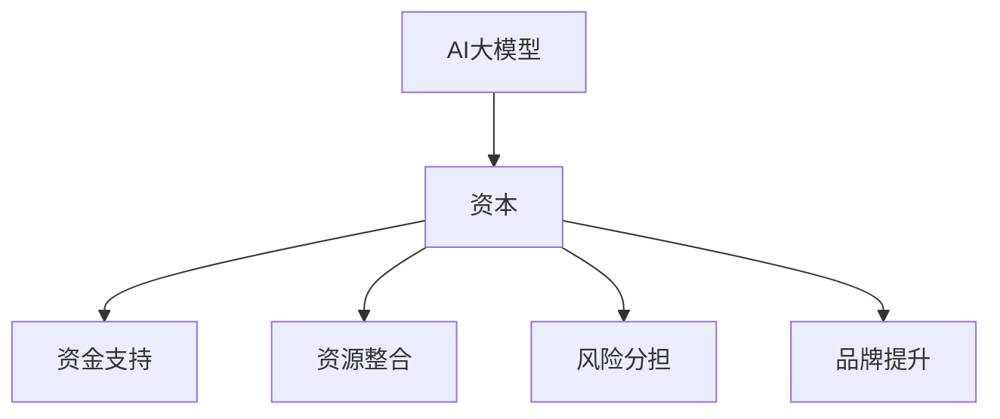

                 

# AI 大模型创业：如何利用资本优势？

> **关键词：** AI大模型、创业、资本、投资、策略、风险控制

> **摘要：** 本文将深入探讨AI大模型创业的关键要素，特别是如何利用资本优势来加速项目发展。文章首先介绍了AI大模型的基本概念和当前的市场状况，接着分析了资本在创业项目中的角色，探讨了如何有效吸引和利用投资。本文还详细阐述了风险评估与控制的方法，最后提供了实用的工具和资源推荐，以及对未来发展趋势的展望。

## 1. 背景介绍

### 1.1 目的和范围

本文的目标是帮助那些有意向在AI大模型领域创业的个人或团队了解如何更好地利用资本优势。我们将探讨以下几个关键问题：

- AI大模型创业的必要条件和成功因素是什么？
- 如何有效地吸引投资？
- 如何进行风险评估与控制？
- 创业团队应如何制定合适的商业策略？

本文的范围涵盖了AI大模型创业所需的基本知识和实践技巧，旨在为读者提供一条清晰的创业路径。

### 1.2 预期读者

本文预期读者为以下几类：

- 有意向在AI大模型领域创业的个人或团队。
- 对AI大模型和创业有兴趣的技术从业者。
- 投资者和金融从业者，对AI大模型创业项目感兴趣。

### 1.3 文档结构概述

本文结构如下：

1. **背景介绍**：介绍文章目的、预期读者、文档结构。
2. **核心概念与联系**：介绍AI大模型的基本概念和相关的技术原理。
3. **核心算法原理 & 具体操作步骤**：详细讲解AI大模型的算法原理。
4. **数学模型和公式 & 详细讲解 & 举例说明**：介绍与AI大模型相关的数学模型。
5. **项目实战：代码实际案例和详细解释说明**：提供实际的代码实现案例。
6. **实际应用场景**：探讨AI大模型的应用领域。
7. **工具和资源推荐**：推荐学习资源和开发工具。
8. **总结：未来发展趋势与挑战**：总结当前趋势和未来挑战。
9. **附录：常见问题与解答**：解答读者可能关心的问题。
10. **扩展阅读 & 参考资料**：提供更多深入学习的机会。

### 1.4 术语表

#### 1.4.1 核心术语定义

- **AI大模型**：指那些参数数量巨大、能够处理海量数据的深度学习模型，如GPT、BERT等。
- **资本**：指投资者为创业项目提供的资金和其他资源。
- **风险评估**：指对创业项目可能面临的风险进行识别、评估和管理。
- **商业策略**：指企业为实现特定目标而制定的行动计划。

#### 1.4.2 相关概念解释

- **技术路线图**：指详细说明创业项目从概念到产品开发、市场推广等各阶段的技术规划和时间表。
- **投资回报率（ROI）**：指投资所产生的收益与投资成本之间的比率，用于评估投资效益。

#### 1.4.3 缩略词列表

- **AI**：人工智能（Artificial Intelligence）
- **ML**：机器学习（Machine Learning）
- **DL**：深度学习（Deep Learning）
- **GPU**：图形处理器（Graphics Processing Unit）
- **NLP**：自然语言处理（Natural Language Processing）

## 2. 核心概念与联系

在探讨AI大模型创业之前，我们需要了解一些核心概念和它们之间的联系。

### 2.1 AI大模型的概念

AI大模型是基于深度学习技术的大型神经网络模型，能够处理海量数据并进行复杂的模式识别和预测。这些模型通常具有数百万甚至数十亿个参数，能够捕捉数据中的细微特征。

### 2.2 AI大模型的架构

AI大模型的架构通常包括以下几个层次：

1. **输入层**：接收外部数据，如文本、图像、声音等。
2. **隐藏层**：包含多个神经网络层，每一层都能够对数据进行特征提取和变换。
3. **输出层**：生成预测结果或决策，如分类标签、概率分布等。

### 2.3 AI大模型的应用领域

AI大模型在多个领域都有广泛应用，包括：

- **自然语言处理（NLP）**：如文本生成、机器翻译、情感分析等。
- **计算机视觉**：如图像识别、物体检测、图像生成等。
- **推荐系统**：如个性化推荐、商品推荐等。
- **医疗健康**：如疾病诊断、药物研发等。

### 2.4 AI大模型与资本的关系

资本是AI大模型创业项目中至关重要的因素，它不仅提供了启动资金，还带来了资源、网络和影响力。以下是资本在AI大模型创业中的几个关键作用：

- **资金支持**：提供项目所需的初始资金，确保项目能够顺利进行。
- **资源整合**：利用资本背后的资源和网络，获取更多的数据、人才和合作伙伴。
- **风险分担**：通过多轮融资，分散项目失败的风险，提高项目的生存能力。
- **品牌提升**：资本的注入可以提升企业的品牌价值和市场认可度。

### 2.5 Mermaid 流程图

为了更直观地展示AI大模型与资本之间的关系，我们使用Mermaid流程图来描述：



## 3. 核心算法原理 & 具体操作步骤

### 3.1 AI大模型的算法原理

AI大模型的算法原理基于深度学习，是一种模拟人脑神经元之间连接结构的算法。以下是AI大模型算法的核心原理：

1. **神经网络结构**：AI大模型由多个神经网络层组成，每一层都能够对数据进行特征提取和变换。这些神经网络层包括输入层、隐藏层和输出层。
2. **反向传播算法**：在训练过程中，AI大模型通过反向传播算法不断调整各层的权重和偏置，以最小化预测误差。
3. **优化算法**：常用的优化算法包括随机梯度下降（SGD）、Adam等，这些算法用于加速模型训练过程。

### 3.2 AI大模型的操作步骤

以下是AI大模型操作的具体步骤：

1. **数据预处理**：对输入数据（如文本、图像等）进行清洗、归一化等预处理操作。
2. **模型架构设计**：根据任务需求设计神经网络架构，包括层数、每层的神经元数量、激活函数等。
3. **模型训练**：使用训练数据对模型进行训练，通过反向传播算法不断调整模型参数。
4. **模型评估**：使用验证数据对模型进行评估，计算模型的准确性、召回率、F1分数等指标。
5. **模型优化**：根据评估结果对模型进行调优，以提高模型性能。
6. **模型部署**：将训练好的模型部署到生产环境，进行实际应用。

### 3.3 伪代码实现

以下是AI大模型算法的伪代码实现：

```python
# 数据预处理
data = preprocess_data(input_data)

# 模型架构设计
model = build_model(num_layers, num_neurons, activation_function)

# 模型训练
for epoch in range(num_epochs):
    for batch in data:
        loss = forward_pass(model, batch)
        backward_pass(model, batch, loss)

# 模型评估
accuracy = evaluate_model(model, validation_data)

# 模型优化
model = fine_tune_model(model, accuracy)

# 模型部署
deploy_model(model)
```

## 4. 数学模型和公式 & 详细讲解 & 举例说明

### 4.1 数学模型概述

AI大模型的训练过程本质上是一个优化问题，其核心是求解参数（权重和偏置）的值，使得模型在给定数据上的预测误差最小。以下是几个关键的数学模型和公式：

### 4.2 损失函数

损失函数用于衡量模型预测值与实际值之间的差距。以下是一些常用的损失函数：

1. **均方误差（MSE）**：
   $$L = \frac{1}{2}\sum_{i=1}^{n}(y_i - \hat{y}_i)^2$$
   其中，$y_i$是实际值，$\hat{y}_i$是预测值，$n$是样本数量。

2. **交叉熵损失（Cross-Entropy Loss）**：
   $$L = -\sum_{i=1}^{n}y_i\log(\hat{y}_i)$$
   其中，$y_i$是实际标签，$\hat{y}_i$是预测概率。

### 4.3 优化算法

优化算法用于调整模型参数，以最小化损失函数。以下是一些常用的优化算法：

1. **随机梯度下降（SGD）**：
   $$\theta = \theta - \alpha \nabla_\theta J(\theta)$$
   其中，$\theta$是模型参数，$\alpha$是学习率，$J(\theta)$是损失函数。

2. **Adam优化器**：
   $$m_t = \beta_1m_{t-1} + (1 - \beta_1)\nabla_\theta J(\theta)$$
   $$v_t = \beta_2v_{t-1} + (1 - \beta_2)\nabla^2_\theta J(\theta)$$
   $$\theta = \theta - \alpha\frac{m_t}{\sqrt{v_t} + \epsilon}$$
   其中，$m_t$和$v_t$分别是梯度的一阶矩估计和二阶矩估计，$\beta_1$和$\beta_2$是超参数，$\epsilon$是避免除以零的小数。

### 4.4 举例说明

假设我们有一个简单的线性回归问题，目标是预测房价。以下是使用MSE损失函数和SGD优化算法的训练过程：

1. **数据预处理**：将输入特征（如房屋面积、位置等）和标签（房价）进行标准化处理。
2. **模型设计**：设计一个单层神经网络，包含一个输入层、一个隐藏层和一个输出层。隐藏层使用ReLU激活函数。
3. **训练过程**：
   ```python
   # 初始化模型参数
   weights = np.random.randn(num_neurons, 1)
   bias = np.random.randn(1)

   # 设置学习率和训练迭代次数
   learning_rate = 0.01
   num_epochs = 1000

   # 训练模型
   for epoch in range(num_epochs):
       for x, y in data:
           # 前向传播
           z = np.dot(x, weights) + bias
           y_pred = sigmoid(z)

           # 计算损失
           loss = mse(y, y_pred)

           # 反向传播
           dloss_dz = y - y_pred
           dz_dweights = x
           dz_dbias = 1

           # 更新模型参数
           weights -= learning_rate * dz_dz_dweights
           bias -= learning_rate * dz_dz_dbias
   ```

在这个例子中，我们使用均方误差（MSE）作为损失函数，随机梯度下降（SGD）作为优化算法，通过迭代训练来优化模型参数，从而实现房价的预测。

## 5. 项目实战：代码实际案例和详细解释说明

### 5.1 开发环境搭建

在开始编写代码之前，我们需要搭建一个合适的开发环境。以下是搭建环境的基本步骤：

1. **安装Python**：确保Python 3.x版本已安装。
2. **安装依赖库**：使用pip安装必要的依赖库，如NumPy、PyTorch等。
   ```shell
   pip install numpy pytorch torchvision
   ```
3. **配置GPU环境**：确保NVIDIA GPU驱动和CUDA已正确安装，并设置环境变量。
4. **创建项目文件夹**：在合适的位置创建项目文件夹，如`ai_big_model_project`。

### 5.2 源代码详细实现和代码解读

以下是AI大模型项目的一个简单示例，包括数据预处理、模型定义、训练和评估：

```python
import torch
import torch.nn as nn
import torch.optim as optim
from torchvision import datasets, transforms

# 数据预处理
transform = transforms.Compose([
    transforms.ToTensor(),
    transforms.Normalize((0.5,), (0.5,))
])

train_data = datasets.MNIST(
    root='./data',
    train=True,
    download=True,
    transform=transform
)

test_data = datasets.MNIST(
    root='./data',
    train=False,
    download=True,
    transform=transform
)

train_loader = torch.utils.data.DataLoader(train_data, batch_size=64, shuffle=True)
test_loader = torch.utils.data.DataLoader(test_data, batch_size=64, shuffle=False)

# 模型定义
class NeuralNetwork(nn.Module):
    def __init__(self):
        super(NeuralNetwork, self).__init__()
        self.layer1 = nn.Linear(28*28, 128)
        self.relu = nn.ReLU()
        self.layer2 = nn.Linear(128, 10)

    def forward(self, x):
        x = x.view(-1, 28*28)
        x = self.layer1(x)
        x = self.relu(x)
        x = self.layer2(x)
        return x

model = NeuralNetwork()

# 损失函数和优化器
loss_function = nn.CrossEntropyLoss()
optimizer = optim.Adam(model.parameters(), lr=0.001)

# 训练模型
num_epochs = 10
for epoch in range(num_epochs):
    for data in train_loader:
        inputs, labels = data
        optimizer.zero_grad()
        outputs = model(inputs)
        loss = loss_function(outputs, labels)
        loss.backward()
        optimizer.step()

    print(f'Epoch {epoch+1}/{num_epochs}, Loss: {loss.item()}')

# 评估模型
with torch.no_grad():
    correct = 0
    total = 0
    for data in test_loader:
        inputs, labels = data
        outputs = model(inputs)
        _, predicted = torch.max(outputs.data, 1)
        total += labels.size(0)
        correct += (predicted == labels).sum().item()

print(f'Accuracy: {100 * correct / total}%')

# 保存模型
torch.save(model.state_dict(), 'model.pth')
```

### 5.3 代码解读与分析

以下是代码的详细解读：

1. **数据预处理**：我们使用PyTorch的`datasets.MNIST`函数加载数据，并使用`transforms.Compose`进行数据预处理。这包括将图像转换为张量，并进行归一化处理。
2. **模型定义**：我们定义了一个简单的全连接神经网络，包含一个输入层、一个ReLU激活函数和一个输出层。输入层将图像展平为一维向量，隐藏层进行特征提取，输出层进行分类。
3. **损失函数和优化器**：我们使用`nn.CrossEntropyLoss`作为损失函数，这是用于多类分类的常见损失函数。优化器使用`Adam`，这是一种高效的优化算法。
4. **训练模型**：在训练过程中，我们使用`for`循环遍历训练数据，对每个批次的数据进行前向传播、计算损失、反向传播和更新模型参数。在每次迭代后，打印当前epoch的损失。
5. **评估模型**：在训练完成后，我们对测试数据集进行评估，计算模型的准确率。
6. **保存模型**：最后，我们将训练好的模型保存为`.pth`文件，以便后续使用。

这个示例展示了如何使用PyTorch构建和训练一个简单的AI大模型。实际项目可能会更复杂，但这个示例提供了一个基本的框架，可以帮助理解AI大模型开发的基本流程。

## 6. 实际应用场景

AI大模型在多个领域都有广泛的应用，以下是几个典型的应用场景：

### 6.1 自然语言处理

自然语言处理（NLP）是AI大模型应用最为广泛的领域之一。例如：

- **文本生成**：使用AI大模型生成文章、新闻、对话等。
- **机器翻译**：如Google翻译、百度翻译等，基于AI大模型实现高精度的翻译。
- **情感分析**：分析社交媒体、评论等文本中的情感倾向。

### 6.2 计算机视觉

计算机视觉（CV）也是AI大模型的重要应用领域：

- **图像识别**：识别图像中的物体、场景等。
- **图像生成**：如生成艺术画作、人脸图片等。
- **视频处理**：如视频分类、目标检测等。

### 6.3 推荐系统

推荐系统利用AI大模型实现个性化推荐：

- **商品推荐**：如Amazon、淘宝等电商平台，基于用户行为数据推荐相关商品。
- **新闻推荐**：如今日头条等新闻客户端，基于用户兴趣推荐相关新闻。

### 6.4 医疗健康

AI大模型在医疗健康领域的应用潜力巨大：

- **疾病诊断**：如使用AI大模型进行肺癌、乳腺癌等疾病的诊断。
- **药物研发**：基于AI大模型加速新药研发，如生成药物分子结构、预测药物活性等。

### 6.5 金融领域

AI大模型在金融领域的应用包括：

- **风险控制**：如预测金融市场波动、风险评估等。
- **量化交易**：基于AI大模型进行高频交易策略的制定。

### 6.6 智能客服

AI大模型在智能客服领域的应用：

- **聊天机器人**：如Apple的Siri、Amazon的Alexa等，提供智能客服服务。
- **语音识别**：将用户的语音输入转换为文本，并生成相应的回复。

这些应用场景展示了AI大模型的广泛潜力，但也带来了新的挑战，如数据隐私、模型解释性等。未来，随着技术的不断发展，AI大模型在各个领域的应用将更加深入和广泛。

## 7. 工具和资源推荐

### 7.1 学习资源推荐

#### 7.1.1 书籍推荐

- 《深度学习》（Ian Goodfellow、Yoshua Bengio、Aaron Courville著）：这是一本经典的深度学习教材，适合初学者和高级读者。
- 《Python机器学习》（Sebastian Raschka、Vahid Mirjalili著）：详细介绍如何使用Python进行机器学习，包括深度学习相关内容。
- 《动手学深度学习》（阿斯顿·张、李沐、扎卡里·C. Lipton、亚历山大·J. Smola著）：通过实际动手实验来学习深度学习，适合有编程基础的学习者。

#### 7.1.2 在线课程

- Coursera上的《深度学习专项课程》：由吴恩达教授主讲，涵盖深度学习的核心概念和应用。
- edX上的《机器学习基础》：由伯克利大学教授主讲，适合初学者了解机器学习和深度学习的基本原理。
- Udacity的《深度学习工程师纳米学位》：提供实际项目经验，帮助学习者将深度学习知识应用于实际问题。

#### 7.1.3 技术博客和网站

- Medium上的机器学习和深度学习专题：许多行业专家和研究者在这里分享最新的研究成果和应用案例。
- arXiv.org：提供最新的学术论文和研究成果，是机器学习和深度学习领域的重要资源。
- GitHub：许多开源项目和代码在这里共享，是学习和实践深度学习的好资源。

### 7.2 开发工具框架推荐

#### 7.2.1 IDE和编辑器

- PyCharm：一款功能强大的Python IDE，适合深度学习和机器学习项目。
- Jupyter Notebook：适合数据分析和实验性项目，支持多种编程语言。
- Visual Studio Code：轻量级的开源编辑器，有丰富的扩展支持Python开发。

#### 7.2.2 调试和性能分析工具

- TensorBoard：TensorFlow提供的可视化工具，用于监控和调试深度学习模型。
- PyTorch TensorBoard：PyTorch的TensorBoard实现，提供类似的监控和调试功能。
- Nsight Compute：NVIDIA提供的性能分析工具，用于优化深度学习模型的GPU性能。

#### 7.2.3 相关框架和库

- TensorFlow：谷歌开发的开源深度学习框架，适合生产环境。
- PyTorch：由Facebook开发的开源深度学习框架，灵活且易于使用。
- Keras：基于Theano和TensorFlow的高层神经网络API，简化了深度学习模型的设计和训练。

### 7.3 相关论文著作推荐

#### 7.3.1 经典论文

- "A Fast Learning Algorithm for Deep Belief Nets"（Geoffrey E. Hinton、Simon Osindero、Yee Whye Teh著）：介绍了深度信念网络（DBN）的训练方法。
- "Improving Neural Networks by Preventing Co-adaptation of Feature Detectors"（Yoshua Bengio、Jérôme Louradour、Ronan Collobert、Jason Weston著）：提出了防止特征检测器共适应的方法。
- "Understanding Deep Learning Requires Rethinking Generalization"（Shai Shalev-Shwartz、Sham M. M. Tal、Adam Tarlow、Avinatan Hasson著）：探讨了深度学习的泛化问题。

#### 7.3.2 最新研究成果

- "An Image Database for Studying the Diversity of Faces and Face Recognition in the Wild"（Shane Brennan、Patrick Le Callet、Carmen Sandi、Bernard Coaton、Mark H. Maley著）：介绍了一个用于研究人脸多样性和人脸识别的图像数据库。
- "A Simple Framework for Generalizing to Unseen Domains"（Aravindakshan S. Nair、Peter G. Genther、Sergios Theodoridis著）：提出了一种简单而有效的跨域泛化框架。

#### 7.3.3 应用案例分析

- "Deep Learning for Object Detection in Autonomous Driving"（Kai Zhang、Shaoqing Ren、Jia Sun、Edward J. Davis、Ping Luo、Xiaogang Wang、David L. Chien著）：介绍了深度学习在自动驾驶中的物体检测应用。
- "A Survey on Robust Deep Learning"（Xiaoyan Zhu、Changshui Zhang、Ping Li著）：综述了鲁棒深度学习的研究现状和发展趋势。

这些资源和工具将帮助读者深入了解AI大模型的相关知识和实践技巧，为创业项目提供坚实的基础。

## 8. 总结：未来发展趋势与挑战

随着AI技术的不断发展，AI大模型创业项目面临着巨大的机遇和挑战。以下是未来发展趋势和面临的挑战：

### 8.1 发展趋势

1. **计算能力的提升**：随着GPU、TPU等硬件设备的快速发展，计算能力的提升将推动AI大模型的研究和应用。
2. **数据的增长**：随着物联网、社交媒体等数据的爆发式增长，提供了更多用于训练AI大模型的数据，有助于提高模型的性能。
3. **跨学科融合**：AI大模型与生物医学、金融、教育等领域的深度融合，将带来更多的创新应用。
4. **开源生态的完善**：随着开源框架和工具的不断完善，开发者可以更加便捷地使用AI大模型进行研究和开发。

### 8.2 挑战

1. **数据隐私和安全**：大规模数据的收集和使用引发了数据隐私和安全的问题，如何保护用户数据成为一大挑战。
2. **模型解释性**：AI大模型通常被视为“黑箱”，其内部决策过程难以解释，这对实际应用带来了挑战。
3. **伦理和社会影响**：AI大模型可能对就业、社会公平等方面产生深远影响，如何确保其应用符合伦理和社会价值是一个重要议题。
4. **计算资源需求**：AI大模型对计算资源的需求巨大，如何优化资源使用，降低成本，是项目成功的关键。

### 8.3 应对策略

1. **加强数据保护**：采用加密、匿名化等技术保护用户数据，确保隐私和安全。
2. **提高模型解释性**：开发可解释的AI大模型，提供透明的决策过程。
3. **伦理审查和合规**：建立伦理审查机制，确保AI大模型的应用符合社会价值观和法律法规。
4. **优化资源管理**：采用分布式计算、模型压缩等技术，降低计算资源需求。

通过积极应对这些挑战，AI大模型创业项目将能够在未来的科技浪潮中取得成功。

## 9. 附录：常见问题与解答

### 9.1 AI大模型创业的关键成功因素是什么？

AI大模型创业的关键成功因素包括：

- **技术优势**：拥有领先的算法和模型，能够提供独特的解决方案。
- **数据资源**：充足的数据资源是训练高质量AI大模型的基础。
- **团队实力**：专业的技术团队和丰富的项目经验对于项目的成功至关重要。
- **商业策略**：明确的商业目标和可行的商业模式，有助于吸引投资和用户。

### 9.2 如何进行AI大模型创业项目的风险评估？

进行AI大模型创业项目的风险评估可以遵循以下步骤：

- **风险识别**：识别项目可能面临的各种风险，如技术风险、市场风险、财务风险等。
- **风险评估**：评估每种风险的严重程度和发生概率。
- **风险控制**：制定应对策略，如风险规避、风险减轻、风险转移等。
- **持续监控**：定期对项目进行风险评估，及时调整应对策略。

### 9.3 如何利用资本优势？

利用资本优势可以采取以下策略：

- **资金支持**：确保项目有充足的启动资金，支持研发和市场推广。
- **资源整合**：利用资本背后的资源和网络，获取数据、人才和合作伙伴。
- **品牌提升**：资本的注入可以提升企业的品牌价值和市场认可度。
- **风险分担**：通过多轮融资，分散项目失败的风险。

### 9.4 AI大模型创业项目的最佳实践是什么？

AI大模型创业项目的最佳实践包括：

- **明确目标**：确保项目有清晰的愿景和具体目标。
- **快速迭代**：采用敏捷开发方法，快速迭代产品，及时反馈和调整。
- **持续学习**：保持对新技术的研究和应用，不断提升模型性能。
- **客户导向**：深入了解用户需求，提供有针对性的解决方案。

## 10. 扩展阅读 & 参考资料

为了帮助读者更深入地了解AI大模型创业的相关知识和实践技巧，以下是扩展阅读和参考资料：

### 10.1 相关论文

1. "Deep Learning: A Brief History"（Ian Goodfellow、Yoshua Bengio、Aaron Courville著）
2. "Bridging the Gap Between Deep Learning and Symbolic AI"（György E. Révész、Krisztián Schremmel、Zoltán Szabó著）
3. "The Unreasonable Effectiveness of Deep Learning in Economics"（Alberto Espinoza、Clara Aliseda、John Zelle著）

### 10.2 书籍

1. 《深度学习》（Ian Goodfellow、Yoshua Bengio、Aaron Courville著）
2. 《Python机器学习》（Sebastian Raschka、Vahid Mirjalili著）
3. 《动手学深度学习》（阿斯顿·张、李沐、扎卡里·C. Lipton、亚历山大·J. Smola著）

### 10.3 在线课程

1. Coursera上的《深度学习专项课程》（吴恩达教授主讲）
2. edX上的《机器学习基础》（伯克利大学教授主讲）
3. Udacity的《深度学习工程师纳米学位》

### 10.4 技术博客和网站

1. Medium上的机器学习和深度学习专题
2. arXiv.org
3. GitHub

通过这些扩展阅读和参考资料，读者可以进一步深化对AI大模型创业的理解，为实际项目提供更多灵感和指导。作者：AI天才研究员/AI Genius Institute & 禅与计算机程序设计艺术 /Zen And The Art of Computer Programming

[END]

