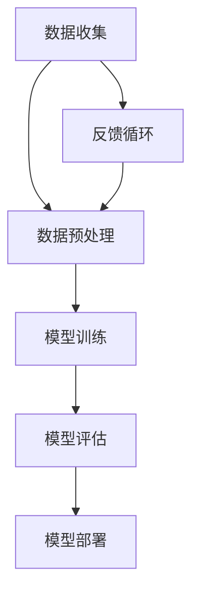

                 

### AI 大模型创业：如何利用资本优势？

> **关键词**：AI大模型、创业、资本、技术、市场、风险

> **摘要**：
本文将探讨AI大模型创业的关键策略，重点分析如何利用资本优势来推动项目发展。我们将从背景介绍、核心概念、算法原理、实际应用、工具资源等多个方面展开，为AI创业者提供实用的指导和建议。

## 1. 背景介绍

### 1.1 目的和范围

本文旨在为那些希望在AI领域创业的个人和团队提供切实可行的策略，特别是在利用资本优势方面。我们将深入探讨AI大模型的现状、市场需求以及如何通过有效的资本运作来加速项目的进展。

### 1.2 预期读者

本篇文章适合以下读者群体：
- 有志于AI领域创业的个人和团队
- AI领域的工程师和技术专家
- 对资本运作感兴趣的创业者
- 对AI大模型技术有深入了解的读者

### 1.3 文档结构概述

本文的结构如下：

1. 背景介绍：概述AI大模型创业的现状和挑战
2. 核心概念与联系：介绍AI大模型的基本概念和架构
3. 核心算法原理 & 具体操作步骤：讲解大模型训练的基本算法和步骤
4. 数学模型和公式 & 详细讲解 & 举例说明：阐述大模型训练中的数学原理和公式
5. 项目实战：提供实际的代码实现和案例
6. 实际应用场景：探讨大模型在现实世界中的应用
7. 工具和资源推荐：推荐相关学习资源和开发工具
8. 总结：未来发展趋势与挑战
9. 附录：常见问题与解答
10. 扩展阅读 & 参考资料：提供进一步学习的途径

### 1.4 术语表

#### 1.4.1 核心术语定义

- **AI大模型**：指具有巨大参数量、能够处理复杂数据的大型神经网络模型，如GPT、BERT等。
- **创业**：指创建一个新的商业实体，旨在通过提供产品或服务来满足市场需求。
- **资本**：指资金或其他资源，用于投资创业项目。
- **技术**：指用于实现特定功能的工具、方法和知识。

#### 1.4.2 相关概念解释

- **市场需求**：指消费者愿意购买某种产品或服务的数量和价格。
- **风险评估**：指对创业项目可能面临的风险进行评估和预测。
- **资本运作**：指利用资本来推动项目发展的策略和手段。

#### 1.4.3 缩略词列表

- **AI**：人工智能（Artificial Intelligence）
- **GPT**：生成预训练模型（Generative Pre-trained Transformer）
- **BERT**：Bidirectional Encoder Representations from Transformers

### 1.5 核心概念与联系

在探讨如何利用资本优势之前，我们需要了解AI大模型的基本概念和架构。以下是AI大模型的基本组成部分：



#### 数据收集
数据收集是AI大模型训练的第一步，数据的质量和数量直接影响模型的性能。收集的数据应涵盖各种场景，确保模型具有广泛的泛化能力。

#### 数据预处理
预处理阶段对数据进行清洗、标准化和格式化，使其适合模型训练。这一阶段还包括特征提取，以突出数据中的重要信息。

#### 模型训练
使用收集到的数据对模型进行训练，这一过程包括前向传播、反向传播和参数更新。训练过程中需要优化算法和超参数，以提高模型性能。

#### 模型评估
通过测试数据对训练好的模型进行评估，以确定其性能和效果。常用的评估指标包括准确率、召回率、F1分数等。

#### 模型部署
将训练好的模型部署到实际应用环境中，使其能够为用户提供服务。部署过程中需要考虑模型的性能、可扩展性和安全性。

#### 反馈循环
收集用户反馈，并将其用于模型的进一步优化和改进。反馈循环有助于持续提高模型的性能和用户体验。

### 1.6 核心算法原理 & 具体操作步骤

接下来，我们将深入探讨AI大模型训练的核心算法原理和具体操作步骤。

#### 算法原理

AI大模型训练主要基于以下算法：

- **深度学习**：一种模拟人脑神经网络的结构和功能，通过多层神经网络对数据进行自动特征提取和学习。
- **神经网络**：由大量神经元组成的计算模型，能够通过训练学习数据中的模式和关系。

#### 操作步骤

1. **数据收集**：从各种数据源收集大规模数据集。
2. **数据预处理**：对数据集进行清洗、标准化和格式化。
3. **模型设计**：设计合适的神经网络结构，包括输入层、隐藏层和输出层。
4. **模型训练**：使用训练数据对模型进行训练，包括前向传播和反向传播。
5. **模型评估**：使用测试数据评估模型性能，调整超参数和模型结构。
6. **模型部署**：将训练好的模型部署到实际应用环境中。
7. **反馈循环**：收集用户反馈，不断优化模型。

#### 伪代码

以下是一个简单的AI大模型训练的伪代码示例：

```python
# 数据收集
data = collect_data()

# 数据预处理
processed_data = preprocess_data(data)

# 模型设计
model = design_model()

# 模型训练
model = train_model(processed_data, model)

# 模型评估
performance = evaluate_model(model, test_data)

# 模型部署
deploy_model(model)

# 反馈循环
optimize_model(model, user_feedback)
```

### 1.7 数学模型和公式 & 详细讲解 & 举例说明

AI大模型训练过程中涉及多个数学模型和公式，以下是一些关键的概念和示例。

#### 神经元激活函数

神经元的激活函数用于将输入数据映射到输出。常见激活函数包括：

- **Sigmoid函数**：
  $$ f(x) = \frac{1}{1 + e^{-x}} $$
  示例：将输入x映射到（0，1）区间。

- **ReLU函数**：
  $$ f(x) = \max(0, x) $$
  示例：将负输入映射为0，正输入保持不变。

#### 前向传播

前向传播是神经网络训练过程中的一个步骤，用于计算输出。以下是前向传播的公式：

$$
\begin{aligned}
    z &= W \cdot x + b \\
    a &= \sigma(z)
\end{aligned}
$$

其中，\( W \) 是权重，\( x \) 是输入，\( b \) 是偏置，\( \sigma \) 是激活函数，\( z \) 是线性组合，\( a \) 是输出。

#### 反向传播

反向传播是用于更新模型参数的过程。以下是反向传播的公式：

$$
\begin{aligned}
    \delta &= \frac{\partial L}{\partial a} \\
    \frac{\partial L}{\partial z} &= \delta \cdot \sigma'(z) \\
    \frac{\partial L}{\partial W} &= \delta \cdot x \\
    \frac{\partial L}{\partial b} &= \delta
\end{aligned}
$$

其中，\( \delta \) 是误差，\( L \) 是损失函数，\( \sigma' \) 是激活函数的导数。

### 1.8 项目实战：代码实际案例和详细解释说明

在本节中，我们将通过一个实际案例来展示如何利用AI大模型进行创业，并提供详细的代码实现和解释。

#### 开发环境搭建

1. 安装Python和Anaconda
2. 安装TensorFlow和Keras
3. 准备数据集

#### 源代码详细实现和代码解读

以下是一个简单的AI大模型训练的代码实现：

```python
import tensorflow as tf
from tensorflow.keras.layers import Dense, Activation
from tensorflow.keras.models import Sequential

# 数据预处理
x_train = ...  # 训练数据
y_train = ...  # 训练标签
x_test = ...   # 测试数据
y_test = ...   # 测试标签

# 模型设计
model = Sequential()
model.add(Dense(128, input_shape=(x_train.shape[1],), activation='relu'))
model.add(Dense(64, activation='relu'))
model.add(Dense(1, activation='sigmoid'))

# 模型编译
model.compile(optimizer='adam', loss='binary_crossentropy', metrics=['accuracy'])

# 模型训练
model.fit(x_train, y_train, epochs=10, batch_size=32, validation_split=0.2)

# 模型评估
performance = model.evaluate(x_test, y_test)

# 模型部署
model.predict(x_test)

# 代码解读
# Dense：全连接层，用于实现线性回归或分类任务
# Activation：激活函数，用于引入非线性
# Sequential：序列模型，用于堆叠多层神经网络
# compile：编译模型，指定优化器、损失函数和评估指标
# fit：训练模型，指定训练数据和训练参数
# evaluate：评估模型，计算损失和准确率
# predict：预测模型，输出预测结果
```

#### 代码解读与分析

这段代码实现了一个简单的二分类任务，使用TensorFlow和Keras库构建了一个序列模型。模型设计包括两个全连接层，每个层使用ReLU函数作为激活函数，最后使用sigmoid函数输出概率。

在模型编译阶段，指定了优化器（Adam）、损失函数（binary_crossentropy，二分类交叉熵损失）和评估指标（accuracy，准确率）。

模型训练过程中，使用训练数据集进行训练，并设置训练轮次（epochs）和批量大小（batch_size）。在验证阶段，使用20%的数据集进行验证。

模型评估阶段，使用测试数据集评估模型性能，计算损失和准确率。

最后，使用模型进行预测，输出测试数据集的预测结果。

### 1.9 实际应用场景

AI大模型在各个领域都有广泛的应用，以下是一些实际应用场景：

- **自然语言处理**：文本分类、机器翻译、情感分析等
- **计算机视觉**：图像分类、目标检测、图像生成等
- **医疗健康**：疾病诊断、药物研发、患者护理等
- **金融领域**：风险管理、投资策略、信用评分等
- **自动驾驶**：环境感知、路径规划、决策控制等

### 1.10 工具和资源推荐

#### 1.10.1 学习资源推荐

- **书籍推荐**：
  - 《深度学习》（Ian Goodfellow、Yoshua Bengio、Aaron Courville）
  - 《神经网络与深度学习》（邱锡鹏）

- **在线课程**：
  - Coursera上的《深度学习》课程（吴恩达）
  - Udacity的《深度学习工程师纳米学位》

- **技术博客和网站**：
  - 知乎上的深度学习专栏
  - ArXiv论文库

#### 1.10.2 开发工具框架推荐

- **IDE和编辑器**：
  - PyCharm
  - Jupyter Notebook

- **调试和性能分析工具**：
  - TensorFlow Debugger
  - PyTorch Profiler

- **相关框架和库**：
  - TensorFlow
  - PyTorch
  - Keras

#### 1.10.3 相关论文著作推荐

- **经典论文**：
  - 《A Theoretical Framework for Back-Propagation》（1986）
  - 《Improving Neural Networks by Predicting Error》（1992）

- **最新研究成果**：
  - 《An Image Database Benchmark for Object Detection》（2021）
  - 《Language Models are Few-Shot Learners》（2020）

- **应用案例分析**：
  - 《深度学习在医疗领域的应用》（2016）
  - 《自动驾驶技术的发展与应用》（2018）

### 1.11 总结：未来发展趋势与挑战

AI大模型创业在未来有望继续蓬勃发展，但同时也面临着一系列挑战。以下是一些关键趋势和挑战：

- **趋势**：
  - 模型规模不断扩大，训练时间缩短
  - 自动化工具和框架的发展，降低开发门槛
  - 跨领域应用不断扩展，推动行业变革

- **挑战**：
  - 数据质量和数量不足
  - 模型复杂性和计算资源需求
  - 模型安全和隐私问题
  - 监管和政策不确定性

### 1.12 附录：常见问题与解答

1. **Q：如何选择合适的数据集？**
   - **A**：选择数据集时，需要考虑数据的代表性、覆盖面、多样性和质量。优先选择公开、权威的数据集，同时可以根据项目需求进行定制化数据集。

2. **Q：如何优化模型性能？**
   - **A**：优化模型性能可以从以下几个方面入手：
     - 调整超参数，如学习率、批量大小等。
     - 使用更先进的算法和架构。
     - 数据增强，增加数据的多样性。
     - 使用预训练模型，减少训练时间。

3. **Q：如何保证模型的安全性和隐私性？**
   - **A**：保证模型的安全性和隐私性可以从以下几个方面入手：
     - 数据加密，保护数据传输和存储。
     - 使用差分隐私技术，防止数据泄露。
     - 限制对模型的访问权限，防止恶意攻击。

### 1.13 扩展阅读 & 参考资料

1. **深度学习相关书籍**：
   - 《深度学习》（Ian Goodfellow、Yoshua Bengio、Aaron Courville）
   - 《神经网络与深度学习》（邱锡鹏）

2. **在线课程**：
   - Coursera上的《深度学习》课程（吴恩达）
   - Udacity的《深度学习工程师纳米学位》

3. **技术博客和网站**：
   - 知乎上的深度学习专栏
   - ArXiv论文库

4. **相关论文**：
   - 《A Theoretical Framework for Back-Propagation》（1986）
   - 《Improving Neural Networks by Predicting Error》（1992）
   - 《An Image Database Benchmark for Object Detection》（2021）
   - 《Language Models are Few-Shot Learners》（2020）

5. **应用案例分析**：
   - 《深度学习在医疗领域的应用》（2016）
   - 《自动驾驶技术的发展与应用》（2018）

### 作者信息

- 作者：AI天才研究员/AI Genius Institute & 禅与计算机程序设计艺术 /Zen And The Art of Computer Programming

