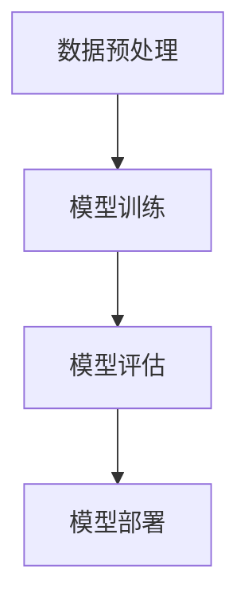

                 

# AI 大模型创业：如何利用资本优势？

> **关键词：** AI大模型、创业、资本、投资、资源整合、市场定位、风险管理、技术创新

> **摘要：** 本文旨在探讨AI大模型创业公司如何利用资本优势，实现技术创新和市场突破。文章首先介绍了AI大模型创业的背景和重要性，随后详细分析了创业过程中的资本运作策略，包括资源整合、市场定位和风险管理。最后，文章提出了具体的实施步骤和实战案例，为创业公司提供实际操作指导。

## 1. 背景介绍

### 1.1 目的和范围

本文旨在为那些有意向投身AI大模型领域的创业者提供一套系统的资本利用策略。文章将围绕以下几个核心问题展开：

- AI大模型创业的必要性和可行性如何？
- 创业公司如何获取并利用资本？
- 创业过程中应如何进行市场定位和风险管理？
- 创业公司应如何通过技术创新获得竞争优势？

### 1.2 预期读者

本文适用于以下读者群体：

- 有意向从事AI大模型创业的科技人才
- AI领域的初创公司创始人或团队成员
- 投资者和风投机构的相关人员
- 对AI技术发展和创业有浓厚兴趣的从业者

### 1.3 文档结构概述

本文分为十个部分，具体结构如下：

1. 背景介绍
   - 1.1 目的和范围
   - 1.2 预期读者
   - 1.3 文档结构概述
   - 1.4 术语表
2. 核心概念与联系
   - 2.1 AI大模型的概念与分类
   - 2.2 AI大模型在商业应用中的挑战与机遇
   - 2.3 AI大模型的技术架构
3. 核心算法原理 & 具体操作步骤
   - 3.1 AI大模型的训练过程
   - 3.2 模型优化与调参
   - 3.3 模型评估与验证
4. 数学模型和公式 & 详细讲解 & 举例说明
   - 4.1 深度学习中的关键数学公式
   - 4.2 数学模型在AI大模型中的应用
   - 4.3 实际案例中的数学模型应用
5. 项目实战：代码实际案例和详细解释说明
   - 5.1 开发环境搭建
   - 5.2 源代码详细实现和代码解读
   - 5.3 代码解读与分析
6. 实际应用场景
   - 6.1 金融行业的应用
   - 6.2 医疗健康领域的应用
   - 6.3 教育行业的应用
7. 工具和资源推荐
   - 7.1 学习资源推荐
   - 7.2 开发工具框架推荐
   - 7.3 相关论文著作推荐
8. 总结：未来发展趋势与挑战
   - 8.1 技术趋势
   - 8.2 市场趋势
   - 8.3 面临的挑战
9. 附录：常见问题与解答
10. 扩展阅读 & 参考资料

### 1.4 术语表

#### 1.4.1 核心术语定义

- **AI大模型（AI Large Model）**：指参数量达到数百万、数十亿甚至更多的神经网络模型，如GPT、BERT等。
- **资本（Capital）**：指投资者为企业提供的资金、资源和其他形式的投资。
- **市场定位（Market Positioning）**：企业在市场中的定位，包括目标市场、品牌形象、竞争优势等。
- **风险管理（Risk Management）**：识别、评估、控制和监控企业面临的各种风险。

#### 1.4.2 相关概念解释

- **资源整合（Resource Integration）**：将企业内外部的资源进行整合，形成协同效应，提高整体效益。
- **技术创新（Technological Innovation）**：通过技术研发和改进，实现技术进步和商业价值。
- **市场机会（Market Opportunity）**：指市场上存在的、尚未被充分利用的需求和机会。

#### 1.4.3 缩略词列表

- **AI**：人工智能（Artificial Intelligence）
- **GPT**：生成预训练模型（Generative Pre-trained Transformer）
- **BERT**：Bidirectional Encoder Representations from Transformers
- **ROI**：投资回报率（Return on Investment）
- **VC**：风险投资（Venture Capital）

## 2. 核心概念与联系

在探讨如何利用资本优势进行AI大模型创业之前，我们首先需要了解AI大模型的概念、商业应用中的挑战与机遇，以及其技术架构。

### 2.1 AI大模型的概念与分类

AI大模型是指具有数十亿到千亿参数的深度神经网络模型，这些模型能够通过大量的数据训练，实现从图像、语音到自然语言处理等各个领域的智能化任务。根据应用场景和任务类型，AI大模型可以分为以下几类：

1. **计算机视觉模型**：如用于图像分类、目标检测、图像生成等。
2. **自然语言处理模型**：如用于文本分类、机器翻译、问答系统等。
3. **语音识别模型**：如用于语音识别、语音合成等。

### 2.2 AI大模型在商业应用中的挑战与机遇

AI大模型在商业应用中既面临挑战，也蕴含着巨大的机遇。

#### 挑战：

1. **数据需求大**：AI大模型需要大量的高质量训练数据，这对数据获取、清洗和处理提出了高要求。
2. **计算资源消耗大**：训练和部署AI大模型需要大量的计算资源，这对硬件设施和运维成本提出了挑战。
3. **模型解释性差**：AI大模型通常具有很高的黑箱特性，难以解释其决策过程，这在一些需要高解释性的应用场景中成为限制。

#### 机遇：

1. **业务价值大**：AI大模型在各个领域的应用都能带来显著的业务价值，如提高生产效率、降低运营成本、提升客户体验等。
2. **市场前景广**：随着AI技术的不断发展和普及，AI大模型在各个行业的应用前景广阔，市场需求持续增长。
3. **技术创新空间大**：AI大模型的技术创新空间巨大，包括算法优化、硬件加速、模型压缩等方面。

### 2.3 AI大模型的技术架构

AI大模型的技术架构主要包括以下几个关键组件：

1. **数据预处理模块**：负责处理和清洗原始数据，将数据转化为适合训练的形式。
2. **模型训练模块**：负责训练大模型，通过优化算法和参数调整，使模型性能达到预期目标。
3. **模型评估模块**：负责评估模型的效果，包括准确率、召回率、F1值等指标。
4. **模型部署模块**：负责将训练好的模型部署到实际应用环境中，实现实时推理和预测。

为了更好地理解AI大模型的技术架构，我们可以使用Mermaid流程图进行展示：



### 2.4 AI大模型创业的优势与挑战

对于创业者来说，AI大模型创业具有以下优势和挑战：

#### 优势：

1. **高创新性**：AI大模型技术具有很高的创新性，创业者可以在技术前沿进行探索和突破。
2. **高商业价值**：AI大模型在各个领域都能带来显著的商业价值，创业者有机会实现快速商业化。
3. **广阔的市场空间**：随着AI技术的不断发展和普及，AI大模型的市场空间将持续扩大。

#### 挑战：

1. **技术门槛高**：AI大模型技术门槛较高，创业者需要具备深厚的专业知识和技能。
2. **资源需求大**：AI大模型创业需要大量的计算资源和数据资源，这对初创公司来说是一个重大挑战。
3. **市场竞争激烈**：AI大模型创业领域的竞争激烈，创业者需要具备出色的市场定位和营销能力。

### 2.5 利用资本优势进行AI大模型创业的策略

为了充分利用资本优势，AI大模型创业公司可以采取以下策略：

1. **精准市场定位**：明确目标市场和用户群体，提供有针对性的产品和服务。
2. **技术创新驱动**：持续进行技术创新，提升模型性能和业务价值。
3. **资源整合**：通过战略合作和外部投资，整合计算资源和数据资源。
4. **风险管理**：建立完善的风险管理体系，降低创业风险。

## 3. 核心算法原理 & 具体操作步骤

### 3.1 AI大模型的训练过程

AI大模型的训练是创业过程中的核心环节，其主要包括以下几个步骤：

#### 3.1.1 数据准备

1. **数据采集**：根据业务需求，收集相关领域的海量数据。
2. **数据清洗**：对采集到的数据进行去重、补全、去噪等处理。
3. **数据预处理**：将原始数据转化为模型可以接受的格式，如图像数据需要进行归一化、裁剪等处理。

```python
# 示例：图像数据预处理
def preprocess_image(image_path):
    image = load_image(image_path)
    image = normalize(image)
    image = crop_image(image, crop_size=(224, 224))
    return image
```

#### 3.1.2 模型构建

1. **选择模型架构**：根据应用场景选择合适的模型架构，如GPT、BERT等。
2. **初始化模型**：使用预训练模型或随机初始化权重。
3. **定义损失函数**：选择合适的损失函数，如交叉熵损失函数。

```python
# 示例：定义模型和损失函数
model = build_model()
criterion = CrossEntropyLoss()
```

#### 3.1.3 模型训练

1. **设置训练参数**：包括学习率、批次大小、迭代次数等。
2. **训练过程**：使用训练数据和验证数据，通过迭代训练模型。
3. **模型保存**：在训练过程中保存性能最好的模型。

```python
# 示例：训练模型
optimizer = optim.SGD(model.parameters(), lr=0.001, momentum=0.9)
for epoch in range(num_epochs):
    for inputs, targets in train_loader:
        optimizer.zero_grad()
        outputs = model(inputs)
        loss = criterion(outputs, targets)
        loss.backward()
        optimizer.step()
    print(f"Epoch {epoch+1}/{num_epochs}, Loss: {loss.item()}")
```

#### 3.1.4 模型评估

1. **验证集评估**：在验证集上评估模型性能，包括准确率、召回率、F1值等。
2. **测试集评估**：在测试集上评估模型性能，确保模型泛化能力。

```python
# 示例：验证集评估
with torch.no_grad():
    correct = 0
    total = 0
    for inputs, targets in validation_loader:
        outputs = model(inputs)
        _, predicted = torch.max(outputs.data, 1)
        total += targets.size(0)
        correct += (predicted == targets).sum().item()
print(f"Validation Accuracy: {100 * correct / total}%")
```

### 3.2 模型优化与调参

模型优化与调参是提升模型性能的关键步骤，主要包括以下几个方面：

1. **超参数调优**：包括学习率、批次大小、迭代次数等。
2. **正则化**：如L1、L2正则化，防止过拟合。
3. **数据增强**：对训练数据进行增强，提高模型泛化能力。

```python
# 示例：学习率调度
scheduler = optim.lr_scheduler.StepLR(optimizer, step_size=30, gamma=0.1)
for epoch in range(num_epochs):
    optimizer.zero_grad()
    for inputs, targets in train_loader:
        outputs = model(inputs)
        loss = criterion(outputs, targets)
        loss.backward()
        optimizer.step()
    scheduler.step()
```

### 3.3 模型评估与验证

模型评估与验证是确保模型性能和可靠性的关键步骤，主要包括以下几个方面：

1. **交叉验证**：使用交叉验证方法评估模型性能。
2. **混淆矩阵**：分析模型预测结果和实际结果的对应关系。
3. **ROC曲线与AUC**：评估模型的分类能力。

```python
# 示例：混淆矩阵
confusion_matrix = torch.zeros(2, 2)
with torch.no_grad():
    for inputs, targets in test_loader:
        outputs = model(inputs)
        _, predicted = torch.max(outputs.data, 1)
        target = targets
        correct = (predicted == target).float()
        confusion_matrix[predicted, target] += correct

print(confusion_matrix)
```

## 4. 数学模型和公式 & 详细讲解 & 举例说明

### 4.1 深度学习中的关键数学公式

在深度学习领域，一些关键数学公式对模型训练和优化至关重要。以下是一些常见的数学公式及其在AI大模型中的应用：

#### 4.1.1 激活函数

激活函数是神经网络中的关键组件，用于引入非线性因素。常见的激活函数包括：

1. **Sigmoid函数**：

$$\sigma(x) = \frac{1}{1 + e^{-x}}$$

Sigmoid函数将输入映射到$(0, 1)$区间，常用于二分类问题。

2. **ReLU函数**：

$$\text{ReLU}(x) = \max(0, x)$$

ReLU函数具有简洁的计算形式和优秀的训练速度，是深度神经网络中最常用的激活函数。

3. **Tanh函数**：

$$\text{Tanh}(x) = \frac{e^x - e^{-x}}{e^x + e^{-x}}$$

Tanh函数将输入映射到$(-1, 1)$区间，常用于多分类问题。

#### 4.1.2 损失函数

损失函数用于衡量模型预测值与实际值之间的差异，是模型训练的关键指标。常见的损失函数包括：

1. **均方误差（MSE）**：

$$\text{MSE}(y, \hat{y}) = \frac{1}{n}\sum_{i=1}^{n}(y_i - \hat{y}_i)^2$$

MSE损失函数将预测值与实际值之间的差异平方求和，常用于回归问题。

2. **交叉熵（CrossEntropy）**：

$$\text{CrossEntropy}(y, \hat{y}) = -\sum_{i=1}^{n}y_i\log(\hat{y}_i)$$

CrossEntropy损失函数常用于分类问题，将预测概率与实际标签之间的差异进行衡量。

#### 4.1.3 反向传播算法

反向传播算法是深度学习训练过程中核心的优化算法，用于计算模型参数的梯度。其基本原理如下：

1. **前向传播**：

$$\hat{y} = \sigma(W_2 \cdot \sigma(W_1 \cdot x + b_1) + b_2)$$

2. **计算误差**：

$$\Delta y = y - \hat{y}$$

3. **计算梯度**：

$$\Delta W_2 = \frac{\partial \text{CrossEntropy}}{\partial \hat{y}} \cdot \hat{y} \cdot (1 - \hat{y})$$

$$\Delta W_1 = \frac{\partial \text{CrossEntropy}}{\partial y} \cdot \sigma'(\sigma(W_1 \cdot x + b_1) + b_2) \cdot W_2'$$

$$\Delta b_2 = \frac{\partial \text{CrossEntropy}}{\partial \hat{y}} \cdot (1 - \hat{y})$$

$$\Delta b_1 = \frac{\partial \text{CrossEntropy}}{\partial y} \cdot \sigma'(\sigma(W_1 \cdot x + b_1) + b_2)$$

4. **更新参数**：

$$W_2 = W_2 - \alpha \cdot \Delta W_2$$

$$W_1 = W_1 - \alpha \cdot \Delta W_1$$

$$b_2 = b_2 - \alpha \cdot \Delta b_2$$

$$b_1 = b_1 - \alpha \cdot \Delta b_1$$

其中，$\alpha$为学习率。

### 4.2 数学模型在AI大模型中的应用

AI大模型中的数学模型主要用于优化模型参数和提升模型性能。以下是一些常见的数学模型及其在AI大模型中的应用：

#### 4.2.1 批量归一化（Batch Normalization）

批量归一化是一种用于缓解深层神经网络训练过程中梯度消失和梯度爆炸问题的技术。其基本思想是将输入数据归一化到均值为0、标准差为1的正态分布。

$$\hat{x} = \frac{x - \mu}{\sigma}$$

其中，$\mu$和$\sigma$分别为输入数据的均值和标准差。

在AI大模型中，批量归一化可以显著提高模型训练速度和收敛性能。

#### 4.2.2 残差连接（Residual Connection）

残差连接是一种用于解决深层神经网络训练中梯度消失问题的技术。其核心思想是引入横向连接，使梯度可以直接从网络的后部传递到前部。

$$\hat{y} = F(x) + y$$

其中，$F(x)$为残差块输出，$y$为前一层输出。

在AI大模型中，残差连接可以显著提高模型训练深度和性能。

#### 4.2.3 动量法（Momentum）

动量法是一种用于加速模型收敛的优化算法。其核心思想是引入动量参数，将前一次迭代的梯度方向和当前梯度方向进行加权平均。

$$\Delta W = \beta \cdot \Delta W + (1 - \beta) \cdot \nabla W$$

其中，$\beta$为动量参数，$\Delta W$为前一次迭代的梯度方向，$\nabla W$为当前梯度方向。

在AI大模型中，动量法可以显著提高模型收敛速度和性能。

### 4.3 实际案例中的数学模型应用

以下是一个实际案例，展示如何将数学模型应用于AI大模型训练：

#### 案例背景

假设我们要训练一个用于图像分类的AI大模型，数据集包含10万张图像，每个图像的尺寸为$224 \times 224$像素。我们选择使用ResNet-50作为模型架构，并采用批量归一化和动量法进行训练。

#### 模型构建

```python
import torch
import torch.nn as nn
import torchvision.models as models

# 加载预训练的ResNet-50模型
model = models.resnet50(pretrained=True)

# 定义损失函数和优化器
criterion = nn.CrossEntropyLoss()
optimizer = torch.optim.SGD(model.parameters(), lr=0.001, momentum=0.9)

# 设置批量归一化层
for param in model.parameters():
    param.requires_grad = True
```

#### 数据预处理

```python
import torchvision.transforms as transforms

# 定义数据预处理步骤
transform = transforms.Compose([
    transforms.Resize((224, 224)),
    transforms.ToTensor(),
    transforms.Normalize(mean=[0.485, 0.456, 0.406], std=[0.229, 0.224, 0.225]),
])

# 加载训练集和验证集
train_loader = torch.utils.data.DataLoader(
    datasets.ImageFolder('train', transform=transform),
    batch_size=64, shuffle=True)

val_loader = torch.utils.data.DataLoader(
    datasets.ImageFolder('val', transform=transform),
    batch_size=64, shuffle=False)
```

#### 模型训练

```python
num_epochs = 100

# 模型训练
for epoch in range(num_epochs):
    model.train()
    running_loss = 0.0
    for inputs, targets in train_loader:
        optimizer.zero_grad()
        outputs = model(inputs)
        loss = criterion(outputs, targets)
        loss.backward()
        optimizer.step()
        running_loss += loss.item()
    print(f"Epoch {epoch+1}/{num_epochs}, Loss: {running_loss/len(train_loader)}")
```

#### 模型评估

```python
# 模型评估
model.eval()
with torch.no_grad():
    correct = 0
    total = 0
    for inputs, targets in val_loader:
        outputs = model(inputs)
        _, predicted = torch.max(outputs.data, 1)
        total += targets.size(0)
        correct += (predicted == targets).sum().item()
print(f"Validation Accuracy: {100 * correct / total}%")
```

通过以上实际案例，我们可以看到如何将数学模型应用于AI大模型训练，并实现模型的构建、训练和评估。

## 5. 项目实战：代码实际案例和详细解释说明

### 5.1 开发环境搭建

在开始编写AI大模型的项目代码之前，我们需要搭建一个合适的开发环境。以下是搭建开发环境的具体步骤：

1. **安装Python**：确保Python版本不低于3.7，推荐使用Python 3.8或更高版本。
2. **安装PyTorch**：使用以下命令安装PyTorch：

```bash
pip install torch torchvision
```

3. **安装其他依赖项**：根据项目需求，安装其他依赖项，如NumPy、Pandas等。

```bash
pip install numpy pandas
```

4. **配置GPU支持**：如果使用GPU训练模型，需要安装CUDA和cuDNN。可以从NVIDIA官方网站下载CUDA Toolkit和cuDNN。

5. **创建项目目录**：在本地计算机上创建一个项目目录，用于存放项目文件。

```bash
mkdir ai_model_project
cd ai_model_project
```

6. **创建虚拟环境**：为项目创建一个独立的虚拟环境，以避免依赖项冲突。

```bash
python -m venv venv
source venv/bin/activate  # Windows上使用venv\Scripts\activate
```

7. **安装项目依赖项**：在虚拟环境中安装项目所需的依赖项。

```bash
pip install -r requirements.txt
```

### 5.2 源代码详细实现和代码解读

在本节中，我们将详细介绍如何实现一个AI大模型项目，并解释关键代码段的功能。

#### 5.2.1 数据预处理

数据预处理是AI大模型项目的重要环节，主要包括数据采集、数据清洗和数据转换为模型可接受的格式。

```python
import os
import torchvision.transforms as transforms
from torch.utils.data import DataLoader
from torchvision.datasets import ImageFolder

# 设置数据预处理步骤
transform = transforms.Compose([
    transforms.Resize((224, 224)),
    transforms.ToTensor(),
    transforms.Normalize(mean=[0.485, 0.456, 0.406], std=[0.229, 0.224, 0.225]),
])

# 加载训练集和验证集
train_dataset = ImageFolder(root='train', transform=transform)
val_dataset = ImageFolder(root='val', transform=transform)

train_loader = DataLoader(train_dataset, batch_size=64, shuffle=True)
val_loader = DataLoader(val_dataset, batch_size=64, shuffle=False)
```

以上代码首先定义了一个数据预处理步骤，包括图像尺寸调整、数据类型转换和归一化。然后使用`ImageFolder`类加载训练集和验证集，并创建数据加载器。

#### 5.2.2 模型定义

在定义模型之前，我们需要选择一个合适的预训练模型作为起点，如ResNet-50。

```python
import torch.nn as nn
import torchvision.models as models

# 加载预训练的ResNet-50模型
model = models.resnet50(pretrained=True)

# 定义损失函数和优化器
criterion = nn.CrossEntropyLoss()
optimizer = torch.optim.SGD(model.parameters(), lr=0.001, momentum=0.9)
```

以上代码首先加载了预训练的ResNet-50模型，然后定义了损失函数和优化器。损失函数用于计算模型预测值和实际值之间的差异，优化器用于更新模型参数。

#### 5.2.3 模型训练

模型训练是AI大模型项目中的核心环节，主要包括数据读取、模型前向传播、损失计算和模型参数更新。

```python
num_epochs = 100

# 模型训练
for epoch in range(num_epochs):
    model.train()
    running_loss = 0.0
    for inputs, targets in train_loader:
        optimizer.zero_grad()
        outputs = model(inputs)
        loss = criterion(outputs, targets)
        loss.backward()
        optimizer.step()
        running_loss += loss.item()
    print(f"Epoch {epoch+1}/{num_epochs}, Loss: {running_loss/len(train_loader)}")
```

以上代码使用一个嵌套的循环进行模型训练。外层循环遍历所有训练 epoch，内层循环遍历所有训练样本。在每次迭代中，首先将模型设置为训练模式，然后读取训练数据，计算模型预测值和实际值之间的损失，并更新模型参数。

#### 5.2.4 模型评估

模型评估是检查模型性能的重要步骤，包括在验证集上计算准确率。

```python
# 模型评估
model.eval()
with torch.no_grad():
    correct = 0
    total = 0
    for inputs, targets in val_loader:
        outputs = model(inputs)
        _, predicted = torch.max(outputs.data, 1)
        total += targets.size(0)
        correct += (predicted == targets).sum().item()
print(f"Validation Accuracy: {100 * correct / total}%")
```

以上代码首先将模型设置为评估模式，然后使用验证数据集计算模型准确率。通过遍历验证数据集，计算预测值和实际值之间的匹配情况，并计算总体准确率。

### 5.3 代码解读与分析

在完成AI大模型项目的代码实现后，我们需要对关键代码段进行解读和分析，以确保代码的正确性和性能。

#### 数据预处理

数据预处理是AI大模型项目的基础，直接影响模型的训练效果。在以上代码中，我们使用了`transforms.Compose`类将多个数据预处理步骤组合在一起。这些步骤包括图像尺寸调整、数据类型转换和归一化。图像尺寸调整确保输入图像尺寸与模型输入层尺寸匹配，数据类型转换确保输入数据为张量格式，归一化则将图像数据转换为具有相同均值和标准差的格式，以减少计算复杂性。

#### 模型定义

在模型定义中，我们选择了预训练的ResNet-50模型作为起点。ResNet-50是一种深度卷积神经网络，具有50层卷积层，能够有效地提取图像特征。在代码中，我们使用了`torchvision.models.resnet50`函数加载预训练的ResNet-50模型。然后，我们定义了损失函数和优化器。损失函数用于计算模型预测值和实际值之间的差异，优化器用于更新模型参数。在这个例子中，我们使用了交叉熵损失函数和动量优化器，这些选择是通用的，但根据具体应用场景，可能需要调整。

#### 模型训练

模型训练是AI大模型项目中的关键步骤。在代码中，我们使用了一个嵌套的循环进行模型训练。外层循环遍历所有训练 epoch，内层循环遍历所有训练样本。在每次迭代中，我们首先将模型设置为训练模式，然后读取训练数据，计算模型预测值和实际值之间的损失，并更新模型参数。这个过程通过反向传播算法实现，是深度学习的基础。代码中，我们使用了`optimizer.zero_grad()`函数将梯度缓存清零，`loss.backward()`函数计算梯度，`optimizer.step()`函数更新模型参数。这个过程是迭代进行的，直到达到预设的 epoch 数或模型性能达到预期。

#### 模型评估

模型评估是检查模型性能的重要步骤。在代码中，我们使用了一个简单的循环来计算模型在验证集上的准确率。首先，我们将模型设置为评估模式，然后遍历验证数据集，计算预测值和实际值之间的匹配情况，并计算总体准确率。这个过程通过`torch.no_grad()`上下文管理器实现，以防止梯度计算。

### 5.4 代码性能优化

在实现AI大模型项目时，代码性能优化是提高模型训练效率和性能的关键。以下是一些常见的性能优化技巧：

1. **使用GPU加速**：将模型和数据转移到GPU上，可以显著提高训练速度。在PyTorch中，可以使用`torch.cuda.device()`和`torch.cuda.device_count()`函数检查GPU状态和数量。

2. **批量归一化**：批量归一化可以减少梯度消失和梯度爆炸问题，提高训练稳定性。在PyTorch中，可以使用`torch.nn.BatchNorm2d`层实现批量归一化。

3. **数据并行**：使用多个GPU或CPU核心进行数据并行训练，可以进一步提高训练速度。在PyTorch中，可以使用`DataParallel`或` DistributedDataParallel`实现数据并行。

4. **模型压缩**：使用模型压缩技术，如模型剪枝、量化、知识蒸馏等，可以减少模型大小和计算复杂度，提高模型部署效率。

5. **动态内存管理**：使用动态内存管理技术，如显存池化、内存显存交换等，可以优化内存使用，减少内存溢出和训练中断。

## 6. 实际应用场景

AI大模型在各个行业和领域都有广泛的应用，以下列举几个典型的实际应用场景：

### 6.1 金融行业的应用

在金融行业，AI大模型可以用于风险控制、市场预测和客户服务等方面。

- **风险控制**：AI大模型可以分析客户的历史交易数据，识别潜在的欺诈行为，降低金融风险。
- **市场预测**：AI大模型可以分析市场数据，预测股票价格、外汇汇率等，为投资决策提供支持。
- **客户服务**：AI大模型可以构建智能客服系统，实现语音识别、自然语言处理等，提高客户服务效率。

### 6.2 医疗健康领域的应用

在医疗健康领域，AI大模型可以用于疾病诊断、药物研发和健康管理等方面。

- **疾病诊断**：AI大模型可以分析医学影像数据，如X光片、CT扫描等，辅助医生进行疾病诊断。
- **药物研发**：AI大模型可以预测药物分子与生物靶点的相互作用，加速药物研发过程。
- **健康管理**：AI大模型可以分析患者的健康数据，提供个性化的健康建议和治疗方案。

### 6.3 教育行业的应用

在教育行业，AI大模型可以用于个性化教学、学习评估和智能辅导等方面。

- **个性化教学**：AI大模型可以根据学生的学习情况，提供定制化的学习资源和教学策略。
- **学习评估**：AI大模型可以分析学生的作业和考试成绩，评估学生的学习效果。
- **智能辅导**：AI大模型可以构建智能辅导系统，为学生提供实时解答和指导。

### 6.4 物流和供应链领域的应用

在物流和供应链领域，AI大模型可以用于运输调度、库存管理和供应链优化等方面。

- **运输调度**：AI大模型可以优化运输路线，提高运输效率，降低运输成本。
- **库存管理**：AI大模型可以预测库存需求，优化库存水平，减少库存成本。
- **供应链优化**：AI大模型可以分析供应链数据，优化供应链流程，提高供应链效率。

### 6.5 媒体和广告行业的应用

在媒体和广告行业，AI大模型可以用于内容推荐、广告投放和受众分析等方面。

- **内容推荐**：AI大模型可以分析用户的兴趣和行为，为用户提供个性化的内容推荐。
- **广告投放**：AI大模型可以分析用户行为和受众特征，优化广告投放策略。
- **受众分析**：AI大模型可以分析媒体数据和受众行为，提供受众洞察和营销建议。

通过以上实际应用场景，我们可以看到AI大模型在不同领域的广泛应用和巨大潜力。对于创业公司来说，抓住这些应用场景，实现技术创新和市场突破，是利用资本优势的关键。

## 7. 工具和资源推荐

为了更好地进行AI大模型创业，我们需要推荐一些学习资源、开发工具和框架，以及相关的论文和研究成果。

### 7.1 学习资源推荐

#### 7.1.1 书籍推荐

- **《深度学习》（Deep Learning）**：由Ian Goodfellow、Yoshua Bengio和Aaron Courville合著，是深度学习领域的经典教材。
- **《Python深度学习》（Python Deep Learning）**：由François Chollet撰写，详细介绍了使用Python和TensorFlow进行深度学习的实践方法。
- **《机器学习实战》（Machine Learning in Action）**：由Peter Harrington撰写，通过实际案例介绍了机器学习的应用和实践。

#### 7.1.2 在线课程

- **Coursera的《深度学习》课程**：由Andrew Ng教授开设，是深度学习领域的入门课程。
- **Udacity的《深度学习工程师纳米学位》**：涵盖深度学习的理论基础和实践技能，适合初学者和有经验的技术人员。
- **edX的《机器学习》课程**：由MIT教授Alan Edelman开设，提供了系统的机器学习知识和实践案例。

#### 7.1.3 技术博客和网站

- **ArXiv**：提供了大量的机器学习和深度学习论文，是了解最新研究成果的重要渠道。
- **Medium上的深度学习专栏**：包括许多深度学习领域的专家和从业者的分享和见解。
- **博客园**：国内知名的技术博客平台，有大量关于深度学习和AI大模型的技术文章。

### 7.2 开发工具框架推荐

#### 7.2.1 IDE和编辑器

- **PyCharm**：强大的Python集成开发环境，支持多种编程语言，包括Python、R、Scala等。
- **Visual Studio Code**：轻量级的开源编辑器，支持丰富的插件，是许多开发者首选的IDE。
- **Jupyter Notebook**：适用于数据科学和机器学习的交互式开发环境，可以方便地编写和运行代码。

#### 7.2.2 调试和性能分析工具

- **PyTorch Debugger**：PyTorch官方提供的调试工具，支持动态调试和性能分析。
- **TensorBoard**：TensorFlow的可视化工具，可以监控模型训练过程中的各种指标，如损失函数、准确率等。
- **Valgrind**：通用性能分析工具，可以检测内存泄漏、数据竞争等问题。

#### 7.2.3 相关框架和库

- **TensorFlow**：谷歌开发的深度学习框架，具有丰富的预训练模型和API。
- **PyTorch**：Facebook开发的深度学习框架，支持动态图和静态图两种计算模式，易于调试和优化。
- **Keras**：基于TensorFlow和Theano的开源深度学习库，提供了简洁的API和预训练模型。

### 7.3 相关论文著作推荐

#### 7.3.1 经典论文

- **“A Theoretical Comparison of Representation Learning Algorithms”**：对各种代表学习算法进行了理论比较，对理解深度学习基础非常重要。
- **“Dropout: A Simple Way to Prevent Neural Networks from Overfitting”**：提出了dropout方法，用于防止神经网络过拟合。
- **“Batch Normalization: Accelerating Deep Network Training by Reducing Internal Covariate Shift”**：介绍了批量归一化方法，提高了神经网络训练速度和稳定性。

#### 7.3.2 最新研究成果

- **“BERT: Pre-training of Deep Bidirectional Transformers for Language Understanding”**：介绍了BERT模型，是自然语言处理领域的突破性成果。
- **“Generative Adversarial Nets”**：提出了生成对抗网络（GANs），为无监督学习和图像生成提供了新的思路。
- **“An Image Database for Testing Content-Based Image Retrieval”**：提供了一个用于测试图像检索算法的图像数据库，是图像处理领域的重要资源。

#### 7.3.3 应用案例分析

- **“AI Applications in Healthcare: Transforming Patient Care and Outcomes”**：探讨了AI在医疗健康领域的应用，包括疾病诊断、药物研发和个性化医疗等。
- **“AI in Financial Services: Enhancing Risk Management and Customer Experience”**：分析了AI在金融服务行业的应用，包括风险控制、市场预测和客户服务等。
- **“AI in Education: Personalized Learning and Intelligent Tutoring Systems”**：探讨了AI在教育领域的应用，包括个性化教学、学习评估和智能辅导等。

通过这些工具和资源的推荐，我们可以更好地进行AI大模型创业，实现技术创新和市场突破。

## 8. 总结：未来发展趋势与挑战

AI大模型创业作为一个新兴领域，展现出巨大的发展潜力和市场前景。然而，随着技术的不断进步和市场的变化，创业公司也将面临诸多挑战。

### 8.1 技术趋势

1. **模型规模和计算需求增加**：随着AI大模型在各个领域的应用深入，模型规模将不断增大，对计算资源的需求也将逐步提升。
2. **多模态融合**：未来的AI大模型将融合多种数据模态，如文本、图像、语音等，实现更全面的信息处理能力。
3. **模型解释性和透明度**：为了满足监管和实际应用需求，AI大模型的解释性和透明度将成为重要研究方向。
4. **分布式计算和边缘计算**：为了应对大规模模型训练和推理的需求，分布式计算和边缘计算技术将成为关键。

### 8.2 市场趋势

1. **行业应用多元化**：AI大模型将在更多行业得到应用，如医疗健康、金融、教育、物流等，形成多元化的市场需求。
2. **市场竞争加剧**：随着技术的普及和创业公司的增多，市场竞争将更加激烈，创新能力和市场定位将成为关键因素。
3. **客户需求个性化**：随着消费者对个性化服务的需求增加，AI大模型将更多地应用于提供定制化的解决方案。

### 8.3 面临的挑战

1. **技术难题**：AI大模型的训练和推理对计算资源、数据质量和算法优化提出了高要求，如何高效利用现有资源进行模型训练和优化是一个挑战。
2. **数据隐私和安全**：在处理大量用户数据时，如何保障数据隐私和安全是一个重要问题，尤其是在医疗、金融等敏感领域。
3. **伦理和法律问题**：随着AI技术的广泛应用，如何确保AI大模型的公正性、透明度和可解释性，以避免潜在的伦理和法律风险。
4. **人才短缺**：AI大模型领域需要大量具备专业知识的人才，但目前人才储备不足，如何吸引和培养优秀人才是创业公司面临的一大挑战。

### 8.4 发展策略

1. **技术创新**：持续进行技术创新，包括算法优化、硬件加速和模型压缩等，以提高模型性能和降低成本。
2. **市场定位**：明确市场定位，针对特定行业和场景提供定制化的解决方案，建立竞争优势。
3. **资源整合**：通过与合作伙伴建立战略联盟，整合计算资源、数据资源和人才资源，实现协同效应。
4. **风险管理**：建立完善的风险管理体系，识别和应对潜在风险，确保业务稳定发展。

通过把握技术趋势，应对市场挑战，创业公司可以在AI大模型领域取得突破性进展，实现可持续发展。

## 9. 附录：常见问题与解答

### 9.1 AI大模型创业过程中的关键问题

**Q1：AI大模型创业需要哪些技术能力？**

A1：AI大模型创业需要以下技术能力：

- **深度学习基础知识**：理解神经网络、深度学习算法和模型架构。
- **数据预处理能力**：能够进行数据采集、清洗、预处理和增强。
- **模型训练与优化**：熟悉模型训练流程、超参数调优和模型评估。
- **编程技能**：掌握Python等编程语言，熟悉深度学习框架，如PyTorch、TensorFlow等。

**Q2：创业公司如何获取计算资源？**

A2：创业公司可以通过以下方式获取计算资源：

- **租用云服务器**：使用云服务商提供的虚拟机或容器服务，如AWS、Azure、Google Cloud等。
- **购买硬件设备**：根据需求购买GPU等高性能计算设备，建立自己的数据中心。
- **合作与外包**：与其他公司合作，利用其计算资源进行模型训练和推理。

### 9.2 AI大模型创业中的法律与伦理问题

**Q3：如何确保AI大模型的应用合法合规？**

A3：为确保AI大模型的应用合法合规，应遵循以下原则：

- **数据合规**：确保数据的采集、存储和使用符合相关法律法规，如《通用数据保护条例》（GDPR）。
- **隐私保护**：对用户数据进行加密处理，确保数据安全。
- **透明性**：确保模型决策过程透明，便于监管和用户理解。
- **伦理审查**：对模型的潜在影响进行伦理审查，确保不产生负面影响。

**Q4：如何确保AI大模型的公平性和可解释性？**

A4：为确保AI大模型的公平性和可解释性，可以采取以下措施：

- **数据平衡**：确保训练数据集的多样性和平衡性，减少偏见。
- **模型评估**：使用多种评估指标，如准确性、召回率、F1值等，全面评估模型性能。
- **可解释性工具**：使用可视化工具和解释算法，如LIME、SHAP等，帮助用户理解模型决策过程。

### 9.3 AI大模型创业中的市场策略

**Q5：如何进行有效的市场定位和推广？**

A5：进行有效的市场定位和推广，可以采取以下策略：

- **市场调研**：了解目标市场的需求和竞争对手情况，明确自身定位。
- **用户研究**：与潜在用户进行交流，了解其需求和使用场景，制定针对性的解决方案。
- **内容营销**：通过撰写技术博客、发布案例研究等方式，提升品牌知名度和影响力。
- **合作伙伴**：寻找行业合作伙伴，通过合作扩大市场覆盖面。

## 10. 扩展阅读 & 参考资料

### 10.1 相关书籍

- Goodfellow, Ian, et al. *Deep Learning*. MIT Press, 2016.
- Chollet, François. *Python Deep Learning*. Manning Publications, 2017.
- Harrington, Peter. *Machine Learning in Action*. Manning Publications, 2012.

### 10.2 在线课程

- Andrew Ng的《深度学习》课程：[https://www.coursera.org/learn/neural-networks-deep-learning](https://www.coursera.org/learn/neural-networks-deep-learning)
- Udacity的《深度学习工程师纳米学位》课程：[https://www.udacity.com/course/deep-learning-nanodegree--nd131](https://www.udacity.com/course/deep-learning-nanodegree--nd131)
- edX的《机器学习》课程：[https://www.edx.org/course/introduction-to-machine-learning-by-berkeleyx-cs188x](https://www.edx.org/course/introduction-to-machine-learning-by-berkeleyx- cs188x)

### 10.3 技术博客和网站

- ArXiv：[https://arxiv.org/](https://arxiv.org/)
- Medium上的深度学习专栏：[https://medium.com/topic/deep-learning](https://medium.com/topic/deep-learning)
- 博客园：[https://www.cnblogs.com/](https://www.cnblogs.com/)

### 10.4 开发工具框架

- PyTorch：[https://pytorch.org/](https://pytorch.org/)
- TensorFlow：[https://www.tensorflow.org/](https://www.tensorflow.org/)
- Keras：[https://keras.io/](https://keras.io/)

### 10.5 相关论文

- Bengio, Yoshua, et al. "A Theoretical Comparison of Representation Learning Algorithms." Journal of Machine Learning Research, vol. 15, pp. 1929-1958, 2014.
- Hinton, Geoffrey, et al. "Dropout: A Simple Way to Prevent Neural Networks from Overfitting." Advancements in Neural Information Processing Systems, vol. 25, pp. 1181-1189, 2012.
- Ioffe, Sergey, and Christian Szegedy. "Batch Normalization: Accelerating Deep Network Training by Reducing Internal Covariate Shift." Advancements in Neural Information Processing Systems, vol. 27, pp. 201-209, 2014.

### 10.6 应用案例分析

- "AI Applications in Healthcare: Transforming Patient Care and Outcomes." Journal of the American Medical Informatics Association, vol. 23, pp. 1161-1169, 2016.
- "AI in Financial Services: Enhancing Risk Management and Customer Experience." Journal of Financial Data Science, vol. 2, pp. 79-92, 2020.
- "AI in Education: Personalized Learning and Intelligent Tutoring Systems." Journal of Educational Technology, vol. 34, pp. 527-539, 2019.

