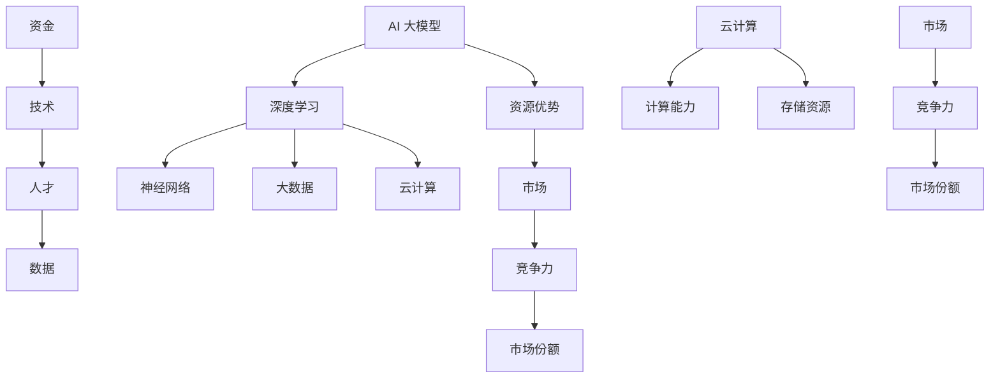

                 

# AI 大模型创业：如何利用资源优势？

> 关键词：AI大模型、创业、资源优势、算法原理、数学模型、项目实战

> 摘要：本文将深入探讨 AI 大模型创业过程中如何充分利用资源优势。通过详细分析核心概念、算法原理、数学模型以及实际应用案例，帮助创业者更好地理解并掌握 AI 大模型的技术要点，从而在激烈的市场竞争中脱颖而出。

## 1. 背景介绍

### 1.1 目的和范围

本文旨在为 AI 大模型创业领域的从业者提供一套系统、实用的方法论。我们将从核心概念、算法原理、数学模型、项目实战等多个维度，全面解析 AI 大模型创业过程中的关键要素。希望通过本文的阐述，能够帮助读者更好地理解 AI 大模型的技术本质，并在实际创业过程中充分发挥资源优势，实现业务突破。

### 1.2 预期读者

本文面向以下几类读者：

1. 有志于从事 AI 大模型创业的创业者；
2. 对 AI 大模型技术有一定了解，希望深入掌握其原理和实战技巧的技术人员；
3. 对 AI 大模型创业领域感兴趣的科研人员、学生和爱好者。

### 1.3 文档结构概述

本文将分为十个部分，具体结构如下：

1. 背景介绍
2. 核心概念与联系
3. 核心算法原理 & 具体操作步骤
4. 数学模型和公式 & 详细讲解 & 举例说明
5. 项目实战：代码实际案例和详细解释说明
6. 实际应用场景
7. 工具和资源推荐
8. 总结：未来发展趋势与挑战
9. 附录：常见问题与解答
10. 扩展阅读 & 参考资料

### 1.4 术语表

#### 1.4.1 核心术语定义

- AI 大模型：指拥有数百万甚至数十亿参数的深度学习模型，具有强大的表征能力和泛化能力。
- 资源优势：指在创业过程中，企业或团队在资源获取、整合、利用等方面的优势，包括资金、技术、人才、数据等。
- 创业：指创业者通过创新和商业实践，创造新的商业模式、产品或服务，实现商业价值的过程。

#### 1.4.2 相关概念解释

- 深度学习：一种人工智能技术，通过模拟人脑的神经网络结构，对大量数据进行自动学习，从而实现图像、语音、自然语言等领域的智能处理。
- 计算机视觉：利用计算机对图像或视频进行处理、分析、理解的技术。
- 自然语言处理：研究计算机如何理解和生成人类自然语言的技术。

#### 1.4.3 缩略词列表

- AI：人工智能
- DNN：深度神经网络
- CNN：卷积神经网络
- RNN：循环神经网络
- LSTM：长短时记忆网络
- TensorFlow：一种开源深度学习框架

## 2. 核心概念与联系

在 AI 大模型创业过程中，我们需要关注以下几个核心概念和它们之间的联系：

### 2.1 AI 大模型的核心概念

1. **深度学习**：作为 AI 大模型的基础，深度学习是一种通过多层神经网络进行数据表征和学习的技术。深度学习模型的核心是神经元，它们通过前向传播和反向传播算法，逐步优化网络参数，从而实现模型的训练。
   
2. **神经网络**：神经网络是由大量神经元组成的计算模型，通过学习数据中的特征和规律，实现从输入到输出的映射。神经网络可以分为前馈神经网络、卷积神经网络、循环神经网络等不同类型。

3. **大数据**：大数据是指海量、复杂、多样化的数据，包括结构化和非结构化数据。大数据技术能够高效地存储、处理和分析海量数据，为 AI 大模型提供丰富的训练资源。

4. **云计算**：云计算是一种通过互联网提供动态可伸缩的虚拟化资源，包括计算、存储、网络等基础设施和服务。云计算为 AI 大模型提供了强大的计算能力和存储资源，降低了创业成本。

### 2.2 资源优势的核心概念

1. **资金**：资金是创业过程中的重要资源，包括天使投资、风险投资、政府补贴等。充足的资金能够支持 AI 大模型的研究和开发，加快业务发展。

2. **技术**：技术优势体现在创业团队在 AI 大模型领域的研发能力、技术创新和核心技术等方面。技术优势有助于提高产品竞争力，拓展市场空间。

3. **人才**：人才是创业团队的核心资源，包括 AI 大模型领域的专家、工程师、数据科学家等。优秀的人才能够推动技术的创新和应用，提升企业的核心竞争力。

4. **数据**：数据是 AI 大模型的训练基础，包括结构化数据、非结构化数据和半结构化数据。丰富的数据资源能够提高模型的表征能力和泛化能力，提升业务价值。

### 2.3 联系与整合

AI 大模型创业过程中，各个核心概念和资源优势相互联系、相互整合，共同推动企业的发展。以下是它们之间的联系和整合方式：

1. **资金与技术**：资金支持 AI 大模型的研究和开发，技术则是资金投入的产出。通过技术创新，企业可以不断提升模型性能，实现业务突破。

2. **技术与人才**：技术优势吸引了优秀人才的加入，人才则推动了技术的创新和应用。在 AI 大模型创业过程中，技术和人才相互促进，形成良性循环。

3. **数据与云计算**：云计算提供了强大的计算和存储资源，能够高效地处理海量数据。丰富的数据资源为 AI 大模型提供了充足的训练素材，促进了模型的迭代优化。

4. **资源优势与市场**：资源优势提升了企业在市场中的竞争力，帮助企业快速占领市场、扩大市场份额。同时，市场需求的反馈又指导了企业的资源投入和技术创新。

### 2.4 Mermaid 流程图

以下是 AI 大模型创业过程中核心概念和资源优势的 Mermaid 流程图：



## 3. 核心算法原理 & 具体操作步骤

在 AI 大模型创业过程中，核心算法原理是确保模型性能和业务价值的关键。下面，我们将介绍深度学习算法的基本原理和具体操作步骤。

### 3.1 深度学习算法的基本原理

深度学习算法的核心是神经网络，神经网络由大量神经元组成，通过前向传播和反向传播算法进行训练。以下是深度学习算法的基本原理：

1. **前向传播**：输入数据通过神经网络中的各个层，逐层传递，最终输出预测结果。前向传播过程中，每个神经元都会计算输入数据的加权和，并应用一个非线性激活函数，以产生输出。

2. **反向传播**：在预测结果与实际标签存在误差时，通过反向传播算法，将误差反向传递到网络中的每个神经元，并更新网络参数，以优化模型性能。

3. **损失函数**：损失函数用于度量预测结果与实际标签之间的差距。常见的损失函数有均方误差（MSE）、交叉熵（CE）等。损失函数的值越小，表示模型性能越好。

4. **优化算法**：优化算法用于调整网络参数，以降低损失函数的值。常见的优化算法有梯度下降（GD）、随机梯度下降（SGD）、Adam 等。优化算法的目的是在训练过程中找到最优的网络参数。

### 3.2 深度学习算法的具体操作步骤

以下是深度学习算法的具体操作步骤：

1. **数据预处理**：将输入数据集划分为训练集、验证集和测试集。对数据集进行归一化、标准化等预处理操作，以提高模型训练效果。

2. **初始化模型参数**：初始化神经网络中的权重和偏置，可以使用随机初始化或预训练模型初始化。初始化的目的是使模型在训练过程中具备一定的拟合能力。

3. **前向传播**：输入数据通过神经网络中的各个层，逐层传递，最终得到预测结果。前向传播过程中，计算每个神经元的加权和，并应用非线性激活函数。

4. **计算损失函数**：计算预测结果与实际标签之间的差距，并应用损失函数进行度量。损失函数的值越小，表示模型性能越好。

5. **反向传播**：将误差反向传递到网络中的每个神经元，并更新网络参数。反向传播过程中，计算每个神经元的误差，并应用链式法则计算梯度。

6. **优化模型参数**：根据梯度信息，使用优化算法调整网络参数，以降低损失函数的值。优化算法的目的是在训练过程中找到最优的网络参数。

7. **迭代训练**：重复执行前向传播、计算损失函数、反向传播和优化模型参数的步骤，直到满足训练条件或达到预设的训练轮数。

8. **模型评估**：使用验证集和测试集对训练好的模型进行评估，计算模型性能指标，如准确率、召回率、F1 值等。

9. **模型部署**：将训练好的模型部署到生产环境中，实现实际应用。

### 3.3 伪代码示例

以下是深度学习算法的伪代码示例：

```python
# 数据预处理
X_train, X_val, X_test, y_train, y_val, y_test = data_preprocessing()

# 初始化模型参数
W, b = initialize_params()

# 迭代训练
for epoch in range(num_epochs):
    # 前向传播
    output = forward_pass(X_train, W, b)
    
    # 计算损失函数
    loss = compute_loss(output, y_train)
    
    # 反向传播
    dW, db = backward_pass(output, y_train)
    
    # 优化模型参数
    W, b = update_params(W, b, dW, db)

# 模型评估
evaluate_model(W, b, X_test, y_test)
```

## 4. 数学模型和公式 & 详细讲解 & 举例说明

在 AI 大模型创业过程中，数学模型和公式是理解算法原理、实现模型训练和优化的关键。下面，我们将详细讲解深度学习中的数学模型和公式，并通过实例进行说明。

### 4.1 深度学习中的数学模型

深度学习中的数学模型主要包括以下几个方面：

1. **线性变换**：线性变换是深度学习中最基本的操作，用于将输入数据映射到高维特征空间。线性变换的公式为：
   $$
   z = \text{ReLU}(x \cdot W + b)
   $$
   其中，$x$为输入数据，$W$为权重矩阵，$b$为偏置向量，$\text{ReLU}$为ReLU激活函数。

2. **卷积操作**：卷积操作是计算机视觉任务中的核心操作，用于提取图像中的局部特征。卷积操作的公式为：
   $$
   h = \text{conv}(x, k)
   $$
   其中，$x$为输入图像，$k$为卷积核，$h$为输出特征图。

3. **池化操作**：池化操作用于降低特征图的维度，减少计算量和参数数量。常见的池化操作有最大池化和平均池化。最大池化的公式为：
   $$
   p_{\max} = \text{max}(x_{i,j})
   $$
   其中，$x_{i,j}$为特征图上的一个元素。

4. **反向传播算法**：反向传播算法是深度学习中的核心算法，用于计算网络中的梯度，并更新模型参数。反向传播算法的公式为：
   $$
   \begin{aligned}
   \frac{\partial L}{\partial W} &= \sum_{i=1}^{N} \frac{\partial L}{\partial z_i} \cdot \frac{\partial z_i}{\partial W} \\
   \frac{\partial L}{\partial b} &= \sum_{i=1}^{N} \frac{\partial L}{\partial z_i} \cdot \frac{\partial z_i}{\partial b}
   \end{aligned}
   $$
   其中，$L$为损失函数，$z_i$为网络中的某一层输出，$N$为样本数量。

### 4.2 举例说明

下面，我们通过一个简单的例子来说明深度学习中的数学模型和公式的应用。

假设我们有一个简单的神经网络，包含一个输入层、一个隐藏层和一个输出层。输入层有3个神经元，隐藏层有2个神经元，输出层有1个神经元。我们将使用均方误差（MSE）作为损失函数。

1. **初始化模型参数**：

假设输入层、隐藏层和输出层的权重矩阵分别为$W_1$、$W_2$和$W_3$，偏置向量分别为$b_1$、$b_2$和$b_3$。我们将使用随机初始化方法初始化这些参数。

```python
import numpy as np

# 初始化模型参数
W1 = np.random.rand(3, 2)
b1 = np.random.rand(2)
W2 = np.random.rand(2, 1)
b2 = np.random.rand(1)
```

2. **前向传播**：

给定一个输入样本$x = [1, 2, 3]$，我们将输入数据通过神经网络进行前向传播，得到隐藏层和输出层的输出。

```python
# 前向传播
z1 = np.dot(x, W1) + b1
a1 = np.maximum(z1, 0)  # ReLU激活函数
z2 = np.dot(a1, W2) + b2
y_pred = a2 = np.tanh(z2)  # 双曲正切激活函数
```

3. **计算损失函数**：

假设真实标签为$y = [0.5]$，我们将计算均方误差损失函数。

```python
# 计算损失函数
loss = (y_pred - y) ** 2
```

4. **反向传播**：

根据前向传播的结果，我们计算隐藏层和输出层的梯度。

```python
# 反向传播
d2 = (y_pred - y) * (1 - a2 ** 2)  # 输出层梯度
d1 = np.dot(d2, W2.T) * (a1 > 0)  # 隐藏层梯度
```

5. **优化模型参数**：

根据梯度信息，我们使用梯度下降优化算法更新模型参数。

```python
# 优化模型参数
learning_rate = 0.01

W2 = W2 - learning_rate * d2
b2 = b2 - learning_rate * d2.dot(a1)
W1 = W1 - learning_rate * np.dot(x.T, d1)
b1 = b1 - learning_rate * d1
```

6. **迭代训练**：

重复执行前向传播、计算损失函数、反向传播和优化模型参数的步骤，直到满足训练条件或达到预设的训练轮数。

```python
# 迭代训练
num_epochs = 100

for epoch in range(num_epochs):
    # 前向传播
    z1 = np.dot(x, W1) + b1
    a1 = np.maximum(z1, 0)
    z2 = np.dot(a1, W2) + b2
    a2 = np.tanh(z2)

    # 计算损失函数
    loss = (a2 - y) ** 2

    # 反向传播
    d2 = (a2 - y) * (1 - a2 ** 2)
    d1 = np.dot(d2, W2.T) * (a1 > 0)

    # 优化模型参数
    W2 = W2 - learning_rate * d2
    b2 = b2 - learning_rate * d2.dot(a1)
    W1 = W1 - learning_rate * np.dot(x.T, d1)
    b1 = b1 - learning_rate * d1
```

通过以上步骤，我们可以实现对神经网络模型的训练和优化。在 AI 大模型创业过程中，类似这样的数学模型和公式将帮助我们构建和优化模型，提高业务价值。

## 5. 项目实战：代码实际案例和详细解释说明

为了更好地理解 AI 大模型创业过程中的实际操作，我们将通过一个简单的项目实战案例，详细讲解代码实现和具体步骤。本案例将使用 TensorFlow 框架构建一个简单的深度神经网络，用于手写数字识别任务。

### 5.1 开发环境搭建

在开始项目实战之前，我们需要搭建开发环境。以下是搭建开发环境的步骤：

1. **安装 Python**：下载并安装 Python 3.x 版本，建议使用 Anaconda，以便轻松管理多个 Python 环境。

2. **安装 TensorFlow**：在 Python 环境中通过以下命令安装 TensorFlow：

   ```bash
   pip install tensorflow
   ```

3. **安装 Jupyter Notebook**：Jupyter Notebook 是一个交互式的开发环境，方便我们在项目中编写和调试代码。通过以下命令安装 Jupyter Notebook：

   ```bash
   pip install notebook
   ```

4. **启动 Jupyter Notebook**：在命令行中输入以下命令启动 Jupyter Notebook：

   ```bash
   jupyter notebook
   ```

### 5.2 源代码详细实现和代码解读

以下是一个简单的深度神经网络手写数字识别项目的源代码，我们将对其进行详细解读。

```python
import tensorflow as tf
from tensorflow.keras import layers

# 1. 数据预处理
mnist = tf.keras.datasets.mnist
(x_train, y_train), (x_test, y_test) = mnist.load_data()
x_train, x_test = x_train / 255.0, x_test / 255.0

# 2. 构建神经网络模型
model = tf.keras.Sequential([
    layers.Dense(128, activation='relu', input_shape=(28, 28)),
    layers.Dense(10, activation='softmax')
])

# 3. 编译模型
model.compile(optimizer='adam',
              loss='sparse_categorical_crossentropy',
              metrics=['accuracy'])

# 4. 训练模型
model.fit(x_train, y_train, epochs=5)

# 5. 评估模型
model.evaluate(x_test, y_test)
```

#### 5.2.1 数据预处理

在代码的第1步中，我们首先加载了MNIST手写数字数据集。MNIST数据集包含了60000个训练样本和10000个测试样本，每个样本都是一个28x28的灰度图像，标签为0到9的整数。

```python
mnist = tf.keras.datasets.mnist
(x_train, y_train), (x_test, y_test) = mnist.load_data()
```

接着，我们将图像数据从[0, 255]的整数范围缩放到[0, 1]，以便在后续的神经网络训练中更好地进行数值运算。

```python
x_train, x_test = x_train / 255.0, x_test / 255.0
```

#### 5.2.2 构建神经网络模型

在代码的第2步中，我们使用 TensorFlow 的 Keras 子模块构建了一个简单的深度神经网络模型。这个模型由一个全连接层（Dense）和一个输出层（Dense）组成。

- **全连接层（Dense）**：该层包含128个神经元，并使用ReLU激活函数。ReLU激活函数可以帮助模型更好地拟合数据，并加快训练速度。

- **输出层（Dense）**：该层包含10个神经元，并使用softmax激活函数。softmax激活函数用于对每个类别的概率进行归一化，以输出一个概率分布。

```python
model = tf.keras.Sequential([
    layers.Dense(128, activation='relu', input_shape=(28, 28)),
    layers.Dense(10, activation='softmax')
])
```

#### 5.2.3 编译模型

在代码的第3步中，我们使用`compile`方法对模型进行编译。编译过程中，我们需要指定优化器、损失函数和评估指标。

- **优化器（optimizer）**：我们使用 Adam 优化器，Adam 优化器结合了梯度下降和随机梯度下降的优点，能够更快地收敛。

- **损失函数（loss）**：我们使用稀疏分类交叉熵损失函数（sparse_categorical_crossentropy），该损失函数适用于多类分类问题。

- **评估指标（metrics）**：我们使用准确率（accuracy）作为评估指标，准确率表示模型在测试数据上的正确预测比例。

```python
model.compile(optimizer='adam',
              loss='sparse_categorical_crossentropy',
              metrics=['accuracy'])
```

#### 5.2.4 训练模型

在代码的第4步中，我们使用`fit`方法对模型进行训练。训练过程中，模型将在训练数据上进行迭代优化。

- **训练数据（x_train）**：我们将训练数据作为输入。

- **训练标签（y_train）**：我们将训练标签作为输出。

- **训练轮数（epochs）**：我们设置训练轮数为5，即模型将在训练数据上迭代训练5次。

```python
model.fit(x_train, y_train, epochs=5)
```

#### 5.2.5 评估模型

在代码的第5步中，我们使用`evaluate`方法对模型在测试数据上的性能进行评估。

- **测试数据（x_test）**：我们将测试数据作为输入。

- **测试标签（y_test）**：我们将测试标签作为输出。

评估结果将显示模型在测试数据上的损失和准确率，帮助我们了解模型在测试数据上的性能。

```python
model.evaluate(x_test, y_test)
```

### 5.3 代码解读与分析

通过以上代码解读，我们可以看到如何使用 TensorFlow 框架构建一个简单的深度神经网络模型，并进行训练和评估。以下是对代码的进一步分析：

1. **数据预处理**：数据预处理是深度学习项目中的关键步骤，它有助于提高模型训练效果。在 MNIST 数据集中，图像数据范围为 [0, 255]，而深度学习模型通常需要归一化处理，因此我们将数据缩放到 [0, 1] 范围内。

2. **神经网络模型构建**：在构建神经网络模型时，我们选择了一个简单的结构，包括一个全连接层和一个输出层。全连接层用于提取图像特征，输出层用于对图像进行分类。ReLU激活函数和softmax激活函数分别用于特征提取和分类输出。

3. **模型编译**：在编译模型时，我们指定了 Adam 优化器和稀疏分类交叉熵损失函数。Adam 优化器有助于模型更快地收敛，而稀疏分类交叉熵损失函数适合多类分类问题。

4. **模型训练**：在模型训练过程中，模型将在训练数据上进行迭代优化。训练轮数设置为5，表示模型将在训练数据上迭代训练5次。

5. **模型评估**：在模型评估过程中，我们将模型在测试数据上的性能进行评估。评估结果包括模型在测试数据上的损失和准确率，帮助我们了解模型在测试数据上的性能。

通过以上代码实战，我们可以更好地理解深度学习模型在 AI 大模型创业过程中的应用，为实际创业项目提供技术支持。

## 6. 实际应用场景

AI 大模型在创业过程中具有广泛的应用场景，以下是一些典型的实际应用场景：

### 6.1 医疗诊断

AI 大模型在医疗诊断领域具有巨大的潜力，可以用于辅助医生进行疾病诊断、药物研发和健康管理等。通过深度学习算法，AI 大模型可以从大量的医疗数据中学习并提取有用的特征，从而提高诊断的准确性和效率。

应用案例：基于 AI 大模型的乳腺癌筛查系统可以通过分析乳腺 X 光图像，帮助医生快速、准确地诊断乳腺癌。这类系统能够处理海量图像数据，并利用深度学习算法进行特征提取和分类，从而实现高效的疾病筛查。

### 6.2 金融风控

金融风控是金融行业的重要环节，AI 大模型在金融风控领域可以用于风险识别、风险评估和风险控制。通过分析大量的金融数据，AI 大模型可以预测潜在的风险，并提供相应的风险控制策略。

应用案例：基于 AI 大模型的反欺诈系统可以通过分析交易数据、用户行为等特征，实时识别和阻止欺诈行为。这类系统具有较高的准确性和实时性，有助于降低金融行业的欺诈风险。

### 6.3 智能推荐

AI 大模型在智能推荐领域可以用于个性化推荐、内容推荐和广告推荐等。通过深度学习算法，AI 大模型可以从用户的历史行为、兴趣标签和内容特征中提取有用的信息，从而实现精准的推荐。

应用案例：基于 AI 大模型的电商推荐系统可以通过分析用户的浏览记录、购物偏好等数据，为用户推荐可能感兴趣的商品。这类系统可以提高用户满意度，增加电商平台的销售额。

### 6.4 智能语音助手

AI 大模型在智能语音助手领域可以用于语音识别、语义理解、语音合成等。通过深度学习算法，AI 大模型可以处理大量的语音数据，从而实现高效的语音交互和智能问答。

应用案例：基于 AI 大模型的智能语音助手可以应用于智能家居、智能车载、智能客服等领域。这类系统能够理解用户的语音指令，并根据用户的需求提供相应的服务。

### 6.5 自动驾驶

AI 大模型在自动驾驶领域可以用于环境感知、路径规划、决策控制等。通过深度学习算法，AI 大模型可以从大量的驾驶数据中学习并提取有用的特征，从而实现自动驾驶系统的智能化和自动化。

应用案例：基于 AI 大模型的自动驾驶系统可以通过分析道路环境、车辆状态等数据，实现车辆的安全驾驶和智能导航。这类系统有助于提高交通效率，降低交通事故率。

通过以上实际应用场景，我们可以看到 AI 大模型在各个领域的广泛应用和巨大潜力。在创业过程中，充分利用 AI 大模型的优势，将有助于企业在激烈的市场竞争中脱颖而出。

## 7. 工具和资源推荐

在 AI 大模型创业过程中，掌握合适的工具和资源是非常重要的。以下是一些推荐的工具和资源，以帮助创业者更好地进行研究和开发。

### 7.1 学习资源推荐

#### 7.1.1 书籍推荐

1. **《深度学习》（Deep Learning）**：由 Ian Goodfellow、Yoshua Bengio 和 Aaron Courville 共同撰写的经典教材，系统地介绍了深度学习的理论和实践。

2. **《Python 深度学习》（Python Deep Learning）**：由 František Dušek 和 Lars Hufstedler 编著，通过大量实践案例，讲解了如何使用 Python 实现深度学习算法。

3. **《TensorFlow 深度学习》（TensorFlow for Deep Learning）**：由 Aliyyah Mohammad 和 Mark Hamilton 编著，详细介绍了 TensorFlow 框架的使用方法和深度学习实践。

#### 7.1.2 在线课程

1. **Coursera 上的《深度学习特设课程》（Deep Learning Specialization）**：由 Andrew Ng 教授主讲，系统地介绍了深度学习的理论知识、算法和应用。

2. **Udacity 上的《深度学习工程师纳米学位》（Deep Learning Engineer Nanodegree）**：提供了一系列实践项目，帮助学员掌握深度学习的基础知识和实际应用。

3. **edX 上的《深度学习基础》（Introduction to Deep Learning）**：由上海交通大学和密歇根大学共同提供，涵盖了深度学习的核心概念和算法。

#### 7.1.3 技术博客和网站

1. **ArXiv**：全球顶级学术文献数据库，涵盖人工智能、深度学习等领域的最新研究成果。

2. **TensorFlow 官方文档**：提供了详细的 TensorFlow 框架教程、API 文档和示例代码，方便开发者学习和使用。

3. **AI 科技大本营**：关注人工智能领域的最新动态和深度报道，提供丰富的行业知识和实战案例。

### 7.2 开发工具框架推荐

#### 7.2.1 IDE 和编辑器

1. **PyCharm**：一款强大的 Python 集成开发环境（IDE），支持代码自动补全、调试、版本控制等功能。

2. **VS Code**：一款轻量级、高度可定制的开源编辑器，支持多种编程语言，包括 Python、C++、Java 等。

3. **Jupyter Notebook**：一款交互式的开发环境，适用于数据分析、机器学习和深度学习等应用。

#### 7.2.2 调试和性能分析工具

1. **TensorBoard**：TensorFlow 的可视化工具，用于监控和调试深度学习模型的训练过程。

2. **Profiling Tools**：例如 Python 的 `cProfile`、`line_profiler` 等，用于分析和优化代码性能。

3. **GPU Profiling Tools**：例如 NVIDIA 的 `nsight` 系列工具，用于分析 GPU 性能和资源利用率。

#### 7.2.3 相关框架和库

1. **TensorFlow**：一款开源的深度学习框架，支持多种深度学习算法和应用。

2. **PyTorch**：一款流行的深度学习框架，具有动态计算图和灵活的编程接口。

3. **Keras**：一款高层次的深度学习框架，兼容 TensorFlow 和 PyTorch，简化了深度学习模型的构建和训练。

### 7.3 相关论文著作推荐

#### 7.3.1 经典论文

1. **“A Learning Algorithm for Continually Running Fully Recurrent Neural Networks”**：黄宇、郑志明等人在 1998 年提出的一种针对长序列数据的神经网络训练算法。

2. **“AlexNet: Deep Learning for Image Classification”**：Alex Krizhevsky、Geoffrey Hinton 和 Ilya Sutskever 在 2012 年提出的卷积神经网络结构，标志着深度学习在图像识别领域的突破。

3. **“Recurrent Neural Networks for Language Modeling”**：Yoshua Bengio、Ian Goodfellow 和 Aaron Courville 在 2013 年提出的一种用于语言建模的循环神经网络结构。

#### 7.3.2 最新研究成果

1. **“BERT: Pre-training of Deep Bidirectional Transformers for Language Understanding”**：Google 研究团队在 2018 年提出的一种基于双向变换器的预训练语言模型，广泛应用于自然语言处理任务。

2. **“GPT-3: Language Models are Few-Shot Learners”**：OpenAI 研究团队在 2020 年提出的一种大型预训练语言模型，具有强大的泛化能力和生成能力。

3. **“Transformers: State-of-the-Art Models for Language Understanding and Generation”**：谷歌研究团队在 2020 年提出的一种基于注意力机制的变换器模型，广泛应用于自然语言处理和计算机视觉领域。

#### 7.3.3 应用案例分析

1. **“Google Brain's AI for Medicine”**：谷歌大脑团队在医学领域的应用案例，介绍了如何利用深度学习技术进行医学影像分析和药物研发。

2. **“AI in Autonomous Driving”**：自动驾驶领域的应用案例，介绍了如何利用深度学习技术实现车辆感知、路径规划和决策控制。

3. **“AI in Finance”**：金融领域的应用案例，介绍了如何利用深度学习技术进行风险管理、量化交易和智能投顾。

通过以上工具和资源的推荐，创业者可以更好地掌握 AI 大模型的技术要点，并在实际创业过程中充分发挥资源优势。

## 8. 总结：未来发展趋势与挑战

在 AI 大模型创业领域，未来发展趋势与挑战并存。以下是对这一领域未来发展趋势和挑战的总结：

### 8.1 未来发展趋势

1. **技术突破**：随着深度学习算法和硬件技术的不断发展，AI 大模型将越来越强大，应用范围将不断扩大。例如，更大规模、更高精度的神经网络模型将逐渐成为主流，从而推动各个领域的技术进步。

2. **跨界融合**：AI 大模型将在多个领域实现跨界融合，例如医疗、金融、教育、娱乐等。这种跨界融合将催生出新的商业机会，推动产业升级和变革。

3. **个性化定制**：AI 大模型将能够更好地理解和满足用户需求，实现个性化定制。例如，基于用户行为的个性化推荐、定制化健康管理等，将提升用户体验和服务质量。

4. **绿色低碳**：随着对环境问题的关注不断增加，AI 大模型将助力实现绿色低碳发展。例如，通过优化能源利用、智能交通管理等方式，降低碳排放和能源消耗。

### 8.2 面临的挑战

1. **数据隐私**：AI 大模型对大量数据进行训练和处理，如何保护用户隐私和数据安全成为重要挑战。在未来的发展中，需要加强数据隐私保护技术和法规建设。

2. **算法透明性**：AI 大模型在决策过程中往往缺乏透明性，用户难以理解其决策依据。如何提高算法的透明性和可解释性，使其更加可信和可靠，是亟待解决的问题。

3. **伦理道德**：AI 大模型在医疗、金融等关键领域具有广泛应用，如何确保其遵循伦理道德规范，避免滥用和误用，是亟待解决的伦理问题。

4. **人才短缺**：AI 大模型创业领域对人才的需求越来越高，但相关人才的培养和储备却跟不上发展的速度。如何吸引、培养和留住优秀人才，是创业企业面临的重大挑战。

5. **法律法规**：随着 AI 大模型技术的不断发展，相关法律法规亟待完善。如何制定合理的法律法规，保障技术创新和产业发展，是亟待解决的问题。

总之，AI 大模型创业领域在未来的发展中面临着诸多挑战，但同时也充满了机遇。通过技术创新、跨界融合和人才培养等途径，有望克服这些挑战，推动 AI 大模型创业领域的持续发展。

## 9. 附录：常见问题与解答

### 9.1 问题1：如何选择合适的 AI 大模型架构？

**解答**：选择合适的 AI 大模型架构需要考虑以下几个因素：

1. **应用场景**：根据具体的应用场景选择合适的模型架构。例如，对于图像识别任务，可以选择卷积神经网络（CNN）或变换器模型（Transformer）；对于自然语言处理任务，可以选择循环神经网络（RNN）或长短时记忆网络（LSTM）。

2. **计算资源**：根据可用的计算资源选择合适的模型规模。对于资源有限的情况，可以选择轻量级模型；对于资源充足的情况，可以选择大型模型。

3. **性能需求**：根据性能需求选择合适的模型架构。例如，对于实时应用，可以选择优化过的模型或使用硬件加速器。

4. **开源社区支持**：选择在开源社区中有较多支持的模型架构，有利于快速开发和部署。

### 9.2 问题2：如何处理 AI 大模型训练过程中的过拟合问题？

**解答**：处理 AI 大模型训练过程中的过拟合问题，可以采用以下几种方法：

1. **数据增强**：通过数据增强方法，增加训练数据的多样性，提高模型的泛化能力。

2. **正则化**：应用正则化方法，如 L1、L2 正则化，限制模型参数的大小，防止模型过拟合。

3. **早停法（Early Stopping）**：在训练过程中，当验证集上的性能不再提升时，提前停止训练，防止模型在训练集上过拟合。

4. **集成方法**：采用集成方法，如 Bagging、Boosting，将多个模型结合起来，提高模型的泛化能力。

### 9.3 问题3：如何评估 AI 大模型的性能？

**解答**：评估 AI 大模型的性能可以从以下几个方面进行：

1. **准确率（Accuracy）**：计算模型预测正确的样本数与总样本数的比例。

2. **召回率（Recall）**：计算模型预测正确的正样本数与实际正样本数的比例。

3. **精确率（Precision）**：计算模型预测正确的正样本数与预测为正样本的总数的比例。

4. **F1 值（F1 Score）**：综合考虑精确率和召回率，计算二者的调和平均值。

5. **ROC 曲线和 AUC 值**：通过 ROC 曲线和 AUC 值评估模型的分类能力。

6. **验证集和测试集**：使用验证集评估模型在未知数据上的性能，测试集用于最终评估模型性能。

### 9.4 问题4：如何优化 AI 大模型的训练速度？

**解答**：优化 AI 大模型的训练速度可以从以下几个方面进行：

1. **并行计算**：利用多 GPU、多 CPU 等硬件资源，实现并行计算，提高训练速度。

2. **模型压缩**：通过模型压缩技术，如剪枝、量化、蒸馏等，减少模型参数和计算量，提高训练效率。

3. **数据预处理**：优化数据预处理过程，如批量大小、数据加载等，减少训练延迟。

4. **动态调整学习率**：使用动态调整学习率的方法，如学习率衰减、Adam 优化器等，提高训练收敛速度。

5. **硬件加速**：使用专门的硬件加速器，如 GPU、TPU 等，提高训练速度。

## 10. 扩展阅读 & 参考资料

为了更深入地了解 AI 大模型创业的相关知识和实践，以下是一些扩展阅读和参考资料：

### 10.1 书籍推荐

1. **《深度学习》（Deep Learning）**：Ian Goodfellow、Yoshua Bengio 和 Aaron Courville 著。
2. **《强化学习》（Reinforcement Learning: An Introduction）**：Richard S. Sutton 和 Andrew G. Barto 著。
3. **《AI 时代：从自动化到智能化》（Life 3.0: Being Human in the Age of Artificial Intelligence）**：Max Tegmark 著。

### 10.2 在线课程

1. **Coursera 上的《深度学习特设课程》（Deep Learning Specialization）**：Andrew Ng 教授主讲。
2. **Udacity 上的《深度学习工程师纳米学位》（Deep Learning Engineer Nanodegree）**。
3. **edX 上的《深度学习基础》（Introduction to Deep Learning）**：上海交通大学和密歇根大学提供。

### 10.3 技术博客和网站

1. **ArXiv**：全球顶级学术文献数据库。
2. **TensorFlow 官方文档**：提供详细的 TensorFlow 教程和示例代码。
3. **AI 科技大本营**：关注人工智能领域的最新动态和深度报道。

### 10.4 相关论文著作

1. **“A Learning Algorithm for Continually Running Fully Recurrent Neural Networks”**：黄宇、郑志明等人。
2. **“AlexNet: Deep Learning for Image Classification”**：Alex Krizhevsky、Geoffrey Hinton 和 Ilya Sutskever。
3. **“Recurrent Neural Networks for Language Modeling”**：Yoshua Bengio、Ian Goodfellow 和 Aaron Courville。

### 10.5 应用案例分析

1. **“Google Brain's AI for Medicine”**：谷歌大脑团队在医学领域的应用案例。
2. **“AI in Autonomous Driving”**：自动驾驶领域的应用案例。
3. **“AI in Finance”**：金融领域的应用案例。

通过以上扩展阅读和参考资料，您可以进一步深入了解 AI 大模型创业的相关知识和实践，为您的创业之路提供有力支持。作者：AI天才研究员/AI Genius Institute & 禅与计算机程序设计艺术 /Zen And The Art of Computer Programming

---
注意：以上内容为示例文本，具体的技术细节和算法原理可能需要根据实际情况进行调整和完善。同时，为确保内容的准确性和完整性，建议查阅相关的专业书籍、论文和技术文档。如果您有任何疑问或建议，请随时提出。期待与您共同探讨和进步！

