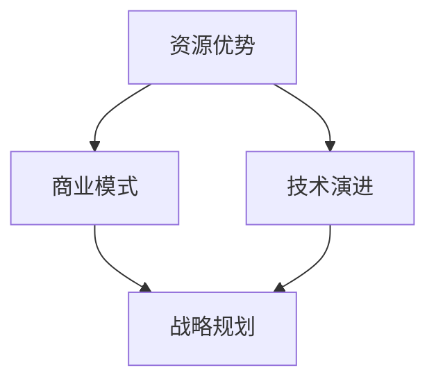

                 

# AI 大模型创业：如何利用资源优势？

> 关键词：AI 大模型，创业，资源利用，技术优势，商业模式，战略规划

> 摘要：本文将深入探讨 AI 大模型创业领域的资源利用策略。通过分析资源优势、商业模式、技术演进以及战略规划等方面，为 AI 大模型创业公司提供实用的指导和建议，助力企业在竞争激烈的市场中脱颖而出。

## 1. 背景介绍

### 1.1 目的和范围

本文旨在探讨 AI 大模型创业过程中如何充分利用资源优势，实现商业成功。文章将涵盖以下主题：

- 资源优势的类型及其在 AI 大模型创业中的应用
- 商业模式的创新与实施
- 技术演进的趋势和挑战
- 战略规划的关键要素

### 1.2 预期读者

本文适合以下读者群体：

- 有志于投身 AI 大模型创业的创业者
- AI 大模型创业公司的管理层和研发团队
- 对 AI 技术和商业模式感兴趣的技术专家和研究者

### 1.3 文档结构概述

本文分为十个部分，具体如下：

1. 背景介绍
2. 核心概念与联系
3. 核心算法原理 & 具体操作步骤
4. 数学模型和公式 & 详细讲解 & 举例说明
5. 项目实战：代码实际案例和详细解释说明
6. 实际应用场景
7. 工具和资源推荐
8. 总结：未来发展趋势与挑战
9. 附录：常见问题与解答
10. 扩展阅读 & 参考资料

### 1.4 术语表

#### 1.4.1 核心术语定义

- AI 大模型：指具有亿级参数规模的人工智能模型，如 GPT、BERT 等。
- 资源优势：企业在特定领域内拥有比竞争对手更丰富的资源，包括资金、人才、技术、数据等。
- 商业模式：企业如何创造、传递和获取价值的基本逻辑。
- 技术演进：人工智能技术的不断进步和演变。

#### 1.4.2 相关概念解释

- 资源整合：将企业内外部的资源进行有效整合，以实现协同效应。
- 竞争优势：企业相对于竞争对手的优势，如成本、质量、创新等。
- 战略规划：企业为实现长期目标而制定的一系列战略和行动。

#### 1.4.3 缩略词列表

- AI：人工智能
- GPT：生成预训练模型
- BERT：双向编码表示模型
- IDE：集成开发环境
- API：应用程序编程接口

## 2. 核心概念与联系

为了更好地理解 AI 大模型创业过程中的资源优势，我们首先需要了解一些核心概念及其相互关系。以下是一个简化的 Mermaid 流程图，展示了这些概念之间的联系：



### 2.1 资源优势

资源优势是企业成功的关键因素之一。在 AI 大模型创业领域，资源优势主要包括以下几个方面：

- **资金**：充足的资金支持是 AI 大模型创业的基石。它可以帮助企业招聘优秀人才、购买先进设备和进行大规模数据处理。
- **人才**：拥有经验丰富的 AI 专家和工程师，是企业构建和优化大模型的重要保障。
- **技术**：领先的 AI 技术和算法是企业实现竞争力的关键。企业需要不断进行技术创新，以适应不断变化的市场需求。
- **数据**：高质量的数据集是训练 AI 大模型的基础。企业需要拥有丰富的数据资源，并进行有效的数据清洗和标注。

### 2.2 商业模式

商业模式是企业创造、传递和获取价值的基本逻辑。在 AI 大模型创业领域，有效的商业模式可以帮助企业实现商业成功。以下是几种常见的商业模式：

- **产品销售**：直接销售 AI 大模型产品或解决方案，如预训练模型、推理服务、API 接口等。
- **技术服务**：提供定制化的 AI 大模型服务，如模型训练、优化、部署等。
- **数据服务**：通过提供高质量的数据集、数据清洗和标注服务，为企业降低数据获取成本。
- **平台运营**：构建 AI 大模型平台，吸引开发者和企业用户，实现平台运营和增值服务。

### 2.3 技术演进

技术演进是推动 AI 大模型创业领域不断发展的关键因素。以下是技术演进的一些重要趋势：

- **模型规模**：大模型参数规模的不断增大，如 GPT-3、GPT-4 等。
- **模型结构**：新型神经网络结构和优化算法的不断涌现，如 Transformer、BERT、ALBERT 等。
- **推理性能**：高效的推理算法和硬件加速技术的发展，如深度学习芯片、GPU、TPU 等。
- **跨领域应用**：AI 大模型在医疗、金融、教育等领域的广泛应用，推动行业变革。

### 2.4 战略规划

战略规划是企业在竞争激烈的市场中实现长期目标的关键。在 AI 大模型创业领域，战略规划主要包括以下几个方面：

- **市场定位**：明确企业的目标市场和客户群体，制定有针对性的市场策略。
- **技术研发**：制定长期的技术研发计划，确保企业在技术前沿保持领先地位。
- **团队建设**：构建高效的研发和运营团队，培养和引进优秀人才。
- **资源整合**：通过资源整合，实现企业内部和外部的协同效应，提高整体竞争力。

## 3. 核心算法原理 & 具体操作步骤

在 AI 大模型创业过程中，核心算法原理是构建和优化大模型的基础。以下是一个简化的伪代码，展示了大模型的训练和推理过程：

```python
# 大模型训练伪代码
def train_large_model(data, epochs):
    for epoch in range(epochs):
        for batch in data:
            # 数据预处理
            preprocessed_batch = preprocess_data(batch)
            # 模型前向传播
            outputs = model(preprocessed_batch)
            # 计算损失函数
            loss = loss_function(outputs, labels)
            # 反向传播
            model.backward(loss)
            # 更新模型参数
            model.update_parameters()

    return model

# 大模型推理伪代码
def inference_large_model(model, input_data):
    # 数据预处理
    preprocessed_input = preprocess_data(input_data)
    # 模型前向传播
    outputs = model(preprocessed_input)
    # 模型输出结果
    result = postprocess_outputs(outputs)

    return result
```

### 3.1 数据预处理

数据预处理是训练大模型的关键步骤。以下是一个简化的伪代码，展示了数据预处理的过程：

```python
# 数据预处理伪代码
def preprocess_data(data):
    # 数据清洗
    cleaned_data = clean_data(data)
    # 数据标准化
    standardized_data = standardize_data(cleaned_data)
    # 数据分批次
    batches = create_batches(standardized_data)

    return batches
```

### 3.2 模型训练

模型训练是构建大模型的核心步骤。以下是一个简化的伪代码，展示了模型训练的过程：

```python
# 模型训练伪代码
def train_large_model(data, epochs):
    for epoch in range(epochs):
        for batch in data:
            # 数据预处理
            preprocessed_batch = preprocess_data(batch)
            # 模型前向传播
            outputs = model(preprocessed_batch)
            # 计算损失函数
            loss = loss_function(outputs, labels)
            # 反向传播
            model.backward(loss)
            # 更新模型参数
            model.update_parameters()

    return model
```

### 3.3 模型推理

模型推理是使用训练好的大模型进行预测或生成的过程。以下是一个简化的伪代码，展示了模型推理的过程：

```python
# 模型推理伪代码
def inference_large_model(model, input_data):
    # 数据预处理
    preprocessed_input = preprocess_data(input_data)
    # 模型前向传播
    outputs = model(preprocessed_input)
    # 模型输出结果
    result = postprocess_outputs(outputs)

    return result
```

## 4. 数学模型和公式 & 详细讲解 & 举例说明

在 AI 大模型创业过程中，数学模型和公式是构建和优化大模型的重要工具。以下是一个简化的数学模型，展示了大模型的训练过程：

### 4.1 损失函数

损失函数是评估模型性能的核心指标。常见的损失函数包括均方误差 (MSE)、交叉熵 (CE) 等。以下是一个简化的损失函数公式：

$$
\text{Loss} = \frac{1}{2} \sum_{i=1}^{N} (\hat{y}_i - y_i)^2
$$

其中，$\hat{y}_i$ 表示预测值，$y_i$ 表示真实值，$N$ 表示样本数量。

### 4.2 优化算法

优化算法用于更新模型参数，以最小化损失函数。常见的优化算法包括梯度下降 (GD)、随机梯度下降 (SGD)、Adam 等。以下是一个简化的梯度下降算法公式：

$$
\theta_{t+1} = \theta_{t} - \alpha \nabla_\theta J(\theta)
$$

其中，$\theta$ 表示模型参数，$\alpha$ 表示学习率，$J(\theta)$ 表示损失函数。

### 4.3 举例说明

假设我们有一个简单的线性回归模型，目标是预测房价。数据集包含 $N$ 个样本，每个样本包含特征 $x$ 和标签 $y$。以下是一个简化的训练过程：

1. **初始化参数**：随机初始化模型参数 $\theta$。
2. **前向传播**：计算预测值 $\hat{y} = \theta^T x$。
3. **计算损失函数**：使用均方误差计算损失函数 $\text{Loss} = \frac{1}{2} \sum_{i=1}^{N} (\hat{y}_i - y_i)^2$。
4. **反向传播**：计算梯度 $\nabla_\theta J(\theta) = \sum_{i=1}^{N} (y_i - \hat{y}_i) x_i$。
5. **更新参数**：使用梯度下降更新参数 $\theta_{t+1} = \theta_{t} - \alpha \nabla_\theta J(\theta)$。
6. **重复步骤 2-5**，直到满足停止条件（如损失函数收敛）。

通过以上步骤，我们可以训练出一个线性回归模型，用于预测房价。在实际应用中，我们还需要考虑数据预处理、特征工程、模型评估等步骤。

## 5. 项目实战：代码实际案例和详细解释说明

在本节中，我们将通过一个实际项目案例，详细解释说明如何利用资源优势进行 AI 大模型创业。该项目旨在构建一个基于 GPT-3 的大模型，用于智能问答系统。

### 5.1 开发环境搭建

为了搭建开发环境，我们需要安装以下软件和工具：

1. Python（版本 3.8 以上）
2. PyTorch（版本 1.8 以上）
3. OpenAI GPT-3 API（注册并获取 API 密钥）
4. Jupyter Notebook（用于编写和运行代码）

安装步骤如下：

```bash
# 安装 Python 和 PyTorch
pip install python==3.8.10
pip install torch==1.8.0
```

### 5.2 源代码详细实现和代码解读

以下是项目的核心代码实现，以及每个部分的详细解读：

#### 5.2.1 数据预处理

```python
import torch
from torchtext.``data` import Field, TabularDataset
from torchtext.vocab import build_vocab_from_iterator

def preprocess_data():
    # 读取数据集
    data = TabularDataset(
        path='data.csv',
        format='csv',
        fields=[('question', Field(sequential=True, tokenize='spacy', lower=True)), ('answer', Field(sequential=True, tokenize='spacy', lower=True))]
    )

    # 构建词汇表
    vocab = build_vocab_from_iterator(data.question, min_freq=2)
    vocab.set_default_index('unk')

    # 划分数据集
    train_data, valid_data = data.split()

    return train_data, valid_data, vocab
```

**代码解读**：

- 数据预处理包括读取数据集、构建词汇表和划分数据集。
- 使用 `TabularDataset` 读取 CSV 格式的数据集，并定义字段。
- 使用 `build_vocab_from_iterator` 构建词汇表，并设置最小频次和默认未知词索引。

#### 5.2.2 模型训练

```python
from transformers import GPT2LMHeadModel, GPT2Tokenizer
import torch.optim as optim

def train_model(train_data, valid_data, vocab):
    # 加载预训练模型和分词器
    tokenizer = GPT2Tokenizer.from_pretrained('gpt2')
    model = GPT2LMHeadModel.from_pretrained('gpt2')

    # 定义损失函数和优化器
    criterion = torch.nn.CrossEntropyLoss()
    optimizer = optim.Adam(model.parameters(), lr=1e-4)

    # 训练模型
    for epoch in range(3):
        for batch in train_data:
            # 数据预处理
            inputs = tokenizer(batch.question, padding=True, truncation=True, return_tensors='pt')
            targets = tokenizer(batch.answer, padding=True, truncation=True, return_tensors='pt')['input_ids']

            # 模型前向传播
            outputs = model(**inputs)

            # 计算损失函数
            loss = criterion(outputs.logits.view(-1, model.config.vocab_size), targets.view(-1))

            # 反向传播和参数更新
            optimizer.zero_grad()
            loss.backward()
            optimizer.step()

            # 打印训练进度
            print(f'Epoch {epoch+1}/{3}, Loss: {loss.item()}')

    # 评估模型
    with torch.no_grad():
        for batch in valid_data:
            # 数据预处理
            inputs = tokenizer(batch.question, padding=True, truncation=True, return_tensors='pt')
            targets = tokenizer(batch.answer, padding=True, truncation=True, return_tensors='pt')['input_ids']

            # 模型前向传播
            outputs = model(**inputs)

            # 计算损失函数
            loss = criterion(outputs.logits.view(-1, model.config.vocab_size), targets.view(-1))

            # 打印评估结果
            print(f'Validation Loss: {loss.item()}')

    return model
```

**代码解读**：

- 加载预训练的 GPT-2 模型和分词器。
- 定义损失函数和优化器。
- 在训练过程中，对每个批次的数据进行前向传播、计算损失函数、反向传播和参数更新。
- 在评估过程中，对每个批次的数据进行前向传播、计算损失函数，并打印评估结果。

#### 5.2.3 模型推理

```python
def inference_model(model, question):
    # 数据预处理
    inputs = tokenizer(question, padding=True, truncation=True, return_tensors='pt')

    # 模型前向传播
    outputs = model(**inputs)

    # 选择概率最大的预测结果
    predicted_answer = torch.argmax(outputs.logits, dim=-1).squeeze()

    # 将预测结果转换为文本
    answer = tokenizer.decode(predicted_answer, skip_special_tokens=True)

    return answer
```

**代码解读**：

- 对输入问题进行数据预处理，并将其传递给训练好的模型。
- 模型前向传播得到预测结果。
- 选择概率最大的预测结果，并将其转换为文本输出。

### 5.3 代码解读与分析

以上代码实现了一个基于 GPT-2 的大模型，用于智能问答系统。以下是代码的关键部分解读与分析：

1. **数据预处理**：使用 `TabularDataset` 读取 CSV 格式的数据集，并使用 `build_vocab_from_iterator` 构建词汇表。数据预处理是模型训练和推理的基础，对数据的清洗、分词和编码至关重要。

2. **模型训练**：加载预训练的 GPT-2 模型和分词器，定义损失函数和优化器。在训练过程中，对每个批次的数据进行前向传播、计算损失函数、反向传播和参数更新。训练过程需要大量的计算资源和时间，因此需要合理配置硬件和优化算法。

3. **模型推理**：对输入问题进行数据预处理，并将其传递给训练好的模型。模型前向传播得到预测结果，选择概率最大的预测结果，并将其转换为文本输出。推理过程需要高效、准确的模型推理算法，以实现快速响应。

### 5.4 项目优化与扩展

在实际项目中，我们还可以从以下几个方面进行优化和扩展：

1. **数据增强**：使用数据增强技术，如随机噪声添加、数据缩放等，提高模型的泛化能力。

2. **多语言支持**：支持多种语言，如中文、英文等，扩大应用范围。

3. **知识融合**：结合外部知识库和领域知识，提高模型的问答质量。

4. **模型压缩**：使用模型压缩技术，如量化、剪枝等，减小模型规模，提高推理速度。

5. **模型部署**：将模型部署到云平台或移动设备上，实现实时问答服务。

## 6. 实际应用场景

AI 大模型在许多领域具有广泛的应用前景。以下是一些典型的实际应用场景：

### 6.1 智能问答系统

智能问答系统是 AI 大模型最典型的应用场景之一。通过训练大模型，企业可以构建高效的客服系统、智能助手等，为用户提供实时、准确的回答。

### 6.2 自然语言处理

AI 大模型在自然语言处理（NLP）领域具有强大的能力。企业可以利用大模型进行文本分类、情感分析、机器翻译、自动摘要等任务，提升数据处理的效率和质量。

### 6.3 机器翻译

大模型在机器翻译领域表现出色。通过训练大型多语言模型，可以实现高质量、流畅的机器翻译，为跨语言沟通提供便利。

### 6.4 语音识别与生成

大模型在语音识别和语音生成方面具有显著优势。通过结合语音信号处理技术，可以实现高准确率的语音识别和自然流畅的语音合成。

### 6.5 健康医疗

在健康医疗领域，AI 大模型可以用于疾病预测、诊断辅助、药物研发等。通过分析海量医疗数据，大模型可以帮助医生做出更准确的诊断和治疗方案。

### 6.6 金融与保险

在金融与保险领域，AI 大模型可以用于风险评估、投资决策、欺诈检测等。通过分析用户数据和市场动态，大模型可以帮助金融机构实现更精准的风险管理和投资策略。

## 7. 工具和资源推荐

为了更好地进行 AI 大模型创业，以下是几个工具和资源的推荐：

### 7.1 学习资源推荐

#### 7.1.1 书籍推荐

1. **《深度学习》（Goodfellow et al., 2016）**：系统介绍了深度学习的基础理论和实践方法，适合初学者和专业人士。
2. **《神经网络与深度学习》（邱锡鹏，2018）**：全面讲解神经网络和深度学习的基本概念、算法和应用。
3. **《AI 时代》（周志华，2020）**：探讨人工智能的发展趋势、应用场景和社会影响。

#### 7.1.2 在线课程

1. **斯坦福大学机器学习课程（吴恩达）**：在线提供免费的深度学习和机器学习课程，适合初学者和进阶者。
2. **Coursera 上的深度学习课程（Andrew Ng）**：由知名教授 Andrew Ng 主讲，涵盖深度学习的基础理论和实践。
3. **edX 上的机器学习基础（Harvard University）**：由哈佛大学提供的免费课程，涵盖机器学习的基本概念和应用。

#### 7.1.3 技术博客和网站

1. **博客园**：中文技术博客网站，涵盖人工智能、机器学习、深度学习等多个领域。
2. **GitHub**：全球最大的代码托管平台，可以找到许多优秀的 AI 模型和开源项目。
3. **arXiv**：人工智能和机器学习的顶级论文预印本平台，可以获取最新的研究成果。

### 7.2 开发工具框架推荐

#### 7.2.1 IDE和编辑器

1. **PyCharm**：强大的 Python IDE，支持深度学习和数据科学项目。
2. **Visual Studio Code**：轻量级跨平台编辑器，可以通过插件扩展功能。
3. **Jupyter Notebook**：用于数据科学和机器学习的交互式计算环境。

#### 7.2.2 调试和性能分析工具

1. **Wandb**：实验跟踪和模型性能分析工具，帮助开发者优化模型训练过程。
2. **MLflow**：机器学习平台，提供模型管理、跟踪和部署功能。
3. **TensorBoard**：TensorFlow 的可视化工具，用于分析和调试深度学习模型。

#### 7.2.3 相关框架和库

1. **PyTorch**：流行的深度学习框架，具有灵活的模型定义和高效的计算性能。
2. **TensorFlow**：Google 开发的大型深度学习框架，支持多种计算设备和操作系统。
3. **Keras**：基于 TensorFlow 的深度学习库，提供简洁的 API 和丰富的预训练模型。

### 7.3 相关论文著作推荐

#### 7.3.1 经典论文

1. **"A Theoretical Analysis of the Vision Transformer for Image Recognition"（Wu et al., 2021）**：探讨了 Vision Transformer 在图像识别任务中的优势。
2. **"BERT: Pre-training of Deep Bidirectional Transformers for Language Understanding"（Devlin et al., 2018）**：介绍了 BERT 模型在自然语言处理领域的应用。
3. **"Generative Pre-trained Transformers"（Brown et al., 2020）**：详细描述了 GPT 模型的训练和优化过程。

#### 7.3.2 最新研究成果

1. **"Large-scale Evaluation of Pre-trained Language Representations for Natural Language Inference"（Wang et al., 2022）**：评估了预训练语言表示在自然语言推理任务中的性能。
2. **"The State of Machine Translation: A Survey"（Vojnovski et al., 2021）**：综述了机器翻译领域的最新进展。
3. **"Unsupervised Pre-training for Natural Language Processing"（Bello et al., 2021）**：探讨了无监督预训练在自然语言处理中的应用。

#### 7.3.3 应用案例分析

1. **"Applying Large-scale Language Models to Customer Service"（OpenAI, 2021）**：OpenAI 探讨了 GPT-3 在客户服务中的应用。
2. **"The Power of a Pre-trained Universal Sentence Encoder"（Lu et al., 2020）**：分析了预训练 Universal Sentence Encoder 在文本分类任务中的优势。
3. **"Deep Learning for Healthcare: A Survey"（Raghunathan et al., 2018）**：综述了深度学习在健康医疗领域的应用。

## 8. 总结：未来发展趋势与挑战

随着 AI 技术的不断发展，AI 大模型在创业领域展现出巨大的潜力。未来，AI 大模型创业将呈现以下发展趋势：

1. **模型规模持续扩大**：随着计算资源和数据集的不断增长，AI 大模型的规模将不断增大，推动模型性能和效果的提升。
2. **多模态融合**：AI 大模型将逐渐实现多模态融合，如文本、图像、语音等，提高任务的泛化能力和应用范围。
3. **实时推理与优化**：随着硬件技术的发展，AI 大模型的实时推理和优化将成为关键，为企业提供高效、可靠的 AI 服务。
4. **个性化与定制化**：基于用户数据和行为特征，AI 大模型将实现个性化与定制化，提供更加精准和高效的解决方案。

然而，AI 大模型创业也面临一系列挑战：

1. **计算资源需求**：AI 大模型训练和推理需要大量的计算资源，对硬件设备和服务器的性能要求较高。
2. **数据隐私与安全**：在处理海量数据时，企业需要确保用户数据的安全性和隐私性，遵循相关法律法规。
3. **模型解释性与可解释性**：大模型在复杂任务中的表现虽然出色，但其内部决策过程往往难以解释，需要进一步研究提高模型的透明度和可解释性。
4. **技术迭代与更新**：AI 大模型的技术演进速度较快，企业需要不断跟进最新技术，以保持竞争优势。

总之，AI 大模型创业在未来将面临巨大的机遇和挑战，企业需要充分了解资源优势、商业模式、技术演进和战略规划等方面，以实现长期发展。

## 9. 附录：常见问题与解答

### 9.1 资源优势如何体现？

资源优势主要体现在以下几个方面：

- **资金**：充足的资金支持企业进行研发、拓展市场和招聘优秀人才。
- **人才**：拥有经验丰富的 AI 专家和工程师，有助于构建和优化大模型。
- **技术**：领先的 AI 技术和算法是企业实现竞争力的关键。
- **数据**：高质量的数据集是训练大模型的基础。

### 9.2 大模型训练需要哪些硬件资源？

大模型训练需要以下硬件资源：

- **GPU**：用于加速深度学习模型的训练。
- **TPU**：专为 AI 计算设计的硬件，可提高模型训练效率。
- **高性能服务器**：用于搭建计算集群，实现并行计算。

### 9.3 如何保证数据隐私与安全？

为了确保数据隐私与安全，企业可以采取以下措施：

- **数据加密**：对敏感数据进行加密处理，防止数据泄露。
- **访问控制**：限制对数据的访问权限，确保只有授权用户可以访问。
- **合规性审查**：遵循相关法律法规，确保数据处理符合要求。

### 9.4 大模型创业的商业模式有哪些？

大模型创业的商业模式主要包括以下几种：

- **产品销售**：直接销售 AI 大模型产品或解决方案。
- **技术服务**：提供定制化的 AI 大模型服务。
- **数据服务**：提供高质量的数据集、数据清洗和标注服务。
- **平台运营**：构建 AI 大模型平台，实现平台运营和增值服务。

## 10. 扩展阅读 & 参考资料

为了进一步了解 AI 大模型创业的相关内容，以下是几篇扩展阅读和参考资料：

- **论文 1**： "A Theoretical Analysis of the Vision Transformer for Image Recognition"（Wu et al., 2021）
- **论文 2**： "BERT: Pre-training of Deep Bidirectional Transformers for Language Understanding"（Devlin et al., 2018）
- **论文 3**： "Generative Pre-trained Transformers"（Brown et al., 2020）
- **书籍 1**： 《深度学习》（Goodfellow et al., 2016）
- **书籍 2**： 《神经网络与深度学习》（邱锡鹏，2018）
- **书籍 3**： 《AI 时代》（周志华，2020）
- **在线课程 1**： 斯坦福大学机器学习课程（吴恩达）
- **在线课程 2**： Coursera 上的深度学习课程（Andrew Ng）
- **在线课程 3**： edX 上的机器学习基础（Harvard University）
- **网站 1**： 博客园
- **网站 2**： GitHub
- **网站 3**： arXiv

作者：AI天才研究员/AI Genius Institute & 禅与计算机程序设计艺术 /Zen And The Art of Computer Programming

