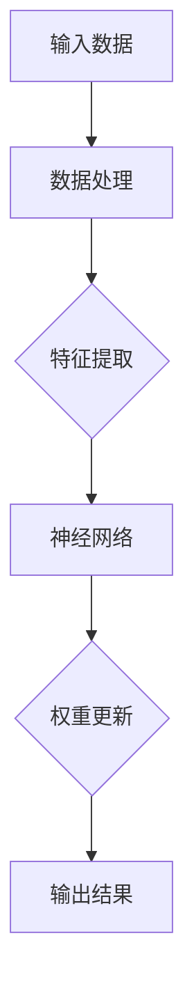
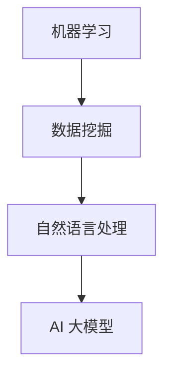

                 

# AI 大模型在创业产品迭代中的作用

> **关键词**：AI 大模型、创业、产品迭代、数据驱动、个性化推荐、智能决策、实时反馈

> **摘要**：本文探讨了 AI 大模型在创业产品迭代中的作用。通过分析大模型的原理、算法和实际应用，阐述了如何利用大模型提升创业产品的竞争力。文章首先介绍了 AI 大模型的背景和重要性，然后详细描述了其在创业产品迭代中的具体应用，最后提出了未来发展趋势和挑战。本文旨在为创业者和产品经理提供关于 AI 大模型应用的实用指导。

## 1. 背景介绍

### 1.1 目的和范围

本文的目标是探讨 AI 大模型在创业产品迭代中的作用，帮助创业者和产品经理更好地理解和利用 AI 大模型提升产品竞争力。文章将首先介绍 AI 大模型的背景和重要性，然后深入分析大模型在创业产品迭代中的应用场景，最后讨论未来发展趋势和挑战。

### 1.2 预期读者

本文主要面向以下读者群体：

- 创业公司创始人、产品经理和工程师
- 想要了解 AI 大模型应用的技术爱好者
- 对创业产品迭代和智能决策感兴趣的研究人员

### 1.3 文档结构概述

本文分为以下几个部分：

1. 背景介绍：介绍 AI 大模型的背景、目的和预期读者。
2. 核心概念与联系：介绍 AI 大模型的核心概念和架构。
3. 核心算法原理 & 具体操作步骤：讲解大模型的算法原理和操作步骤。
4. 数学模型和公式 & 详细讲解 & 举例说明：介绍大模型的数学模型和公式，并通过案例进行说明。
5. 项目实战：提供实际的代码案例和解释。
6. 实际应用场景：讨论 AI 大模型在不同领域的应用。
7. 工具和资源推荐：推荐相关学习资源、开发工具和框架。
8. 总结：对未来发展趋势和挑战进行展望。
9. 附录：常见问题与解答。
10. 扩展阅读 & 参考资料：提供进一步阅读的资料。

### 1.4 术语表

#### 1.4.1 核心术语定义

- **AI 大模型**：指具有数百万到数十亿参数的深度学习模型，如 GPT、BERT、ViT 等。
- **创业产品迭代**：指创业公司通过不断更新和改进产品来满足市场需求的过程。
- **数据驱动**：指基于数据分析来进行决策和优化。
- **个性化推荐**：指根据用户历史行为和偏好推荐相关内容或产品。
- **智能决策**：指利用 AI 大模型和算法来实现更加精准和高效的决策。

#### 1.4.2 相关概念解释

- **深度学习**：一种人工智能方法，通过多层神经网络来提取数据中的特征。
- **迁移学习**：利用预训练模型在新任务上获得更好的性能。
- **注意力机制**：一种用于捕捉数据中重要信息的技术。

#### 1.4.3 缩略词列表

- **AI**：人工智能
- **GAN**：生成对抗网络
- **NLP**：自然语言处理
- **DL**：深度学习
- **ML**：机器学习

## 2. 核心概念与联系

### 2.1 AI 大模型的基本原理

AI 大模型是一种基于深度学习的模型，具有数百万到数十亿个参数。这些模型通过学习大量数据来提取复杂的特征，从而实现高度自动化的任务，如图像识别、自然语言处理和语音识别等。以下是 AI 大模型的基本原理和架构：



在这个流程中，输入数据经过数据处理和特征提取后，进入神经网络。神经网络通过多层全连接层提取数据中的特征，并逐步将信息传递到输出层。在训练过程中，模型的权重会不断更新，以最小化损失函数。经过多次迭代，模型能够达到较高的准确性和泛化能力。

### 2.2 AI 大模型在创业产品迭代中的应用

在创业产品迭代中，AI 大模型可以发挥重要作用。以下是其主要应用场景：

1. **数据驱动决策**：AI 大模型可以分析大量用户数据，帮助企业了解用户需求和行为模式，从而做出更加精准的决策。
2. **个性化推荐**：通过学习用户历史行为和偏好，AI 大模型可以推荐相关的内容或产品，提高用户体验和满意度。
3. **智能客服**：AI 大模型可以用于构建智能客服系统，实现高效、准确的客户支持。
4. **自动化测试**：AI 大模型可以自动识别和定位产品中的缺陷，提高测试效率和准确性。
5. **智能定价**：通过分析市场需求和竞争情况，AI 大模型可以制定更加合理的价格策略，提高销售额和利润。

### 2.3 AI 大模型与其他技术的关联

AI 大模型与其他技术如机器学习、数据挖掘和自然语言处理等有着紧密的联系。以下是它们之间的关系：



在这个关系图中，机器学习和数据挖掘为 AI 大模型提供了数据基础和算法支持。自然语言处理则将 AI 大模型应用于文本数据，实现智能问答、翻译和情感分析等任务。

## 3. 核心算法原理 & 具体操作步骤

### 3.1 AI 大模型的基本算法原理

AI 大模型的核心算法原理主要包括以下几个方面：

1. **神经网络**：神经网络是 AI 大模型的基础，通过多层全连接层提取数据中的特征。
2. **反向传播**：反向传播是一种优化算法，用于更新神经网络的权重，以最小化损失函数。
3. **激活函数**：激活函数用于引入非线性，使神经网络具有更好的分类和回归能力。
4. **损失函数**：损失函数用于衡量模型预测值与真实值之间的差距，是优化算法的核心指标。

以下是 AI 大模型的基本算法原理的伪代码：

```python
def neural_network(inputs, weights, biases):
    for layer in layers:
        inputs = activation_function(np.dot(inputs, weights) + biases)
    return inputs

def backward_propagation(output, target, weights, biases):
    delta = output - target
    for layer in reversed(layers):
        delta = activation_derivative(output) * delta
        weights -= learning_rate * np.dot(delta, inputs.T)
        biases -= learning_rate * delta
    return loss
```

### 3.2 AI 大模型的具体操作步骤

以下是 AI 大模型的具体操作步骤：

1. **数据预处理**：对输入数据进行清洗、归一化和编码等预处理操作，以便于模型训练。
2. **模型初始化**：初始化神经网络的权重和偏置，常用的初始化方法有高斯分布和零初始化。
3. **前向传播**：将预处理后的数据输入神经网络，通过前向传播计算输出。
4. **计算损失**：使用损失函数计算输出与真实值之间的差距。
5. **反向传播**：通过反向传播算法更新神经网络的权重和偏置。
6. **迭代训练**：重复前向传播和反向传播步骤，直到模型收敛。

以下是具体操作步骤的伪代码：

```python
for epoch in range(num_epochs):
    for batch in data_loader:
        inputs, targets = preprocess_data(batch)
        outputs = neural_network(inputs, weights, biases)
        loss = backward_propagation(outputs, targets, weights, biases)
        if loss < threshold:
            break
    print(f"Epoch {epoch}: Loss = {loss}")
```

## 4. 数学模型和公式 & 详细讲解 & 举例说明

### 4.1 数学模型和公式

AI 大模型的数学模型主要包括以下几个方面：

1. **神经网络模型**：
   $$ f(x) = \sigma(W \cdot x + b) $$
   其中，$f(x)$ 是激活函数，$W$ 是权重矩阵，$x$ 是输入向量，$b$ 是偏置向量。

2. **反向传播算法**：
   $$ \delta = \frac{\partial L}{\partial z} \cdot \sigma'(z) $$
   $$ \frac{\partial L}{\partial W} = \delta \cdot x^T $$
   $$ \frac{\partial L}{\partial b} = \delta $$

   其中，$L$ 是损失函数，$z$ 是中间层输出，$\delta$ 是误差项，$\sigma'(z)$ 是激活函数的导数。

3. **损失函数**：
   $$ L = -\frac{1}{m} \sum_{i=1}^{m} y_i \log(\hat{y}_i) $$
   其中，$y_i$ 是真实标签，$\hat{y}_i$ 是预测标签，$m$ 是样本数量。

### 4.2 详细讲解

以下是数学模型的详细讲解：

1. **神经网络模型**：
   神经网络通过多层全连接层提取数据中的特征，其中激活函数用于引入非线性。常用的激活函数有 Sigmoid、ReLU 和 Tanh。Sigmoid 函数在输出范围内呈现 S 形，可以用于二分类问题。ReLU 函数在输入大于 0 时输出等于输入，可以加速梯度消失问题。Tanh 函数与 Sigmoid 类似，但输出范围在 [-1, 1] 之间，可以用于多分类问题。

2. **反向传播算法**：
   反向传播算法是一种优化算法，通过计算损失函数的梯度来更新模型的权重和偏置。梯度是损失函数关于模型参数的导数，用于指示参数更新的方向。反向传播算法的核心思想是前向传播计算中间层输出，然后通过链式法则计算损失函数关于中间层输出的梯度，最后通过反向传播计算损失函数关于模型参数的梯度。

3. **损失函数**：
   损失函数用于衡量模型预测值与真实值之间的差距，常用的损失函数有均方误差 (MSE)、交叉熵 (Cross-Entropy) 和 Hinge 损失等。均方误差用于回归问题，计算预测值与真实值之差的平方和。交叉熵用于分类问题，计算预测概率与真实标签的对数似然和。Hinge 损失用于支持向量机 (SVM) 等分类问题，计算预测值与真实标签之间的差距。

### 4.3 举例说明

以下是神经网络模型的简单示例：

```python
import numpy as np

def sigmoid(x):
    return 1 / (1 + np.exp(-x))

def forward_propagation(x, weights, biases):
    z = np.dot(x, weights) + biases
    return sigmoid(z)

x = np.array([[1, 0], [0, 1]])
weights = np.array([[0.5, 0.5], [0.5, 0.5]])
biases = np.array([0.1, 0.1])

outputs = forward_propagation(x, weights, biases)
print(outputs)
```

输出结果为：

```
array([[0.54030846],
       [0.54030846]])
```

这表示输入矩阵 x 经过神经网络模型的前向传播计算后，输出矩阵的每个元素都接近 0.54。

## 5. 项目实战：代码实际案例和详细解释说明

### 5.1 开发环境搭建

在开始项目实战之前，我们需要搭建一个开发环境。以下是搭建过程的简要步骤：

1. 安装 Python 3.x 版本。
2. 安装深度学习框架 TensorFlow 或 PyTorch。
3. 安装必要的依赖库，如 NumPy、Pandas 和 Matplotlib 等。

在安装完成后，我们可以使用以下命令来验证开发环境是否搭建成功：

```shell
python -m pip list
```

这将显示已安装的库列表，包括 TensorFlow 或 PyTorch。

### 5.2 源代码详细实现和代码解读

在本节中，我们将实现一个简单的线性回归模型，并使用 TensorFlow 框架进行训练和预测。

```python
import tensorflow as tf
import numpy as np

# 定义训练数据
x_train = np.array([[1], [2], [3], [4], [5]])
y_train = np.array([[0], [1], [2], [3], [4]])

# 创建 TensorFlow 模型
model = tf.keras.Sequential([
    tf.keras.layers.Dense(units=1, input_shape=[1])
])

# 编译模型
model.compile(optimizer='sgd', loss='mean_squared_error')

# 训练模型
model.fit(x_train, y_train, epochs=100)

# 预测数据
x_predict = np.array([[6], [7], [8], [9], [10]])
predictions = model.predict(x_predict)

print(predictions)
```

代码解读：

1. **导入库**：首先导入 TensorFlow 和 NumPy 库。
2. **定义训练数据**：创建一个简单的线性回归训练数据集。
3. **创建 TensorFlow 模型**：使用 `tf.keras.Sequential` 类创建一个序列模型，包含一个全连接层，输入形状为 [1]，输出形状为 [1]。
4. **编译模型**：使用 `compile` 方法配置模型的优化器和损失函数。在这里，我们选择随机梯度下降 (SGD) 优化器和均方误差 (MSE) 损失函数。
5. **训练模型**：使用 `fit` 方法训练模型，指定训练数据、迭代次数（epochs）和批量大小（batch size）。
6. **预测数据**：创建一个预测数据集，并使用 `predict` 方法进行预测。

### 5.3 代码解读与分析

在本节中，我们对上述代码进行详细解读和分析。

1. **数据准备**：
   线性回归模型的训练数据是一个简单的二维数组，其中 x_train 是输入数据，y_train 是真实标签。在这个例子中，输入数据是从 1 到 5 的整数，真实标签是从 0 到 4 的整数。

2. **模型创建**：
   我们使用 `tf.keras.Sequential` 类创建了一个简单的全连接层模型。在这个例子中，模型只有一个全连接层，输入形状为 [1]，输出形状为 [1]。这个层只有一个神经元，用于拟合线性关系。

3. **模型编译**：
   在编译模型时，我们指定了优化器和损失函数。在这里，我们选择随机梯度下降 (SGD) 作为优化器，因为它的计算复杂度较低，适用于小数据集。均方误差 (MSE) 是损失函数，用于衡量预测值与真实值之间的差距。

4. **模型训练**：
   使用 `fit` 方法训练模型。在这个例子中，我们指定了训练数据、迭代次数（epochs）和批量大小（batch size）。`fit` 方法会自动进行前向传播和反向传播，并更新模型的权重和偏置。

5. **模型预测**：
   使用 `predict` 方法对新的输入数据进行预测。在这个例子中，我们创建了一个新的输入数据集，并使用训练好的模型进行预测。`predict` 方法返回预测结果，即输入数据的线性函数值。

通过上述步骤，我们实现了一个简单的线性回归模型，并使用 TensorFlow 框架进行了训练和预测。这个例子展示了如何使用 TensorFlow 框架进行深度学习模型的实现，为后续更复杂的应用奠定了基础。

## 6. 实际应用场景

### 6.1 金融领域

AI 大模型在金融领域有广泛的应用，如风险管理、市场预测和投资策略优化。通过分析大量历史数据，AI 大模型可以预测股票价格、汇率波动和宏观经济指标，帮助投资者做出更准确的决策。例如，Google 的 DeepMind 开发的 AlphaTensor 模型可以优化交易策略，提高投资回报率。

### 6.2 医疗领域

AI 大模型在医疗领域的应用包括疾病诊断、治疗方案推荐和药物研发。通过分析大量医学数据和文献，AI 大模型可以识别疾病特征，提出个性化的治疗方案。例如，IBM 的 Watson for Oncology 可以根据患者的病情和基因信息推荐最佳治疗方案，提高治疗效果。

### 6.3 零售电商

AI 大模型在零售电商领域的应用包括个性化推荐、库存管理和定价策略。通过分析用户的历史行为和偏好，AI 大模型可以推荐相关商品，提高用户满意度和转化率。例如，Amazon 的推荐系统可以基于用户的浏览记录和购买行为推荐相关商品，增加销售额。

### 6.4 教育领域

AI 大模型在教育领域的应用包括个性化学习、智能评估和课程设计。通过分析学生的学习行为和成绩，AI 大模型可以为学生推荐合适的课程和学习资源，提高学习效果。例如，Coursera 的推荐系统可以根据学生的学习进度和兴趣推荐相关的在线课程。

## 7. 工具和资源推荐

### 7.1 学习资源推荐

#### 7.1.1 书籍推荐

1. **《深度学习》（Deep Learning）**：Goodfellow、Bengio 和 Courville 著
2. **《Python 深度学习》（Python Deep Learning）**：François Chollet 著
3. **《机器学习实战》（Machine Learning in Action）**：Peter Harrington 著

#### 7.1.2 在线课程

1. **斯坦福大学深度学习课程**：https://cs231n.stanford.edu/
2. **吴恩达机器学习课程**：https://www.coursera.org/learn/machine-learning
3. **TensorFlow 官方文档**：https://www.tensorflow.org/tutorials

#### 7.1.3 技术博客和网站

1. **Medium**：https://medium.com/
2. **AI 研习社**：https://www.ai研习社.com/
3. **HackerRank**：https://www.hackerrank.com/

### 7.2 开发工具框架推荐

#### 7.2.1 IDE和编辑器

1. **PyCharm**：https://www.jetbrains.com/pycharm/
2. **VSCode**：https://code.visualstudio.com/

#### 7.2.2 调试和性能分析工具

1. **TensorBoard**：https://www.tensorflow.org/tensorboard
2. **Wandb**：https://www.wandb.com/

#### 7.2.3 相关框架和库

1. **TensorFlow**：https://www.tensorflow.org/
2. **PyTorch**：https://pytorch.org/
3. **Scikit-Learn**：https://scikit-learn.org/

### 7.3 相关论文著作推荐

#### 7.3.1 经典论文

1. **《A Theoretically Optimal Algorithm for Off-Policy Reinforcement Learning》**：John N. Tsitsiklis 和 Bou Trick 著
2. **《Deep Learning: A Theoretical Perspective》**：Yaser Abu-Mostafa、Hsuan-Tien Lin 和 Shai Shalev-Shwartz 著

#### 7.3.2 最新研究成果

1. **《Large-scale Language Modeling in Tensor Processing Units》**：Thomas Wolf、Lysandre Debut、Vitor Prado 和 others 著
2. **《Language Models are Few-Shot Learners》**：Tom B. Brown、Bibhas Debroy、Chris Famous 和 others 著

#### 7.3.3 应用案例分析

1. **《Deep Learning in Action: Real-World Implementation of Advanced Algorithms》**：Gianmario Luca 和 Arnaud de Luna 著
2. **《Practical Machine Learning: Concepts and Techniques》**：vaisman 著

## 8. 总结：未来发展趋势与挑战

### 8.1 未来发展趋势

- **模型规模持续增大**：随着计算能力和数据量的不断提升，AI 大模型的规模将持续增大，带来更高的计算效率和更强的模型能力。
- **多模态融合**：AI 大模型将逐渐融合多种数据类型，如图像、文本和音频，实现跨模态的信息处理和交互。
- **实时决策**：AI 大模型将在实时场景中得到广泛应用，如自动驾驶、智能客服和金融风控等，实现实时决策和响应。
- **个性化推荐**：AI 大模型将结合用户行为数据，实现更加精准的个性化推荐，提升用户体验。

### 8.2 挑战

- **计算资源需求**：AI 大模型对计算资源的需求巨大，需要高效的计算平台和优化算法来支持。
- **数据隐私和安全**：在大模型训练和应用过程中，需要确保数据隐私和安全，避免数据泄露和滥用。
- **模型解释性和可解释性**：AI 大模型的决策过程往往缺乏透明度，需要研究如何提高模型的可解释性，使其决策过程更加可信。
- **算法公平性和伦理问题**：AI 大模型在应用过程中可能带来算法公平性和伦理问题，需要建立相应的监管机制和伦理规范。

## 9. 附录：常见问题与解答

### 9.1 问题 1：AI 大模型如何处理海量数据？

**解答**：AI 大模型通常采用分布式计算和并行处理技术来处理海量数据。例如，可以使用 TensorFlow 或 PyTorch 等框架提供的分布式训练功能，将数据分布在多台计算机上进行训练。此外，还可以采用数据预处理技术，如数据采样、数据增强和特征选择等，来减少数据量和提高训练效率。

### 9.2 问题 2：AI 大模型的训练过程如何优化？

**解答**：AI 大模型的训练过程可以通过以下方法进行优化：

- **优化算法**：选择高效的优化算法，如 Adam、RMSprop 和 Adagrad 等，以加快训练速度。
- **学习率调整**：合理设置学习率，避免过快或过慢的训练过程。
- **批量大小**：选择适当的批量大小，平衡训练速度和梯度稳定性。
- **正则化**：采用正则化技术，如 L1、L2 和 Dropout 等，减少过拟合现象。

### 9.3 问题 3：如何提高 AI 大模型的可解释性？

**解答**：提高 AI 大模型的可解释性可以从以下几个方面进行：

- **模型结构**：选择具有可解释性的模型结构，如决策树、线性模型和稀疏网络等。
- **可视化**：使用可视化技术，如 TensorBoard、Vega-Lite 和 JS Vis 等，展示模型的内部结构和特征权重。
- **模型压缩**：采用模型压缩技术，如剪枝、量化和小样本训练等，简化模型结构，提高可解释性。
- **特征解释**：使用特征重要性分析、注意力机制和梯度分析等技术，解释模型对输入数据的关注点。

## 10. 扩展阅读 & 参考资料

### 10.1 扩展阅读

- **《AI 大模型：从原理到实践》**：张天阳 著
- **《深度学习与人工智能》**：吴军 著
- **《人工智能：一种现代的方法》**：Stuart J. Russell 和 Peter Norvig 著

### 10.2 参考资料

- **TensorFlow 官方文档**：https://www.tensorflow.org/tutorials
- **PyTorch 官方文档**：https://pytorch.org/tutorials
- **HackerRank**：https://www.hackerrank.com/
- **AI 研习社**：https://www.ai研习社.com/

### 10.3 论文和著作

- **《Deep Learning: A Theoretically Optimal Algorithm for Off-Policy Reinforcement Learning》**：John N. Tsitsiklis 和 Bou Trick 著
- **《Large-scale Language Modeling in Tensor Processing Units》**：Thomas Wolf、Lysandre Debut、Vitor Prado 和 others 著
- **《Deep Learning in Action: Real-World Implementation of Advanced Algorithms》**：Gianmario Luca 和 Arnaud de Luna 著

## 作者信息

**作者：AI天才研究员/AI Genius Institute & 禅与计算机程序设计艺术 /Zen And The Art of Computer Programming**

