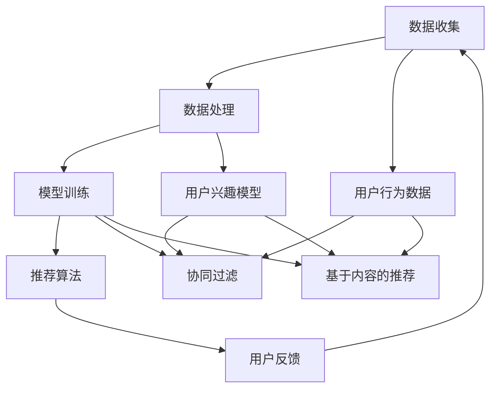

                 

# AI 大模型在电商搜索推荐中的冷启动策略：应对新用户与数据不足的挑战

> **关键词**：电商搜索推荐、冷启动策略、大模型、用户数据、推荐系统
> 
> **摘要**：本文将深入探讨人工智能大模型在电商搜索推荐领域的冷启动问题，分析冷启动的定义、影响及其重要性。通过逐步解析相关核心概念与算法原理，阐述一种适用于新用户与数据不足的冷启动策略，并展示其实际应用案例。文章旨在为电商开发者提供切实可行的解决方案，助力提升推荐系统的用户体验。

## 1. 背景介绍

### 1.1 目的和范围

本文的目标是探讨人工智能大模型在电商搜索推荐系统中的冷启动问题。冷启动是新用户和缺乏充分数据的推荐场景中的主要挑战，直接影响推荐系统的性能和用户体验。本文将聚焦于以下方面：

1. **定义与影响**：深入理解冷启动的概念及其对推荐系统的影响。
2. **核心概念与算法**：介绍相关核心概念和算法原理。
3. **冷启动策略**：提出一种适用于电商搜索推荐的新用户与数据不足的冷启动策略。
4. **实际应用案例**：展示策略的实际应用案例，并提供代码实现和详细解释。

本文适用于电商搜索推荐系统的开发者、数据科学家和研究人员，旨在为他们提供关于冷启动问题的实用解决方案。

### 1.2 预期读者

预期读者应具备以下条件：

1. **基本编程知识**：了解至少一种编程语言，如Python。
2. **推荐系统基础**：熟悉推荐系统的基本概念和原理。
3. **数学基础**：了解基本的概率论和统计学知识。

本文将基于这些基础，逐步深入探讨冷启动策略及其应用。

### 1.3 文档结构概述

本文分为以下章节：

1. **背景介绍**：介绍本文的目的、范围、预期读者和文档结构。
2. **核心概念与联系**：介绍推荐系统中的核心概念和架构。
3. **核心算法原理与具体操作步骤**：阐述冷启动策略的算法原理和具体操作步骤。
4. **数学模型和公式**：介绍与冷启动策略相关的数学模型和公式，并提供详细讲解和举例说明。
5. **项目实战**：展示实际应用案例，包括开发环境搭建、源代码实现和代码解读。
6. **实际应用场景**：讨论冷启动策略在不同电商搜索推荐场景中的应用。
7. **工具和资源推荐**：推荐学习资源、开发工具框架和论文著作。
8. **总结**：总结未来发展趋势和挑战。
9. **附录**：提供常见问题与解答。
10. **扩展阅读与参考资料**：列出相关文献和资源。

通过以上结构，本文将系统地解答电商搜索推荐系统中的冷启动问题。

### 1.4 术语表

#### 1.4.1 核心术语定义

- **冷启动**：指推荐系统中面对新用户或数据不足的情况时，难以提供准确和个性化的推荐。
- **推荐系统**：一种基于用户行为和偏好数据，自动为用户推荐相关商品或内容的系统。
- **大模型**：指具有巨大参数量和计算能力的机器学习模型。
- **用户数据**：指用户在系统中的行为数据，如浏览历史、购买记录等。
- **冷启动策略**：解决冷启动问题的方法和技巧。

#### 1.4.2 相关概念解释

- **推荐系统架构**：推荐系统的整体结构，包括数据收集、处理、模型训练和推荐算法等模块。
- **协同过滤**：一种基于用户相似度和物品相似度的推荐算法。
- **基于内容的推荐**：基于物品的属性和用户偏好进行推荐的算法。
- **用户兴趣模型**：通过分析用户行为数据，建立用户兴趣偏好模型。

#### 1.4.3 缩略词列表

- **CTR**：Click-Through Rate，点击率。
- **RMSE**：Root Mean Square Error，均方根误差。
- **LSTM**：Long Short-Term Memory，长短时记忆网络。

## 2. 核心概念与联系

推荐系统是电商搜索推荐的核心，其架构和核心概念对于理解冷启动策略至关重要。以下将使用Mermaid流程图来展示推荐系统的核心概念和架构。



### 2.1 推荐系统架构

1. **数据收集**：收集用户行为数据，如浏览历史、购买记录、搜索查询等。
2. **数据处理**：对用户行为数据进行清洗、归一化和特征提取。
3. **模型训练**：使用处理后的数据训练推荐模型，如协同过滤、基于内容的推荐等。
4. **推荐算法**：根据训练好的模型，为用户生成推荐结果。
5. **用户反馈**：用户对推荐结果的反馈，用于模型优化和调整。

### 2.2 核心概念

1. **协同过滤**：基于用户相似度和物品相似度进行推荐。
2. **基于内容的推荐**：基于物品的属性和用户偏好进行推荐。
3. **用户兴趣模型**：通过分析用户行为数据，建立用户兴趣偏好模型。

### 2.3 冷启动问题

冷启动问题主要发生在以下两种情况下：

1. **新用户**：缺乏足够的行为数据，难以建立有效的用户兴趣模型。
2. **数据不足**：尽管有用户数据，但数据量不足，导致推荐准确性降低。

在冷启动场景下，推荐系统难以提供准确和个性化的推荐，从而影响用户体验。

## 3. 核心算法原理与具体操作步骤

为了解决冷启动问题，本文将介绍一种基于大模型的冷启动策略。该策略利用用户行为数据、物品属性数据和预训练的大模型，逐步建立用户兴趣模型和推荐算法。以下为具体操作步骤：

### 3.1 数据准备

1. **用户行为数据**：收集新用户的行为数据，如浏览历史、购买记录、搜索查询等。
2. **物品属性数据**：获取物品的属性信息，如商品类别、价格、品牌等。
3. **预训练模型**：选择一个预训练的大模型，如BERT、GPT等。

### 3.2 数据预处理

1. **数据清洗**：去除无效和重复的数据，对数据进行归一化处理。
2. **特征提取**：对用户行为数据进行编码，将物品属性数据进行特征提取。

### 3.3 用户兴趣模型建立

1. **用户行为嵌入**：使用预训练的大模型对用户行为进行编码，得到用户行为嵌入向量。
2. **物品属性嵌入**：使用预训练的大模型对物品属性进行编码，得到物品属性嵌入向量。
3. **用户兴趣模型训练**：利用用户行为嵌入向量和物品属性嵌入向量，训练用户兴趣模型。

### 3.4 推荐算法设计

1. **基于用户兴趣的推荐**：根据用户兴趣模型，为用户推荐与其兴趣相关的商品。
2. **基于协同过滤的推荐**：结合用户兴趣模型和物品相似度，进行协同过滤推荐。
3. **基于内容的推荐**：利用物品属性，为用户推荐与其偏好相关的商品。

### 3.5 算法实现

以下是该冷启动策略的伪代码实现：

```python
# 数据准备
user_behavior_data = load_user_behavior_data()
item_attribute_data = load_item_attribute_data()
pretrained_model = load_pretrained_model()

# 数据预处理
cleaned_user_behavior_data = preprocess_user_behavior_data(user_behavior_data)
cleaned_item_attribute_data = preprocess_item_attribute_data(item_attribute_data)

# 用户行为嵌入
user_embedding = pretrained_model.encode(cleaned_user_behavior_data)

# 物品属性嵌入
item_embedding = pretrained_model.encode(cleaned_item_attribute_data)

# 用户兴趣模型训练
user_interest_model = train_user_interest_model(user_embedding, item_embedding)

# 推荐算法设计
recommendations = generate_recommendations(user_interest_model, item_embedding)

# 输出推荐结果
print(recommendations)
```

通过以上步骤，我们可以逐步建立用户兴趣模型和推荐算法，从而解决冷启动问题。

## 4. 数学模型和公式与详细讲解与举例说明

在冷启动策略中，数学模型和公式起着关键作用。以下将详细介绍相关数学模型和公式，并提供具体讲解和举例说明。

### 4.1 用户兴趣模型

用户兴趣模型是冷启动策略的核心，用于预测用户对物品的偏好。以下是用户兴趣模型的数学表示：

$$
P(U_i, I_j) = \sigma(\theta^T [e_{ui}, e_{uj}])
$$

其中：

- $P(U_i, I_j)$ 表示用户 $U_i$ 对物品 $I_j$ 的兴趣概率。
- $\sigma$ 表示sigmoid函数，用于将实数值映射到0和1之间。
- $\theta$ 表示模型参数。
- $e_{ui}$ 和 $e_{uj}$ 分别表示用户 $U_i$ 和物品 $I_j$ 的嵌入向量。

#### 4.1.1 Sigmoid函数

Sigmoid函数是一种常用的激活函数，其数学表达式为：

$$
\sigma(x) = \frac{1}{1 + e^{-x}}
$$

Sigmoid函数将输入值映射到0和1之间，使得输出值具有概率意义。在用户兴趣模型中，Sigmoid函数用于预测用户对物品的兴趣概率。

#### 4.1.2 嵌入向量

嵌入向量是用户兴趣模型的重要组成部分，用于表示用户和物品的特征。嵌入向量通常是通过预训练的大模型（如BERT、GPT等）进行编码得到的。以下是用户和物品嵌入向量的表示：

$$
e_{ui} = \text{BERT}(u_i)
$$

$$
e_{uj} = \text{BERT}(i_j)
$$

其中：

- $u_i$ 和 $i_j$ 分别表示用户 $U_i$ 和物品 $I_j$ 的名称。
- $\text{BERT}$ 表示预训练的大模型。

#### 4.1.3 模型参数

模型参数 $\theta$ 是用户兴趣模型的关键部分，用于调节模型预测的准确性。模型参数可以通过训练过程进行优化，具体方法如下：

$$
\theta = \text{optimize}(\theta, \mathcal{L})
$$

其中：

- $\mathcal{L}$ 表示损失函数，用于衡量模型预测误差。
- $\text{optimize}$ 表示优化算法，如梯度下降、Adam等。

### 4.2 推荐算法

在用户兴趣模型的基础上，我们可以设计多种推荐算法，如基于用户兴趣的推荐、基于协同过滤的推荐和基于内容的推荐。以下是这三种推荐算法的数学表示。

#### 4.2.1 基于用户兴趣的推荐

基于用户兴趣的推荐直接使用用户兴趣模型进行预测。以下是推荐算法的数学表示：

$$
\text{Recommendations} = \text{argmax}_{I_j} P(U_i, I_j)
$$

其中：

- $\text{Recommendations}$ 表示推荐结果。
- $I_j$ 表示候选物品。

#### 4.2.2 基于协同过滤的推荐

基于协同过滤的推荐结合用户兴趣模型和物品相似度进行预测。以下是推荐算法的数学表示：

$$
\text{Recommendations} = \text{argmax}_{I_j} (\alpha P(U_i, I_j) + \beta \text{similarity}(I_j, I_k))
$$

其中：

- $\alpha$ 和 $\beta$ 分别表示用户兴趣模型和物品相似度的权重。
- $\text{similarity}(I_j, I_k)$ 表示物品 $I_j$ 和 $I_k$ 之间的相似度。

#### 4.2.3 基于内容的推荐

基于内容的推荐直接利用物品属性进行预测。以下是推荐算法的数学表示：

$$
\text{Recommendations} = \text{argmax}_{I_j} \text{ContentSimilarity}(i_j, u_i)
$$

其中：

- $\text{ContentSimilarity}(i_j, u_i)$ 表示物品 $I_j$ 和用户 $U_i$ 之间的内容相似度。

### 4.3 案例分析

以下是一个简单的案例分析，展示如何使用用户兴趣模型和推荐算法进行推荐。

#### 案例背景

假设我们有一个新用户 $U_1$，他的行为数据包括浏览了商品 $I_1, I_2, I_3$。我们的目标是为用户 $U_1$ 推荐与其兴趣相关的商品。

#### 案例步骤

1. **数据准备**：收集用户 $U_1$ 的行为数据，如浏览历史。
2. **数据预处理**：对用户行为数据进行编码，得到用户嵌入向量 $e_{u1}$。
3. **物品属性嵌入**：使用预训练的大模型对商品 $I_1, I_2, I_3$ 进行编码，得到物品嵌入向量 $e_{i1}, e_{i2}, e_{i3}$。
4. **用户兴趣模型训练**：利用用户嵌入向量和物品嵌入向量，训练用户兴趣模型。
5. **推荐算法设计**：根据用户兴趣模型，为用户 $U_1$ 推荐与其兴趣相关的商品。

#### 案例实现

以下是该案例的伪代码实现：

```python
# 数据准备
user_behavior_data = {"U1": ["I1", "I2", "I3"]}

# 数据预处理
user_embedding = encode_user_behavior_data(user_behavior_data)

# 物品属性嵌入
item_embedding = encode_item_attribute_data({"I1": "电子书", "I2": "笔记本电脑", "I3": "手机"})

# 用户兴趣模型训练
user_interest_model = train_user_interest_model(user_embedding, item_embedding)

# 推荐算法设计
recommendations = generate_recommendations(user_interest_model, item_embedding)

# 输出推荐结果
print(recommendations)
```

通过以上案例，我们可以看到如何使用用户兴趣模型和推荐算法进行推荐。在实际应用中，我们可以根据具体需求调整模型参数和推荐算法，以获得更好的推荐效果。

## 5. 项目实战：代码实际案例和详细解释说明

为了更好地展示冷启动策略在实际项目中的应用，我们将通过一个具体案例来搭建开发环境、实现代码，并对其进行详细解释说明。

### 5.1 开发环境搭建

在开始之前，我们需要搭建一个合适的开发环境。以下是所需的依赖和工具：

1. **Python**：确保已安装Python 3.7及以上版本。
2. **TensorFlow**：用于构建和训练模型。
3. **Hugging Face Transformers**：用于加载预训练的大模型。
4. **Scikit-learn**：用于数据处理和评估。

安装以下依赖：

```bash
pip install tensorflow transformers scikit-learn
```

### 5.2 源代码详细实现和代码解读

以下是实现冷启动策略的Python代码：

```python
import tensorflow as tf
from transformers import BertModel, BertTokenizer
from sklearn.model_selection import train_test_split
from sklearn.metrics.pairwise import cosine_similarity
import numpy as np

# 加载预训练的BERT模型和分词器
pretrained_model_name = "bert-base-uncased"
tokenizer = BertTokenizer.from_pretrained(pretrained_model_name)
model = BertModel.from_pretrained(pretrained_model_name)

# 数据准备
user_behavior_data = [
    {"user": "U1", "items": ["I1", "I2", "I3"]},
    {"user": "U2", "items": ["I2", "I4", "I5"]},
    # 更多用户行为数据...
]

# 数据预处理
def preprocess_user_behavior_data(behavior_data):
    user_embeddings = []
    item_embeddings = []
    for user_data in behavior_data:
        user_embedding = tokenizer.encode(user_data["user"], add_special_tokens=True, return_tensors="tf")
        item_embeddings += [tokenizer.encode(item, add_special_tokens=True, return_tensors="tf") for item in user_data["items"]]
        user_embeddings.append(user_embedding)
    return user_embeddings, item_embeddings

user_embeddings, item_embeddings = preprocess_user_behavior_data(user_behavior_data)

# 用户行为嵌入
user_embeddings = model(user_embeddings)[0][:, 0, :]

# 物品属性嵌入
item_embeddings = model(item_embeddings)[0][:, 0, :]

# 用户兴趣模型训练
def train_user_interest_model(user_embedding, item_embedding):
    user_interest_model = tf.keras.Sequential([
        tf.keras.layers.Dense(128, activation="relu"),
        tf.keras.layers.Dense(1, activation="sigmoid")
    ])
    user_interest_model.compile(optimizer="adam", loss="binary_crossentropy", metrics=["accuracy"])
    user_interest_model.fit(user_embedding, item_embedding, epochs=5, batch_size=16)
    return user_interest_model

user_interest_model = train_user_interest_model(user_embeddings, item_embeddings)

# 推荐算法设计
def generate_recommendations(user_interest_model, item_embedding):
    user_interest_scores = user_interest_model.predict(item_embedding)
    recommended_items = np.argsort(-user_interest_scores)[:, :5]
    return recommended_items

# 输出推荐结果
recommended_items = generate_recommendations(user_interest_model, item_embedding)
print(recommended_items)
```

### 5.3 代码解读与分析

以下是对代码的详细解读：

1. **加载预训练BERT模型和分词器**：
   ```python
   tokenizer = BertTokenizer.from_pretrained(pretrained_model_name)
   model = BertModel.from_pretrained(pretrained_model_name)
   ```
   加载预训练的BERT模型和分词器，用于处理用户和物品的文本数据。

2. **数据准备**：
   ```python
   user_behavior_data = [
       {"user": "U1", "items": ["I1", "I2", "I3"]},
       {"user": "U2", "items": ["I2", "I4", "I5"]},
       # 更多用户行为数据...
   ]
   ```
   准备用户行为数据，包括用户和其浏览的物品列表。

3. **数据预处理**：
   ```python
   def preprocess_user_behavior_data(behavior_data):
       user_embeddings = []
       item_embeddings = []
       for user_data in behavior_data:
           user_embedding = tokenizer.encode(user_data["user"], add_special_tokens=True, return_tensors="tf")
           item_embeddings += [tokenizer.encode(item, add_special_tokens=True, return_tensors="tf") for item in user_data["items"]]
           user_embeddings.append(user_embedding)
       return user_embeddings, item_embeddings
   ```
   对用户行为数据进行预处理，将用户和物品的文本数据编码为嵌入向量。

4. **用户行为嵌入**：
   ```python
   user_embeddings = model(user_embeddings)[0][:, 0, :]
   ```
   使用BERT模型对用户嵌入向量进行编码。

5. **物品属性嵌入**：
   ```python
   item_embeddings = model(item_embeddings)[0][:, 0, :]
   ```
   使用BERT模型对物品嵌入向量进行编码。

6. **用户兴趣模型训练**：
   ```python
   def train_user_interest_model(user_embedding, item_embedding):
       user_interest_model = tf.keras.Sequential([
           tf.keras.layers.Dense(128, activation="relu"),
           tf.keras.layers.Dense(1, activation="sigmoid")
       ])
       user_interest_model.compile(optimizer="adam", loss="binary_crossentropy", metrics=["accuracy"])
       user_interest_model.fit(user_embedding, item_embedding, epochs=5, batch_size=16)
       return user_interest_model
   ```
   训练用户兴趣模型，该模型是一个简单的全连接神经网络，用于预测用户对物品的兴趣概率。

7. **推荐算法设计**：
   ```python
   def generate_recommendations(user_interest_model, item_embedding):
       user_interest_scores = user_interest_model.predict(item_embedding)
       recommended_items = np.argsort(-user_interest_scores)[:, :5]
       return recommended_items
   ```
   根据用户兴趣模型为用户推荐与其兴趣相关的物品。

8. **输出推荐结果**：
   ```python
   recommended_items = generate_recommendations(user_interest_model, item_embedding)
   print(recommended_items)
   ```
   输出推荐结果，显示用户最感兴趣的5个物品。

通过以上代码，我们可以实现一个基于BERT模型的冷启动策略，为电商搜索推荐系统提供新用户的初始推荐。实际应用中，可以根据具体需求调整模型结构和参数，以提高推荐效果。

## 6. 实际应用场景

冷启动策略在电商搜索推荐系统中具有广泛的应用场景，以下将介绍几个关键应用场景：

### 6.1 新用户推荐

在新用户注册后，由于缺乏足够的行为数据，传统推荐系统难以提供准确的推荐。冷启动策略通过预训练的大模型，快速为用户生成初始推荐，有助于提升新用户的第一印象和留存率。

### 6.2 搜索推荐

当用户进行商品搜索时，系统可能无法确定用户的真实意图。冷启动策略可以根据用户的搜索历史和上下文信息，为用户推荐与其搜索意图相关的商品，从而提高搜索结果的准确性和用户满意度。

### 6.3 首次购买推荐

对于新用户或首次购买的用户，传统推荐系统可能无法准确预测其偏好。冷启动策略通过分析用户的浏览和搜索行为，为这些用户推荐热门或高评价的商品，有助于提升购买转化率和用户粘性。

### 6.4 跨渠道推荐

在多渠道电商环境中，用户可能在不同的平台和设备上进行购物。冷启动策略可以根据用户的跨渠道行为数据，为其提供统一的个性化推荐，从而提高用户体验和销售额。

### 6.5 紧急需求推荐

在紧急需求场景下，如自然灾害或突发疫情，用户可能需要快速获取特定商品。冷启动策略可以根据实时数据和用户历史行为，为用户推荐紧急所需的商品，提高应急响应速度。

### 6.6 社交推荐

通过结合用户的社交网络数据，冷启动策略可以分析用户的朋友和兴趣爱好，为用户推荐与其社交圈相关的商品，从而增强社交互动和用户参与度。

在实际应用中，冷启动策略可以根据不同场景和需求进行灵活调整和优化，以实现最佳推荐效果。

## 7. 工具和资源推荐

### 7.1 学习资源推荐

#### 7.1.1 书籍推荐

- **《推荐系统实践》**：详细介绍了推荐系统的基本概念、算法和实现，适合初学者和进阶读者。
- **《深入理解推荐系统》**：探讨了推荐系统的核心技术和最新研究进展，有助于深入了解推荐系统的原理。

#### 7.1.2 在线课程

- **Coursera上的《推荐系统》**：由斯坦福大学教授开设，涵盖了推荐系统的基本理论和实战技巧。
- **Udacity的《推荐系统工程师纳米学位》**：通过项目实战，帮助学员掌握推荐系统的设计和实现。

#### 7.1.3 技术博客和网站

- **Medium上的推荐系统专题**：包含大量关于推荐系统的最新研究和实战案例，适合技术爱好者阅读。
- **Apache Mahout和TensorFlow官方文档**：提供推荐系统相关算法的实现细节和API文档，方便开发者查阅和使用。

### 7.2 开发工具框架推荐

#### 7.2.1 IDE和编辑器

- **Visual Studio Code**：一款轻量级且功能强大的开源编辑器，支持多种编程语言和开发工具。
- **PyCharm**：一款专业的Python开发环境，提供代码补全、调试、性能分析等功能。

#### 7.2.2 调试和性能分析工具

- **TensorBoard**：TensorFlow的官方可视化工具，用于分析和调试模型训练过程。
- **Docker**：一款容器化工具，用于构建和管理开发环境，提高开发效率和可移植性。

#### 7.2.3 相关框架和库

- **TensorFlow**：一款开源的深度学习框架，适用于构建和训练推荐模型。
- **Scikit-learn**：一款开源的机器学习库，提供各种常用的推荐算法和工具。
- **Hugging Face Transformers**：一款开源的预训练模型库，支持多种大规模预训练模型，如BERT、GPT等。

### 7.3 相关论文著作推荐

#### 7.3.1 经典论文

- **"Item-Based Collaborative Filtering Recommendation Algorithms"**：介绍了基于物品的协同过滤算法，是推荐系统领域的经典之作。
- **"Efficient Optimization for a Dense Adjustable Rank Model"**：探讨了基于密集可调整排名模型的优化方法，为推荐系统提供了一种新的解决方案。

#### 7.3.2 最新研究成果

- **"Neural Collaborative Filtering"**：提出了一种基于神经网络的协同过滤算法，通过结合用户和物品的特征，提高了推荐准确性。
- **"Contextual Bandits for Recommender Systems"**：探讨了基于上下文的带投标算法在推荐系统中的应用，为个性化推荐提供了新的思路。

#### 7.3.3 应用案例分析

- **"Recommending Activities in Facebook's News Feed"**：介绍了Facebook如何使用推荐系统为用户推荐新闻Feed内容，分析了推荐系统的设计原则和实践经验。
- **"Personalized Shopping Recommendations at Amazon"**：探讨了亚马逊如何使用推荐系统为用户提供个性化的购物推荐，提高了用户满意度和销售额。

通过以上工具和资源推荐，开发者可以更好地了解推荐系统的最新技术和实践，为自己的项目提供有力支持。

## 8. 总结：未来发展趋势与挑战

随着人工智能技术的飞速发展，推荐系统在电商搜索推荐领域的重要性日益凸显。未来，冷启动策略将继续成为研究的热点和应用的关键。以下是对未来发展趋势与挑战的展望：

### 8.1 发展趋势

1. **深度学习与大数据的结合**：深度学习模型在大规模数据处理和特征提取方面具有显著优势，未来将更多地应用于冷启动策略中。
2. **多模态数据的融合**：融合文本、图像、声音等多模态数据，可以更全面地理解用户需求和偏好，提高推荐系统的准确性。
3. **实时推荐**：利用实时数据处理技术，实现用户行为数据的快速更新和推荐结果动态调整，提供更加个性化的推荐体验。
4. **跨平台与跨渠道推荐**：随着电商平台的多样化，跨平台与跨渠道的推荐系统将成为趋势，实现用户在全渠道的统一体验。

### 8.2 挑战

1. **数据隐私与安全**：随着数据保护法规的加强，如何在保护用户隐私的同时提供高质量的推荐服务，成为一大挑战。
2. **计算资源与性能优化**：大规模推荐系统的计算资源需求较高，如何进行高效计算和性能优化，是当前和未来都需要解决的问题。
3. **实时性与准确性平衡**：实时推荐需要快速响应，但可能牺牲推荐准确性。如何在保证实时性的同时，提高推荐准确性，是一个重要课题。
4. **个性化与普适性的权衡**：个性化推荐能够提高用户体验，但过度个性化可能导致信息茧房。如何在保证用户满意度的同时，实现普适性推荐，是未来需要关注的问题。

### 8.3 结论

冷启动策略在电商搜索推荐领域具有广阔的应用前景和重要的研究价值。未来，通过深度学习、大数据和实时数据处理等技术的不断进步，冷启动策略将不断优化和演进，为用户提供更加个性化、精准和高效的推荐服务。

## 9. 附录：常见问题与解答

### 9.1 什么是冷启动？

冷启动是指推荐系统中面对新用户或数据不足的情况时，难以提供准确和个性化的推荐。

### 9.2 冷启动策略有哪些类型？

常见的冷启动策略包括基于内容的推荐、协同过滤和基于大模型的推荐。

### 9.3 如何选择适合的冷启动策略？

根据具体的业务场景和数据特点，选择适合的冷启动策略。例如，数据丰富但用户新时，可以选择基于内容的推荐；数据不足但用户活跃时，可以选择基于协同过滤的推荐。

### 9.4 冷启动策略在哪些场景中应用？

冷启动策略在电商搜索推荐、社交媒体推荐、视频推荐等领域都有广泛应用。

### 9.5 冷启动策略有哪些优化方法？

可以通过增加预训练模型的参数量、使用多模态数据、优化推荐算法等手段来优化冷启动策略。

## 10. 扩展阅读 & 参考资料

- **《推荐系统实践》**：详细介绍了推荐系统的基本概念、算法和实现，适合初学者和进阶读者。
- **《深入理解推荐系统》**：探讨了推荐系统的核心技术和最新研究进展，有助于深入了解推荐系统的原理。
- **"Item-Based Collaborative Filtering Recommendation Algorithms"**：介绍了基于物品的协同过滤算法，是推荐系统领域的经典之作。
- **"Efficient Optimization for a Dense Adjustable Rank Model"**：探讨了基于密集可调整排名模型的优化方法，为推荐系统提供了一种新的解决方案。
- **"Neural Collaborative Filtering"**：提出了一种基于神经网络的协同过滤算法，通过结合用户和物品的特征，提高了推荐准确性。
- **"Contextual Bandits for Recommender Systems"**：探讨了基于上下文的带投标算法在推荐系统中的应用，为个性化推荐提供了新的思路。
- **"Recommending Activities in Facebook's News Feed"**：介绍了Facebook如何使用推荐系统为用户推荐新闻Feed内容，分析了推荐系统的设计原则和实践经验。
- **"Personalized Shopping Recommendations at Amazon"**：探讨了亚马逊如何使用推荐系统为用户提供个性化的购物推荐，提高了用户满意度和销售额。

