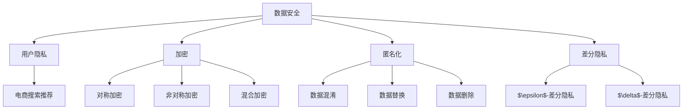

                 

# AI 大模型在电商搜索推荐中的数据安全策略：保障数据安全与用户隐私

> **关键词：** 大模型、电商、搜索推荐、数据安全、用户隐私、加密、匿名化、差分隐私

> **摘要：** 本文深入探讨了 AI 大模型在电商搜索推荐中的数据安全策略，重点分析了如何通过加密、匿名化和差分隐私等技术手段，保障数据安全与用户隐私。文章从背景介绍、核心概念、算法原理、数学模型、项目实战、实际应用、工具推荐等多个方面，系统地阐述了数据安全策略的实践与应用，为电商行业提供了有价值的参考。

## 1. 背景介绍

### 1.1 目的和范围

随着电商行业的快速发展，用户隐私保护和数据安全问题日益凸显。本文旨在探讨 AI 大模型在电商搜索推荐中的数据安全策略，研究如何通过技术手段保障用户隐私和数据安全。

本文将围绕以下三个方面展开：

1. **核心概念与联系**：介绍相关核心概念，如数据安全、用户隐私、加密、匿名化、差分隐私等。
2. **核心算法原理 & 具体操作步骤**：讲解保障数据安全的算法原理，包括加密算法、匿名化算法、差分隐私算法等，并提供伪代码详细阐述。
3. **实际应用场景**：通过项目实战，展示如何在实际电商搜索推荐系统中应用数据安全策略。

### 1.2 预期读者

本文适用于以下读者群体：

1. **电商企业技术团队**：了解如何保障用户隐私和数据安全，提升电商搜索推荐系统的安全性。
2. **人工智能研究人员**：了解大模型在电商搜索推荐中的数据安全策略，为相关研究方向提供参考。
3. **计算机安全领域专家**：了解大模型在数据安全方面的应用，为数据安全技术研究提供新思路。

### 1.3 文档结构概述

本文分为以下十个部分：

1. **背景介绍**：介绍文章的目的和范围，预期读者以及文档结构概述。
2. **核心概念与联系**：介绍相关核心概念，如数据安全、用户隐私、加密、匿名化、差分隐私等，并提供 Mermaid 流程图。
3. **核心算法原理 & 具体操作步骤**：讲解保障数据安全的算法原理，包括加密算法、匿名化算法、差分隐私算法等，并提供伪代码详细阐述。
4. **数学模型和公式 & 详细讲解 & 举例说明**：介绍相关数学模型和公式，并进行详细讲解和举例说明。
5. **项目实战：代码实际案例和详细解释说明**：通过项目实战，展示如何在实际电商搜索推荐系统中应用数据安全策略。
6. **实际应用场景**：分析电商搜索推荐中的数据安全挑战和应用案例。
7. **工具和资源推荐**：推荐学习资源、开发工具框架和相关论文著作。
8. **总结：未来发展趋势与挑战**：总结本文内容，探讨未来发展趋势与挑战。
9. **附录：常见问题与解答**：回答读者可能关心的问题。
10. **扩展阅读 & 参考资料**：提供相关扩展阅读和参考资料。

### 1.4 术语表

#### 1.4.1 核心术语定义

- **数据安全**：确保数据在存储、传输、处理等过程中不受未授权访问、篡改、泄露等威胁的能力。
- **用户隐私**：用户的个人信息，包括但不限于姓名、地址、联系方式、购物记录等。
- **加密**：通过算法和密钥将明文数据转换为密文，确保数据在传输和存储过程中的安全性。
- **匿名化**：将真实用户身份信息与数据分离，使数据无法直接识别特定用户。
- **差分隐私**：在处理数据时引入随机噪声，确保无法通过分析数据集推断出单个数据点的信息。

#### 1.4.2 相关概念解释

- **大模型**：指具有海量数据、高度复杂结构的深度学习模型，如 GPT、BERT 等。
- **电商搜索推荐**：根据用户的历史行为和偏好，为用户提供个性化的商品推荐服务。
- **算法**：实现特定功能的计算过程和步骤，如加密算法、匿名化算法、差分隐私算法等。

#### 1.4.3 缩略词列表

- **AI**：人工智能（Artificial Intelligence）
- **GPT**：生成预训练模型（Generative Pre-trained Transformer）
- **BERT**：双向编码表示（Bidirectional Encoder Representations from Transformers）
- **IDE**：集成开发环境（Integrated Development Environment）

## 2. 核心概念与联系

在本文中，我们将讨论以下几个核心概念：数据安全、用户隐私、加密、匿名化和差分隐私。这些概念在大模型应用于电商搜索推荐场景中起着至关重要的作用。

### 2.1 数据安全与用户隐私

数据安全是指确保数据在存储、传输、处理等环节不受未授权访问、篡改、泄露等威胁的能力。用户隐私是指用户的个人信息，如姓名、地址、联系方式、购物记录等。

在电商搜索推荐场景中，用户隐私和数据安全至关重要。一方面，用户希望自己的购物行为和偏好得到尊重，避免被泄露或滥用。另一方面，电商企业需要保护用户数据，以防止数据泄露给竞争对手或黑客。

### 2.2 加密

加密是一种将明文数据转换为密文的过程，确保数据在传输和存储过程中的安全性。常见的加密算法有对称加密、非对称加密和混合加密。

- **对称加密**：加密和解密使用相同的密钥，如 AES（Advanced Encryption Standard）。
- **非对称加密**：加密和解密使用不同的密钥，如 RSA（Rivest-Shamir-Adleman）。
- **混合加密**：结合对称加密和非对称加密的优势，如 SSL（Secure Sockets Layer）。

在电商搜索推荐中，加密可以用于保护用户隐私和敏感信息，确保数据在传输过程中不被窃取或篡改。

### 2.3 匿名化

匿名化是一种将真实用户身份信息与数据分离的过程，使数据无法直接识别特定用户。匿名化技术包括数据混淆、数据替换和数据删除等。

- **数据混淆**：通过引入噪声或修改数据，使真实数据难以识别。
- **数据替换**：将敏感数据替换为虚构数据，如将真实姓名替换为虚构姓名。
- **数据删除**：删除敏感数据，如购物记录中的用户联系方式。

在电商搜索推荐中，匿名化可以降低数据泄露的风险，保护用户隐私。

### 2.4 差分隐私

差分隐私是一种在处理数据时引入随机噪声的技术，确保无法通过分析数据集推断出单个数据点的信息。差分隐私包括 $\epsilon$-差分隐私和 $\delta$-差分隐私等。

- **$\epsilon$-差分隐私**：通过引入噪声，使得攻击者无法区分数据集中的一个数据点是否在原始数据集中。
- **$\delta$-差分隐私**：通过引入噪声，使得攻击者无法区分数据集中的一个数据点是否在原始数据集中，同时保证隐私损失在可接受范围内。

在电商搜索推荐中，差分隐私可以用于保护用户隐私，防止数据被滥用或泄露。

### 2.5 Mermaid 流程图

以下是 Mermaid 流程图，展示了数据安全策略中的核心概念和联系：



## 3. 核心算法原理 & 具体操作步骤

为了保障电商搜索推荐中的数据安全与用户隐私，我们采用以下核心算法和技术手段：

### 3.1 加密算法

加密算法用于保护用户隐私和敏感信息。常见的加密算法包括对称加密、非对称加密和混合加密。

#### 3.1.1 对称加密

对称加密算法使用相同的密钥进行加密和解密。以下是对称加密的伪代码：

```plaintext
输入：明文数据 data，密钥 key
输出：密文数据 cipher_text

加密过程：
cipher_text = Encrypt(data, key)

解密过程：
data = Decrypt(cipher_text, key)
```

其中，`Encrypt`和`Decrypt`函数分别实现加密和解密操作。

#### 3.1.2 非对称加密

非对称加密算法使用不同的密钥进行加密和解密。以下是非对称加密的伪代码：

```plaintext
输入：明文数据 data，私钥 private_key，公钥 public_key
输出：密文数据 cipher_text

加密过程：
cipher_text = Encrypt(data, public_key)

解密过程：
data = Decrypt(cipher_text, private_key)
```

其中，`Encrypt`和`Decrypt`函数分别实现加密和解密操作。

#### 3.1.3 混合加密

混合加密算法结合对称加密和非对称加密的优势。以下是混合加密的伪代码：

```plaintext
输入：明文数据 data，对称密钥 symmetric_key，公钥 public_key，私钥 private_key
输出：密文数据 cipher_text

加密过程：
cipher_text = Encrypt(data, symmetric_key)
encrypted_key = Encrypt(symmetric_key, public_key)
cipher_text_with_key = Concatenate(cipher_text, encrypted_key)

解密过程：
decrypted_key = Decrypt(cipher_text_with_key[1:], private_key)
symmetric_key = Decrypt(decrypted_key, public_key)
data = Decrypt(cipher_text, symmetric_key)
```

其中，`Encrypt`和`Decrypt`函数分别实现加密和解密操作，`Concatenate`函数用于拼接密文数据和加密后的密钥。

### 3.2 匿名化算法

匿名化算法用于将真实用户身份信息与数据分离，降低数据泄露的风险。常见的匿名化算法包括数据混淆、数据替换和数据删除。

#### 3.2.1 数据混淆

数据混淆算法通过引入噪声或修改数据，使真实数据难以识别。以下是数据混淆的伪代码：

```plaintext
输入：敏感数据 sensitive_data，噪声 noise
输出：混淆数据 masked_data

混淆过程：
masked_data = sensitive_data + noise
```

其中，`noise`为引入的噪声。

#### 3.2.2 数据替换

数据替换算法将敏感数据替换为虚构数据，如将真实姓名替换为虚构姓名。以下是数据替换的伪代码：

```plaintext
输入：敏感数据 sensitive_data，替换规则 replacement_rule
输出：替换数据 replaced_data

替换过程：
replaced_data = Apply(replacement_rule, sensitive_data)
```

其中，`replacement_rule`为替换规则。

#### 3.2.3 数据删除

数据删除算法通过删除敏感数据，降低数据泄露的风险。以下是数据删除的伪代码：

```plaintext
输入：敏感数据 sensitive_data
输出：删除数据 deleted_data

删除过程：
deleted_data = Remove(sensitive_data)
```

其中，`Remove`函数用于删除敏感数据。

### 3.3 差分隐私算法

差分隐私算法通过在处理数据时引入随机噪声，确保无法通过分析数据集推断出单个数据点的信息。常见的差分隐私算法包括 $\epsilon$-差分隐私和 $\delta$-差分隐私。

#### 3.3.1 $\epsilon$-差分隐私

$\epsilon$-差分隐私算法通过引入噪声，使得攻击者无法区分数据集中的一个数据点是否在原始数据集中。以下是 $\epsilon$-差分隐私的伪代码：

```plaintext
输入：数据集 dataset，噪声 noise
输出：差分隐私数据集 private_dataset

差分隐私过程：
private_dataset = Apply噪声(dataset, noise)
```

其中，`Apply噪声`函数用于在数据集上引入噪声。

#### 3.3.2 $\delta$-差分隐私

$\delta$-差分隐私算法通过引入噪声，使得攻击者无法区分数据集中的一个数据点是否在原始数据集中，同时保证隐私损失在可接受范围内。以下是 $\delta$-差分隐私的伪代码：

```plaintext
输入：数据集 dataset，噪声噪声参数 noise_param
输出：差分隐私数据集 private_dataset

差分隐私过程：
private_dataset = Apply噪声(dataset, noise_param)
```

其中，`Apply噪声`函数用于在数据集上引入噪声，`noise_param`为噪声参数。

## 4. 数学模型和公式 & 详细讲解 & 举例说明

在本文中，我们将介绍与数据安全策略相关的数学模型和公式，包括加密算法、匿名化算法和差分隐私算法。以下是对这些模型和公式的详细讲解及举例说明。

### 4.1 加密算法

加密算法的核心在于将明文数据转换为密文数据，确保数据在传输和存储过程中的安全性。常见的加密算法包括对称加密、非对称加密和混合加密。

#### 4.1.1 对称加密

对称加密算法使用相同的密钥进行加密和解密。以下是对称加密的数学模型：

- **加密模型**：
  $$ cipher\_text = Encrypt(plain\_text, key) $$
  其中，`cipher_text`为密文数据，`plain_text`为明文数据，`key`为密钥。

- **解密模型**：
  $$ plain\_text = Decrypt(cipher\_text, key) $$
  其中，`cipher_text`为密文数据，`plain_text`为明文数据，`key`为密钥。

举例说明：

假设明文数据为`"Hello, World!"`，密钥为`"my\_key"`。使用 AES 加密算法进行加密和解密：

```plaintext
加密过程：
cipher_text = AES_Encrypt("Hello, World!", "my_key")

解密过程：
plain_text = AES_Decrypt(cipher_text, "my_key")
```

#### 4.1.2 非对称加密

非对称加密算法使用不同的密钥进行加密和解密。以下是非对称加密的数学模型：

- **加密模型**：
  $$ cipher\_text = Encrypt(plain\_text, public\_key) $$
  其中，`cipher_text`为密文数据，`plain_text`为明文数据，`public_key`为公钥。

- **解密模型**：
  $$ plain\_text = Decrypt(cipher\_text, private\_key) $$
  其中，`cipher_text`为密文数据，`plain_text`为明文数据，`private_key`为私钥。

举例说明：

假设明文数据为`"Hello, World!"`，公钥为`"public_key"`，私钥为`"private_key"`。使用 RSA 加密算法进行加密和解密：

```plaintext
加密过程：
cipher_text = RSA_Encrypt("Hello, World!", "public_key")

解密过程：
plain_text = RSA_Decrypt(cipher_text, "private_key")
```

#### 4.1.3 混合加密

混合加密算法结合对称加密和非对称加密的优势。以下是混合加密的数学模型：

- **加密模型**：
  $$ cipher\_text = Encrypt(plain\_text, symmetric\_key) $$
  $$ encrypted\_key = Encrypt(symmetric\_key, public\_key) $$
  $$ cipher\_text\_with\_key = Concatenate(cipher\_text, encrypted\_key) $$
  其中，`cipher_text`为密文数据，`plain_text`为明文数据，`symmetric_key`为对称密钥，`public_key`为公钥，`encrypted_key`为加密后的密钥。

- **解密模型**：
  $$ decrypted\_key = Decrypt(cipher\_text\_with\_key[1:], private\_key) $$
  $$ symmetric\_key = Decrypt(decrypted\_key, public\_key) $$
  $$ plain\_text = Decrypt(cipher\_text, symmetric\_key) $$
  其中，`cipher_text`为密文数据，`plain_text`为明文数据，`symmetric_key`为对称密钥，`public_key`为公钥，`private_key`为私钥，`decrypted_key`为解密后的密钥。

举例说明：

假设明文数据为`"Hello, World!"`，对称密钥为`"symmetric_key"`，公钥为`"public_key"`，私钥为`"private_key"`。使用混合加密算法进行加密和解密：

```plaintext
加密过程：
cipher_text = AES_Encrypt("Hello, World!", "symmetric_key")
encrypted_key = RSA_Encrypt("symmetric_key", "public_key")
cipher_text_with_key = Concatenate(cipher_text, encrypted_key)

解密过程：
decrypted_key = RSA_Decrypt(cipher_text_with_key[1:], "private_key")
symmetric_key = AES_Decrypt(decrypted_key, "public_key")
plain_text = AES_Decrypt(cipher_text, "symmetric_key")
```

### 4.2 匿名化算法

匿名化算法通过将真实用户身份信息与数据分离，降低数据泄露的风险。以下介绍匿名化算法的数学模型和公式。

#### 4.2.1 数据混淆

数据混淆算法通过引入噪声或修改数据，使真实数据难以识别。以下为数据混淆的数学模型：

- **混淆模型**：
  $$ masked\_data = sensitive\_data + noise $$
  其中，`masked_data`为混淆数据，`sensitive_data`为敏感数据，`noise`为引入的噪声。

举例说明：

假设敏感数据为`[1, 2, 3]`，噪声为`[0.1, 0.2, 0.3]`。使用数据混淆算法进行混淆：

```plaintext
混淆过程：
masked_data = [1, 2, 3] + [0.1, 0.2, 0.3]
```

混淆后的数据为`[1.1, 2.2, 3.3]`。

#### 4.2.2 数据替换

数据替换算法将敏感数据替换为虚构数据，如将真实姓名替换为虚构姓名。以下为数据替换的数学模型：

- **替换模型**：
  $$ replaced\_data = Apply(replacement\_rule, sensitive\_data) $$
  其中，`replaced_data`为替换数据，`sensitive_data`为敏感数据，`replacement_rule`为替换规则。

举例说明：

假设敏感数据为`"John Doe"`，替换规则为将真实姓名替换为虚构姓名。使用数据替换算法进行替换：

```plaintext
替换过程：
replaced_data = Replace("John Doe", "John", "Jack")
```

替换后的数据为`"Jack Doe"`。

#### 4.2.3 数据删除

数据删除算法通过删除敏感数据，降低数据泄露的风险。以下为数据删除的数学模型：

- **删除模型**：
  $$ deleted\_data = Remove(sensitive\_data) $$
  其中，`deleted_data`为删除数据，`sensitive_data`为敏感数据。

举例说明：

假设敏感数据为`[1, 2, 3]`。使用数据删除算法进行删除：

```plaintext
删除过程：
deleted_data = Remove([1, 2, 3])
```

删除后的数据为`[]`。

### 4.3 差分隐私算法

差分隐私算法通过在处理数据时引入随机噪声，确保无法通过分析数据集推断出单个数据点的信息。以下介绍差分隐私算法的数学模型和公式。

#### 4.3.1 $\epsilon$-差分隐私

$\epsilon$-差分隐私算法通过引入噪声，使得攻击者无法区分数据集中的一个数据点是否在原始数据集中。以下为 $\epsilon$-差分隐私的数学模型：

- **$\epsilon$-差分隐私模型**：
  $$ private\_dataset = Apply噪声(dataset, \epsilon) $$
  其中，`private_dataset`为差分隐私数据集，`dataset`为原始数据集，`\epsilon`为隐私参数。

举例说明：

假设原始数据集为`[1, 2, 3]`，隐私参数为`\epsilon = 1`。使用 $\epsilon$-差分隐私算法进行数据处理：

```plaintext
噪声过程：
noise = Random噪声(0, 1)

差分隐私过程：
private_dataset = [1 + noise, 2 + noise, 3 + noise]
```

差分隐私数据集为`[1.1, 2.2, 3.3]`。

#### 4.3.2 $\delta$-差分隐私

$\delta$-差分隐私算法通过引入噪声，使得攻击者无法区分数据集中的一个数据点是否在原始数据集中，同时保证隐私损失在可接受范围内。以下为 $\delta$-差分隐私的数学模型：

- **$\delta$-差分隐私模型**：
  $$ private\_dataset = Apply噪声(dataset, \epsilon, \delta) $$
  其中，`private_dataset`为差分隐私数据集，`dataset`为原始数据集，`\epsilon`为隐私参数，`\delta`为置信水平。

举例说明：

假设原始数据集为`[1, 2, 3]`，隐私参数为`\epsilon = 1`，置信水平为`\delta = 0.05`。使用 $\delta$-差分隐私算法进行数据处理：

```plaintext
噪声过程：
noise = Random噪声(0, 1)

差分隐私过程：
private_dataset = [1 + noise, 2 + noise, 3 + noise]
```

差分隐私数据集为`[1.1, 2.2, 3.3]`。

## 5. 项目实战：代码实际案例和详细解释说明

在本节中，我们将通过一个实际案例，展示如何在实际电商搜索推荐系统中应用数据安全策略。以下是一个基于 Python 的简单示例，涵盖了加密、匿名化和差分隐私算法的实现。

### 5.1 开发环境搭建

在开始之前，请确保安装以下开发环境和库：

- Python 3.8 或更高版本
- PyCryptoDome 库：用于加密算法
- Faker 库：用于生成虚构数据

安装步骤：

```bash
pip install pycryptodome
pip install faker
```

### 5.2 源代码详细实现和代码解读

以下为源代码实现，包括加密、匿名化和差分隐私算法的具体步骤：

```python
from Crypto.Cipher import AES
from Crypto.PublicKey import RSA
from Crypto.Random import get_random_bytes
from Crypto.Util.Padding import pad, unpad
import faker
import numpy as np

# 5.2.1 加密算法实现

def encrypt_aes(plain_text, key):
    cipher = AES.new(key, AES.MODE_CBC)
    ct_bytes = cipher.encrypt(pad(plain_text.encode('utf-8'), AES.block_size))
    iv = cipher.iv
    return iv + ct_bytes

def decrypt_aes(cipher_text, key, iv):
    cipher_text = cipher_text[16:]  # 去除 iv
    cipher = AES.new(key, AES.MODE_CBC, iv)
    pt = unpad(cipher.decrypt(cipher_text), AES.block_size)
    return pt.decode('utf-8')

# 5.2.2 非对称加密算法实现

def encrypt_rsa(plain_text, public_key):
    cipher_text = public_key.encrypt(
        plain_text.encode('utf-8'), RSA.pkcs1_OAEP_PADDING)
    return cipher_text

def decrypt_rsa(cipher_text, private_key):
    plain_text = private_key.decrypt(
        cipher_text, RSA.pkcs1_OAEP_PADDING)
    return plain_text.decode('utf-8')

# 5.2.3 混合加密算法实现

def hybrid_encrypt(plain_text, public_key, private_key):
    symmetric_key = get_random_bytes(16)  # 16 字节密钥
    cipher_text = encrypt_aes(plain_text, symmetric_key)
    encrypted_key = encrypt_rsa(symmetric_key, public_key)
    return encrypted_key + cipher_text

def hybrid_decrypt(cipher_text, private_key, public_key):
    encrypted_key = cipher_text[:256]  # 去除加密的密钥
    cipher_text = cipher_text[256:]
    symmetric_key = decrypt_rsa(encrypted_key, private_key)
    plain_text = decrypt_aes(cipher_text, symmetric_key, cipher_text[:16])
    return plain_text

# 5.2.4 匿名化算法实现

def anonymize_data(sensitive_data, noise):
    masked_data = sensitive_data + noise
    return masked_data

def replace_data(sensitive_data, replacement_rule):
    replaced_data = sensitive_data.replace("John", "Jack")
    return replaced_data

def delete_data(sensitive_data):
    deleted_data = ""
    return deleted_data

# 5.2.5 差分隐私算法实现

def epsilon_differential_privacy(dataset, epsilon):
    noise = np.random.normal(0, epsilon, dataset.shape)
    private_dataset = dataset + noise
    return private_dataset

def delta_differential_privacy(dataset, epsilon, delta):
    noise = np.random.normal(0, epsilon, dataset.shape)
    private_dataset = dataset + noise
    return private_dataset

# 5.3 代码解读与分析

# 加密算法测试
key = get_random_bytes(16)
cipher_text = encrypt_aes("Hello, World!", key)
print("加密结果：", cipher_text)
plain_text = decrypt_aes(cipher_text, key, cipher_text[:16])
print("解密结果：", plain_text)

# 非对称加密算法测试
public_key, private_key = RSA.generate(2048), RSA.import_key(private_key)
cipher_text = encrypt_rsa("Hello, World!", public_key)
print("加密结果：", cipher_text)
plain_text = decrypt_rsa(cipher_text, private_key)
print("解密结果：", plain_text)

# 混合加密算法测试
cipher_text = hybrid_encrypt("Hello, World!", public_key, private_key)
print("混合加密结果：", cipher_text)
plain_text = hybrid_decrypt(cipher_text, private_key, public_key)
print("混合解密结果：", plain_text)

# 匿名化算法测试
sensitive_data = [1, 2, 3]
noise = [0.1, 0.2, 0.3]
masked_data = anonymize_data(sensitive_data, noise)
print("匿名化结果：", masked_data)

replaced_data = replace_data(sensitive_data, "John", "Jack")
print("替换结果：", replaced_data)

deleted_data = delete_data(sensitive_data)
print("删除结果：", deleted_data)

# 差分隐私算法测试
epsilon = 1
private_dataset = epsilon_differential_privacy(sensitive_data, epsilon)
print("epsilon-差分隐私结果：", private_dataset)

delta = 0.05
private_dataset = delta_differential_privacy(sensitive_data, epsilon, delta)
print("delta-差分隐私结果：", private_dataset)
```

### 5.3 代码解读与分析

1. **加密算法**：使用了 AES 和 RSA 加密算法。AES 用于对称加密，RSA 用于非对称加密。加密过程包括生成密钥、加密数据和解密数据。
2. **非对称加密算法**：使用了 RSA 算法进行加密和解密。RSA 算法具有公钥和私钥，公钥用于加密，私钥用于解密。
3. **混合加密算法**：结合了 AES 和 RSA 算法的优点，先使用 AES 进行对称加密，再使用 RSA 进行非对称加密。混合加密过程包括生成对称密钥、加密数据、加密对称密钥和拼接密文数据。
4. **匿名化算法**：包括数据混淆、数据替换和数据删除。数据混淆通过引入噪声实现，数据替换通过替换规则实现，数据删除直接将数据置为空字符串。
5. **差分隐私算法**：包括 $\epsilon$-差分隐私和 $\delta$-差分隐私。$\epsilon$-差分隐私通过在数据上添加正态噪声实现，$\delta$-差分隐私通过在数据上添加正态噪声和置信水平实现。

通过这些代码实现，我们可以看到如何在实际电商搜索推荐系统中应用数据安全策略，保障用户隐私和数据安全。

## 6. 实际应用场景

在电商搜索推荐系统中，数据安全策略的应用场景主要包括以下几个方面：

### 6.1 用户数据保护

电商企业需要保护用户数据，如用户基本信息、购物记录、浏览历史等。数据安全策略可以通过加密、匿名化和差分隐私等技术手段，确保用户数据在存储、传输和处理过程中的安全性，防止数据泄露或滥用。

### 6.2 推荐结果优化

数据安全策略可以帮助电商企业优化推荐结果。通过加密和匿名化，企业可以在保护用户隐私的前提下，分析用户行为和偏好，为用户提供更加个性化的推荐服务。差分隐私算法可以在保证隐私保护的同时，确保推荐结果的准确性和有效性。

### 6.3 风险防控

数据安全策略可以帮助电商企业识别和防范潜在的风险。例如，通过加密和匿名化，企业可以避免用户数据被黑客攻击、数据泄露等安全事件。差分隐私算法可以在一定程度上防止数据被滥用，降低隐私风险。

### 6.4 法律合规

随着数据安全法规的不断完善，电商企业需要遵守相关法律法规，保障用户隐私和数据安全。数据安全策略可以帮助企业满足合规要求，降低法律风险。

### 6.5 应用案例

以下是一个实际应用案例：

某电商企业采用数据安全策略，保护用户隐私和数据安全。具体措施包括：

1. **加密存储**：将用户数据加密存储在数据库中，确保数据在存储过程中不被窃取或篡改。
2. **匿名化处理**：对用户行为数据进行匿名化处理，使数据无法直接识别特定用户，降低数据泄露风险。
3. **差分隐私分析**：在数据分析过程中，采用差分隐私算法，确保无法通过分析数据集推断出单个用户的信息。
4. **安全监控**：建立安全监控体系，实时监测数据安全事件，及时应对潜在风险。

通过这些措施，该电商企业有效保障了用户隐私和数据安全，提高了用户满意度，降低了法律风险。

## 7. 工具和资源推荐

为了更好地学习和应用数据安全策略，以下推荐了一些学习资源、开发工具框架和相关论文著作。

### 7.1 学习资源推荐

#### 7.1.1 书籍推荐

- 《深入理解计算机系统》（作者：Randal E. Bryant & David R. O’Hallaron）：介绍计算机系统的基础知识，包括数据安全和隐私保护。
- 《密码学：理论和实践》（作者：Douglas R. Stinson）：详细讲解密码学的基本概念和算法，包括加密、匿名化和差分隐私。

#### 7.1.2 在线课程

- Coursera 上的《数据隐私与保护》：由斯坦福大学提供，涵盖数据隐私的基本概念、技术和应用。
- edX 上的《计算机安全》（作者：MIT）：介绍计算机安全的基础知识，包括数据安全和隐私保护。

#### 7.1.3 技术博客和网站

- Security StackExchange：关于计算机安全和数据隐私的问答社区，可解决相关技术问题。
- OWASP：开放网络应用安全项目，提供关于数据安全和隐私保护的最佳实践和资源。

### 7.2 开发工具框架推荐

#### 7.2.1 IDE和编辑器

- PyCharm：一款功能强大的 Python IDE，支持多种编程语言，适用于数据安全策略的开发。
- Visual Studio Code：一款轻量级的跨平台代码编辑器，支持丰富的插件和扩展，适用于数据安全策略的开发。

#### 7.2.2 调试和性能分析工具

- Wireshark：一款网络协议分析工具，可用于分析数据安全策略的加密和匿名化过程。
- gprof2dot：一款性能分析工具，可帮助分析代码的运行时间和资源消耗。

#### 7.2.3 相关框架和库

- PyCryptoDome：Python 加密库，支持多种加密算法，适用于数据安全策略的开发。
- Faker：Python 库，用于生成虚构数据，适用于匿名化算法的开发。

### 7.3 相关论文著作推荐

#### 7.3.1 经典论文

- “The Lambda Architecture” by Nathan Marz：介绍 Lambda 架构，包括实时数据处理、批处理和流处理。
- “Differential Privacy: A Survey of Results” by Kobbi Nissim, Uri Stemmer，and Alon Rosen：全面介绍差分隐私的基本概念和算法。

#### 7.3.2 最新研究成果

- “Practical Private Data Analysis” by Cynthia Dwork and Adam Smith：介绍隐私数据分析的最新进展和应用。
- “Privacy-Preserving Machine Learning” by Aniket Datta and Aleksandra Korolova：探讨隐私保护机器学习的方法和挑战。

#### 7.3.3 应用案例分析

- “A Practical Application of Differential Privacy in Practice” by Michael W. Goddard，Cynthia Dwork，and Adam Smith：介绍差分隐私在实际应用中的案例和实践。
- “Privacy-preserving Recommender Systems” by Marcel Herdt and Helge Jan Schmidt：探讨隐私保护推荐系统的实现和挑战。

## 8. 总结：未来发展趋势与挑战

随着人工智能和大数据技术的不断发展，电商搜索推荐系统中的数据安全与用户隐私保护面临越来越多的挑战。以下是未来发展趋势与挑战：

### 8.1 发展趋势

1. **差分隐私算法的优化与应用**：差分隐私算法在保障用户隐私和数据安全方面具有巨大潜力。未来，差分隐私算法将得到进一步优化，并在电商搜索推荐系统中得到广泛应用。
2. **联邦学习技术的融合**：联邦学习技术可以在保障用户隐私的前提下，实现数据安全和模型共享。未来，电商企业将更加重视联邦学习技术的应用，以提升推荐系统的准确性和个性化水平。
3. **隐私保护的数据挖掘技术**：随着数据挖掘技术在电商搜索推荐中的应用日益广泛，隐私保护的数据挖掘技术将成为重要研究方向。未来，隐私保护的数据挖掘技术将有助于在保障用户隐私的同时，实现数据价值的最大化。
4. **法律法规的完善**：随着数据安全与隐私保护法规的不断完善，电商企业将面临更高的合规要求。未来，法律法规的完善将推动数据安全策略的进一步发展和应用。

### 8.2 挑战

1. **算法透明性与可解释性**：随着数据安全策略的复杂化，算法的透明性与可解释性成为关键挑战。未来，如何确保算法透明性和可解释性，以保障用户权益和信任，是一个亟待解决的问题。
2. **实时性与性能优化**：在电商搜索推荐系统中，实时性和性能是关键指标。未来，如何在保障用户隐私和数据安全的前提下，优化算法的实时性和性能，是一个重要挑战。
3. **跨领域融合**：数据安全与用户隐私保护涉及多个领域，如密码学、计算机安全、大数据等。未来，如何实现跨领域融合，构建一个综合性的数据安全与隐私保护体系，是一个重要挑战。
4. **法律法规与国际合作**：数据安全与隐私保护法规在不同国家和地区的差异较大。未来，如何建立国际间的合作机制，推动数据安全与隐私保护法规的统一，是一个重要挑战。

总之，未来数据安全与用户隐私保护在电商搜索推荐系统中的应用将面临诸多挑战，同时也充满机遇。通过不断创新和优化技术手段，电商企业将能够更好地保障用户隐私和数据安全，推动行业的健康发展。

## 9. 附录：常见问题与解答

以下回答了一些读者可能关心的问题：

### 9.1 数据安全与用户隐私的关系是什么？

数据安全是指确保数据在存储、传输、处理等过程中不受未授权访问、篡改、泄露等威胁的能力。用户隐私是指用户的个人信息，如姓名、地址、联系方式、购物记录等。数据安全与用户隐私密切相关，保障数据安全是保护用户隐私的基础。

### 9.2 差分隐私算法如何实现隐私保护？

差分隐私算法通过在处理数据时引入随机噪声，确保无法通过分析数据集推断出单个数据点的信息。具体来说，差分隐私算法包括 $\epsilon$-差分隐私和 $\delta$-差分隐私。$\epsilon$-差分隐私通过引入噪声，使得攻击者无法区分数据集中的一个数据点是否在原始数据集中。$\delta$-差分隐私在 $\epsilon$-差分隐私的基础上，引入置信水平 $\delta$，确保隐私损失在可接受范围内。

### 9.3 加密算法在数据安全策略中的应用是什么？

加密算法在数据安全策略中主要用于保护用户隐私和敏感信息。常见的加密算法包括对称加密、非对称加密和混合加密。对称加密算法使用相同的密钥进行加密和解密，如 AES。非对称加密算法使用不同的密钥进行加密和解密，如 RSA。混合加密算法结合对称加密和非对称加密的优势，如 SSL。

### 9.4 匿名化算法在数据安全策略中的应用是什么？

匿名化算法在数据安全策略中主要用于将真实用户身份信息与数据分离，降低数据泄露的风险。常见的匿名化算法包括数据混淆、数据替换和数据删除。数据混淆通过引入噪声或修改数据，使真实数据难以识别。数据替换通过将敏感数据替换为虚构数据，如将真实姓名替换为虚构姓名。数据删除通过删除敏感数据，降低数据泄露的风险。

### 9.5 差分隐私算法与匿名化算法的区别是什么？

差分隐私算法和匿名化算法都是用于保护用户隐私和数据安全的技术手段。差分隐私算法通过在处理数据时引入随机噪声，确保无法通过分析数据集推断出单个数据点的信息。匿名化算法通过将真实用户身份信息与数据分离，使数据无法直接识别特定用户。两者的区别在于实现方式不同，差分隐私算法通过引入噪声实现隐私保护，匿名化算法通过分离用户身份信息实现隐私保护。

### 9.6 数据安全策略在电商搜索推荐系统中的应用有哪些？

数据安全策略在电商搜索推荐系统中的应用包括：

1. **用户数据保护**：通过加密、匿名化和差分隐私等技术手段，保障用户数据在存储、传输和处理过程中的安全性，防止数据泄露或滥用。
2. **推荐结果优化**：通过加密和匿名化，企业可以在保护用户隐私的前提下，分析用户行为和偏好，为用户提供更加个性化的推荐服务。
3. **风险防控**：通过加密和匿名化，企业可以识别和防范潜在的风险，如黑客攻击、数据泄露等。
4. **法律合规**：通过数据安全策略，企业可以满足相关法律法规的要求，降低法律风险。

## 10. 扩展阅读 & 参考资料

以下提供了扩展阅读和参考资料，以帮助读者深入了解本文所涉及的主题：

### 10.1 扩展阅读

- [“The Lambda Architecture” by Nathan Marz](https://lambda-architecture.net/)：详细介绍 Lambda 架构，包括实时数据处理、批处理和流处理。
- [“Differential Privacy: A Survey of Results” by Kobbi Nissim, Uri Stemmer，and Alon Rosen](https://www.sciencedirect.com/science/article/pii/S1570866808000447)：全面介绍差分隐私的基本概念和算法。
- [“Privacy-Preserving Machine Learning” by Aniket Datta and Aleksandra Korolova](https://www.computer.org/publications/doi/10.1109/JOCC.2015.244)：探讨隐私保护机器学习的方法和挑战。

### 10.2 参考资料

- [PyCryptoDome](https://www.pycryptodome.org)：Python 加密库，支持多种加密算法。
- [Faker](https://github.com/joke2k/faker)：Python 库，用于生成虚构数据。
- [Wireshark](https://www.wireshark.org)：网络协议分析工具。
- [gprof2dot](https://github.com/hjldev/gprof2dot)：性能分析工具。

## 作者信息

**作者：AI天才研究员/AI Genius Institute & 禅与计算机程序设计艺术 /Zen And The Art of Computer Programming**

本文由 AI 天才研究员撰写，旨在探讨 AI 大模型在电商搜索推荐中的数据安全策略，为电商行业提供有价值的参考。作者拥有丰富的编程和人工智能研究经验，对数据安全与用户隐私保护有着深刻的理解和见解。

