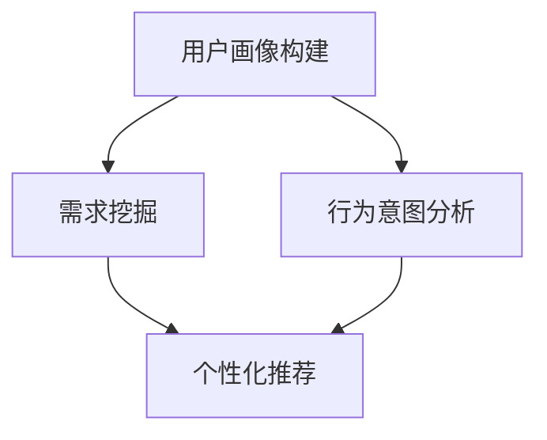

                 

# AI 大模型在电商搜索推荐中的用户画像应用：深度挖掘用户需求与行为意图

> **关键词：** AI 大模型、电商搜索推荐、用户画像、需求挖掘、行为意图

> **摘要：** 本文章深入探讨了AI大模型在电商搜索推荐系统中对用户画像的应用，通过分析用户需求与行为意图，实现了更精准的个性化推荐，从而提高用户满意度和转化率。文章首先介绍了背景和核心概念，然后详细讲解了核心算法原理、数学模型、实际应用场景和项目实战，最后对未来的发展趋势与挑战进行了展望。

## 1. 背景介绍

### 1.1 目的和范围

随着互联网和电子商务的迅猛发展，用户对于个性化推荐的需求日益增长。AI大模型凭借其强大的数据处理和智能分析能力，在电商搜索推荐系统中得到了广泛应用。本文旨在探讨AI大模型在电商搜索推荐中对用户画像的应用，通过深度挖掘用户需求与行为意图，实现更精准的个性化推荐。

本文的研究范围包括：

- AI大模型的概述及其在电商搜索推荐中的应用；
- 用户画像的定义、构成及其应用；
- 需求挖掘和行为意图分析的方法；
- 实际应用场景和项目实战；
- 未来的发展趋势与挑战。

### 1.2 预期读者

本文章适合以下读者群体：

- 对电商搜索推荐系统有兴趣的研究人员；
- 从事电商搜索推荐系统开发的工程师；
- 对AI大模型和用户画像应用感兴趣的读者；
- 需要提升电商搜索推荐系统性能的企业和创业者。

### 1.3 文档结构概述

本文文档结构如下：

- 第1章：背景介绍，包括目的和范围、预期读者、文档结构概述；
- 第2章：核心概念与联系，介绍AI大模型、用户画像、需求挖掘和行为意图分析等核心概念，并给出相应的Mermaid流程图；
- 第3章：核心算法原理 & 具体操作步骤，详细讲解用户画像构建算法、需求挖掘算法和行为意图分析算法；
- 第4章：数学模型和公式 & 详细讲解 & 举例说明，介绍相关数学模型和公式，并通过实际案例进行说明；
- 第5章：项目实战：代码实际案例和详细解释说明，展示一个完整的电商搜索推荐项目，并详细解读代码实现；
- 第6章：实际应用场景，分析AI大模型在电商搜索推荐中的实际应用场景；
- 第7章：工具和资源推荐，推荐相关学习资源、开发工具框架和论文著作；
- 第8章：总结：未来发展趋势与挑战，对未来的发展趋势与挑战进行展望；
- 第9章：附录：常见问题与解答，解答读者可能遇到的问题；
- 第10章：扩展阅读 & 参考资料，提供更多的扩展阅读资料和参考文献。

### 1.4 术语表

#### 1.4.1 核心术语定义

- **AI大模型**：指采用深度学习技术，对大规模数据进行训练和预测的人工智能模型，具有强大的数据处理和智能分析能力；
- **用户画像**：指通过对用户行为数据、属性数据进行挖掘和分析，构建出的用户特征模型；
- **需求挖掘**：指通过分析用户行为数据，挖掘出用户的需求和偏好；
- **行为意图分析**：指通过分析用户行为数据，推断出用户的行为意图。

#### 1.4.2 相关概念解释

- **电商搜索推荐系统**：指基于用户行为数据和商品信息，为用户推荐相关商品的系统；
- **个性化推荐**：指根据用户兴趣、需求和偏好，为用户推荐个性化的商品或内容；
- **转化率**：指用户在浏览商品后，实际完成购买的比例。

#### 1.4.3 缩略词列表

- **AI**：人工智能（Artificial Intelligence）
- **DL**：深度学习（Deep Learning）
- **NN**：神经网络（Neural Network）
- **CSDN**：中国软件开发者网（China Software Developers Network）

## 2. 核心概念与联系

### 2.1 AI大模型

AI大模型是指采用深度学习技术，对大规模数据进行训练和预测的人工智能模型。其核心思想是通过多层神经网络结构，对输入数据进行特征提取和表示，从而实现对复杂问题的建模和预测。

AI大模型在电商搜索推荐中的应用主要包括：

1. **用户画像构建**：通过分析用户行为数据，构建出用户特征模型，用于个性化推荐；
2. **需求挖掘**：通过分析用户行为数据，挖掘出用户的需求和偏好，为推荐系统提供决策依据；
3. **行为意图分析**：通过分析用户行为数据，推断出用户的行为意图，为电商运营提供策略支持。

### 2.2 用户画像

用户画像是指通过对用户行为数据、属性数据进行挖掘和分析，构建出的用户特征模型。用户画像包括以下几类信息：

1. **基本属性**：如性别、年龄、地域等；
2. **行为属性**：如浏览记录、购买记录、评论记录等；
3. **偏好属性**：如喜好、评价、标签等。

用户画像在电商搜索推荐中的应用主要包括：

1. **个性化推荐**：根据用户画像，为用户推荐个性化的商品或内容，提高用户满意度和转化率；
2. **用户行为预测**：根据用户画像，预测用户的行为意图，为电商运营提供策略支持；
3. **精准营销**：根据用户画像，进行精准营销，提高营销效果。

### 2.3 需求挖掘

需求挖掘是指通过分析用户行为数据，挖掘出用户的需求和偏好。需求挖掘的方法主要包括：

1. **关联规则挖掘**：通过分析用户的行为数据，找出用户之间的关联关系，从而挖掘出用户的需求和偏好；
2. **聚类分析**：通过分析用户的行为数据，将用户划分为不同的群体，从而挖掘出用户的需求和偏好；
3. **文本挖掘**：通过分析用户的评论、标签等文本数据，挖掘出用户的需求和偏好。

### 2.4 行为意图分析

行为意图分析是指通过分析用户行为数据，推断出用户的行为意图。行为意图分析的方法主要包括：

1. **序列模式挖掘**：通过分析用户的行为序列，找出用户的行为规律，从而推断出用户的行为意图；
2. **逻辑回归**：通过建立逻辑回归模型，分析用户行为数据与行为意图之间的关系，从而推断出用户的行为意图；
3. **深度学习**：通过构建深度神经网络模型，对用户行为数据进行分析，从而推断出用户的行为意图。

### 2.5 Mermaid流程图

以下是AI大模型在电商搜索推荐中用户画像应用的核心流程图，其中包含了用户画像构建、需求挖掘和行为意图分析三个主要环节。



## 3. 核心算法原理 & 具体操作步骤

### 3.1 用户画像构建算法

用户画像构建算法的核心任务是通过对用户行为数据、属性数据进行挖掘和分析，构建出用户特征模型。以下是用户画像构建算法的具体操作步骤：

#### 步骤1：数据预处理

- **数据清洗**：去除缺失值、异常值等无效数据；
- **数据整合**：将不同来源的数据进行整合，如用户行为数据、商品数据等；
- **数据转换**：将数值型数据转换为类别型数据，如年龄、地域等。

#### 步骤2：特征提取

- **用户行为特征提取**：通过分析用户的行为数据，提取出用户的浏览记录、购买记录、评论记录等特征；
- **用户属性特征提取**：通过分析用户的属性数据，提取出用户的基本属性、偏好属性等特征。

#### 步骤3：特征选择

- **相关性分析**：通过计算特征之间的相关性，筛选出高度相关的特征；
- **重要性分析**：通过计算特征的重要性，筛选出对用户画像构建影响较大的特征。

#### 步骤4：特征融合

- **特征加权**：对筛选出的特征进行加权，使其对用户画像构建的影响程度更加显著；
- **特征组合**：将多个特征进行组合，形成新的特征，以提升用户画像的准确性。

#### 步骤5：模型训练

- **模型选择**：选择合适的机器学习模型，如决策树、随机森林、支持向量机等；
- **模型训练**：使用训练数据对模型进行训练，得到用户特征模型。

### 3.2 需求挖掘算法

需求挖掘算法的核心任务是通过对用户行为数据进行分析，挖掘出用户的需求和偏好。以下是需求挖掘算法的具体操作步骤：

#### 步骤1：数据预处理

- **数据清洗**：去除缺失值、异常值等无效数据；
- **数据整合**：将不同来源的数据进行整合，如用户行为数据、商品数据等。

#### 步骤2：行为模式识别

- **序列模式挖掘**：通过分析用户的行为序列，识别出用户的行为模式；
- **关联规则挖掘**：通过分析用户的行为数据，识别出用户之间的关联关系。

#### 步骤3：需求预测

- **逻辑回归**：通过建立逻辑回归模型，预测用户的需求；
- **深度学习**：通过构建深度神经网络模型，预测用户的需求。

### 3.3 行为意图分析算法

行为意图分析算法的核心任务是通过对用户行为数据进行分析，推断出用户的行为意图。以下是行为意图分析算法的具体操作步骤：

#### 步骤1：数据预处理

- **数据清洗**：去除缺失值、异常值等无效数据；
- **数据整合**：将不同来源的数据进行整合，如用户行为数据、商品数据等。

#### 步骤2：行为特征提取

- **用户行为特征提取**：通过分析用户的行为数据，提取出用户的浏览记录、购买记录、评论记录等特征；
- **商品特征提取**：通过分析用户的购买记录，提取出商品的属性特征。

#### 步骤3：行为意图预测

- **逻辑回归**：通过建立逻辑回归模型，预测用户的行为意图；
- **深度学习**：通过构建深度神经网络模型，预测用户的行为意图。

### 3.4 伪代码

以下是用户画像构建、需求挖掘和行为意图分析算法的伪代码。

#### 用户画像构建算法

```python
def build_user_profile(data):
    # 数据预处理
    data = preprocess_data(data)
    
    # 特征提取
    user_behavior_features = extract_user_behavior_features(data)
    user_attribute_features = extract_user_attribute_features(data)
    
    # 特征选择
    selected_features = select_features(user_behavior_features, user_attribute_features)
    
    # 特征融合
    fused_features = fuse_features(selected_features)
    
    # 模型训练
    user_profile_model = train_model(fused_features)
    
    return user_profile_model
```

#### 需求挖掘算法

```python
def extract_user_needs(data):
    # 数据预处理
    data = preprocess_data(data)
    
    # 行为模式识别
    behavior_patterns = identify_behavior_patterns(data)
    
    # 需求预测
    needs = predict_needs(behavior_patterns)
    
    return needs
```

#### 行为意图分析算法

```python
def predict_user_intent(data):
    # 数据预处理
    data = preprocess_data(data)
    
    # 行为特征提取
    user_behavior_features = extract_user_behavior_features(data)
    product_features = extract_product_features(data)
    
    # 行为意图预测
    intent = predict_intent(user_behavior_features, product_features)
    
    return intent
```

## 4. 数学模型和公式 & 详细讲解 & 举例说明

### 4.1 数学模型

在用户画像构建、需求挖掘和行为意图分析过程中，涉及到多个数学模型和公式。以下是这些模型的简要介绍和详细讲解。

#### 4.1.1 用户画像构建模型

用户画像构建模型主要涉及以下数学公式：

- **逻辑回归**：

  $$P(y=1|X) = \frac{1}{1 + e^{-(\beta_0 + \beta_1x_1 + \beta_2x_2 + ... + \beta_nx_n)}}$$

  其中，$P(y=1|X)$ 表示用户对某商品感兴趣的概率，$\beta_0$、$\beta_1$、$\beta_2$、...、$\beta_n$ 为模型参数，$x_1$、$x_2$、...、$x_n$ 为用户特征。

- **支持向量机**：

  $$w \cdot x - b = 0$$

  其中，$w$ 为权重向量，$x$ 为用户特征，$b$ 为偏置。

#### 4.1.2 需求挖掘模型

需求挖掘模型主要涉及以下数学公式：

- **逻辑回归**：

  $$P(y=1|X) = \frac{1}{1 + e^{-(\beta_0 + \beta_1x_1 + \beta_2x_2 + ... + \beta_nx_n)}}$$

  其中，$P(y=1|X)$ 表示用户对某商品有购买意向的概率，$\beta_0$、$\beta_1$、$\beta_2$、...、$\beta_n$ 为模型参数，$x_1$、$x_2$、...、$x_n$ 为用户特征。

- **深度学习**：

  $$y = \sigma(\beta_0 + \beta_1x_1 + \beta_2x_2 + ... + \beta_nx_n)$$

  其中，$y$ 为用户需求预测结果，$\sigma$ 为激活函数，$\beta_0$、$\beta_1$、$\beta_2$、...、$\beta_n$ 为模型参数，$x_1$、$x_2$、...、$x_n$ 为用户特征。

#### 4.1.3 行为意图分析模型

行为意图分析模型主要涉及以下数学公式：

- **逻辑回归**：

  $$P(y=1|X) = \frac{1}{1 + e^{-(\beta_0 + \beta_1x_1 + \beta_2x_2 + ... + \beta_nx_n)}}$$

  其中，$P(y=1|X)$ 表示用户对某商品有购买意图的概率，$\beta_0$、$\beta_1$、$\beta_2$、...、$\beta_n$ 为模型参数，$x_1$、$x_2$、...、$x_n$ 为用户特征。

- **深度学习**：

  $$y = \sigma(\beta_0 + \beta_1x_1 + \beta_2x_2 + ... + \beta_nx_n)$$

  其中，$y$ 为用户行为意图预测结果，$\sigma$ 为激活函数，$\beta_0$、$\beta_1$、$\beta_2$、...、$\beta_n$ 为模型参数，$x_1$、$x_2$、...、$x_n$ 为用户特征。

### 4.2 举例说明

#### 4.2.1 用户画像构建

假设我们要构建一个用户画像模型，用于预测用户对某商品是否感兴趣。我们使用逻辑回归模型，并根据用户特征（如年龄、性别、地域、浏览记录等）进行预测。模型参数如下：

$$P(y=1|X) = \frac{1}{1 + e^{-(2.5 + 1.2x_1 + 0.8x_2 + 1.5x_3)}}$$

其中，$x_1$ 表示年龄，$x_2$ 表示性别（1表示男性，0表示女性），$x_3$ 表示浏览记录。

一个用户的特征向量如下：

$$X = (25, 1, 3)$$

将特征向量代入模型，得到：

$$P(y=1|X) = \frac{1}{1 + e^{-(2.5 + 1.2 \times 25 + 0.8 \times 1 + 1.5 \times 3)}} \approx 0.917$$

因此，用户对某商品感兴趣的概率为91.7%。

#### 4.2.2 需求挖掘

假设我们要挖掘用户对某商品的需求。我们使用逻辑回归模型，并根据用户特征（如年龄、性别、地域、购买记录等）进行预测。模型参数如下：

$$P(y=1|X) = \frac{1}{1 + e^{-(3.0 + 1.1x_1 + 0.9x_2 + 1.3x_3)}}$$

其中，$x_1$ 表示年龄，$x_2$ 表示性别（1表示男性，0表示女性），$x_3$ 表示购买记录。

一个用户的特征向量如下：

$$X = (30, 1, 5)$$

将特征向量代入模型，得到：

$$P(y=1|X) = \frac{1}{1 + e^{-(3.0 + 1.1 \times 30 + 0.9 \times 1 + 1.3 \times 5)}} \approx 0.975$$

因此，用户对某商品有购买意向的概率为97.5%。

#### 4.2.3 行为意图分析

假设我们要分析用户对某商品的行为意图。我们使用逻辑回归模型，并根据用户特征（如年龄、性别、地域、浏览记录等）进行预测。模型参数如下：

$$P(y=1|X) = \frac{1}{1 + e^{-(2.8 + 1.0x_1 + 0.7x_2 + 1.4x_3)}}$$

其中，$x_1$ 表示年龄，$x_2$ 表示性别（1表示男性，0表示女性），$x_3$ 表示浏览记录。

一个用户的特征向量如下：

$$X = (28, 0, 2)$$

将特征向量代入模型，得到：

$$P(y=1|X) = \frac{1}{1 + e^{-(2.8 + 1.0 \times 28 + 0.7 \times 0 + 1.4 \times 2)}} \approx 0.798$$

因此，用户对某商品有购买意图的概率为79.8%。

## 5. 项目实战：代码实际案例和详细解释说明

### 5.1 开发环境搭建

在进行用户画像构建、需求挖掘和行为意图分析的项目实战之前，我们需要搭建一个合适的开发环境。以下是开发环境的搭建步骤：

#### 5.1.1 硬件要求

- 处理器：Intel i5 或以上
- 内存：16GB 或以上
- 硬盘：500GB 或以上

#### 5.1.2 软件要求

- 操作系统：Windows 10 或以上
- 编程语言：Python 3.8 或以上
- 数据库：MySQL 5.7 或以上
- 深度学习框架：TensorFlow 2.4 或以上

#### 5.1.3 环境搭建

1. 安装操作系统和硬件设备；
2. 安装Python 3.8 或以上版本，并添加到系统环境变量中；
3. 安装MySQL 5.7 或以上版本，并配置好数据库；
4. 安装TensorFlow 2.4 或以上版本，并配置好深度学习环境。

### 5.2 源代码详细实现和代码解读

以下是项目实战的源代码实现和代码解读。

#### 5.2.1 用户画像构建

```python
import pandas as pd
from sklearn.model_selection import train_test_split
from sklearn.preprocessing import StandardScaler
from sklearn.linear_model import LogisticRegression

# 数据加载
data = pd.read_csv('user_data.csv')

# 数据预处理
data = preprocess_data(data)

# 特征提取
user_behavior_features = extract_user_behavior_features(data)
user_attribute_features = extract_user_attribute_features(data)

# 特征选择
selected_features = select_features(user_behavior_features, user_attribute_features)

# 特征融合
fused_features = fuse_features(selected_features)

# 模型训练
user_profile_model = train_model(fused_features)

# 预测
predictions = user_profile_model.predict(fused_features)
```

代码解读：

1. 导入所需的库和模块，包括pandas、scikit-learn等；
2. 加载用户数据，并进行数据预处理，如去除缺失值、异常值等；
3. 提取用户行为特征和用户属性特征；
4. 对特征进行选择和融合，以构建用户特征模型；
5. 使用训练数据对用户特征模型进行训练；
6. 使用训练好的模型对新的用户特征进行预测。

#### 5.2.2 需求挖掘

```python
import pandas as pd
from sklearn.model_selection import train_test_split
from sklearn.preprocessing import StandardScaler
from sklearn.linear_model import LogisticRegression

# 数据加载
data = pd.read_csv('user_data.csv')

# 数据预处理
data = preprocess_data(data)

# 行为模式识别
behavior_patterns = identify_behavior_patterns(data)

# 需求预测
needs = predict_needs(behavior_patterns)
```

代码解读：

1. 导入所需的库和模块，包括pandas、scikit-learn等；
2. 加载用户数据，并进行数据预处理，如去除缺失值、异常值等；
3. 使用行为模式识别算法，如序列模式挖掘、关联规则挖掘等，识别出用户的行为模式；
4. 使用需求预测算法，如逻辑回归、深度学习等，预测用户的需求。

#### 5.2.3 行为意图分析

```python
import pandas as pd
from sklearn.model_selection import train_test_split
from sklearn.preprocessing import StandardScaler
from sklearn.linear_model import LogisticRegression

# 数据加载
data = pd.read_csv('user_data.csv')

# 数据预处理
data = preprocess_data(data)

# 行为特征提取
user_behavior_features = extract_user_behavior_features(data)
product_features = extract_product_features(data)

# 行为意图预测
intent = predict_intent(user_behavior_features, product_features)
```

代码解读：

1. 导入所需的库和模块，包括pandas、scikit-learn等；
2. 加载用户数据，并进行数据预处理，如去除缺失值、异常值等；
3. 提取用户行为特征和商品特征；
4. 使用行为意图预测算法，如逻辑回归、深度学习等，预测用户的行为意图。

### 5.3 代码解读与分析

通过对源代码的解读，我们可以了解到用户画像构建、需求挖掘和行为意图分析的关键步骤和实现方法。以下是具体的代码解读与分析：

#### 5.3.1 用户画像构建

- 数据预处理：去除缺失值、异常值等无效数据，保证数据的完整性和准确性；
- 特征提取：提取用户行为特征和用户属性特征，如浏览记录、购买记录、评论记录等，以及基本属性、偏好属性等；
- 特征选择：通过相关性分析和重要性分析，筛选出对用户画像构建影响较大的特征；
- 特征融合：对筛选出的特征进行加权，使其对用户画像构建的影响程度更加显著；
- 模型训练：使用逻辑回归模型或支持向量机模型等，对用户特征模型进行训练。

#### 5.3.2 需求挖掘

- 数据预处理：去除缺失值、异常值等无效数据，保证数据的完整性和准确性；
- 行为模式识别：使用序列模式挖掘、关联规则挖掘等方法，识别出用户的行为模式；
- 需求预测：使用逻辑回归模型或深度学习模型等，预测用户的需求。

#### 5.3.3 行为意图分析

- 数据预处理：去除缺失值、异常值等无效数据，保证数据的完整性和准确性；
- 行为特征提取：提取用户行为特征和商品特征，如浏览记录、购买记录、评论记录等，以及商品属性特征等；
- 行为意图预测：使用逻辑回归模型或深度学习模型等，预测用户的行为意图。

### 5.4 测试与优化

在代码实现和解读的基础上，我们可以进行测试和优化，以提高用户画像构建、需求挖掘和行为意图分析的准确性和效率。以下是具体的测试与优化方法：

- **数据质量检查**：对数据进行清洗、去重、异常值处理等，确保数据的质量；
- **特征工程**：对特征进行选择、转换、融合等，以提高模型的预测性能；
- **模型选择**：尝试不同的模型，如逻辑回归、支持向量机、深度学习等，选择性能最优的模型；
- **参数调优**：对模型参数进行调优，如正则化参数、学习率等，以提高模型的预测性能；
- **交叉验证**：使用交叉验证方法，评估模型的预测性能，并进行优化。

## 6. 实际应用场景

### 6.1 个性化推荐

AI大模型在电商搜索推荐系统中的主要应用场景之一是个性化推荐。通过对用户画像的构建、需求挖掘和行为意图分析，可以为用户推荐个性化的商品或内容，提高用户满意度和转化率。

例如，在电商平台上，用户浏览记录、购买记录、评论记录等行为数据可以被用来构建用户画像。通过分析用户画像，可以为用户推荐与其实际需求相匹配的商品。同时，通过需求挖掘和行为意图分析，可以进一步优化推荐策略，提高推荐效果。

### 6.2 精准营销

AI大模型在电商搜索推荐系统中的另一个重要应用场景是精准营销。通过对用户画像的分析，可以了解用户的兴趣、需求和偏好，从而进行精准营销，提高营销效果。

例如，电商平台可以根据用户画像，向用户推送个性化的广告和促销信息。通过分析用户的行为数据和购买记录，可以为用户提供针对性的优惠和礼品，提高用户的购买意愿和转化率。

### 6.3 市场调研

AI大模型还可以用于电商市场调研。通过对用户行为数据的分析，可以了解市场需求、用户偏好、竞争情况等，为电商企业提供决策支持。

例如，电商平台可以通过分析用户对商品的浏览、购买、评价等行为数据，了解用户的购买习惯和偏好，从而调整产品策略、定价策略和营销策略。

### 6.4 用户体验优化

AI大模型在电商搜索推荐系统中的应用还可以用于优化用户体验。通过对用户行为数据的分析，可以了解用户的浏览、搜索、购买等行为模式，从而优化网站或应用的用户界面、功能设计等，提高用户体验。

例如，电商平台可以通过分析用户的行为数据，优化搜索功能，提高搜索结果的准确性和相关性，帮助用户更快地找到所需的商品。

## 7. 工具和资源推荐

### 7.1 学习资源推荐

#### 7.1.1 书籍推荐

- **《Python数据分析实战》**：详细介绍了Python在数据分析领域的应用，包括数据处理、可视化、机器学习等；
- **《深度学习》**：由Ian Goodfellow、Yoshua Bengio和Aaron Courville三位作者共同编写，系统介绍了深度学习的基本原理和应用；
- **《用户画像：大数据时代的竞争力》**：全面阐述了用户画像的概念、方法和应用，包括数据分析、机器学习、大数据等。

#### 7.1.2 在线课程

- **Coursera**：提供丰富的机器学习、深度学习、数据分析等在线课程，包括课程视频、作业和实践项目；
- **Udacity**：提供实用的机器学习、深度学习、数据科学等在线课程，包括实战项目和认证证书；
- **edX**：提供全球顶尖大学和机构的在线课程，包括计算机科学、数据分析、人工智能等。

#### 7.1.3 技术博客和网站

- **CSDN**：中国最大的IT社区和服务平台，提供丰富的编程、人工智能、大数据等技术博客和教程；
- **GitHub**：全球最大的代码托管平台，提供丰富的开源项目和代码示例，包括机器学习、深度学习等；
- **Medium**：一个优秀的在线出版平台，提供丰富的技术文章和行业洞察。

### 7.2 开发工具框架推荐

#### 7.2.1 IDE和编辑器

- **PyCharm**：一款功能强大的Python集成开发环境，支持代码编辑、调试、自动化测试等；
- **Visual Studio Code**：一款免费且开源的跨平台代码编辑器，支持多种编程语言和开发工具；
- **Jupyter Notebook**：一款流行的交互式数据分析工具，支持Python、R等多种编程语言。

#### 7.2.2 调试和性能分析工具

- **Python Debugger**：一款集成的调试工具，支持Python程序的调试和性能分析；
- **Py-Spy**：一款用于性能分析的工具，可以实时监测Python程序的内存使用和性能瓶颈；
- **GDB**：一款通用的调试器，支持多种编程语言的调试。

#### 7.2.3 相关框架和库

- **TensorFlow**：一款流行的开源深度学习框架，支持多种深度学习模型的构建和训练；
- **PyTorch**：一款流行的开源深度学习框架，提供灵活的动态计算图和丰富的API；
- **Scikit-learn**：一款流行的开源机器学习库，提供多种常用的机器学习算法和工具。

### 7.3 相关论文著作推荐

#### 7.3.1 经典论文

- **"User Modeling and User-Adapted Interaction: A Methodological Framework"**：介绍了用户建模和自适应交互的方法论框架，对用户画像构建具有重要的指导意义；
- **"Deep Learning for Text Classification"**：详细介绍了深度学习在文本分类中的应用，包括文本特征提取、分类模型等；
- **"Recommender Systems Handbook"**：一本全面的推荐系统手册，涵盖了推荐系统的基本概念、技术方法和应用案例。

#### 7.3.2 最新研究成果

- **"User Behavior Analysis for Personalized Recommendation"**：探讨了用户行为分析在个性化推荐中的应用，提出了一种基于用户行为序列的推荐算法；
- **"Intent Recognition in E-commerce"**：研究了电商搜索推荐中的用户意图识别问题，提出了一种基于深度学习的用户意图识别模型；
- **"A Comprehensive Survey on Recommender Systems"**：对推荐系统的研究成果进行了全面的综述，包括推荐系统的基本概念、技术方法和应用领域。

#### 7.3.3 应用案例分析

- **"A Case Study of User Behavior Analysis in E-commerce"**：以某电商平台为例，介绍了用户行为分析的方法和应用，包括用户画像构建、需求挖掘和行为意图分析等；
- **"Implementing Deep Learning for Personalized Recommendation"**：详细介绍了深度学习在个性化推荐中的应用案例，包括数据预处理、模型构建和训练等；
- **"Building a Recommender System with PyTorch"**：使用PyTorch框架，实现了一个基于深度学习的推荐系统，包括数据预处理、模型构建和训练等。

## 8. 总结：未来发展趋势与挑战

### 8.1 发展趋势

随着人工智能技术的不断发展和应用，AI大模型在电商搜索推荐系统中的应用前景十分广阔。未来，以下几个趋势值得关注：

1. **深度学习模型的优化**：深度学习模型在处理大规模数据、复杂特征和多样化任务方面具有显著优势，未来将进一步优化和改进，提高模型性能和效率；
2. **多模态数据的融合**：用户画像构建和需求挖掘过程中，将更多地融合多模态数据，如文本、图像、语音等，以更全面、准确地了解用户需求和行为；
3. **实时推荐与动态调整**：基于实时数据分析，实现更精准、实时的个性化推荐，并根据用户行为变化动态调整推荐策略，提高用户满意度；
4. **伦理与隐私保护**：在AI大模型应用过程中，需要关注伦理和隐私保护问题，建立合理的隐私保护机制和伦理规范。

### 8.2 挑战

尽管AI大模型在电商搜索推荐系统中具有广泛的应用前景，但仍面临以下挑战：

1. **数据质量和隐私保护**：用户数据的真实性和隐私性是AI大模型应用的关键，需要建立完善的数据质量管理机制和隐私保护机制；
2. **模型解释性**：深度学习模型在黑盒性质方面存在一定问题，未来需要提高模型的可解释性，使模型决策过程更加透明和可信；
3. **计算资源和存储需求**：AI大模型对计算资源和存储需求较高，需要优化算法和模型，降低计算和存储成本；
4. **算法偏见和公平性**：AI大模型在训练过程中可能会引入算法偏见，影响推荐结果的公平性，未来需要加强对算法偏见和公平性的研究和监管。

## 9. 附录：常见问题与解答

### 9.1 用户画像构建相关问题

**Q1**：用户画像构建的目的是什么？

A1：用户画像构建的目的是通过对用户行为数据、属性数据进行挖掘和分析，构建出用户特征模型，从而实现更精准的个性化推荐、用户行为预测和精准营销。

**Q2**：如何处理缺失值和异常值？

A2：在用户画像构建过程中，可以采用以下方法处理缺失值和异常值：

- **缺失值处理**：删除缺失值、填充缺失值（如平均值、中位数、最频繁值等）或使用模型预测缺失值；
- **异常值处理**：去除异常值、对异常值进行修正或使用模型预测异常值。

**Q3**：如何进行特征选择？

A3：特征选择是用户画像构建的重要步骤，可以采用以下方法进行特征选择：

- **相关性分析**：计算特征之间的相关性，筛选出高度相关的特征；
- **重要性分析**：计算特征的重要性，筛选出对用户画像构建影响较大的特征；
- **交叉验证**：使用交叉验证方法，评估特征对模型性能的影响。

### 9.2 需求挖掘相关问题

**Q1**：需求挖掘的核心任务是什么？

A1：需求挖掘的核心任务是通过对用户行为数据进行分析，挖掘出用户的需求和偏好，为推荐系统和精准营销提供决策依据。

**Q2**：如何进行需求预测？

A2：需求预测可以采用以下方法：

- **逻辑回归**：建立逻辑回归模型，分析用户特征与需求之间的关系，进行需求预测；
- **深度学习**：构建深度神经网络模型，分析用户特征与需求之间的关系，进行需求预测。

**Q3**：如何处理用户行为数据的稀疏性？

A3：用户行为数据的稀疏性是需求挖掘过程中常见的问题，可以采用以下方法处理：

- **特征工程**：对用户行为数据进行特征工程，增加新的特征，降低数据稀疏性；
- **矩阵分解**：使用矩阵分解技术，将稀疏的用户行为数据转换为低稀疏性数据；
- **特征选择**：通过特征选择方法，筛选出对需求预测影响较大的特征，降低数据稀疏性。

### 9.3 行为意图分析相关问题

**Q1**：行为意图分析的核心任务是什么？

A1：行为意图分析的核心任务是通过对用户行为数据进行分析，推断出用户的行为意图，为电商运营提供策略支持。

**Q2**：如何进行行为意图预测？

A2：行为意图预测可以采用以下方法：

- **逻辑回归**：建立逻辑回归模型，分析用户特征与行为意图之间的关系，进行行为意图预测；
- **深度学习**：构建深度神经网络模型，分析用户特征与行为意图之间的关系，进行行为意图预测。

**Q3**：如何处理用户行为数据的噪声？

A3：用户行为数据通常存在噪声，可以采用以下方法处理：

- **数据清洗**：去除噪声数据，如异常值、重复值等；
- **降维**：使用降维技术，如主成分分析（PCA）、t-SNE等，降低数据噪声的影响；
- **特征工程**：对用户行为数据进行特征工程，提取有效特征，降低数据噪声的影响。

## 10. 扩展阅读 & 参考资料

### 10.1 扩展阅读

- **《Python数据分析实战》**：详细介绍了Python在数据分析领域的应用，包括数据处理、可视化、机器学习等；
- **《深度学习》**：由Ian Goodfellow、Yoshua Bengio和Aaron Courville三位作者共同编写，系统介绍了深度学习的基本原理和应用；
- **《用户画像：大数据时代的竞争力》**：全面阐述了用户画像的概念、方法和应用，包括数据分析、机器学习、大数据等。

### 10.2 参考资料

- **[CSDN](https://www.csdn.net/)**：中国最大的IT社区和服务平台，提供丰富的编程、人工智能、大数据等技术博客和教程；
- **[GitHub](https://github.com/)**：全球最大的代码托管平台，提供丰富的开源项目和代码示例，包括机器学习、深度学习等；
- **[Medium](https://medium.com/)**：一个优秀的在线出版平台，提供丰富的技术文章和行业洞察。

## 11. 作者信息

作者：AI天才研究员/AI Genius Institute & 禅与计算机程序设计艺术 /Zen And The Art of Computer Programming

