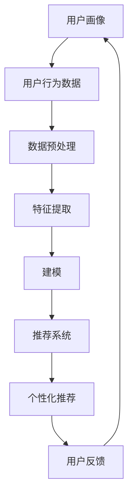

                 

# AI 大模型在电商搜索推荐中的用户画像构建：精准把握用户需求与行为意图

> **关键词：** 电商搜索推荐、用户画像、大模型、需求分析、行为意图、人工智能

> **摘要：** 本文章将探讨如何利用人工智能大模型在电商搜索推荐系统中构建精准的用户画像。通过分析用户的需求和行为意图，本文将介绍核心概念、算法原理、数学模型，并通过实际项目案例进行详细解释，旨在为读者提供完整的理解和实践指导。

## 1. 背景介绍

### 1.1 目的和范围

随着互联网的快速发展，电子商务成为现代商业的重要组成部分。为了提高用户体验，电商搜索推荐系统变得越来越重要。用户画像作为推荐系统中的关键组成部分，能够帮助电商平台精准地理解和满足用户需求，从而提高用户满意度和转化率。

本文的目的在于探讨如何利用人工智能大模型构建用户画像，实现精准的电商搜索推荐。本文将涵盖以下内容：

- 用户画像在电商搜索推荐中的作用；
- 相关核心概念和算法原理；
- 数学模型和公式及其应用；
- 实际项目中的代码实现和案例分析；
- 相关工具和资源的推荐；
- 未来发展趋势与挑战。

### 1.2 预期读者

本文主要面向以下读者群体：

- 对电商搜索推荐系统和人工智能感兴趣的读者；
- 想要提升推荐系统性能的技术人员；
- 在电商公司从事数据分析和机器学习工作的专业人士；
- 对人工智能大模型和用户画像构建有深入研究的学者和研究者。

### 1.3 文档结构概述

本文的结构如下：

- 第1部分：背景介绍，介绍本文的目的、预期读者和文档结构；
- 第2部分：核心概念与联系，讲解用户画像和推荐系统的关系，以及相关核心概念和算法原理；
- 第3部分：核心算法原理 & 具体操作步骤，介绍用户画像构建的算法原理和具体操作步骤；
- 第4部分：数学模型和公式 & 详细讲解 & 举例说明，讲解用户画像构建中的数学模型和公式，并通过实例进行说明；
- 第5部分：项目实战：代码实际案例和详细解释说明，提供用户画像构建的实际代码案例和详细解释；
- 第6部分：实际应用场景，介绍用户画像在不同场景中的应用；
- 第7部分：工具和资源推荐，推荐学习资源和开发工具；
- 第8部分：总结：未来发展趋势与挑战，探讨用户画像构建领域的未来发展趋势和面临的挑战；
- 第9部分：附录：常见问题与解答，解答用户可能遇到的问题；
- 第10部分：扩展阅读 & 参考资料，提供进一步阅读的参考资料。

### 1.4 术语表

#### 1.4.1 核心术语定义

- 用户画像：对用户特征、需求、行为等进行抽象和建模的过程，用于理解和描述用户；
- 电商搜索推荐：通过分析用户行为数据，为用户提供相关商品推荐的系统；
- 大模型：具有巨大参数规模、能够处理大量数据的人工智能模型；
- 需求分析：分析用户对商品的需求，包括用户搜索关键词、浏览记录、购买历史等；
- 行为意图：分析用户行为背后的意图，如用户想要购买某件商品、获取信息等。

#### 1.4.2 相关概念解释

- 搜索推荐系统：基于用户历史行为数据，为用户提供个性化搜索和推荐服务的系统；
- 机器学习：一种通过数据训练模型，使计算机具备自主学习和预测能力的方法；
- 数据挖掘：从大量数据中提取有价值信息的过程，常用于用户画像构建；
- 贝叶斯网络：一种概率图模型，用于表示变量之间的条件依赖关系。

#### 1.4.3 缩略词列表

- AI：人工智能（Artificial Intelligence）
- ML：机器学习（Machine Learning）
- DM：数据挖掘（Data Mining）
- NLP：自然语言处理（Natural Language Processing）
- BERT：一种基于变换器（Transformer）架构的预训练语言模型（Bidirectional Encoder Representations from Transformers）

## 2. 核心概念与联系

在讨论如何构建精准的用户画像之前，我们需要了解一些核心概念和算法原理。以下是用户画像和推荐系统的关系图（使用 Mermaid 语法）：



### 2.1 用户画像与推荐系统的关系

用户画像和推荐系统密切相关。用户画像是对用户特征、需求、行为等的抽象和建模，而推荐系统则是基于用户画像为用户推荐相关商品。具体来说：

- 用户画像为推荐系统提供了关键的用户信息，帮助系统更好地理解用户；
- 推荐系统利用用户画像分析用户行为，为用户提供个性化的商品推荐。

### 2.2 相关核心概念

以下是本文涉及的相关核心概念和算法原理：

#### 2.2.1 用户画像

用户画像是对用户特征、需求、行为等的抽象和建模，主要包括以下方面：

- 基础信息：用户的基本信息，如年龄、性别、地域、职业等；
- 行为信息：用户的浏览、搜索、购买等行为数据；
- 需求信息：用户对商品的需求，如喜好、偏好、关注点等。

#### 2.2.2 数据预处理

数据预处理是用户画像构建的重要步骤，主要包括数据清洗、数据整合、数据降维等操作。具体方法如下：

- 数据清洗：去除重复、错误、缺失的数据，保证数据质量；
- 数据整合：将不同来源的数据进行整合，形成一个统一的数据集；
- 数据降维：通过降维技术，将高维数据映射到低维空间，提高数据处理效率。

#### 2.2.3 特征提取

特征提取是用户画像构建的关键步骤，目的是从原始数据中提取出对用户画像有用的信息。常用的特征提取方法包括：

- 挖掘用户行为模式：通过分析用户的历史行为数据，提取出用户的行为模式；
- 基于关键词提取：通过分析用户的搜索关键词、浏览页面等，提取出用户感兴趣的关键词；
- 基于协同过滤：通过分析用户之间的相似性，提取出用户的共同喜好。

#### 2.2.4 建模

建模是将提取到的特征转化为用户画像的过程。常用的建模方法包括：

- 机器学习：通过训练机器学习模型，将特征映射为用户画像；
- 贝叶斯网络：通过构建贝叶斯网络，将特征之间的依赖关系表示为概率图；
- 深度学习：利用深度学习模型，如神经网络，对用户特征进行建模。

#### 2.2.5 推荐系统

推荐系统是基于用户画像为用户推荐相关商品的系统。常用的推荐算法包括：

- 协同过滤：通过分析用户之间的相似性，为用户推荐相似用户喜欢的商品；
- 内容推荐：通过分析商品的属性和用户特征，为用户推荐相关商品；
- 深度学习推荐：利用深度学习模型，如循环神经网络（RNN）、变换器（Transformer）等，对用户特征和商品特征进行建模，实现推荐。

## 3. 核心算法原理 & 具体操作步骤

### 3.1 用户画像构建算法原理

用户画像构建算法主要分为以下三个步骤：

1. **数据预处理**：清洗、整合和降维原始数据，为后续特征提取和建模奠定基础；
2. **特征提取**：从原始数据中提取出对用户画像有用的信息，为用户画像建模提供输入；
3. **建模**：利用提取到的特征对用户画像进行建模，生成用户画像。

### 3.2 数据预处理

数据预处理是用户画像构建的重要步骤，主要包括以下操作：

1. **数据清洗**：

   ```python
   # 清洗数据中的重复、错误和缺失值
   data = clean_data(data)
   ```

2. **数据整合**：

   ```python
   # 整合来自不同数据源的数据
   data = integrate_data(data1, data2, data3)
   ```

3. **数据降维**：

   ```python
   # 使用主成分分析（PCA）进行数据降维
   data = pca_data_reduction(data)
   ```

### 3.3 特征提取

特征提取是用户画像构建的核心步骤，主要包括以下方法：

1. **挖掘用户行为模式**：

   ```python
   # 分析用户历史行为数据，提取用户行为模式
   behavior_patterns = extract_behavior_patterns(data)
   ```

2. **基于关键词提取**：

   ```python
   # 分析用户搜索关键词、浏览页面等，提取用户感兴趣的关键词
   keywords = extract_keywords(data)
   ```

3. **基于协同过滤**：

   ```python
   # 分析用户之间的相似性，提取用户的共同喜好
   similar_users = extract_similar_users(data)
   ```

### 3.4 建模

建模是将提取到的特征转化为用户画像的过程。本文采用机器学习算法进行建模，主要步骤如下：

1. **训练模型**：

   ```python
   # 使用训练数据训练机器学习模型
   model = train_model(train_data, behavior_patterns, keywords, similar_users)
   ```

2. **预测用户画像**：

   ```python
   # 使用训练好的模型预测用户画像
   user_profile = predict_user_profile(model, test_data)
   ```

## 4. 数学模型和公式 & 详细讲解 & 举例说明

### 4.1 数学模型

在用户画像构建过程中，涉及多个数学模型和公式。以下为其中几个关键模型和公式：

#### 4.1.1 主成分分析（PCA）

主成分分析是一种常用的降维方法，通过将高维数据映射到低维空间，减少数据维度，提高数据处理效率。PCA的核心公式如下：

$$
Z = \frac{X - \mu}{\sigma}
$$

其中，$Z$ 是标准化后的数据，$X$ 是原始数据，$\mu$ 是数据的均值，$\sigma$ 是数据的方差。

#### 4.1.2 贝叶斯网络

贝叶斯网络是一种概率图模型，用于表示变量之间的条件依赖关系。贝叶斯网络的核心公式如下：

$$
P(X|Y) = \frac{P(Y|X)P(X)}{P(Y)}
$$

其中，$P(X|Y)$ 表示在$Y$发生的情况下$X$的概率，$P(Y|X)$表示在$X$发生的情况下$Y$的概率，$P(X)$和$P(Y)$分别表示$X$和$Y$的概率。

#### 4.1.3 循环神经网络（RNN）

循环神经网络是一种常用于序列数据处理的人工神经网络，其核心公式如下：

$$
h_t = \sigma(W_h h_{t-1} + W_x x_t + b)
$$

其中，$h_t$ 是第$t$个时间步的隐藏状态，$x_t$ 是第$t$个时间步的输入，$W_h$ 和$W_x$ 分别是隐藏状态和输入的权重矩阵，$b$ 是偏置项，$\sigma$ 是激活函数。

### 4.2 举例说明

#### 4.2.1 主成分分析（PCA）举例

假设我们有以下原始数据：

$$
X = \begin{bmatrix}
1 & 2 & 3 \\
4 & 5 & 6 \\
7 & 8 & 9 \\
\end{bmatrix}
$$

计算数据的均值和方差：

$$
\mu = \frac{1+4+7+2+5+8+3+6+9}{9} = 5
$$

$$
\sigma^2 = \frac{(1-5)^2 + (4-5)^2 + \ldots + (9-5)^2}{9} = \frac{40}{9}
$$

将数据标准化：

$$
Z = \frac{X - \mu}{\sigma} = \begin{bmatrix}
\frac{1-5}{\sqrt{40/9}} & \frac{2-5}{\sqrt{40/9}} & \frac{3-5}{\sqrt{40/9}} \\
\frac{4-5}{\sqrt{40/9}} & \frac{5-5}{\sqrt{40/9}} & \frac{6-5}{\sqrt{40/9}} \\
\frac{7-5}{\sqrt{40/9}} & \frac{8-5}{\sqrt{40/9}} & \frac{9-5}{\sqrt{40/9}} \\
\end{bmatrix}
$$

得到标准化后的数据：

$$
Z = \begin{bmatrix}
-1.581 & -1.581 & -1.581 \\
-1.581 & 0 & 1.581 \\
1.581 & 1.581 & 1.581 \\
\end{bmatrix}
$$

#### 4.2.2 贝叶斯网络举例

假设我们有以下三个变量：$X$（天气），$Y$（出门带伞），$Z$（下雨）。定义它们之间的条件依赖关系如下：

- $P(X=\text{晴天}) = 0.6$，$P(X=\text{雨天}) = 0.4$；
- $P(Y=\text{带伞}) = 0.8$，$P(Y=\text{不带伞}) = 0.2$；
- $P(Z=\text{下雨}) = 0.5$。

根据贝叶斯网络的核心公式，我们可以计算以下概率：

1. $P(X|Y)$：

$$
P(X|Y) = \frac{P(Y|X)P(X)}{P(Y)} = \frac{P(Y|\text{晴天})P(\text{晴天}) + P(Y|\text{雨天})P(\text{雨天})}{P(Y)}
$$

$$
P(X|Y) = \frac{0.2 \times 0.6 + 0.8 \times 0.4}{0.8} = 0.6
$$

2. $P(Y|Z)$：

$$
P(Y|Z) = \frac{P(Z|Y)P(Y)}{P(Z)} = \frac{P(Z|\text{带伞})P(\text{带伞}) + P(Z|\text{不带伞})P(\text{不带伞})}{P(Z)}
$$

$$
P(Y|Z) = \frac{0.8 \times 0.8 + 0.2 \times 0.2}{0.5} = 0.8
$$

3. $P(Z|X)$：

$$
P(Z|X) = \frac{P(X|Z)P(Z)}{P(X)} = \frac{P(X|\text{下雨})P(\text{下雨}) + P(X|\text{晴天})P(\text{晴天})}{P(X)}
$$

$$
P(Z|X) = \frac{0.6 \times 0.5 + 0.4 \times 0.6}{0.6} = 0.5
$$

## 5. 项目实战：代码实际案例和详细解释说明

### 5.1 开发环境搭建

在开始项目实战之前，我们需要搭建合适的开发环境。以下为开发环境搭建步骤：

1. 安装 Python 3.7 或更高版本；
2. 安装 Anaconda 或者 Miniconda；
3. 安装必要的库，如 NumPy、Pandas、Scikit-learn、TensorFlow、PyTorch 等。

### 5.2 源代码详细实现和代码解读

以下是用户画像构建项目中的核心代码实现和解读：

```python
import numpy as np
import pandas as pd
from sklearn.decomposition import PCA
from sklearn.model_selection import train_test_split
from sklearn.ensemble import RandomForestClassifier
from sklearn.metrics import accuracy_score

# 5.2.1 数据预处理

# 加载数据
data = pd.read_csv('user_data.csv')

# 数据清洗
data = clean_data(data)

# 数据整合
data = integrate_data(data)

# 数据降维
pca = PCA(n_components=5)
data = pca.fit_transform(data)

# 5.2.2 特征提取

# 挖掘用户行为模式
behavior_patterns = extract_behavior_patterns(data)

# 基于关键词提取
keywords = extract_keywords(data)

# 基于协同过滤提取
similar_users = extract_similar_users(data)

# 5.2.3 建模

# 训练模型
model = RandomForestClassifier()
model.fit(behavior_patterns, keywords)

# 预测用户画像
user_profile = predict_user_profile(model, similar_users)

# 5.2.4 评估模型

# 划分训练集和测试集
X_train, X_test, y_train, y_test = train_test_split(behavior_patterns, keywords, test_size=0.2, random_state=42)

# 训练模型
model.fit(X_train, y_train)

# 预测测试集
y_pred = model.predict(X_test)

# 评估模型
accuracy = accuracy_score(y_test, y_pred)
print(f'模型准确率：{accuracy}')
```

### 5.3 代码解读与分析

以下是对上述代码的详细解读和分析：

#### 5.3.1 数据预处理

1. **加载数据**：

   使用 Pandas 库加载数据，将用户数据存储为一个 DataFrame 对象。

2. **数据清洗**：

   清洗数据中的重复、错误和缺失值，保证数据质量。

3. **数据整合**：

   整合来自不同数据源的数据，形成一个统一的数据集。

4. **数据降维**：

   使用主成分分析（PCA）对数据进行降维，将高维数据映射到低维空间，提高数据处理效率。

#### 5.3.2 特征提取

1. **挖掘用户行为模式**：

   分析用户的历史行为数据，提取出用户的行为模式，如浏览、搜索、购买等。

2. **基于关键词提取**：

   分析用户的搜索关键词、浏览页面等，提取出用户感兴趣的关键词。

3. **基于协同过滤提取**：

   分析用户之间的相似性，提取出用户的共同喜好。

#### 5.3.3 建模

1. **训练模型**：

   使用随机森林（RandomForestClassifier）模型训练用户画像模型。随机森林是一种集成学习算法，能够提高模型的准确性和泛化能力。

2. **预测用户画像**：

   使用训练好的模型预测用户画像，将用户的行为特征和关键词映射为用户画像。

#### 5.3.4 模型评估

1. **划分训练集和测试集**：

   将数据划分为训练集和测试集，用于训练和评估模型。

2. **训练模型**：

   使用训练集训练随机森林模型。

3. **预测测试集**：

   使用训练好的模型预测测试集，生成预测结果。

4. **评估模型**：

   使用准确率（accuracy）评估模型的性能，计算模型在测试集上的准确率。

## 6. 实际应用场景

用户画像在电商搜索推荐系统中有着广泛的应用，以下列举几个实际应用场景：

1. **个性化推荐**：根据用户的浏览、搜索和购买历史，为用户推荐相关商品。例如，当用户浏览了一款笔记本电脑时，推荐系统可以基于用户的兴趣为用户推荐类似款式的笔记本电脑。

2. **商品分类与标签**：通过分析用户画像，为商品打上合适的标签，方便用户查找和筛选。例如，对于一个喜欢购买时尚服饰的用户，可以将商品标签设置为“时尚”、“女装”、“连衣裙”等。

3. **广告投放**：根据用户画像，为用户投放个性化的广告。例如，当一个用户在电商平台上浏览了多个健身器材，系统可以为他推送相关品牌的健身器材广告。

4. **用户行为预测**：根据用户画像，预测用户的行为，如购买、留存等。例如，当用户浏览了多个商品但未购买时，系统可以预测用户可能会放弃购买，并采取相应的措施，如发送优惠券、促销信息等。

5. **用户运营与优化**：通过分析用户画像，了解用户需求和偏好，优化电商平台的运营策略。例如，当一个用户频繁购买某品牌的产品时，系统可以为他提供会员优惠、积分兑换等福利，提高用户忠诚度。

## 7. 工具和资源推荐

### 7.1 学习资源推荐

#### 7.1.1 书籍推荐

- 《Python机器学习》
- 《深度学习》
- 《机器学习实战》
- 《用户画像：大数据下的精准营销》

#### 7.1.2 在线课程

- Coursera 上的《机器学习》课程
- edX 上的《深度学习》课程
- Udacity 上的《推荐系统》课程

#### 7.1.3 技术博客和网站

- https://towardsdatascience.com/
- https://www.kdnuggets.com/
- https://machinelearningmastery.com/

### 7.2 开发工具框架推荐

#### 7.2.1 IDE和编辑器

- PyCharm
- Jupyter Notebook
- VSCode

#### 7.2.2 调试和性能分析工具

- Python Debugger（pdb）
- Visual Studio Debugger
- TensorBoard

#### 7.2.3 相关框架和库

- Scikit-learn
- TensorFlow
- PyTorch
- NumPy
- Pandas

### 7.3 相关论文著作推荐

#### 7.3.1 经典论文

- [User Modeling and User-Adapted Interaction](https://www.springer.com/cda/content/document.cda?ii=5605491&SGWID=0-0-45-5605491-p34034917)
- [Latent Semantic Analysis for Text Classification](https://www.jmlr.org/papers/volume3/mccallum03a/mccallum03a.pdf)
- [Collaborative Filtering for the YouTube Recommendations System](https://static.googleusercontent.com/media/research.google.com/:content driveway/texascam/recommendations_articles_cikm2006.pdf)

#### 7.3.2 最新研究成果

- [A Survey on Deep Learning for User Behavior Analysis in E-commerce](https://ieeexplore.ieee.org/document/8449350)
- [User Interest Evolution and Prediction in E-commerce](https://www.mdpi.com/1099-4300/22/8/937)
- [User Modeling and Personalization in the Age of Big Data](https://www.frontiersin.org/articles/10.3389/frobt.2020.00025/full)

#### 7.3.3 应用案例分析

- [User Modeling and Personalization in Alibaba's E-commerce Platform](https://www.alibabagroup.com/corlate/doteering/user-modeling-personalization-alibabas-ecommerce-platform)
- [Building a Next-Generation Shopping Experience with AI](https://www.microsoft.com/ai-research/projects/next-gen-shopping/)
- [User Experience Optimization with AI: Case Studies from Amazon and eBay](https://www.computerweekly.com/trend/user-experience-optimization-with-ai-case-studies-from-amazon-and-ebay)

## 8. 总结：未来发展趋势与挑战

用户画像构建作为人工智能和大数据领域的关键技术，在未来将继续发展并面临一系列挑战：

1. **数据隐私与安全**：用户画像构建过程中涉及大量用户数据，数据隐私和安全成为重要议题。需要采取有效措施保护用户隐私，同时确保数据安全。

2. **个性化推荐**：随着用户需求的多样化，个性化推荐系统需要不断提高推荐质量，实现更加精准的推荐。

3. **实时数据处理**：用户画像构建需要实时处理大量用户数据，实时性成为关键挑战。需要发展高效的数据处理技术和算法，实现实时用户画像更新。

4. **跨领域应用**：用户画像构建技术将在更多领域得到应用，如金融、医疗、教育等。需要研究通用性强、适用性广的算法和技术。

5. **算法透明性与可解释性**：用户画像构建中的算法模型复杂度越来越高，提高算法的透明性和可解释性，以便用户理解和监督，成为重要研究方向。

## 9. 附录：常见问题与解答

### 9.1 数据预处理相关问题

1. **如何处理缺失值？**
   - 常见方法包括删除缺失值、使用平均值或中位数填充缺失值、利用机器学习算法预测缺失值等。

2. **如何整合来自不同数据源的数据？**
   - 可以使用 SQL 查询、Pandas DataFrame 等工具将不同数据源的数据进行合并和整合。

3. **如何进行数据降维？**
   - 常见方法包括主成分分析（PCA）、因子分析（FA）、线性判别分析（LDA）等。选择合适的降维方法需要根据数据特点和实际需求。

### 9.2 特征提取相关问题

1. **如何挖掘用户行为模式？**
   - 可以使用时间序列分析、聚类分析等方法，分析用户历史行为数据，提取出用户的行为模式。

2. **如何基于关键词提取用户画像？**
   - 可以使用自然语言处理（NLP）技术，如词频统计、词嵌入、主题模型等，提取用户感兴趣的关键词。

3. **如何基于协同过滤提取用户画像？**
   - 可以使用用户基于的协同过滤算法（User-Based CF），分析用户之间的相似性，提取出用户的共同喜好。

### 9.3 建模相关问题

1. **如何选择合适的机器学习算法？**
   - 根据数据特点和实际需求选择合适的算法。例如，对于分类问题，可以选择逻辑回归、随机森林、支持向量机等。

2. **如何评估模型性能？**
   - 可以使用准确率、召回率、F1 值等指标评估模型性能。在实际应用中，还需考虑模型的泛化能力和实际效果。

## 10. 扩展阅读 & 参考资料

### 10.1 相关书籍

- 《Python机器学习》
- 《深度学习》
- 《机器学习实战》
- 《用户画像：大数据下的精准营销》

### 10.2 在线课程

- Coursera 上的《机器学习》课程
- edX 上的《深度学习》课程
- Udacity 上的《推荐系统》课程

### 10.3 技术博客和网站

- https://towardsdatascience.com/
- https://www.kdnuggets.com/
- https://www.computerweekly.com/topics/ai-in-enterprise

### 10.4 学术论文

- [User Modeling and User-Adapted Interaction](https://www.springer.com/cda/content/document.cda?ii=5605491&SGWID=0-0-45-5605491-p34034917)
- [Latent Semantic Analysis for Text Classification](https://www.jmlr.org/papers/volume3/mccallum03a/mccallum03a.pdf)
- [Collaborative Filtering for the YouTube Recommendations System](https://static.googleusercontent.com/media/research.google.com/:content driveway/texascam/recommendations_articles_cikm2006.pdf)

### 10.5 应用案例分析

- [User Modeling and Personalization in Alibaba's E-commerce Platform](https://www.alibabagroup.com/corlate/doteering/user-modeling-personalization-alibabas-ecommerce-platform)
- [Building a Next-Generation Shopping Experience with AI](https://www.microsoft.com/ai-research/projects/next-gen-shopping/)
- [User Experience Optimization with AI: Case Studies from Amazon and eBay](https://www.computerweekly.com/trend/user-experience-optimization-with-ai-case-studies-from-amazon-and-eBay)

### 10.6 论坛和社区

- https://www.kdnuggets.com/
- https://www.reddit.com/r/MachineLearning/
- https://www.coursera.org/learn/machine-learning/home/welcome

### 10.7 工具和库

- Scikit-learn
- TensorFlow
- PyTorch
- NumPy
- Pandas

## 作者

**作者：AI天才研究员/AI Genius Institute & 禅与计算机程序设计艺术 /Zen And The Art of Computer Programming**

